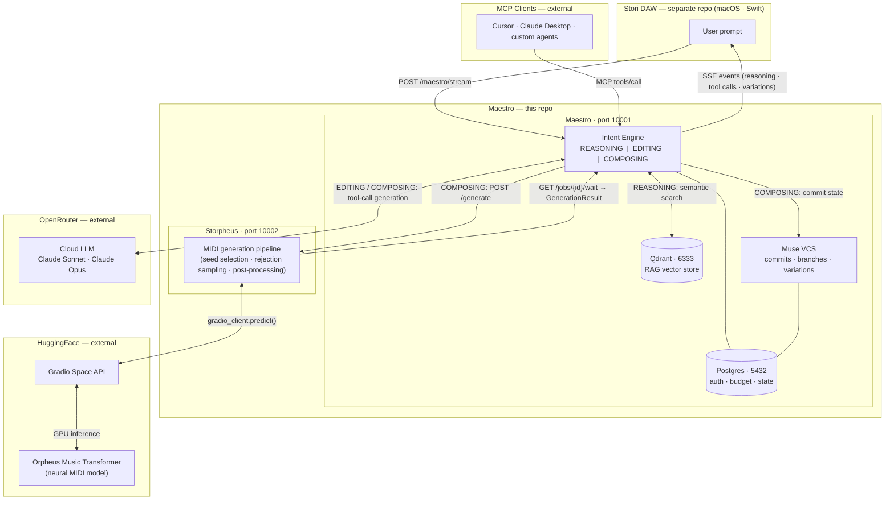

# Maestro

**The Runtime for AI-Native Music.**

------------------------------------------------------------------------

AI can generate notes.\
That is not the same thing as music.

Generative models produce output. They do not produce systems.\
They have no memory. No contract. No execution plan. No versioned
state.\
There is no deterministic path from intent to composition.

Maestro closes that gap.

Maestro is the orchestration runtime that turns structured musical
intent into reproducible, versioned, system-grade composition. It sits
between natural language and a real DAW. It does not generate music. It
governs how music is generated.

It is not a pipeline.\
It is not a wrapper around a model.\
It is a runtime.

Models produce notes.\
Maestro produces systems.

------------------------------------------------------------------------

## What Maestro Does

-   Classifies intent: reasoning, editing, or composing\
-   Parses structured Stori Prompts into validated execution plans\
-   Orchestrates multi-agent composition across instrument roles\
-   Calls generation backends (Storpheus) for MIDI output\
-   Commits composition state into Muse (versioned music DAG)\
-   Streams deterministic SSE events to the DAW in real time\
-   Exposes the same tool contract over HTTP streaming and MCP

Maestro ensures that every action taken by an agent is structured,
validated, and committed to state.

------------------------------------------------------------------------

## Why It Exists

Generative models are probabilistic functions over tokens.\
Music is structured time.

To build software-grade composition, you need more than output:

-   **Contracts** --- explicit schemas for composition intent\
-   **Determinism** --- structured plans governing execution\
-   **Replayability** --- every transition committed and traceable\
-   **Version Control** --- branches, checkpoints, variations\
-   **Orchestration** --- agents with defined roles and boundaries

Without infrastructure, AI music is a slot machine.\
With infrastructure, it becomes a system.

Maestro exists because the gap between generative output and reliable
music software is architectural --- and infrastructure is required to
close it.

------------------------------------------------------------------------

## Architecture



### Maestro

The runtime. Classifies intent, builds execution plans, orchestrates
agents, commits state, and streams deterministic updates.

### Storpheus

The generation backend. Wraps transformer-based MIDI generation behind a
deterministic HTTP interface.

### Muse

The version control layer for music. Every composition change is a
commit. Branches and variations are first-class primitives.

Maestro is the coordination layer between human intent, AI models, and
versioned musical state.

------------------------------------------------------------------------

## The Big Ideas

### Contract-Driven Composition

Every composition request is a structured artifact --- not a string.\
Maestro validates intent before generation begins. Plans are built
against defined schemas. Errors surface early. Execution is predictable.

Systems fail fast. Not silently.

------------------------------------------------------------------------

### Deterministic Generative Music

Generative models are stochastic. Maestro wraps them in deterministic
structure:

-   Validated execution plans\
-   Defined tool calls\
-   Committed state transitions

The LLM proposes.\
Maestro governs.

------------------------------------------------------------------------

### Multi-Agent Orchestration

Complex compositions require coordination across roles: rhythm, harmony,
melody, arrangement. Maestro runs instrument agents in parallel with
strict boundaries, then reconciles their output into a coherent whole.

No agent operates in isolation.\
No output is accepted without structure.

------------------------------------------------------------------------

### Version-Controlled Creativity

Muse treats music like source code. Every variation is a commit. Every
direction can branch. Every checkpoint can be restored.

Creativity becomes non-destructive.\
Exploration becomes architectural.

------------------------------------------------------------------------

### Reproducible AI

If you cannot reproduce an output, you do not have a system --- you have
a slot machine.

Maestro ensures every composition can be traced:

-   What intent was received\
-   What plan was generated\
-   What tools were called\
-   What state was committed

Reproducibility is not optional. It is foundational.

------------------------------------------------------------------------

## What Makes Maestro Different

Most AI music tools are pipelines:

Prompt → Model → MIDI → Done.

State is lost. Structure is implicit. There is no memory.

Maestro is a runtime.

It maintains state across requests.\
It versions every output.\
It exposes a stable tool contract.\
It negotiates with the DAW over a defined protocol.

It treats generative music the way serious software treats computation
--- with contracts, determinism, and observability.

The difference is not aesthetic.\
It is architectural.

------------------------------------------------------------------------

## Extensibility

Maestro is backend-agnostic. Generation engines are pluggable.
Capability negotiation is built in.

New models, new inference providers, and new generation strategies can
be integrated without changing the orchestration layer.

The tool contract is model-agnostic.\
The runtime remains stable.\
The infrastructure scales.

------------------------------------------------------------------------

## Quick Start

**Prerequisites:** Git + Docker

``` bash
git clone https://github.com/cgcardona/maestro.git
cd maestro
cp .env.example .env
docker compose up
```

Maestro runs at:

http://localhost:10001

Health check:

``` bash
curl http://localhost:10001/api/v1/health
```

See `/docs` for full configuration, deployment, and API reference.

------------------------------------------------------------------------

## Services

  Service     Port    Description
  ----------- ------- --------------------------------
  Maestro     10001   Orchestration runtime
  Storpheus   10002   Music generation backend
  Postgres    5432    Auth, budgets, committed state
  Qdrant      6333    Semantic retrieval

------------------------------------------------------------------------

## The Larger Vision

Maestro is not just a backend for music generation.

It is the runtime foundation for AI-native creative systems.

It turns generative capability into structured computation.\
It turns output into lineage.\
It turns prompts into reproducible systems.

Models generate notes.\
Maestro generates systems.

------------------------------------------------------------------------

**[Stori](https://stori.audio)** --- The Infinite Music Machine\
