# Maestro Stori Audio

**[Stori](https://stori.audio)** — the infinite music machine. The first DAW built from the ground up for **human-first and agent-driven workflows** — over MCP, in the same session. Think Cursor for music: one place where you and AI co-create. 🎶

**This repo is Maestro:** the backend and intent engine that powers that vision. It turns natural-language intent into tool calls, LLM reasoning, and streaming so the Stori app can compose, edit, and arrange music from a single prompt. Human-first and agent-driven (today) use the same architecture; see [docs/reference/architecture.md](docs/reference/architecture.md) for how that extends to headless Stori and agent swarms.

**Run environment:** Production runs on **Ubuntu in the cloud** inside Docker. The team develops on **macOS** using [Docker Desktop](https://docs.docker.com/desktop/install/mac-install/) for local dev (same stack as production). See [docs/guides/setup.md](docs/guides/setup.md).

---

## Quick start (local development)

**Prerequisites:** [Git](https://git-scm.com/), [Docker Desktop](https://docs.docker.com/desktop/install/mac-install/) (Mac) or Docker Engine + Compose (Linux).

```bash
# Clone the repo
git clone https://github.com/cgcardona/maestro.stori.audio.git
cd maestro.stori.audio

# Copy env and set required values
cp .env.example .env
# Edit .env: OPENROUTER_API_KEY, DB_PASSWORD (required; e.g. openssl rand -hex 16 for local), ACCESS_TOKEN_SECRET (openssl rand -hex 32), CORS_ORIGINS (required for browser/app; see .env.example).
# For local nginx: NGINX_CONF_DIR=conf.d-local

# Start the stack (Postgres, Qdrant, Storpheus, Maestro, nginx)
docker compose up
# Or: docker compose up -d   (detached)
```

**Verify:** Maestro is at **http://localhost:10001**. Health: `curl http://localhost:10001/api/v1/health`. Run tests: `docker compose exec maestro pytest tests/ -v` (see [docs/guides/testing.md](docs/guides/testing.md); prefer Docker so `ACCESS_TOKEN_SECRET` and DB are set). Stop: `docker compose down`.

More (troubleshooting, cloud, deploy): [docs/guides/setup.md](docs/guides/setup.md).

**Security:** For production, set strong secrets and CORS. See [docs/guides/security.md](docs/guides/security.md) for the go-live checklist and service exposure (Qdrant, DB, nginx SSL).

---

## Architecture

```mermaid
graph TB
    subgraph stori_repo ["Stori DAW  —  separate repo  (macOS · Swift)"]
        DAW["User prompt"]
    end

    subgraph mcp_clients ["MCP Clients  —  external"]
        MCP["Cursor · Claude Desktop · custom agents"]
    end

    subgraph this_repo ["maestro.stori.audio  —  this repo"]
        subgraph maestro ["Maestro  ·  port 10001"]
            IE["Intent Engine\nREASONING  |  EDITING  |  COMPOSING"]
            QD[("Qdrant  ·  6333\nRAG vector store")]
            PG[("Postgres  ·  5432\nauth · budget · state")]
        end

        subgraph storpheus ["Storpheus  ·  port 10002"]
            GEN["MIDI generation pipeline\n(seed selection · rejection sampling · post-processing)"]
        end
    end

    subgraph openrouter ["OpenRouter  —  external"]
        LLM["Cloud LLM\nClaude Sonnet · Claude Opus"]
    end

    subgraph huggingface ["HuggingFace  —  external"]
        GRADIO["Gradio Space API"]
        ORPHEUS["Orpheus Music Transformer\n(neural MIDI model)"]
        GRADIO <-->|"GPU inference"| ORPHEUS
    end

    DAW      -->|"POST /maestro/stream"| IE
    MCP      -->|"MCP tools/call"| IE
    IE       -->|"SSE events (reasoning · tool calls · variations)"| DAW

    IE       <-->|"REASONING: semantic search"| QD
    IE       ---  PG
    IE       <-->|"EDITING / COMPOSING: tool-call generation"| LLM

    IE       -->|"COMPOSING: POST /generate"| GEN
    GEN      -->|"GET /jobs/{id}/wait → GenerationResult"| IE
    GEN      <-->|"gradio_client.predict()"| GRADIO
```



**What we’re building** — One backend (Maestro), two entry points, one DAW. **Human in Stori**: user types in the app → Stori POSTs to Maestro → SSE stream of tool calls → Stori applies them. **Agent via MCP**: user (or script) talks to Cursor/Claude (or another MCP client) → client calls MCP tools → Maestro runs or forwards to the **same** Stori instance (the one connected at `/api/v1/mcp/daw`). So the same session can be driven from the app or from an external agent; human stays in the loop. See [docs/reference/architecture.md](docs/reference/architecture.md).

1. **Intent** — One of three:
   - **Reasoning** — Answer in natural language; RAG over docs.
   - **Editing** — LLM emits validated tool calls; client applies them.
   - **Composing** — Planner → executor runs tools; Storpheus/HF for music generation.
2. **LLM** — Intent classification, reasoning answers, editing tool-call generation, composing plans; only allowed tools per intent are exposed.
3. **Tools** — Create project, add tracks/regions, generate drums/bass/melody/chords, add notes, effects, automation, UI. Same tool set whether the caller is Stori (HTTP stream) or an MCP client. Full list and API: [docs/reference/api.md](docs/reference/api.md) (streaming, SSE events, models, and full MCP tool reference).
4. **Stream** — **Human-first:** the Stori app uses **HTTP**: POST `/api/v1/maestro/stream` → SSE (reasoning, tool_call, complete). You stay in the driver's seat; the app is a normal HTTP client. No MCP required.
5. **MCP** — (a) **Tool server** — Cursor, Claude, and other MCP clients list and call tools (HTTP or stdio). (b) **DAW WebSocket** — Stori connects at `/api/v1/mcp/daw`; when an MCP client calls a DAW tool, Maestro forwards it to that one registered DAW. Same session can be driven from the app or from an agent; human stays in the loop. See [docs/guides/integrate.md](docs/guides/integrate.md) and [docs/reference/api.md](docs/reference/api.md) (API + MCP tools).
6. **DAW** — One logical DAW (today: the human’s Stori instance). It receives tool calls either from the **stream** (when the user is in Stori) or from **Maestro forwarding** (when an MCP client invokes tools and Stori is connected via WebSocket).

Stori is **human-first:** AI is here to amplify your creativity, not replace you. The LLM orchestrates structured tools and music backends so you can compose, edit, and arrange faster.

---

## Documentation

| Doc | Description |
|-----|-------------|
| [docs/README.md](docs/README.md) | **Start here** — index |
| [docs/guides/setup.md](docs/guides/setup.md) | Local, cloud, config, deploy |
| [docs/guides/integrate.md](docs/guides/integrate.md) | Frontend, MCP, access (JWT) |
| [docs/reference/api.md](docs/reference/api.md) | API reference: maestro stream (SSE), event types, models, Muse VCS endpoints, and full MCP tool reference |
| [docs/reference/architecture.md](docs/reference/architecture.md) | Request flow, intent, human/agent, Muse VCS engine |
| [docs/architecture/muse_vcs.md](docs/architecture/muse_vcs.md) | Muse VCS — Git for music: commit, branch, merge, checkout, log graph |
| [docs/guides/testing.md](docs/guides/testing.md) | Run tests, intent QA, Muse E2E harness |
| [docs/guides/assets.md](docs/guides/assets.md) | Drum kits, soundfonts |
| [docs/guides/security.md](docs/guides/security.md) | Security audit, go-live checklist |

---

## Services

Ports use the **10001–10099** block (below the ephemeral range, avoids common dev ports like 3000/5000/8000). Maestro is 10001 so the main backend is first in the block.

| Service | Port | Description |
|---------|------|-------------|
| **Stori Maestro** | 10001 | This backend (FastAPI + MCP) |
| **Storpheus** | 10002 | AI music generation (Orpheus Music Transformer on HF) |
| **Cloud LLM** | — | OpenRouter |

---

## Tests

Run tests in the Maestro container (same as production):

```bash
docker compose exec maestro pytest tests/ -v
```

Coverage threshold is in `pyproject.toml` (`[tool.coverage.report]` → `fail_under`). For the canonical coverage command, see [docs/guides/testing.md](docs/guides/testing.md).

Prefer running tests in the container above. If you run pytest on the host instead, set `ACCESS_TOKEN_SECRET` in the environment so auth tests pass.

The team usually runs tests on the remote after rsync + container restart (see [docs/guides/setup.md](docs/guides/setup.md)).

---

## License

MIT — see [LICENSE](LICENSE).

---

**[Stori](https://stori.audio)** — the infinite music machine.
