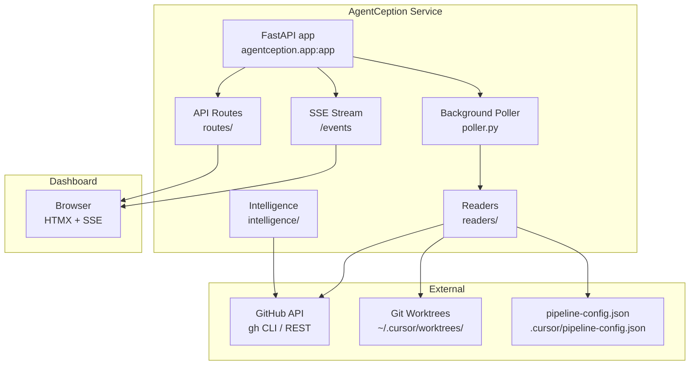

# AgentCeption

> **The infinite agent pipeline dashboard.** Monitor, control, and scale multi-tier AI agent workflows — in real time.

AgentCeption is a self-contained FastAPI + HTMX dashboard that turns any GitHub-based AI agent pipeline into a live, inspectable system. It polls your repository's worktrees, open issues, and pull requests to give you a single-pane view of every agent wave — from spawn to merge.

---

## Architecture



**Key design choices:**

- **Event-driven UI** — the browser subscribes to `/events` (SSE) and receives a full `PipelineState` snapshot every polling tick (default 5 s). No polling from the browser.
- **Reader layer** — `readers/` modules are pure async functions that fetch data from GitHub, the filesystem, and config files. They never mutate state.
- **Intelligence layer** — `intelligence/` modules analyse the pipeline state to surface A/B test results, DAG ordering, scaling recommendations, and guard-rail violations.
- **Config-first multi-repo** — switch the monitored repository by editing `pipeline-config.json`; no code changes needed.

---

## Quick Start

```bash
# 1. Install
pip install -e agentception/   # from repo root, or:
pip install agentception        # once published to PyPI

# 2. Configure (optional — defaults work for local dev)
export AC_REPO_DIR=/path/to/your/repo
export AC_GH_REPO=owner/repo-name

# 3. Launch
agentception
# → http://localhost:7777
```

That's it. The dashboard auto-refreshes every 5 seconds.

---

## Configuration Reference

AgentCeption is configured via environment variables (prefix `AC_`) or via the `pipeline-config.json` file in your repository's `.cursor/` directory.

### Environment Variables

| Variable | Default | Description |
|---|---|---|
| `AC_REPO_DIR` | Current working directory | Absolute path to the repository root |
| `AC_WORKTREES_DIR` | `~/.cursor/worktrees/maestro` | Directory containing agent git worktrees |
| `AC_CURSOR_PROJECTS_DIR` | `~/.cursor/projects` | Cursor projects directory (for transcript reading) |
| `AC_GH_REPO` | `cgcardona/maestro` | GitHub repository slug (`owner/repo`) |
| `AC_POLL_INTERVAL_SECONDS` | `5` | How often the poller refreshes state |
| `AC_GITHUB_CACHE_SECONDS` | `10` | TTL for GitHub API response cache |
| `AC_HOST` | `0.0.0.0` | Bind host for the uvicorn server |
| `AC_PORT` | `7777` | Bind port for the uvicorn server |

### `pipeline-config.json` Schema

Place this file at `<your-repo>/.cursor/pipeline-config.json`:

```jsonc
{
  // Maximum Engineering VP agents active at once
  "max_eng_vps": 1,

  // Maximum QA VP agents active at once
  "max_qa_vps": 1,

  // Developer agents per VP
  "pool_size_per_vp": 4,

  // Ordered list of phase labels (controls wave sequencing)
  "active_labels_order": [
    "phase/0-scaffold",
    "phase/1-core",
    "phase/2-polish"
  ],

  // A/B testing configuration for role variants
  "ab_mode": {
    "enabled": false,
    "target_role": "python-developer",
    "variant_a_file": ".cursor/roles/python-developer.md",
    "variant_b_file": ".cursor/roles/python-developer-v2.md"
  },

  // Multi-repo support: list projects and set the active one
  "active_project": "my-project",
  "projects": [
    {
      "name": "my-project",
      "gh_repo": "owner/my-project",
      "repo_dir": "/path/to/my-project",
      "worktrees_dir": "~/.cursor/worktrees/my-project"
    }
  ]
}
```

When `active_project` is set, its `gh_repo`, `repo_dir`, and `worktrees_dir` override the environment-variable defaults. This is the primary mechanism for pointing AgentCeption at a new repository without touching env vars.

---

## Phase Overview

AgentCeption was built in six phases, each shipped as a labelled GitHub issue wave:

| Phase | Label | Features |
|---|---|---|
| 0 | `agentception/0-scaffold` | FastAPI app skeleton, SSE stream, poller loop, static dashboard shell |
| 1 | `agentception/1-controls` | Start/stop/pause wave controls, spawn next-wave button, agent kill switch |
| 2 | `agentception/2-telemetry` | Per-agent telemetry cards, transcript viewer, worktree diff viewer |
| 3 | `agentception/3-roles` | Role file management, role version history, A/B role assignment UI |
| 4 | `agentception/4-intelligence` | DAG ordering, guard-rail analysis, scaling advisor, A/B result comparison |
| 5 | `agentception/5-scaling` | VP auto-spawn, pool-size dynamic adjustment, wave concurrency controls |
| 6 | `agentception/6-generalization` | Multi-repo support, `pyproject.toml`, README, extraction procedure |

---

## Using AgentCeption with a New Repository

AgentCeption ships with a **pipeline template** that you can import into any GitHub repository using the template export/import feature (AC-602).

### Import a Template

```bash
# From within AgentCeption, navigate to:
# Settings → Templates → Import

# Or via the API:
curl -X POST http://localhost:7777/api/templates/import \
  -H "Content-Type: application/json" \
  -d '{
    "template_name": "standard-6-phase",
    "target_gh_repo": "owner/new-repo",
    "target_repo_dir": "/path/to/new-repo"
  }'
```

### Minimal Manual Setup

1. Copy `.cursor/pipeline-config.json` from this repo to your target repo, updating `gh_repo`, `repo_dir`, and `worktrees_dir`.
2. Create GitHub issue labels matching your `active_labels_order` entries.
3. Create role files at `.cursor/roles/<role-name>.md`.
4. Launch AgentCeption with `AC_REPO_DIR=/path/to/new-repo agentception`.

---

## Contributing

### Development Setup

```bash
git clone https://github.com/cgcardona/maestro
cd maestro/agentception

# Install in editable mode with dev dependencies
pip install -e ".[dev]"

# Run tests
pytest agentception/tests/ -v

# Type check
mypy agentception/
```

### Code Standards

- Every Python file starts with `from __future__ import annotations`.
- Type hints everywhere — no `# type: ignore` without a comment explaining why.
- `logging.getLogger(__name__)` — never `print()`.
- Async for all I/O operations.
- Black formatting.

### Adding a New Reader

1. Create `agentception/readers/my_reader.py` with an async function returning a typed Pydantic model.
2. Import and call it from `agentception/poller.py` in the `_fetch_state()` function.
3. Add the new field to `agentception/models.py` `PipelineState`.
4. Add tests in `agentception/tests/test_agentception_my_reader.py`.

### Running the Full Test Suite

```bash
pytest agentception/tests/ -v
```

### Submitting a PR

1. Branch from `dev`: `git checkout -b feat/my-feature`
2. Run mypy first: `mypy agentception/`
3. Run tests: `pytest agentception/tests/ -v`
4. Push and open a PR targeting `dev`.

---

## License

MIT — see [LICENSE](../LICENSE).
