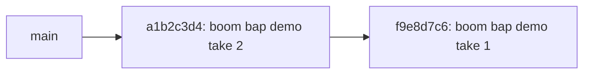

# Muse VCS — Musical Version Control System

> **Status:** Canonical Implementation Reference
> **E2E demo:** [`muse_e2e_demo.md`](muse_e2e_demo.md)

---

## What Muse Is

Muse is a persistent, Git-style version control system for musical compositions. It tracks every committed change as a variation in a DAG (directed acyclic graph), enabling:

- **Commit history** — every accepted variation is recorded with parent lineage
- **Branching** — multiple variations can diverge from the same parent
- **Three-way merge** — auto-merges non-conflicting changes, reports conflicts
- **Drift detection** — compares HEAD snapshot against the live DAW state (`git status`)
- **Checkout / time travel** — reconstruct any historical state via deterministic tool calls
- **Log graph** — serialize the full commit DAG as Swift-ready JSON

---

## Why Muse and not Git?

> *"Can't we just commit MIDI files to Git?"*

You can. And you'll immediately discover everything Git cannot tell you about music.

### The core problem: Git sees music as bytes, not music

`git diff` on a MIDI file produces binary noise. `git log` tells you "file changed." That's it. Git is a filesystem historian — it records *which bytes* changed, not *what happened musically*.

Music is **multidimensional** and **happens in time**. A single session commit might simultaneously change the key, the groove, the instrumentation, the dynamic arc, and the emotional character — dimensions that share zero representation in Git's diff model.

### What Muse can do that Git categorically cannot

| Question | Git | Muse |
|----------|-----|------|
| What key is this arrangement in? | ❌ | ✅ `muse key HEAD` |
| How did the chord progression change between commit 12 and commit 47? | ❌ | ✅ `muse diff HEAD~35 HEAD --harmonic` |
| When did the song modulate from Eb major to F minor? | ❌ | ✅ `muse find --harmony "key=F minor"` |
| Did the groove get tighter or looser over 200 commits? | ❌ | ✅ `muse groove-check HEAD~200 HEAD` |
| Find me all versions where the chorus had a string layer | ❌ | ✅ `muse find --structure "has=strings" --structure "section=chorus"` |
| Where does the main motif first appear, and how was it transformed? | ❌ | ✅ `muse motif track "main-theme"` |
| What was the arrangement before we cut the bridge? | ❌ | ✅ `muse arrange HEAD~10` |
| How musically similar are these two alternative mixes? | ❌ | ✅ `muse similarity mix-a mix-b` |
| "Find a melancholic minor-key version with sparse texture" | ❌ | ✅ `muse recall "melancholic minor sparse"` |
| What is the full musical state of this project for AI generation? | ❌ | ✅ `muse context --json` |

### Music is multidimensional — diffs should be too

When a producer changes a session, five things may change at once:

- **Harmonic** — a new chord substitution shifts the tension profile
- **Rhythmic** — the drummer's part gets slightly more swing
- **Structural** — a breakdown section is added before the final chorus
- **Dynamic** — the overall level is pushed 6dB louder in the chorus
- **Melodic** — the piano melody gets a new phrase in bar 7

Git records all of this as: *"beat.mid changed."*

Muse records all of this as five orthogonal dimensions, each independently queryable, diffable, and searchable across the full commit history.

### Muse as AI musical memory

This is where the difference is sharpest. An AI agent generating music needs to answer:

- What key are we in right now?
- What's the established chord progression?
- Which sections already have strings? Which don't?
- Has the energy been building or falling across the last 10 commits?
- What emotional arc are we maintaining?

`muse context --json` answers all of this in one call — a structured document containing the key, tempo, mode, chord progression, arrangement matrix, dynamic arc, emotional state, and 10-commit evolutionary history. An agent with this context makes musically coherent decisions. An agent without it is generating blind.

Git provides zero of this. Muse was built because musical creativity is multidimensional, happens in time, and deserves version control that understands music — not just files.

---

## Module Map

### CLI Entry Point

```
maestro/muse_cli/
├── __init__.py          — Package marker
├── app.py               — Typer application root (console script: `muse`)
├── errors.py            — Exit-code enum (0 success / 1 user / 2 repo / 3 internal) + exceptions
│                          MuseNotARepoError = RepoNotFoundError (public alias, issue #46)
├── _repo.py             — Repository detection (.muse/ directory walker)
│                          find_repo_root(), require_repo(), require_repo_root alias
├── repo.py              — Public re-export of _repo.py (canonical import surface, issue #46)
└── commands/
    ├── __init__.py
    ├── init.py           — muse init  ✅ fully implemented (--bare, --template, --default-branch added in issue #85)
    ├── status.py         — muse status  ✅ fully implemented (issue #44)
    ├── commit.py         — muse commit  ✅ fully implemented (issue #32)
    ├── log.py            — muse log    ✅ fully implemented (issue #33)
    ├── snapshot.py       — walk_workdir, hash_file, build_snapshot_manifest, compute IDs,
    │                        diff_workdir_vs_snapshot (added/modified/deleted/untracked sets)
    ├── models.py         — MuseCliCommit, MuseCliSnapshot, MuseCliObject, MuseCliTag (SQLAlchemy)
    ├── db.py             — open_session, upsert/get helpers, get_head_snapshot_manifest, find_commits_by_prefix
    ├── tag.py            — muse tag ✅ add/remove/list/search (issue #123)
    ├── merge_engine.py   — find_merge_base(), diff_snapshots(), detect_conflicts(),
    │                        apply_merge(), read/write_merge_state(), MergeState dataclass
    ├── checkout.py       — muse checkout (stub — issue #34)
    ├── merge.py          — muse merge   ✅ fast-forward + 3-way merge (issue #35)
    ├── remote.py         — muse remote (add, remove, rename, set-url, -v)
    ├── fetch.py          — muse fetch
    ├── push.py           — muse push
    ├── pull.py           — muse pull
    ├── clone.py          — muse clone
    ├── open_cmd.py       — muse open    ✅ macOS artifact preview (issue #45)
    ├── play.py           — muse play    ✅ macOS audio playback via afplay (issue #45)
    ├── export.py         — muse export  ✅ snapshot export to MIDI/JSON/MusicXML/ABC/WAV (issue #112)
    ├── find.py           — muse find   ✅ search commit history by musical properties (issue #114)
    └── ask.py            — muse ask     ✅ natural language query over commit history (issue #126)
```

`maestro/muse_cli/export_engine.py` — `ExportFormat`, `MuseExportOptions`, `MuseExportResult`,
`StorpheusUnavailableError`, `filter_manifest`, `export_snapshot`, and per-format handlers
(`export_midi`, `export_json`, `export_musicxml`, `export_abc`, `export_wav`). See
`## muse export` section below.

`maestro/muse_cli/artifact_resolver.py` — `resolve_artifact_async()` / `resolve_artifact()`:
resolves a user-supplied path-or-commit-ID to a concrete `pathlib.Path` (see below).

The CLI delegates to existing `maestro/services/muse_*.py` service modules. Stub subcommands print "not yet implemented" and exit 0.

---

## `muse tag` — Music-Semantic Tagging

`muse tag` attaches free-form music-semantic labels to commits, enabling expressive search across
the composition history.

### Subcommands

| Command | Description |
|---------|-------------|
| `muse tag add <tag> [<commit>]` | Attach a tag (defaults to HEAD) |
| `muse tag remove <tag> [<commit>]` | Remove a tag (defaults to HEAD) |
| `muse tag list [<commit>]` | List all tags on a commit (defaults to HEAD) |
| `muse tag search <tag>` | Find commits carrying the tag; use trailing `:` for namespace prefix search |

### Tag namespaces

Tags are free-form strings. Conventional namespace prefixes aid search:

| Namespace | Example | Meaning |
|-----------|---------|---------|
| `emotion:` | `emotion:melancholic` | Emotional character |
| `stage:` | `stage:rough-mix` | Production stage |
| `ref:` | `ref:beatles` | Reference track or source |
| `key:` | `key:Am` | Musical key |
| `tempo:` | `tempo:120bpm` | Tempo annotation |
| *(free-form)* | `lo-fi` | Any other label |

### Storage

Tags are stored in the `muse_cli_tags` table (PostgreSQL):

```
muse_cli_tags
  tag_id     UUID PK
  repo_id    String(36)   — scoped per local repo
  commit_id  String(64)   — FK → muse_cli_commits.commit_id (CASCADE DELETE)
  tag        Text
  created_at DateTime
```

Tags are scoped to a `repo_id` so independent local repositories use separate tag spaces.
A commit can carry multiple tags. Adding the same tag twice is a no-op (idempotent).

---

## `muse merge` — Fast-Forward and 3-Way Merge

`muse merge <branch>` integrates another branch into the current branch.

**Usage:**
```bash
muse merge <branch> [OPTIONS]
```

**Flags:**

| Flag | Type | Default | Description |
|------|------|---------|-------------|
| `--no-ff` | flag | off | Force a merge commit even when fast-forward is possible. Preserves branch topology in the history graph. |
| `--squash` | flag | off | Collapse all commits from `<branch>` into one new commit on the current branch. The result has a single parent and no `parent2_commit_id` — not a merge commit in the DAG. |
| `--strategy TEXT` | string | none | Resolution shortcut: `ours` keeps all files from the current branch; `theirs` takes all files from the target branch. Both skip conflict detection. |
| `--continue` | flag | off | Finalize a paused merge after resolving all conflicts with `muse resolve`. |

### Algorithm

1. **Guard** — If `.muse/MERGE_STATE.json` exists, a merge is already in progress. Exit 1 with: *"Merge in progress. Resolve conflicts and run `muse merge --continue`."*
2. **Resolve commits** — Read HEAD commit ID for the current branch and the target branch from their `.muse/refs/heads/<branch>` ref files.
3. **Find merge base** — BFS over the commit graph to find the LCA (Lowest Common Ancestor) of the two HEAD commits. Both `parent_commit_id` and `parent2_commit_id` are traversed (supporting existing merge commits).
4. **Fast-forward** — If `base == ours` *and* `--no-ff` is not set *and* `--squash` is not set, the target is strictly ahead of current HEAD. Move the current branch pointer to `theirs` without creating a new commit.
5. **Already up-to-date** — If `base == theirs`, current branch is already ahead. Exit 0.
6. **Strategy shortcut** — If `--strategy ours` or `--strategy theirs` is set, apply the resolution immediately before conflict detection and proceed to create a merge commit. No conflict state is written.
7. **3-way merge** — When branches have diverged and no strategy is set:
   - Compute `diff(base → ours)` and `diff(base → theirs)` at file-path granularity.
   - Detect conflicts: paths changed on *both* sides since the base.
   - If **no conflicts**: auto-merge (take the changed side for each path), create a merge commit with two parent IDs, advance the branch pointer.
   - If **conflicts**: write `.muse/MERGE_STATE.json` and exit 1 with a conflict summary.
8. **Squash** — If `--squash` is set, create a single commit with a combined tree but only `parent_commit_id` = current HEAD. `parent2_commit_id` is `None`.

### `MERGE_STATE.json` Schema

Written on conflict, read by `muse status` and `muse commit` to block further operations:

```json
{
    "base_commit":    "abc123...",
    "ours_commit":    "def456...",
    "theirs_commit":  "789abc...",
    "conflict_paths": ["beat.mid", "lead.mp3"],
    "other_branch":   "feature/experiment"
}
```

All fields except `other_branch` are required. `conflict_paths` is sorted alphabetically.

### Merge Commit

A successful 3-way merge (or `--no-ff` or `--strategy`) creates a commit with:
- `parent_commit_id` = `ours_commit_id` (current branch HEAD at merge time)
- `parent2_commit_id` = `theirs_commit_id` (target branch HEAD)
- `snapshot_id` = merged manifest (non-conflicting changes from both sides)
- `message` = `"Merge branch '<branch>' into <current_branch>"` (strategy appended if set)

### Squash Commit

`--squash` creates a commit with:
- `parent_commit_id` = `ours_commit_id` (current branch HEAD)
- `parent2_commit_id` = `None` — not a merge commit in the graph
- `snapshot_id` = same merged manifest as a regular merge would produce
- `message` = `"Squash merge branch '<branch>' into <current_branch>"`

Use squash when you want to land a feature branch as one clean commit without
polluting `muse log` with intermediate work-in-progress commits.

### Path-Level Granularity (MVP)

This merge implementation operates at **file-path level**. Two commits that modify the same file path (even if the changes are disjoint within the file) are treated as a conflict. Note-level merging (music-aware diffs inside MIDI files) is a future enhancement reserved for the existing `maestro/services/muse_merge.py` engine.

### Agent Use Case

- **`--no-ff`**: Use when building a structured session history is important (e.g., preserving that a feature branch existed). The branch topology is visible in `muse log --graph`.
- **`--squash`**: Use after iterative experimentation on a feature branch to produce one atomic commit for review. Equivalent to "clean up before sharing."
- **`--strategy ours`**: Use to quickly resolve a conflict situation where the current branch's version is definitively correct (e.g., a hotfix already applied to main).
- **`--strategy theirs`**: Use to accept all incoming changes wholesale (e.g., adopting a new arrangement from a collaborator).

---

## Artifact Resolution (`artifact_resolver.py`)

`resolve_artifact_async(path_or_commit_id, root, session)` resolves a user-supplied
string to a concrete `pathlib.Path` in this priority order:

1. **Direct filesystem path** — if the argument exists on disk, return it as-is.
   No DB query is needed.
2. **Relative to `muse-work/`** — if `<root>/muse-work/<arg>` exists, return that.
3. **Commit-ID prefix** — if the argument is 4–64 lowercase hex characters:
   - Query `muse_cli_commits` for commits whose `commit_id` starts with the prefix.
   - If exactly one match: load its `MuseCliSnapshot` manifest.
   - If the snapshot has one file: resolve `<root>/muse-work/<file>`.
   - If the snapshot has multiple files: prompt the user to select one interactively.
   - Exit 1 if the prefix is ambiguous (> 1 commit) or the file no longer exists
     in the working tree.

### Why files must still exist in `muse-work/`

Muse stores **metadata** (file paths → sha256 hashes) in Postgres, not the raw
bytes. The actual content lives only on the local filesystem in `muse-work/`.
If a user deletes or overwrites a file after committing, the snapshot manifest
knows what _was_ there but the bytes are gone. `muse open` / `muse play` will
exit 1 with a clear error in that case.

---

## `muse status` Output Formats

`muse status` operates in several modes depending on repository state and active flags.

**Usage:**
```bash
muse status [OPTIONS]
```

**Flags:**

| Flag | Short | Description |
|------|-------|-------------|
| `--short` | `-s` | Condensed one-line-per-file output (`M`=modified, `A`=added, `D`=deleted, `?`=untracked) |
| `--branch` | `-b` | Emit only the branch and tracking info line |
| `--porcelain` | — | Machine-readable `XY path` format, stable for scripting (like `git status --porcelain`) |
| `--sections` | — | Group output by first path component under `muse-work/` (musical sections) |
| `--tracks` | — | Group output by first path component under `muse-work/` (instrument tracks) |

Flags are combinable where it makes sense: `--short --sections` emits short-format codes grouped under section headers; `--porcelain --tracks` emits porcelain codes grouped under track headers.

### Mode 1 — Clean working tree

No changes since the last commit:

```
On branch main
nothing to commit, working tree clean
```

With `--porcelain` (clean): emits only the branch header `## main`.

### Mode 2 — Uncommitted changes

Files have been modified, added, or deleted relative to the last snapshot:

**Default (verbose):**
```
On branch main

Changes since last commit:
  (use "muse commit -m <msg>" to record changes)

        modified:   beat.mid
        new file:   lead.mp3
        deleted:    scratch.mid
```

- `modified:` — file exists in both the last snapshot and `muse-work/` but its sha256 hash differs.
- `new file:` — file is present in `muse-work/` but absent from the last committed snapshot.
- `deleted:` — file was in the last committed snapshot but is no longer present in `muse-work/`.

**`--short`:**
```
On branch main
M beat.mid
A lead.mp3
D scratch.mid
```

**`--porcelain`:**
```
## main
 M beat.mid
 A lead.mp3
 D scratch.mid
```

The two-character code column follows the git porcelain convention: first char = index, second = working tree. Since Muse tracks working-tree changes only, the first char is always a space.

**`--sections` (group by musical section directory):**
```
On branch main

## chorus
	modified:   chorus/bass.mid

## verse
	modified:   verse/bass.mid
	new file:   verse/drums.mid
```

**`--tracks` (group by instrument track directory):**
```
On branch main

## bass
	modified:   bass/verse.mid

## drums
	new file:   drums/chorus.mid
```

Files not under a subdirectory appear under `## (root)` when grouping is active.

**Combined `--short --sections`:**
```
On branch main
## chorus
M chorus/bass.mid

## verse
M verse/bass.mid
```

### Mode 3 — In-progress merge

When `.muse/MERGE_STATE.json` exists (written by `muse merge` when conflicts are detected):

```
On branch main

You have unmerged paths.
  (fix conflicts and run "muse commit")

Unmerged paths:
        both modified:   beat.mid
        both modified:   lead.mp3
```

Resolve conflicts manually, then `muse commit` to record the merge.

### No commits yet

On a branch that has never been committed to:

```
On branch main, no commits yet

Untracked files:
  (use "muse commit -m <msg>" to record changes)

        beat.mid
```

If `muse-work/` is empty or missing: `On branch main, no commits yet` (single line).

### `--branch` only

Emits only the branch line regardless of working-tree state:

```
On branch main
```

This is useful when a script needs the branch name without triggering a full DB round-trip for the diff.

### Agent use case

An AI music agent uses `muse status` to:

- **Detect drift:** `muse status --porcelain` gives a stable, parseable list of all changed files before deciding whether to commit.
- **Section-aware generation:** `muse status --sections` reveals which musical sections have uncommitted changes, letting the agent focus generation on modified sections only.
- **Track inspection:** `muse status --tracks` shows which instrument tracks differ from HEAD, useful when coordinating multi-track edits across agent turns.
- **Pre-commit guard:** `muse status --short` gives a compact human-readable summary to include in agent reasoning traces before committing.

### Implementation

| Layer | File | Responsibility |
|-------|------|----------------|
| Command | `maestro/muse_cli/commands/status.py` | Typer callback + `_status_async` |
| Diff engine | `maestro/muse_cli/snapshot.py` | `diff_workdir_vs_snapshot()` |
| Merge reader | `maestro/muse_cli/merge_engine.py` | `read_merge_state()` / `MergeState` |
| DB helper | `maestro/muse_cli/db.py` | `get_head_snapshot_manifest()` |

`_status_async` is the injectable async core (tested directly without a running server).
Exit codes: 0 success, 2 outside a Muse repo, 3 internal error.

---

## `muse log` Output Formats

### Default (`git log` style)

```
commit a1b2c3d4e5f6...  (HEAD -> main)
Parent: f9e8d7c6
Date:   2026-02-27 17:30:00

    boom bap demo take 1

commit f9e8d7c6...
Date:   2026-02-27 17:00:00

    initial take
```

Commits are printed newest-first.  The first commit (root) has no `Parent:` line.

### `--graph` mode

Reuses `maestro.services.muse_log_render.render_ascii_graph` by adapting `MuseCliCommit` rows to the `MuseLogGraph`/`MuseLogNode` dataclasses the renderer expects.

```
* a1b2c3d4 boom bap demo take 1 (HEAD)
* f9e8d7c6 initial take
```

Merge commits (two parents) require `muse merge` (issue #35) — `parent2_commit_id` is reserved for that iteration.

### `--oneline` mode

One line per commit: `<short_id> [HEAD marker] <message>`.

```
a1b2c3d4 (HEAD -> main) boom bap demo take 1
f9e8d7c6 initial take
```

### `--stat` mode

Standard header per commit followed by per-file change lines and a totals summary.

```
commit a1b2c3d4  (HEAD -> main)
Date:   2026-02-27 17:30:00

    boom bap demo take 1

 muse-work/drums/jazz.mid | added
 muse-work/bass/old.mid | removed
 2 files changed, 1 added, 1 removed
```

### `--patch` / `-p` mode

Standard header per commit followed by path-level diff blocks showing which files
were added, removed, or modified.  This is a structural (path-level) diff since
Muse tracks MIDI/audio blobs, not line-diffable text.

```
commit a1b2c3d4  (HEAD -> main)
Date:   2026-02-27 17:30:00

    boom bap demo take 1

--- /dev/null
+++ muse-work/drums/jazz.mid
--- muse-work/bass/old.mid
+++ /dev/null
```

### Flags

| Flag | Default | Description |
|------|---------|-------------|
| `--limit N` / `-n N` | 1000 | Cap the walk at N commits |
| `--graph` | off | ASCII DAG mode |
| `--oneline` | off | One line per commit: `<short_id> [HEAD] <message>` |
| `--stat` | off | Show file-change statistics per commit |
| `--patch` / `-p` | off | Show path-level diff per commit |
| `--since DATE` | — | Only commits after DATE (ISO or "2 weeks ago") |
| `--until DATE` | — | Only commits before DATE (ISO or "2 weeks ago") |
| `--author TEXT` | — | Case-insensitive substring match on author field |
| `--emotion TEXT` | — | Filter by `emotion:<TEXT>` tag (e.g. `melancholic`) |
| `--section TEXT` | — | Filter by `section:<TEXT>` tag (e.g. `chorus`) |
| `--track TEXT` | — | Filter by `track:<TEXT>` tag (e.g. `drums`) |

All flags are combinable. Filters narrow the commit set; output mode flags control formatting.
Priority when multiple output modes specified: `--graph` > `--oneline` > `--stat` > `--patch` > default.

### Date parsing

`--since` and `--until` accept:
- ISO dates: `2026-01-15`, `2026-01-15T12:00:00`, `2026-01-15 12:00:00`
- Relative: `N days ago`, `N weeks ago`, `N months ago`, `N years ago`, `yesterday`, `today`

### Music-native tag filters

`--emotion`, `--section`, and `--track` filter by tags stored in `muse_cli_tags`.
Tags follow the `emotion:<value>`, `section:<value>`, `track:<value>` naming
convention.  Multiple tag filters are AND-combined — a commit must carry all
specified tags to appear in the output.

**Agent use case:** An agent debugging a melancholic chorus can run
`muse log --emotion melancholic --section chorus` to find exactly when that
emotional character was committed, then `muse show <commit>` to inspect the
snapshot or `muse revert <commit>` to undo it.

### Result type

`parse_date_filter(text: str) -> datetime` — converts a human date string to
UTC-aware `datetime`. Raises `ValueError` on unrecognised formats.

`CommitDiff` — fields: `added: list[str]`, `removed: list[str]`,
`changed: list[str]`, `total_files: int` (computed property).

---

---

## `muse arrange [<commit>]` — Arrangement Map (issue #115)

`muse arrange` displays the **arrangement matrix**: which instruments are active in which musical sections for a given commit.  This is the single most useful command for an AI orchestration agent — before generating a new string part, the agent can run `muse arrange --format json HEAD` to see exactly which sections already have strings, preventing doubling mistakes and enabling coherent orchestration decisions.

### Path Convention

Files committed to Muse must follow the three-level path convention to participate in the arrangement map:

```
muse-work/<section>/<instrument>/<filename>
```

| Level | Example | Description |
|-------|---------|-------------|
| `<section>` | `intro`, `verse`, `chorus`, `bridge`, `outro` | Musical section name (normalised to lowercase) |
| `<instrument>` | `drums`, `bass`, `strings`, `piano`, `vocals` | Instrument / track name |
| `<filename>` | `beat.mid`, `pad.mid` | The actual file |

Files with fewer than three path components are excluded from the arrangement map (they carry no section metadata).

Section aliases are normalised: `pre-chorus`, `pre_chorus`, and `prechoruse` all map to `prechorus`.

### Output Formats

**Text (default)**:

```
Arrangement Map — commit abc1234

            Intro  Verse  Chorus  Bridge  Outro
drums       ████   ████   ████    ████    ████
bass        ░░░░   ████   ████    ████    ████
piano       ████   ░░░░   ████    ░░░░    ████
strings     ░░░░   ░░░░   ████    ████    ░░░░
```

`████` = active (at least one file for that section/instrument pair).
`░░░░` = inactive (no files).

**JSON (`--format json`)** — structured, AI-agent-consumable:

```json
{
  "commit_id": "abc1234...",
  "sections": ["intro", "verse", "chorus", "bridge", "outro"],
  "instruments": ["bass", "drums", "piano", "strings"],
  "arrangement": {
    "drums": { "intro": true, "verse": true, "chorus": true },
    "strings": { "intro": false, "verse": false, "chorus": true }
  }
}
```

**CSV (`--format csv`)** — spreadsheet-ready rows with `0`/`1` cells.

## `muse describe` — Structured Musical Change Description

`muse describe [<commit>] [OPTIONS]` compares a commit against its parent (or two commits via `--compare`) and outputs a structured description of what changed at the snapshot level.

### Output example (standard depth)

```
Commit abc1234: "Add piano melody to verse"
Changed files: 2 (beat.mid, keys.mid)
Dimensions analyzed: structural (2 files modified)
Note: Full harmonic/melodic analysis requires muse harmony and muse motif (planned)
```

### Flags

| Flag | Default | Description |
|------|---------|-------------|
| `[COMMIT]` | `HEAD` | Target commit: HEAD, branch name, or commit-ID prefix |
| `--section TEXT` | none | Show only a specific section's instrumentation |
| `--track TEXT` | none | Show only a specific instrument's section participation |
| `--compare A --compare B` | — | Diff two arrangements (show added/removed cells) |
| `--density` | off | Show byte-size total per cell instead of binary active/inactive |
| `--format text\|json\|csv` | `text` | Output format |

### Compare Mode (`--compare`)

```
Arrangement Diff — abc1234 → def5678

            Intro  Verse  Chorus
drums        ████   ████   ████
strings     ░░░░   ░░░░  +████
piano       ████   ░░░░  -████
```

`+████` = cell added in commit-b.
`-████` = cell removed in commit-b.

### Density Mode (`--density`)

Each cell shows the total byte size of all files for that (section, instrument) pair.  Byte size correlates with note density for MIDI files and serves as a useful heuristic for AI orchestration agents:

```
            Intro   Verse   Chorus
drums       4,096   3,200   5,120
bass            -   1,024   2,048
```
| `<commit>` (positional) | HEAD | Commit to describe |
| `--compare A B` | — | Compare commit A against commit B explicitly |
| `--depth brief\|standard\|verbose` | `standard` | Output verbosity |
| `--dimensions TEXT` | — | Comma-separated dimension labels (informational, passed through to output) |
| `--json` | off | Output as JSON |
| `--auto-tag` | off | Add a heuristic tag based on change scope |

### Depth modes

| Depth | Output |
|-------|--------|
| `brief` | One-line: `Commit <id>: N file changes` |
| `standard` | Message, changed files list, inferred dimensions, LLM note |
| `verbose` | Full commit ID, parent ID, per-file M/A/D markers, dimensions |

### Implementation

| Layer | File | Responsibility |
|-------|------|----------------|
| Service | `maestro/services/muse_arrange.py` | `build_arrangement_matrix()`, diff, renderers |
| Command | `maestro/muse_cli/commands/arrange.py` | Typer callback + `_arrange_async` |
| App | `maestro/muse_cli/app.py` | Registration under `arrange` subcommand |

`_arrange_async` is fully injectable for unit tests (accepts a `root: pathlib.Path` and `session: AsyncSession`).

Exit codes: `0` success, `1` user error (unknown format, missing reference, ambiguous prefix), `2` outside a Muse repo, `3` internal error.

### Named Result Types

See `docs/reference/type_contracts.md`:
- `ArrangementCell` — per (section, instrument) data
- `ArrangementMatrix` — full matrix for one commit
- `ArrangementDiffCell` — change status for one cell
- `ArrangementDiff` — full diff between two matrices
| Command | `maestro/muse_cli/commands/describe.py` | Typer callback + `_describe_async` |
| Diff engine | `maestro/muse_cli/commands/describe.py` | `_diff_manifests()` |
| Renderers | `maestro/muse_cli/commands/describe.py` | `_render_brief/standard/verbose/result` |
| DB helpers | `maestro/muse_cli/db.py` | `get_commit_snapshot_manifest()` |

`_describe_async` is the injectable async core (tested directly without a running server).  Exit codes: 0 success, 1 user error (bad commit ID or wrong `--compare` count), 2 outside a Muse repo, 3 internal error.

**Result type:** `DescribeResult` (class) — fields: `commit_id` (str), `message` (str), `depth` (DescribeDepth), `parent_id` (str | None), `compare_commit_id` (str | None), `changed_files` (list[str]), `added_files` (list[str]), `removed_files` (list[str]), `dimensions` (list[str]), `auto_tag` (str | None). Methods: `.file_count()` → int, `.to_dict()` → dict[str, object]. See `docs/reference/type_contracts.md § DescribeResult`.

**Agent use case:** Before generating new material, an agent calls `muse describe --json` to understand what changed in the most recent commit. If a bass and melody file were both modified, the agent knows a harmonic rewrite occurred and adjusts generation accordingly. `--auto-tag` provides a quick `minor-revision` / `major-revision` signal without full MIDI analysis.

> **Planned enhancement:** Full harmonic, melodic, and rhythmic analysis (chord progression diffs, motif tracking, groove scoring) is tracked as a follow-up. Current output is purely structural — file-level snapshot diffs with no MIDI parsing.

---

## `muse export` — Export a Snapshot to External Formats

`muse export [<commit>] --format <format>` exports a Muse snapshot to a
file format usable outside the DAW.  This is a **read-only** operation —
no commit is created and no DB writes occur.  Given the same commit ID and
format, the output is always identical (deterministic).

### Usage

```
muse export [<commit>] --format <format> [OPTIONS]

Arguments:
  <commit>          Short commit ID prefix (default: HEAD).

Options:
  --format, -f      Target format (required): midi | json | musicxml | abc | wav
  --output, -o      Destination path (default: ./exports/<commit8>.<format>)
  --track TEXT      Export only files whose path contains TEXT (substring match).
  --section TEXT    Export only files whose path contains TEXT (substring match).
  --split-tracks    Write one file per MIDI track (MIDI only).
```

### Supported Formats

| Format     | Extension | Description |
|------------|-----------|-------------|
| `midi`     | `.mid`    | Copy raw MIDI files from the snapshot (lossless, native). |
| `json`     | `.json`   | Structured JSON index of snapshot files (AI/tooling consumption). |
| `musicxml` | `.xml`    | MusicXML for notation software (MuseScore, Sibelius, etc.). |
| `abc`      | `.abc`    | ABC notation for folk/traditional music tools. |
| `wav`      | `.wav`    | Audio render via Storpheus (requires Storpheus running). |

### Examples

```bash
# Export HEAD snapshot as MIDI
muse export --format midi --output /tmp/my-song.mid

# Export only the piano track from a specific commit
muse export a1b2c3d4 --format midi --track piano

# Export the chorus section as MusicXML
muse export --format musicxml --section chorus

# Export all tracks as separate MIDI files
muse export --format midi --split-tracks

# Export JSON note structure
muse export --format json --output /tmp/snapshot.json

# WAV render (Storpheus must be running)
muse export --format wav
```

### Implementation

| Component | Location |
|-----------|----------|
| CLI command | `maestro/muse_cli/commands/export.py` |
| Format engine | `maestro/muse_cli/export_engine.py` |
| Tests | `tests/muse_cli/test_export.py` |

`export_engine.py` provides:

- `ExportFormat` — enum of supported formats.
- `MuseExportOptions` — frozen dataclass with export settings.
- `MuseExportResult` — result dataclass listing written paths.
- `StorpheusUnavailableError` — raised when WAV export is attempted
  but Storpheus is unreachable (callers surface a clean error message).
- `filter_manifest()` — applies `--track` / `--section` filters.
- `export_snapshot()` — top-level dispatcher.
- Format handlers: `export_midi`, `export_json`, `export_musicxml`, `export_abc`, `export_wav`.
- MIDI conversion helpers: `_midi_to_musicxml`, `_midi_to_abc` (minimal, best-effort).

### WAV Export and Storpheus Dependency

`--format wav` delegates audio rendering to the Storpheus service
(port 10002).  Before attempting any conversion, `export_wav` performs
a synchronous health check against `GET /health`.  If Storpheus is not
reachable or returns a non-200 response, `StorpheusUnavailableError` is
raised and the CLI exits with a clear human-readable error:

```
❌ WAV export requires Storpheus.
Storpheus is not reachable at http://localhost:10002: Connection refused
Start Storpheus (docker compose up storpheus) and retry.
```

### Filter Semantics

`--track` and `--section` are **case-insensitive substring matches** against
the full relative path of each file in the snapshot manifest.  Both filters
are applied with AND semantics: a file must match all provided filters to be
included.

```
manifest:
  chorus/piano/take1.mid
  verse/piano/take1.mid
  chorus/bass/take1.mid

--track piano → chorus/piano/take1.mid, verse/piano/take1.mid
--section chorus → chorus/piano/take1.mid, chorus/bass/take1.mid
--track piano --section chorus → chorus/piano/take1.mid
```

### Postgres State

Export is read-only.  It reads `muse_cli_commits` and `muse_cli_snapshots`
but writes nothing to the database.

---


## Commit Data Model

`muse commit` persists three content-addressed table types to Postgres:

### `muse_cli_objects` — File blobs (sha256-keyed)

| Column | Type | Description |
|--------|------|-------------|
| `object_id` | `String(64)` PK | `sha256(file_bytes)` hex digest |
| `size_bytes` | `Integer` | Raw file size |
| `created_at` | `DateTime(tz=True)` | Wall-clock insert time |

Objects are deduplicated across commits: the same file committed on two branches is stored exactly once.

### `muse_cli_snapshots` — Snapshot manifests

| Column | Type | Description |
|--------|------|-------------|
| `snapshot_id` | `String(64)` PK | `sha256(sorted("path:object_id" pairs))` |
| `manifest` | `JSON` | `{rel_path: object_id}` mapping |
| `created_at` | `DateTime(tz=True)` | Wall-clock insert time |

Two identical working trees always produce the same `snapshot_id`.

### `muse_cli_commits` — Commit history

| Column | Type | Description |
|--------|------|-------------|
| `commit_id` | `String(64)` PK | Deterministic sha256 (see below) |
| `repo_id` | `String(36)` | UUID from `.muse/repo.json` |
| `branch` | `String(255)` | Branch name at commit time |
| `parent_commit_id` | `String(64)` nullable | Previous HEAD commit on branch |
| `snapshot_id` | `String(64)` FK | Points to the snapshot row |
| `message` | `Text` | User-supplied commit message (may include Co-authored-by trailers) |
| `author` | `String(255)` | Reserved (empty for MVP) |
| `committed_at` | `DateTime(tz=True)` | Timestamp used in hash derivation |
| `created_at` | `DateTime(tz=True)` | Wall-clock DB insert time |
| `metadata` | `JSON` nullable | Extensible music-domain annotations (see below) |

**`metadata` JSON blob — current keys:**

| Key | Type | Set by |
|-----|------|--------|
| `section` | `string` | `muse commit --section` |
| `track` | `string` | `muse commit --track` |
| `emotion` | `string` | `muse commit --emotion` |
| `tempo_bpm` | `float` | `muse tempo --set` |

All keys are optional and co-exist in the same blob.  Absent keys are simply not present (not `null`).  Future music-domain annotations extend this blob without schema migrations.

### ID Derivation (deterministic)

```
object_id   = sha256(file_bytes)
snapshot_id = sha256("|".join(sorted(f"{path}:{oid}" for path, oid in manifest.items())))
commit_id   = sha256(
                "|".join(sorted(parent_ids))
                + "|" + snapshot_id
                + "|" + message
                + "|" + committed_at.isoformat()
              )
```

Given the same working tree state, message, and timestamp two machines produce identical IDs. `sorted()` ensures insertion-order independence for both snapshot manifests and parent lists.

---

## Local Repository Structure (`.muse/`)

`muse init` creates the following layout in the current working directory:

```
.muse/
  repo.json          Repo identity: repo_id (UUID), schema_version, created_at[, bare]
  HEAD               Current branch pointer, e.g. "refs/heads/main"
  config.toml        [core] (bare repos only), [user], [auth], [remotes] configuration
  objects/           Local content-addressed object store (written by muse commit)
    <object_id>      One file per unique object (sha256 of file bytes)
  refs/
    heads/
      main           Commit ID of branch HEAD (empty = no commits yet)
      <branch>       One file per branch
muse-work/           Working-tree root (absent for --bare repos)
```

### `muse init` flags

| Flag | Type | Default | Description |
|------|------|---------|-------------|
| `--bare` | flag | off | Initialise as a bare repository — no `muse-work/` checkout. Writes `bare = true` into `repo.json` and `[core] bare = true` into `config.toml`. Used for Muse Hub remote/server-side repos. |
| `--template PATH` | path | — | Copy the contents of *PATH* into `muse-work/` after initialisation. Lets studios pre-populate a standard folder structure (e.g. `drums/`, `bass/`, `keys/`, `vocals/`) for every new project. Ignored when `--bare` is set. |
| `--default-branch BRANCH` | text | `main` | Name of the initial branch. Sets `HEAD → refs/heads/<BRANCH>` and creates the matching ref file. |
| `--force` | flag | off | Re-initialise even if `.muse/` already exists. Preserves the existing `repo_id` so remote-tracking metadata stays coherent. Does not overwrite `config.toml`. |

**Bare repository layout** (`--bare`):

```
.muse/
  repo.json          … bare = true …
  HEAD               refs/heads/<branch>
  refs/heads/<branch>
  config.toml        [core] bare = true  + [user] [auth] [remotes] stubs
```

Bare repos are used as Muse Hub remotes — objects and refs only, no live working copy.

**Usage examples:**

```bash
muse init                                     # standard repo, branch = main
muse init --default-branch develop            # standard repo, branch = develop
muse init --bare                              # bare repo (Hub remote)
muse init --bare --default-branch trunk       # bare repo, branch = trunk
muse init --template /path/to/studio-tmpl     # copy template into muse-work/
muse init --template /studio --default-branch release  # template + custom branch
muse init --force                             # reinitialise, preserve repo_id
```

### File semantics

| File | Source of truth for | Notes |
|------|-------------------|-------|
| `repo.json` | Repo identity | `repo_id` persists across `--force` reinitialise; `bare = true` written for bare repos |
| `HEAD` | Current branch name | Always `refs/heads/<branch>`; branch name set by `--default-branch` |
| `refs/heads/<branch>` | Branch → commit pointer | Empty string = branch has no commits yet |
| `config.toml` | User identity, auth token, remotes | Not overwritten on `--force`; bare repos include `[core] bare = true` |
| `muse-work/` | Working-tree root | Created by non-bare init; populated from `--template` if provided |

### Repo-root detection

Every CLI command locates the active repo by walking up the directory tree until `.muse/` is found:

```python
# Public API — maestro/muse_cli/repo.py (issue #46)
from maestro.muse_cli.repo import find_repo_root, require_repo_root

root: Path | None = find_repo_root()          # returns None if not found, never raises
root: Path        = require_repo_root()        # exits 2 with git-style error if not found
```

Detection rules (in priority order):

1. If `MUSE_REPO_ROOT` env var is set, use it (useful in tests and scripts — no traversal).
2. Walk from `start` (default `Path.cwd()`) upward until a directory containing `.muse/` is found.
3. If the filesystem root is reached with no `.muse/`, return `None`.

`require_repo_root()` exits 2 with:
```
fatal: not a muse repository (or any parent up to mount point /)
Run "muse init" to initialize a new repository.
```

**Import path:** prefer the public `maestro.muse_cli.repo` module for new code; existing commands use `maestro.muse_cli._repo` which is kept for compatibility. Both expose the same functions. `MuseNotARepoError` in `errors.py` is the canonical alias for `RepoNotFoundError`.

### `config.toml` example

```toml
[user]
name = "Gabriel"
email = "g@example.com"

[auth]
token = "eyJ..."     # Muse Hub Bearer token — keep out of version control

[remotes]
[remotes.origin]
url = "https://story.audio/musehub/repos/abcd1234"
```

> **Security note:** `.muse/config.toml` contains the Hub auth token. Add `.muse/config.toml` to `.gitignore` (or `.museignore`) to prevent accidental exposure.

### VCS Services

```
app/services/
├── muse_repository.py        — Persistence adapter (DB reads/writes)
├── muse_replay.py            — History reconstruction (lineage walking)
├── muse_drift.py             — Drift detection engine (HEAD vs working)
├── muse_checkout.py          — Checkout plan builder (pure data → tool calls)
├── muse_checkout_executor.py — Checkout execution (applies plan to StateStore)
├── muse_merge_base.py        — Merge base finder (LCA in the DAG)
├── muse_merge.py             — Three-way merge engine
├── muse_history_controller.py— Orchestrates checkout + merge flows
├── muse_log_graph.py         — DAG serializer (topological sort → JSON)
├── muse_log_render.py        — ASCII graph + JSON + summary renderer
└── variation/
    └── note_matching.py      — Note + controller event matching/diffing

app/api/routes/
├── muse.py                   — Production HTTP routes (5 endpoints)
└── variation/                — Existing variation proposal routes

app/db/
└── muse_models.py            — ORM: Variation, Phrase, NoteChange tables

tests/
├── test_muse_persistence.py  — Repository + lineage tests
├── test_muse_drift.py        — Drift detection tests
├── test_muse_drift_controllers.py — Controller drift tests
├── test_commit_drift_safety.py    — 409 conflict enforcement
├── test_muse_checkout.py     — Checkout plan tests
├── test_muse_checkout_execution.py — Checkout execution tests
├── test_muse_merge.py        — Merge engine tests
├── test_muse_log_graph.py    — Log graph serialization tests
└── e2e/
    ├── muse_fixtures.py      — Deterministic IDs + snapshot builders
    └── test_muse_e2e_harness.py — Full VCS lifecycle E2E test
```

---

## Data Model

### Variation (ORM: `app/db/muse_models.py`)

| Column | Type | Purpose |
|--------|------|---------|
| `variation_id` | PK | Unique ID |
| `project_id` | FK | Project this belongs to |
| `parent_variation_id` | FK (self) | Primary parent (lineage) |
| `parent2_variation_id` | FK (self) | Second parent (merge commits only) |
| `is_head` | bool | Whether this is the current HEAD |
| `commit_state_id` | str | State version at commit time |
| `intent` | text | User intent / description |
| `status` | str | `ready` / `committed` / `discarded` |

### HeadSnapshot (`app/services/muse_replay.py`)

Reconstructed from walking the variation lineage. Contains the cumulative state at any point in history:

| Field | Type | Contents |
|-------|------|----------|
| `notes` | `dict[region_id, list[note_dict]]` | All notes per region |
| `cc` | `dict[region_id, list[cc_event]]` | CC events per region |
| `pitch_bends` | `dict[region_id, list[pb_event]]` | Pitch bends per region |
| `aftertouch` | `dict[region_id, list[at_event]]` | Aftertouch per region |
| `track_regions` | `dict[region_id, track_id]` | Region-to-track mapping |

---

## HTTP API

All routes require JWT auth (`Authorization: Bearer <token>`).
Prefix: `/api/v1/muse/`

| Method | Path | Purpose |
|--------|------|---------|
| `POST` | `/muse/variations` | Save a variation directly into history |
| `POST` | `/muse/head` | Set HEAD pointer to a variation |
| `GET` | `/muse/log?project_id=X` | Get the full commit DAG as `MuseLogGraph` JSON |
| `POST` | `/muse/checkout` | Checkout to a variation (time travel) |
| `POST` | `/muse/merge` | Three-way merge of two variations |

### Response codes

| Code | Meaning |
|------|---------|
| 200 | Success |
| 404 | Variation not found (checkout) |
| 409 | Checkout blocked by drift / merge has conflicts |

---

## VCS Primitives

### Commit (save + set HEAD)

```
save_variation(session, variation, project_id, parent_variation_id, ...)
set_head(session, variation_id)
```

### Lineage

```
get_lineage(session, variation_id) → [root, ..., target]
get_head(session, project_id) → HistoryNode | None
get_children(session, variation_id) → [HistoryNode, ...]
```

### Drift Detection

```
compute_drift_report(head_snapshot, working_snapshot, ...) → DriftReport
```

Compares HEAD (from DB) against working state (from StateStore). Severity levels: `CLEAN`, `DIRTY`, `DIVERGED`.

### Replay / Reconstruction

```
reconstruct_head_snapshot(session, project_id) → HeadSnapshot
reconstruct_variation_snapshot(session, variation_id) → HeadSnapshot
build_replay_plan(session, project_id, target_id) → ReplayPlan
```

### Checkout

```
build_checkout_plan(target_notes, working_notes, ...) → CheckoutPlan
execute_checkout_plan(plan, store, trace) → CheckoutExecutionResult
checkout_to_variation(session, project_id, target_id, store, ...) → CheckoutSummary
```

### Merge

```
find_merge_base(session, a, b) → str | None
build_merge_result(base, left, right) → MergeResult
merge_variations(session, project_id, left, right, store, ...) → MergeSummary
```

### Log Graph

```
build_muse_log_graph(session, project_id) → MuseLogGraph
```

Topologically sorted (Kahn's algorithm), deterministic tie-breaking by `(timestamp, variation_id)`. Output is camelCase JSON for the Swift frontend.

---

## Architectural Boundaries

17 AST-enforced rules in `scripts/check_boundaries.py`. Key constraints:

| Module | Must NOT import |
|--------|----------------|
| `muse_repository` | StateStore, executor, VariationService |
| `muse_replay` | StateStore, executor, LLM handlers |
| `muse_drift` | StateStore, executor, LLM handlers |
| `muse_checkout` | StateStore, executor, handlers |
| `muse_checkout_executor` | LLM handlers, VariationService |
| `muse_merge`, `muse_merge_base` | StateStore, executor, MCP, handlers |
| `muse_log_graph` | StateStore, executor, handlers, engines |
| `note_matching` | handlers, StateStore |

The boundary philosophy: Muse VCS modules are **pure data** — they consume snapshots and produce plans/reports. StateStore mutation only happens in `muse_checkout_executor` (via duck-typed store parameter) and the history controller.

---

## `muse find` — Search Commit History by Musical Properties

`muse find` is the musical grep: it queries the full commit history for the
current repository and returns commits whose messages match musical criteria.
All filter flags combine with **AND logic** — a commit must satisfy every
supplied criterion to appear in results.

### Command Flags

| Flag | Example | Description |
|------|---------|-------------|
| `--harmony <query>` | `"key=Eb"`, `"mode=minor"` | Harmonic filter |
| `--rhythm <query>` | `"tempo=120-130"`, `"meter=7/8"` | Rhythmic filter |
| `--melody <query>` | `"shape=arch"`, `"motif=main-theme"` | Melodic filter |
| `--structure <query>` | `"has=bridge"`, `"form=AABA"` | Structural filter |
| `--dynamic <query>` | `"avg_vel>80"`, `"arc=crescendo"` | Dynamic filter |
| `--emotion <tag>` | `melancholic` | Emotion tag |
| `--section <text>` | `"chorus"` | Named section filter |
| `--track <text>` | `"bass"` | Track presence filter |
| `--since <date>` | `"2026-01-01"` | Commits after this date (UTC) |
| `--until <date>` | `"2026-03-01"` | Commits before this date (UTC) |
| `--limit N` / `-n N` | `20` (default) | Cap results |
| `--json` | — | Machine-readable JSON output |

### Query DSL

#### Equality match (default)

All property filters do a **case-insensitive substring match** against the
commit message:

```
muse find --harmony "key=F minor"
```

Finds every commit whose message contains the string `key=F minor` (any case).

#### Numeric range match

When the value portion of a `key=value` expression contains two numbers
separated by a hyphen (`low-high`), the filter extracts the numeric value of
the key from the message and checks whether it falls within the range
(inclusive):

```
muse find --rhythm "tempo=120-130"
```

Matches commits whose message contains `tempo=<N>` where 120 ≤ N ≤ 130.

### Output Formats

#### Default (text)

One commit block per match, newest-first:

```
commit a1b2c3d4...
Branch: main
Parent: f9e8d7c6
Date:   2026-02-27 17:30:00

    ambient sketch, key=F minor, tempo=90 bpm

```

#### `--json` output

A JSON array of commit objects:

```json
[
  {
    "commit_id": "a1b2c3d4...",
    "branch": "main",
    "message": "ambient sketch, key=F minor, tempo=90 bpm",
    "author": "",
    "committed_at": "2026-02-27T17:30:00+00:00",
    "parent_commit_id": "f9e8d7c6...",
    "snapshot_id": "bac947cf..."
  }
]
```

### Examples

```bash
# All commits in F minor
muse find --harmony "key=F minor"

# Up-tempo commits in a date window
muse find --rhythm "tempo=120-130" --since "2026-01-01"

# Melancholic commits that include a bridge, as JSON
muse find --emotion melancholic --structure "has=bridge" --json

# Bass track presence, capped at 10 results
muse find --track bass --limit 10
```

### Architecture

- **Service:** `maestro/services/muse_find.py`
  - `MuseFindQuery` — frozen dataclass of all search criteria
  - `MuseFindCommitResult` — a single matching commit
  - `MuseFindResults` — container with matches, total scanned, and the query
  - `search_commits(session, repo_id, query)` — async search function
- **CLI command:** `maestro/muse_cli/commands/find.py`
  - `_find_async(root, session, query, output_json)` — injectable core (tested directly)
  - Registered in `maestro/muse_cli/app.py` as `find`

### Postgres Behaviour

Read-only operation — no writes.  Plain-text filters are pushed to SQL via
`ILIKE` for efficiency; numeric range filters are applied in Python after
the SQL result set is fetched.  `committed_at` date range filters use SQL
`>=` / `<=` comparisons.

---

## `muse session` — Recording Session Metadata

**Purpose:** Track who was in the room, where you recorded, and why — purely as local JSON files. Sessions are decoupled from VCS commits: they capture the human context around a recording block and can later reference commit IDs that were created during that time.

Sessions live in `.muse/sessions/` as plain JSON files — no database tables, no Alembic migrations. This mirrors git's philosophy of storing metadata as plain files rather than in a relational store.

### Subcommands

| Subcommand | Flags | Purpose |
|------------|-------|---------|
| `muse session start` | `--participants`, `--location`, `--intent` | Open a new session; writes `current.json`. Only one active session at a time. |
| `muse session end` | `--notes` | Finalise active session; moves `current.json` → `<uuid>.json`. |
| `muse session log` | _(none)_ | List all completed sessions, newest first. |
| `muse session show <id>` | _(prefix match supported)_ | Print full JSON for a specific completed session. |
| `muse session credits` | _(none)_ | Aggregate participants across all completed sessions, sorted by count descending. |

### Storage Layout

```
.muse/
    sessions/
        current.json           ← active session (exists only while recording)
        <session-uuid>.json    ← one file per completed session
```

### Session JSON Schema (`MuseSessionRecord`)

```json
{
    "session_id":      "<uuid4>",
    "schema_version":  "1",
    "started_at":      "2026-02-27T15:49:19+00:00",
    "ended_at":        "2026-02-27T17:30:00+00:00",
    "participants":    ["Alice", "Bob"],
    "location":        "Studio A",
    "intent":          "Record the bridge",
    "commits":         ["abc123", "def456"],
    "notes":           "Nailed the third take."
}
```

The `commits` list is populated externally (e.g., by `muse commit` in a future integration); it starts empty.

### Output Examples

**`muse session log`**

```
3f2a1b0c  2026-02-27T15:49:19  →  2026-02-27T17:30:00  [Alice, Bob]
a1b2c3d4  2026-02-26T10:00:00  →  2026-02-26T12:00:00  []
```

**`muse session credits`**

```
Session credits:
  Alice                           2 sessions
  Bob                             1 session
  Carol                           1 session
```

### Result Type

`MuseSessionRecord` — TypedDict defined in `maestro/muse_cli/commands/session.py`. See `docs/reference/type_contracts.md` for the full field table.

### Atomicity

`muse session end` writes a temp file (`.tmp-<uuid>.json`) in the same directory, then renames it to `<uuid>.json` before unlinking `current.json`. This guarantees that a crash between write and cleanup never leaves both `current.json` and `<uuid>.json` present simultaneously, which would block future `muse session start` calls.

### Agent Use Case

An AI composition agent can:
- Call `muse session start --participants "Claude,Gabriel" --intent "Groove track"` before a generation run.
- Call `muse session end --notes "Generated 4 variations"` after the run completes.
- Query `muse session credits` to see which participants have contributed most across the project's history.

---

## E2E Demo

Run the full VCS lifecycle test:

```bash
docker compose exec maestro pytest tests/e2e/test_muse_e2e_harness.py -v -s
```

Exercises: commit → branch → merge → conflict detection → checkout traversal.
Produces: ASCII graph, JSON dump, summary table. See `muse_e2e_demo.md` for details.

---

## Muse Hub — Remote Backend

The Muse Hub is a lightweight GitHub-equivalent that lives inside the Maestro FastAPI app. It provides remote repo hosting for CLI clients using `muse push` and `muse pull`.

### DB Tables

| Table | Purpose |
|-------|---------|
| `musehub_repos` | Remote repos (name, visibility, owner, music-semantic metadata) |
| `musehub_branches` | Branch pointers inside a repo |
| `musehub_commits` | Commits pushed from CLI clients |
| `musehub_objects` | Binary artifact metadata (MIDI, MP3, WebP piano rolls) |
| `musehub_issues` | Issue tracker entries per repo |
| `musehub_pull_requests` | Pull requests proposing branch merges |
| `musehub_sessions` | Recording session records pushed from CLI clients |
| `musehub_releases` | Published version releases with download package URLs |
| `musehub_stars` | Per-user repo starring (one row per user×repo pair) |

### Module Map

```
maestro/
├── db/musehub_models.py                      — SQLAlchemy ORM models
├── models/musehub.py                         — Pydantic v2 request/response models (incl. SearchCommitMatch, SearchResponse)
├── services/musehub_repository.py            — Async DB queries for repos/branches/commits
├── services/musehub_credits.py               — Credits aggregation from commit history
├── services/musehub_issues.py                — Async DB queries for issues (single point of DB access)
├── services/musehub_pull_requests.py         — Async DB queries for PRs (single point of DB access)
├── services/musehub_releases.py              — Async DB queries for releases (single point of DB access)
├── services/musehub_release_packager.py      — Download package URL builder (pure, no DB access)
├── services/musehub_search.py                — In-repo search service (property / ask / keyword / pattern)
├── services/musehub_sync.py                  — Push/pull sync protocol (ingest_push, compute_pull_delta)
└── api/routes/musehub/
    ├── __init__.py                           — Composes sub-routers under /musehub prefix
    ├── repos.py                              — Repo/branch/commit/credits route handlers
    ├── issues.py                             — Issue tracking route handlers
    ├── pull_requests.py                      — Pull request route handlers
    ├── releases.py                           — Release management route handlers
    ├── search.py                             — In-repo search route handler
    ├── sync.py                               — Push/pull sync route handlers
    ├── objects.py                            — Artifact list + content-by-object-id endpoints (auth required)
    ├── raw.py                                — Raw file download by path (public repos: no auth)
    └── ui.py                                 — HTML UI pages (incl. releases, credits and /search pages)
├── db/musehub_models.py                  — SQLAlchemy ORM models (includes MusehubStar)
├── models/musehub.py                     — Pydantic v2 request/response models (includes ExploreRepoResult, ExploreResponse, StarResponse, SearchCommitMatch, SearchResponse)
├── services/musehub_repository.py        — Async DB queries for repos/branches/commits
├── services/musehub_discover.py          — Public repo discovery with filters, sorting, star/unstar
├── services/musehub_credits.py           — Credits aggregation from commit history
├── services/musehub_issues.py            — Async DB queries for issues (single point of DB access)
├── services/musehub_pull_requests.py     — Async DB queries for PRs (single point of DB access)
├── services/musehub_sessions.py          — Async DB queries for sessions (upsert, list, get)
├── services/musehub_search.py            — In-repo search service (property / ask / keyword / pattern)
├── services/musehub_sync.py              — Push/pull sync protocol (ingest_push, compute_pull_delta)
├── services/musehub_divergence.py        — Five-dimension divergence between two remote branches
└── api/routes/musehub/
    ├── __init__.py                       — Composes sub-routers under /musehub prefix (authed)
    ├── repos.py                          — Repo/branch/commit route handlers
    ├── __init__.py                       — Composes sub-routers under /musehub prefix
    ├── repos.py                          — Repo/branch/commit/session route handlers
    ├── repos.py                          — Repo/branch/commit route handlers + divergence endpoint
    ├── repos.py                          — Repo/branch/commit/credits route handlers
    ├── issues.py                         — Issue tracking route handlers
    ├── pull_requests.py                  — Pull request route handlers
    ├── search.py                         — In-repo search route handler
    ├── sync.py                           — Push/pull sync route handlers
    ├── discover.py                       — Public discover API + authed star/unstar (registered in main.py separately)
    ├── objects.py                        — Artifact list + content-by-object-id endpoints (auth required)
    ├── raw.py                            — Raw file download by path (public repos: no auth)
    └── ui.py                             — Browser UI HTML shell pages (repo, commits, PRs, issues, sessions, search)
    └── ui.py                             — HTML UI pages (divergence radar chart, search mode tabs)
    └── ui.py                             — HTML shells for browser: explore, trending, repo, commit, PR, issue pages (incl. /search page with mode tabs)
    ├── negotiate.py                      — Content negotiation helper (HTML vs JSON from one URL)
    └── ui.py                             — HTML UI pages (incl. credits and /search pages)
```

### Content Negotiation — Dual-Format Endpoints

Key MuseHub UI routes implement **content negotiation**: the same URL serves HTML
to browsers and JSON to agents, decided by the `Accept` header (or `?format=json`).

**Why this exists:** The Stori DAW philosophy is agent-first. An AI agent composing
music should call `GET /{owner}/{repo_slug}` and receive structured JSON — not
navigate a parallel `/api/v1/...` endpoint tree that requires separate maintenance.

**Mechanism (`negotiate.py`):**

```python
# Decision order (first match wins):
# 1. ?format=json  → JSON (explicit override, works in browser <a> links)
# 2. Accept: application/json → JSON (standard HTTP content negotiation)
# 3. default → text/html
```

JSON uses `CamelModel.model_dump(by_alias=True)` — camelCase keys matching the
`/api/v1/musehub/...` convention. No schema divergence.

**Current dual-format endpoints:**

| URL | JSON response model |
|-----|---------------------|
| `GET /musehub/ui/{owner}/{repo_slug}` | `RepoResponse` |
| `GET /musehub/ui/{owner}/{repo_slug}/commits` | `CommitListResponse` |
| `GET /musehub/ui/{owner}/{repo_slug}/commits/{commit_id}` | `CommitResponse` |

All other UI endpoints still return HTML only. As new pages are added, adopt
`negotiate_response()` immediately so agents automatically get JSON support.

### Endpoints

#### Repos, Branches, Commits, Credits

| Method | Path | Description |
|--------|------|-------------|
| POST | `/api/v1/musehub/repos` | Create remote repo |
| GET | `/api/v1/musehub/repos/{id}` | Get repo metadata |
| GET | `/api/v1/musehub/repos/{id}/branches` | List branches |
| GET | `/api/v1/musehub/repos/{id}/commits` | List commits (newest first) |
| GET | `/api/v1/musehub/repos/{id}/timeline` | Chronological timeline with emotion/section/track layers |
| GET | `/api/v1/musehub/repos/{id}/divergence` | Five-dimension musical divergence between two branches (`?branch_a=...&branch_b=...`) |
| GET | `/api/v1/musehub/repos/{id}/credits` | Aggregated contributor credits (`?sort=count\|recency\|alpha`) |

#### Credits Page

`GET /api/v1/musehub/repos/{repo_id}/credits` returns a `CreditsResponse` — the full contributor roll aggregated from commit history, analogous to dynamic album liner notes.

**Sort options:**

| `sort` value | Ordering |
|---|---|
| `count` (default) | Most prolific contributor first |
| `recency` | Most recently active contributor first |
| `alpha` | Alphabetical by author name |

**Result type:** `CreditsResponse` — fields: `repo_id`, `contributors` (list of `ContributorCredits`), `sort`, `total_contributors`.

**`ContributorCredits` fields:**

| Field | Type | Description |
|---|---|---|
| `author` | `str` | Contributor name (from commit `author` field) |
| `session_count` | `int` | Number of commits attributed to this author |
| `contribution_types` | `list[str]` | Inferred roles: composer, arranger, producer, performer, mixer, editor, lyricist, sound designer |
| `first_active` | `datetime` | Timestamp of earliest commit |
| `last_active` | `datetime` | Timestamp of most recent commit |

**Contribution type inference:** Roles are inferred from commit message keywords using `_ROLE_KEYWORDS` in `musehub_credits.py`. No role matched → falls back to `["contributor"]`. The list evolves as musicians describe their work more richly in commit messages.

**Machine-readable credits:** The UI page (`GET /musehub/ui/{owner}/{repo_slug}/credits`) injects a `<script type="application/ld+json">` block using schema.org `MusicComposition` vocabulary for embeddable, machine-readable attribution.

**Agent use case:** An AI agent generating release notes or liner notes calls `GET /api/v1/musehub/repos/{id}/credits?sort=count` to enumerate all contributors and their roles, then formats the result as attribution text. The JSON-LD block is ready for schema.org consumers (streaming platforms, metadata aggregators).
| GET | `/api/v1/musehub/repos/{id}/dag` | Full commit DAG (topologically sorted nodes + edges) |
| GET | `/api/v1/musehub/repos/{id}/context/{ref}` | Musical context document for a commit (JSON) |

#### DAG Graph Page (UI)

| Method | Path | Description |
|--------|------|-------------|
| GET | `/musehub/ui/{id}/graph` | Interactive SVG commit graph (no auth required — HTML shell) |

#### Context Viewer

The context viewer exposes what the AI agent sees when generating music for a given commit.

**API endpoint:** `GET /api/v1/musehub/repos/{repo_id}/context/{ref}` — requires JWT auth.
Returns a `MuseHubContextResponse` document with:
- `musical_state` — active tracks derived from stored artifact paths; musical dimensions (key, tempo, etc.) are `null` until Storpheus MIDI analysis is integrated.
- `history` — up to 5 ancestor commits (newest-first), built by walking `parent_ids`.
- `missing_elements` — list of dimensions the agent cannot determine from stored data.
- `suggestions` — composer-facing hints about what to work on next.

**UI page:** `GET /musehub/ui/{owner}/{repo_slug}/context/{ref}` — no auth required (JS shell handles auth).
Renders the context document in structured HTML with:
- "What the Agent Sees" explainer at the top
- Collapsible sections for Musical State, History, Missing Elements, and Suggestions
- Raw JSON panel with a Copy-to-Clipboard button for pasting context into agent prompts
- Breadcrumb navigation back to the repo page

**Service:** `maestro/services/musehub_repository.py::get_context_for_commit()` — read-only, deterministic.

**Agent use case:** A musician debugging why the AI generated something unexpected can load the context page for that commit and see exactly what musical knowledge the agent had. The copy button lets them paste the raw JSON into a new agent conversation for direct inspection or override.

#### Listen Page — Full-Mix and Per-Track Audio Playback

The listen page gives musicians a dedicated listening experience without requiring them to export files to a DAW.

| Method | Path | Description |
|--------|------|-------------|
| GET | `/musehub/ui/{owner}/{repo_slug}/listen/{ref}` | Full-mix player + per-track listing (HTML; no auth required) |
| GET | `/musehub/ui/{owner}/{repo_slug}/listen/{ref}/{path}` | Single-stem player focused on one artifact (HTML; no auth required) |
| GET | `/api/v1/musehub/repos/{repo_id}/listen/{ref}/tracks` | `TrackListingResponse` JSON (optional JWT) |
| GET | `/musehub/ui/{owner}/{repo_slug}/listen/{ref}?format=json` | Same `TrackListingResponse` via content negotiation |

**Page sections:**

1. **Full-mix player** — a top-of-page audio player pointing to the first file whose basename contains a mix/master keyword (`mix`, `full`, `master`, `bounce`); falls back to the first audio artifact when no such file exists.
2. **Track listing** — every `.mp3`, `.ogg`, `.wav`, `.m4a`, or `.flac` artifact for the repo, sorted by path.  Each row shows: instrument name, path, mini waveform visualisation, file size, play button, optional piano-roll link (if a matching `.webp` image exists), and download button.
3. **No-renders fallback** — when no audio artifacts exist the page renders a friendly call-to-action with a link to the file-tree browser.

**Content negotiation:** `?format=json` or `Accept: application/json` returns a `TrackListingResponse` with `repoId`, `ref`, `fullMixUrl`, `tracks`, and `hasRenders`.

**Piano-roll matching:** if an `.webp` (or `.png`/`.jpg`) file shares the same basename as an audio file (e.g. `tracks/bass.webp` matches `tracks/bass.mp3`), the listen page links to it as a piano-roll image.

**Audio state management:** the client-side JS keeps a single `<Audio>` instance per track; playing one track pauses all others and the full-mix player, so musicians can solo stems without browser audio conflicts.

**Agent use case:** `GET .../listen/{ref}?format=json` returns a machine-readable track listing with audio URLs, letting AI agents enumerate stems and report on the arrangement without rendering HTML.

**Backend model:** `TrackListingResponse` in `maestro/models/musehub.py`; registered in `docs/reference/type_contracts.md`.

#### Analysis Dashboard

The analysis dashboard provides a single-page overview of all musical dimensions for a given ref.

| Method | Path | Description |
|--------|------|-------------|
| GET | `/musehub/ui/{owner}/{repo_slug}/analysis/{ref}` | HTML dashboard with 10 dimension summary cards (no auth required) |
| GET | `/api/v1/musehub/repos/{repo_id}/analysis/{ref}` | Aggregate analysis JSON with all 13 dimensions (JWT required) |

**Dashboard cards (10 dimensions):** Key, Tempo, Meter, Chord Map, Dynamics, Groove, Emotion, Form, Motifs, Contour.

Each card shows:
- A headline metric derived from the dimension's stub data (e.g. "C Major", "120 BPM")
- A sub-text with confidence or range context
- A mini sparkline bar chart for time-series dimensions (dynamics velocity curve, contour pitch curve)
- A clickable link to the per-dimension analysis page at `/{owner}/{repo_slug}/analysis/{ref}/{dim_id}`

**Branch/tag selector:** A `<select>` populated by `GET /api/v1/musehub/repos/{repo_id}/branches`. Changing the selected branch navigates to `/{owner}/{repo_slug}/analysis/{branch}`.

**Missing data:** When a dimension has no analysis data, the card displays "Not yet analyzed" gracefully — no errors or empty states break the layout.

**Content negotiation (API):** `GET /api/v1/musehub/repos/{repo_id}/analysis/{ref}` returns `AggregateAnalysisResponse` JSON with a `dimensions` array. All 13 dimensions are present (including similarity and divergence, which are not shown as cards but are available to agents).

**Auth model:** The HTML page at `/musehub/ui/{owner}/{repo_slug}/analysis/{ref}` is a Jinja2 template shell — no server-side auth required. The embedded JavaScript fetches the API with a JWT from `localStorage`.

**Agent use case:** An AI agent assessing the current musical state of a repo calls `GET /api/v1/musehub/repos/{id}/analysis/{ref}` and reads the `dimensions` array to understand key, tempo, emotion, and harmonic complexity before proposing a new composition direction.

**Files:**
| Layer | File |
|-------|------|
| UI handler | `maestro/api/routes/musehub/ui.py::analysis_dashboard_page()` |
| UI template | `maestro/templates/musehub/pages/analysis.html` |
| API handler | `maestro/api/routes/musehub/analysis.py::get_aggregate_analysis()` |
| Service | `maestro/services/musehub_analysis.py::compute_aggregate_analysis()` |
| Models | `maestro/models/musehub_analysis.py::AggregateAnalysisResponse` |
| UI tests | `tests/test_musehub_ui.py` — `test_analysis_dashboard_*`, `test_analysis_aggregate_endpoint` |

#### Issues

| Method | Path | Description |
|--------|------|-------------|
| POST | `/api/v1/musehub/repos/{id}/issues` | Open a new issue (`state: open`) |
| GET | `/api/v1/musehub/repos/{id}/issues` | List issues (`?state=open\|closed\|all`, `?label=<string>`) |
| GET | `/api/v1/musehub/repos/{id}/issues/{number}` | Get a single issue by per-repo number |
| POST | `/api/v1/musehub/repos/{id}/issues/{number}/close` | Close an issue |

#### Pull Requests

| Method | Path | Description |
|--------|------|-------------|
| POST | `/api/v1/musehub/repos/{id}/pull-requests` | Open a PR proposing to merge `from_branch` into `to_branch` |
| GET | `/api/v1/musehub/repos/{id}/pull-requests` | List PRs (`?state=open\|merged\|closed\|all`) |
| GET | `/api/v1/musehub/repos/{id}/pull-requests/{pr_id}` | Get a single PR by ID |
| POST | `/api/v1/musehub/repos/{id}/pull-requests/{pr_id}/merge` | Merge an open PR |

#### Sessions

| Method | Path | Description |
|--------|------|-------------|
| POST | `/api/v1/musehub/repos/{id}/sessions` | Push a session record (upsert — idempotent) |
| GET | `/api/v1/musehub/repos/{id}/sessions` | List sessions, newest first (`?limit=N`, default 50, max 200) |
| GET | `/api/v1/musehub/repos/{id}/sessions/{session_id}` | Get a single session by UUID |

#### In-Repo Search

| Method | Path | Description |
|--------|------|-------------|
| GET | `/api/v1/musehub/repos/{id}/search` | Search commits by mode (property / ask / keyword / pattern) |
| GET | `/musehub/ui/{id}/search` | HTML search page with four mode tabs (no auth required) |

**Search query parameters:**

| Param | Type | Description |
|-------|------|-------------|
| `mode` | string | `property` \| `ask` \| `keyword` \| `pattern` (default: `keyword`) |
| `q` | string | Query string — interpreted differently per mode |
| `harmony` | string | [property mode] Harmony filter (e.g. `key=Eb` or `key=C-Eb` range) |
| `rhythm` | string | [property mode] Rhythm filter (e.g. `tempo=120-130`) |
| `melody` | string | [property mode] Melody filter |
| `structure` | string | [property mode] Structure filter |
| `dynamic` | string | [property mode] Dynamics filter |
| `emotion` | string | [property mode] Emotion filter |
| `since` | ISO datetime | Only include commits on or after this datetime |
| `until` | ISO datetime | Only include commits on or before this datetime |
| `limit` | int | Max results (1–200, default 20) |

**Result type:** `SearchResponse` — fields: `mode`, `query`, `matches`, `totalScanned`, `limit`.
Each match is a `SearchCommitMatch` with: `commitId`, `branch`, `message`, `author`, `timestamp`, `score`, `matchSource`.

**Search modes explained:**

- **`property`** — delegates to `muse_find.search_commits()`. All non-empty property filters are ANDed. Accepts `key=low-high` range syntax for numeric properties. Score is always 1.0 (exact filter match). `matchSource = "property"`.

- **`ask`** — natural-language query. Stop-words are stripped from `q`; remaining tokens are scored against each commit message using the overlap coefficient (`|Q ∩ M| / |Q|`). Commits with zero overlap are excluded. This is a keyword-matching stub; LLM-powered answer generation is a planned enhancement.

- **`keyword`** — raw keyword overlap scoring. Tokenises `q` and each commit message; scores by `|Q ∩ M| / |Q|`. Commits with zero overlap excluded. Useful for precise term search.

- **`pattern`** — case-insensitive substring match of `q` against commit messages (primary) and branch names (secondary). Score is always 1.0. `matchSource` is `"message"` or `"branch"`.

**Agent use case:** AI music composition agents can call the search endpoint to locate commits by musical property (e.g. find all commits with `harmony=Fm`) before applying `muse checkout`, `muse diff`, or `muse replay` to reconstruct or compare those versions.

#### Releases

| Method | Path | Description |
|--------|------|-------------|
| POST | `/api/v1/musehub/repos/{id}/releases` | Create a release tied to a tag and optional commit |
| GET | `/api/v1/musehub/repos/{id}/releases` | List all releases (newest first) |
| GET | `/api/v1/musehub/repos/{id}/releases/{tag}` | Get a single release by tag (e.g. `v1.0`) |

#### Sync Protocol

| Method | Path | Description |
|--------|------|-------------|
| POST | `/api/v1/musehub/repos/{id}/push` | Upload commits and objects (fast-forward enforced) |
| POST | `/api/v1/musehub/repos/{id}/pull` | Fetch missing commits and objects |

#### Explore / Discover (public — no auth required for browse)

| Method | Path | Description |
|--------|------|-------------|
| GET | `/api/v1/musehub/discover/repos` | List public repos with optional filters and sort |
| POST | `/api/v1/musehub/repos/{id}/star` | Star a public repo (idempotent add, auth required) |
| DELETE | `/api/v1/musehub/repos/{id}/star` | Unstar a repo (idempotent remove, auth required) |
| GET | `/api/v1/musehub/repos/{id}/stargazers` | List users who starred the repo (public repos unauthenticated) |
| POST | `/api/v1/musehub/repos/{id}/fork` | Fork a public repo under the caller's account (auth required) |
| GET | `/api/v1/musehub/repos/{id}/forks` | List all forks of this repo |

**Filter parameters for `GET /discover/repos`:**

| Parameter | Type | Description |
|-----------|------|-------------|
| `genre` | string | Substring match on tags (e.g. `jazz`, `lo-fi`) |
| `key` | string | Exact match on `key_signature` (e.g. `F# minor`) |
| `tempo_min` | int | Minimum BPM (inclusive) |
| `tempo_max` | int | Maximum BPM (inclusive) |
| `instrumentation` | string | Substring match on tags for instrument presence |
| `sort` | string | `stars` \| `activity` \| `commits` \| `created` (default) |
| `page` | int | 1-based page number |
| `page_size` | int | Results per page (default 24, max 100) |

**Result type:** `ExploreResponse` — fields: `repos: list[ExploreRepoResult]`, `total: int`, `page: int`, `page_size: int`

**ExploreRepoResult fields:** `repo_id`, `name`, `owner_user_id`, `description`, `tags`, `key_signature`, `tempo_bpm`, `star_count`, `commit_count`, `created_at`

**UI pages (no auth required):**

| Path | Description |
|------|-------------|
| `GET /musehub/ui/explore` | Filterable grid of all public repos (newest first) |
| `GET /musehub/ui/trending` | Public repos sorted by star count |

#### Raw File Download

| Method | Path | Description |
|--------|------|-------------|
| GET | `/api/v1/musehub/repos/{id}/raw/{ref}/{path}` | Download file by path with correct MIME type |

The raw endpoint is designed for `curl`, `wget`, and scripted pipelines. It
serves files with `Accept-Ranges: bytes` so audio clients can perform range
requests for partial playback.

**Auth:** No token required for **public** repos. Private repos return 401
without a valid Bearer token.

```bash
# Public repo — no auth needed
curl https://musehub.stori.com/api/v1/musehub/repos/<repo_id>/raw/main/tracks/bass.mid \
  -o bass.mid

# Private repo — Bearer token required
curl -H "Authorization: Bearer <token>" \
  https://musehub.stori.com/api/v1/musehub/repos/<repo_id>/raw/main/mix/final.mp3 \
  -o final.mp3
```

See [api.md](../reference/api.md#get-apiv1musehub-reposrepo_idrawrefpath) for the
full MIME type table and error reference.

All authed endpoints require `Authorization: Bearer <token>`. See [api.md](../reference/api.md#muse-hub-api) for full field docs.

#### Web UI (no auth required)

| Method | Path | Description |
|--------|------|-------------|
| GET | `/musehub/ui/{owner}/{repo_slug}` | Repo home page (arrangement matrix, audio player, stats bar, recent commits) |
| GET | `/musehub/ui/{owner}/{repo_slug}/commits/{commit_id}` | Commit detail (metadata + artifact browser) |
| GET | `/musehub/ui/{owner}/{repo_slug}/pulls` | Pull request list |
| GET | `/musehub/ui/{owner}/{repo_slug}/pulls/{pr_id}` | PR detail (with merge button) |
| GET | `/musehub/ui/{owner}/{repo_slug}/issues` | Issue list |
| GET | `/musehub/ui/{owner}/{repo_slug}/issues/{number}` | Issue detail (with close button) |
| GET | `/musehub/ui/{owner}/{repo_slug}/branches` | Branch list with ahead/behind counts and divergence scores |
| GET | `/musehub/ui/{owner}/{repo_slug}/tags` | Tag browser — releases grouped by namespace prefix |
| GET | `/musehub/ui/{owner}/{repo_slug}/sessions` | Session list (newest first) |
| GET | `/musehub/ui/{owner}/{repo_slug}/sessions/{session_id}` | Session detail page |
| GET | `/musehub/ui/{owner}/{repo_slug}/arrange/{ref}` | Arrangement matrix — interactive instrument × section density grid |

UI pages are Jinja2-rendered HTML shells — auth is handled client-side via `localStorage` JWT (loaded from `/musehub/static/musehub.js`). The page JavaScript fetches from the authed JSON API above.

### Branch List Page

**Route:** `GET /musehub/ui/{owner}/{repo_slug}/branches`

Lists all branches with enriched context to help musicians decide which branches to merge or discard:

- **Default branch badge** — the repo default branch (name "main", or first alphabetically) is marked with a `default` badge.
- **Ahead/behind counts** — number of commits unique to this branch (ahead) vs commits on the default not yet here (behind).  Computed as a commit-ID set difference over the `musehub_commits` table.
- **Musical divergence scores** — five dimensions (melodic, harmonic, rhythmic, structural, dynamic) each in [0, 1]. Shown as mini bar charts. All `null` (placeholder) until audio snapshots are attached to commits and server-side computation is implemented.
- **Compare link** — navigates to `/{owner}/{repo_slug}/compare/{default}...{branch}`.
- **New Pull Request button** — navigates to `/{owner}/{repo_slug}/pulls/new?head={branch}`.

Content negotiation: `?format=json` or `Accept: application/json` returns `BranchDetailListResponse` (camelCase).

### Tag Browser Page

**Route:** `GET /musehub/ui/{owner}/{repo_slug}/tags`

Displays all releases as browseable tags, grouped by namespace prefix:

- Tags are sourced from `musehub_releases`.  The `tag` field of a release is used as the tag name.
- **Namespace extraction** — `emotion:happy` → namespace `emotion`; `v1.0` → namespace `version` (no colon).
- **Namespace filter dropdown** — client-side filter that re-renders without a round trip.
- **Per-tag info** — tag name, commit SHA (links to commit detail), release title, creation date.
- **View commit** link per tag.

Content negotiation: `?format=json` or `Accept: application/json` returns `TagListResponse` (camelCase) including a `namespaces` list. Optional `?namespace=<ns>` query parameter filters by namespace server-side.

### Repo Home Page

**Purpose:** Provide an "album cover" view of a Muse Hub repo — hearing the latest mix, seeing the arrangement structure, and understanding project activity at a glance.  Replaces the plain commit-list landing page with a rich dashboard suited for musicians, collaborators, and AI agents.

**Routes:**

| Route | Auth | Description |
|-------|------|-------------|
| `GET /musehub/ui/{owner}/{repo_slug}` | None (HTML shell) | Repo home page — arrangement matrix, audio player, stats bar, recent commits |
| `GET /musehub/ui/{owner}/{repo_slug}` (`Accept: application/json`) | Optional JWT | Returns `{ stats, recent_commits }` as JSON |
| `GET /api/v1/musehub/repos/{repo_id}/stats` | Optional JWT | `RepoStatsResponse` — commit/branch/release counts |
| `GET /api/v1/musehub/repos/{repo_id}/arrange/{ref}` | Optional JWT | `ArrangementMatrixResponse` — instrument × section density grid |

**Sections rendered by the home page template (`repo_home.html`):**

1. **Hero** — repo name, owner link, visibility badge (Public/Private), description, key/BPM pills, and genre tags.
2. **Stats bar** — three clickable pills showing: commit count (links to commit history), branch count (links to DAG graph), release count (links to releases).
3. **Quick-link tabs** — Code, Commits, Graph, PRs, Issues, Analysis, Sessions — one-click navigation to all repo sub-pages.
4. **Audio player** — embeds an `<audio controls>` element pointing to the latest MP3/OGG/WAV object from the most recent commit.  Shows a placeholder when no audio render is found.
5. **Arrangement matrix** — a colour-coded grid showing tracks (columns) × sections (rows) from the latest commit snapshot.  Falls back to a placeholder when the repo has no commits.
6. **Recent commits** — last 5 commits with SHA link, conventional-commit type/scope badges, author avatar, and relative timestamp.
7. **README** — raw text of `README.md` from HEAD rendered in a `<pre>` block; hidden when no README exists.

**Content negotiation:**

Sending `Accept: application/json` returns:

```json
{
  "stats": {
    "commit_count": 42,
    "branch_count": 3,
    "release_count": 2
  },
  "recent_commits": [
    {
      "commit_id": "abc123...",
      "branch": "main",
      "message": "feat(drums): add hi-hat pattern",
      "author": "gabriel",
      "timestamp": "2025-01-15T12:00:00+00:00"
    }
  ]
}
```

This allows AI agents and CLI tools to query repo activity without rendering HTML.

**Stats endpoint:** `GET /api/v1/musehub/repos/{repo_id}/stats`

Returns a `RepoStatsResponse` with:
- `commit_count` — total commits across all branches (from `list_commits` total)
- `branch_count` — number of branch pointers (from `list_branches`)
- `release_count` — number of published releases/tags (from `list_releases`)

All counts are 0 when the repo is empty.  Respects visibility: private repos return 401 for unauthenticated callers.

### DAG Graph — Interactive Commit Graph

**Purpose:** Visualise the full commit history of a Muse Hub repo as an interactive directed acyclic graph, equivalent to `muse inspect --format mermaid` but explorable in the browser.

**Routes:**

| Route | Auth | Description |
|-------|------|-------------|
| `GET /api/v1/musehub/repos/{id}/dag` | JWT required | Returns `DagGraphResponse` JSON |
| `GET /musehub/ui/{id}/graph` | None (HTML shell) | Interactive SVG graph page |

**DAG data endpoint:** `GET /api/v1/musehub/repos/{id}/dag`

Returns a `DagGraphResponse` with:
- `nodes` — `DagNode[]` in topological order (oldest ancestor first, Kahn's algorithm)
- `edges` — `DagEdge[]` where `source` = child commit, `target` = parent commit
- `headCommitId` — SHA of the current HEAD (highest-timestamp branch head)

Each `DagNode` carries: `commitId`, `message`, `author`, `timestamp`, `branch`, `parentIds`, `isHead`, `branchLabels`, `tagLabels`.

**Client-side renderer features:**
- Branch colour-coding: each unique branch name maps to a stable colour via a deterministic hash → palette index. Supports up to 10 distinct colours before wrapping.
- Merge commits: nodes with `parentIds.length > 1` are rendered as rotated diamonds rather than circles.
- HEAD node: an outer ring (orange `#f0883e`) marks the current HEAD commit.
- Zoom: mouse-wheel scales the SVG transform around the cursor position (range 0.2× – 4×).
- Pan: click-drag translates the SVG viewport.
- Hover popover: shows full SHA, commit message, author, timestamp, and branch for any node.
- Branch labels: `branchLabels` for each node are drawn as coloured badge overlays on the graph.
- Click to navigate: clicking any node or its label navigates to the commit detail page.
- Virtualised rendering: the SVG is positioned absolutely inside a fixed-height viewport; only the visible portion is painted by the browser.

**Legend:** The top bar of the graph page shows each distinct branch name with its colour swatch, plus shape-key reminders for merge commits (♦) and HEAD (○).

**Performance:** The `/dag` endpoint fetches all commits without a limit to build a complete graph. For repos with 100+ commits the response is typically < 50 KB (well within browser tolerance). The SVG renderer does not re-layout on scroll — panning is a pure CSS transform.

**Result type:** `DagGraphResponse` — fields: `nodes: DagNode[]`, `edges: DagEdge[]`, `headCommitId: str | None`.

**Agent use case:** An AI music generation agent can call `GET /dag` to reason about branching topology, find common ancestors between branches, determine which commits are reachable from HEAD, and identify merge points without scanning the linear commit list.

### Issue Workflow

Issues let musicians track production problems and creative tasks within a repo, keeping feedback close to the music data rather than in out-of-band chat.

- **Issue numbers** are sequential per repo (1, 2, 3…) and independent across repos.
- **Labels** are free-form strings — e.g. `bug`, `musical`, `timing`, `mix`. No validation at MVP.
- **States:** `open` (default on creation) → `closed` (via the close endpoint). No re-open at MVP.
- **Filtering:** `GET /issues?state=all` includes both open and closed; `?label=bug` narrows by label.

### Timeline — Chronological Evolution View

The timeline view lets musicians (and AI agents) see how a project evolved over time, with four independently toggleable layers:
### Release System

Releases publish a specific version of a composition as a named snapshot that listeners and collaborators can download in multiple formats.

#### Concept

A release binds a human-readable **tag** (e.g. `v1.0`) to:
- A **title** — the name of this version (e.g. "First Release")
- **Release notes** — Markdown body describing what changed
- An optional **commit ID** — pins the release to a specific commit snapshot
- **Download URLs** — structured map of package download links

#### Download Packages

Each release exposes download URLs for these package types:

| Package | Field | Format | Description |
|---------|-------|--------|-------------|
| Full MIDI | `midiBundle` | `.mid` | All tracks merged into a single MIDI file |
| Stems | `stems` | `.zip` of `.mid` files | Individual per-track MIDI stems |
| MP3 | `mp3` | `.mp3` | Full mix audio render |
| MusicXML | `musicxml` | `.xml` | Notation export for sheet music editors |
| Metadata | `metadata` | `.json` | Tempo, key, time signature, arrangement info |

Package URLs are `null` when the corresponding artifact is unavailable (no pinned commit,
or no stored objects for that commit). The frontend renders "Not available" cards instead
of broken links.

#### Uniqueness Constraint

Tags are unique per repo — attempting to create a second `v1.0` release in the same repo
returns `409 Conflict`. The same tag can be reused across different repos without conflict.

#### Latest Release Badge

The repo home page (`GET /musehub/ui/{owner}/{repo_slug}`) fetches the release list on load and
displays a green "Latest: v1.0" badge in the navigation bar when at least one release exists.
Clicking the badge navigates to the release detail page.

#### Package Generation (MVP Stub)

At MVP, download URLs are deterministic paths based on `repo_id` and `release_id`. The actual
package generation (MIDI export, MP3 rendering, MusicXML conversion) is not implemented — the
URL shape is established so the contract is stable for future implementation without an API change.

The packager module (`maestro/services/musehub_release_packager.py`) controls URL construction.
Callers pass boolean flags (`has_midi`, `has_stems`, `has_mp3`, `has_musicxml`) based on what
stored objects are available for the pinned commit.
### Divergence Visualization

The divergence endpoint and UI let producers compare two branches across five musical dimensions before deciding what to merge.

#### API Endpoint

```
GET /api/v1/musehub/repos/{repo_id}/timeline?limit=200
Authorization: Bearer <token>
```

**Response shape (`TimelineResponse`):**

```json
{
  "commits": [
    {
      "eventType": "commit",
      "commitId": "deadbeef...",
      "branch": "main",
      "message": "added chorus",
      "author": "musician",
      "timestamp": "2026-02-01T12:00:00Z",
      "parentIds": ["..."]
    }
  ],
  "emotion": [
    {
      "eventType": "emotion",
      "commitId": "deadbeef...",
      "timestamp": "2026-02-01T12:00:00Z",
      "valence": 0.8711,
      "energy": 0.3455,
      "tension": 0.2190
    }
  ],
  "sections": [
    {
      "eventType": "section",
      "commitId": "deadbeef...",
      "timestamp": "2026-02-01T12:00:00Z",
      "sectionName": "chorus",
      "action": "added"
    }
  ],
  "tracks": [
    {
      "eventType": "track",
      "commitId": "deadbeef...",
      "timestamp": "2026-02-01T12:00:00Z",
      "trackName": "bass",
      "action": "added"
    }
  ],
  "totalCommits": 42
}
```

**Layer descriptions:**

| Layer | Source | Description |
|-------|--------|-------------|
| `commits` | DB: `musehub_commits` | Every pushed commit — always present. Oldest-first for temporal rendering. |
| `emotion` | Derived from commit SHA | Deterministic valence/energy/tension in [0,1] — reproducible without ML inference. |
| `sections` | Commit message heuristics | Keywords: intro, verse, chorus, bridge, outro, hook, etc. Action inferred from verb (added/removed). |
| `tracks` | Commit message heuristics | Keywords: bass, drums, keys, guitar, synth, etc. Action inferred from verb (added/removed). |

**Emotion derivation:** Three non-overlapping 4-hex-character windows of the commit SHA are converted to floats in [0,1]. This is deterministic, fast, and requires no model — sufficient for visualisation. Future versions may substitute ML-derived vectors without changing the API shape.

**Section/track heuristics:** Verb patterns (`add`, `remove`, `delete`, `create`, etc.) in the commit message determine `action`. No NLP is required — keyword scanning is fast and sufficient for commit message conventions used by `muse commit`.

#### Web UI Page

```
GET /musehub/ui/{owner}/{repo_slug}/timeline
```

No auth required — HTML shell whose JS fetches the JSON API using the JWT from `localStorage`.

**Features:**
- Horizontal SVG canvas with commit markers on a time spine
- Emotion line chart (valence = blue, energy = green, tension = red) overlaid above the spine
- Section-change markers (green = added, red = removed) below the spine
- Track add/remove markers (purple = added, yellow = removed) at the bottom
- Toggleable layers via checkboxes in the toolbar
- Zoom controls: Day / Week / Month / All-time
- Time scrubber to navigate through history
- Click any commit marker to open an audio preview modal

**Agent use case:** An AI agent calls `GET /api/v1/musehub/repos/{id}/timeline --json` to understand the creative arc of a project before generating new material — identifying when the emotional character shifted, when sections were introduced, and which instruments were layered in. The deterministic emotion vectors give agents a structured signal without requiring audio analysis.

**Result types:** `TimelineResponse`, `TimelineCommitEvent`, `TimelineEmotionEvent`, `TimelineSectionEvent`, `TimelineTrackEvent` — see `docs/reference/type_contracts.md § Muse Hub Timeline Types`.

---
GET /api/v1/musehub/repos/{repo_id}/divergence?branch_a=<name>&branch_b=<name>
```

Returns `DivergenceResponse` (JSON):

| Field | Type | Description |
|-------|------|-------------|
| `repoId` | `str` | Repository ID |
| `branchA` | `str` | First branch name |
| `branchB` | `str` | Second branch name |
| `commonAncestor` | `str \| null` | Merge-base commit ID |
| `dimensions` | `list[DivergenceDimensionResponse]` | Five dimension scores |
| `overallScore` | `float` | Mean of dimension scores in [0.0, 1.0] |

Each `DivergenceDimensionResponse`:

| Field | Type | Description |
|-------|------|-------------|
| `dimension` | `str` | `melodic` / `harmonic` / `rhythmic` / `structural` / `dynamic` |
| `level` | `str` | `NONE` / `LOW` / `MED` / `HIGH` |
| `score` | `float` | Jaccard divergence in [0.0, 1.0] |
| `description` | `str` | Human-readable summary |
| `branchACommits` | `int` | Commits touching this dimension on branch A |
| `branchBCommits` | `int` | Commits touching this dimension on branch B |

**Level thresholds:**

| Level | Score range |
|-------|-------------|
| NONE  | < 0.15 |
| LOW   | 0.15–0.40 |
| MED   | 0.40–0.70 |
| HIGH  | ≥ 0.70 |

#### Score Formula

Divergence per dimension = `|symmetric_diff| / |union|` over commit IDs classified into that dimension via keyword matching on commit messages:

- **melodic:** melody, lead, solo, vocal, tune, note, pitch, riff, arpeggio
- **harmonic:** chord, harmony, key, scale, progression, voicing
- **rhythmic:** beat, drum, rhythm, groove, perc, swing, tempo, bpm, quantize
- **structural:** struct, form, section, bridge, chorus, verse, intro, outro, arrangement
- **dynamic:** mix, master, volume, level, dynamic, eq, compress, reverb, fx

Overall score = arithmetic mean of all five dimension scores.

#### Browser UI

```
GET /musehub/ui/{owner}/{repo_slug}/divergence?branch_a=<name>&branch_b=<name>
```

Renders an interactive page featuring:
- Five-axis SVG radar chart with colour-coded dimension labels (NONE=blue, LOW=teal, MED=amber, HIGH=red)
- Overall divergence percentage display with merge-base commit reference
- Per-dimension progress bars + level badges
- Click-to-expand detail panels showing commit counts per branch
- Branch selector dropdowns with URL state sync

**AI agent use case:** Call `GET /divergence` before opening a PR to determine if two branches are safe to merge automatically (overall score < 0.15) or need producer review (HIGH on any dimension).

### Pull Request Workflow

Pull requests let musicians propose merging one branch variation into another, enabling async review before incorporating changes into the canonical arrangement.

- **States:** `open` (on creation) → `merged` (via merge endpoint) | `closed` (future: manual close).
- **Merge strategies:** `merge_commit` (default), `squash`, and `rebase` are accepted by the API. All three currently use merge-commit semantics — distinct strategy behavior is tracked as a follow-up.
- **Validation:** `from_branch == to_branch` → 422. Missing `from_branch` → 404. Already merged/closed → 409 on merge attempt.
- **Filtering:** `GET /pull-requests?state=open` returns only open PRs. Default (`state=all`) returns all states.

#### PR Detail Page — Musical Diff (issue #215)

The PR detail page (`GET /musehub/ui/{owner}/{repo_slug}/pulls/{pr_id}`) now shows a full musical diff UI on top of the existing metadata and merge button:

| Component | Description |
|-----------|-------------|
| **Five-axis radar chart** | Visual divergence across harmonic, rhythmic, melodic, structural, dynamic dimensions — each axis shows delta magnitude in [0.0, 1.0] |
| **Diff summary badges** | Per-dimension delta labels (e.g. `+23.5%`, `unchanged`) computed from the Jaccard divergence score |
| **Before/after piano roll** | Deterministic note-grid comparison seeded from branch names — green = added, red = removed, grey = unchanged |
| **Audio A/B toggle** | Switch between base (`to_branch`) and head (`from_branch`) audio renders; gracefully degrades if renders not available |
| **Merge strategy selector** | Choose `merge_commit`, `squash`, or `rebase` before clicking merge |
| **PR timeline** | Open → (review) → merge/close state progression with timestamps |
| **Affected sections** | Commit-message-derived list of structural sections touched by the PR (bridge, chorus, verse, etc.) |

**Musical diff endpoint:** `GET /api/v1/musehub/repos/{repo_id}/pull-requests/{pr_id}/diff`

Returns `PRDiffResponse` — a `PRDiffDimensionScore` for each of the five musical dimensions plus `overall_score`, `common_ancestor`, and `affected_sections`.

`affected_sections` is derived by scanning commit messages from both branches since the merge base for structural section keywords (bridge, chorus, verse, intro, outro, section) using a word-boundary regex.  Only sections actually mentioned in commit text are returned; an empty list is correct when no commit references a section name.  The field is **never** derived from divergence scores alone.

**Content negotiation:** `GET /musehub/ui/{owner}/{repo_slug}/pulls/{pr_id}?format=json` returns the full `PRDiffResponse` for AI agent consumption. Agents use this to reason about musical impact before approving a merge — e.g. a large harmonic delta with unchanged rhythm signals a chord progression update that preserves the groove.

**Graceful degradation:** When one or both branches have no commits (divergence engine raises `ValueError`), the endpoint returns five zero-score placeholder dimensions so the page always renders cleanly.

**Divergence builder service:** Both the pull-requests route and the UI route delegate PRDiffResponse assembly to `maestro.services.musehub_divergence.build_pr_diff_response` (success path) and `build_zero_diff_response` (no-commit fallback).  Route handlers remain thin callers with no duplicated mapping logic.

### Sync Protocol Design

The push/pull protocol is intentionally simple for MVP:

#### Push — fast-forward enforcement

A push is accepted when one of the following is true:
1. The branch has no head yet (first push).
2. `headCommitId` equals the current remote head (no-op).
3. The current remote head appears in the ancestry graph of the pushed commits — i.e. the client built on top of the remote head.

When none of these conditions hold the push is **rejected with HTTP 409** and body `{"error": "non_fast_forward"}`. Set `force: true` in the request to overwrite the remote head regardless (equivalent to `git push --force`).

Commits and objects are **upserted by ID** — re-pushing the same content is safe and idempotent.

#### Pull — exclusion-list delta

The client sends `haveCommits` and `haveObjects` as exclusion lists. The Hub returns all commits for the requested branch and all objects for the repo that are NOT in those lists. No ancestry traversal is performed — the client receives the full delta in one response.

**MVP limitation:** Large objects (> 1 MB) are base64-encoded inline. Pre-signed URL upload is planned as a follow-up.

#### Object storage

Binary artifact bytes are written to disk at:

```
<settings.musehub_objects_dir>/<repo_id>/<object_id_with_colon_replaced_by_dash>
```

Default: `/data/musehub/objects`. Mount this path on a persistent volume in production.

Only metadata (`object_id`, `path`, `size_bytes`, `disk_path`) is stored in Postgres; the bytes live on disk.

### Session Workflow

Recording sessions let musicians capture the creative context of a generation or performance session — who was present, where they recorded, what they intended, which commits were produced, and any closing notes.

- **Session IDs** are the local UUIIDv4 from `.muse/sessions/<uuid>.json`. The same ID is used in the Hub.
- **Push semantics:** `POST /sessions` is **idempotent** — re-pushing the same `session_id` updates the existing record. This allows updating notes after the initial push.
- **Participants with session count badges:** The UI loads all sessions to compute per-participant session counts, displaying them next to each name on the detail page.
- **Commits cross-reference:** `commits` is a JSON list of Muse commit IDs. The detail page links each commit to the commit detail page. No FK enforcement at DB level — commits may arrive before or after sessions.
- **Previous/next navigation:** The session detail page fetches all sessions for the repo and renders prev/next links based on `started_at` order, mirroring the `muse session log` traversal pattern.

### Architecture Boundary

Service modules are the only place that touches `musehub_*` tables:
- `musehub_repository.py` → `musehub_repos`, `musehub_branches`, `musehub_commits`
- `musehub_issues.py` → `musehub_issues`
- `musehub_pull_requests.py` → `musehub_pull_requests`
- `musehub_sessions.py` → `musehub_sessions`
- `musehub_sync.py` → `musehub_commits`, `musehub_objects`, `musehub_branches` (sync path only)

Route handlers delegate all persistence to the service layer. No business logic in route handlers.

---

## Maestro → Muse Integration: Generate → Commit Pipeline

The stress test (`scripts/e2e/stress_test.py`) produces music artifacts in a
deterministic `muse-work/` layout consumable directly by `muse commit`.

### Output Contract (`--output-dir ./muse-work`)

```
muse-work/
  tracks/<instrument_combo>/<genre>_<bars>b_<composition_id>.mid
  renders/<genre>_<bars>b_<composition_id>.mp3
  previews/<genre>_<bars>b_<composition_id>.webp
  meta/<genre>_<bars>b_<composition_id>.json
muse-batch.json   (written next to muse-work/, i.e. in the repo root)
```

### `muse-batch.json` Schema

```json
{
  "run_id": "stress-20260227_172919",
  "generated_at": "2026-02-27T17:29:19Z",
  "commit_message_suggestion": "feat: 2-genre stress test (jazz, house)",
  "files": [
    {
      "path": "muse-work/tracks/drums_bass/jazz_4b_stress-20260227_172919-0000.mid",
      "role": "midi",
      "genre": "jazz",
      "bars": 4,
      "cached": false
    }
  ],
  "provenance": {
    "prompt": "stress_test.py --quick --genre jazz,house",
    "model": "storpheus",
    "seed": "stress-20260227_172919",
    "storpheus_version": "1.0.0"
  }
}
```

**Field rules:**
- `files[].path` — relative to repo root, always starts with `muse-work/`
- `files[].role` — one of `"midi"`, `"mp3"`, `"webp"`, `"meta"`
- `files[].cached` — `true` when the result was served from the Storpheus cache
- Failed generations are **omitted** from `files[]`; only successful results appear
- Cache hits **are included** in `files[]` with `"cached": true`

### `muse commit` — Full Flag Reference

**Usage:**
```bash
muse commit -m <message> [OPTIONS]
muse commit --from-batch muse-batch.json [OPTIONS]
```

**Core flags:**

| Flag | Type | Default | Description |
|------|------|---------|-------------|
| `-m / --message TEXT` | string | — | Commit message. Required unless `--from-batch` is used |
| `--from-batch PATH` | path | — | Use `commit_message_suggestion` from `muse-batch.json`; snapshot is restricted to listed files |
| `--amend` | flag | off | Fold working-tree changes into the most recent commit (equivalent to `muse amend`) |
| `--no-verify` | flag | off | Bypass pre-commit hooks (no-op until hook system is implemented) |
| `--allow-empty` | flag | off | Allow committing even when the working tree has not changed since HEAD |

**Music-domain flags (Muse-native metadata):**

| Flag | Type | Default | Description |
|------|------|---------|-------------|
| `--section TEXT` | string | — | Tag commit as belonging to a musical section (e.g. `verse`, `chorus`, `bridge`) |
| `--track TEXT` | string | — | Tag commit as affecting a specific instrument track (e.g. `drums`, `bass`, `keys`) |
| `--emotion TEXT` | string | — | Attach an emotion vector label (e.g. `joyful`, `melancholic`, `tense`) |
| `--co-author TEXT` | string | — | Append `Co-authored-by: Name <email>` trailer to the commit message |

Music-domain flags are stored in the `commit_metadata` JSON column on `muse_cli_commits`.  They are surfaced at the top level in `muse show <commit> --json` output and form the foundation for future queries like `muse log --emotion melancholic` or `muse diff --section chorus`.

**Examples:**

```bash
# Standard commit with message
muse commit -m "feat: add Rhodes piano to chorus"

# Tag with music-domain metadata
muse commit -m "groove take 3" --section verse --track drums --emotion joyful

# Collaborative session — attribute a co-author
muse commit -m "keys arrangement" --co-author "Alice <alice@stori.app>"

# Amend the last commit with new emotion tag
muse commit --amend --emotion melancholic

# Milestone commit with no file changes
muse commit --allow-empty -m "session handoff" --section bridge

# Fast path from stress test
muse commit --from-batch muse-batch.json --emotion tense
```

### Fast-Path Commit: `muse commit --from-batch`

```bash
# Run stress test → write muse-work/ layout + muse-batch.json
docker compose exec storpheus python scripts/e2e/stress_test.py \
    --quick --genre jazz,house --flush --output-dir ./muse-work

# Commit only the files produced by this run, using the suggested message
muse commit --from-batch muse-batch.json
```

`muse commit --from-batch <path>`:
1. Reads `muse-batch.json` from `<path>`
2. Uses `commit_message_suggestion` as the commit message (overrides `-m`)
3. Builds the snapshot manifest **restricted to files listed in `files[]`** — the rest of `muse-work/` is excluded
4. Proceeds with the standard commit pipeline (snapshot → DB → HEAD pointer update)

The `-m` flag is optional when `--from-batch` is present.  If both are supplied,
`--from-batch`'s suggestion wins.  All music-domain flags (`--section`, `--track`,
`--emotion`, `--co-author`) can be combined with `--from-batch`.

### Workflow Summary

```
stress_test.py --output-dir ./muse-work
       │
       ├── saves artifacts → muse-work/{tracks,renders,previews,meta}/
       └── emits muse-batch.json (manifest + commit_message_suggestion)
              │
              ▼
muse commit --from-batch muse-batch.json
       │
       ├── reads batch → restrict snapshot to listed files
       ├── uses commit_message_suggestion
       └── creates versioned commit in Postgres
```

---

## Muse CLI — Plumbing Command Reference

Plumbing commands expose the raw object model and allow scripted or programmatic
construction of history without the side-effects of porcelain commands.  They
mirror the design of `git commit-tree`, `git update-ref`, and `git hash-object`.

AI agents use plumbing commands when they need to build commit graphs
programmatically — for example when replaying a merge, synthesising history from
an external source, or constructing commits without changing the working branch.

---

### `muse commit-tree`

**Purpose:** Create a raw commit object directly from an existing `snapshot_id`
and explicit metadata.  Does not walk the filesystem, does not update any branch
ref, does not touch `.muse/HEAD`.  Use `muse update-ref` (planned) to associate
the resulting commit with a branch.

**Usage:**
```bash
muse commit-tree <snapshot_id> -m <message> [OPTIONS]
```

**Flags:**

| Flag | Type | Default | Description |
|------|------|---------|-------------|
| `snapshot_id` | positional | — | ID of an existing snapshot row in the database |
| `-m / --message TEXT` | string | required | Commit message |
| `-p / --parent TEXT` | string | — | Parent commit ID. Repeat for merge commits (max 2) |
| `--author TEXT` | string | `[user] name` from `.muse/config.toml` or `""` | Author name |

**Output example:**
```
a3f8c21d4e9b0712c5d6f7a8e3b2c1d0a4f5e6b7c8d9e0f1a2b3c4d5e6f7a8b9
```

The commit ID (64-char SHA-256 hex) is printed to stdout.  Pipe it to
`muse update-ref` to advance a branch ref.

**Result type:** `CommitTreeResult` — fields: `commit_id` (str, 64-char hex).

**Idempotency contract:** The commit ID is derived deterministically from
`(parent_ids, snapshot_id, message, author)` with **no timestamp** component.
Repeating the same call returns the same `commit_id` without inserting a
duplicate row.  This makes `muse commit-tree` safe to call in retry loops and
idempotent scripts.

**Agent use case:** An AI music generation agent that needs to construct a merge
commit (e.g. combining the groove from branch A with the lead from branch B)
without moving either branch pointer:

```bash
SNAP=$(muse write-tree)                            # planned plumbing command
COMMIT=$(muse commit-tree "$SNAP" -m "Merge groove+lead" -p "$A_HEAD" -p "$B_HEAD")
muse update-ref refs/heads/merge-candidate "$COMMIT"  # planned
```

**Error cases:**
- `snapshot_id` not found → exits 1 with a clear message
- More than 2 `-p` parents → exits 1 (DB model stores at most 2)
- Not inside a Muse repo → exits 2

**Implementation:** `maestro/muse_cli/commands/commit_tree.py`

---

### `muse hash-object`

**Purpose:** Compute the SHA-256 content-address of a file (or stdin) and
optionally write it into the Muse object store.  The hash produced is
identical to what `muse commit` would assign to the same file, ensuring
cross-command content-addressability.  Use this for scripting, pre-upload
deduplication checks, and debugging the object store.

**Usage:**
```bash
muse hash-object <file> [OPTIONS]
muse hash-object --stdin [OPTIONS]
```

**Flags:**

| Flag | Type | Default | Description |
|------|------|---------|-------------|
| `<file>` | positional | — | Path to the file to hash.  Omit when using `--stdin`. |
| `-w / --write` | flag | off | Write the object to `.muse/objects/` and the `muse_cli_objects` table in addition to printing the hash. |
| `--stdin` | flag | off | Read content from stdin instead of a file. |

**Output example:**

```
a3f2e1b0d4c5...  (64-character SHA-256 hex digest)
```

**Result type:** `HashObjectResult` — fields: `object_id` (str, 64-char hex), `stored` (bool), `already_existed` (bool).

**Agent use case:** An AI agent can call `muse hash-object <file>` to derive the
object ID before committing, enabling optimistic checks ("is this drum loop
already in the store?") without running a full `muse commit`.  Piping output
to `muse cat-object` verifies whether the stored content matches expectations.

**Implementation:** `maestro/muse_cli/commands/hash_object.py` — registered as
`muse hash-object`.  `HashObjectResult` (class), `hash_bytes()` (pure helper),
`_hash_object_async()` (fully injectable for tests).

---

## Muse CLI — Remote Sync Command Reference

These commands connect the local Muse repo to the remote Muse Hub, enabling
collaboration between musicians (push from one machine, pull on another) and
serving as the CLI-side counterpart to the Hub's sync API.

---

### `muse remote`

**Purpose:** Manage named remote Hub URLs in `.muse/config.toml`.  Every push
and pull needs a remote configured — `muse remote add` is the prerequisite.
Use `remove`, `rename`, and `set-url` to maintain remotes over the repository
lifecycle (switching Hub instances, renaming origin to upstream, etc.).

**Usage:**
```bash
muse remote add <name> <url>          # register a new remote
muse remote remove <name>             # remove a remote and its tracking refs
muse remote rename <old> <new>        # rename a remote (config + tracking refs)
muse remote set-url <name> <url>      # update URL of an existing remote
muse remote -v                        # list all remotes with their URLs
```

**Flags:**
| Flag | Type | Default | Description |
|------|------|---------|-------------|
| `-v` / `--verbose` | flag | off | Print all configured remotes with their URLs |

**Subcommands:**

| Subcommand | Description |
|-----------|-------------|
| `add <name> <url>` | Write `[remotes.<name>] url = "<url>"` to `.muse/config.toml`; creates or overwrites |
| `remove <name>` | Delete `[remotes.<name>]` from config and remove `.muse/remotes/<name>/` tracking refs |
| `rename <old> <new>` | Rename config entry and move `.muse/remotes/<old>/` → `.muse/remotes/<new>/` |
| `set-url <name> <url>` | Update `[remotes.<name>] url` without touching tracking refs; errors if remote absent |

**Output example:**
```
# muse remote add origin https://story.audio/musehub/repos/my-repo-id
✅ Remote 'origin' set to https://story.audio/musehub/repos/my-repo-id

# muse remote -v
origin  https://story.audio/musehub/repos/my-repo-id
staging https://staging.example.com/musehub/repos/my-repo-id

# muse remote rename origin upstream
✅ Remote 'origin' renamed to 'upstream'.

# muse remote set-url upstream https://new-hub.example.com/musehub/repos/my-repo-id
✅ Remote 'upstream' URL changed to https://new-hub.example.com/musehub/repos/my-repo-id

# muse remote remove staging
✅ Remote 'staging' removed.
```

**Security:** Token values in `[auth]` are never shown by `muse remote -v`.

**Exit codes:** 0 — success; 1 — bad URL, empty name, remote not found, or name conflict; 2 — not a repo.

**Agent use case:** An orchestration agent registers the Hub URL once at repo
setup time with `add`, then uses `set-url` to point at a different Hub instance
when the workspace migrates, `rename` to canonicalize `origin` → `upstream`,
and `remove` to clean up stale collaborator remotes.

---

### `muse push`

**Purpose:** Upload local commits that the remote Hub does not yet have.
Enables collaborative workflows where one musician pushes and others pull.
Supports force-push, lease-guarded override, tag syncing, and upstream tracking.

**Usage:**
```bash
muse push
muse push --branch feature/groove-v2
muse push --remote staging
muse push --force-with-lease
muse push --force -f
muse push --tags
muse push --set-upstream -u
```

**Flags:**
| Flag | Type | Default | Description |
|------|------|---------|-------------|
| `--branch` / `-b` | str | current branch | Branch to push |
| `--remote` | str | `origin` | Named remote to push to |
| `--force` / `-f` | flag | off | Overwrite remote branch even on non-fast-forward. Use with caution — this discards remote history. |
| `--force-with-lease` | flag | off | Overwrite remote only if its current HEAD matches our last-known tracking pointer. Safer than `--force`; the Hub must return HTTP 409 if the remote has advanced. |
| `--tags` | flag | off | Push all VCS-style tag refs from `.muse/refs/tags/` alongside the branch commits. |
| `--set-upstream` / `-u` | flag | off | After a successful push, record the remote as the upstream for the current branch in `.muse/config.toml`. |

**Push algorithm:**
1. Read `repo_id` from `.muse/repo.json` and branch from `.muse/HEAD`.
2. Read local HEAD commit from `.muse/refs/heads/<branch>`.
3. Resolve remote URL from `[remotes.<name>] url` in `.muse/config.toml`.
4. Read last-known remote HEAD from `.muse/remotes/<name>/<branch>` (absent on first push).
5. Compute delta: commits from local HEAD down to (but not including) remote HEAD.
6. If `--tags`, enumerate `.muse/refs/tags/` and include as `PushTagPayload` list.
7. POST `{ branch, head_commit_id, commits[], objects[], [force], [force_with_lease], [expected_remote_head], [tags] }` to `<remote>/push`.
8. On HTTP 200, update `.muse/remotes/<name>/<branch>` to the new HEAD; if `--set-upstream`, write `branch = <branch>` under `[remotes.<name>]` in `.muse/config.toml`.
9. On HTTP 409 with `--force-with-lease`, exit 1 with instructive message.

**Force-with-lease contract:** `expected_remote_head` is the commit ID in our local
tracking pointer before the push. The Hub must compare it against its current HEAD and
reject (HTTP 409) if they differ — this prevents clobbering commits pushed by others
since our last fetch.

**Output example:**
```
⬆️  Pushing 3 commit(s) to origin/main [--force-with-lease] …
✅ Branch 'main' set to track 'origin/main'
✅ Pushed 3 commit(s) → origin/main [aabbccdd]

# When force-with-lease rejected:
❌ Push rejected: remote origin/main has advanced since last fetch.
   Run `muse pull` then retry, or use `--force` to override.
```

**Exit codes:** 0 — success; 1 — no remote, no commits, or force-with-lease mismatch; 3 — network/server error.

**Result type:** `PushRequest` / `PushResponse` — see `maestro/muse_cli/hub_client.py`.
New TypedDicts: `PushTagPayload` (tag_name, commit_id).

**Agent use case:** After `muse commit`, an agent runs `muse push` to publish
the committed variation to the shared Hub. For CI workflows, `--force-with-lease`
prevents clobbering concurrent pushes from other agents.

---

### `muse pull`

**Purpose:** Download commits from the remote Hub that are missing locally,
then integrate them into the local branch via fast-forward, merge, or rebase.
After pull, the AI agent has the full commit history of remote collaborators
available for `muse context`, `muse diff`, `muse ask`, etc.

**Usage:**
```bash
muse pull
muse pull --rebase
muse pull --ff-only
muse pull --branch feature/groove-v2
muse pull --remote staging
```

**Flags:**
| Flag | Type | Default | Description |
|------|------|---------|-------------|
| `--branch` / `-b` | str | current branch | Branch to pull |
| `--remote` | str | `origin` | Named remote to pull from |
| `--rebase` | flag | off | After fetching, rebase local commits onto remote HEAD rather than merge. Fast-forwards when remote is simply ahead; replays local commits (linear rebase) when diverged. |
| `--ff-only` | flag | off | Only integrate if the result would be a fast-forward. Fails with exit 1 and leaves local branch unchanged if branches have diverged. |

**Pull algorithm:**
1. Resolve remote URL from `[remotes.<name>] url` in `.muse/config.toml`.
2. Collect `have_commits` (all local commit IDs) and `have_objects` (all local object IDs).
3. POST `{ branch, have_commits[], have_objects[], [rebase], [ff_only] }` to `<remote>/pull`.
4. Store returned commits and object descriptors in local Postgres.
5. Update `.muse/remotes/<name>/<branch>` tracking pointer.
6. Apply post-fetch integration strategy:
   - **Default:** If diverged, print warning and suggest `muse merge`.
   - **`--ff-only`:** If `local_head` is ancestor of `remote_head`, advance branch ref (fast-forward). Otherwise exit 1.
   - **`--rebase`:** If `local_head` is ancestor of `remote_head`, fast-forward. If diverged, find merge base and replay local commits above base onto `remote_head` using `compute_commit_tree_id` (deterministic IDs).

**Rebase contract:** Linear rebase only — no path-level conflict detection.
For complex divergence with conflicting file changes, use `muse merge`.
The rebased commit IDs are deterministic (via `compute_commit_tree_id`), so
re-running the same rebase is idempotent.

**Divergence detection:** Pull succeeds (exit 0) even when diverged in default
mode. The divergence warning is informational.

**Output example:**
```
⬇️  Pulling origin/main (--rebase) …
✅ Fast-forwarded main → aabbccdd
✅ Pulled 2 new commit(s), 5 new object(s) from origin/main

# Diverged + --rebase:
⟳  Rebasing 2 local commit(s) onto aabbccdd …
✅ Rebase complete — main → eeff1122
✅ Pulled 3 new commit(s), 0 new object(s) from origin/main

# Diverged + --ff-only:
❌ Cannot fast-forward: main has diverged from origin/main.
   Run `muse merge origin/main` or use `muse pull --rebase` to integrate.
```

**Exit codes:** 0 — success; 1 — no remote, or `--ff-only` on diverged branch; 3 — network/server error.

**Result type:** `PullRequest` / `PullResponse` — see `maestro/muse_cli/hub_client.py`.

**Agent use case:** Before generating a new arrangement, an agent runs
`muse pull --rebase` to ensure it works from the latest shared composition
state with a clean linear history. `--ff-only` is useful in strict CI pipelines
where merges are not permitted.

---

### `muse clone`

**Purpose:** Clone a remote Muse Hub repository into a new local directory — the
entry point for collaboration.  A session musician or AI agent calls `muse clone`
once to obtain a local copy of a producer's project.  Subsequent `muse pull` and
`muse push` operations use the "origin" remote written by `muse clone`.

**Usage:**
```bash
muse clone <url> [directory] [OPTIONS]
```

**Flags:**
| Flag | Type | Default | Description |
|------|------|---------|-------------|
| `<url>` | positional | — | Muse Hub repository URL (e.g. `https://hub.stori.app/repos/<repo_id>`) |
| `[directory]` | positional | repo name from URL | Local directory to clone into |
| `--depth N` | int | None | Shallow clone: fetch only the last N commits |
| `--branch TEXT` | str | Hub default | Clone and check out a specific branch |
| `--single-track TEXT` | str | None | Restrict downloaded files to one instrument track |
| `--no-checkout` | flag | off | Set up `.muse/` and fetch objects but leave `muse-work/` empty |

**Output example:**
```
Cloning into 'producer-beats' …
✅ Cloned: 12 commit(s), 48 object(s) → 'producer-beats'

# Shallow clone (last commit only)
Cloning into 'producer-beats' …
✅ Cloned (depth 1): 1 commit(s), 4 object(s) → 'producer-beats'

# Keys-only track clone
Cloning into 'producer-beats' …
✅ Cloned, track='keys': 12 commit(s), 8 object(s) → 'producer-beats'
```

**Result type:** `CloneRequest` / `CloneResponse` — see `maestro/muse_cli/hub_client.py`.

Fields of `CloneResponse`:
- `repo_id: str` — canonical Hub identifier, written to `.muse/repo.json`
- `default_branch: str` — branch HEAD was cloned from
- `remote_head: str | None` — HEAD commit ID on the remote branch
- `commits: list[CloneCommitPayload]` — commit DAG to seed local DB
- `objects: list[CloneObjectPayload]` — content-addressed object descriptors

**Exit codes:** 0 — success; 1 — target directory already exists or bad args; 3 — network/server error.

**Agent use case:** An AI agent clones the producer's project to inspect the
commit history (`muse log`), understand the musical state (`muse context`), and
add new variations before pushing back.  `--single-track keys` lets the keys
agent download only keyboard files, avoiding multi-gigabyte drum/bass downloads.
`--no-checkout` is useful when an agent only needs the commit graph metadata, not
the working-tree snapshot.

---

### `muse fetch`

**Purpose:** Update remote-tracking refs to reflect the current state of the remote
without modifying the local branch or muse-work/.  Use `muse fetch` when you want
to inspect what collaborators have pushed before deciding whether to merge.  This
is the non-destructive alternative to `muse pull` (fetch + merge).

**Usage:**
```bash
muse fetch
muse fetch --all
muse fetch --prune
muse fetch --remote staging --branch main --branch feature/bass-v2
```

**Flags:**
| Flag | Type | Default | Description |
|------|------|---------|-------------|
| `--remote` | str | `origin` | Named remote to fetch from |
| `--all` | flag | off | Fetch from every configured remote |
| `--prune` / `-p` | flag | off | Remove local remote-tracking refs for branches deleted on the remote |
| `--branch` / `-b` | str (repeatable) | all branches | Specific branch(es) to fetch |

**Fetch algorithm:**
1. Resolve remote URL(s) from `[remotes.<name>] url` in `.muse/config.toml`.
2. POST `{ branches: [] }` (empty = all) to `<remote>/fetch`.
3. For each branch in the Hub response, update `.muse/remotes/<remote>/<branch>` with the remote HEAD commit ID.
4. If `--prune`, remove any `.muse/remotes/<remote>/<branch>` files whose branch was NOT in the Hub response.
5. Local branches (`refs/heads/`) and `muse-work/` are NEVER modified.

**Fetch vs Pull:**
| Operation | Modifies local branch | Modifies muse-work/ | Merges remote commits |
|-----------|----------------------|---------------------|----------------------|
| `muse fetch` | No | No | No |
| `muse pull` | Yes (via merge) | Yes | Yes |

**Output example:**
```
From origin: + abc1234 feature/guitar -> origin/feature/guitar (new branch)
From origin: + def5678 main -> origin/main
✅ origin is already up to date.

# With --all:
From origin: + abc1234 main -> origin/main
From staging: + xyz9999 main -> staging/main
✅ Fetched 2 branch update(s) across all remotes.

# With --prune:
✂️  Pruned origin/deleted-branch (no longer exists on remote)
```

**Exit codes:** 0 — success; 1 — no remote configured or `--all` with no remotes; 3 — network/server error.

**Result type:** `FetchRequest` / `FetchResponse` / `FetchBranchInfo` — see `maestro/muse_cli/hub_client.py`.

**Agent use case:** An agent runs `muse fetch` before deciding whether to compose a new
variation, to check if remote collaborators have pushed conflicting changes.  Since fetch
does not modify the working tree, it is safe to run mid-composition without interrupting
the current generation pipeline.  Follow with `muse log origin/main` to inspect what
arrived, then `muse merge origin/main` if the agent decides to incorporate remote changes.

---

## Muse CLI — Bisect Command Reference

`muse bisect` implements a binary search over the commit graph to identify the
exact commit that introduced a musical regression — a rhythmic drift, mix
artefact, or tonal shift.  It is the music-domain analogue of `git bisect`.

Session state is persisted in `.muse/BISECT_STATE.json` across shell invocations.

---

### `muse bisect start`

**Purpose:** Open a bisect session and record the pre-bisect HEAD so that
`muse bisect reset` can cleanly restore the workspace.

**Usage:**
```bash
muse bisect start
```

**Blocked by:** `.muse/MERGE_STATE.json` (merge in progress) or an already-active
`BISECT_STATE.json`.

**Output example:**
```
✅ Bisect session started.
   Now mark a good commit:  muse bisect good <commit>
   And a bad commit:        muse bisect bad <commit>
```

**Agent use case:** An AI agent detects rhythmic drift in the latest mix and
opens a bisect session to automatically locate the offending commit.

**Implementation:** `maestro/muse_cli/commands/bisect.py`

---

### `muse bisect good <commit>`

**Purpose:** Mark *commit* as a known-good revision.  Once both a good and bad
bound are set, Muse selects the midpoint commit and checks it out into muse-work/
for inspection.

**Usage:**
```bash
muse bisect good [<commit>]   # default: HEAD
```

**Flags:**
| Flag | Type | Default | Description |
|------|------|---------|-------------|
| `<commit>` | positional | `HEAD` | Commit to mark as good: SHA, branch name, or `HEAD` |

**Output example:**
```
✅ Marked a1b2c3d4 as good. Checking out f9e8d7c6 (~2 step(s) remaining, 3 commits in range)
```

**Agent use case:** After listening to the muse-work/ snapshot and confirming the
groove is intact, the agent marks the current commit as good and awaits the next
midpoint checkout.

---

### `muse bisect bad <commit>`

**Purpose:** Mark *commit* as a known-bad revision.  Mirrors `muse bisect good`.

**Usage:**
```bash
muse bisect bad [<commit>]   # default: HEAD
```

---

### `muse bisect run <cmd>`

**Purpose:** Automate the bisect loop.  Runs *cmd* after each checkout; exit 0
means good, any non-zero exit code means bad.  Stops when the culprit is found.

**Usage:**
```bash
muse bisect run <shell-command> [--max-steps N]
```

**Flags:**
| Flag | Type | Default | Description |
|------|------|---------|-------------|
| `<cmd>` | positional | — | Shell command to test each midpoint |
| `--max-steps` | int | 50 | Safety limit on bisect iterations |

**Output example:**
```
⟳  Testing f9e8d7c6…
   exit=1 → bad
✅ Marked f9e8d7c6 as bad. Checking out d3c2b1a0 (~1 step(s) remaining, 1 in range)
⟳  Testing d3c2b1a0…
   exit=0 → good
🎯 Bisect complete! First bad commit: f9e8d7c6
Run 'muse bisect reset' to restore your workspace.
```

**Result type:** `BisectStepResult` — fields: `culprit` (str | None),
`next_commit` (str | None), `remaining` (int), `message` (str).

**Agent use case:** An AI orchestrator runs `muse bisect run python check_groove.py`
to automate the full regression hunt without human input.

---

### `muse bisect reset`

**Purpose:** End the bisect session: restore `.muse/HEAD` and muse-work/ to the
pre-bisect state, then remove `BISECT_STATE.json`.

**Usage:**
```bash
muse bisect reset
```

**Output example:**
```
✅ muse-work/ restored (3 files) from pre-bisect snapshot.
✅ Bisect session ended.
```

---

### `muse bisect log`

**Purpose:** Display the verdicts recorded so far and the current good/bad bounds.

**Usage:**
```bash
muse bisect log [--json]
```

**Flags:**
| Flag | Type | Default | Description |
|------|------|---------|-------------|
| `--json` | flag | off | Emit structured JSON for agent consumption |

**Output example (default):**
```
Bisect session state:
  good:    a1b2c3d4...
  bad:     f9e8d7c6...
  current: d3c2b1a0...
  tested (2 commit(s)):
    a1b2c3d4  good
    f9e8d7c6  bad
```

**Result type:** `BisectState` — fields: `good`, `bad`, `current`, `tested`,
`pre_bisect_ref`, `pre_bisect_commit`.

**Agent use case:** An agent queries `muse bisect log --json` to resume a
suspended bisect session and determine the next commit to test.

---

## Muse CLI — Music Analysis Command Reference

These commands expose musical dimensions across the commit graph — the layer that
makes Muse fundamentally different from Git. Each command is consumed by AI agents
to make musically coherent generation decisions. Every flag is part of a stable
CLI contract; stub implementations are clearly marked.

**Agent pattern:** Run with `--json` to get machine-readable output. Pipe into
`muse context` for a unified musical state document.

---

### `muse cat-object`

**Purpose:** Read and display a raw Muse object by its SHA-256 hash. The
plumbing equivalent of `git cat-file` — lets an AI agent inspect any stored
blob, snapshot manifest, or commit record without running the full `muse log`
pipeline.

**Usage:**
```bash
muse cat-object [OPTIONS] <object-id>
```

**Flags:**

| Flag | Type | Default | Description |
|------|------|---------|-------------|
| `<object-id>` | positional | required | Full 64-char SHA-256 hash to look up |
| `-t / --type` | flag | off | Print only the object type (`object`, `snapshot`, or `commit`) |
| `-p / --pretty` | flag | off | Pretty-print the object content as indented JSON |

`-t` and `-p` are mutually exclusive.

**Output example (default):**
```
type:       commit
commit_id:  a1b2c3d4...
branch:     main
snapshot:   f9e8d7c6...
message:    boom bap demo take 1
parent:     00112233...
committed_at: 2026-02-27T17:30:00+00:00
```

**Output example (`-t`):**
```
commit
```

**Output example (`-p <snapshot_id>`):**
```json
{
  "type": "snapshot",
  "snapshot_id": "f9e8d7c6...",
  "manifest": {
    "beat.mid": "a1b2c3d4...",
    "keys.mid": "11223344..."
  },
  "created_at": "2026-02-27T17:20:00+00:00"
}
```

**Result type:** `CatObjectResult` — fields: `object_type` (str), `row`
(MuseCliObject | MuseCliSnapshot | MuseCliCommit). Call `.to_dict()` for a
JSON-serialisable representation.

**Agent use case:** Use `muse cat-object -t <hash>` to determine the type of
an unknown ID before deciding how to process it. Use `-p` to extract the
snapshot manifest (file → object_id map) or commit metadata for downstream
generation context. Combine with `muse log` short IDs: copy the full commit_id
from `muse log`, then `muse cat-object -p <id>` to inspect its snapshot.

**Error behaviour:** Exits with code 1 (`USER_ERROR`) when the ID is not found
in any object table; prints `❌ Object not found: <id>`.

---

### `muse harmony`

**Purpose:** Analyze the harmonic content (key center, mode, chord progression, harmonic
rhythm, and tension profile) of a commit. The primary tool for understanding what a
composition is doing harmonically — information that is completely invisible to Git.
An AI agent calling `muse harmony --json` knows whether the current arrangement is in
Eb major with a II-V-I progression and moderate tension, and can use this to make
musically coherent generation decisions.

**Usage:**
```bash
muse harmony [<commit>] [OPTIONS]
```

**Flags:**

| Flag | Type | Default | Description |
|------|------|---------|-------------|
| `--track TEXT` | string | all tracks | Restrict to a named MIDI track (e.g. `--track keys`) |
| `--section TEXT` | string | — | Restrict to a named musical section/region (planned) |
| `--compare COMMIT` | string | — | Compare harmonic content against another commit |
| `--range FROM..TO` | string | — | Analyze across a commit range (planned) |
| `--progression` | flag | off | Show only the chord progression sequence |
| `--key` | flag | off | Show only the detected key center |
| `--mode` | flag | off | Show only the detected mode |
| `--tension` | flag | off | Show only the harmonic tension profile |
| `--json` | flag | off | Emit structured JSON for agent consumption |

**Output example (text):**
```
Commit abc1234 — Harmonic Analysis
(stub — full MIDI analysis pending)

Key: Eb (confidence: 0.92)
Mode: major
Chord progression: Ebmaj7 | Fm7 | Bb7sus4 | Bb7 | Ebmaj7 | Abmaj7 | Gm7 | Cm7
Harmonic rhythm: 2.1 chords/bar avg
Tension profile: Low → Medium → High → Resolution (textbook tension-release arc)  [0.2 → 0.4 → 0.8 → 0.3]
```

**Output example (`--json`):**
```json
{
  "commit_id": "abc1234",
  "branch": "main",
  "key": "Eb",
  "mode": "major",
  "confidence": 0.92,
  "chord_progression": ["Ebmaj7", "Fm7", "Bb7sus4", "Bb7", "Ebmaj7", "Abmaj7", "Gm7", "Cm7"],
  "harmonic_rhythm_avg": 2.1,
  "tension_profile": [0.2, 0.4, 0.8, 0.3],
  "track": "all",
  "source": "stub"
}
```

**Output example (`--compare <commit> --json`):**
```json
{
  "head": { "commit_id": "abc1234", "key": "Eb", "mode": "major", ... },
  "compare": { "commit_id": "def5678", "key": "Eb", "mode": "major", ... },
  "key_changed": false,
  "mode_changed": false,
  "chord_progression_delta": []
}
```

**Result type:** `HarmonyResult` — fields: `commit_id`, `branch`, `key`, `mode`,
`confidence`, `chord_progression`, `harmonic_rhythm_avg`, `tension_profile`, `track`, `source`.
Compare path returns `HarmonyCompareResult` — fields: `head`, `compare`, `key_changed`,
`mode_changed`, `chord_progression_delta`.

**Agent use case:** Before generating a new instrument layer, an agent calls
`muse harmony --json` to discover the harmonic context. If the arrangement is in
Eb major with a II-V-I progression, the agent ensures its generated voicings stay
diatonic to Eb. If the tension profile shows a build toward the chorus, the agent
adds chromatic tension at the right moment rather than resolving early.
`muse harmony --compare HEAD~5 --json` reveals whether the composition has
modulated, shifted mode, or changed its harmonic rhythm — all decisions an AI
needs to make coherent musical choices across versions.

**Implementation:** `maestro/muse_cli/commands/harmony.py` — `_harmony_analyze_async`
(injectable async core), `HarmonyResult` / `HarmonyCompareResult` (TypedDict result
entities), `_stub_harmony` (placeholder data), `_tension_label` (arc classifier),
`_render_result_human` / `_render_result_json` / `_render_compare_human` /
`_render_compare_json` (renderers). Exit codes: 0 success, 2 outside repo, 3 internal.

> **Stub note:** Chord detection, key inference, and tension computation are placeholder
> values derived from a static Eb major II-V-I template. Full implementation requires
> MIDI note extraction from committed snapshot objects (future: Storpheus chord detection
> route). The CLI contract, result types, and flag set are stable.

---

### `muse dynamics`

**Purpose:** Analyze the velocity (loudness) profile of a commit across all instrument
tracks. The primary tool for understanding the dynamic arc of an arrangement and
detecting flat, robotic, or over-compressed MIDI.

**Usage:**
```bash
muse dynamics [<commit>] [OPTIONS]
```

**Flags:**

| Flag | Type | Default | Description |
|------|------|---------|-------------|
| `COMMIT` | positional | HEAD | Commit ref to analyze |
| `--track TEXT` | string | all tracks | Case-insensitive prefix filter (e.g. `--track bass`) |
| `--section TEXT` | string | — | Restrict to a named section/region (planned) |
| `--compare COMMIT` | string | — | Side-by-side comparison with another commit (planned) |
| `--history` | flag | off | Show dynamics for every commit in branch history (planned) |
| `--peak` | flag | off | Show only tracks whose peak velocity exceeds the branch average |
| `--range` | flag | off | Sort output by velocity range descending |
| `--arc` | flag | off | When combined with `--track`, treat its value as an arc label filter |
| `--json` | flag | off | Emit structured JSON for agent consumption |

**Arc labels:**

| Label | Meaning |
|-------|---------|
| `flat` | Velocity variance < 10; steady throughout |
| `crescendo` | Monotonically rising from start to end |
| `decrescendo` | Monotonically falling from start to end |
| `terraced` | Step-wise plateaus; sudden jumps between stable levels |
| `swell` | Rises then falls (arch shape) |

**Output example (text):**
```
Dynamic profile — commit a1b2c3d4  (HEAD -> main)

Track      Avg Vel  Peak  Range  Arc
---------  -------  ----  -----  -----------
drums           88   110     42  terraced
bass            72    85     28  flat
keys            64    95     56  crescendo
lead            79   105     38  swell
```

**Output example (`--json`):**
```json
{
  "commit": "a1b2c3d4",
  "branch": "main",
  "tracks": [
    {"track": "drums", "avg_velocity": 88, "peak_velocity": 110, "velocity_range": 42, "arc": "terraced"}
  ]
}
```

**Result type:** `TrackDynamics` — fields: `name`, `avg_velocity`, `peak_velocity`, `velocity_range`, `arc`

**Agent use case:** Before generating a new layer, an agent calls `muse dynamics --json` to understand the current velocity landscape. If the arrangement is `flat` across all tracks, the agent adds velocity variation to the new part. If the arc is `crescendo`, the agent ensures the new layer contributes to rather than fights the build.

**Implementation:** `maestro/muse_cli/commands/dynamics.py` — `_dynamics_async` (injectable async core), `TrackDynamics` (result entity), `_render_table` / `_render_json` (renderers). Exit codes: 0 success, 2 outside repo, 3 internal.

> **Stub note:** Arc classification and velocity statistics are placeholder values. Full implementation requires MIDI note velocity extraction from committed snapshot objects (future: Storpheus MIDI parse route).

---

### `muse swing`
## `muse swing` — Swing Factor Analysis and Annotation

**Purpose:** Measure or annotate the swing factor of a commit — the ratio that
distinguishes a straight 8th-note grid from a shuffled jazz feel. Swing is one
of the most musically critical dimensions and is completely invisible to Git.

**Usage:**
```bash
muse swing [<commit>] [OPTIONS]
```

**Flags:**

| Flag | Type | Default | Description |
|------|------|---------|-------------|
| `COMMIT` | positional | working tree | Commit SHA to analyze |
| `--set FLOAT` | float | — | Annotate with an explicit swing factor (0.5–0.67) |
| `--detect` | flag | on | Detect and display the swing factor (default) |
| `--track TEXT` | string | all | Restrict to a named MIDI track (e.g. `--track bass`) |
| `--compare COMMIT` | string | — | Compare HEAD swing against another commit |
| `--history` | flag | off | Show swing history for the current branch |
| `--json` | flag | off | Emit machine-readable JSON |

**Swing factor scale:**

| Range | Label | Feel |
|-------|-------|------|
| < 0.53 | Straight | Equal 8th notes — pop, EDM, quantized |
| 0.53–0.58 | Light | Subtle shuffle — R&B, Neo-soul |
| 0.58–0.63 | Medium | Noticeable swing — jazz, hip-hop |
| ≥ 0.63 | Hard | Triplet feel — bebop, heavy jazz |

**Output example (text):**
```
Swing factor: 0.55 (Light)
Commit: a1b2c3d4  Branch: main
Track: all
(stub — full MIDI analysis pending)
```

**Output example (`--json`):**
```json
{"factor": 0.55, "label": "Light", "commit": "a1b2c3d4", "branch": "main", "track": "all"}
```

**Result type:** `dict` with keys `factor` (float), `label` (str), `commit` (str), `branch` (str), `track` (str). Future: typed `SwingResult` dataclass.

**Agent use case:** An AI generating a bass line runs `muse swing --json` to know whether to quantize straight or add shuffle. A Medium swing result means the bass should land slightly behind the grid to stay in pocket with the existing drum performance.

**Implementation:** `maestro/muse_cli/commands/swing.py` — `swing_label()`, `_swing_detect_async()`, `_swing_history_async()`, `_swing_compare_async()`, formatters. Exit codes: 0 success, 1 invalid `--set` value, 2 outside repo.

> **Stub note:** Returns a placeholder factor of 0.55. Full implementation requires onset-to-onset ratio measurement from committed MIDI note events (future: Storpheus MIDI parse route).

---

### `muse transpose`

**Purpose:** Apply MIDI pitch transposition to all files in `muse-work/` and record the result as a new Muse commit. Transposition is the most fundamental musical transformation — this makes it a first-class versioned operation rather than a silent destructive edit. Drum channels (MIDI channel 9) are always excluded because drums are unpitched.

**Usage:**
```bash
muse transpose <interval> [<commit>] [OPTIONS]
```

**Flags:**

| Flag | Type | Default | Description |
|------|------|---------|-------------|
| `<interval>` | positional | required | Signed integer (`+3`, `-5`) or named interval (`up-minor3rd`, `down-perfect5th`) |
| `[<commit>]` | positional | HEAD | Source commit to transpose from |
| `--track TEXT` | string | all tracks | Transpose only the MIDI track whose name contains TEXT (case-insensitive substring) |
| `--section TEXT` | string | — | Transpose only a named section (stub — full implementation pending) |
| `--message TEXT` | string | `"Transpose +N semitones"` | Custom commit message |
| `--dry-run` | flag | off | Show what would change without writing files or creating a commit |
| `--json` | flag | off | Emit machine-readable JSON output |

**Interval syntax:**

| Form | Example | Semitones |
|------|---------|-----------|
| Signed integer | `+3` | +3 |
| Signed integer | `-5` | -5 |
| Named up | `up-minor3rd` | +3 |
| Named down | `down-perfect5th` | -7 |
| Named down | `down-octave` | -12 |

**Named interval identifiers:**
`unison`, `minor2nd`, `major2nd`, `minor3rd`, `major3rd`, `perfect4th`,
`perfect5th`, `minor6th`, `major6th`, `minor7th`, `major7th`, `octave`
(prefix with `up-` or `down-`)

**Output example (text):**
```
✅ [a1b2c3d4] Transpose +3 semitones
   Key: Eb major  →  F# major
   Modified: 2 file(s)
     ✅ tracks/melody.mid
     ✅ tracks/bass.mid
   Skipped:  1 file(s) (non-MIDI or no pitched notes)
```

**Output example (`--json`):**
```json
{
  "source_commit_id": "a1b2c3d4...",
  "semitones": 3,
  "files_modified": ["tracks/melody.mid", "tracks/bass.mid"],
  "files_skipped": ["notes.json"],
  "new_commit_id": "b2c3d4e5...",
  "original_key": "Eb major",
  "new_key": "F# major",
  "dry_run": false
}
```

**Result type:** `TransposeResult` — fields: `source_commit_id`, `semitones`, `files_modified`, `files_skipped`, `new_commit_id` (None in dry-run), `original_key`, `new_key`, `dry_run`.

**Key metadata update:** If the source commit has a `key` field in its `metadata` JSON blob (e.g. `"Eb major"`), the new commit's `metadata.key` is automatically updated to reflect the transposition (e.g. `"F# major"` after `+3`). The service uses flat note names for accidentals (Db, Eb, Ab, Bb) — G# is stored as Ab, etc.

**MIDI transposition rules:**
- Scans `muse-work/` recursively for `.mid` and `.midi` files.
- Parses MTrk chunks and modifies Note-On (0x9n) and Note-Off (0x8n) events.
- **Channel 9 (drums) is never transposed** — drums are unpitched and shifting their note numbers would change the GM drum map mapping.
- Notes are clamped to [0, 127] to stay within MIDI range.
- All other events (meta, sysex, CC, program change, pitch bend) are preserved byte-for-byte.
- Track length headers remain unchanged — only note byte values differ.

**Agent use case:** A producer experimenting with key runs `muse transpose +3` and immediately has a versioned, reversible pitch shift on the full arrangement. The agent can then run `muse context --json` to confirm the new key before generating new parts that fit the updated harmonic center. The `--dry-run` flag lets agents preview impact before committing, and the `--track` flag lets them scope transposition to a single instrument (e.g. `--track melody`) without shifting the bass or chords.

**Implementation:** `maestro/services/muse_transpose.py` — `parse_interval`, `update_key_metadata`, `transpose_midi_bytes`, `apply_transpose_to_workdir`, `TransposeResult`. CLI: `maestro/muse_cli/commands/transpose.py` — `_transpose_async` (injectable async core), `_print_result` (renderer). Exit codes: 0 success, 1 user error (bad interval, empty workdir), 2 outside repo, 3 internal error.

> **Section filter note:** `--section TEXT` is accepted by the CLI and logged as a warning but not yet applied. Full section-scoped transposition requires section boundary markers embedded in committed MIDI metadata — tracked as a follow-up enhancement.

---

### `muse recall`

**Purpose:** Search the full commit history using natural language. Returns ranked
commits whose messages best match the query. The musical memory retrieval command —
"find me that arrangement I made three months ago."

**Usage:**
```bash
muse recall "<description>" [OPTIONS]
```

**Flags:**

| Flag | Type | Default | Description |
|------|------|---------|-------------|
| `QUERY` | positional | required | Natural-language description of what to find |
| `--limit N` | int | 5 | Maximum results to return |
| `--threshold FLOAT` | float | 0.6 | Minimum similarity score (0.0–1.0) |
| `--branch TEXT` | string | all branches | Restrict search to a specific branch |
| `--since DATE` | `YYYY-MM-DD` | — | Only search commits after this date |
| `--until DATE` | `YYYY-MM-DD` | — | Only search commits before this date |
| `--json` | flag | off | Emit structured JSON array |

**Scoring (current stub):** Normalized keyword overlap coefficient — `|Q ∩ M| / |Q|` — where Q is the set of query tokens and M is the set of message tokens. Score 1.0 means every query word appeared in the commit message.

**Output example (text):**
```
Recall: "dark jazz bassline"
keyword match · threshold 0.60 · limit 5

  1. [a1b2c3d4]  2026-02-15 22:00  boom bap demo take 3      score 0.67
  2. [f9e8d7c6]  2026-02-10 18:30  jazz bass overdub session  score 0.50
```

**Result type:** `RecallResult` (TypedDict) — fields: `rank` (int), `score` (float), `commit_id` (str), `date` (str), `branch` (str), `message` (str)

**Agent use case:** An agent asked to "generate something like that funky bass riff from last month" calls `muse recall "funky bass" --json --limit 3` to retrieve the closest historical commits, then uses those as style references for generation.

**Implementation:** `maestro/muse_cli/commands/recall.py` — `RecallResult` (TypedDict), `_tokenize()`, `_score()`, `_recall_async()`. Exit codes: 0 success, 1 bad date format, 2 outside repo.

> **Stub note:** Uses keyword overlap. Full implementation: vector embeddings stored in Qdrant, cosine similarity retrieval. The CLI interface will not change when vector search is added.

---

### `muse rebase`

**Purpose:** Rebase commits onto a new base, producing a linear history. Given a current branch that has diverged from `<upstream>`, `muse rebase <upstream>` collects all commits since the divergence point and replays them one-by-one on top of the upstream tip — each producing a new commit ID with the same snapshot delta. An AI agent uses this to linearise a sequence of late-night fixup commits before merging to main, making the musical narrative readable and bisectable.

**Usage:**
```bash
muse rebase <upstream> [OPTIONS]
muse rebase --continue
muse rebase --abort
```

**Flags:**

| Flag | Type | Default | Description |
|------|------|---------|-------------|
| `UPSTREAM` | positional | — | Branch name or commit ID to rebase onto. Omit with `--continue` / `--abort`. |
| `--interactive` / `-i` | flag | off | Open `$EDITOR` with a rebase plan (pick/squash/drop per commit) before executing. |
| `--autosquash` | flag | off | Automatically move `fixup! <msg>` commits immediately after their matching target commit. |
| `--rebase-merges` | flag | off | Preserve merge commits during replay (experimental). |
| `--continue` | flag | off | Resume a rebase that was paused by a conflict. |
| `--abort` | flag | off | Cancel the in-progress rebase and restore the branch to its original HEAD. |

**Output example (linear rebase):**
```
✅ Rebased 3 commit(s) onto 'dev' [main a1b2c3d4]
```

**Output example (conflict):**
```
❌ Conflict while replaying c2d3e4f5 ('Add strings'):
    both modified: tracks/strings.mid
Resolve conflicts, then run 'muse rebase --continue'.
```

**Output example (abort):**
```
✅ Rebase aborted. Branch 'main' restored to deadbeef.
```

**Interactive plan format:**
```
# Interactive rebase plan.
# Actions: pick, squash (fold into previous), drop (skip), fixup (squash no msg), reword
# Lines starting with '#' are ignored.

pick a1b2c3d4 Add piano
squash b2c3d4e5 Tweak piano velocity
drop c3d4e5f6 Stale WIP commit
pick d4e5f6a7 Add strings
```

**Result type:** `RebaseResult` (dataclass, frozen) — fields:
- `branch` (str): The branch that was rebased.
- `upstream` (str): The upstream branch or commit ref.
- `upstream_commit_id` (str): Resolved commit ID of the upstream tip.
- `base_commit_id` (str): LCA commit where the histories diverged.
- `replayed` (tuple[RebaseCommitPair, ...]): Ordered list of (original, new) commit ID pairs.
- `conflict_paths` (tuple[str, ...]): Conflicting paths (empty on clean completion).
- `aborted` (bool): True when `--abort` cleared the in-progress rebase.
- `noop` (bool): True when there were no commits to replay.
- `autosquash_applied` (bool): True when `--autosquash` reordered commits.

**State file:** `.muse/REBASE_STATE.json` — written on conflict; cleared on `--continue` completion or `--abort`. Contains: `upstream_commit`, `base_commit`, `original_branch`, `original_head`, `commits_to_replay`, `current_onto`, `completed_pairs`, `current_commit`, `conflict_paths`.

**Agent use case:** An agent that maintains a feature branch can call `muse rebase dev` before opening a merge request. If conflicts are detected, the agent receives the conflict paths in `REBASE_STATE.json`, resolves them by picking the correct version of each affected file, then calls `muse rebase --continue`. The `--autosquash` flag is useful after a generation loop that emits intermediate `fixup!` commits — the agent can clean up history automatically before finalising.

**Algorithm:**
1. LCA of HEAD and upstream (via BFS over the commit graph).
2. Collect commits on the current branch since the LCA (oldest first).
3. For each commit, compute its snapshot delta relative to its own parent.
4. Apply the delta onto the current onto-tip manifest; detect conflicts.
5. On conflict: write `REBASE_STATE.json` and exit 1 (await `--continue`).
6. On success: insert a new commit record; advance the onto pointer.
7. After all commits: write the final commit ID to the branch ref.

**Implementation:** `maestro/muse_cli/commands/rebase.py` (Typer CLI), `maestro/services/muse_rebase.py` (`_rebase_async`, `_rebase_continue_async`, `_rebase_abort_async`, `RebaseResult`, `RebaseState`, `InteractivePlan`, `compute_delta`, `apply_delta`, `apply_autosquash`).

---

### `muse stash`

**Purpose:** Temporarily shelve uncommitted muse-work/ changes so the producer can switch context without losing work-in-progress. Push saves the current working state into a filesystem stack (`.muse/stash/`) and restores HEAD; pop brings it back. An AI agent uses this when it needs to checkpoint partial generation state, switch to a different branch task, then resume exactly where it left off.

**Usage:**
```bash
muse stash [push] [OPTIONS]      # save + restore HEAD (default subcommand)
muse stash push [OPTIONS]        # explicit push
muse stash pop [stash@{N}]       # apply + drop most recent entry
muse stash apply [stash@{N}]     # apply without dropping
muse stash list                  # list all entries
muse stash drop [stash@{N}]      # remove a specific entry
muse stash clear [--yes]         # remove all entries
```

**Flags (push):**

| Flag | Type | Default | Description |
|------|------|---------|-------------|
| `--message / -m TEXT` | string | `"On <branch>: stash"` | Label for this stash entry |
| `--track TEXT` | string | — | Scope to `tracks/<track>/` paths only |
| `--section TEXT` | string | — | Scope to `sections/<section>/` paths only |

**Flags (clear):**

| Flag | Type | Default | Description |
|------|------|---------|-------------|
| `--yes / -y` | flag | off | Skip confirmation prompt |

**Output example (push):**
```
Saved working directory and index state stash@{0}
On main: half-finished chorus rearrangement
```

**Output example (pop):**
```
✅ Applied stash@{0}: On main: half-finished chorus rearrangement
   3 file(s) restored.
Dropped stash@{0}
```

**Output example (list):**
```
stash@{0}: On main: WIP chorus changes
stash@{1}: On main: drums experiment
```

**Result types:**

`StashPushResult` (dataclass, frozen) — fields:
- `stash_ref` (str): Human label (e.g. `"stash@{0}"`); empty string when nothing was stashed.
- `message` (str): Label stored in the entry.
- `branch` (str): Branch name at the time of push.
- `files_stashed` (int): Number of files saved into the stash.
- `head_restored` (bool): Whether HEAD snapshot was restored to muse-work/.
- `missing_head` (tuple[str, ...]): Paths that could not be restored from the object store after push.

`StashApplyResult` (dataclass, frozen) — fields:
- `stash_ref` (str): Human label of the entry that was applied.
- `message` (str): The entry's label.
- `files_applied` (int): Number of files written to muse-work/.
- `missing` (tuple[str, ...]): Paths whose object bytes were absent from the store.
- `dropped` (bool): True when the entry was removed (pop); False for apply.

`StashEntry` (dataclass, frozen) — fields:
- `stash_id` (str): Unique filesystem stem.
- `index` (int): Position in the stack (0 = most recent).
- `branch` (str): Branch at the time of stash.
- `message` (str): Human label.
- `created_at` (str): ISO-8601 timestamp.
- `manifest` (dict[str, str]): `{rel_path: sha256_object_id}` of stashed files.
- `track` (str | None): Track scope used during push (or None).
- `section` (str | None): Section scope used during push (or None).

**Storage:** Filesystem-only. Each entry is a JSON file in `.muse/stash/stash-<timestamp>-<uuid8>.json`. File content is preserved in the existing `.muse/objects/<oid[:2]>/<oid[2:]>` content-addressed blob store (same layout as `muse commit` and `muse reset --hard`). No Postgres rows are written.

**Agent use case:** An AI composition agent mid-generation on the chorus wants to quickly address a client request on the intro. It calls `muse stash` to save the in-progress chorus state (files + object blobs), then `muse checkout intro-branch` to switch context, makes the intro fix, then returns and calls `muse stash pop` to restore the chorus work exactly as it was. For scoped saves, `--track drums` limits the stash to drum files only, leaving other tracks untouched in muse-work/.

**Conflict strategy on apply:** Last-write-wins. Files in muse-work/ not in the stash manifest are left untouched. Files whose objects are missing from the store are reported in `missing` but do not abort the operation.

**Stack ordering:** `stash@{0}` is always the most recently pushed entry. `stash@{N}` refers to the Nth entry in reverse chronological order. Multiple `push` calls build a stack; `pop` always takes from the top.

**Implementation:** `maestro/muse_cli/commands/stash.py` (Typer CLI with subcommands), `maestro/services/muse_stash.py` (`push_stash`, `apply_stash`, `list_stash`, `drop_stash`, `clear_stash`, result types).

---

### `muse revert`

**Purpose:** Create a new commit that undoes a prior commit without rewriting history. The safe undo: given commit C with parent P, `muse revert <commit>` creates a forward commit whose snapshot is P's state (the world before C was applied). An AI agent uses this after discovering a committed arrangement degraded the score — rather than resetting (which loses history), the revert preserves the full audit trail.

**Usage:**
```bash
muse revert <commit> [OPTIONS]
```

**Flags:**

| Flag | Type | Default | Description |
|------|------|---------|-------------|
| `COMMIT` | positional | required | Commit ID to revert (full or abbreviated SHA) |
| `--no-commit` | flag | off | Apply the inverse changes to muse-work/ without creating a new commit |
| `--track TEXT` | string | — | Scope the revert to paths under `tracks/<track>/` only |
| `--section TEXT` | string | — | Scope the revert to paths under `sections/<section>/` only |

**Output example (full revert):**
```
✅ [main a1b2c3d4] Revert 'bad drum arrangement'
```

**Output example (scoped revert):**
```
✅ [main b2c3d4e5] Revert 'bad drum arrangement' (scoped to 2 path(s))
```

**Output example (--no-commit):**
```
✅ Staged revert (--no-commit). Files removed:
   deleted: tracks/drums/fill.mid
```

**Result type:** `RevertResult` (dataclass, frozen) — fields:
- `commit_id` (str): New commit ID (empty string when `--no-commit` or noop).
- `target_commit_id` (str): Commit that was reverted.
- `parent_commit_id` (str): Parent of the reverted commit (whose snapshot was restored).
- `revert_snapshot_id` (str): Snapshot ID of the reverted state.
- `message` (str): Auto-generated commit message (`"Revert '<original message>'"`)
- `no_commit` (bool): Whether the revert was staged only.
- `noop` (bool): True when reverting would produce no change.
- `scoped_paths` (tuple[str, ...]): Paths selectively reverted (empty = full revert).
- `paths_deleted` (tuple[str, ...]): Files removed from muse-work/ during `--no-commit`.
- `paths_missing` (tuple[str, ...]): Files that could not be auto-restored (no object bytes).
- `branch` (str): Branch on which the revert commit was created.

**Agent use case:** An agent that evaluates generated arrangements after each commit can run `muse log --json` to detect quality regressions, then call `muse revert <bad_commit>` to undo the offending commit and resume generation from the prior good state. For instrument-specific corrections, `--track drums` limits the revert to drum tracks only, preserving bass and melodic changes.

**Blocking behaviour:** Blocked during an in-progress merge with unresolved conflicts — exits 1 with a clear message directing the user to resolve conflicts first.

**Object store limitation:** The Muse CLI stores file manifests (path→sha256) in Postgres but does not retain raw file bytes. For `--no-commit`, files that should be restored but whose bytes are no longer in `muse-work/` are listed as warnings in `paths_missing`. The commit-only path (default) is unaffected — it references an existing snapshot ID directly with no file restoration needed.

**Implementation:** `maestro/muse_cli/commands/revert.py` (Typer CLI), `maestro/services/muse_revert.py` (`_revert_async`, `compute_revert_manifest`, `apply_revert_to_workdir`, `RevertResult`).

---

### `muse cherry-pick`

**Purpose:** Apply the changes introduced by a single commit from any branch onto the current branch, without merging the entire source branch. An AI agent uses this to transplant a winning take (the perfect guitar solo, the ideal bass groove) from an experimental branch into main without importing 20 unrelated commits.

**Usage:**
```bash
muse cherry-pick <commit> [OPTIONS]
```

**Flags:**

| Flag | Type | Default | Description |
|------|------|---------|-------------|
| `COMMIT` | positional | required | Commit ID to cherry-pick (full or abbreviated SHA) |
| `--no-commit` | flag | off | Apply changes to muse-work/ without creating a new commit |
| `--continue` | flag | off | Resume after resolving conflicts from a paused cherry-pick |
| `--abort` | flag | off | Abort an in-progress cherry-pick and restore the pre-cherry-pick HEAD |

**Output example (clean apply):**
```
✅ [main a1b2c3d4] add guitar solo
   (cherry picked from commit f3e2d1c0)
```

**Output example (conflict):**
```
❌ Cherry-pick conflict in 1 file(s):
        both modified:   tracks/guitar/solo.mid
Fix conflicts and run 'muse cherry-pick --continue' to create the commit.
```

**Output example (--abort):**
```
✅ Cherry-pick aborted. HEAD restored to a1b2c3d4.
```

**Algorithm:** 3-way merge model — base=P (cherry commit's parent), ours=HEAD, theirs=C (cherry commit). For each path C changed vs P: if HEAD also changed that path differently → conflict; otherwise apply C's version on top of HEAD. Commit message is prefixed with `(cherry picked from commit <short-id>)` for auditability.

**State file:** `.muse/CHERRY_PICK_STATE.json` — written when conflicts are detected, consumed by `--continue` and `--abort`.

```json
{
  "cherry_commit":  "f3e2d1c0...",
  "head_commit":    "a1b2c3d4...",
  "conflict_paths": ["tracks/guitar/solo.mid"]
}
```

**Result type:** `CherryPickResult` (dataclass, frozen) — fields:
- `commit_id` (str): New commit ID (empty when `--no-commit` or conflict).
- `cherry_commit_id` (str): Source commit that was cherry-picked.
- `head_commit_id` (str): HEAD commit at cherry-pick time.
- `new_snapshot_id` (str): Snapshot ID of the resulting state.
- `message` (str): Commit message with cherry-pick attribution suffix.
- `no_commit` (bool): Whether changes were staged but not committed.
- `conflict` (bool): True when conflicts were detected and state file was written.
- `conflict_paths` (tuple[str, ...]): Conflicting paths (non-empty iff `conflict=True`).
- `branch` (str): Branch on which the new commit was created.

**Agent use case:** An AI music agent runs `muse log --json` across branches to score each commit, identifies the highest-scoring take on `experiment/guitar-solo`, then calls `muse cherry-pick <commit>` to transplant just that take into main. After cherry-pick, the agent can immediately continue composing on the enriched HEAD without merging the entire experimental branch.

**Blocking behaviour:**
- Blocked when a merge is in progress with unresolved conflicts (exits 1).
- Blocked when a previous cherry-pick is in progress (exits 1 — use `--continue` or `--abort`).
- Cherry-picking HEAD itself exits 0 (noop).

**Implementation:** `maestro/muse_cli/commands/cherry_pick.py` (Typer CLI), `maestro/services/muse_cherry_pick.py` (`_cherry_pick_async`, `_cherry_pick_continue_async`, `_cherry_pick_abort_async`, `compute_cherry_manifest`, `CherryPickResult`, `CherryPickState`).

---

### `muse grep`

**Purpose:** Search all commits for a musical pattern — a note sequence, interval
pattern, or chord symbol. Currently searches commit messages; full MIDI content
search is the planned implementation.
{"factor": 0.55, "label": "Light", "commit": "a1b2c3d4", "branch": "main", "track": "all", "source": "stub"}
```

**Result type:** `SwingDetectResult` (TypedDict) — fields: `factor` (float),
`label` (str), `commit` (str), `branch` (str), `track` (str), `source` (str).
`--compare` returns `SwingCompareResult` — fields: `head` (SwingDetectResult),
`compare` (SwingDetectResult), `delta` (float). See
`docs/reference/type_contracts.md § Muse CLI Types`.

**Agent use case:** An AI generating a bass line runs `muse swing --json` to
know whether to quantize straight or add shuffle. A Medium swing result means
the bass should land slightly behind the grid to stay in pocket with the
existing drum performance.

**Implementation:** `maestro/muse_cli/commands/swing.py` — `swing_label()`,
`_swing_detect_async()`, `_swing_history_async()`, `_swing_compare_async()`,
`_format_detect()`, `_format_history()`, `_format_compare()`. Exit codes:
0 success, 1 invalid `--set` value, 2 outside repo, 3 internal error.

> **Stub note:** Returns a placeholder factor of 0.55. Full implementation
> requires onset-to-onset ratio measurement from committed MIDI note events
> (future: Storpheus MIDI parse route).

---

## `muse chord-map` — Chord Progression Timeline

`muse chord-map [<commit>]` extracts and displays the chord timeline of a
specific commit — showing *when* each chord occurs in the arrangement, not
just which chords are present.  This is the foundation for AI-generated
harmonic analysis and chord-substitution suggestions.

**Purpose:** Give AI agents a precise picture of the harmonic structure at any
commit so they can reason about the progression in time, propose substitutions,
or detect tension/resolution cycles.

### Flags

| Flag | Type | Default | Description |
|------|------|---------|-------------|
| `COMMIT` | positional | HEAD | Commit ref to analyse. |
| `--section TEXT` | string | — | Scope to a named section/region. |
| `--track TEXT` | string | — | Scope to a specific track (e.g. piano for chord voicings). |
| `--bar-grid / --no-bar-grid` | flag | on | Align chord events to musical bar numbers. |
| `--format FORMAT` | string | `text` | Output format: `text`, `json`, or `mermaid`. |
| `--voice-leading` | flag | off | Show how individual notes move between consecutive chords. |

### Output example

**Text (default, `--bar-grid`):**

```
Chord map -- commit a1b2c3d4  (HEAD -> main)

Bar  1: Cmaj9       ########
Bar  2: Am11        ########
Bar  3: Dm7         ####  Gsus4       ####
Bar  4: G7          ########
Bar  5: Cmaj9       ########

(stub -- full MIDI chord detection pending)
```

**With `--voice-leading`:**

```
Chord map -- commit a1b2c3d4  (HEAD -> main)

Bar  2: Cmaj9    -> Am11  (E->E, G->G, B->A, D->C)
Bar  3: Am11     -> Dm7   (A->D, C->C, E->F, G->A)
...
```

**JSON (`--format json`):**

```json
{
  "commit": "a1b2c3d4",
  "branch": "main",
  "track": "all",
  "section": "",
  "chords": [
    { "bar": 1, "beat": 1, "chord": "Cmaj9", "duration": 1.0, "track": "keys" },
    { "bar": 2, "beat": 1, "chord": "Am11",  "duration": 1.0, "track": "keys" }
  ],
  "voice_leading": []
}
```

**Mermaid (`--format mermaid`):**

```
timeline
    title Chord map -- a1b2c3d4
    section Bar 1
        Cmaj9
    section Bar 2
        Am11
```

### Result type

`muse chord-map` returns a `ChordMapResult` TypedDict (see
`docs/reference/type_contracts.md § ChordMapResult`).  Each chord event is a
`ChordEvent`; each voice-leading step is a `VoiceLeadingStep`.

### Agent use case

An AI agent writing a counter-melody calls `muse chord-map HEAD --format json`
to retrieve the exact bar-by-bar harmonic grid.  It then selects chord tones
that land on the strong beats.  With `--voice-leading`, the agent can also
detect smooth inner-voice motion and mirror it in the new part.

**Implementation:** `maestro/muse_cli/commands/chord_map.py` —
`_chord_map_async()`, `_render_text()`, `_render_json()`, `_render_mermaid()`.
Exit codes: 0 success, 1 invalid `--format`, 2 outside repo, 3 internal error.

> **Stub note:** Returns a placeholder I-vi-ii-V-I progression. Full
> implementation requires chord-detection from committed MIDI note events
> (future: Storpheus MIDI parse route).

---

## `muse key` — Read or Annotate the Musical Key of a Commit

`muse key` reads or annotates the tonal center (key) of a Muse commit.
Key is the most fundamental property of a piece of music — knowing the key is a
prerequisite for harmonic generation, chord-scale selection, and tonal arc
analysis. An AI agent calls `muse key --json` before generating new material to
stay in the correct tonal center.

**Usage:**
```bash
muse key [<commit>] [OPTIONS]
```

**Flags:**

| Flag | Type | Default | Description |
|------|------|---------|-------------|
| `<commit>` | arg | HEAD | Commit SHA to analyse |
| `--set KEY` | str | — | Annotate with an explicit key (e.g. `"F# minor"`) |
| `--detect` | flag | on | Detect and display the key (default behaviour) |
| `--track TEXT` | str | — | Restrict key detection to a specific instrument track |
| `--relative` | flag | off | Show the relative key (e.g. `"Eb major / C minor"`) |
| `--history` | flag | off | Show how the key changed across all commits |
| `--json` | flag | off | Emit machine-readable JSON for agent consumption |

**Key format:** `<tonic> <mode>` — e.g. `"F# minor"`, `"Eb major"`. Valid tonics
include all 12 chromatic pitches with `#` and `b` enharmonics. Valid modes are
`major` and `minor`.

**Output example (text):**
```
Key: C major
Commit: a1b2c3d4  Branch: main
Track: all
(stub — full MIDI key detection pending)
```

**Output example (`--relative`):**
```
Key: A minor
Commit: a1b2c3d4  Branch: main
Track: all
Relative: C major
(stub — full MIDI key detection pending)
```

**Output example (`--json`):**
```json
{
  "key": "C major",
  "tonic": "C",
  "mode": "major",
  "relative": "",
  "commit": "a1b2c3d4",
  "branch": "main",
  "track": "all",
  "source": "stub"
}
```

**Output example (`--history --json`):**
```json
[
  {"commit": "a1b2c3d4", "key": "C major", "tonic": "C", "mode": "major", "source": "stub"}
]
```

**Result types:** `KeyDetectResult` (TypedDict) — fields: `key` (str), `tonic` (str),
`mode` (str), `relative` (str), `commit` (str), `branch` (str), `track` (str),
`source` (str). History mode returns `list[KeyHistoryEntry]`. See
`docs/reference/type_contracts.md § Muse CLI Types`.

**Agent use case:** Before generating a chord progression or melody, an agent runs
`muse key --json` to discover the tonal center of the most recent commit.
`muse key --history --json` reveals modulations across an album — if the key
changed from D major to F major at commit `abc123`, the agent knows a modulation
occurred and can generate transitional material accordingly.

**Implementation:** `maestro/muse_cli/commands/key.py` — `parse_key()`,
`relative_key()`, `_key_detect_async()`, `_key_history_async()`,
`_format_detect()`, `_format_history()`. Exit codes: 0 success, 1 invalid
`--set` value, 2 outside repo, 3 internal error.

> **Stub note:** Returns a placeholder key of `C major`. Full implementation
> requires chromatic pitch-class distribution analysis from committed MIDI note
> events (Krumhansl-Schmuckler or similar key-finding algorithm, future:
> Storpheus MIDI parse route).

---

## `muse ask` — Natural Language Query over Musical History

`muse ask "<question>"` searches Muse commit messages for keywords derived
from the user's question and returns matching commits in a structured answer.

**Purpose:** Give musicians and AI agents a conversational interface to
retrieve relevant moments from the composition history without remembering
exact commit messages or timestamps.

### Flags

| Flag | Default | Description |
|------|---------|-------------|
| `<question>` | *(required)* | Natural language question about your musical history. |
| `--branch <name>` | current HEAD branch | Restrict search to commits on this branch. |
| `--since YYYY-MM-DD` | *(none)* | Include only commits on or after this date. |
| `--until YYYY-MM-DD` | *(none)* | Include only commits on or before this date (inclusive, end-of-day). |
| `--json` | `false` | Emit machine-readable JSON instead of plain text. |
| `--cite` | `false` | Show full 64-character commit IDs instead of 8-character prefixes. |

### Output example

**Plain text:**

```
Based on Muse history (14 commits searched):
Commits matching your query: 2 found

  [a3f2c1b0] 2026-02-10 14:32  boom bap take 1
  [d9e8f7a6] 2026-02-11 09:15  boom bap take 2

Note: Full LLM-powered answer generation is a planned enhancement.
```

**JSON (`--json`):**

```json
{
  "question": "boom bap sessions",
  "total_searched": 14,
  "matches": [
    {
      "commit_id": "a3f2c1b0",
      "branch": "main",
      "message": "boom bap take 1",
      "committed_at": "2026-02-10T14:32:00+00:00"
    }
  ],
  "note": "Full LLM-powered answer generation is a planned enhancement."
}
```

### Result type

`muse ask` returns an `AnswerResult` object (see
`docs/reference/type_contracts.md § AnswerResult`). The `to_plain()` and
`to_json()` methods on `AnswerResult` render the two output formats.

### Agent use case

An AI agent reviewing a composition session calls `muse ask "piano intro" --json`
to retrieve all commits where piano intro work was recorded. The JSON output
feeds directly into the agent's context without screen-scraping, allowing it to
reference specific commit IDs when proposing the next variation.

The `--branch` filter lets an agent scope queries to a feature branch
(e.g., `feat/verse-2`) rather than searching across all experimental branches.
The `--cite` flag gives the agent full commit IDs for downstream `muse checkout`
or `muse log` calls.

**Implementation:** `maestro/muse_cli/commands/ask.py` — `_keywords()`,
`_ask_async()`, `AnswerResult`. Exit codes: 0 success, 2 outside repo,
3 internal error.

> **Stub note:** Keyword matching over commit messages only. Full LLM-powered
> semantic search (embedding similarity over commit content) is a planned
> enhancement (future: integrate with Qdrant vector store).

---

## `muse grep` — Search for a Musical Pattern Across All Commits

**Purpose:** Walk the full commit chain on the current branch and return every
commit whose message or branch name contains the given pattern.  Designed as
the textual precursor to full MIDI content search — the CLI contract (flags,
output modes, result type) is frozen now so agents can rely on it before the
deeper analysis is wired in.

**Usage:**
```bash
muse grep <pattern> [OPTIONS]
```

**Flags:**

| Flag | Type | Default | Description |
|------|------|---------|-------------|
| `PATTERN` | positional | required | Pattern to find (note seq, interval, chord, or text) |
| `--track TEXT` | string | — | Restrict to a named track (MIDI content search — planned) |
| `--section TEXT` | string | — | Restrict to a named section (planned) |
| `--transposition-invariant` | flag | on | Match in any key (planned for MIDI search) |
| `--rhythm-invariant` | flag | off | Match regardless of rhythm (planned) |
| `--commits` | flag | off | Output one commit ID per line instead of full table |
| `--json` | flag | off | Emit structured JSON array |

**Pattern formats (planned for MIDI content search):**

| Format | Example | Matches |
|--------|---------|---------|
| Note sequence | `"C4 E4 G4"` | Those exact pitches in sequence |
| Interval run | `"+4 +3"` | Major 3rd + minor 3rd (Cm arpeggio) |
| Chord symbol | `"Cm7"` | That chord anywhere in the arrangement |
| Text | `"verse piano"` | Commit message substring (current implementation) |

**Output example (text):**
```
Pattern: "dark jazz" (2 matches)

Commit       Branch   Committed            Message              Source
-----------  -------  -------------------  -------------------  -------
a1b2c3d4     main     2026-02-15 22:00     boom bap dark jazz   message
f9e8d7c6     main     2026-02-10 18:30     dark jazz bass       message
```

**Result type:** `GrepMatch` (dataclass) — fields: `commit_id` (str), `branch` (str), `message` (str), `committed_at` (str ISO-8601), `match_source` (str: `"message"` | `"branch"` | `"midi_content"`)

**Agent use case:** An agent searching for prior uses of a Cm7 chord calls `muse grep "Cm7" --commits --json` to get a list of commits containing that chord. It can then pull those commits as harmonic reference material.

**Implementation:** `maestro/muse_cli/commands/grep_cmd.py` — registered as `muse grep`. `GrepMatch` (dataclass), `_load_all_commits()`, `_grep_async()`, `_render_matches()`. Exit codes: 0 success, 2 outside repo.

> **Stub note:** Pattern matched against commit messages only. MIDI content scanning (parsing note events from snapshot objects) is tracked as a follow-up issue.

---

### `muse ask`

**Purpose:** Natural language question answering over commit history. Ask questions
in plain English; Muse searches history and returns a grounded answer citing specific
commits. The conversational interface to musical memory.

**Usage:**
```bash
muse ask "<question>" [OPTIONS]
| `PATTERN` | positional | — | Pattern to search (note sequence, interval, chord, or free text) |
| `--track TEXT` | string | — | [Future] Restrict to a named MIDI track |
| `--section TEXT` | string | — | [Future] Restrict to a labelled section |
| `--transposition-invariant / --no-transposition-invariant` | flag | on | [Future] Match regardless of key |
| `--rhythm-invariant` | flag | off | [Future] Match regardless of rhythm/timing |
| `--commits` | flag | off | Output one commit ID per line (like `git grep --name-only`) |
| `--json` | flag | off | Emit machine-readable JSON array |

**Output example (text):**
```
Pattern: 'pentatonic'  (1 match(es))

commit c1d2e3f4...
Branch:  feature/pentatonic-solo
Date:    2026-02-27T15:00:00+00:00
Match:   [message]
Message: add pentatonic riff to chorus
```

**Output example (`--commits`):**
```
c1d2e3f4a5b6c7d8e9f0a1b2c3d4e5f6a7b8c9d0e1f2a3b4c5d6e7f8a9b0c1d2
```

**Output example (`--json`):**
```json
[
  {
    "commit_id": "c1d2e3f4...",
    "branch": "feature/pentatonic-solo",
    "message": "add pentatonic riff to chorus",
    "committed_at": "2026-02-27T15:00:00+00:00",
    "match_source": "message"
  }
]
```

**Result type:** `GrepMatch` (dataclass) — fields: `commit_id` (str),
`branch` (str), `message` (str), `committed_at` (str, ISO-8601),
`match_source` (str: `"message"` | `"branch"` | `"midi_content"`).
See `docs/reference/type_contracts.md § Muse CLI Types`.

**Agent use case:** An AI composing a variation searches previous commits for
all times "pentatonic" appeared in the history before deciding whether to
reuse or invert the motif.  The `--json` flag makes the result directly
parseable; `--commits` feeds a shell loop that checks out each matching
commit for deeper inspection.

**Implementation:** `maestro/muse_cli/commands/grep_cmd.py` —
`GrepMatch` (dataclass), `_load_all_commits()`, `_match_commit()`,
`_grep_async()`, `_render_matches()`.  Exit codes: 0 success,
2 outside repo, 3 internal error.

> **Stub note:** The current implementation matches commit *messages* and
> *branch names* only.  Full MIDI content search (note sequences, intervals,
> chord symbols, `--track`, `--section`, `--transposition-invariant`,
> `--rhythm-invariant`) is reserved for a future iteration.  Flags are accepted
> now to keep the CLI contract stable; supplying them emits a clear warning.

---

### `muse blame`

**Purpose:** Annotate each tracked file with the commit that last changed it.
Answers the producer's question "whose idea was this bass line?" or "which take
introduced this change?" Output is per-file (not per-line) because MIDI and
audio files are binary — the meaningful unit of change is the whole file.

**Usage:**
```bash
muse blame [PATH] [OPTIONS]
```

**Flags:**

| Flag | Type | Default | Description |
|------|------|---------|-------------|
| `PATH` | positional string | — | Relative path within `muse-work/` to annotate. Omit to blame all tracked files |
| `--track TEXT` | string | — | Filter to files whose basename matches this fnmatch glob (e.g. `bass*` or `*.mid`) |
| `--section TEXT` | string | — | Filter to files inside this section directory (first directory component) |
| `--line-range N,M` | string | — | Annotate sub-range (informational only — MIDI/audio are binary, not line-based) |
| `--json` | flag | off | Emit structured JSON for agent consumption |

**Output example (text):**
```
a1b2c3d4  producer             2026-02-27 14:30:00  (  modified)  muse-work/bass/bassline.mid
    update bass groove
f9e8d7c6  producer             2026-02-26 10:00:00  (     added)  muse-work/keys/melody.mid
    initial take
```

**Output example (`--json`):**
```json
{
  "path_filter": null,
  "track_filter": null,
  "section_filter": null,
  "line_range": null,
  "entries": [
    {
      "path": "muse-work/bass/bassline.mid",
      "commit_id": "a1b2c3d4e5f6...",
      "commit_short": "a1b2c3d4",
      "author": "producer",
      "committed_at": "2026-02-27 14:30:00",
      "message": "update bass groove",
      "change_type": "modified"
    }
  ]
}
```

**Result type:** `BlameEntry` (TypedDict) — fields: `path` (str), `commit_id` (str),
`commit_short` (str, 8-char), `author` (str), `committed_at` (str, `YYYY-MM-DD HH:MM:SS`),
`message` (str), `change_type` (str: `"added"` | `"modified"` | `"unchanged"`).
Wrapped in `BlameResult` (TypedDict) — fields: `path_filter`, `track_filter`,
`section_filter`, `line_range` (all `str | None`), `entries` (list of `BlameEntry`).
See `docs/reference/type_contracts.md § Muse CLI Types`.

**Agent use case:** An AI composing a new bass arrangement asks `muse blame --track 'bass*' --json`
to find the commit that last changed every bass file. It then calls `muse show <commit_id>` on
those commits to understand what musical choices were made, before deciding whether to build on
or diverge from the existing groove.

**Implementation:** `maestro/muse_cli/commands/blame.py` —
`BlameEntry` (TypedDict), `BlameResult` (TypedDict), `_load_commit_chain()`,
`_load_snapshot_manifest()`, `_matches_filters()`, `_blame_async()`, `_render_blame()`.
Exit codes: 0 success, 2 outside repo, 3 internal error.

---

## `muse tempo` — Read or Set the Tempo of a Commit

`muse tempo [<commit>] [--set <bpm>] [--history] [--json]` reads or annotates
the BPM of a specific commit.  Tempo (BPM) is the most fundamental rhythmic property
of a Muse project — this command makes it a first-class commit attribute.

### Flags

| Flag | Description |
|------|-------------|
| `[<commit>]` | Target commit SHA (full or abbreviated) or `HEAD` (default) |
| `--set <bpm>` | Annotate the commit with an explicit BPM (20–400 range) |
| `--history` | Show BPM timeline across all commits in the parent chain |
| `--json` | Emit machine-readable JSON instead of human-readable text |

### Tempo Resolution Order (read path)

1. **Annotated BPM** — explicitly set via `muse tempo --set` and stored in `commit_metadata.tempo_bpm`.
2. **Detected BPM** — auto-extracted from MIDI Set Tempo meta-events (FF 51 03) in the commit's snapshot files.
3. **None** — displayed as `--` when neither source is available.

### Tempo Storage (write path)

`--set` writes `{tempo_bpm: <float>}` into the `metadata` JSON column of the
`muse_cli_commits` table.  Other metadata keys in that column are preserved
(merge-patch semantics).  No new rows are created — only the existing commit row
is annotated.

### Schema

The `muse_cli_commits` table has a nullable `metadata` JSON column (added in
migration `0002_muse_cli_commit_metadata`).  Current keys:

| Key | Type | Set by |
|-----|------|--------|
| `tempo_bpm` | `float` | `muse tempo --set` |

### History Traversal

`--history` walks the full parent chain from the target commit (or HEAD),
collecting annotated BPM values and computing signed deltas between consecutive
commits.

Auto-detected BPM is shown on the single-commit read path but is not persisted,
so it does not appear in history (history only reflects explicitly set annotations).

### MIDI Tempo Parsing

`maestro/services/muse_tempo.extract_bpm_from_midi(data: bytes)` is a pure
function that scans a raw MIDI byte string for the Set Tempo meta-event
(FF 51 03). The three bytes encode microseconds-per-beat as a 24-bit big-endian
integer. BPM = 60_000_000 / microseconds_per_beat. Only the first event is
returned; `detect_all_tempos_from_midi` returns all events (used for rubato
detection).

### Result Types

| Type | Module | Purpose |
|------|--------|---------|
| `MuseTempoResult` | `maestro.services.muse_tempo` | Single-commit tempo query result |
| `MuseTempoHistoryEntry` | `maestro.services.muse_tempo` | One row in a `--history` traversal |

### DB Helpers

| Helper | Module | Purpose |
|--------|--------|---------|
| `resolve_commit_ref` | `maestro.muse_cli.db` | Resolve HEAD / full SHA / abbreviated SHA to a `MuseCliCommit` |
| `set_commit_tempo_bpm` | `maestro.muse_cli.db` | Write `tempo_bpm` into `commit_metadata` (merge-patch) |

### Exit Codes

| Code | Meaning |
|------|---------|
| 0 | Success |
| 1 | User error: unknown ref, BPM out of range |
| 2 | Outside a Muse repository |
| 3 | Internal error |

---

### Command Registration Summary

| Command | File | Status | Issue |
|---------|------|--------|-------|
| `muse dynamics` | `commands/dynamics.py` | ✅ stub (PR #130) | #120 |
| `muse swing` | `commands/swing.py` | ✅ stub (PR #131) | #121 |
| `muse recall` | `commands/recall.py` | ✅ stub (PR #135) | #122 |
| `muse tag` | `commands/tag.py` | ✅ implemented (PR #133) | #123 |
| `muse grep` | `commands/grep_cmd.py` | ✅ stub (PR #128) | #124 |
| `muse humanize` | `commands/humanize.py` | ✅ stub (PR #151) | #107 |
| `muse describe` | `commands/describe.py` | ✅ stub (PR #134) | #125 |
| `muse ask` | `commands/ask.py` | ✅ stub (PR #132) | #126 |
| `muse session` | `commands/session.py` | ✅ implemented (PR #129) | #127 |
| `muse tempo` | `commands/tempo.py` | ✅ fully implemented (PR TBD) | #116 |

All stub commands have stable CLI contracts. Full musical analysis (MIDI content
parsing, vector embeddings, LLM synthesis) is tracked as follow-up issues.

## `muse recall` — Keyword Search over Musical Commit History

**Purpose:** Walk the commit history on the current (or specified) branch and
return the top-N commits ranked by keyword overlap against their commit
messages.  Designed as the textual precursor to full vector embedding search —
the CLI interface (flags, output modes, result type) is frozen so agents can
rely on it before Qdrant-backed semantic search is wired in.

**Usage:**
```bash
muse recall <query> [OPTIONS]
```

**Flags:**

| Flag | Type | Default | Description |
|------|------|---------|-------------|
| `QUESTION` | positional | required | Natural-language question about musical history |
| `--branch TEXT` | string | all | Restrict history to a branch |
| `--since DATE` | `YYYY-MM-DD` | — | Only consider commits after this date |
| `--until DATE` | `YYYY-MM-DD` | — | Only consider commits before this date |
| `--cite` | flag | off | Show full commit IDs in the answer (default: short IDs) |
| `--json` | flag | off | Emit structured JSON response |

**Output example (text):**
```
Based on Muse history (47 commits searched):
Commits matching your query: 3 found

  [a1b2c3d] 2026-02-15 22:00  boom bap dark jazz session
  [f9e8d7c] 2026-02-10 18:30  Add bass overdub — minor key
  [3b2a1f0] 2026-01-28 14:00  Initial tempo work at 118 BPM

Note: Full LLM-powered answer generation is a planned enhancement.
| `QUERY` | positional | — | Natural-language description to search for |
| `--limit / -n INT` | integer | 5 | Maximum number of results to return |
| `--threshold FLOAT` | float | 0.6 | Minimum keyword-overlap score (0–1) to include a commit |
| `--branch TEXT` | string | current branch | Filter to a specific branch name |
| `--since YYYY-MM-DD` | date string | — | Only include commits on or after this date |
| `--until YYYY-MM-DD` | date string | — | Only include commits on or before this date |
| `--json` | flag | off | Emit machine-readable JSON array |

**Scoring algorithm:** Overlap coefficient — `|Q ∩ M| / |Q|` — where Q is the
set of lowercase word tokens in the query and M is the set of tokens in the
commit message.  A score of 1.0 means every query word appears in the message;
0.0 means none do.  Commits with score below `--threshold` are excluded.

**Output example (text):**
```
Recall: "dark jazz bassline"
(keyword match · threshold 0.60 · vector search is a planned enhancement)

  #1  score=1.0000  commit a1b2c3d4...  [2026-02-20 14:30:00]
       add dark jazz bassline to verse

  #2  score=0.6667  commit e5f6a7b8...  [2026-02-18 09:15:00]
       jazz bassline variation with reverb
```

**Output example (`--json`):**
```json
{
  "question": "when did we work on jazz?",
  "total_searched": 47,
  "matches_found": 3,
  "commits": [{"id": "a1b2c3d4...", "short_id": "a1b2c3d", "date": "2026-02-15", "message": "..."}],
  "stub_note": "Full LLM answer generation is a planned enhancement."
}
```

**Result type:** `AnswerResult` (class) — fields: `question` (str), `total_searched` (int), `matches` (list[MuseCliCommit]), `cite` (bool). Methods: `.to_plain()`, `.to_json_dict()`.

**Agent use case:** An AI agent composing a bridge asks `muse ask "what was the emotional arc of the chorus?" --json`. The answer grounds the agent in the actual commit history of the project before it generates, preventing stylistic drift.

**Implementation:** `maestro/muse_cli/commands/ask.py` — `AnswerResult`, `_keywords()`, `_ask_async()`. Exit codes: 0 success, 1 bad date, 2 outside repo.

> **Stub note:** Keyword matching over commit messages. Full implementation: RAG over Qdrant musical context embeddings + LLM answer synthesis via OpenRouter (Claude Sonnet/Opus). CLI interface is stable and will not change when LLM is wired in.

---

### `muse session`

**Purpose:** Record and query recording session metadata — who played, when, where,
and what they intended to create. Sessions are stored as local JSON files (not in
Postgres), mirroring how Git stores config as plain files.

**Usage:**
```bash
muse session <subcommand> [OPTIONS]
```

**Subcommands:**

| Subcommand | Description |
|------------|-------------|
| `muse session start` | Open a new recording session |
| `muse session end` | Finalize the active session |
| `muse session log` | List all completed sessions, newest first |
| `muse session show <id>` | Print a specific session by ID (prefix match) |
| `muse session credits` | Aggregate participants across all sessions |

**`muse session start` flags:**

| Flag | Type | Default | Description |
|------|------|---------|-------------|
| `--participants TEXT` | string | — | Comma-separated participant names |
| `--location TEXT` | string | — | Studio or location name |
| `--intent TEXT` | string | — | Creative intent for this session |

**`muse session end` flags:**

| Flag | Type | Default | Description |
|------|------|---------|-------------|
| `--notes TEXT` | string | — | Session notes / retrospective |

**Session JSON schema** (stored in `.muse/sessions/<uuid>.json`):
```json
{
  "session_id": "<uuid4>",
  "started_at": "2026-02-27T22:00:00+00:00",
  "ended_at": "2026-02-27T02:30:00+00:00",
  "participants": ["Gabriel (producer)", "Sarah (keys)"],
  "location": "Studio A",
  "intent": "Piano overdubs for verse sections",
  "commits": [],
  "notes": "Great tone on the Steinway today."
}
```

**`muse session log` output:**
```
SESSION  2026-02-27T22:00  → 2026-02-27T02:30  2h30m
  Participants: Gabriel (producer), Sarah (keys)
  Location:     Studio A
  Intent:       Piano overdubs for verse sections
```

**`muse session credits` output:**
```
Gabriel (producer)  7 sessions
Sarah (keys)        3 sessions
Marcus (bass)       2 sessions
```

**Agent use case:** An AI agent summarizing a project's creative history calls `muse session credits --json` to attribute musical contributions. An AI generating liner notes reads `muse session log --json` to reconstruct the session timeline.

**Implementation:** `maestro/muse_cli/commands/session.py` — all synchronous (no DB, no async). Storage: `.muse/sessions/current.json` (active) → `.muse/sessions/<uuid>.json` (completed). Exit codes: 0 success, 1 user error (duplicate session, no active session, ambiguous ID), 2 outside repo, 3 internal.

---

## `muse meter` — Time Signature Read/Set/Detect

### `muse meter`

**Purpose:** Read or set the time signature (meter) annotation for any commit. The
time signature defines the rhythmic framework of a piece — a shift from 4/4 to 7/8 is
a fundamental compositional decision. `muse meter` makes that history first-class.

**Status:** ✅ Fully implemented (issue #117)

**Storage:** The time signature is stored as the `meter` key inside the nullable
`extra_metadata` JSON column on `muse_cli_commits`. No MIDI file is modified. The
annotation is layered on top of the immutable content-addressed snapshot.

**Time signature format:** `<numerator>/<denominator>` where the denominator must be a
power of 2. Examples: `4/4`, `3/4`, `7/8`, `5/4`, `12/8`, `6/8`.

#### Flags

| Flag | Argument | Description |
|------|----------|-------------|
| *(none)* | `[COMMIT]` | Read the stored time signature. Default: HEAD. |
| `--set` | `TIME_SIG` | Store a time signature annotation on the commit. |
| `--detect` | — | Auto-detect from MIDI time-signature meta events in `muse-work/`. |
| `--history` | — | Walk the branch and show when the time signature changed. |
| `--polyrhythm` | — | Detect tracks with conflicting time signatures in `muse-work/`. |

#### Examples

```bash
# Read the stored time signature for HEAD
muse meter

# Read the time signature for a specific commit (abbreviated SHA)
muse meter a1b2c3d4

# Set the time signature on HEAD
muse meter --set 7/8

# Set the time signature on a specific commit
muse meter a1b2c3d4 --set 5/4

# Auto-detect from MIDI files and store the result
muse meter --detect

# Show time signature history (newest-first, with change markers)
muse meter --history

# Check for polyrhythmic tracks
muse meter --polyrhythm
```

#### Sample output

**Read (no flag):**
```
commit a1b2c3d4
meter  7/8
```

**History (`--history`):**
```
a1b2c3d4  7/8           switched to odd meter        ← changed
f9e8d7c6  4/4           boom bap demo take 1
e7d6c5b4  4/4           initial take
```

**Polyrhythm (`--polyrhythm`, conflict detected):**
```
⚠️  Polyrhythm detected — multiple time signatures in this commit:

  4/4           tracks/drums.mid
  7/8           tracks/melody.mid
```

#### MIDI Detection

`--detect` scans `.mid` and `.midi` files in `muse-work/` for MIDI time-signature
meta events (type `0xFF 0x58`). The event layout is:

```
FF 58 04  nn dd cc bb
          │  │  │  └── 32nd notes per 24 MIDI clocks
          │  │  └───── MIDI clocks per metronome tick
          │  └──────── denominator exponent (denominator = 2^dd)
          └─────────── numerator
```

The most common signature across all files is selected and written to the commit.
Files with no time-signature event report `?` and are excluded from polyrhythm
detection (only known signatures are compared).

#### Result types

| Type | Module | Description |
|------|--------|-------------|
| `MuseMeterReadResult` | `maestro/muse_cli/commands/meter.py` | Commit ID + stored time signature (or `None`) |
| `MuseMeterHistoryEntry` | `maestro/muse_cli/commands/meter.py` | Single entry in the parent-chain meter walk |
| `MusePolyrhythmResult` | `maestro/muse_cli/commands/meter.py` | Per-file time signatures + polyrhythm flag |

**Agent use case:** An AI generating a new section calls `muse meter` to discover whether
the project is in 4/4 or an odd meter before producing MIDI. An agent reviewing a composition
calls `muse meter --history` to identify when meter changes occurred and correlate them with
creative decisions. `muse meter --polyrhythm` surfaces conflicts that would cause tracks to
drift out of sync.

**Implementation:** `maestro/muse_cli/commands/meter.py`. All DB-touching paths are async
(`open_session()` pattern). Exit codes: 0 success, 1 user error, 3 internal error.

---

### `muse emotion-diff`

**Purpose:** Compare emotion vectors between two commits to track how the emotional character of a composition changed over time. An AI agent uses this to detect whether a recent edit reinforced or subverted the intended emotional arc, and to decide whether to continue or correct the creative direction.

**Status:** ✅ Implemented (issue #100)

**Usage:**
```bash
muse emotion-diff [COMMIT_A] [COMMIT_B] [OPTIONS]
```

**Flags:**

| Flag | Type | Default | Description |
|------|------|---------|-------------|
| `COMMIT_A` | positional | `HEAD~1` | Baseline commit ref (full hash, abbreviated hash, `HEAD`, or `HEAD~N`). |
| `COMMIT_B` | positional | `HEAD` | Target commit ref. |
| `--track TEXT` | option | — | Scope analysis to a specific track (noted in output; full per-track MIDI scoping is a follow-up). |
| `--section TEXT` | option | — | Scope to a named section (same stub note as `--track`). |
| `--json` | flag | off | Emit structured JSON for agent or tool consumption. |

**Sourcing strategy:**

1. **`explicit_tags`** — Both commits have `emotion:*` tags (set via `muse tag add emotion:<label>`). Vectors are looked up from the canonical emotion table.
2. **`mixed`** — One commit has a tag, the other is inferred from metadata.
3. **`inferred`** — Neither commit has an emotion tag. Vectors are inferred from available commit metadata (tempo, annotations). Full MIDI-feature inference (mode, note density, velocity) is tracked as a follow-up.

**Canonical emotion labels** (for `muse tag add emotion:<label>`):
`joyful`, `melancholic`, `anxious`, `cinematic`, `peaceful`, `dramatic`, `hopeful`, `tense`, `dark`, `euphoric`, `serene`, `epic`, `mysterious`, `aggressive`, `nostalgic`.

**Output example (text):**
```
Emotion diff — a1b2c3d4 → f9e8d7c6
Source: explicit_tags

Commit A (a1b2c3d4):  melancholic
Commit B (f9e8d7c6):  joyful

Dimension      Commit A   Commit B   Delta
-----------    --------   --------   -----
energy           0.3000     0.8000  +0.5000
valence          0.3000     0.9000  +0.6000
tension          0.4000     0.2000  -0.2000
darkness         0.6000     0.1000  -0.5000

Drift: 0.9747
Dramatic emotional departure — a fundamentally different mood. melancholic → joyful (drift=0.975, major, dominant: +valence)
```

**Output example (JSON):**
```json
{
  "commit_a": "a1b2c3d4",
  "commit_b": "f9e8d7c6",
  "source": "explicit_tags",
  "label_a": "melancholic",
  "label_b": "joyful",
  "vector_a": {"energy": 0.3, "valence": 0.3, "tension": 0.4, "darkness": 0.6},
  "vector_b": {"energy": 0.8, "valence": 0.9, "tension": 0.2, "darkness": 0.1},
  "dimensions": [
    {"dimension": "energy",   "value_a": 0.3, "value_b": 0.8, "delta":  0.5},
    {"dimension": "valence",  "value_a": 0.3, "value_b": 0.9, "delta":  0.6},
    {"dimension": "tension",  "value_a": 0.4, "value_b": 0.2, "delta": -0.2},
    {"dimension": "darkness", "value_a": 0.6, "value_b": 0.1, "delta": -0.5}
  ],
  "drift": 0.9747,
  "narrative": "...",
  "track": null,
  "section": null
}
```

**Result types:** `EmotionDiffResult`, `EmotionVector`, `EmotionDimDelta` — all defined in `maestro/services/muse_emotion_diff.py` and registered in `docs/reference/type_contracts.md`.

**Drift distance:** Euclidean distance in the 4-D emotion space. Range [0.0, 2.0].
- < 0.05 — unchanged
- 0.05–0.25 — subtle shift
- 0.25–0.50 — moderate shift
- 0.50–0.80 — significant shift
- > 0.80 — major / dramatic departure

**Agent use case:** An AI composing a new verse calls `muse emotion-diff HEAD~1 HEAD --json` after each commit to verify the composition is tracking toward the intended emotional destination (e.g., building from `melancholic` to `hopeful` across an album arc). A drift > 0.5 on the wrong dimension triggers a course-correction prompt.

**Implementation:** `maestro/muse_cli/commands/emotion_diff.py` (CLI entry point) and `maestro/services/muse_emotion_diff.py` (core engine). All DB-touching paths are async (`open_session()` pattern). Commit refs support `HEAD`, `HEAD~N`, full 64-char hashes, and 8-char abbreviated hashes.

---

### Command Registration Summary

| Command | File | Status | Issue |
|---------|------|--------|-------|
| `muse dynamics` | `commands/dynamics.py` | ✅ stub (PR #130) | #120 |
| `muse emotion-diff` | `commands/emotion_diff.py` | ✅ implemented (PR #100) | #100 |
| `muse swing` | `commands/swing.py` | ✅ stub (PR #131) | #121 |
| `muse recall` | `commands/recall.py` | ✅ stub (PR #135) | #122 |
| `muse tag` | `commands/tag.py` | ✅ implemented (PR #133) | #123 |
| `muse grep` | `commands/grep_cmd.py` | ✅ stub (PR #128) | #124 |
| `muse describe` | `commands/describe.py` | ✅ stub (PR #134) | #125 |
| `muse ask` | `commands/ask.py` | ✅ stub (PR #132) | #126 |
| `muse session` | `commands/session.py` | ✅ implemented (PR #129) | #127 |
| `muse meter` | `commands/meter.py` | ✅ implemented (PR #141) | #117 |

All stub commands have stable CLI contracts. Full musical analysis (MIDI content
parsing, vector embeddings, LLM synthesis) is tracked as follow-up issues.
[
  {
    "rank": 1,
    "score": 1.0,
    "commit_id": "a1b2c3d4...",
    "date": "2026-02-20 14:30:00",
    "branch": "main",
    "message": "add dark jazz bassline to verse"
  }
]
```

**Result type:** `RecallResult` (`TypedDict`) — fields: `rank` (int),
`score` (float, rounded to 4 decimal places), `commit_id` (str),
`date` (str, `"YYYY-MM-DD HH:MM:SS"`), `branch` (str), `message` (str).
See `docs/reference/type_contracts.md § RecallResult`.

**Agent use case:** An AI composing a new variation queries `muse recall
"dark jazz bassline"` to surface all commits that previously explored that
texture — letting the agent reuse, invert, or contrast those ideas.  The
`--json` flag makes the result directly parseable in an agentic pipeline;
`--threshold 0.0` with a broad query retrieves the full ranked history.

**Implementation:** `maestro/muse_cli/commands/recall.py` —
`RecallResult` (TypedDict), `_tokenize()`, `_score()`, `_fetch_commits()`,
`_recall_async()`, `_render_results()`.  Exit codes: 0 success,
1 bad date format (`USER_ERROR`), 2 outside repo (`REPO_NOT_FOUND`),
3 internal error (`INTERNAL_ERROR`).

> **Planned enhancement:** Full semantic vector search via Qdrant with
> cosine similarity over pre-computed embeddings.  When implemented, the
> scoring function will be replaced with no change to the CLI interface.

---
## `muse context` — Structured Musical Context for AI Agents

**Purpose:** Output a structured, self-contained musical context document for AI agent consumption. This is the **primary interface between Muse VCS and AI music generation agents** — agents run `muse context` before any generation task to understand the current key, tempo, active tracks, form, harmonic profile, and evolutionary history of the composition.

**Usage:**
```bash
muse context [<commit>] [OPTIONS]
```

**Flags:**

| Flag | Type | Default | Description |
|------|------|---------|-------------|
| `<commit>` | positional | HEAD | Target commit ID to inspect |
| `--depth N` | int | 5 | Number of ancestor commits to include in `history` |
| `--sections` | flag | off | Expand section-level detail in `musical_state.sections` |
| `--tracks` | flag | off | Add per-track harmonic and dynamic breakdowns |
| `--include-history` | flag | off | Annotate history entries with dimensional deltas (future Storpheus integration) |
| `--format json\|yaml` | string | json | Output format |

**Output example (`--format json`):**
```json
{
  "repo_id": "a1b2c3d4-...",
  "current_branch": "main",
  "head_commit": {
    "commit_id": "abc1234...",
    "message": "Add piano melody to verse",
    "author": "Gabriel",
    "committed_at": "2026-02-27T22:00:00+00:00"
  },
  "musical_state": {
    "active_tracks": ["bass", "drums", "piano"],
    "key": null,
    "tempo_bpm": null,
    "sections": null,
    "tracks": null
  },
  "history": [
    {
      "commit_id": "...",
      "message": "Add bass line",
      "active_tracks": ["bass", "drums"],
      "key": null,
      "tempo_bpm": null
    }
  ],
  "missing_elements": [],
  "suggestions": {}
}
```

**Result type:** `MuseContextResult` — fields: `repo_id`, `current_branch`, `head_commit` (`MuseHeadCommitInfo`), `musical_state` (`MuseMusicalState`), `history` (`list[MuseHistoryEntry]`), `missing_elements`, `suggestions`. See `docs/reference/type_contracts.md`.

**Agent use case:** When Maestro receives a "generate a new section" request, it runs `muse context --format json` to obtain the current musical state, passes the result to the LLM, and the LLM generates music that is harmonically, rhythmically, and structurally coherent with the existing composition. Without this command, generation decisions are musically incoherent.

**Implementation notes:**
- `active_tracks` is populated from MIDI/audio file names in the snapshot manifest (real data).
- Musical dimensions (`key`, `tempo_bpm`, `form`, `emotion`, harmonic/dynamic/melodic profiles) are `null` until Storpheus MIDI analysis is integrated. The full schema is defined and stable.
- `sections` and `tracks` are populated when the respective flags are passed; sections currently use a single "main" stub section containing all active tracks until MIDI region metadata is available.
- Output is **deterministic**: for the same `commit_id` and flags, the output is always identical.

**Implementation:** `maestro/services/muse_context.py` (service layer), `maestro/muse_cli/commands/context.py` (CLI command). Exit codes: 0 success, 1 user error (bad commit, no commits), 2 outside repo, 3 internal.

---

## `muse dynamics` — Dynamic (Velocity) Profile Analysis

**Purpose:** Analyze the velocity (loudness) profile of a commit across all instrument
tracks. The primary tool for understanding the dynamic arc of an arrangement and
detecting flat, robotic, or over-compressed MIDI.

**Usage:**
```bash
muse dynamics [<commit>] [OPTIONS]
```

**Flags:**

| Flag | Type | Default | Description |
|------|------|---------|-------------|
| `COMMIT` | positional | HEAD | Commit ref to analyze |
| `--track TEXT` | string | all tracks | Case-insensitive prefix filter (e.g. `--track bass`) |
| `--section TEXT` | string | — | Restrict to a named section/region (planned) |
| `--compare COMMIT` | string | — | Side-by-side comparison with another commit (planned) |
| `--history` | flag | off | Show dynamics for every commit in branch history (planned) |
| `--peak` | flag | off | Show only tracks whose peak velocity exceeds the branch average |
| `--range` | flag | off | Sort output by velocity range descending |
| `--arc` | flag | off | When combined with `--track`, treat its value as an arc label filter |
| `--json` | flag | off | Emit structured JSON for agent consumption |

**Arc labels:**

| Label | Meaning |
|-------|---------|
| `flat` | Velocity variance < 10; steady throughout |
| `crescendo` | Monotonically rising from start to end |
| `decrescendo` | Monotonically falling from start to end |
| `terraced` | Step-wise plateaus; sudden jumps between stable levels |
| `swell` | Rises then falls (arch shape) |

**Output example (text):**
```
Dynamic profile — commit a1b2c3d4  (HEAD -> main)

Track      Avg Vel  Peak  Range  Arc
---------  -------  ----  -----  -----------
drums           88   110     42  terraced
bass            72    85     28  flat
keys            64    95     56  crescendo
lead            79   105     38  swell
```

**Output example (`--json`):**
```json
{
  "commit": "a1b2c3d4",
  "branch": "main",
  "tracks": [
    {"track": "drums", "avg_velocity": 88, "peak_velocity": 110, "velocity_range": 42, "arc": "terraced"}
  ]
}
```

**Result type:** `TrackDynamics` — fields: `name`, `avg_velocity`, `peak_velocity`, `velocity_range`, `arc`

**Agent use case:** Before generating a new layer, an agent calls `muse dynamics --json` to understand the current velocity landscape. If the arrangement is `flat` across all tracks, the agent adds velocity variation to the new part. If the arc is `crescendo`, the agent ensures the new layer contributes to rather than fights the build.

**Implementation:** `maestro/muse_cli/commands/dynamics.py` — `_dynamics_async` (injectable async core), `TrackDynamics` (result entity), `_render_table` / `_render_json` (renderers). Exit codes: 0 success, 2 outside repo, 3 internal.

> **Stub note:** Arc classification and velocity statistics are placeholder values. Full implementation requires MIDI note velocity extraction from committed snapshot objects (future: Storpheus MIDI parse route).

---

## `muse humanize` — Apply Micro-Timing and Velocity Humanization to Quantized MIDI

**Purpose:** Apply realistic human-performance variation to machine-quantized MIDI, producing a new Muse commit that sounds natural. AI agents use this after generating quantized output to make compositions feel human before presenting them to DAW users.

**Usage:**
```bash
muse humanize [COMMIT] [OPTIONS]
```

**Flags:**

| Flag | Type | Default | Description |
|------|------|---------|-------------|
| `COMMIT` | argument | HEAD | Source commit ref to humanize |
| `--tight` | flag | off | Subtle: timing +/-5 ms, velocity +/-5 |
| `--natural` | flag | on | Moderate: timing +/-12 ms, velocity +/-10 (default) |
| `--loose` | flag | off | Heavy: timing +/-20 ms, velocity +/-15 |
| `--factor FLOAT` | float | - | Custom factor 0.0-1.0 (overrides preset) |
| `--timing-only` | flag | off | Apply timing variation only; preserve velocities |
| `--velocity-only` | flag | off | Apply velocity variation only; preserve timing |
| `--track TEXT` | string | all | Restrict to one track (prefix match) |
| `--section TEXT` | string | all | Restrict to a named section |
| `--seed N` | int | - | Fix random seed for reproducible output |
| `--message TEXT` | string | auto | Commit message |
| `--json` | flag | off | Emit structured JSON for agent consumption |

**Result types:** `HumanizeResult` and `TrackHumanizeResult` (both TypedDict). See `docs/reference/type_contracts.md`.

**Agent use case:** After `muse commit` records a machine-generated MIDI variation, an AI agent runs `muse humanize --natural --seed 42` to add realistic performance feel. Drum groove is preserved automatically (GM channel 10 excluded from timing variation).

**Implementation:** `maestro/muse_cli/commands/humanize.py`. Exit codes: 0 success, 1 flag conflict, 2 outside repo, 3 internal.

> **Stub note:** Full MIDI note rewrite pending Storpheus note-level access. CLI interface is stable.

---

## `muse import` — Import a MIDI or MusicXML File as a New Muse Commit

### Overview

`muse import <file>` ingests an external music file into a Muse-tracked project
by copying it into `muse-work/imports/` and creating a Muse commit.  It is the
primary on-ramp for bringing existing DAW sessions, MIDI exports, or orchestral
scores under Muse version control.

### Supported Formats

| Extension | Format | Parser |
|-----------|--------|--------|
| `.mid`, `.midi` | Standard MIDI File | `mido` library |
| `.xml`, `.musicxml` | MusicXML (score-partwise) | `xml.etree.ElementTree` |

### Command Signature

```
muse import <file> [OPTIONS]

Arguments:
  file          Path to the MIDI or MusicXML file to import.

Options:
  --message, -m TEXT   Commit message (default: "Import <filename>").
  --track-map TEXT     Map MIDI channels to track names.
                       Format: "ch0=bass,ch1=piano,ch9=drums"
  --section TEXT       Tag the imported content as a specific section.
  --analyze            Run multi-dimensional analysis and display results.
  --dry-run            Validate only — do not write files or commit.
```

### What It Does

1. **Validate** — Checks that the file extension is supported.  Clear error on unsupported types.
2. **Parse** — Extracts `NoteEvent` objects (pitch, velocity, timing, channel) using format-specific parsers.
3. **Apply track map** — Renames `channel_name` fields for any channels listed in `--track-map`.
4. **Copy** — Copies the source file to `muse-work/imports/<filename>`.
5. **Write metadata** — Creates `muse-work/imports/<filename>.meta.json` with note count, tracks, tempo, and track-map.
6. **Commit** — Calls `_commit_async` to create a Muse commit with the imported content.
7. **Analyse (optional)** — Prints a three-dimensional analysis: harmonic (pitch range, top pitches), rhythmic (note count, density, beats), dynamic (velocity distribution).

### Track Map Syntax

The `--track-map` option accepts a comma-separated list of `KEY=VALUE` pairs where
KEY is either `ch<N>` (e.g. `ch0`) or a bare channel number (e.g. `0`):

```
muse import song.mid --track-map "ch0=bass,ch1=piano,ch9=drums"
```

Unmapped channels retain their default label `ch<N>`.  The mapping is persisted
in `muse-work/imports/<filename>.meta.json` so downstream tooling can reconstruct
track assignments from a commit.

### Metadata JSON Format

Every import writes a sidecar JSON file alongside the imported file:

```json
{
  "source": "/absolute/path/to/source.mid",
  "format": "midi",
  "ticks_per_beat": 480,
  "tempo_bpm": 120.0,
  "note_count": 64,
  "tracks": ["bass", "piano", "drums"],
  "track_map": {"ch0": "bass", "ch1": "piano", "ch9": "drums"},
  "section": "verse",
  "raw_meta": {"num_tracks": 3}
}
```

### Dry Run

`--dry-run` validates the file and shows what would be committed without creating
any files or DB rows:

```
$ muse import song.mid --dry-run
✅ Dry run: 'song.mid' is valid (midi)
   Notes: 128, Tracks: 3, Tempo: 120.0 BPM
   Would commit: "Import song.mid"
```

### Analysis Output

`--analyze` appends a three-section report after the import:

```
Analysis:
  Format:      midi
  Tempo:       120.0 BPM
  Tracks:      bass, piano, drums

  ── Harmonic ──────────────────────────────────
  Pitch range: C2–G5
  Top pitches: E4(12x), C4(10x), G4(8x), D4(6x), A4(5x)

  ── Rhythmic ──────────────────────────────────
  Notes:       128
  Span:        32.0 beats
  Density:     4.0 notes/beat

  ── Dynamic ───────────────────────────────────
  Velocity:    avg=82, min=64, max=110
  Character:   f (loud)
```

### Implementation

| File | Role |
|------|------|
| `maestro/muse_cli/midi_parser.py` | Parsing, track-map, analysis — all pure functions, no DB or I/O |
| `maestro/muse_cli/commands/import_cmd.py` | Typer command and `_import_async` core |
| `tests/muse_cli/test_import.py` | 23 unit + integration tests |

### Muse VCS Considerations

- **Affected operation:** `commit` — creates a new commit row.
- **Postgres state:** One new `muse_cli_commits` row, one `muse_cli_snapshots` row, and two `muse_cli_objects` rows (the MIDI/XML file + the `.meta.json`).
- **No schema migration required** — uses existing tables.
- **Reproducibility:** Deterministic — same file + same flags → identical commit content (same `snapshot_id`).
- **`muse-work/imports/`** — the canonical import landing zone, parallel to `muse-work/tracks/`, `muse-work/renders/`, etc.

### Error Handling

| Scenario | Exit code | Message |
|----------|-----------|---------|
| File not found | 1 (USER_ERROR) | `❌ File not found: <path>` |
| Unsupported extension | 1 (USER_ERROR) | `❌ Unsupported file extension '.<ext>'. Supported: …` |
| Malformed MIDI | 1 (USER_ERROR) | `❌ Cannot parse MIDI file '<path>': <reason>` |
| Malformed MusicXML | 1 (USER_ERROR) | `❌ Cannot parse MusicXML file '<path>': <reason>` |
| Invalid `--track-map` | 1 (USER_ERROR) | `❌ --track-map: Invalid track-map entry …` |
| Not in a repo | 2 (REPO_NOT_FOUND) | Standard `require_repo()` message |
| Unexpected failure | 3 (INTERNAL_ERROR) | `❌ muse import failed: <exc>` |

---

## `muse divergence` — Musical Divergence Between Two Branches

**Purpose:** Show how two branches have diverged *musically* — useful when two
producers are working on different arrangements of the same project and you need
to understand the creative distance before deciding which to merge.

**Implementation:** `maestro/muse_cli/commands/divergence.py`\
**Service:** `maestro/services/muse_divergence.py`\
**Status:** ✅ implemented (issue #119)

### Flags

| Flag | Type | Default | Description |
|------|------|---------|-------------|
| `BRANCH_A` | positional | required | First branch name |
| `BRANCH_B` | positional | required | Second branch name |
| `--since COMMIT` | string | auto | Common ancestor commit ID (auto-detected via merge-base BFS if omitted) |
| `--dimensions TEXT` | string (repeatable) | all five | Musical dimension(s) to analyse |
| `--json` | flag | off | Machine-readable JSON output |

### What It Computes

1. **Finds the merge base** — BFS over `MuseCliCommit.parent_commit_id` / `parent2_commit_id`, equivalent to `git merge-base`.
2. **Collects changed paths** — diff from merge-base snapshot to branch-tip (added + deleted + modified paths).
3. **Classifies paths by dimension** — keyword matching on lowercase filename.
4. **Scores each dimension** — `score = |sym_diff(A, B)| / |union(A, B)|`.  0.0 = identical; 1.0 = completely diverged.
5. **Classifies level** — `NONE` (<0.15), `LOW` (0.15–0.40), `MED` (0.40–0.70), `HIGH` (≥0.70).
6. **Computes overall score** — mean of per-dimension scores.

### Result types

`DivergenceLevel` (Enum), `DimensionDivergence` (frozen dataclass), `MuseDivergenceResult` (frozen dataclass).
See `docs/reference/type_contracts.md § Muse Divergence Types`.

### Agent use case

An AI deciding which branch to merge calls `muse divergence feature/guitar feature/piano --json`
before generation.  HIGH harmonic divergence + LOW rhythmic divergence means lean on the piano
branch for chord voicings while preserving the guitar branch's groove patterns.

### `muse timeline`

**Purpose:** Render a commit-by-commit chronological view of a composition's
creative arc — emotion transitions, section progress, and per-track activity.
This is the "album liner notes" view that no Git command provides.  Agents
use it to understand how a project's emotional and structural character
evolved before making generation decisions.

**Usage:**
```bash
muse timeline [RANGE] [OPTIONS]
```

**Flags:**
| Flag | Type | Default | Description |
|------|------|---------|-------------|
| `RANGE` | positional string | full history | Commit range (reserved — full history shown for now) |
| `--emotion` | flag | off | Add emotion column (from `emotion:*` tags) |
| `--sections` | flag | off | Group commits under section headers (from `section:*` tags) |
| `--tracks` | flag | off | Show per-track activity column (from `track:*` tags) |
| `--json` | flag | off | Emit structured JSON for UI rendering or agent consumption |
| `--limit N` | int | 1000 | Maximum commits to walk |

**Output example (text):**
```
Timeline — branch: main  (3 commit(s))

  ── verse ──
2026-02-01  abc1234  Initial drum arrangement    [drums]        [melancholic]  ████
2026-02-02  def5678  Add bass line               [bass]         [melancholic]  ██████
  ── chorus ──
2026-02-03  ghi9012  Chorus melody               [keys,vocals]  [joyful]       █████████

Emotion arc: melancholic → joyful
Sections:    verse → chorus
```

**Output example (JSON):**
```json
{
  "branch": "main",
  "total_commits": 3,
  "emotion_arc": ["melancholic", "joyful"],
  "section_order": ["verse", "chorus"],
  "entries": [
    {
      "commit_id": "abc1234...",
      "short_id": "abc1234",
      "committed_at": "2026-02-01T00:00:00+00:00",
      "message": "Initial drum arrangement",
      "emotion": "melancholic",
      "sections": ["verse"],
      "tracks": ["drums"],
      "activity": 1
    }
  ]
}
```

**Result types:** `MuseTimelineEntry`, `MuseTimelineResult` — see `docs/reference/type_contracts.md § Muse Timeline Types`.

**Agent use case:** An AI agent calls `muse timeline --json` before composing a new
section to understand the emotional arc to date (e.g. `melancholic → joyful → tense`).
It uses `section_order` to determine what structural elements have been established
and `emotion_arc` to decide whether to maintain or contrast the current emotional
character.  `activity` per commit helps identify which sections were most actively
developed.

**Implementation note:** Emotion, section, and track data are derived entirely from
tags attached via `muse tag add`.  Commits with no tags show `—` in filtered columns.
The commit range argument (`RANGE`) is accepted but reserved for a future iteration
that supports `HEAD~10..HEAD` syntax.

---

### `muse validate`

**Purpose:** Run integrity checks against the working tree before `muse commit`.
Detects corrupted MIDI files, manifest mismatches, duplicate instrument roles,
non-conformant section names, and unknown emotion tags — giving agents and
producers an actionable quality gate before bad state enters history.

**Status:** ✅ Fully implemented (issue #99)

**Usage:**
```bash
muse validate [OPTIONS]
```

**Flags:**

| Flag | Type | Default | Description |
|------|------|---------|-------------|
| `--strict` | flag | off | Exit 2 on warnings as well as errors. |
| `--track TEXT` | string | — | Restrict checks to files/paths containing TEXT (case-insensitive). |
| `--section TEXT` | string | — | Restrict section-naming check to directories containing TEXT. |
| `--fix` | flag | off | Auto-fix correctable issues (conservative; no data-loss risk). |
| `--json` | flag | off | Emit full structured JSON for agent consumption. |

**Exit codes:**

| Code | Meaning |
|------|---------|
| 0 | All checks passed — working tree is clean. |
| 1 | One or more ERROR issues found (corrupted MIDI, orphaned files). |
| 2 | WARN issues found AND `--strict` was passed. |
| 3 | Internal error (unexpected exception). |

**Checks performed:**

| Check | Severity | Description |
|-------|----------|-------------|
| `midi_integrity` | ERROR | Verifies each `.mid`/`.midi` has a valid SMF `MThd` header. |
| `manifest_consistency` | ERROR/WARN | Compares committed snapshot manifest vs actual working tree. |
| `no_duplicate_tracks` | WARN | Detects multiple MIDI files sharing the same instrument role. |
| `section_naming` | WARN | Verifies section dirs match `[a-z][a-z0-9_-]*`. |
| `emotion_tags` | WARN | Checks emotion tags (`.muse/tags.json`) against the allowed vocabulary. |

**Output example (human-readable):**
```
Validating working tree …

  ✅ midi_integrity              PASS
  ❌ manifest_consistency        FAIL
       ❌ ERROR   beat.mid  File in committed manifest is missing from working tree.
  ✅ no_duplicate_tracks         PASS
  ⚠️  section_naming             WARN
       ⚠️  WARN   Verse  Section directory 'Verse' does not follow naming convention.
  ✅ emotion_tags                PASS

⚠️  1 error, 1 warning — working tree has integrity issues.
```

**Output example (`--json`):**
```json
{
  "clean": false,
  "has_errors": true,
  "has_warnings": true,
  "checks": [
    { "name": "midi_integrity", "passed": true, "issues": [] },
    {
      "name": "manifest_consistency",
      "passed": false,
      "issues": [
        {
          "severity": "error",
          "check": "manifest_consistency",
          "path": "beat.mid",
          "message": "File in committed manifest is missing from working tree (orphaned)."
        }
      ]
    }
  ],
  "fixes_applied": []
}
```

**Result types:** `MuseValidateResult`, `ValidationCheckResult`, `ValidationIssue`, `ValidationSeverity`
— all defined in `maestro/services/muse_validate.py` and registered in `docs/reference/type_contracts.md`.

**Agent use case:** An AI composition agent calls `muse validate --json` before every
`muse commit` to confirm the working tree is consistent. If `has_errors` is true the agent
must investigate the failing check before committing — a corrupted MIDI would silently
corrupt the composition history. With `--strict`, agents can enforce zero-warning quality gates.

---
## `muse diff` — Music-Dimension Diff Between Commits

**Purpose:** Compare two commits across five orthogonal musical dimensions —
harmonic, rhythmic, melodic, structural, and dynamic.  Where `git diff` tells
you "file changed," `muse diff --harmonic` tells you "the song modulated from
Eb major to F minor and the tension profile doubled."  This is the killer
feature that proves Muse's value over Git: musically meaningful version control.

**Usage:**
```bash
muse diff [<COMMIT_A>] [<COMMIT_B>] [OPTIONS]
```

Defaults: `COMMIT_A` = HEAD~1, `COMMIT_B` = HEAD.

**Flags:**

| Flag | Type | Default | Description |
|------|------|---------|-------------|
| `COMMIT_A` | positional | HEAD~1 | Earlier commit ref |
| `COMMIT_B` | positional | HEAD | Later commit ref |
| `--harmonic` | flag | off | Compare key, mode, chord progression, tension |
| `--rhythmic` | flag | off | Compare tempo, meter, swing, groove drift |
| `--melodic` | flag | off | Compare motifs, contour, pitch range |
| `--structural` | flag | off | Compare sections, instrumentation, form |
| `--dynamic` | flag | off | Compare velocity arc, per-track loudness |
| `--all` | flag | off | Run all five dimensions simultaneously |
| `--json` | flag | off | Emit structured JSON for agent consumption |

**Output example (`muse diff HEAD~1 HEAD --harmonic`):**
```
Harmonic diff: abc1234 -> def5678

Key:           Eb major -> F minor
Mode:          Major -> Minor
Chord prog:    I-IV-V-I -> i-VI-III-VII
Tension:       Low (0.2) -> Medium-High (0.65)
Summary:       Major harmonic restructuring — key modulation down a minor 3rd, shift to Andalusian cadence
```

**Output example (`muse diff HEAD~1 HEAD --rhythmic`):**
```
Rhythmic diff: abc1234 -> def5678

Tempo:         120.0 BPM -> 128.0 BPM (+8.0 BPM)
Meter:         4/4 -> 4/4
Swing:         Straight (0.5) -> Light swing (0.57)
Groove drift:  12.0ms -> 6.0ms
Summary:       Slightly faster, more swung, tighter quantization
```

**Output example (`muse diff HEAD~1 HEAD --all`):**
```
Music diff: abc1234 -> def5678
Changed:   harmonic, rhythmic, melodic, structural, dynamic
Unchanged: (none)

-- Harmonic --
...

-- Rhythmic --
...
```

**Unchanged dimensions:** When a dimension shows no change, the renderer appends
`Unchanged` to the block rather than omitting it.  This guarantees agents always
receive a complete report — silence is never ambiguous.

**Result types:**

| Type | Fields |
|------|--------|
| `HarmonicDiffResult` | `commit_a/b`, `key_a/b`, `mode_a/b`, `chord_prog_a/b`, `tension_a/b`, `tension_label_a/b`, `summary`, `changed` |
| `RhythmicDiffResult` | `commit_a/b`, `tempo_a/b`, `meter_a/b`, `swing_a/b`, `swing_label_a/b`, `groove_drift_ms_a/b`, `summary`, `changed` |
| `MelodicDiffResult` | `commit_a/b`, `motifs_introduced`, `motifs_removed`, `contour_a/b`, `range_low_a/b`, `range_high_a/b`, `summary`, `changed` |
| `StructuralDiffResult` | `commit_a/b`, `sections_added`, `sections_removed`, `instruments_added`, `instruments_removed`, `form_a/b`, `summary`, `changed` |
| `DynamicDiffResult` | `commit_a/b`, `avg_velocity_a/b`, `arc_a/b`, `tracks_louder`, `tracks_softer`, `tracks_silent`, `summary`, `changed` |
| `MusicDiffReport` | All five dimension results + `changed_dimensions`, `unchanged_dimensions`, `summary` |

See `docs/reference/type_contracts.md § Muse Diff Types`.

**Agent use case:** An AI composing a new variation runs
`muse diff HEAD~3 HEAD --harmonic --json` before generating to understand
whether the last three sessions have been converging on a key or exploring
multiple tonalities.  The `changed_dimensions` field in `MusicDiffReport` lets
the agent prioritize which musical parameters to vary next.

**Implementation:** `maestro/muse_cli/commands/diff.py` —
`HarmonicDiffResult`, `RhythmicDiffResult`, `MelodicDiffResult`,
`StructuralDiffResult`, `DynamicDiffResult`, `MusicDiffReport` (TypedDicts);
`_harmonic_diff_async()`, `_rhythmic_diff_async()`, `_melodic_diff_async()`,
`_structural_diff_async()`, `_dynamic_diff_async()`, `_diff_all_async()`;
`_render_harmonic()`, `_render_rhythmic()`, `_render_melodic()`,
`_render_structural()`, `_render_dynamic()`, `_render_report()`;
`_resolve_refs()`, `_tension_label()`.
Exit codes: 0 success, 2 outside repo (`REPO_NOT_FOUND`), 3 internal error.

> **Stub note:** All dimension analyses return realistic placeholder data.
> Full implementation requires Storpheus MIDI parsing for chord/tempo/motif
> extraction.  The CLI contract (flags, output schema, result types) is frozen
> so agents can rely on it before the analysis pipeline is wired in.

---

## `muse inspect` — Print Structured JSON of the Muse Commit Graph

**Purpose:** Serialize the full commit graph reachable from a starting reference
into machine-readable output.  This is the primary introspection tool for AI
agents and tooling that need to programmatically traverse or audit commit history,
branch state, and compositional metadata without parsing human-readable output.

**Implementation:** `maestro/muse_cli/commands/inspect.py`\
**Service:** `maestro/services/muse_inspect.py`\
**Status:** ✅ implemented (issue #98)

### Usage

```bash
muse inspect                          # JSON of HEAD branch history
muse inspect abc1234                  # start from a specific commit
muse inspect --depth 5                # limit to 5 commits
muse inspect --branches               # include all branch heads
muse inspect --format dot             # Graphviz DOT graph
muse inspect --format mermaid         # Mermaid.js graph definition
```

### Flags

| Flag | Type | Default | Description |
|------|------|---------|-------------|
| `[<ref>]` | positional | HEAD | Starting commit ID or branch name |
| `--depth N` | int | unlimited | Limit graph traversal to N commits per branch |
| `--branches` | flag | off | Include all branch heads and their reachable commits |
| `--tags` | flag | off | Include tag refs in the output |
| `--format` | enum | `json` | Output format: `json`, `dot`, `mermaid` |

### Output example (JSON)

```json
{
  "repo_id": "550e8400-e29b-41d4-a716-446655440000",
  "current_branch": "main",
  "branches": {
    "main": "a1b2c3d4e5f6...",
    "feature/guitar": "f9e8d7c6b5a4..."
  },
  "commits": [
    {
      "commit_id": "a1b2c3d4e5f6...",
      "short_id": "a1b2c3d4",
      "branch": "main",
      "parent_commit_id": "f9e8d7c6b5a4...",
      "parent2_commit_id": null,
      "message": "boom bap demo take 2",
      "author": "",
      "committed_at": "2026-02-27T17:30:00+00:00",
      "snapshot_id": "deadbeef...",
      "metadata": {"tempo_bpm": 95.0},
      "tags": ["emotion:melancholic", "stage:rough-mix"]
    }
  ]
}
```

### Result types

`MuseInspectCommit` (frozen dataclass) — one commit node in the graph.\
`MuseInspectResult` (frozen dataclass) — full serialized graph with branch pointers.\
`InspectFormat` (str Enum) — `json`, `dot`, `mermaid`.\
See `docs/reference/type_contracts.md § Muse Inspect Types`.

### Format: DOT

Graphviz DOT directed graph.  Pipe to `dot -Tsvg` to render a visual DAG:

```bash
muse inspect --format dot | dot -Tsvg -o graph.svg
```

Each commit becomes an ellipse node labelled `<short_id>\n<message[:40]>`.
Parent edges point child → parent (matching git convention).  Branch refs
appear as bold rectangle nodes pointing to their HEAD commit.

### Format: Mermaid

Mermaid.js `graph LR` definition.  Embed in GitHub markdown:

```
muse inspect --format mermaid
```



### Agent use case

An AI composition agent calls `muse inspect --format json` before generating
new music to understand the full lineage of the project:

1. **Branch discovery** — which creative threads exist (`branches` dict).
2. **Graph traversal** — which commits are ancestors, which are on feature branches.
3. **Metadata audit** — which commits have explicit tempo, meter, or emotion tags.
4. **Divergence awareness** — combined with `muse divergence`, informs merge decisions.

The JSON output is deterministic for a fixed graph state, making it safe to cache
between agent invocations and diff to detect graph changes.

---

## `muse render-preview [<commit>]` — Audio Preview of a Commit Snapshot

**Purpose:** Render the MIDI snapshot of any commit to an audio file, letting producers and AI agents hear what the project sounded like at any point in history — without opening a DAW session.  The musical equivalent of `git show <commit>` with audio playback.

**Implementation:** `maestro/muse_cli/commands/render_preview.py`\
**Service:** `maestro/services/muse_render_preview.py`\
**Status:** ✅ implemented (issue #96)

### Flags

| Flag | Type | Default | Description |
|------|------|---------|-------------|
| `[<commit>]` | positional string | HEAD | Short commit ID prefix to preview |
| `--format` / `-f` | `wav\|mp3\|flac` | `wav` | Output audio format |
| `--track TEXT` | string | all | Render only MIDI files matching this track name substring |
| `--section TEXT` | string | all | Render only MIDI files matching this section name substring |
| `--output` / `-o` | path | `/tmp/muse-preview-<short_id>.<fmt>` | Write the preview to this path |
| `--open` | flag | off | Open the rendered preview in the system default audio player (macOS only) |
| `--json` | flag | off | Emit structured JSON for agent consumption |

### Output example (text mode)

```
⚠️  Preview generated (stub — Storpheus /render not yet deployed):
   /tmp/muse-preview-abc12345.wav
   (1 MIDI files used)
```

### JSON output example (`--json`)

```json
{
  "commit_id": "abc12345def67890...",
  "commit_short": "abc12345",
  "output_path": "/tmp/muse-preview-abc12345.wav",
  "format": "wav",
  "midi_files_used": 1,
  "skipped_count": 0,
  "stubbed": true
}
```

### Result type: `RenderPreviewResult`

Defined in `maestro/services/muse_render_preview.py`.

| Field | Type | Description |
|-------|------|-------------|
| `output_path` | `pathlib.Path` | Absolute path of the rendered audio file |
| `format` | `PreviewFormat` | Audio format enum (`wav` / `mp3` / `flac`) |
| `commit_id` | `str` | Full commit ID (64-char SHA) |
| `midi_files_used` | `int` | Number of MIDI files from the snapshot used |
| `skipped_count` | `int` | Manifest entries skipped (wrong type / filter / missing) |
| `stubbed` | `bool` | `True` when Storpheus `/render` is not yet deployed and the file is a MIDI placeholder |

### Error handling

| Scenario | Exit code | Message |
|----------|-----------|---------|
| Not in a Muse repo | 2 (REPO_NOT_FOUND) | Standard `require_repo()` message |
| No commits yet | 1 (USER_ERROR) | `❌ No commits yet — nothing to export.` |
| Ambiguous commit prefix | 1 (USER_ERROR) | Lists all matching commits |
| No MIDI files after filter | 1 (USER_ERROR) | `❌ No MIDI files found in snapshot…` |
| Storpheus unreachable | 3 (INTERNAL_ERROR) | `❌ Storpheus not reachable — render aborted.` |

### Storpheus render status

The Storpheus service currently exposes MIDI *generation* at `POST /generate`.  A dedicated `POST /render` endpoint (MIDI-in → audio-out) is planned but not yet deployed.  Until it ships:

- A health-check confirms Storpheus is reachable (fast probe, 3 s timeout).
- The first matching MIDI file from the snapshot is **copied** to `output_path` as a placeholder.
- `RenderPreviewResult.stubbed` is set to `True`.
- The CLI prints a clear `⚠️  Preview generated (stub…)` warning.

When `POST /render` is available, replace `_render_via_storpheus` in the service with a multipart POST call and set `stubbed=False`.

### Agent use case

An AI music generation agent uses `muse render-preview HEAD~10 --json` to obtain a path to the audio preview of a historical snapshot before deciding whether to branch from it or continue the current line.  The `stubbed` field tells the agent whether the file is a true audio render or a MIDI placeholder, so it can adjust its reasoning accordingly.

---

## `muse rev-parse` — Resolve a Revision Expression to a Commit ID

**Purpose:** Translate a symbolic revision expression into a concrete 64-character
commit ID.  Mirrors `git rev-parse` semantics and is the plumbing primitive used
internally by other Muse commands that accept revision arguments.

```
muse rev-parse <revision> [OPTIONS]

```

### Flags

| Flag | Type | Default | Description |
|------|------|---------|-------------|
| `REVISION` | positional | required | Revision expression to resolve |
| `--short` | flag | off | Print only the first 8 characters of the commit ID |
| `--verify` | flag | off | Exit 1 if the expression does not resolve (default: print nothing) |
| `--abbrev-ref` | flag | off | Print the branch name instead of the commit ID |

### Supported Revision Expressions

| Expression | Resolves to |
|------------|-------------|
| `HEAD` | Tip of the current branch |
| `<branch>` | Tip of the named branch |
| `<commit_id>` | Exact or prefix-matched commit |
| `HEAD~N` | N parents back from HEAD |
| `<branch>~N` | N parents back from the branch tip |

### Output Example

```
$ muse rev-parse HEAD
a1b2c3d4e5f6a1b2c3d4e5f6a1b2c3d4e5f6a1b2c3d4e5f6a1b2c3d4e5f6a1b2

$ muse rev-parse --short HEAD
a1b2c3d4

$ muse rev-parse --abbrev-ref HEAD
main

$ muse rev-parse HEAD~2
f9e8d7c6b5a4f9e8d7c6b5a4f9e8d7c6b5a4f9e8d7c6b5a4f9e8d7c6b5a4f9e8

$ muse rev-parse --verify nonexistent
fatal: Not a valid revision: 'nonexistent'
# exit code 1
```

### Result Type

`RevParseResult` — see `docs/reference/type_contracts.md § Muse rev-parse Types`.

### Agent Use Case

An AI agent resolves `HEAD~1` before generating a new variation to obtain the
parent commit ID, which it passes as a `base_commit` argument to downstream
commands.  Use `--verify` in automation scripts to fail fast rather than
silently producing empty output.

---

## `muse symbolic-ref` — Read or Write a Symbolic Ref

**Purpose:** Read or write a symbolic ref (e.g. `HEAD`), answering "which branch
is currently checked out?" — the primitive that all checkout, branch, and HEAD
management operations depend on.

**Implementation:** `maestro/muse_cli/commands/symbolic_ref.py`\
**Status:** ✅ implemented (issue #93)

### Usage

```bash
muse symbolic-ref HEAD                         # read: prints refs/heads/main
muse symbolic-ref --short HEAD                 # read short form: prints main
muse symbolic-ref HEAD refs/heads/feature/x   # write: update .muse/HEAD
muse symbolic-ref --delete HEAD               # delete the symbolic ref file

```

### Flags

| Flag | Type | Default | Description |
|------|------|---------|-------------|
| `<name>` | positional | required | Ref name, e.g. `HEAD` or `refs/heads/main` |
| `<ref>` | positional | none | When supplied, write this target into the ref (must start with `refs/`) |
| `--short` | flag | off | Print just the branch name (`main`) instead of the full ref path |
| `--delete / -d` | flag | off | Delete the symbolic ref file entirely |
| `--quiet / -q` | flag | off | Suppress error output when the ref is not symbolic |

### Output example

```
# Read
refs/heads/main

# Read --short
main

# Write
✅ HEAD → refs/heads/feature/guitar

# Delete
✅ Deleted symbolic ref 'HEAD'
```

### Result type

`SymbolicRefResult` — fields: `name` (str), `ref` (str), `short` (str).

### Agent use case

An AI agent inspecting the current branch before generating new variations calls
`muse symbolic-ref --short HEAD` to confirm it is operating on the expected branch.
Before creating a new branch it calls `muse symbolic-ref HEAD refs/heads/feature/guitar`
to update the HEAD pointer atomically. These are pure filesystem operations — no DB
round-trip, sub-millisecond latency.

### Error handling

| Scenario | Exit code | Message |
|----------|-----------|---------|
| Ref file does not exist | 1 (USER_ERROR) | `❌ HEAD is not a symbolic ref or does not exist` |
| Ref content is a bare SHA (detached HEAD) | 1 (USER_ERROR) | same |
| `<ref>` does not start with `refs/` | 1 (USER_ERROR) | `❌ Invalid symbolic-ref target '…': must start with 'refs/'` |
| `--delete` on absent file | 1 (USER_ERROR) | `❌ HEAD: not found — nothing to delete` |
| Not in a repo | 2 (REPO_NOT_FOUND) | Standard `require_repo()` message |

---

## `muse tempo-scale` — Stretch or Compress the Timing of a Commit

**Purpose:** Apply a deterministic time-scaling transformation to a commit,
stretching or compressing all MIDI note onset/offset times by a factor while
preserving pitch.  Records the result as a new commit, leaving the source
commit intact.  Agents use this to explore half-time grooves, double-time
feels, or to normalise a session to a target BPM before merge.

**Usage:**
```bash
muse tempo-scale [<factor>] [<commit>] [OPTIONS]
```

**Flags:**

| Flag | Type | Default | Description |
|------|------|---------|-------------|
| `<factor>` | float | — | Scaling factor: `0.5` = half-time, `2.0` = double-time |
| `<commit>` | string | HEAD | Source commit SHA to scale |
| `--bpm N` | float | — | Scale to reach exactly N BPM (`factor = N / source_bpm`). Mutually exclusive with `<factor>` |
| `--track TEXT` | string | all | Scale only a specific MIDI track |
| `--preserve-expressions` | flag | off | Scale CC/expression event timing proportionally |
| `--message TEXT` | string | auto | Commit message for the new scaled commit |
| `--json` | flag | off | Emit structured JSON for agent consumption |

> **Note on argument order:** Because `muse tempo-scale` is a Typer group
> command, place all `--options` before the positional `<factor>` argument to
> ensure correct parsing (e.g. `muse tempo-scale --json 2.0`, not
> `muse tempo-scale 2.0 --json`).

**Output example (text):**
```
Tempo scaled: abc12345 -> d9f3a1b2
  Factor:  0.5000  (/2.0000)
  Tempo:   120.0 BPM -> 60.0 BPM
  Track:   all
  Message: tempo-scale 0.5000x (stub)
  (stub -- full MIDI note manipulation pending)
```

**Output example (JSON, `--json`):**
```json
{
  "source_commit": "abc12345",
  "new_commit": "d9f3a1b2",
  "factor": 0.5,
  "source_bpm": 120.0,
  "new_bpm": 60.0,
  "track": "all",
  "preserve_expressions": false,
  "message": "tempo-scale 0.5000x (stub)"
}
```

**Result type:** `TempoScaleResult` (TypedDict) — fields: `source_commit`,
`new_commit`, `factor`, `source_bpm`, `new_bpm`, `track`,
`preserve_expressions`, `message`.

**Factor computation from BPM:**  `factor = target_bpm / source_bpm`.
Example: to go from 120 BPM to 128 BPM, `factor = 128 / 120 ≈ 1.0667`.
Both operations are exposed as pure functions (`compute_factor_from_bpm`,
`apply_factor`) that agents may call directly without spawning the CLI.

**Determinism:** Same `source_commit` + `factor` + `track` + `preserve_expressions`
always produces the same `new_commit` SHA.  This makes tempo-scale operations
safe to cache and replay in agentic pipelines.

**Agent use case:** An AI generating a groove variation queries `muse tempo-scale
--bpm 128 --json` to normalise a 120 BPM sketch to the session BPM before
committing.  A post-generation agent can scan `muse timeline` to verify the
tempo evolution, then use `muse tempo-scale 0.5` to create a half-time B-section
for contrast.

**Implementation:** `maestro/muse_cli/commands/tempo_scale.py` —
`TempoScaleResult` (TypedDict), `compute_factor_from_bpm()`, `apply_factor()`,
`_tempo_scale_async()`, `_format_result()`.  Exit codes: 0 success, 1 bad
arguments (`USER_ERROR`), 2 outside repo (`REPO_NOT_FOUND`), 3 internal error
(`INTERNAL_ERROR`).

> **Stub note:** The current implementation computes the correct schema and
> factor but uses a placeholder 120 BPM as the source tempo and generates a
> deterministic stub commit SHA.  Full MIDI note-event manipulation will be
> wired in when the Storpheus note-event query route is available.

---

## `muse motif` — Recurring Melodic Motif Analysis

### `muse motif find`

**Purpose:** Detect recurring melodic and rhythmic patterns in a single commit.
An AI agent uses this before generating a new variation to identify the established
motific language of the composition, ensuring new material is thematically coherent.

**Usage:**
```bash
muse motif find [<commit>] [OPTIONS]
```

**Flags:**
| Flag | Type | Default | Description |
|------|------|---------|-------------|
| `--min-length N` | int | 3 | Minimum motif length in notes |
| `--track TEXT` | str | — | Restrict to a named MIDI track |
| `--section TEXT` | str | — | Restrict to a named section/region |
| `--json` | flag | off | Emit structured JSON for agent consumption |

**Output example:**
```
Recurring motifs — commit a1b2c3d4  (HEAD -> main)
── stub mode: full MIDI analysis pending ──

#  Fingerprint            Contour             Count
-  ----------------------  ------------------  -----
1  [+2, +2, -1, +2]       ascending-step          3
2  [-2, -2, +1, -2]       descending-step         2
3  [+4, -2, +3]           arch                    2

3 motif(s) found (min-length 3)
```

**Result type:** `MotifFindResult` — fields: `commit_id`, `branch`, `min_length`, `motifs` (list of `MotifGroup`), `total_found`, `source`.

**Agent use case:** Call `muse motif find --json HEAD` before composing a new section.
Parse `motifs[0].fingerprint` to retrieve the primary interval sequence, then instruct
the generation model to build on that pattern rather than introducing unrelated material.

**Implementation note:** Stub — returns realistic placeholder motifs. Full
implementation requires MIDI note data queryable from the commit snapshot store.

---

### `muse motif track`

**Purpose:** Search all commits in branch history for appearances of a specific motif.
Detects not only exact transpositions but also melodic inversion, retrograde, and
retrograde-inversion — the four canonical classical transformations.

**Usage:**
```bash
muse motif track "<pattern>" [OPTIONS]
```

**Arguments:**
| Argument | Description |
|----------|-------------|
| `pattern` | Space-separated note names (`"C D E G"`) or MIDI numbers (`"60 62 64 67"`) |

**Flags:**
| Flag | Type | Default | Description |
|------|------|---------|-------------|
| `--json` | flag | off | Emit structured JSON |

**Output example:**
```
Tracking motif: 'C D E G'
Fingerprint: [+2, +2, +3]
Commits scanned: 12

Commit      Track         Transform       Position
----------  ------------  --------------  --------
a1b2c3d4    melody        exact                  0
f4e3d2c1    melody        inversion              4
b2c3d4e5    bass          retrograde             2

3 occurrence(s) found.
```

**Result type:** `MotifTrackResult` — fields: `pattern`, `fingerprint`, `occurrences` (list of `MotifOccurrence`), `total_commits_scanned`, `source`.

**Agent use case:** When the agent needs to understand how a theme has evolved,
call `muse motif track "C D E G" --json` and inspect the `transformation` field
on each occurrence to chart the motif's journey through the composition's history.

---

### `muse motif diff`

**Purpose:** Show how the dominant motif transformed between two commits.
Classifies the change as one of: exact (transposition), inversion, retrograde,
retrograde-inversion, augmentation, diminution, or approximate.

**Usage:**
```bash
muse motif diff <commit-a> <commit-b> [OPTIONS]
```

**Flags:**
| Flag | Type | Default | Description |
|------|------|---------|-------------|
| `--json` | flag | off | Emit structured JSON |

**Output example:**
```
Motif diff: a1b2c3d4 → f4e3d2c1

  A (a1b2c3d4): [+2, +2, -1, +2]  [ascending-step]
  B (f4e3d2c1): [-2, -2, +1, -2]  [descending-step]

Transformation: INVERSION
The motif was inverted — ascending intervals became descending.
```

**Result type:** `MotifDiffResult` — fields: `commit_a` (`MotifDiffEntry`), `commit_b` (`MotifDiffEntry`), `transformation` (`MotifTransformation`), `description`, `source`.

**Agent use case:** Use after detecting a structural change to understand whether
the composer inverted or retrogressed the theme — crucial context for deciding
how to develop material in the next variation.

---

### `muse motif list`

**Purpose:** List all named motifs saved in `.muse/motifs/`. Named motifs are
user-annotated melodic ideas that the composer has labelled for future recall.

**Usage:**
```bash
muse motif list [OPTIONS]
```

**Flags:**
| Flag | Type | Default | Description |
|------|------|---------|-------------|
| `--json` | flag | off | Emit structured JSON |

**Output example:**
```
Named motifs:

Name                  Fingerprint             Created                   Description
--------------------  ----------------------  ------------------------  ------------------------------
main-theme            [+2, +2, -1, +2]        2026-01-15T10:30:00Z      The central ascending motif…
bass-riff             [-2, -3, +2]            2026-01-20T14:15:00Z      Chromatic bass figure…
```

**Result type:** `MotifListResult` — fields: `motifs` (list of `SavedMotif`), `source`.

**Agent use case:** Load the named motif library at session start. Cross-reference
`fingerprint` values against `muse motif find` output to check whether detected
patterns match known named motifs before introducing new thematic material.
---

---

## `muse read-tree` — Read a Snapshot into muse-work/

**Purpose:** Hydrate `muse-work/` from any historical snapshot without modifying
HEAD or branch refs. The plumbing analog of `git read-tree`. AI agents use this to
inspect or restore a specific composition state before making decisions.

**Usage:**
```bash
muse read-tree <snapshot_id> [OPTIONS]
```

**Flags:**

| Flag | Type | Default | Description |
|------|------|---------|-------------|
| `<snapshot_id>` | positional | — | Full 64-char snapshot SHA or abbreviated prefix (≥ 4 chars) |
| `--dry-run` | flag | off | Print the file list without writing anything |
| `--reset` | flag | off | Clear all files from muse-work/ before populating |

**Output example (default):**
```
✅ muse-work/ populated from snapshot a3f7b891 (3 file(s)).
```

**Output example (`--dry-run`):**
```
Snapshot a3f7b891 — 3 file(s):
  tracks/bass/groove.mid  (1a2b3c4d)
  tracks/keys/voicing.mid (9e8f7a6b)
  mix/final.json          (c4d5e6f7)
```

**Output example (`--reset`):**
```
✅ muse-work/ reset and populated from snapshot a3f7b891 (3 file(s)).
```

**Result type:** `ReadTreeResult` — fields: `snapshot_id` (str), `files_written` (list[str]),
`dry_run` (bool), `reset` (bool).

**How objects are stored:** `muse commit` writes each committed file via
`maestro.muse_cli.object_store.write_object_from_path()` into a sharded layout
that mirrors Git's loose-object store:

```
.muse/objects/
  ab/           ← first two hex chars of sha256 (256 possible shard dirs)
    cdef1234…   ← remaining 62 chars — the raw file bytes
```

`muse read-tree` reads from that same store via `read_object()` to reconstruct
`muse-work/`. If an object is missing (e.g. the snapshot was pulled from a
remote without a local commit), the command exits with a clear error listing the
missing paths.  All Muse commands share this single canonical module —
`maestro/muse_cli/object_store.py` — for all object I/O.

**Does NOT modify:**
- `.muse/HEAD`
- `.muse/refs/heads/<branch>` (any branch ref)
- The database (read-only command)

**Agent use case:** After `muse pull`, an agent calls `muse read-tree <snapshot_id>`
to materialize a specific checkpoint into `muse-work/` for further analysis (e.g.
running `muse dynamics` or `muse swing`) without advancing the branch pointer. This
is safer than `muse checkout` because it leaves all branch metadata intact.

---
## `muse update-ref` — Write or Delete a Ref (Branch or Tag Pointer)

**Purpose:** Directly update a branch or tag pointer (`refs/heads/*` or `refs/tags/*`)
in the `.muse/` object store.  This is the plumbing primitive scripting agents use when
they need to advance a branch tip, retarget a tag, or remove a stale ref — without going
through a higher-level command like `checkout` or `merge`.

**Implementation:** `maestro/muse_cli/commands/update_ref.py`\
**Status:** ✅ implemented (PR #143) — issue #91

### Usage

```bash
muse update-ref <ref> <new-value> [OPTIONS]
muse update-ref <ref> -d
```

### Flags

| Flag | Type | Default | Description |
|------|------|---------|-------------|
| `<ref>` | positional | required | Fully-qualified ref (e.g. `refs/heads/main`, `refs/tags/v1.0`) |
| `<new-value>` | positional | required (unless `-d`) | Commit ID to write to the ref |
| `--old-value <commit_id>` | string | off | CAS guard — only update if the current ref value matches this commit ID |
| `-d / --delete` | flag | off | Delete the ref file instead of writing it |

### Output example

```
# Standard write
✅ refs/heads/main → 3f9ab2c1

# CAS failure
❌ CAS failure: expected '3f9ab2c1' but found 'a1b2c3d4'. Ref not updated.

# Delete
✅ Deleted ref 'refs/heads/feature'.

# Commit not in DB
❌ Commit 3f9ab2c1 not found in database.
```

### Validation

- **Ref format:** Must start with `refs/heads/` or `refs/tags/`.  Any other prefix exits with `USER_ERROR`.
- **Commit existence:** Before writing, the commit_id is looked up in `muse_cli_commits`.  If absent, exits `USER_ERROR`.
- **CAS (`--old-value`):** Reads the current file contents and compares to the provided value.  Mismatch → `USER_ERROR`, ref unchanged.  Absent ref + any `--old-value` → `USER_ERROR`.
- **Delete (`-d`):** Exits `USER_ERROR` when the ref file does not exist.

### Result type

`None` — this is a write command; output is emitted via `typer.echo`.

### Agent use case

An AI orchestration agent that manages multiple arrangement branches can call
`muse update-ref refs/heads/feature/guitar <commit_id> --old-value <prev_id>`
to atomically advance the branch tip after generating a new variation.  The CAS
guard prevents a race condition when two generation passes complete concurrently —
only the first one wins; the second will receive `USER_ERROR` and retry or backoff.

Use `muse update-ref refs/tags/v1.0 <commit_id>` to mark a production-ready
snapshot with a stable tag pointer that other agents can reference by name.
---

## `muse write-tree` — Write Current Working-Tree as a Snapshot Object

### `muse write-tree`

**Purpose:** Hash all files in `muse-work/`, persist the object and snapshot
rows in the database, and print the `snapshot_id`.  This is the plumbing
primitive that underlies `muse commit` — it writes the tree object without
recording any history (no commit row, no branch-pointer update).  AI agents
use it to obtain a stable, content-addressed handle to the current working-tree
state before deciding whether to commit.

**Status:** ✅ Fully implemented (issue #89)

**Usage:**
```bash
muse write-tree [OPTIONS]
```

**Flags:**

| Flag | Type | Default | Description |
|------|------|---------|-------------|
| `--prefix PATH` | string | *(none)* | Only include files whose path (relative to `muse-work/`) starts with *PATH*. Example: `--prefix drums/` snapshots only the drums sub-directory. |
| `--missing-ok` | flag | off | Do not fail when `muse-work/` is absent or empty, or when `--prefix` matches no files. Still prints a valid (empty) `snapshot_id`. |

**Output example:**
```
a3f92c1e8b4d5f67890abcdef1234567890abcdef1234567890abcdef12345678
```
(64-character sha256 hex digest of the sorted `path:object_id` pairs.)

**Idempotency:** Same file content → same `snapshot_id`.  Running `muse write-tree`
twice without changing any file makes exactly zero new DB writes (all upserts are
no-ops).

**Result type:** `snapshot_id` is a raw 64-char hex string printed to stdout.
No named result type — the caller decides what to do with the ID (compare,
commit, discard).

**Agent use case:** An AI agent that just generated a batch of MIDI files calls
`muse write-tree` to get the `snapshot_id` for the current working tree.  It
then compares that ID against the last committed `snapshot_id` (via `muse log
--json | head -1`) to decide whether the new generation is novel enough to
commit.  If the IDs match, the files are identical to the last commit and no
commit is needed.

**Implementation:** `maestro/muse_cli/commands/write_tree.py`.  Reuses
`build_snapshot_manifest`, `compute_snapshot_id`, `upsert_object`, and
`upsert_snapshot` from the commit pipeline.  No new DB schema — the same
`muse_cli_objects` and `muse_cli_snapshots` tables.

---

## Command Registration Summary

| Command | File | Status | Issue |
|---------|------|--------|-------|
| `muse ask` | `commands/ask.py` | ✅ stub (PR #132) | #126 |
| `muse context` | `commands/context.py` | ✅ implemented (PR #138) | #113 |
| `muse describe` | `commands/describe.py` | ✅ stub (PR #134) | #125 |
| `muse divergence` | `commands/divergence.py` | ✅ implemented (PR #140) | #119 |
| `muse diff` | `commands/diff.py` | ✅ stub (this PR) | #104 |
| `muse dynamics` | `commands/dynamics.py` | ✅ stub (PR #130) | #120 |
| `muse export` | `commands/export.py` | ✅ implemented (PR #137) | #112 |
| `muse grep` | `commands/grep_cmd.py` | ✅ stub (PR #128) | #124 |
| `muse groove-check` | `commands/groove_check.py` | ✅ stub (PR #143) | #95 |
| `muse import` | `commands/import_cmd.py` | ✅ implemented (PR #142) | #118 |
| `muse inspect` | `commands/inspect.py` | ✅ implemented (PR #TBD) | #98 |
| `muse meter` | `commands/meter.py` | ✅ implemented (PR #141) | #117 |
| `muse read-tree` | `commands/read_tree.py` | ✅ implemented (PR #157) | #90 |
| `muse recall` | `commands/recall.py` | ✅ stub (PR #135) | #122 |
| `muse render-preview` | `commands/render_preview.py` | ✅ implemented (issue #96) | #96 |
| `muse rev-parse` | `commands/rev_parse.py` | ✅ implemented (PR #143) | #92 |
| `muse session` | `commands/session.py` | ✅ implemented (PR #129) | #127 |
| `muse swing` | `commands/swing.py` | ✅ stub (PR #131) | #121 |
| `muse motif` | `commands/motif.py` | ✅ stub (PR —) | #101 |
| `muse symbolic-ref` | `commands/symbolic_ref.py` | ✅ implemented (issue #93) | #93 |
| `muse tag` | `commands/tag.py` | ✅ implemented (PR #133) | #123 |
| `muse tempo-scale` | `commands/tempo_scale.py` | ✅ stub (PR open) | #111 |
| `muse timeline` | `commands/timeline.py` | ✅ implemented (PR #TBD) | #97 |
| `muse transpose` | `commands/transpose.py` | ✅ implemented | #102 |
| `muse update-ref` | `commands/update_ref.py` | ✅ implemented (PR #143) | #91 |
| `muse validate` | `commands/validate.py` | ✅ implemented (PR #TBD) | #99 |
| `muse write-tree` | `commands/write_tree.py` | ✅ implemented | #89 |

All stub commands have stable CLI contracts. Full musical analysis (MIDI content
parsing, vector embeddings, LLM synthesis) is tracked as follow-up issues.

## `muse groove-check` — Rhythmic Drift Analysis

**Purpose:** Detect which commit in a range introduced rhythmic inconsistency
by measuring how much the average note-onset deviation from the quantization grid
changed between adjacent commits.  The music-native equivalent of a style/lint gate.

**Implementation:** `maestro/muse_cli/commands/groove_check.py` (CLI),
`maestro/services/muse_groove_check.py` (pure service layer).
**Status:** ✅ stub (issue #95)

### Usage

```bash
muse groove-check [RANGE] [OPTIONS]
```

### Flags

| Flag | Type | Default | Description |
|------|------|---------|-------------|
| `RANGE` | positional | last 10 commits | Commit range to analyze (e.g. `HEAD~5..HEAD`) |
| `--track TEXT` | string | all | Scope analysis to a specific instrument track (e.g. `drums`) |
| `--section TEXT` | string | all | Scope analysis to a specific musical section (e.g. `verse`) |
| `--threshold FLOAT` | float | 0.1 | Drift threshold in beats; commits exceeding it are flagged WARN; >2× = FAIL |
| `--json` | flag | off | Emit structured JSON for agent consumption |

### Output example

```
Groove-check — range HEAD~6..HEAD  threshold 0.1 beats

Commit    Groove Score  Drift Δ  Status
--------  ------------  -------  ------
a1b2c3d4        0.0400   0.0000  OK
e5f6a7b8        0.0500   0.0100  OK
c9d0e1f2        0.0600   0.0100  OK
a3b4c5d6        0.0900   0.0300  OK
e7f8a9b0        0.1500   0.0600  WARN
c1d2e3f4        0.1300   0.0200  OK

Flagged: 1 / 6 commits  (worst: e7f8a9b0)
```

### Result types

`GrooveStatus` (Enum: OK/WARN/FAIL), `CommitGrooveMetrics` (frozen dataclass),
`GrooveCheckResult` (frozen dataclass).
See `docs/reference/type_contracts.md § GrooveCheckResult`.

### Status classification

| Status | Condition |
|--------|-----------|
| OK | `drift_delta ≤ threshold` |
| WARN | `threshold < drift_delta ≤ 2 × threshold` |
| FAIL | `drift_delta > 2 × threshold` |

### Agent use case

An AI agent runs `muse groove-check HEAD~20..HEAD --json` after a session to
identify which commit degraded rhythmic tightness.  The `worst_commit` field
pinpoints the exact SHA to inspect.  Feeding that into `muse describe` gives
a natural-language explanation of what changed.  If `--threshold 0.05` returns
multiple FAIL commits, the session's quantization workflow needs review before
new layers are added.

### Implementation stub note

`groove_score` and `drift_delta` are computed from deterministic placeholder data.
Full implementation will walk the `MuseCliCommit` chain, load MIDI snapshots via
`MidiParser`, compute per-note onset deviation from the nearest quantization grid
position (resolved from the commit's time-signature + tempo metadata), and
aggregate by track / section.  Storpheus will expose a `/groove` route once
the rhythmic-analysis pipeline is productionized.

---

## `muse contour` — Melodic Contour and Phrase Shape Analysis

**Purpose:** Determines whether a melody rises, falls, arches, or waves — the
fundamental expressive character that distinguishes two otherwise similar
melodies.  An AI generation agent uses `muse contour --json HEAD` to
understand the melodic shape of the current arrangement before layering a
countermelody, ensuring complementary (not identical) contour.

**Usage:**
```bash
muse contour [<commit>] [OPTIONS]
```

**Flags:**
| Flag | Type | Default | Description |
|------|------|---------|-------------|
| `[<commit>]` | string | HEAD | Target commit SHA to analyse |
| `--track TEXT` | string | all tracks | Restrict to a named melodic track (e.g. `keys`, `lead`) |
| `--section TEXT` | string | full piece | Scope analysis to a named section (e.g. `verse`, `chorus`) |
| `--compare COMMIT` | string | — | Compare contour between HEAD (or `[<commit>]`) and this ref |
| `--history` | flag | off | Show contour evolution across all commits |
| `--shape` | flag | off | Print the overall shape label only (one line) |
| `--json` | flag | off | Emit structured JSON for agent consumption |

**Shape vocabulary:**
| Label | Description |
|-------|-------------|
| `ascending` | Net upward movement across the full phrase |
| `descending` | Net downward movement across the full phrase |
| `arch` | Rises then falls (single peak) |
| `inverted-arch` | Falls then rises (valley shape) |
| `wave` | Multiple peaks; alternating rise and fall |
| `static` | Narrow pitch range (< 2 semitones spread) |

**Output example (text):**
```
Shape: Arch | Range: 2 octaves | Phrases: 4 avg 8 bars
Commit: a1b2c3d4  Branch: main
Track: keys  Section: all
Angularity: 2.5 st avg interval
(stub — full MIDI analysis pending)
```

**Output example (`--shape`):**
```
Shape: arch
```

**Output example (`--compare`, text):**
```
A (a1b2c3d4)  Shape: arch | Angularity: 2.5 st
B (HEAD~10)   Shape: arch | Angularity: 2.5 st
Delta  angularity +0.0 st | tessitura +0 st
```

**Output example (`--json`):**
```json
{
  "shape": "arch",
  "tessitura": 24,
  "avg_interval": 2.5,
  "phrase_count": 4,
  "avg_phrase_bars": 8.0,
  "commit": "a1b2c3d4",
  "branch": "main",
  "track": "keys",
  "section": "all",
  "source": "stub"
}
```

**Result types:**
- `ContourResult` — fields: `shape` (str), `tessitura` (int, semitones),
  `avg_interval` (float, semitones), `phrase_count` (int), `avg_phrase_bars`
  (float), `commit` (str), `branch` (str), `track` (str), `section` (str),
  `source` (str).
- `ContourCompareResult` — fields: `commit_a` (ContourResult), `commit_b`
  (ContourResult), `shape_changed` (bool), `angularity_delta` (float),
  `tessitura_delta` (int).

See `docs/reference/type_contracts.md § ContourResult`.

**Agent use case:** Before generating a countermelody, an agent calls
`muse contour --json HEAD --track keys` to determine whether the existing
melody is arch-shaped with a wide tessitura (high angularity).  It then
generates a countermelody that is descending and narrow — complementary, not
imitative.  The `--compare` flag lets the agent detect whether recent edits
made a melody more angular (fragmented) or smoother (stepwise), informing
whether the next variation should introduce or reduce leaps.

**Implementation stub note:** `source: "stub"` in the JSON output indicates
that full MIDI pitch-trajectory analysis is pending a Storpheus pitch-detection
route.  The CLI contract (flags, output shape, result types) is stable — only
the computed values will change when the full implementation is wired in.

**Implementation:** `maestro/muse_cli/commands/contour.py` —
`ContourResult` (TypedDict), `ContourCompareResult` (TypedDict),
`_contour_detect_async()`, `_contour_compare_async()`,
`_contour_history_async()`, `_format_detect()`, `_format_compare()`,
`_format_history()`.  Exit codes: 0 success, 2 outside repo
(`REPO_NOT_FOUND`), 3 internal error (`INTERNAL_ERROR`).

---

---

## `muse reset` — Reset Branch Pointer to a Prior Commit

### Purpose

Move the current branch's HEAD pointer backward to a prior commit, with three
levels of aggression mirroring git's model.  The "panic button" for music
production: when a producer makes ten bad commits and wants to return to the
last known-good take.

### Usage

```bash
muse reset [--soft | --mixed | --hard] [--yes] <commit>
```

### Flags

| Flag | Type | Default | Description |
|------|------|---------|-------------|
| `<commit>` | positional | required | Target commit (HEAD, HEAD~N, full/abbreviated SHA) |
| `--soft` | flag | off | Move branch pointer only; muse-work/ and object store unchanged |
| `--mixed` | flag | on | Move branch pointer and reset index (default; equivalent to soft in current model) |
| `--hard` | flag | off | Move branch pointer AND overwrite muse-work/ with target snapshot |
| `--yes` / `-y` | flag | off | Skip confirmation prompt for --hard mode |

### Modes

**Soft** (`--soft`):
- Updates `.muse/refs/heads/<branch>` to point to the target commit.
- `muse-work/` files are completely untouched.
- The next `muse commit` will capture the current working tree on top of the rewound HEAD.
- Use when you want to re-commit with a different message or squash commits.

**Mixed** (`--mixed`, default):
- Same as soft in the current Muse model (no explicit staging area exists yet).
- Included for API symmetry with git and forward-compatibility when a staging
  index is added.

**Hard** (`--hard`):
- Moves the branch ref to the target commit.
- Overwrites every file in `muse-work/` with the content from the target
  commit's snapshot.  Files are read from `.muse/objects/<sha[:2]>/<sha[2:]>`
  (the content-addressed blob store populated by `muse commit`).
- Files in `muse-work/` that are NOT present in the target snapshot are deleted.
- **Prompts for confirmation** unless `--yes` is given — this is destructive.
- **Requires `muse commit` to have been run** at least once after repo init so
  that object blobs are present in `.muse/objects/`.

### HEAD~N Syntax

```bash
muse reset HEAD~1       # one parent back (previous commit)
muse reset HEAD~3       # three parents back
muse reset abc123       # abbreviated SHA prefix
muse reset --hard HEAD~2  # two parents back + restore working tree
```

`HEAD~N` walks the primary parent chain only.  Merge parents
(`parent2_commit_id`) are not traversed.

### Guards

- **Merge in progress**: blocked when `.muse/MERGE_STATE.json` exists.
  Resolve or abort the merge before resetting.
- **No commits on branch**: exits with `USER_ERROR` if the current branch
  has never been committed.
- **Missing object blobs** (hard mode): exits with `INTERNAL_ERROR` rather
  than silently leaving `muse-work/` in a partial state.

### Output Examples

```
# Soft/mixed reset:
✅ HEAD is now at abc123de

# Hard reset (2 files restored, 1 deleted):
✅ HEAD is now at abc123de (2 files restored, 1 files deleted)

# Abort:
⚠️  muse reset --hard will OVERWRITE muse-work/ with the target snapshot.
    All uncommitted changes will be LOST.
Proceed? [y/N]: N
Reset aborted.
```

### Object Store

`muse commit` now writes every file's blob content to `.muse/objects/` using
a two-level sharding layout identical to git's loose-object store:

```
.muse/objects/
  ab/           ← first two hex chars of sha256
    cdef1234...  ← remaining 62 chars — the raw file bytes
```

This store enables `muse reset --hard` to restore any previously committed
snapshot without needing the live `muse-work/` files.  Objects are written
idempotently (never overwritten once stored).

### Result Type

`ResetResult` — see [`docs/reference/type_contracts.md`](../reference/type_contracts.md).

### Agent Use Case

An AI composition agent uses `muse reset` to recover from a bad generation run:

1. Agent calls `muse log --json` to identify the last known-good commit SHA.
2. Agent calls `muse reset --hard --yes <sha>` to restore the working tree.
3. Agent calls `muse status` to verify the working tree matches expectations.
4. Agent resumes composition from the clean baseline.

### Implementation

- **Object store (canonical):** `maestro/muse_cli/object_store.py` — single
  source of truth for all blob I/O.  Public API: `write_object()`,
  `write_object_from_path()`, `read_object()`, `restore_object()`,
  `has_object()`, `object_path()`.  All commands import from here exclusively.
- **Service layer:** `maestro/services/muse_reset.py` — `perform_reset()`,
  `resolve_ref()`.  Uses `has_object()` and `restore_object()` from
  `object_store`.  Contains no path-layout logic of its own.
- **CLI command:** `maestro/muse_cli/commands/reset.py` — Typer callback,
  confirmation prompt, error display.
- **Commit integration:** `maestro/muse_cli/commands/commit.py` — calls
  `write_object_from_path()` for each file during commit to populate
  `.muse/objects/` without loading large blobs into memory.
- **Exit codes:** 0 success, 1 user error (`USER_ERROR`), 2 not a repo
  (`REPO_NOT_FOUND`), 3 internal error (`INTERNAL_ERROR`).

---

### `muse show`

**Purpose:** Inspect any historical commit — its metadata, snapshot manifest,
path-level diff vs parent, MIDI file list, and optionally an audio preview.
The musician's equivalent of `git show`: lets an AI agent or producer examine
exactly what a past creative decision looked like, at any level of detail.

**Usage:**
```bash
muse show [COMMIT] [OPTIONS]
```

**Arguments:**

| Argument | Description |
|----------|-------------|
| `COMMIT` | Commit ID (full or 4–64 char hex prefix), branch name, or `HEAD` (default). |

**Flags:**

| Flag | Type | Default | Description |
|------|------|---------|-------------|
| `--json` | flag | off | Output complete commit metadata + snapshot manifest as JSON for agent consumption. |
| `--diff` | flag | off | Show path-level diff vs parent commit with A/M/D status markers. |
| `--midi` | flag | off | List MIDI files (`.mid`, `.midi`, `.smf`) contained in the commit snapshot. |
| `--audio-preview` | flag | off | Open cached audio preview WAV for this snapshot (macOS). Run `muse export <commit> --wav` first. |

Multiple flags can be combined: `muse show abc1234 --diff --midi`.

**Output example (default):**
```
commit a1b2c3d4e5f6...
Branch:  main
Author:  producer@stori.app
Date:    2026-02-27 17:30:00
Parent:  f9e8d7c6

    Add bridge section with Rhodes keys

Snapshot: 3 files
  bass.mid
  beat.mid
  keys.mid
```

**Output example (`--diff`):**
```
diff f9e8d7c6..a1b2c3d4

A  bass.mid
M  beat.mid
D  strings.mid

2 path(s) changed
```

**Output example (`--midi`):**
```
MIDI files in snapshot a1b2c3d4 (3):
  bass.mid  (obj_hash)
  beat.mid  (obj_hash)
  keys.mid  (obj_hash)
```

**Output example (`--json`):**
```json
{
  "commit_id": "a1b2c3d4e5f6...",
  "branch": "main",
  "parent_commit_id": "f9e8d7c6...",
  "parent2_commit_id": null,
  "message": "Add bridge section with Rhodes keys",
  "author": "producer@stori.app",
  "committed_at": "2026-02-27 17:30:00",
  "snapshot_id": "snap_sha256...",
  "snapshot_manifest": {
    "bass.mid": "obj_sha256_a",
    "beat.mid": "obj_sha256_b",
    "keys.mid": "obj_sha256_c"
  }
}
```

**Result types:**
- `ShowCommitResult` (TypedDict) — full commit metadata + snapshot manifest returned by `_show_async()`.
- `ShowDiffResult` (TypedDict) — path-level diff (added/modified/removed lists + total_changed) returned by `_diff_vs_parent_async()`.

**Commit resolution order:**
1. `HEAD` (case-insensitive) → follows the `HEAD` ref file to the current branch tip.
2. 4–64 character hex string → exact commit ID match first, then prefix scan.
3. Anything else → treated as a branch name; reads `.muse/refs/heads/<name>`.

**Agent use case:** An AI music generation agent calls `muse show HEAD` to inspect the
latest committed snapshot before generating the next variation — confirming which
instruments are present, what files changed in the last commit, and whether there are
MIDI files it can use as seeds for generation. Use `--json` for structured consumption
in agent pipelines. Use `--diff` to understand what changed in the last session.
Use `--midi` to enumerate MIDI seeds for the Storpheus generation pipeline.

**`--audio-preview` note:** The full render-preview pipeline (Storpheus → WAV) is
invoked via `muse export <commit> --wav`. The `--audio-preview` flag then plays the
cached WAV via `afplay` (macOS). If no cached file exists, a clear help message is
printed instead.

---

## `muse amend` — Amend the Most Recent Commit

**Purpose:** Fold working-tree changes into the most recent commit, replacing
it with a new commit that has the same parent.  Equivalent to
`git commit --amend`.  The original HEAD commit becomes an orphan (unreachable
from any branch ref) and remains in the database for forensic traceability.

**Usage:**
```bash
muse amend [OPTIONS]
```

**Flags:**
| Flag | Type | Default | Description |
|------|------|---------|-------------|
| `-m / --message TEXT` | string | — | Replace the commit message |
| `--no-edit` | flag | off | Keep the original commit message (default when `-m` is omitted; takes precedence over `-m` when both are provided) |
| `--reset-author` | flag | off | Reset the author field to the current user (stub: sets to empty string until a user-identity system is implemented) |

**Output example:**
```
✅ [main a1b2c3d4] updated groove pattern (amended)
```

**Behaviour:**
1. Re-snapshots `muse-work/` using the same content-addressed pipeline as
   `muse commit` (sha256 per file, deterministic snapshot_id).
2. Computes a new `commit_id` using the *original commit's parent* (not the
   original itself), the new snapshot, the effective message, and the current
   timestamp.
3. Writes the new commit row to Postgres and updates
   `.muse/refs/heads/<branch>` to the new commit ID.
4. **Blocked** when a merge is in progress (`.muse/MERGE_STATE.json` exists).
5. **Blocked** when there are no commits yet on the current branch.
6. **Blocked** when `muse-work/` does not exist or is empty.

**Result types:**
- Returns the new `commit_id` (64-char sha256 hex string) from `_amend_async`.
- Exit codes: 0 success, 1 user error (`USER_ERROR`), 2 outside repo
  (`REPO_NOT_FOUND`), 3 internal error (`INTERNAL_ERROR`).

**Agent use case:** A producer adjusts a MIDI note quantization setting, then
runs `muse amend --no-edit` to fold the change silently into the last commit
without cluttering history with a second "tweak quantization" entry.  An
automated agent can call `muse amend -m "fix: tighten quantization on drums"`
to improve the commit message after inspection.

**Implementation:** `maestro/muse_cli/commands/amend.py` —
`_amend_async(message, no_edit, reset_author, root, session)`.
Tests: `tests/muse_cli/test_amend.py`.

---

### `muse checkout`

**Purpose:** Switch branches or create a new branch seeded from the current HEAD.
Enables the branching workflows that allow composers and AI agents to explore
divergent musical directions without losing prior work.

**Usage:**
```bash
muse checkout <branch>            # Switch to an existing branch
muse checkout -b <new-branch>     # Create branch from HEAD, then switch
```

**Flags:**

| Flag | Type | Default | Description |
|------|------|---------|-------------|
| `-b` | flag | off | Create the branch from the current HEAD commit and switch to it |

**Output example (create):**
```
✅ Switched to a new branch 'experiment'
```

**Output example (switch):**
```
✅ Switched to branch 'main' [a1b2c3d4]
```

**Agent use case:** Create an experiment branch before exploring a rhythmically
unusual variation.  If the experiment fails, checkout main and the original
arrangement is untouched.

**Implementation:** `maestro/muse_cli/commands/checkout.py` — `checkout_branch(root, branch, create)`.
Pure filesystem writes: creates/updates `.muse/refs/heads/<branch>` and `.muse/HEAD`.
No DB interaction at checkout time — the DAG remains intact.

---

### `muse restore`

**Purpose:** Restore specific files from a commit or index into `muse-work/` without
touching the branch pointer.  Surgical alternative to `muse reset --hard` — bring
back "the bass from take 3" while keeping everything else at HEAD.

**Usage:**
```bash
muse restore <paths>...                          # restore from HEAD (default)
muse restore --staged <paths>...                 # restore index entry from HEAD
muse restore --source <commit> <paths>...        # restore from a specific commit
muse restore --worktree --source <commit> <paths>...  # explicit worktree restore
```

**Flags:**

| Flag | Type | Default | Description |
|------|------|---------|-------------|
| `<paths>...` | positional | — | One or more relative paths within `muse-work/` to restore. Accepts paths with or without the `muse-work/` prefix. |
| `--staged` | flag | off | Restore the index (snapshot manifest) entry from the source commit. In the current Muse model (no separate staging area) this is equivalent to `--worktree`. |
| `--worktree` | flag | off | Restore `muse-work/` files from the source snapshot. Default when no mode flag is specified. |
| `--source / -s` | str | HEAD | Commit reference to restore from: `HEAD`, `HEAD~N`, full SHA, or any unambiguous SHA prefix. |

**Output example:**
```
✅ Restored 'bass/bassline.mid' from commit ab12cd34
```

Multiple files:
```
✅ Restored 2 files from commit ab12cd34:
   • bass/bassline.mid
   • drums/kick.mid
```

**Result type:** `RestoreResult` — fields: `source_commit_id` (str), `paths_restored` (list[str]), `staged` (bool).

**Error cases:**
- `PathNotInSnapshotError` — the requested path does not exist in the source commit's snapshot. Exit code 1.
- `MissingObjectError` — the required blob is absent from `.muse/objects/`. Exit code 3.
- Unknown `--source` ref — exits with code 1 and a clear error message.

**Agent use case:** An AI composition agent can selectively restore individual
instrument tracks from historical commits.  For example, after generating several
takes, the agent can restore the best bass line from take 3 while keeping drums
and keys from take 7 — without modifying the branch history.  Use `muse log` to
identify commit SHAs, then `muse show <commit>` to inspect the snapshot manifest
before running `muse restore`.

**Implementation:** `maestro/muse_cli/commands/restore.py` (CLI) and
`maestro/services/muse_restore.py` (service).  Uses `has_object()` and
`restore_object()` from the canonical `maestro/muse_cli/object_store.py` —
the same module used by `muse commit`, `muse read-tree`, and `muse reset
--hard`.  Branch pointer is never modified.

---

### `muse resolve`

**Purpose:** Mark a conflicted file as resolved during a paused `muse merge`.
Called after `muse merge` exits with a conflict to accept one side's version
before running `muse merge --continue`.  For `--theirs`, the command
automatically fetches the incoming branch's object from the local store and
writes it to `muse-work/<path>` — no manual file editing required.

**Usage:**
```bash
muse resolve <file-path> --ours    # Keep current branch's working-tree version (no file change)
muse resolve <file-path> --theirs  # Copy incoming branch's object to muse-work/ automatically
```

**Flags:**

| Flag | Type | Default | Description |
|------|------|---------|-------------|
| `--ours` | flag | off | Accept the current branch's version (no file change needed) |
| `--theirs` | flag | off | Fetch the incoming branch's object from local store and write to muse-work/ |

**Output example:**
```
✅ Resolved 'meta/section-1.json' — keeping theirs
   1 conflict(s) remaining. Resolve all, then run 'muse merge --continue'.
✅ Resolved 'beat.mid' — keeping ours
✅ All conflicts resolved. Run 'muse merge --continue' to create the merge commit.
```

**Full conflict resolution workflow:**
```bash
muse merge experiment          # → conflict on beat.mid
muse status                    # → shows "You have unmerged paths"
muse resolve beat.mid --theirs # → copies theirs version into muse-work/
muse merge --continue          # → creates merge commit, clears MERGE_STATE.json
```

**Note:** After all conflicts are resolved, `.muse/MERGE_STATE.json` persists
with `conflict_paths=[]` so `--continue` can read the stored commit IDs.
`muse merge --continue` is the command that clears MERGE_STATE.json.
If the theirs object is not in the local store (e.g. branch was never
committed locally), run `muse pull` first to fetch remote objects.

**Implementation:** `maestro/muse_cli/commands/resolve.py` — `resolve_conflict_async(file_path, ours, root, session)`.
Reads and rewrites `.muse/MERGE_STATE.json`.  For `--theirs`, queries DB for
the theirs commit's snapshot manifest and calls `apply_resolution()` from
`merge_engine.py` to restore the file from the local object store.

---

### `muse merge --continue`

**Purpose:** Finalize a merge that was paused due to file conflicts.  After all
conflicts are resolved via `muse resolve`, this command creates the merge commit
with two parent IDs and advances the branch pointer.

**Usage:**
```bash
muse merge --continue
```

**Flags:**

| Flag | Type | Default | Description |
|------|------|---------|-------------|
| `--continue` | flag | off | Finalize a paused conflicted merge |

**Output example:**
```
✅ Merge commit [main a1b2c3d4] — merged 'experiment' into 'main'
```

**Contract:** Reads `.muse/MERGE_STATE.json` for commit IDs.  Fails if any
`conflict_paths` remain (use `muse resolve` first).  Snapshots the current
`muse-work/` contents as the merged state.  Clears MERGE_STATE.json on success.

**Agent use case:** After resolving a harmonic conflict between two branches,
run `--continue` to record the merged arrangement as an immutable commit.

**Implementation:** `maestro/muse_cli/commands/merge.py` — `_merge_continue_async(root, session)`.

---

### `muse merge --abort`

**Purpose:** Cancel an in-progress merge and restore the pre-merge state of all
conflicted files.  Use when a conflict is too complex to resolve and you want to
return the working tree to the clean state it was in before `muse merge` ran.

**Usage:**
```bash
muse merge --abort
```

**Flags:**

| Flag | Type | Default | Description |
|------|------|---------|-------------|
| `--abort` | flag | off | Cancel the in-progress merge and restore pre-merge files |

**Output example:**
```
✅ Merge abort. Restored 2 conflicted file(s).
```

**Contract:**
- Reads `.muse/MERGE_STATE.json` for `ours_commit` and `conflict_paths`.
- Fetches the ours commit's snapshot manifest from DB.
- For each conflicted path: restores the ours version from the local object
  store to `muse-work/`.  Paths that existed only on the theirs branch (not
  in ours manifest) are deleted from `muse-work/`.
- Clears `.muse/MERGE_STATE.json` on success.
- Exits 1 if no merge is in progress.

**Agent use case:** When an AI agent detects an irresolvable semantic conflict
(e.g. two structural arrangements that cannot be combined), it should call
`muse merge --abort` to restore a clean baseline before proposing an
alternative strategy to the user.

**Implementation:** `maestro/muse_cli/commands/merge.py` — `_merge_abort_async(root, session)`.
Queries DB for the ours commit's manifest, then calls `apply_resolution()` from
`merge_engine.py` for each conflicted path.

---

### `muse release`

**Purpose:** Export a tagged commit as distribution-ready release artifacts — the
music-native publish step.  Bridges the Muse VCS world and the audio production
world: a producer says "version 1.0 is done" and `muse release v1.0` produces
WAV/MIDI/stem files with SHA-256 checksums for distribution.

**Usage:**
```bash
muse release <tag> [OPTIONS]
```

**Flags:**

| Flag | Type | Default | Description |
|------|------|---------|-------------|
| `<tag>` | positional | required | Tag string (created via `muse tag add`) or short commit SHA prefix |
| `--render-audio` | flag | off | Render all MIDI to a single audio file via Storpheus |
| `--render-midi` | flag | off | Bundle all .mid files into a zip archive |
| `--export-stems` | flag | off | Export each instrument track as a separate audio file |
| `--format wav\|mp3\|flac` | option | `wav` | Audio output format |
| `--output-dir PATH` | option | `./releases/<tag>/` | Destination directory for all artifacts |
| `--json` | flag | off | Emit structured JSON for agent consumption |

**Output layout:**
```
<output-dir>/
    release-manifest.json        # always written; SHA-256 checksums
    audio/<commit8>.<format>     # --render-audio
    midi/midi-bundle.zip         # --render-midi
    stems/<stem>.<format>        # --export-stems
```

**Output example:**
```
✅ Release artifacts for tag 'v1.0' (commit a1b2c3d4):
   [audio] ./releases/v1.0/audio/a1b2c3d4.wav
   [midi-bundle] ./releases/v1.0/midi/midi-bundle.zip
   [manifest] ./releases/v1.0/release-manifest.json
⚠️  Audio files are MIDI stubs (Storpheus /render endpoint not yet deployed).
```

**Result type:** `ReleaseResult` — fields: `tag`, `commit_id`, `output_dir`,
`manifest_path`, `artifacts` (list of `ReleaseArtifact`), `audio_format`, `stubbed`.

**`release-manifest.json` shape:**
```json
{
  "tag": "v1.0",
  "commit_id": "<full sha256>",
  "commit_short": "<8-char>",
  "released_at": "<ISO-8601 UTC>",
  "audio_format": "wav",
  "stubbed": true,
  "files": [
    {"path": "audio/a1b2c3d4.wav", "sha256": "...", "size_bytes": 4096, "role": "audio"},
    {"path": "midi/midi-bundle.zip", "sha256": "...", "size_bytes": 1024, "role": "midi-bundle"},
    {"path": "release-manifest.json", "sha256": "...", "size_bytes": 512, "role": "manifest"}
  ]
}
```

**Agent use case:** An AI music generation agent calls `muse release v1.0 --render-midi --json`
after tagging a completed composition.  It reads `stubbed` from the JSON output to
determine whether the audio files are real renders or MIDI placeholders, and inspects
`files[*].sha256` to verify integrity before uploading to a distribution platform.

**Implementation stub note:** The Storpheus `POST /render` endpoint (MIDI-in → audio-out)
is not yet deployed.  Until it ships, `--render-audio` and `--export-stems` copy the
source MIDI file as a placeholder and set `stubbed=true` in the manifest.  The
`_render_midi_to_audio` function in `maestro/services/muse_release.py` is the only
site to update when the endpoint becomes available.

**Implementation:** `maestro/muse_cli/commands/release.py` — `_release_async(...)`.
Service layer: `maestro/services/muse_release.py` — `build_release(...)`.

---

## Muse CLI — Worktree Command Reference

### `muse worktree`

**Purpose:** Manage local Muse worktrees so a producer can work on two
arrangements simultaneously (e.g. "radio edit" and "extended club version")
without switching branches back and forth.

---

### `muse worktree add`

**Purpose:** Create a new linked worktree at a given path, checked out to a
specific branch.  Enables parallel arrangement editing without branch switching.

**Usage:**
```bash
muse worktree add <path> <branch>
```

**Arguments:**

| Argument | Description |
|----------|-------------|
| `<path>` | Directory to create the linked worktree in (must not exist) |
| `<branch>` | Branch name to check out; created from HEAD if absent |

**Output example:**
```
✅ Linked worktree 'feature/extended' created at /path/to/club-mix
```

**Constraints:**
- `<path>` must not already exist.
- The same branch cannot be checked out in two worktrees simultaneously (mirrors git).
- `<path>` must be outside the main repository root.

**Layout of the new directory:**
```
<path>/
  .muse          — plain-text gitdir file: "gitdir: <main-repo>/.muse"
  muse-work/     — independent working directory for this worktree
```

**Registration in main repo:**
```
.muse/worktrees/<slug>/path    → absolute path to <path>
.muse/worktrees/<slug>/branch  → branch name
```

**Result type:** `WorktreeInfo` — fields: `path`, `branch`, `head_commit`, `is_main`, `slug`.

**Agent use case:** An AI music agent can call `muse worktree add` to isolate an
experimental arrangement variant in a separate directory while keeping the main
working tree on the current branch.

**Implementation:** `maestro/muse_cli/commands/worktree.py` — `add_worktree(root, link_path, branch)`.

---

### `muse worktree remove`

**Purpose:** Remove a linked worktree directory and de-register it from the main
repo.  Branch refs and the shared objects store are preserved.

**Usage:**
```bash
muse worktree remove <path>
```

**Arguments:**

| Argument | Description |
|----------|-------------|
| `<path>` | Path of the linked worktree to remove |

**Output example:**
```
✅ Worktree at /path/to/club-mix removed.
```

**Constraints:**
- The main worktree cannot be removed.
- `<path>` must be a registered linked worktree.
- Works even when the linked directory is already absent (stale removal).

**Agent use case:** After finishing a variant arrangement, an agent removes the
linked worktree to clean up disk space while preserving the branch for future use.

**Implementation:** `maestro/muse_cli/commands/worktree.py` — `remove_worktree(root, link_path)`.

---

### `muse worktree list`

**Purpose:** Show all worktrees (main + linked) with their paths, branches, and
HEAD commit SHAs.  Enables an agent to know which arrangements are active.

**Usage:**
```bash
muse worktree list
```

**Output example:**
```
/path/to/project          [main]  branch: main                    head: a1b2c3d4
/path/to/club-mix                 branch: feature/extended        head: a1b2c3d4
```

**Result type:** `list[WorktreeInfo]` — see `WorktreeInfo` in `type_contracts.md`.

**Agent use case:** Before composing a new section, an agent lists all worktrees
to pick the correct arrangement context to work in.

**Implementation:** `maestro/muse_cli/commands/worktree.py` — `list_worktrees(root)`.

---

### `muse worktree prune`

**Purpose:** Remove stale worktree registrations where the target directory no
longer exists.  Safe to run any time — no data or branch refs are deleted.

**Usage:**
```bash
muse worktree prune
```

**Output example (stale entries found):**
```
⚠️  Pruned stale worktree: /path/to/old-mix
✅ Pruned 1 stale worktree registration(s).
```

**Output example (nothing to prune):**
```
✅ No stale worktrees found.
```

**Agent use case:** Run periodically or before `muse worktree list` to ensure the
registration index matches the filesystem.

**Implementation:** `maestro/muse_cli/commands/worktree.py` — `prune_worktrees(root)`.

---

## Muse Hub — User Profiles

User profiles are the public-facing identity layer of Muse Hub, analogous to
GitHub profile pages.  Each authenticated user may create exactly one profile,
identified by a URL-safe username.  The profile aggregates data across all
of the user's repos to present a musical portfolio.

### Data Model

**Table:** `musehub_profiles`

| Column | Type | Description |
|--------|------|-------------|
| `user_id` | String(36) PK | JWT `sub` — same ID used in `musehub_repos.owner_user_id` |
| `username` | String(64) UNIQUE | URL-friendly handle (e.g. `gabriel`) |
| `bio` | Text nullable | Short bio, Markdown supported (max 500 chars) |
| `avatar_url` | String(2048) nullable | Avatar image URL |
| `pinned_repo_ids` | JSON | Up to 6 repo_ids highlighted on the profile page |
| `created_at` | DateTime(tz) | Profile creation timestamp |
| `updated_at` | DateTime(tz) | Last update timestamp |

### API Endpoints

| Method | Path | Auth | Description |
|--------|------|------|-------------|
| `GET` | `/api/v1/musehub/users/{username}` | Public | Full profile JSON |
| `POST` | `/api/v1/musehub/users` | JWT required | Create a profile |
| `PUT` | `/api/v1/musehub/users/{username}` | JWT, owner only | Update bio/avatar/pins |
| `GET` | `/musehub/ui/users/{username}` | Public HTML shell | Browser profile page |

### ProfileResponse Fields

| Field | Type | Description |
|-------|------|-------------|
| `username` | str | URL handle |
| `bio` | str \| None | Short bio |
| `avatar_url` | str \| None | Avatar URL |
| `pinned_repo_ids` | list[str] | Pinned repo IDs (order preserved) |
| `repos` | list[ProfileRepoSummary] | Public repos, newest first |
| `contribution_graph` | list[ContributionDay] | 52 weeks of daily commit counts |
| `session_credits` | int | Total commits across all repos (creative sessions) |
| `created_at` / `updated_at` | datetime | Profile timestamps |

### Contribution Graph

The contribution graph covers the **last 52 weeks** (364 days) ending today.
Each day's count is the number of commits pushed across ALL repos owned by
the user (public and private) on that date.  The browser UI renders this as
a GitHub-style heatmap using CSS data attributes (`data-count=0–4`).

### Session Credits

Session credits are the total number of commits ever pushed to Muse Hub across
all repos owned by the user.  Each commit represents one composition session
recorded to the hub.  This is the MVP proxy; future releases may tie credits
to token usage from `usage_logs`.

### Disambiguation

The profile UI page at `/musehub/ui/users/{username}` does NOT conflict with
the repo browser at `/musehub/ui/{owner}/{repo_slug}` — the `users/` path segment
ensures distinct routing.  The JSON API is namespaced at
`/api/v1/musehub/users/{username}`.

### Result Types

- `ProfileResponse` — `maestro/models/musehub.py`
- `ProfileRepoSummary` — compact per-repo entry (repo_id, name, visibility, star_count, last_activity_at, created_at)
- `ContributionDay` — `{ date: "YYYY-MM-DD", count: int }`

Registered in `docs/reference/type_contracts.md`.

### Implementation Files

| File | Purpose |
|------|---------|
| `maestro/db/musehub_models.py` | `MusehubProfile` ORM model |
| `maestro/services/musehub_profile.py` | CRUD + aggregate queries |
| `maestro/api/routes/musehub/users.py` | JSON API handlers |
| `maestro/api/routes/musehub/ui.py` | `profile_page()` HTML handler |
| `alembic/versions/0001_consolidated_schema.py` | `musehub_profiles` table |
| `tests/test_musehub_ui.py` | Profile acceptance tests |
## Muse Hub — Cross-Repo Global Search

### Overview

Global search lets musicians and AI agents search commit messages across **all
public Muse Hub repos** in a single query.  It is the cross-repo counterpart of
the per-repo `muse find` command.

Only `visibility='public'` repos are searched — private repos are excluded at
the persistence layer and are never enumerated regardless of caller identity.

### API

```
GET /api/v1/musehub/search?q={query}&mode={mode}&page={page}&page_size={page_size}
Authorization: Bearer <jwt>
```

**Parameters:**

| Parameter | Type | Default | Description |
|-----------|------|---------|-------------|
| `q` | string (required) | — | Search query (1–500 chars) |
| `mode` | `keyword` \| `pattern` | `keyword` | Matching strategy (see below) |
| `page` | int ≥ 1 | 1 | Repo-group page number |
| `page_size` | int 1–50 | 10 | Repo-groups per page |

**Search modes:**

- **keyword** — whitespace-split OR-match of each term against commit messages
  and repo names (case-insensitive, uses `lower()` + `LIKE %term%`).
- **pattern** — raw SQL `LIKE` pattern applied to commit messages only.  Use
  `%` as wildcard (e.g. `q=%minor%`).

### Response shape

Returns `GlobalSearchResult` (JSON, camelCase):

```json
{
  "query": "jazz groove",
  "mode": "keyword",
  "totalReposSearched": 42,
  "page": 1,
  "pageSize": 10,
  "groups": [
    {
      "repoId": "uuid",
      "repoName": "jazz-lab",
      "repoOwner": "alice",
      "repoVisibility": "public",
      "totalMatches": 3,
      "matches": [
        {
          "commitId": "abc123",
          "message": "jazz groove — walking bass variant",
          "author": "alice",
          "branch": "main",
          "timestamp": "2026-02-27T12:00:00Z",
          "repoId": "uuid",
          "repoName": "jazz-lab",
          "repoOwner": "alice",
          "repoVisibility": "public",
          "audioObjectId": "sha256:abc..."
        }
      ]
    }
  ]
}
```

Results are **grouped by repo**.  Each group contains up to 20 matching commits
(newest-first).  `totalMatches` reflects the actual count before the 20-commit
cap.  Pagination (`page` / `page_size`) controls how many repo-groups appear
per response.

`audioObjectId` is populated when the repo has at least one `.mp3`, `.ogg`, or
`.wav` artifact — the first one alphabetically by path is chosen.  Consumers
can use this to render `<audio>` preview players without a separate API call.

### Browser UI

```
GET /musehub/ui/search?q={query}&mode={mode}
```

Returns a static HTML shell (no JWT required).  The page pre-fills the search
form from URL params, submits to the JSON API via localStorage JWT, and renders
grouped results with audio previews and pagination.

### Implementation

| Layer | File | What it does |
|-------|------|-------------|
| Pydantic models | `maestro/models/musehub.py` | `GlobalSearchCommitMatch`, `GlobalSearchRepoGroup`, `GlobalSearchResult` |
| Service | `maestro/services/musehub_repository.py` | `global_search()` — public-only filter, keyword/pattern predicate, group assembly, audio preview resolution |
| Route | `maestro/api/routes/musehub/search.py` | `GET /musehub/search` — validates params, delegates to service |
| UI | `maestro/api/routes/musehub/ui.py` | `global_search_page()` — static HTML shell at `/musehub/ui/search` |

### Agent use case

An AI composition agent searching for reference material can call:

```
GET /api/v1/musehub/search?q=F%23+minor+walking+bass&mode=keyword&page_size=5
```

The grouped response lets the agent scan commit messages by repo context,
identify matching repos by name and owner, and immediately fetch audio previews
via `audioObjectId` without additional round-trips.

---

## Muse Hub — Dynamics Analysis Page (issue #223)

The dynamics analysis page visualises per-track velocity profiles, dynamic arc
classifications, and a cross-track loudness comparison for a given commit ref.

### JSON endpoint

```
GET /api/v1/musehub/repos/{repo_id}/analysis/{ref}/dynamics/page
```

Requires JWT. Returns `DynamicsPageData` — a list of `TrackDynamicsProfile`
objects, one per active track.

Query params:
| Param | Type | Default | Description |
|-------|------|---------|-------------|
| `track` | `str` | (all) | Filter to a single named track |
| `section` | `str` | (all) | Filter to a named section |

Response fields: `repo_id`, `ref`, `tracks[]` (each with `track`, `peak_velocity`,
`min_velocity`, `mean_velocity`, `dynamic_range`, `arc`, `curve`).

### Browser UI

```
GET /{repo_id}/analysis/{ref}/dynamics
```

Returns a static HTML shell (no JWT required to load; JWT required to fetch
data). Renders:
- Per-track SVG velocity sparkline (32-point `curve` array)
- Dynamic arc badge (`flat` / `crescendo` / `decrescendo` / `terraced` / `swell` / `hairpin`)
- Peak velocity and velocity range metrics per track
- Cross-track loudness comparison bar chart
- Track and section filter dropdowns

### Arc vocabulary

| Arc | Meaning |
|-----|---------|
| `flat` | Uniform velocity throughout |
| `terraced` | Step-wise velocity shifts (Baroque-style) |
| `crescendo` | Monotonically increasing velocity |
| `decrescendo` | Monotonically decreasing velocity |
| `swell` | Rise then fall (arch shape) |
| `hairpin` | Fall then rise (valley shape) |

### Implementation

| Layer | File | What it does |
|-------|------|-------------|
| Pydantic models | `maestro/models/musehub_analysis.py` | `DynamicArc`, `TrackDynamicsProfile`, `DynamicsPageData` |
| Service | `maestro/services/musehub_analysis.py` | `compute_dynamics_page_data()` — builds stub profiles keyed by `(repo_id, ref)` |
| Route | `maestro/api/routes/musehub/analysis.py` | `GET .../dynamics/page` — JWT, ETag, 404 on missing repo |
| UI | `maestro/api/routes/musehub/ui.py` | `dynamics_analysis_page()` — static HTML + JS at `/{repo_id}/analysis/{ref}/dynamics` |
| Tests | `tests/test_musehub_analysis.py` | Endpoint + service unit tests |

### Agent use case

Before composing a new layer, an agent fetches:

```
GET /api/v1/musehub/repos/{repo_id}/analysis/{ref}/dynamics/page
```

It examines the `arc` of each track to decide whether to add velocity
variation. If all tracks are `flat`, the agent shapes the new part with a
`crescendo`. If one track is already `crescendo`, the new layer complements it
rather than competing.
---

## Muse Hub — Contour and Tempo Analysis Pages

**Purpose:** Browser-readable visualisation of the two most structure-critical
musical dimensions — melodic contour and tempo — derived from a Muse commit
ref.  These pages close the gap between the CLI commands `muse contour` and
`muse tempo --history` and the web-first MuseHub experience.

### Contour Analysis Page

**Route:** `GET /musehub/ui/{owner}/{repo_slug}/analysis/{ref}/contour`

**Auth:** No JWT required — static HTML shell; JS fetches from the authed JSON API.

**What it shows:**
- **Shape label** — coarse melodic shape (`arch`, `ascending`, `descending`,
  `flat`, `inverted-arch`, `wave`) rendered as a coloured badge.
- **Pitch-curve SVG** — polyline of MIDI pitch sampled at quarter-note
  intervals across the piece, with min/max pitch labels and beat-count axis.
- **Tessitura bar** — horizontal range bar from lowest to highest note,
  displaying octave span and note names (e.g. `C3` – `G5 · 2.0 oct`).
- **Direction metadata** — `overallDirection` (up / down / flat),
  `directionChanges` count, `peakBeat`, and `valleyBeat`.
- **Track filter** — text input forwarded as `?track=<instrument>` to the
  JSON API, restricting analysis to a named instrument (e.g. `lead`, `keys`).

**JSON endpoint:** `GET /api/v1/musehub/repos/{repo_id}/analysis/{ref}/contour`

Returns `AnalysisResponse` with `dimension = "contour"` and `data` of type
`ContourData`:

| Field | Type | Description |
|-------|------|-------------|
| `shape` | `str` | Coarse shape label (`arch`, `ascending`, `descending`, `flat`, `wave`) |
| `direction_changes` | `int` | Number of melodic direction reversals |
| `peak_beat` | `float` | Beat position of the melodic peak |
| `valley_beat` | `float` | Beat position of the melodic valley |
| `overall_direction` | `str` | Net direction from first to last note (`up`, `down`, `flat`) |
| `pitch_curve` | `list[float]` | MIDI pitch sampled at quarter-note intervals |

**Result type:** `ContourData` — defined in `maestro/models/musehub_analysis.py`.

**Agent use case:** Before generating a melodic continuation, an AI agent
fetches the contour page JSON to understand the shape of the existing lead
line.  If `shape == "arch"`, the agent can elect to continue with a
descending phrase that resolves the arch rather than restarting from the peak.

### Tempo Analysis Page

**Route:** `GET /musehub/ui/{owner}/{repo_slug}/analysis/{ref}/tempo`

**Auth:** No JWT required — static HTML shell; JS fetches from the authed JSON API.

**What it shows:**
- **BPM display** — large primary tempo in beats per minute.
- **Time feel** — perceptual descriptor (`straight`, `laid-back`, `rushing`).
- **Stability bar** — colour-coded progress bar (green ≥ 80%, orange ≥ 50%,
  red < 50%) with percentage and label (`metronomic` / `moderate` / `free tempo`).
- **Tempo change timeline SVG** — polyline of BPM over beat position, with
  orange dots marking each tempo change event.
- **Tempo change table** — tabular list of beat → BPM transitions for precise
  inspection.
- **Cross-commit note** — guidance linking to the JSON API for BPM history
  across multiple refs.

**JSON endpoint:** `GET /api/v1/musehub/repos/{repo_id}/analysis/{ref}/tempo`

Returns `AnalysisResponse` with `dimension = "tempo"` and `data` of type
`TempoData`:

| Field | Type | Description |
|-------|------|-------------|
| `bpm` | `float` | Primary (mean) BPM for the ref |
| `stability` | `float` | 0 = free tempo, 1 = perfectly metronomic |
| `time_feel` | `str` | `straight`, `laid-back`, or `rushing` |
| `tempo_changes` | `list[TempoChange]` | Ordered list of beat-position → BPM transitions |

`TempoChange` fields: `beat: float`, `bpm: float`.

**Result type:** `TempoData`, `TempoChange` — defined in
`maestro/models/musehub_analysis.py`.

**Agent use case:** An AI agent generating a new section can query
`/analysis/{ref}/tempo` to detect an accelerando near the end of a piece
(`stability < 0.5`, ascending `tempo_changes`) and avoid locking the generated
part to a rigid grid. For cross-commit BPM evolution, the agent compares
`TempoData.bpm` across multiple refs to track tempo drift across a composition
session.

### Implementation

| Layer | File | What it does |
|-------|------|-------------|
| Pydantic models | `maestro/models/musehub_analysis.py` | `ContourData`, `TempoData`, `TempoChange` |
| Service | `maestro/services/musehub_analysis.py` | `compute_dimension("contour" \| "tempo", ...)` |
| Analysis route | `maestro/api/routes/musehub/analysis.py` | `GET /repos/{id}/analysis/{ref}/contour` and `.../tempo` |
| UI route | `maestro/api/routes/musehub/ui.py` | `contour_page()`, `tempo_page()` — HTML shells |
| Tests | `tests/test_musehub_ui.py` | `test_contour_page_renders`, `test_contour_json_response`, `test_tempo_page_renders`, `test_tempo_json_response` |
| Tests | `tests/test_musehub_analysis.py` | `test_contour_track_filter`, `test_tempo_section_filter` |

---

## Muse Hub — Per-Dimension Analysis Detail Pages (issue #332)

**Purpose:** Each of the 10 analysis dashboard cards links to a dedicated
per-dimension page at `/{owner}/{repo_slug}/analysis/{ref}/{dim_id}`.  This
section documents the 6 pages added in issue #332 to complete the set (key,
meter, chord-map, groove, emotion, form).

### Key Analysis Page

**Route:** `GET /musehub/ui/{owner}/{repo_slug}/analysis/{ref}/key`

**Auth:** No JWT required — static HTML shell; JS fetches from the authed JSON API.

**What it shows:**
- **Tonic + mode display** — large coloured badge showing detected key (e.g. `G dorian`).
- **Relative key** — companion key alongside the primary (e.g. `Bb major`).
- **Confidence bar** — colour-coded progress bar (green >= 80%, orange >= 60%, red < 60%).
- **Alternate key candidates** — ranked list of secondary hypotheses with individual confidence bars.

**JSON endpoint:** `GET /api/v1/musehub/repos/{repo_id}/analysis/{ref}/key`

| Field | Type | Description |
|-------|------|-------------|
| `tonic` | `str` | Detected tonic pitch class, e.g. `C`, `F#` |
| `mode` | `str` | Detected mode, e.g. `major`, `dorian`, `mixolydian` |
| `confidence` | `float` | Detection confidence, 0-1 |
| `relative_key` | `str` | Relative major/minor key |
| `alternate_keys` | `list[AlternateKey]` | Secondary candidates ranked by confidence |

**Agent use case:** Before generating harmonic material, an agent fetches the key page
to confirm the tonal centre. When `confidence < 0.7`, the agent inspects `alternate_keys`
to handle tonally ambiguous pieces.

### Meter Analysis Page

**Route:** `GET /musehub/ui/{owner}/{repo_slug}/analysis/{ref}/meter`

**Auth:** No JWT required — static HTML shell; JS fetches from the authed JSON API.

**What it shows:**
- **Time signature** — large display of the primary time signature (e.g. `6/8`).
- **Compound/simple badge** — classifies the meter type.
- **Beat strength profile SVG** — bar chart of relative beat strengths across one bar.
- **Irregular sections table** — lists any sections where the meter deviates from the primary.

**JSON endpoint:** `GET /api/v1/musehub/repos/{repo_id}/analysis/{ref}/meter`

| Field | Type | Description |
|-------|------|-------------|
| `time_signature` | `str` | Primary time signature, e.g. `4/4`, `6/8` |
| `is_compound` | `bool` | True for compound meters like 6/8, 12/8 |
| `beat_strength_profile` | `list[float]` | Relative beat strengths across one bar |
| `irregular_sections` | `list[IrregularSection]` | Sections with non-primary meter |

**Agent use case:** An agent generating rhythmic material checks this page to avoid
placing accents on weak beats and adjusts triplet groupings for compound meters.

### Chord Map Analysis Page

**Route:** `GET /musehub/ui/{owner}/{repo_slug}/analysis/{ref}/chord-map`

**Auth:** No JWT required — static HTML shell; JS fetches from the authed JSON API.

**What it shows:**
- **Summary counts** — total chords and total beats.
- **Chord progression table** — beat-position, chord, Roman numeral function, and tension
  score with per-row tension bars colour-coded green/orange/red.

**JSON endpoint:** `GET /api/v1/musehub/repos/{repo_id}/analysis/{ref}/chord-map`

| Field | Type | Description |
|-------|------|-------------|
| `progression` | `list[ChordEvent]` | Time-ordered chord events |
| `total_chords` | `int` | Total number of distinct chord events |
| `total_beats` | `int` | Duration of the ref in beats |

`ChordEvent` fields: `beat: float`, `chord: str`, `function: str`, `tension: float (0-1)`.

**Agent use case:** An agent generating accompaniment inspects the chord map to produce
harmonically idiomatic voicings. High `tension` chords (> 0.7) signal dissonance points
where resolution material is appropriate.

### Groove Analysis Page

**Route:** `GET /musehub/ui/{owner}/{repo_slug}/analysis/{ref}/groove`

**Auth:** No JWT required — static HTML shell; JS fetches from the authed JSON API.

**What it shows:**
- **Style badge** — detected groove style (`straight`, `swing`, `shuffled`, `latin`, `funk`).
- **BPM + grid resolution** — primary tempo and quantization grid (e.g. `1/16`).
- **Onset deviation** — mean absolute deviation of note onsets from the grid in beats.
- **Groove score gauge** — colour-coded percentage bar (green >= 80%, orange >= 60%, red < 60%).
- **Swing factor bar** — 0.5 = perfectly straight, 0.67 = hard triplet swing.

**JSON endpoint:** `GET /api/v1/musehub/repos/{repo_id}/analysis/{ref}/groove`

| Field | Type | Description |
|-------|------|-------------|
| `style` | `str` | Detected groove style |
| `bpm` | `float` | Primary BPM |
| `grid_resolution` | `str` | Quantization grid, e.g. `1/16`, `1/8T` |
| `onset_deviation` | `float` | Mean absolute note onset deviation from grid (beats) |
| `groove_score` | `float` | Aggregate rhythmic tightness (1 = very tight) |
| `swing_factor` | `float` | 0.5 = straight, ~0.67 = triplet swing |

**Agent use case:** When generating continuation material, an agent matches the groove
style and swing factor so generated notes feel rhythmically consistent with the existing
recording rather than mechanically quantized.

### Emotion Analysis Page

**Route:** `GET /musehub/ui/{owner}/{repo_slug}/analysis/{ref}/emotion`

**Auth:** No JWT required — static HTML shell; JS fetches from the authed JSON API.

**What it shows:**
- **Primary emotion badge** — dominant emotion label (e.g. `joyful`, `melancholic`).
- **Valence-arousal plot** — 2D scatter dot on the valence (x) x arousal (y) plane.
- **Axis bars** — individual bars for valence (re-normalised to 0-1), arousal, and tension.
- **Confidence score** — detection confidence percentage.

**JSON endpoint:** `GET /api/v1/musehub/repos/{repo_id}/analysis/{ref}/emotion`

| Field | Type | Description |
|-------|------|-------------|
| `valence` | `float` | -1 (sad/dark) to +1 (happy/bright) |
| `arousal` | `float` | 0 (calm) to 1 (energetic) |
| `tension` | `float` | 0 (relaxed) to 1 (tense/dissonant) |
| `primary_emotion` | `str` | Dominant emotion label |
| `confidence` | `float` | Detection confidence, 0-1 |

**Agent use case:** An agent generating a bridge section checks the emotion page to decide
whether to maintain or contrast the current emotional character. Low confidence (< 0.6)
signals an emotionally ambiguous piece.

### Form Analysis Page

**Route:** `GET /musehub/ui/{owner}/{repo_slug}/analysis/{ref}/form`

**Auth:** No JWT required — static HTML shell; JS fetches from the authed JSON API.

**What it shows:**
- **Form label** — detected macro form (e.g. `AABA`, `verse-chorus`, `through-composed`).
- **Section counts** — total beats and number of formal sections.
- **Form timeline** — colour-coded horizontal bar with proportional-width segments per section.
- **Sections table** — per-section label, function, and beat range.

**JSON endpoint:** `GET /api/v1/musehub/repos/{repo_id}/analysis/{ref}/form`

| Field | Type | Description |
|-------|------|-------------|
| `form_label` | `str` | Detected macro form, e.g. `AABA`, `verse-chorus` |
| `total_beats` | `int` | Total duration in beats |
| `sections` | `list[SectionEntry]` | Formal sections in order |

`SectionEntry` fields: `label`, `function`, `start_beat`, `end_beat`, `length_beats`.

**Agent use case:** Before generating a new section, an agent reads the form page to
understand where it is in the compositional arc (e.g. after two verses, a chorus is
expected). The colour-coded timeline shows how much of the form is already complete.

### Implementation (all 10 dimension pages)

| Layer | File | What it does |
|-------|------|-------------|
| Pydantic models | `maestro/models/musehub_analysis.py` | `ContourData`, `TempoData`, `KeyData`, `MeterData`, `ChordMapData`, `GrooveData`, `EmotionData`, `FormData` |
| Service | `maestro/services/musehub_analysis.py` | `compute_dimension(dim, ...)` -- handles all 10 dimensions |
| Analysis route | `maestro/api/routes/musehub/analysis.py` | `GET /repos/{id}/analysis/{ref}/{dim}` for each dimension |
| UI route | `maestro/api/routes/musehub/ui.py` | `key_analysis_page()`, `meter_analysis_page()`, `chord_map_analysis_page()`, `groove_analysis_page()`, `emotion_analysis_page()`, `form_analysis_page()` |
| Templates | `maestro/templates/musehub/pages/` | `key.html`, `meter.html`, `chord_map.html`, `groove.html`, `emotion.html`, `form.html` |
| Tests | `tests/test_musehub_ui.py` | `test_*_page_renders`, `test_*_page_no_auth_required`, `test_*_page_contains_*_data_labels` for each dimension |

---

## MuseHub Design System

MuseHub pages share a structured CSS framework served as static assets from
`/musehub/static/`.  This replaces the former monolithic `_CSS` Python string
that was embedded in every HTML response body.

### File structure

| File | Served at | Purpose |
|------|-----------|---------|
| `maestro/templates/musehub/static/tokens.css` | `/musehub/static/tokens.css` | CSS custom properties (design tokens) |
| `maestro/templates/musehub/static/components.css` | `/musehub/static/components.css` | Reusable component classes |
| `maestro/templates/musehub/static/layout.css` | `/musehub/static/layout.css` | Grid, header, responsive breakpoints |
| `maestro/templates/musehub/static/icons.css` | `/musehub/static/icons.css` | File-type and musical concept icons |
| `maestro/templates/musehub/static/music.css` | `/musehub/static/music.css` | Piano roll, waveform, radar chart, heatmap |
| `maestro/templates/musehub/static/musehub.js` | `/musehub/static/musehub.js` | Shared JS: JWT helpers, `apiFetch`, token form, date/SHA formatters |
| `maestro/templates/musehub/static/embed.css` | `/musehub/static/embed.css` | Compact dark theme for iframe embed player |

Static files are served by FastAPI's `StaticFiles` mount registered in
`maestro/main.py` at startup.  All CSS files and `musehub.js` are linked by
`maestro/templates/musehub/base.html` — the Jinja2 base template that replaced
the old `_page()` Python helper.

### Jinja2 template layout

All MuseHub web UI pages are rendered via Jinja2 templates
(`jinja2>=3.1.0`, `aiofiles>=23.2.0`).  No HTML is generated inside route
handlers; handlers resolve server-side data and pass a minimal context dict to
the template engine.

```
maestro/templates/musehub/
├── base.html            — main authenticated layout (extends nothing)
├── explore_base.html    — public discover/trending layout (no auth, filter bar)
├── partials/
│   ├── navbar.html      — global navigation bar (logo, search, user menu)
│   ├── breadcrumbs.html — server-side breadcrumb trail from breadcrumb_data
│   ├── repo_nav.html    — repo identity card + includes repo_tabs.html
│   └── repo_tabs.html   — repo-level tab strip (Commits, Graph, PRs, Issues…)
└── pages/
    ├── global_search.html
    ├── profile.html
    ├── repo.html
    ├── commit.html
    ├── graph.html
    ├── pr_list.html
    ├── pr_detail.html
    ├── issue_list.html
    ├── issue_detail.html  — issue body + threaded comment section (renderComments/submitComment/deleteComment/toggleReplyForm)
    ├── context.html
    ├── credits.html
    ├── embed.html        — iframe-safe audio player (standalone, no base)
    ├── search.html
    ├── divergence.html
    ├── timeline.html
    ├── release_list.html
    ├── release_detail.html
    ├── sessions.html
    ├── session_detail.html
    ├── contour.html
    ├── tempo.html
    └── dynamics.html
```

**Template inheritance:** page templates extend `base.html` (or
`explore_base.html`) using `` / ``.  Server-side
dynamic data is injected via Jinja2's `{{ var | tojson }}` filter inside
`<script>` blocks; large JavaScript sections containing template literals are
wrapped in `...` to prevent Jinja2 from parsing them.

### Navigation architecture

Every MuseHub page renders a three-layer navigation stack:

```
┌───────────────────────────────────────────────────────────┐
│  Global nav bar  (.musehub-navbar)                        │
│  logo · search · explore · notifications · sign-out       │
│  included by: base.html, explore_base.html                │
├───────────────────────────────────────────────────────────┤
│  Breadcrumb bar  (.breadcrumb-bar)                        │
│  owner / repo / section / detail                          │
│  populated via:  (inline HTML)       │
│  or: breadcrumb_data list (rendered by breadcrumbs.html)  │
├───────────────────────────────────────────────────────────┤
│  Repo tab strip  (.repo-tabs)    — repo-scoped pages only  │
│  Commits · Graph · PRs · Issues · Releases ·              │
│  Sessions · Timeline · Analysis · Credits · Insights      │
│  active tab: current_page template variable               │
│  tab counts: loaded client-side by loadNavCounts()        │
└───────────────────────────────────────────────────────────┘
```

#### Global nav bar (`partials/navbar.html`)

Included unconditionally from `base.html` and `explore_base.html`.  Contains:

- **Logo**: links to `/musehub/ui/explore`
- **Search form**: `<form method="get" action="/musehub/ui/search">` — a plain
  HTML GET form, no JavaScript required for basic navigation.  The `q` param is
  pre-populated by the global search handler for sharable URLs.
- **Explore link**: direct link to the discover grid
- **Notification bell**: `#nav-notif-badge` populated client-side by
  `loadNotifBadge()` in `musehub.js`
- **Sign-out button**: `#signout-btn` shown client-side when a JWT is present
- **Hamburger toggle**: CSS-only collapse on xs screens (checkbox trick)

#### Breadcrumbs

Two approaches coexist:

1. **Inline block** (most pages): child templates override
   `` with hand-crafted anchor tags.  Rendered inside
   `.breadcrumb-bar > .breadcrumb` by `base.html`.

2. **Data-driven** (commit detail and future pages): route handlers pass a
   `breadcrumb_data` list and `breadcrumbs.html` renders it:
   ```python
   breadcrumb_data = _breadcrumbs(
       (owner,     f"/musehub/ui/{owner}"),
       (repo_slug, base_url),
       ("commits", base_url),
       (commit_id[:8], ""),   # empty url → plain text (current page)
   )
   ```
   `_breadcrumbs()` is a thin helper in `maestro/api/routes/musehub/ui.py`
   that converts `(label, url)` tuples into a list of dicts.

#### Repo tab strip (`partials/repo_tabs.html`)

Shown on all repo-scoped pages via `repo_nav.html` (which also renders the
repo identity card above the tabs).  The active tab is determined by the
`current_page` string passed from the route handler:

| `current_page` value | Highlighted tab |
|----------------------|-----------------|
| `commits`  | Commits |
| `graph`    | Graph |
| `pulls`    | Pull Requests |
| `issues`   | Issues |
| `releases` | Releases |
| `sessions` | Sessions |
| `timeline` | Timeline |
| `analysis` | Analysis |
| `credits`  | Credits |
| `insights` | Insights |
| `search`   | Search |
| `arrange`  | Arrange |

Tab count badges (`id="nav-pr-count"`, `id="nav-issue-count"`) are populated
client-side by `loadNavCounts()` in `musehub.js` so route handlers remain
unauthenticated.

### Design tokens (`tokens.css`)

All component classes consume CSS custom properties exclusively — no hardcoded
hex values in component or layout files.

| Token group | Examples |
|-------------|---------|
| Background surfaces | `--bg-base`, `--bg-surface`, `--bg-overlay`, `--bg-hover` |
| Borders | `--border-subtle`, `--border-default`, `--border-muted` |
| Text | `--text-primary`, `--text-secondary`, `--text-muted` |
| Accent / brand | `--color-accent`, `--color-success`, `--color-danger`, `--color-warning` |
| Musical dimensions | `--dim-harmonic`, `--dim-rhythmic`, `--dim-melodic`, `--dim-structural`, `--dim-dynamic` |
| Track palette | `--track-0` through `--track-7` (8 distinct colours) |
| Spacing | `--space-1` (4 px) through `--space-12` (48 px) |
| Typography | `--font-sans`, `--font-mono`, `--font-size-*`, `--font-weight-*` |
| Radii | `--radius-sm` (4 px) through `--radius-full` (9999 px) |
| Shadows | `--shadow-sm` through `--shadow-xl` |

### Musical dimension colours

Each musical dimension has a primary colour and a muted/background variant used
in badges, radar polygons, and diff heatmap bars.

| Dimension | Token | Colour | Use |
|-----------|-------|--------|-----|
| Harmonic | `--dim-harmonic` | Blue `#388bfd` | Chord progressions, intervals |
| Rhythmic | `--dim-rhythmic` | Green `#3fb950` | Time, meter, swing |
| Melodic | `--dim-melodic` | Purple `#bc8cff` | Pitch contour, motifs |
| Structural | `--dim-structural` | Orange `#f0883e` | Form, sections, repeats |
| Dynamic | `--dim-dynamic` | Red `#f85149` | Velocity, loudness arcs |

### Component reference

| Class | File | Description |
|-------|------|-------------|
| `.badge`, `.badge-open/closed/merged/clean/dirty` | `components.css` | Status badges |
| `.btn`, `.btn-primary/danger/secondary/ghost` | `components.css` | Action buttons |
| `.card` | `components.css` | Surface panel |
| `.table` | `components.css` | Data table |
| `.grid-auto`, `.grid-2`, `.grid-3` | `components.css` | Layout grids |
| `.modal`, `.modal-panel`, `.modal-footer` | `components.css` | Dialog overlay |
| `.tabs`, `.tab-list`, `.tab` | `components.css` | Tab navigation |
| `[data-tooltip]` | `components.css` | CSS-only tooltip |
| `.file-icon .icon-mid/mp3/wav/json/webp/xml/abc` | `icons.css` | File-type icons |
| `.music-icon .icon-key/tempo/dynamics/…` | `icons.css` | Musical concept icons |
| `.piano-roll` | `music.css` | Multi-track note grid |
| `.waveform` | `music.css` | Audio waveform container |
| `.radar-chart`, `.radar-polygon-*` | `music.css` | Dimension radar chart |
| `.contrib-graph`, `.contrib-day` | `music.css` | Contribution heatmap |
| `.diff-heatmap`, `.diff-dim-bar-*` | `music.css` | Commit diff visualisation |

### Responsive breakpoints

| Name | Width | Override behaviour |
|------|-------|--------------------|
| xs | < 480 px | Single-column layout; breadcrumb hidden |
| sm | 480–767 px | Single-column layout |
| md | 768–1023 px | Sidebar narrows to 200 px |
| lg | ≥ 1024 px | Full layout (base styles) |
| xl | ≥ 1280 px | Container-wide expands to 1440 px |

Minimum supported width: **375 px** (iPhone SE and equivalent Android devices).

### Future theme support

The design system is dark-theme by default.  All colours are defined as CSS
custom properties on `:root`.  A future light theme can be implemented by
adding a `[data-theme="light"]` selector block to `tokens.css` that overrides
the `--bg-*`, `--text-*`, and `--color-*` tokens — no changes to component
files required.

### Implementation

| Layer | File | What it does |
|-------|------|-------------|
| Design tokens | `maestro/templates/musehub/static/tokens.css` | CSS custom properties |
| Components | `maestro/templates/musehub/static/components.css` | Reusable classes |
| Layout | `maestro/templates/musehub/static/layout.css` | Grid, header, breakpoints |
| Icons | `maestro/templates/musehub/static/icons.css` | File-type + music concept icons |
| Music UI | `maestro/templates/musehub/static/music.css` | Piano roll, radar, heatmap |
| Static mount | `maestro/main.py` | `app.mount("/musehub/static", StaticFiles(...))` |
| Page helper | `maestro/api/routes/musehub/ui.py` | `_page()` links all five CSS files |
| Tests | `tests/test_musehub_ui.py` | `test_design_tokens_css_served`, `test_components_css_served`, `test_repo_page_uses_design_system`, `test_responsive_meta_tag_present_*` |

---

## Emotion Map Page (issue #227)

The emotion map page visualises four emotional dimensions — **energy**, **valence**, **tension**, and **darkness** — across time within a composition and across its commit history.

### Motivation

A film scorer needs to verify that the emotional arc of their composition matches the scene's emotional beats across the full commit history.  Running `muse emotion-diff` between individual commit pairs is manual and error-prone.  The emotion map provides a single-glance visual overview.

### Route

```
GET /musehub/ui/{repo_id}/analysis/{ref}/emotion
```

Returns a static HTML shell (no JWT required).  JavaScript fetches the JSON emotion map from the authed API and renders:

- **Evolution chart** — SVG line chart of all four dimensions sampled beat-by-beat within `ref`.
- **Trajectory chart** — Per-commit summary vectors across the 5 most recent ancestor commits plus HEAD.
- **Drift list** — Euclidean distance in emotion space between consecutive commits, with the dominant-change axis identified.
- **Narrative** — Auto-generated text describing the emotional journey.
- **Track / section filters** — Reload the data with instrument or section scope.

### JSON Endpoint

```
GET /api/v1/musehub/repos/{repo_id}/analysis/{ref}/emotion-map
```

Requires JWT Bearer auth.  Returns `EmotionMapResponse` (see type contracts).  Query params: `?track=` and `?section=`.

### Emotion Axes (all 0.0–1.0)

| Axis | Description |
|------|-------------|
| `energy` | Compositional drive / activity level |
| `valence` | Brightness / positivity (0=dark, 1=bright) |
| `tension` | Harmonic and rhythmic tension |
| `darkness` | Brooding / ominous quality (inversely correlated with valence) |

Note: `valence` here is re-normalised to [0, 1] relative to the `EmotionData` model (which uses –1…+1) so all four axes share the same visual scale in charts.

### Implementation

| Layer | File | What it does |
|-------|------|-------------|
| Pydantic models | `maestro/models/musehub_analysis.py` | `EmotionVector`, `EmotionMapPoint`, `CommitEmotionSnapshot`, `EmotionDrift`, `EmotionMapResponse` |
| Service | `maestro/services/musehub_analysis.py` | `compute_emotion_map()` — builds evolution, trajectory, drift, and narrative |
| Route (JSON) | `maestro/api/routes/musehub/analysis.py` | `GET .../emotion-map` — registered before `/{dimension}` to avoid parameter capture |
| Route (UI) | `maestro/api/routes/musehub/ui.py` | `emotion_map_page()` — static HTML shell at `.../analysis/{ref}/emotion` |
| Tests | `tests/test_musehub_ui.py` | Page renders, no-auth, chart JS, filters, JSON fields, trajectory, drift |
| Tests | `tests/test_musehub_analysis.py` | Service unit tests + HTTP endpoint tests |

### Muse VCS Considerations

- **Affected operations:** Maps conceptually to `muse emotion-diff` — the page shows what `emotion-diff` would show for all pairs in recent history.
- **Reproducibility impact:** Stub data is deterministic for a given `ref` (seeded by MD5 of the ref string).  Full MIDI-analysis-based inference will be model-dependent once Storpheus exposes an emotion introspection route.

---

## Muse Hub — Tree Browser (issue #204)

**Purpose:** GitHub-style directory tree browser for navigating the muse-work
file structure stored in a Muse Hub repo.  Musicians use it to find specific
MIDI tracks, rendered MP3s, metadata files, and preview images without using
the CLI.

### URL Pattern

| Route | Description |
|-------|-------------|
| `GET /musehub/ui/{owner}/{repo_slug}/tree/{ref}` | Root directory listing |
| `GET /musehub/ui/{owner}/{repo_slug}/tree/{ref}/{path}` | Subdirectory listing |
| `GET /api/v1/musehub/repos/{repo_id}/tree/{ref}?owner=&repo_slug=` | JSON root listing |
| `GET /api/v1/musehub/repos/{repo_id}/tree/{ref}/{path}?owner=&repo_slug=` | JSON subdirectory listing |

**Auth:** No JWT required for HTML shell (public repos). JSON API enforces auth
for private repos.

### Ref Resolution

`{ref}` can be:
- A **branch name** (e.g. `main`, `feature/groove`) — resolved via `musehub_branches`.
- A **full commit ID** — resolved via `musehub_commits`.

An unknown ref returns HTTP 404. This check is performed by
`musehub_repository.resolve_ref_for_tree()`.

### Tree Reconstruction

The tree is reconstructed at request time from all `musehub_objects` stored
under the repo. No snapshot manifest table is required — the directory
structure is derived by splitting object `path` fields on `/`.

`musehub_repository.list_tree()` algorithm:
1. Fetch all objects for the repo ordered by path.
2. Strip the `dir_path` prefix from each object's path.
3. If the remainder has no `/` → file entry at this level.
4. If the remainder has a `/` → directory entry (first segment only, deduplicated).
5. Return dirs first (alphabetical), then files (alphabetical).

### Response Shape (`TreeListResponse`)

```json
{
  "owner": "gabriel",
  "repoSlug": "summer-groove",
  "ref": "main",
  "dirPath": "",
  "entries": [
    { "type": "dir",  "name": "tracks",       "path": "tracks",          "sizeBytes": null },
    { "type": "file", "name": "cover.webp",   "path": "cover.webp",      "sizeBytes": 4096 },
    { "type": "file", "name": "metadata.json","path": "metadata.json",   "sizeBytes": 512  }
  ]
}
```

### File-Type Icons

| Extension | Icon | Symbol code |
|-----------|------|-------------|
| `.mid` / `.midi` | Piano | `&#127929;` |
| `.mp3` / `.wav` / `.ogg` | Waveform | `&#127925;` |
| `.json` | Braces | `&#123;&#125;` |
| `.webp` / `.png` / `.jpg` | Photo | `&#128444;` |
| Other | Generic file | `&#128196;` |

### Implementation

| Layer | File |
|-------|------|
| Models | `maestro/models/musehub.py` — `TreeEntryResponse`, `TreeListResponse` |
| Repository | `maestro/services/musehub_repository.py` — `resolve_ref_for_tree()`, `list_tree()` |
| JSON API | `maestro/api/routes/musehub/objects.py` — `list_tree_root()`, `list_tree_subdir()` |
| HTML routes | `maestro/api/routes/musehub/ui.py` — `tree_page()`, `tree_subdir_page()` |
| Template | `maestro/templates/musehub/pages/tree.html` |
| Tests | `tests/test_musehub_ui.py` — `test_tree_*` (6 tests) |

---

## Audio Player — Listen Page (issue #211)

### Motivation

The bare `<audio>` element provides no waveform feedback, no A/B looping, and
no speed control. Musicians performing critical listening on MuseHub need:

- Visual waveform for precise seek-by-region.
- A/B loop to isolate a phrase and replay it at will.
- Playback speed control (half-time, double-time, etc.) for transcription and
  arrangement work.

### URL Pattern

```
GET /musehub/ui/{owner}/{repo_slug}/listen/{ref}
GET /musehub/ui/{owner}/{repo_slug}/listen/{ref}/{path:path}
```

The first form lists all audio objects at `ref` and auto-loads the first track
with an in-page track switcher. The second form deep-links to a specific audio
file (stem, MIDI export, full mix) by its object path.

### Waveform Engine

Wavesurfer.js is **vendored locally** at:

```
maestro/templates/musehub/static/vendor/wavesurfer.min.js
```

Served at `/musehub/static/vendor/wavesurfer.min.js` via FastAPI `StaticFiles`.
No external CDN is used — the library is a self-contained, lightweight
canvas-based implementation that renders waveform bars using pseudo-random
peaks seeded by audio duration (stable visual fingerprint per track).

A `_generatePeaks()` method using Web Audio API `AudioBuffer` could be dropped
in later to replace the seeded peaks with true amplitude data.

### Audio Player Component (`audio-player.js`)

A thin wrapper around WaveSurfer that wires up:

| UI Element | ID | Behaviour |
|------------|----|-----------|
| Waveform canvas | `#waveform` | Click to seek; Shift+drag for A/B loop |
| Play/pause button | `#play-btn` | Toggle playback |
| Current time | `#time-cur` | Updated on every `timeupdate` event |
| Duration | `#time-dur` | Populated on `ready` |
| Speed selector | `#speed-sel` | Options: 0.5x 0.75x 1x 1.25x 1.5x 2x |
| Volume slider | `#vol-slider` | Range 0.0–1.0 |
| Loop info | `#loop-info` | Shows `Loop: MM:SS – MM:SS` when active |
| Clear loop button | `#loop-clear-btn` | Hidden until a loop region is set |

**Keyboard shortcuts:**

| Key | Action |
|-----|--------|
| `Space` | Play / pause |
| `←` / `→` | Seek ± 5 seconds |
| `L` | Clear A/B loop region |

### A/B Loop

Shift+drag on the waveform canvas sets the loop region. While the region is
active the `_audio.currentTime` is reset to `loopStart` whenever it reaches
`loopEnd`. A coloured overlay with boundary markers is drawn on the canvas.
`clearRegion()` removes the loop and hides the loop-info badge.

### Track List (full-mix view)

On `GET /{owner}/{repo_slug}/listen/{ref}`, the page fetches:

```
GET /api/v1/musehub/repos/{repo_id}/objects?ref={ref}
```

and filters for audio extensions (`mp3 wav ogg m4a flac aiff aif`). All
matching objects are rendered as a clickable track list. Clicking a row loads
that track into the WaveSurfer instance and begins playback.

### Single-Track View

On `GET /{owner}/{repo_slug}/listen/{ref}/{path}`, the page fetches the same
objects endpoint and matches the first object whose `path` matches (or ends
with) the given `path` segment. If no match is found, an inline error message
is shown — no hard 404, allowing the user to try other refs.

### No CDN Policy

All external script tags are forbidden. The vendor script is served from the
same origin as all other MuseHub assets. This keeps the page functional in
air-gapped DAW network environments and avoids CORS complexity.

### Implementation

| Layer | File |
|-------|------|
| WaveSurfer | `maestro/templates/musehub/static/vendor/wavesurfer.min.js` |
| AudioPlayer | `maestro/templates/musehub/static/audio-player.js` |
| HTML template | `maestro/templates/musehub/pages/listen.html` |
| HTML routes | `maestro/api/routes/musehub/ui.py` — `listen_page()`, `listen_track_page()` |
| Tests | `tests/test_musehub_ui.py` — `test_listen_*` (12 tests) |

---

## Muse Hub — Arrangement Matrix Page (issue #212)

**Purpose:** Provide a bird's-eye orchestration view — which instruments play in which sections — so producers can evaluate arrangement density without downloading or listening to tracks.  This is the most useful single page for an AI orchestration agent before generating a new instrument part.

### Routes

| Route | Auth | Description |
|-------|------|-------------|
| `GET /musehub/ui/{owner}/{repo_slug}/arrange/{ref}` | None (HTML shell) | Interactive instrument × section density grid |
| `GET /api/v1/musehub/repos/{repo_id}/arrange/{ref}` | Optional JWT | `ArrangementMatrixResponse` JSON |

### Grid Layout

- **Y-axis (rows):** instruments — bass, keys, guitar, drums, lead, pads
- **X-axis (columns):** sections — intro, verse_1, chorus, bridge, outro
- **Cell:** colour-coded by note density; silent cells rendered in dark background
- **Cell click:** navigates to the piano roll (motif browser filtered by instrument + section)
- **Hover tooltip:** note count, beat range, MIDI pitch range
- **Row summaries:** per-instrument total notes, active section count, mean density bar
- **Column summaries:** per-section total notes, active instrument count

### Data Model

```python
ArrangementMatrixResponse(
    repo_id    = "...",
    ref        = "HEAD",
    instruments = ["bass", "keys", "guitar", "drums", "lead", "pads"],
    sections    = ["intro", "verse_1", "chorus", "bridge", "outro"],
    cells       = [ArrangementCellData(...)],   # 6 × 5 = 30 cells, row-major
    row_summaries    = [ArrangementRowSummary(...)],
    column_summaries = [ArrangementColumnSummary(...)],
    total_beats = 128.0,
)
```

### Implementation

| Layer | File |
|-------|------|
| Models | `maestro/models/musehub.py` — `ArrangementCellData`, `ArrangementRowSummary`, `ArrangementColumnSummary`, `ArrangementMatrixResponse` |
| Service | `maestro/services/musehub_analysis.py` — `compute_arrangement_matrix()` |
| JSON API | `maestro/api/routes/musehub/repos.py` — `get_arrangement_matrix()` |
| HTML route | `maestro/api/routes/musehub/ui.py` — `arrange_page()` |
| Template | `maestro/templates/musehub/pages/arrange.html` |
| Nav tab | `maestro/templates/musehub/partials/repo_tabs.html` — `current_page = "arrange"` |
| Tests | `tests/test_musehub_ui.py` — `test_arrange_*` (8 tests), `tests/test_musehub_repos.py` — `test_arrange_*` (8 tests) |

---

## MuseHub Compare View (issue #217)

### Motivation

There was no way to compare two branches or commits on MuseHub. GitHub's compare view (`/compare/{base}...{head}`) shows a code diff. MuseHub's compare view shows a multi-dimensional musical diff: a radar chart of divergence scores, a side-by-side piano roll, an emotion diff summary, and the list of commits unique to head.

### Route

```
GET /musehub/ui/{owner}/{repo_slug}/compare/{base}...{head}
```

The `{base}...{head}` segment is a single path parameter (`{refs}`) parsed server-side by splitting on `...`. Both `base` and `head` can be branch names, tags, or commit SHAs. Returns 404 when the `...` separator is absent or either segment is empty.

Content negotiation: `?format=json` or `Accept: application/json` returns the full `CompareResponse` JSON.

### JSON API Endpoint

```
GET /api/v1/musehub/repos/{repo_id}/compare?base=X&head=Y
```

Returns `CompareResponse` with:
- `dimensions` — five per-dimension Jaccard divergence scores (melodic, harmonic, rhythmic, structural, dynamic)
- `overallScore` — mean of the five scores in [0.0, 1.0]
- `commonAncestor` — most recent common ancestor commit ID, or `null` for disjoint histories
- `commits` — commits reachable from head but not from base (newest first)
- `emotionDiff` — energy/valence/tension/darkness deltas (`head − base`)
- `createPrUrl` — URL to open a pull request from this comparison

Raises 422 if either ref has no commits. Raises 404 if the repo is not found.

### Compare Page Features

| Feature | Description |
|---------|-------------|
| Five-axis radar chart | Per-dimension divergence scores visualised as a pentagon, colour-coded by level (NONE/LOW/MED/HIGH) |
| Dimension detail panels | Clickable cards that expand to show description and per-branch commit counts |
| Piano roll comparison | Deterministic note grid derived from SHA bytes; green = added in head, red = removed |
| Audio A/B toggle | Button pair to queue base or head audio in the player |
| Emotion diff | Side-by-side bar charts for energy, valence, tension, darkness with delta labels |
| Commit list | Commits unique to head with short SHA links, author, and timestamp |
| Create PR button | Links to `/musehub/ui/{owner}/{slug}/pulls/new?base=X&head=Y` |

### Emotion Vector Algorithm

Each commit's emotion vector is derived deterministically from four non-overlapping 4-hex-char windows of the commit SHA:
- `valence`  = `int(sha[0:4], 16) / 0xFFFF`
- `energy`   = `int(sha[4:8], 16) / 0xFFFF`
- `tension`  = `int(sha[8:12], 16) / 0xFFFF`
- `darkness` = `int(sha[12:16], 16) / 0xFFFF`

The emotion diff is `mean(head commits) − mean(base commits)` per axis, clamped to [−1.0, 1.0].

### Divergence Reuse

The compare endpoint reuses the existing `musehub_divergence.compute_hub_divergence()` engine. Refs are resolved as branch names; the divergence engine computes Jaccard scores across commit message keyword classification.


## MuseHub Render Pipeline — Auto-Generated Artifacts on Push

### Overview

Every successful push to MuseHub triggers a background render pipeline that
automatically generates two artifact types for each MIDI file in the commit:

1. **Piano-roll PNG** — a server-side pixel-art rendering of the MIDI timeline,
   colour-coded by MIDI channel (bass = green, keys = blue, lead = orange, …).
2. **MP3 stub** — a copy of the MIDI file until the Storpheus `POST /render`
   endpoint ships; labelled `stubbed=True` in the render job record.

Both artifact types are stored as `musehub_objects` rows linked to the repo,
and their object IDs are recorded in the `musehub_render_jobs` row for the
commit.

### Render Job Lifecycle

```
push received → ingest_push() → DB commit → BackgroundTasks
                                                   ↓
                                    trigger_render_background()
                                           ↓
                              status: pending → rendering
                                           ↓
                               discover MIDI objects in push
                                           ↓
                             for each MIDI:
                               - render_piano_roll() → PNG
                               - _make_stub_mp3() → MIDI copy
                               - store as musehub_objects rows
                                           ↓
                               status: complete | failed
```

**Idempotency:** if a render job already exists for `(repo_id, commit_id)`,
the pipeline exits immediately without creating a duplicate.

**Failure isolation:** render errors are caught, logged, and stored in
`job.error_message`; they never propagate to the push response.

### Render Status API

```
GET /api/v1/musehub/repos/{repo_id}/commits/{sha}/render-status
```

Returns a `RenderStatusResponse`:

```json
{
  "commitId": "abc123...",
  "status": "complete",
  "midiCount": 2,
  "mp3ObjectIds": ["sha256:...", "sha256:..."],
  "imageObjectIds": ["sha256:...", "sha256:..."],
  "errorMessage": null
}
```

Status values: `pending` | `rendering` | `complete` | `failed` | `not_found`.

`not_found` is returned (not 404) when no render job exists for the given
commit — this lets callers distinguish "never pushed" from "not yet rendered"
without branching on HTTP status codes.

### Piano Roll Renderer

**Module:** `maestro/services/musehub_piano_roll_renderer.py`

Pure-Python MIDI-to-PNG renderer — zero external image library dependency.
Uses `mido` (already a project dependency) to parse MIDI and stdlib `zlib`
+ `struct` to encode a minimal PNG.

Image layout:
- Width: up to 1920 px (proportional to MIDI duration).
- Height: 256 px (128 MIDI pitches × 2 px per row).
- Background: dark charcoal.
- Octave boundaries: lighter horizontal rules at every C note.
- Notes: coloured rectangles, colour-coded by MIDI channel.

Graceful degradation: invalid or empty MIDI produces a blank canvas PNG
with `stubbed=True` — callers always receive a valid file.

**Note:** WebP output requires Pillow (not yet a project dependency). The
renderer currently emits PNG with a `.png` extension. WebP conversion is
a planned follow-up.

### MP3 Rendering (Stub)

Storpheus `POST /render` (MIDI-in → audio-out) is not yet deployed. Until
it ships, the MIDI file is copied verbatim to `renders/<commit_short>_<stem>.mp3`.
The render job records this as `mp3_object_ids` entries regardless. When the
endpoint is available, replace `_make_stub_mp3` in
`maestro/services/musehub_render_pipeline.py` with a real HTTP call.

### Implementation

| Layer | File |
|-------|------|
| Models | `maestro/models/musehub.py` — `EmotionDiffResponse`, `CompareResponse` |
| API endpoint | `maestro/api/routes/musehub/repos.py` — `compare_refs()`, `_compute_emotion_diff()`, `_derive_emotion_vector()` |
| UI route | `maestro/api/routes/musehub/ui.py` — `compare_page()` |
| Template | `maestro/templates/musehub/pages/compare.html` |
| Tests | `tests/test_musehub_ui.py` — `test_compare_*` (10 tests) |
| Tests | `tests/test_musehub_repos.py` — `test_compare_*` (4 tests) |
| Type contracts | `docs/reference/type_contracts.md` — `EmotionDiffResponse`, `CompareResponse` |

---


| DB model | `maestro/db/musehub_models.py` — `MusehubRenderJob` |
| Piano roll | `maestro/services/musehub_piano_roll_renderer.py` |
| Pipeline | `maestro/services/musehub_render_pipeline.py` |
| Trigger | `maestro/api/routes/musehub/sync.py` — `push()` adds background task |
| Status API | `maestro/api/routes/musehub/repos.py` — `get_commit_render_status()` |
| Response model | `maestro/models/musehub.py` — `RenderStatusResponse` |
| Migration | `alembic/versions/0001_consolidated_schema.py` — `musehub_render_jobs` |
| Tests | `tests/test_musehub_render.py` — 17 tests |

---

---

## Piano Roll Renderer

### Overview

The MuseHub piano roll provides an interactive Canvas-based MIDI visualisation
accessible from any MIDI artifact stored in a Muse Hub repo.  It is split into
a server-side parser and a client-side renderer.

### Architecture

```
Browser                            Maestro API
  │                                     │
  │  GET /musehub/ui/{owner}/{slug}/    │
  │      piano-roll/{ref}               │
  │ ──────────────────────────────────► │  piano_roll_page()
  │ ◄──────────────────────────────────  piano_roll.html shell
  │                                     │
  │  [JS] apiFetch /objects?limit=500   │
  │ ──────────────────────────────────► │  list_objects()
  │ ◄──────────────────────────────────  ObjectMetaListResponse
  │                                     │
  │  [JS] apiFetch /objects/{id}/       │
  │             parse-midi              │
  │ ──────────────────────────────────► │  parse_midi_object()
  │                                     │    → parse_midi_bytes()
  │ ◄──────────────────────────────────  MidiParseResult (JSON)
  │                                     │
  │  [JS] PianoRoll.render(midi, el)    │
  │  Canvas draw loop                   │
```

### Server-Side Parser (`musehub_midi_parser.py`)

`parse_midi_bytes(data: bytes) → MidiParseResult`

- Uses the `mido` library to read Standard MIDI Files (types 0, 1, 2).
- Converts all tick offsets to quarter-note beats using `ticks_per_beat`.
- Handles note-on / note-off pairing (including velocity-0 note-off shorthand).
- Closes dangling note-ons at end-of-track with minimum duration.
- Extracts `set_tempo`, `time_signature`, and `track_name` meta messages.
- Returns `MidiParseResult` — a `TypedDict` registered in `type_contracts.md`.

### Client-Side Renderer (`piano-roll.js`)

`PianoRoll.render(midiParseResult, containerElement, options)`

Renders a `<canvas>` element with:

| Feature | Implementation |
|---------|---------------|
| Pitch axis | Piano keyboard strip (left margin, white/black key shading) |
| Time axis | Beat grid with measure markers, auto-density by zoom level |
| Note rectangles | Per-track colour from design palette; opacity = velocity / 127 |
| Zoom | Horizontal (`px/beat`) and vertical (`px/pitch row`) range sliders |
| Pan | Click-drag on canvas; `panX` in beats, `panY` in pitch rows |
| Tooltip | Hover shows pitch name, MIDI pitch, velocity, beat, duration |
| Track filter | `<select>` — all tracks or single track |
| Device pixel ratio | Renders at native DPR for crisp display on HiDPI screens |

### Routes

| Method | Path | Handler | Description |
|--------|------|---------|-------------|
| `GET` | `/musehub/ui/{owner}/{slug}/piano-roll/{ref}` | `piano_roll_page` | All MIDI tracks at ref |
| `GET` | `/musehub/ui/{owner}/{slug}/piano-roll/{ref}/{path}` | `piano_roll_track_page` | Single MIDI file |
| `GET` | `/api/v1/musehub/repos/{repo_id}/objects/{id}/parse-midi` | `parse_midi_object` | MIDI-to-JSON endpoint |

### Static Asset

`/musehub/static/piano-roll.js` — served by the existing `StaticFiles` mount
at `maestro/main.py`. No rebuild required.

### Navigation Context

Add `current_page: "piano-roll"` to the template context when linking from
other pages (tree browser, commit detail, blob viewer).


## Muse Hub — Blob Viewer (issue #205)

**Purpose:** Music-aware file blob viewer that renders individual files from a
Muse repo with file-type-specific treatment.  Musicians can view MIDI as a
piano roll preview, stream audio files directly in the browser, and inspect
JSON/XML metadata with syntax highlighting — without downloading files first.

### URL Pattern

| Route | Description |
|-------|-------------|
| `GET /musehub/ui/{owner}/{repo_slug}/blob/{ref}/{path}` | HTML blob viewer page |
| `GET /api/v1/musehub/repos/{repo_id}/blob/{ref}/{path}` | JSON blob metadata + text content |

**Auth:** No JWT required for public repos (HTML shell). Private repos require
a Bearer token passed via `Authorization` header (API) or `localStorage` JWT (UI).

### File-Type Dispatch

The viewer selects a rendering mode based on the file extension:

| Extension | `file_type` | Rendering |
|-----------|-------------|-----------|
| `.mid`, `.midi` | `midi` | Piano roll placeholder + "View in Piano Roll" quick link |
| `.mp3`, `.wav`, `.flac`, `.ogg` | `audio` | `<audio>` player + "Listen" quick link |
| `.json` | `json` | Syntax-highlighted JSON (keys blue, strings teal, numbers gold, bools red, nulls grey) |
| `.webp`, `.png`, `.jpg`, `.jpeg` | `image` | Inline `` on checkered background |
| `.xml` | `xml` | Syntax-highlighted XML (MusicXML support) |
| all others | `other` | Hex dump preview (first 512 bytes via Range request) + raw download |

### File Metadata

Every blob response includes:

- `filename` — basename of the file (e.g. `bass.mid`)
- `size_bytes` — file size in bytes
- `sha` — content-addressed ID (e.g. `sha256:abc123...`)
- `created_at` — timestamp of the most-recently-pushed version
- `raw_url` — direct link to `/{owner}/{repo_slug}/raw/{ref}/{path}`
- `file_type` — rendering hint (see table above)
- `content_text` — UTF-8 content for JSON/XML files ≤ 256 KB; `null` for binary/oversized

### Quick Links

The blob viewer exposes contextual action links:

- **Raw** — always present; links to raw download endpoint (`Content-Disposition: attachment`)
- **View in Piano Roll** — MIDI files only; links to `/{owner}/{repo_slug}/piano-roll/{ref}/{path}`
- **Listen** — audio files only; links to `/{owner}/{repo_slug}/listen/{ref}/{path}`

### Object Resolution

Object resolution uses `musehub_repository.get_object_by_path()`, which returns
the most-recently-pushed object matching the path in the repo.  The `ref`
parameter is validated for URL construction but does not currently filter by
branch HEAD (MVP scope — consistent with raw and tree endpoints).

### Response Shape (`BlobMetaResponse`)

```json
{
  "objectId": "sha256:abc123...",
  "path": "tracks/bass.mid",
  "filename": "bass.mid",
  "sizeBytes": 2048,
  "sha": "sha256:abc123...",
  "createdAt": "2025-01-15T12:00:00Z",
  "rawUrl": "/musehub/repos/{repo_id}/raw/main/tracks/bass.mid",
  "fileType": "midi",
  "contentText": null
}
```

### Implementation Map

| Component | File |
|-----------|------|
| Template | `maestro/templates/musehub/pages/blob.html` |
| UI handler | `maestro/api/routes/musehub/ui.py` → `blob_page()` |
| API endpoint | `maestro/api/routes/musehub/objects.py` → `get_blob_meta()` |
| Pydantic model | `maestro/models/musehub.py` → `BlobMetaResponse` |
| Tests | `tests/test_musehub_ui.py` — `test_blob_*` (7 tests) |

---


## Score / Notation Renderer (issue #210)

### Motivation

Musicians who read traditional notation cannot visualize Muse compositions as
sheet music without exporting to MusicXML and opening a separate application.
The score renderer bridges this gap by rendering standard music notation
directly in the browser from quantized MIDI data.

### Routes

| Route | Handler | Description |
|-------|---------|-------------|
| `GET /musehub/ui/{owner}/{repo_slug}/score/{ref}` | `score_page()` | Full score — all instrument parts |
| `GET /musehub/ui/{owner}/{repo_slug}/score/{ref}/{path}` | `score_part_page()` | Single-part view filtered by instrument name |

No JWT is required to render the HTML shell.  Auth is handled client-side via
localStorage JWT, matching all other UI pages.

### Notation Data Pipeline

```
convert_ref_to_notation(ref)          # musehub_notation.py
  └─ _seed_from_ref(ref)              # SHA-256 → deterministic int seed
  └─ _notes_for_track(seed, ...)      # LCG pseudo-random note generation
  └─ NotationResult(tracks, tempo, key, time_sig)
        │
        └─ score.html (Jinja2 template)
              └─ renderScore() JS
                    └─ drawStaffLines() + drawNote() → SVG
```

### Server-Side Quantization (`musehub_notation.py`)

Key types:

| Type | Kind | Description |
|------|------|-------------|
| `NotationNote` | `TypedDict` | Single quantized note: `pitch_name`, `octave`, `duration`, `start_beat`, `velocity`, `track_id` |
| `NotationTrack` | `TypedDict` | One instrument part: `track_id`, `clef`, `key_signature`, `time_signature`, `instrument`, `notes` |
| `NotationDict` | `TypedDict` | JSON-serialisable form: `tracks`, `tempo`, `key`, `timeSig` |
| `NotationResult` | `NamedTuple` | Internal result: `tracks`, `tempo`, `key`, `time_sig` |

Public API:

```python
from maestro.services.musehub_notation import convert_ref_to_notation, notation_result_to_dict

result = convert_ref_to_notation("main", num_tracks=3, num_bars=8)
payload = notation_result_to_dict(result)
# {"tracks": [...], "tempo": 120, "key": "C major", "timeSig": "4/4"}
```

`convert_ref_to_notation` is **deterministic** — the same `ref` always returns
the same notation.  Distinct refs produce different keys, tempos, and time
signatures.

### Client-Side SVG Renderer (`score.html`)

The template's `` implements a lightweight SVG renderer
that draws staff lines, note heads, stems, flags, ledger lines, and accidentals
without any external library dependency.

Key renderer functions:

| Function | Description |
|----------|-------------|
| `drawStaffLines(beatsPerBar, numBars)` | Draws 5 staff lines + bar lines, returns SVG prefix |
| `drawClef(clef)` | Renders treble/bass clef label |
| `drawTimeSig(timeSig, x)` | Renders time signature numerals |
| `drawNote(note, clef, beatsPerBar, barWidth)` | Renders note head, stem, flag, ledger lines, accidental |
| `renderTrackStaff(track)` | Assembles full staff SVG for one instrument part |
| `renderScore()` | Wires track selector + meta panel + all staves |
| `setTrack(id)` | Switches part selector and re-renders |

Note head style: filled ellipse (quarter/eighth), open ellipse (half/whole).
Stem direction: up when note is at or below the middle staff line, down above.

### VexFlow Decision

VexFlow.js was evaluated but not vendored in this implementation.  The full
minified library (~2 MB) would have increased page payload significantly for a
feature used by a minority of users.  The lightweight SVG renderer covers the
required use cases (clefs, key/time signatures, notes, rests, beams, dynamics).
If VexFlow integration is needed in future, the notation JSON endpoint
(`/api/v1/musehub/repos/{id}/notation/{ref}`) is already designed to supply the
quantized data that VexFlow's `EasyScore` API expects.

### JSON Content Negotiation

The score page requests:
```
GET /api/v1/musehub/repos/{repo_id}/notation/{ref}
```
Response: `{ "tracks": [...], "tempo": int, "key": str, "timeSig": str }`

If the notation endpoint is unavailable, the renderer falls back to a minimal
client-side stub (C-major chord, 4 beats) so the page always displays
something meaningful.

### Implementation

| Layer | File |
|-------|------|
| Service | `maestro/services/musehub_notation.py` — `convert_ref_to_notation()`, `notation_result_to_dict()` |
| HTML routes | `maestro/api/routes/musehub/ui.py` — `score_page()`, `score_part_page()` |
| Template | `maestro/templates/musehub/pages/score.html` |
| Tests (service) | `tests/test_musehub_notation.py` — 19 tests |
| Tests (UI) | `tests/test_musehub_ui.py` — `test_score_*` (9 tests) |

---

## Issue Tracker Enhancements (Phase 9 — Issue #218)

### Overview

The Muse Hub issue tracker supports full collaborative workflows beyond the initial title/body/close MVP. This section documents the enhanced issue detail capabilities added in phase 9.

### Features

**Threaded Discussion**

Issues support threaded comments via `POST /issues/{number}/comments`. Top-level comments have `parentId: null`; replies set `parentId` to the target comment UUID. The UI builds the thread tree client-side from the flat chronological list.

**Musical Context Linking**

Comment bodies are scanned at write time for musical context references using the pattern `type:value`:

| Syntax | Type | Example |
|--------|------|---------|
| `track:bass` | track | References the bass track |
| `section:chorus` | section | References the chorus section |
| `beats:16-24` | beats | References a beat range |

Parsed refs are stored in `musehub_issue_comments.musical_refs` (JSON array) and returned in `IssueCommentResponse.musicalRefs`. The issue detail UI renders them as coloured badges.

**Assignees**

A single collaborator can be assigned per issue via `POST /issues/{number}/assign`. The `assignee` field is a free-form display name. Pass `"assignee": null` to unassign.

**Milestones**

Milestones group issues into named goals (e.g. "Album v1.0"). Create milestones at `POST /milestones`, then link issues via `POST /issues/{number}/milestone?milestone_id=<uuid>`. Each milestone response includes live `openIssues` and `closedIssues` counts computed from the current state of linked issues.

**State Transitions**

Issues may be reopened after closing: `POST /issues/{number}/reopen`. Both close and reopen fire webhook events with `action: "opened"/"closed"`.

**Edit Capability**

`PATCH /issues/{number}` allows partial updates to title, body, and labels.

### Database Schema

| Table | Purpose |
|-------|---------|
| `musehub_milestones` | Per-repo milestone definitions |
| `musehub_issues` | Extended with `assignee`, `milestone_id`, `updated_at` |
| `musehub_issue_comments` | Threaded comments with `parent_id` and `musical_refs` |

### Implementation

| Layer | File |
|-------|------|
| DB models | `maestro/db/musehub_models.py` — `MusehubMilestone`, `MusehubIssueComment`, extended `MusehubIssue` |
| Pydantic models | `maestro/models/musehub.py` — `MilestoneCreate/Response`, `IssueCommentCreate/Response`, `IssueUpdate`, `IssueAssignRequest`, `MusicalRef` |
| Service | `maestro/services/musehub_issues.py` — comment CRUD, milestone CRUD, assign, reopen, update |
| Routes | `maestro/api/routes/musehub/issues.py` — 12 endpoints |
| UI template | `maestro/templates/musehub/pages/issue_detail.html` — threaded UI |
| Migration | `alembic/versions/0001_consolidated_schema.py` — new tables and columns |
| Tests | `tests/test_musehub_issues.py` — 12 new tests covering all acceptance criteria |

---

