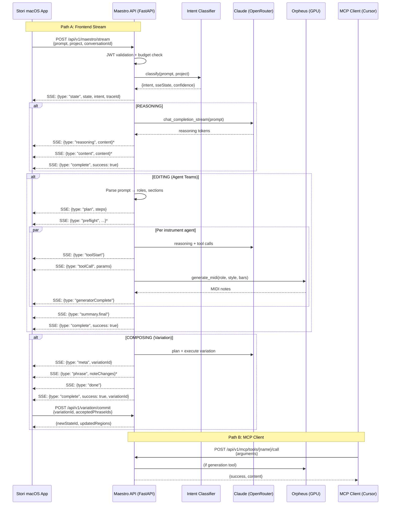

# Stori ↔ Maestro Contract (Backend Truth)

> **Generated:** 2026-02-23  
> **Source of truth:** Python codebase at `maestro.stori.audio`  
> **Authoritative version:** This document reflects the code as it exists, not aspirational state.

---

## 0. Executive Summary

### Surfaces

Stori Maestro exposes **three integration surfaces** to the macOS frontend:

| Surface | Transport | Purpose |
|---------|-----------|---------|
| **REST API** | HTTPS, JSON | CRUD, auth, assets, variation lifecycle, preview |
| **SSE Stream** | `POST /api/v1/maestro/stream` | Real-time composition/editing/reasoning with incremental events |
| **MCP** | HTTP + WebSocket | Tool surface for Cursor/Claude Desktop; same engine, different client |

All JSON payloads use **camelCase** on the wire (via `CamelModel` alias generator). Python code uses snake_case internally.

### What FE Must Do to "Speak Maestro Correctly"

1. **Authenticate** with `Authorization: Bearer <JWT>` on every protected endpoint.
2. **Send `MaestroRequest`** to `POST /api/v1/maestro/stream` with at least `prompt` (1–32,768 chars). Optionally include `project` (current DAW state), `conversationId`, `model`, `qualityPreset`.
3. **Consume SSE** as `data: {json}\n\n` lines. Every event has `type` and `seq` (monotonic counter). Parse `type` to route UI updates.
4. **Observe `state` event first** — it tells the FE which UI mode to render (reasoning/editing/composing).
5. **`complete` is always final** — even on errors. Success and failure both end with `complete`.
6. **Apply `toolCall` events** to the DAW state when `type === "toolCall"` and `proposal === false` (or absent).
7. For **variation flow**: use `/variation/propose` → SSE stream → `/variation/commit` or `/variation/discard`.

### Biggest Contract Risks

| # | Risk | Severity | Details |
|---|------|----------|---------|
| 1 | **SSE event types exceed Pydantic models** | High | `app/models/responses.py` defines 8 SSE types (`SSEMessage` union), but the actual stream emits 18+ event types (`state`, `plan`, `planStepUpdate`, `toolStart`, `preflight`, `generatorStart`, `generatorComplete`, `agentComplete`, `summary.final`, `meta`, `phrase`, `done`, etc.). The Pydantic models are outdated/incomplete. |
| 2 | **Project payload is `dict[str, Any]`** | Medium | No Pydantic model validates the project structure. FE and BE rely on convention, not schema. |
| 3 | **Execution mode is implicit** | Medium | FE cannot distinguish "variation" vs "apply" from the `state` event alone. The `state` may say `composing` for both Agent Teams (apply) and true COMPOSING (variation). |
| 4 | **No reconnection/resumption** | Medium | If the SSE connection drops, there is no resume mechanism. The request must be replayed. |
| 5 | **Heartbeat is SSE comment** | Low | Heartbeats are `: heartbeat\n\n` (SSE comment). Some SSE client libraries ignore comments silently. |

---

## 1. System Overview Diagram



---

## 2. All Externally Reachable Endpoints

### 2.1 Root

| | |
|---|---|
| **Method + Path** | `GET /` |
| **Purpose** | Service discovery / health ping |
| **Auth** | None |
| **Response 200** | `{"service": "Stori Maestro", "version": "x.y.z", "docs": "/docs"}` |
| **Code** | `app/main.py:152–159` |

### 2.2 Health

| | |
|---|---|
| **Method + Path** | `GET /api/v1/health` |
| **Purpose** | Basic health check |
| **Auth** | None |
| **Response 200** | `{"status": "healthy", "service": "Stori Maestro", "version": "x.y.z", "tagline": "the infinite music machine."}` |
| **Code** | `app/api/routes/health.py:16` |

| | |
|---|---|
| **Method + Path** | `GET /api/v1/health/full` |
| **Purpose** | Full health check with dependency status (DB, Orpheus, Qdrant) |
| **Auth** | None |
| **Code** | `app/api/routes/health.py:27` |

### 2.3 Authentication & Users

#### Validate Token

| | |
|---|---|
| **Method + Path** | `GET /api/v1/validate-token` |
| **Purpose** | Validate JWT, return expiry + budget info |
| **Auth** | `Authorization: Bearer <JWT>` (required) |
| **Response 200** | |

```json
{
  "valid": true,
  "expiresAt": "2026-03-01T00:00:00+00:00",
  "expiresInSeconds": 86400,
  "budgetRemaining": 4.50,
  "budgetLimit": 5.00
}
```

| **Code** | `app/api/routes/maestro.py:60–90` |

#### Register User

| | |
|---|---|
| **Method + Path** | `POST /api/v1/users/register` |
| **Purpose** | Register new user (device-based) |
| **Auth** | None |
| **Request Body** | `{"userId": "<UUID>"}` |
| **Response 201** | `{"userId": "...", "budgetRemaining": 5.0, "budgetLimit": 5.0}` |
| **409 Conflict** | User already exists |
| **Code** | `app/api/routes/users.py:80` |

#### Get Current User

| | |
|---|---|
| **Method + Path** | `GET /api/v1/users/me` |
| **Auth** | `Authorization: Bearer <JWT>` |
| **Response 200** | `UserResponse` — `{userId, budgetRemaining, budgetLimit, usageCount, createdAt}` |
| **Code** | `app/api/routes/users.py:144` |

#### List Models

| | |
|---|---|
| **Method + Path** | `GET /api/v1/models` |
| **Auth** | None |
| **Response 200** | |

```json
{
  "models": [
    {
      "id": "anthropic/claude-sonnet-4.6",
      "name": "Claude Sonnet 4.6",
      "costPer1mInput": 3.0,
      "costPer1mOutput": 15.0,
      "supportsReasoning": true
    },
    {
      "id": "anthropic/claude-opus-4.6",
      "name": "Claude Opus 4.6",
      "costPer1mInput": 5.0,
      "costPer1mOutput": 25.0,
      "supportsReasoning": true
    }
  ],
  "defaultModel": "anthropic/claude-sonnet-4.6"
}
```

| **Code** | `app/api/routes/users.py:188` |

#### Token Management

| Method + Path | Purpose | Auth |
|---|---|---|
| `GET /api/v1/users/me/tokens` | List active tokens | JWT |
| `POST /api/v1/users/me/tokens/revoke-all` | Revoke all tokens | JWT |
| `POST /api/v1/users/{user_id}/tokens/revoke-all` | Admin: revoke user tokens | JWT (admin role) |
| `POST /api/v1/users/{user_id}/budget` | Admin: update budget | JWT (admin role) |

Code: `app/api/routes/users.py:315–403`

### 2.4 Maestro Streaming

#### Stream (Primary Endpoint)

| | |
|---|---|
| **Method + Path** | `POST /api/v1/maestro/stream` |
| **Purpose** | Streaming composition/editing/reasoning (SSE) |
| **Auth** | `Authorization: Bearer <JWT>` (required) |
| **Rate Limit** | `20/minute` per IP |
| **Content-Type** | `application/json` |
| **Response Media Type** | `text/event-stream` |
| **Response Headers** | `Cache-Control: no-cache`, `Connection: keep-alive`, `X-Accel-Buffering: no` |
| **Code** | `app/api/routes/maestro.py:93–254` |

**Request Body (`MaestroRequest`):**

```json
{
  "prompt": "Make a chill boom bap beat at 90 BPM with dusty drums",
  "mode": "generate",
  "project": { "...project state..." },
  "model": "anthropic/claude-sonnet-4.6",
  "storePrompt": true,
  "conversationId": "550e8400-e29b-41d4-a716-446655440000",
  "qualityPreset": "quality"
}
```

| Field | Type | Required | Default | Constraints |
|-------|------|----------|---------|-------------|
| `prompt` | string | Yes | — | 1–32,768 chars, no null bytes |
| `mode` | string | No | `"generate"` | — |
| `project` | object \| null | No | `null` | Project state snapshot |
| `model` | string \| null | No | `null` | Must be in `ALLOWED_MODEL_IDS` |
| `storePrompt` | boolean | No | `true` | Opt out of prompt storage |
| `conversationId` | string \| null | No | `null` | UUID format (regex validated) |
| `qualityPreset` | string \| null | No | `null` | `"fast"` \| `"balanced"` \| `"quality"` |

**Error Responses:**

| Status | When | Body |
|--------|------|------|
| 401 | Missing/invalid/expired JWT | `{"detail": "..."}` with `WWW-Authenticate: Bearer` header |
| 402 | Insufficient budget | `{"detail": {"message": "Insufficient budget", "budgetRemaining": 0.12}}` |
| 422 | Pydantic validation failure | FastAPI default: `{"detail": [{"loc": [...], "msg": "...", "type": "..."}]}` |
| 429 | Rate limit exceeded | `{"error": "Rate limit exceeded: 20 per 1 minute"}` |

**Example curl:**

```bash
curl -N -X POST https://maestro.stori.audio/api/v1/maestro/stream \
  -H "Authorization: Bearer eyJhbGciOi..." \
  -H "Content-Type: application/json" \
  -d '{"prompt": "make a boom bap beat", "project": {}}'
```

#### Preview

| | |
|---|---|
| **Method + Path** | `POST /api/v1/maestro/preview` |
| **Purpose** | Preview composition plan without executing |
| **Auth** | `Authorization: Bearer <JWT>` |
| **Rate Limit** | `30/minute` |
| **Request** | Same `MaestroRequest` body |
| **Response 200** | `{"previewAvailable": true, "preview": {...}, "intent": "...", "sseState": "..."}` |
| **Code** | `app/api/routes/maestro.py:257–306` |

### 2.5 Maestro UI

| Method + Path | Purpose | Auth | Response |
|---|---|---|---|
| `GET /api/v1/maestro/ui/placeholders` | Rotating placeholder strings | None | `{"placeholders": ["Make a...", ...]}` |
| `GET /api/v1/maestro/prompts` | 4 random prompt cards | None | `{"prompts": [{id, title, preview, fullPrompt}]}` |
| `GET /api/v1/maestro/prompts/{prompt_id}` | Single prompt template | None | `{id, title, preview, fullPrompt}` |
| `GET /api/v1/maestro/budget/status` | Budget status | JWT | `{remaining, total, state, sessionsUsed}` |

Code: `app/api/routes/maestro_ui.py`

`BudgetState` enum: `"normal"` | `"low"` | `"critical"` | `"exhausted"`

### 2.6 Conversations

| Method + Path | Purpose | Auth | Notes |
|---|---|---|---|
| `POST /api/v1/conversations` | Create conversation | JWT | Body: `{title, projectId, projectContext}`. Returns 201. |
| `GET /api/v1/conversations` | List conversations | JWT | Query: `projectId`, `includeGlobal`, `limit`, `offset`, `includeArchived` |
| `GET /api/v1/conversations/search` | Search conversations | JWT | Query: `q` (required), `limit` (max 50) |
| `GET /api/v1/conversations/{id}` | Get conversation + messages | JWT | |
| `PATCH /api/v1/conversations/{id}` | Update title/projectId | JWT | Body: `{title, projectId}` |
| `DELETE /api/v1/conversations/{id}` | Archive/delete | JWT | Query: `hardDelete` (default false) |
| `POST /api/v1/conversations/{id}/messages` | Add message + stream response | JWT | Body: `MaestroRequest`. Response: SSE. |

Code: `app/api/routes/conversations/`

### 2.7 Variation (Muse Protocol)

#### Propose Variation

| | |
|---|---|
| **Method + Path** | `POST /api/v1/variation/propose` |
| **Purpose** | Create variation record, launch background generation |
| **Auth** | JWT |
| **Rate Limit** | `20/minute` |
| **Code** | `app/api/routes/variation/propose.py:44` |

**Request:**

```json
{
  "projectId": "uuid",
  "baseStateId": "42",
  "intent": "make the melody more jazzy",
  "scope": {"trackIds": ["uuid1"], "beatRange": [0, 16]},
  "options": {"phraseGrouping": "per_region", "stream": true},
  "requestId": "idempotency-key",
  "model": "anthropic/claude-sonnet-4.6"
}
```

**Response 200:**

```json
{
  "variationId": "uuid",
  "projectId": "uuid",
  "baseStateId": "42",
  "intent": "make the melody more jazzy",
  "aiExplanation": "I'll modify the scale degrees...",
  "streamUrl": "/api/v1/variation/stream?variation_id=uuid"
}
```

#### Stream Variation Events

| | |
|---|---|
| **Method + Path** | `GET /api/v1/variation/stream` |
| **Purpose** | SSE stream of variation events (meta, phrase, done) |
| **Auth** | JWT |
| **Query Params** | `variation_id` (required), `from_sequence` (default 0) |
| **Code** | `app/api/routes/variation/stream.py:21` |

#### Poll Variation Status

| | |
|---|---|
| **Method + Path** | `GET /api/v1/variation/{variation_id}` |
| **Purpose** | Poll variation status and phrases |
| **Auth** | JWT |
| **Code** | `app/api/routes/variation/retrieve.py:16` |

#### Commit Variation

| | |
|---|---|
| **Method + Path** | `POST /api/v1/variation/commit` |
| **Auth** | JWT |
| **Rate Limit** | `30/minute` |
| **Code** | `app/api/routes/variation/commit.py:41` |

**Request:**

```json
{
  "projectId": "uuid",
  "baseStateId": "42",
  "variationId": "uuid",
  "acceptedPhraseIds": ["phrase-1", "phrase-2"],
  "requestId": "idempotency-key"
}
```

**Response 200 (`CommitVariationResponse`):**

```json
{
  "projectId": "uuid",
  "newStateId": "43",
  "appliedPhraseIds": ["phrase-1", "phrase-2"],
  "undoLabel": "Undo Maestro Variation",
  "updatedRegions": [
    {
      "regionId": "uuid",
      "trackId": "uuid",
      "notes": [
        {"pitch": 60, "startBeat": 0.0, "durationBeats": 1.0, "velocity": 90, "channel": 0}
      ],
      "ccEvents": [],
      "pitchBends": [],
      "aftertouch": []
    }
  ]
}
```

#### Discard Variation

| | |
|---|---|
| **Method + Path** | `POST /api/v1/variation/discard` |
| **Auth** | JWT |
| **Rate Limit** | `30/minute` |
| **Request** | `{"projectId": "uuid", "variationId": "uuid"}` |
| **Code** | `app/api/routes/variation/discard.py:26` |

### 2.8 Assets

All asset endpoints require `X-Device-ID` header (UUID format). No JWT required.

| Method + Path | Purpose | Rate Limit |
|---|---|---|
| `GET /api/v1/assets/drum-kits` | List drum kits | per-IP + per-device |
| `GET /api/v1/assets/soundfonts` | List soundfonts | per-IP + per-device |
| `GET /api/v1/assets/drum-kits/{kit_id}/download-url` | Presigned S3 URL | per-IP + per-device |
| `GET /api/v1/assets/soundfonts/{sf_id}/download-url` | Presigned S3 URL | per-IP + per-device |
| `GET /api/v1/assets/bundle/download-url` | Presigned S3 URL for full bundle | per-IP + per-device |

Code: `app/api/routes/assets.py`

Download URL query param: `expires_in` (optional, 60–86,400 seconds, default 1,800).

### 2.9 MCP

See Section 7 for full MCP contract.

| Method + Path | Purpose | Auth |
|---|---|---|
| `GET /api/v1/mcp/tools` | List all MCP tools | JWT |
| `GET /api/v1/mcp/tools/{name}` | Get tool details | JWT |
| `POST /api/v1/mcp/tools/{name}/call` | Call tool | JWT |
| `GET /api/v1/mcp/info` | Server info | JWT |
| `POST /api/v1/mcp/connection` | Get SSE connection ID | JWT |
| `GET /api/v1/mcp/stream/{id}` | SSE tool call stream | JWT |
| `POST /api/v1/mcp/response/{id}` | Post tool results | JWT |
| `WS /api/v1/mcp/daw` | WebSocket for DAW | Query param `token` |

Code: `app/api/routes/mcp.py`

### 2.10 FastAPI Default Error Shapes

**422 Validation Error (all endpoints):**

```json
{
  "detail": [
    {
      "type": "string_too_short",
      "loc": ["body", "prompt"],
      "msg": "String should have at least 1 character",
      "input": "",
      "url": "https://errors.pydantic.dev/2.11/v/string_too_short"
    }
  ]
}
```

**401 Unauthorized:**

```json
{"detail": "Token has expired"}
```

Headers: `WWW-Authenticate: Bearer`

**429 Rate Limited:**

```json
{"error": "Rate limit exceeded: 20 per 1 minute"}
```

---

## 3. The Streaming Contract (SSE / Chunking)

### 3.1 Which Endpoints Stream

| Endpoint | Condition | Media Type |
|----------|-----------|------------|
| `POST /api/v1/maestro/stream` | Always (primary) | `text/event-stream` |
| `POST /api/v1/conversations/{id}/messages` | Always | `text/event-stream` |
| `GET /api/v1/variation/stream` | On active variation | `text/event-stream` |
| `GET /api/v1/mcp/stream/{connection_id}` | On active MCP connection | `text/event-stream` |

### 3.2 Wire Format

Every event is a standard SSE `data:` line:

```
data: {"type":"state","state":"composing","intent":"compose.generate_music","confidence":0.98,"traceId":"abc123","seq":0}\n\n
```

- **Format:** `data: {json}\n\n` (two trailing newlines)
- **All keys:** camelCase
- **Every event has:** `type` (string) and `seq` (integer, monotonic from 0)
- **Heartbeats:** `: heartbeat\n\n` (SSE comment, no `data:` prefix, no `seq`)

Response headers:

```
Content-Type: text/event-stream
Cache-Control: no-cache
Connection: keep-alive
X-Accel-Buffering: no
```

Code: `app/api/routes/maestro.py:244–254`, `app/core/sse_utils.py:15–17`

### 3.3 All SSE Event Types and Payload Shapes

#### Universal Events (all modes)

##### `state` — Intent Classification (always first)

```json
{
  "type": "state",
  "state": "editing" | "composing" | "reasoning",
  "intent": "compose.generate_music",
  "confidence": 0.98,
  "traceId": "abc12345-...",
  "seq": 0
}
```

Code: `app/core/maestro_handlers.py:151–157`

##### `reasoning` — LLM Chain-of-Thought (incremental)

```json
{
  "type": "reasoning",
  "content": "I'll create a boom bap groove with...",
  "agentId": "drums",
  "sectionName": "verse",
  "seq": 1
}
```

- `agentId` and `sectionName` present only in Agent Teams mode
- Content is sanitized: UUIDs, function names, and parameter assignments stripped
- Buffered at word boundaries via `ReasoningBuffer` (`app/core/sse_utils.py:24–59`)

##### `content` — User-Facing Text (incremental)

```json
{
  "type": "content",
  "content": "Here's what I created for you...",
  "seq": 15
}
```

##### `status` — Status Message

```json
{
  "type": "status",
  "message": "Planning composition...",
  "agentId": "drums",
  "sectionName": "verse",
  "seq": 2
}
```

##### `error` — Error (non-terminal or pre-terminal)

```json
{
  "type": "error",
  "message": "Generation failed: Orpheus timeout",
  "traceId": "abc12345-...",
  "seq": 16
}
```

##### `complete` — Stream Termination (ALWAYS final)

**Success (EDITING/Agent Teams):**

```json
{
  "type": "complete",
  "success": true,
  "traceId": "abc12345-...",
  "inputTokens": 42350,
  "contextWindowTokens": 200000,
  "toolCalls": [{"name": "stori_add_midi_track", "params": {...}}],
  "stateVersion": 42,
  "seq": 25
}
```

**Success (COMPOSING):**

```json
{
  "type": "complete",
  "success": true,
  "traceId": "abc12345-...",
  "inputTokens": 15000,
  "contextWindowTokens": 200000,
  "variationId": "uuid",
  "phraseCount": 4,
  "totalChanges": 44,
  "seq": 20
}
```

**Success (REASONING):**

```json
{
  "type": "complete",
  "success": true,
  "traceId": "abc12345-...",
  "inputTokens": 5000,
  "contextWindowTokens": 200000,
  "seq": 10
}
```

**Failure:**

```json
{
  "type": "complete",
  "success": false,
  "error": "Orchestration error: ...",
  "traceId": "abc12345-...",
  "inputTokens": 0,
  "contextWindowTokens": 200000,
  "warnings": ["tool error(s) occurred"],
  "seq": 5
}
```

Code: `app/core/maestro_handlers.py:217–230`

#### EDITING / Agent Teams Events

##### `plan` — Structured Execution Plan

```json
{
  "type": "plan",
  "planId": "uuid",
  "title": "Building Lo-Fi Groove",
  "steps": [
    {
      "stepId": "1",
      "label": "Set tempo to 72 BPM",
      "toolName": "stori_set_tempo",
      "status": "pending",
      "phase": "setup"
    },
    {
      "stepId": "3",
      "label": "Create Drums track",
      "toolName": "stori_add_midi_track",
      "parallelGroup": "instruments",
      "status": "pending",
      "phase": "composition"
    }
  ],
  "seq": 3
}
```

##### `preflight` — Pre-Allocation (Agent Teams only, latency masking)

```json
{
  "type": "preflight",
  "stepId": "3",
  "agentId": "drums",
  "agentRole": "drums",
  "label": "Create Drums track",
  "toolName": "stori_add_midi_track",
  "parallelGroup": "instruments",
  "confidence": 0.9,
  "trackColor": "#E85D75",
  "seq": 4
}
```

##### `planStepUpdate` — Step Lifecycle

```json
{
  "type": "planStepUpdate",
  "stepId": "1",
  "status": "active" | "completed" | "failed" | "skipped",
  "phase": "setup" | "composition" | "soundDesign" | "mixing",
  "result": "Set tempo to 72 BPM",
  "agentId": "drums",
  "seq": 5
}
```

##### `toolStart` — Before Tool Execution

```json
{
  "type": "toolStart",
  "name": "stori_add_midi_track",
  "label": "Create Drums track",
  "phase": "composition",
  "agentId": "drums",
  "sectionName": "verse",
  "seq": 6
}
```

##### `toolCall` — Resolved Tool Call (FE applies this)

```json
{
  "type": "toolCall",
  "id": "call_uuid",
  "name": "stori_add_midi_track",
  "label": "Create Drums track",
  "phase": "composition",
  "params": {
    "trackId": "uuid",
    "name": "Drums",
    "drumKitId": "TR-909",
    "color": "blue",
    "volume": 0.8
  },
  "proposal": false,
  "agentId": "drums",
  "sectionName": "verse",
  "seq": 7
}
```

- `proposal: true` means variation mode (FE should NOT apply immediately)
- `proposal: false` or absent means apply mode (FE applies to DAW)
- `params` contains server-assigned UUIDs for created entities

##### `toolError` — Non-Fatal Tool Error

```json
{
  "type": "toolError",
  "name": "stori_add_notes",
  "error": "Region not found",
  "errors": ["Region ID invalid", "Track not found"],
  "agentId": "drums",
  "seq": 8
}
```

##### `generatorStart` — Orpheus Generation Started

```json
{
  "type": "generatorStart",
  "role": "drums",
  "agentId": "drums",
  "style": "boom bap",
  "bars": 8,
  "startBeat": 0.0,
  "label": "Drums",
  "seq": 9
}
```

##### `generatorComplete` — Orpheus Generation Finished

```json
{
  "type": "generatorComplete",
  "role": "drums",
  "agentId": "drums",
  "noteCount": 128,
  "durationMs": 2340,
  "seq": 10
}
```

##### `agentComplete` — Instrument Agent Finished

```json
{
  "type": "agentComplete",
  "agentId": "drums",
  "success": true,
  "seq": 11
}
```

##### `summary.final` — Rich Composition Summary

```json
{
  "type": "summary.final",
  "traceId": "uuid",
  "trackCount": 3,
  "tracksCreated": [{"name": "Drums", "instrument": "TR-808", "trackId": "uuid"}],
  "tracksReused": [],
  "regionsCreated": 3,
  "notesGenerated": 128,
  "effectsAdded": [{"trackId": "uuid", "type": "compressor"}],
  "effectCount": 2,
  "sendsCreated": 1,
  "ccEnvelopes": [{"cc": 74, "name": "Filter Cutoff"}],
  "automationLanes": 0,
  "seq": 22
}
```

#### COMPOSING (Variation) Events

##### `meta` — Variation Summary

```json
{
  "type": "meta",
  "variationId": "uuid",
  "baseStateId": "42",
  "intent": "make the chords minor",
  "aiExplanation": "Lowered scale degrees 3 and 7",
  "affectedTracks": ["uuid1"],
  "affectedRegions": ["uuid2"],
  "noteCounts": {"added": 32, "removed": 4, "modified": 8},
  "seq": 5
}
```

##### `phrase` — Musical Phrase

```json
{
  "type": "phrase",
  "phraseId": "uuid",
  "trackId": "uuid",
  "regionId": "uuid",
  "startBeat": 0.0,
  "endBeat": 16.0,
  "label": "Bars 1-4",
  "tags": ["harmonyChange"],
  "explanation": "Converted major 3rds to minor 3rds",
  "noteChanges": [
    {
      "noteId": "uuid",
      "changeType": "modified",
      "before": {"pitch": 64, "startBeat": 0.0, "durationBeats": 0.5, "velocity": 90},
      "after": {"pitch": 63, "startBeat": 0.0, "durationBeats": 0.5, "velocity": 90}
    }
  ],
  "controllerChanges": [],
  "seq": 6
}
```

##### `done` — End of Variation Stream

```json
{
  "type": "done",
  "variationId": "uuid",
  "phraseCount": 4,
  "status": "ready",
  "seq": 10
}
```

### 3.4 Event Ordering Guarantees

#### REASONING Mode

```
state(reasoning) → reasoning* → content* → complete
```

#### EDITING Mode (Single Tool)

```
state(editing) → status? → reasoning* → plan? →
[planStepUpdate(active) → toolStart → toolCall → planStepUpdate(completed)]* →
summary? → content? → complete
```

#### EDITING Mode (Agent Teams, Multi-Instrument)

```
state(composing) → status → plan → preflight* →
  ┌─ per instrument (parallel, may interleave):
  │  [planStepUpdate(active) → toolStart → toolCall →
  │   generatorStart → generatorComplete →
  │   planStepUpdate(completed)]* → agentComplete
  └─
planStepUpdate(skipped)* → summary.final → content? → complete
```

#### COMPOSING Mode (Variation)

```
state(composing) → status → reasoning* → plan →
[toolCall(proposal:true)]* →
meta → phrase* → done → complete
```

**Invariants:**
1. `state` is **always** the first meaningful event (`seq: 0`)
2. `complete` is **always** the last event, even on error
3. `seq` is strictly monotonic (0, 1, 2, ...) per request
4. Within Agent Teams, events from different agents **may interleave** (they share a queue)
5. Heartbeats (`: heartbeat\n\n`) can appear anywhere between events during Agent Teams Phase 2
6. Plan steps always reach terminal status (`completed`, `failed`, or `skipped`) before `complete`

### 3.5 Stream Termination

| Condition | Behavior |
|-----------|----------|
| **Success** | `complete` with `success: true` |
| **Error** | `error` event → `complete` with `success: false` |
| **Client disconnect** | Route handler checks `request.is_disconnected()` between events. Stream stops silently (no `complete` event). |
| **Timeout** | `error` event → `complete` with `success: false` |

Code: `app/api/routes/maestro.py:203–210`

### 3.6 Resumption

**There is no reconnection or resumption mechanism.** If the SSE connection drops, the request must be replayed from scratch. The `seq` counter restarts at 0.

For the variation stream (`GET /api/v1/variation/stream`), the `from_sequence` query parameter allows catching up on missed events if the variation is still being generated.

### 3.7 Backpressure / Throttling

- No explicit backpressure mechanism.
- Reasoning tokens are buffered at word boundaries (`ReasoningBuffer`, max 200 chars before forced flush).
- Tool calls are emitted one at a time (serialized per agent in Agent Teams, fully serialized in standard EDITING).
- Heartbeats every 8 seconds prevent proxy timeouts during GPU-bound work.

### 3.8 Example SSE Transcripts

#### (a) REASONING — Question About Music Theory

```
data: {"type":"state","state":"reasoning","intent":"ask.general","confidence":0.95,"traceId":"abc12345-def6-7890-abcd-ef1234567890","seq":0}

data: {"type":"reasoning","content":"The user is asking about chord progressions in jazz...","seq":1}

data: {"type":"reasoning","content":" Let me explain the ii-V-I progression.","seq":2}

data: {"type":"content","content":"In jazz, the ii-V-I progression is the most common harmonic movement. ","seq":3}

data: {"type":"content","content":"It consists of a minor 7th chord (ii), a dominant 7th chord (V), and a major 7th chord (I).","seq":4}

data: {"type":"complete","success":true,"traceId":"abc12345-def6-7890-abcd-ef1234567890","inputTokens":5200,"contextWindowTokens":200000,"seq":5}

```

#### (b) COMPOSING — Variation Proposal (No Mutation)

```
data: {"type":"state","state":"composing","intent":"compose.generate_music","confidence":0.92,"traceId":"bbb22222-cccc-dddd-eeee-ffffffffffff","seq":0}

data: {"type":"status","message":"Planning variation...","seq":1}

data: {"type":"reasoning","content":"The user wants to make the chord progression minor. I need to lower the 3rd and 7th scale degrees.","seq":2}

data: {"type":"plan","planId":"plan-001","title":"Minor Key Transformation","steps":[{"stepId":"1","label":"Modify chord voicings","toolName":"stori_add_notes","status":"pending","phase":"composition"}],"seq":3}

data: {"type":"toolCall","id":"tc-001","name":"stori_add_notes","label":"Modify chord voicings","phase":"composition","params":{"regionId":"reg-001","notes":[{"pitch":63,"startBeat":0.0,"durationBeats":1.0,"velocity":90}]},"proposal":true,"seq":4}

data: {"type":"meta","variationId":"var-001","baseStateId":"42","intent":"make it minor","aiExplanation":"Lowered 3rds and 7ths across all chord voicings","affectedTracks":["trk-piano"],"affectedRegions":["reg-001"],"noteCounts":{"added":0,"removed":0,"modified":12},"seq":5}

data: {"type":"phrase","phraseId":"phr-001","trackId":"trk-piano","regionId":"reg-001","startBeat":0.0,"endBeat":16.0,"label":"Bars 1-4","tags":["harmonyChange"],"explanation":"Converted major 3rds to minor 3rds","noteChanges":[{"noteId":"n-001","changeType":"modified","before":{"pitch":64,"startBeat":0.0,"durationBeats":0.5,"velocity":90},"after":{"pitch":63,"startBeat":0.0,"durationBeats":0.5,"velocity":90}}],"controllerChanges":[],"seq":6}

data: {"type":"done","variationId":"var-001","phraseCount":1,"status":"ready","seq":7}

data: {"type":"complete","success":true,"traceId":"bbb22222-cccc-dddd-eeee-ffffffffffff","inputTokens":15000,"contextWindowTokens":200000,"variationId":"var-001","phraseCount":1,"totalChanges":12,"seq":8}

```

#### (c) EDITING — Agent Teams (Apply Mode, Multi-Instrument)

```
data: {"type":"state","state":"composing","intent":"compose.generate_music","confidence":0.97,"traceId":"ccc33333-dddd-eeee-ffff-000000000000","seq":0}

data: {"type":"status","message":"Composing with Agent Teams...","seq":1}

data: {"type":"plan","planId":"plan-002","title":"Boom Bap Beat","steps":[{"stepId":"1","label":"Set tempo to 90 BPM","toolName":"stori_set_tempo","status":"pending","phase":"setup"},{"stepId":"2","label":"Set key to Am","toolName":"stori_set_key","status":"pending","phase":"setup"},{"stepId":"3","label":"Create Drums track","toolName":"stori_add_midi_track","parallelGroup":"instruments","status":"pending","phase":"composition"},{"stepId":"4","label":"Create Bass track","toolName":"stori_add_midi_track","parallelGroup":"instruments","status":"pending","phase":"composition"}],"seq":2}

data: {"type":"planStepUpdate","stepId":"1","status":"completed","phase":"setup","result":"Tempo set to 90 BPM","seq":3}

data: {"type":"planStepUpdate","stepId":"2","status":"completed","phase":"setup","result":"Key set to Am","seq":4}

data: {"type":"preflight","stepId":"3","agentId":"drums","agentRole":"drums","label":"Create Drums track","toolName":"stori_add_midi_track","parallelGroup":"instruments","confidence":0.9,"trackColor":"#E85D75","seq":5}

data: {"type":"preflight","stepId":"4","agentId":"bass","agentRole":"bass","label":"Create Bass track","toolName":"stori_add_midi_track","parallelGroup":"instruments","confidence":0.9,"trackColor":"#4A90D9","seq":6}

data: {"type":"toolStart","name":"stori_add_midi_track","label":"Create Drums track","phase":"composition","agentId":"drums","seq":7}

data: {"type":"toolCall","id":"tc-drums-track","name":"stori_add_midi_track","label":"Create Drums track","phase":"composition","params":{"trackId":"trk-drums","name":"Drums","drumKitId":"TR-808","color":"red","volume":0.85},"agentId":"drums","seq":8}

data: {"type":"toolStart","name":"stori_add_midi_track","label":"Create Bass track","phase":"composition","agentId":"bass","seq":9}

data: {"type":"toolCall","id":"tc-bass-track","name":"stori_add_midi_track","label":"Create Bass track","phase":"composition","params":{"trackId":"trk-bass","name":"Bass","gmProgram":33,"color":"blue","volume":0.75},"agentId":"bass","seq":10}

: heartbeat

data: {"type":"generatorStart","role":"drums","agentId":"drums","style":"boom bap","bars":8,"startBeat":0.0,"label":"Drums","seq":11}

data: {"type":"generatorComplete","role":"drums","agentId":"drums","noteCount":64,"durationMs":3200,"seq":12}

data: {"type":"toolCall","id":"tc-drums-notes","name":"stori_add_notes","label":"Add drum pattern","phase":"composition","params":{"regionId":"reg-drums","trackId":"trk-drums","notes":[{"pitch":36,"startBeat":0.0,"durationBeats":0.25,"velocity":110}]},"agentId":"drums","seq":13}

data: {"type":"agentComplete","agentId":"drums","success":true,"seq":14}

: heartbeat

data: {"type":"generatorStart","role":"bass","agentId":"bass","style":"boom bap","bars":8,"startBeat":0.0,"label":"Bass","seq":15}

data: {"type":"generatorComplete","role":"bass","agentId":"bass","noteCount":32,"durationMs":2800,"seq":16}

data: {"type":"toolCall","id":"tc-bass-notes","name":"stori_add_notes","label":"Add bass line","phase":"composition","params":{"regionId":"reg-bass","trackId":"trk-bass","notes":[{"pitch":40,"startBeat":0.0,"durationBeats":0.5,"velocity":95}]},"agentId":"bass","seq":17}

data: {"type":"agentComplete","agentId":"bass","success":true,"seq":18}

data: {"type":"summary.final","traceId":"ccc33333-dddd-eeee-ffff-000000000000","trackCount":2,"tracksCreated":[{"name":"Drums","instrument":"TR-808","trackId":"trk-drums"},{"name":"Bass","instrument":"GM 33","trackId":"trk-bass"}],"tracksReused":[],"regionsCreated":2,"notesGenerated":96,"effectsAdded":[],"effectCount":0,"sendsCreated":0,"ccEnvelopes":[],"automationLanes":0,"seq":19}

data: {"type":"complete","success":true,"traceId":"ccc33333-dddd-eeee-ffff-000000000000","inputTokens":28000,"contextWindowTokens":200000,"stateVersion":8,"seq":20}

```

---

## 4. Contract for "project" Payload (App State Snapshot)

### 4.1 Schema

The project payload is sent as `MaestroRequest.project` — typed as `dict[str, Any]` with **no Pydantic validation**. The backend reads it opportunistically.

**Canonical structure (inferred from `StateStore.sync_from_client` and tool logic):**

```json
{
  "id": "uuid",
  "name": "My Beat",
  "tempo": 120.0,
  "key": "Am",
  "timeSignature": "4/4",
  "tracks": [
    {
      "id": "uuid",
      "name": "Drums",
      "gmProgram": null,
      "drumKitId": "TR-808",
      "isDrums": true,
      "volume": 0.85,
      "pan": 0.5,
      "muted": false,
      "solo": false,
      "color": "red",
      "icon": "drum",
      "regions": [
        {
          "id": "uuid",
          "name": "Region 1",
          "startBeat": 0.0,
          "durationBeats": 16.0,
          "noteCount": 64,
          "notes": [
            {
              "id": "uuid",
              "pitch": 36,
              "startBeat": 0.0,
              "durationBeats": 0.25,
              "velocity": 110,
              "channel": 0
            }
          ]
        }
      ]
    }
  ],
  "buses": [
    {
      "id": "uuid",
      "name": "Reverb Bus"
    }
  ]
}
```

### 4.2 Field-by-Field

| Field | Type | Required | Default | Notes |
|-------|------|----------|---------|-------|
| `id` | string | Yes | — | Project UUID. Used as StateStore key. |
| `name` | string | No | — | Display name |
| `tempo` | number | No | 120 | BPM. 40–240 range enforced by tools. |
| `key` | string | No | — | Musical key (e.g., `"Am"`, `"C"`, `"F#m"`) |
| `timeSignature` | string | No | `"4/4"` | Format: `"N/D"` |
| `tracks` | array | No | `[]` | Track objects |
| `tracks[].id` | string | Yes | — | Track UUID |
| `tracks[].name` | string | No | — | Display name |
| `tracks[].gmProgram` | int \| null | No | `null` | General MIDI program (0–127) |
| `tracks[].drumKitId` | string \| null | No | `null` | Drum kit identifier |
| `tracks[].isDrums` | boolean | No | `false` | True if drums track |
| `tracks[].volume` | number | No | 0.8 | Linear scale, 0.0–1.5 |
| `tracks[].pan` | number | No | 0.5 | 0.0 (left) – 1.0 (right) |
| `tracks[].muted` | boolean | No | `false` | |
| `tracks[].solo` | boolean | No | `false` | |
| `tracks[].color` | string \| null | No | `null` | Named color or hex |
| `tracks[].regions` | array | No | `[]` | Region objects |
| `tracks[].regions[].id` | string | Yes | — | Region UUID |
| `tracks[].regions[].name` | string | No | — | |
| `tracks[].regions[].startBeat` | number | No | 0.0 | >= 0 |
| `tracks[].regions[].durationBeats` | number | No | — | > 0 |
| `tracks[].regions[].noteCount` | int \| null | No | `null` | |
| `tracks[].regions[].notes` | array | No | `[]` | Full note data (COMPOSING mode) |
| `buses` | array | No | `[]` | Bus objects |

### 4.3 Versioning / Unknown Fields

- Backend uses `dict[str, Any]` — **unknown fields are silently ignored**.
- No schema version field exists. The backend reads only the fields it understands.
- `StateStore.sync_from_client()` replaces the entire server-side entity registry with the client's snapshot on each request.

### 4.4 Minimal vs. Full Project

**Minimal (no project):**

```json
{"prompt": "make a beat"}
```

Backend creates a fresh `StateStore` with no tracks.

**Minimal project:**

```json
{
  "prompt": "make a beat",
  "project": {"id": "uuid", "tempo": 90}
}
```

**Full project:**

```json
{
  "prompt": "add more bass",
  "project": {
    "id": "proj-001",
    "name": "My Beat",
    "tempo": 90,
    "key": "Am",
    "timeSignature": "4/4",
    "tracks": [
      {
        "id": "trk-drums",
        "name": "Drums",
        "drumKitId": "TR-808",
        "isDrums": true,
        "volume": 0.85,
        "pan": 0.5,
        "muted": false,
        "solo": false,
        "color": "red",
        "regions": [
          {
            "id": "reg-001",
            "name": "Drum Pattern",
            "startBeat": 0.0,
            "durationBeats": 16.0,
            "noteCount": 64
          }
        ]
      }
    ],
    "buses": []
  }
}
```

---

## 5. Conversation and Identity

### 5.1 `conversationId` Semantics

| Aspect | Detail |
|--------|--------|
| **Format** | UUID v4 (regex validated: `^[0-9a-f]{8}-...-[0-9a-f]{12}$`) |
| **Required?** | Optional. If omitted, request runs statelessly. |
| **Creation** | `POST /api/v1/conversations` → returns `id` |
| **Server state** | Conversation messages stored in DB. Loaded on each stream request. |
| **Ownership** | Conversations are user-scoped. IDOR protection via join on `user_id`. |
| **Expiry** | No automatic expiry. Conversations persist until archived/deleted. |
| **Reuse** | Same `conversationId` across requests creates multi-turn context. |

Code: `app/api/routes/maestro.py:140–166`

### 5.2 Server-Side Session State

| State | Keyed By | Lifetime |
|-------|----------|----------|
| **Conversation messages** | `conversationId` + `userId` | Until deleted |
| **StateStore** (entity state) | `projectId` or `conversationId` or `"default"` | In-memory, per-process. Synced from client on each request. |
| **VariationStore** | `variationId` | In-memory until terminal state. Reset between tests. |

### 5.3 Idempotency

| Endpoint | Idempotency | Mechanism |
|----------|-------------|-----------|
| `POST /maestro/stream` | **Not idempotent** | Each call starts fresh orchestration |
| `POST /variation/propose` | Optional `requestId` | UNKNOWN enforcement (field exists but dedup behavior not verified) |
| `POST /variation/commit` | Optimistic concurrency | `baseStateId` must match current `StateStore.version`. Rejects stale commits. |
| `POST /variation/discard` | Idempotent | Transition to DISCARDED is safe to repeat |

### 5.4 Correlation IDs

| ID | Source | Where Visible |
|----|--------|---------------|
| `traceId` | Server-generated UUID per request | In `state` and `complete` events. In all log lines as `[traceId[:8]]`. |
| `conversationId` | Client-provided or server-created | In DB, in log context |
| `seq` | Server-generated, monotonic per stream | Every SSE event |
| `planId` | Server-generated | In `plan` event |
| `stepId` | Server-generated | In `planStepUpdate`, `toolStart`, `preflight` |

Code: `app/core/tracing.py`

---

## 6. Tool Contract (Internal Tools FE Relies On)

### 6.1 Full Tool List

#### Project Tools

| Tool | Purpose | Key Params | Entity Created |
|------|---------|------------|----------------|
| `stori_read_project` | Read project state | — | — |
| `stori_create_project` | Create new project | `name`, `tempo`, `key` | — |
| `stori_set_tempo` | Set tempo | `bpm` (40–240) | — |
| `stori_set_key` | Set key | `key` (e.g., `"Am"`) | — |

#### Track Tools

| Tool | Purpose | Key Params | Entity Created |
|------|---------|------------|----------------|
| `stori_add_midi_track` | Add MIDI track | `name`, `trackId`*, `drumKitId`\|`gmProgram`, `color`, `volume`, `pan` | Track |
| `stori_set_track_volume` | Set volume | `trackId`, `volume` (0.0–1.5) | — |
| `stori_set_track_pan` | Set pan | `trackId`, `pan` (0.0–1.0) | — |
| `stori_set_track_name` | Rename track | `trackId`, `name` | — |
| `stori_set_midi_program` | Set GM program | `trackId`, `program` (0–127) | — |
| `stori_mute_track` | Mute/unmute | `trackId`, `mute` | — |
| `stori_solo_track` | Solo/unsolo | `trackId`, `solo` | — |
| `stori_set_track_color` | Set color | `trackId`, `color` (enum) | — |
| `stori_set_track_icon` | Set icon | `trackId`, `icon` (SF Symbol) | — |

*`trackId` is server-assigned by `StateStore.create_track()` for new tracks.

**Color enum:** `red`, `orange`, `yellow`, `green`, `blue`, `purple`, `pink`, `teal`, `indigo`

#### Region Tools

| Tool | Purpose | Key Params | Entity Created |
|------|---------|------------|----------------|
| `stori_add_midi_region` | Add region | `trackId`, `regionId`*, `name`, `startBeat`, `durationBeats` | Region |
| `stori_delete_region` | Delete region | `regionId` | — |
| `stori_move_region` | Move region | `regionId`, `startBeat` | — |
| `stori_duplicate_region` | Duplicate region | `regionId` | Region |

#### Note Tools

| Tool | Purpose | Key Params |
|------|---------|------------|
| `stori_add_notes` | Add MIDI notes | `regionId`, `notes: [{pitch, startBeat, durationBeats, velocity}]` |
| `stori_clear_notes` | Clear all notes | `regionId` |
| `stori_quantize_notes` | Quantize | `regionId`, `gridSize` (0.0625–4.0) |
| `stori_apply_swing` | Apply swing | `regionId`, `amount` (0.0–1.0) |

**Note schema:**

```json
{
  "pitch": 60,
  "startBeat": 0.0,
  "durationBeats": 1.0,
  "velocity": 100,
  "channel": 0
}
```

| Field | Type | Range | Default |
|-------|------|-------|---------|
| `pitch` | int | 0–127 | Required |
| `startBeat` | float | >= 0 | Required |
| `durationBeats` | float | > 0 | Required |
| `velocity` | int | 0–127 | 100 |
| `channel` | int | 0–15 | 0 |

#### Effects & Routing

| Tool | Purpose | Key Params |
|------|---------|------------|
| `stori_add_insert_effect` | Add insert effect | `trackId`, `type` (enum) |
| `stori_add_send` | Add send to bus | `trackId`, `busId`, `sendLevel` (0.0–1.0) |
| `stori_ensure_bus` | Create/ensure bus | `name` |

**Effect type enum:** `reverb`, `delay`, `compressor`, `eq`, `distortion`, `filter`, `chorus`, `modulation`, `overdrive`, `phaser`, `flanger`, `tremolo`

#### Automation Tools

| Tool | Purpose | Key Params |
|------|---------|------------|
| `stori_add_automation` | Add automation points | `trackId`, `regionId`, `parameter`, `points: [{beat, value}]` |

**Parameter enum:** `Volume`, `Pan`, `EQ Low`, `EQ Mid`, `EQ High`, `Mod Wheel (CC1)`, `Volume (CC7)`, `Pan (CC10)`, `Expression (CC11)`, `Sustain (CC64)`, `Filter Cutoff (CC74)`, `Pitch Bend`, `Synth Cutoff`, `Synth Resonance`, `Synth Attack`, `Synth Release`

#### MIDI Control Tools

| Tool | Purpose | Key Params |
|------|---------|------------|
| `stori_add_midi_cc` | Add MIDI CC | `regionId`, `cc` (0–127), `value` (0–127), `beat` |
| `stori_add_pitch_bend` | Add pitch bend | `regionId`, `value` (-8192–8191), `beat` |
| `stori_add_aftertouch` | Add aftertouch | `regionId`, `type` (`channel`\|`polyphonic`), `value`, `beat` |

#### Generation Tools (Server-Side, Tier 1)

| Tool | Purpose | Key Params |
|------|---------|------------|
| `stori_generate_midi` | General generator | `role`, `style`, `tempo`, `bars`, `key`, `trackId`, `regionId` |
| `stori_generate_drums` | Generate drums (deprecated) | `style`, `tempo`, `bars` |
| `stori_generate_bass` | Generate bass (deprecated) | `style`, `tempo`, `bars`, `key` |
| `stori_generate_melody` | Generate melody (deprecated) | `style`, `tempo`, `bars`, `key` |
| `stori_generate_chords` | Generate chords (deprecated) | `style`, `tempo`, `bars`, `key` |

**Important:** Generation tools are **NEVER callable by LLM directly**. They are Tier 1 (server-side only). The LLM plans them; the executor runs them.

#### Playback Tools

| Tool | Purpose | Key Params |
|------|---------|------------|
| `stori_play` | Start playback | — |
| `stori_stop` | Stop playback | — |
| `stori_set_playhead` | Move playhead | `bar` or `beat` or `seconds` |

#### UI Tools

| Tool | Purpose | Key Params |
|------|---------|------------|
| `stori_show_panel` | Show/hide panel | `panel` (mixer, inspector, piano_roll, etc.), `visible` |
| `stori_set_zoom` | Set zoom level | `percent` |

### 6.2 Tool Result Shapes FE Relies On

When `toolCall` events arrive, `params` contains **server-assigned UUIDs** for newly created entities:

**Track creation result (in `toolCall.params`):**

```json
{
  "trackId": "server-generated-uuid",
  "name": "Drums",
  "drumKitId": "TR-808",
  "color": "red",
  "volume": 0.85,
  "pan": 0.5
}
```

**Region creation (in `toolCall.params`):**

```json
{
  "regionId": "server-generated-uuid",
  "trackId": "existing-uuid",
  "name": "Verse",
  "startBeat": 0.0,
  "durationBeats": 16.0
}
```

**Notes (in `toolCall.params`):**

```json
{
  "regionId": "existing-uuid",
  "trackId": "existing-uuid",
  "notes": [{"pitch": 36, "startBeat": 0.0, "durationBeats": 0.25, "velocity": 110}]
}
```

### 6.3 Nondeterminism

- `proposal: true` in `toolCall` events means the tool call is a **variation proposal** — FE should display for review, not apply.
- `proposal: false` or absent means **apply mode** — FE should apply to DAW immediately.
- The backend decides variation vs apply based on intent classification and project state. FE cannot override.

Code: `app/core/maestro_handlers.py:102–128`

---

## 7. MCP Contract

### 7.1 Server Info

| | |
|---|---|
| **Server Name** | `stori-daw` |
| **Protocol Version** | `2024-11-05` |
| **Transport** | HTTP (REST API) and stdio (for Cursor/Claude Desktop) |
| **Code** | `app/mcp/server.py`, `app/mcp/stdio_server.py` |

### 7.2 MCP HTTP Endpoints

| Method + Path | Purpose |
|---|---|
| `GET /api/v1/mcp/tools` | List all 40+ tools with schemas |
| `GET /api/v1/mcp/tools/{name}` | Get single tool schema |
| `POST /api/v1/mcp/tools/{name}/call` | Execute tool call |
| `GET /api/v1/mcp/info` | Server metadata |

**Tool call request:**

```json
POST /api/v1/mcp/tools/stori_set_tempo/call
Authorization: Bearer <JWT>
Content-Type: application/json

{
  "name": "stori_set_tempo",
  "arguments": {"bpm": 90}
}
```

**Tool call response (`MCPToolCallResponse`):**

```json
{
  "success": true,
  "content": [{"type": "text", "text": "Tempo set to 90 BPM"}],
  "isError": false
}
```

**Error response:**

```json
{
  "success": false,
  "content": [{"type": "text", "text": "No DAW connected"}],
  "isError": true
}
```

### 7.3 WebSocket DAW Connection

| | |
|---|---|
| **Endpoint** | `WS /api/v1/mcp/daw?token=<JWT>` |
| **Purpose** | Bidirectional connection between Stori macOS app and Maestro |
| **Auth** | JWT in query parameter (validated before WebSocket upgrade) |
| **Protocol** | JSON messages |

**DAW → Server messages:**

```json
{"type": "toolResponse", "callId": "uuid", "result": {...}}
```

**Server → DAW messages:**

```json
{"type": "toolCall", "callId": "uuid", "name": "stori_add_midi_track", "arguments": {...}}
```

### 7.4 Tool Routing

| Tool Type | Routing |
|-----------|---------|
| Generation tools (`stori_generate_*`) | Executed **server-side** via Orpheus |
| All other tools | **Forwarded to DAW** via WebSocket |

Code: `app/mcp/server.py:111–114`

### 7.5 MCP vs FE Path

| Aspect | FE (Stream) | MCP |
|--------|-------------|-----|
| Entry point | `POST /api/v1/maestro/stream` | `POST /api/v1/mcp/tools/{name}/call` |
| Intent classification | Yes | No (direct tool call) |
| Planning | Yes (LLM decides tools) | No (caller decides) |
| Tool set | Restricted by intent allowlist | All tools available |
| Auth | JWT Bearer | JWT Bearer |
| Response format | SSE stream | JSON |
| Tool execution | Via StateStore + Orpheus | Via MCP server + WebSocket |

### 7.6 Stdio MCP Server (Cursor/Claude Desktop)

- **File:** `app/mcp/stdio_server.py`
- When `STORI_MAESTRO_MCP_URL` is set, the stdio server proxies tool calls to the Maestro backend HTTP API
- Uses `STORI_MCP_TOKEN` for auth
- Same tool set as HTTP MCP

---

## 8. Error Catalog

| Code | Type | When | Retry? | User-Visible? | Example |
|------|------|------|--------|---------------|---------|
| 401 | HTTP | Missing/invalid/expired JWT | No (re-auth) | Yes | `{"detail": "Token has expired"}` |
| 402 | HTTP | Insufficient budget | No | Yes | `{"detail": {"message": "Insufficient budget", "budgetRemaining": 0.12}}` |
| 404 | HTTP | Resource not found | No | Yes | `{"detail": "Conversation not found"}` |
| 409 | HTTP | Conflict (user exists) | No | Yes | `{"detail": "User already exists"}` |
| 422 | HTTP | Pydantic validation | No (fix input) | Yes (field-level) | `{"detail": [{"loc": ["body", "prompt"], "msg": "..."}]}` |
| 429 | HTTP | Rate limit | Yes (after delay) | Yes | `{"error": "Rate limit exceeded: 20 per 1 minute"}` |
| 500 | HTTP | Server error | Maybe | Simplified | `{"detail": "Internal server error"}` |
| `error` | SSE | Orchestration/generation failure | Retry request | Yes | `{"type": "error", "message": "...", "traceId": "..."}` |
| `toolError` | SSE | Tool validation failure (non-fatal) | No (stream continues) | Optional | `{"type": "toolError", "name": "...", "error": "..."}` |
| `complete` | SSE | Always final | If `success: false`, retry | N/A (metadata) | See Section 3.3 |
| WS close | WebSocket | DAW disconnect | Reconnect | No | Standard WebSocket close codes |
| `ProtocolViolationError` | Internal | Contract hash mismatch | No | No (logged) | Raised in agent teams contract verification |

---

## 9. Validation & Typing Rules

### 9.1 Pydantic Model Strictness

| Model Base | Extra Fields | Note |
|------------|-------------|------|
| `CamelModel` | **allowed** (default Pydantic v2 behavior, `extra` not set) | FE can send unknown fields safely |
| `BaseModel` | **allowed** (default) | |
| `project` dict | N/A (`dict[str, Any]`) | No validation at all |

### 9.2 Enum Definitions

**`SSEState`** (`app/core/intent_config/enums.py:8`):

```
reasoning | editing | composing
```

**`Intent`** (`app/core/intent_config/enums.py:15`):

```
transport.play | transport.stop | transport.seek |
ui.show_panel | ui.set_zoom |
project.set_tempo | project.set_key |
track.add | track.rename | track.mute | track.solo | track.set_volume | track.set_pan | track.set_color | track.set_icon |
region.add | notes.add | notes.clear | notes.quantize | notes.swing |
fx.add_insert | route.create_bus | route.add_send |
automation.add | midi_cc.add | pitch_bend.add | aftertouch.add |
mix.tonality | mix.dynamics | mix.space | mix.energy |
compose.generate_music |
ask.stori_docs | ask.general |
control.needs_clarification | control.unknown
```

**`VariationStatus`** (`app/variation/core/state_machine.py`):

```
created | streaming | ready | committed | discarded | failed | expired
```

**`BudgetState`** (`app/models/maestro_ui.py`):

```
normal | low | critical | exhausted
```

### 9.3 Number Ranges

| Field | Type | Min | Max |
|-------|------|-----|-----|
| `tempo` / `bpm` | int | 40 | 240 |
| `pitch` | int | 0 | 127 |
| `velocity` | int | 0 | 127 |
| `channel` | int | 0 | 15 |
| `startBeat` | float | 0 | — |
| `durationBeats` | float | >0 | — |
| `volume` | float | 0.0 | 1.5 |
| `pan` | float | 0.0 | 1.0 |
| `gmProgram` | int | 0 | 127 |
| `bars` | int | 1 | 64 |
| `cc` (MIDI CC) | int | 0 | 127 |
| `cc value` | int | 0 | 127 |
| `pitch bend` | int | -8192 | 8191 |
| `sendLevel` | float | 0.0 | 1.0 |
| `gridSize` (quantize) | float | 0.0625 | 4.0 |
| `swing amount` | float | 0.0 | 1.0 |
| `prompt` length | chars | 1 | 32,768 |
| `confidence` | float | 0.0 | 1.0 |
| `presign expiry` | int | 60 | 86,400 |

### 9.4 String Formats

| Field | Format | Regex |
|-------|--------|-------|
| `conversationId` | UUID v4 | `^[0-9a-f]{8}-[0-9a-f]{4}-[0-9a-f]{4}-[0-9a-f]{4}-[0-9a-f]{12}$` |
| `userId` | UUID v4 | Same |
| `qualityPreset` | Enum | `^(fast\|balanced\|quality)$` |
| `traceId` | UUID v4 | Generated server-side |
| Timestamps (DB) | ISO 8601 | UTC (Python `datetime.isoformat()`) |
| `expiresAt` | ISO 8601 with tz | `2026-03-01T00:00:00+00:00` |

### 9.5 Float vs Int Pitfalls

| Value | Type | Note |
|-------|------|------|
| `tempo` | **int** in `GenerateRequest`, **float** accepted in project | Tools validate as int |
| `startBeat`, `durationBeats` | **float** | Always float |
| `volume`, `pan` | **float** | |
| `budgetRemaining` | **float** | Cents stored as float |
| `velocity`, `pitch` | **int** | MIDI values, always integer |
| `noteCount` | **int** | |
| `seq` | **int** | |

---

## 10. Non-Functional Expectations

### 10.1 Timeouts

| Component | Timeout | Config |
|-----------|---------|--------|
| LLM (OpenRouter) | 120s | `STORI_LLM_TIMEOUT` |
| Orpheus (generation) | 360s | `STORI_ORPHEUS_TIMEOUT` |
| HuggingFace | 120s | `STORI_HF_TIMEOUT` |
| Instrument agent | 600s | `STORI_INSTRUMENT_AGENT_TIMEOUT` |
| Section child | 300s | `STORI_SECTION_CHILD_TIMEOUT` |
| Bass signal wait | 240s | `STORI_BASS_SIGNAL_WAIT_TIMEOUT` |
| MCP DAW response | 30s | Hardcoded in `app/mcp/server.py` |
| Presigned URL | 1800s | `STORI_PRESIGN_EXPIRY_SECONDS` |

### 10.2 Rate Limits

| Endpoint | Limit | Scope |
|----------|-------|-------|
| `POST /maestro/stream` | 20/minute | Per IP |
| `POST /maestro/preview` | 30/minute | Per IP |
| `POST /variation/propose` | 20/minute | Per IP |
| `POST /variation/commit` | 30/minute | Per IP |
| `POST /variation/discard` | 30/minute | Per IP |
| Asset endpoints | 30/minute | Per device (`X-Device-ID`) |
| Asset endpoints | 120/minute | Per IP |

### 10.3 Payload Size Limits

| Limit | Value | Source |
|-------|-------|--------|
| `prompt` max length | 32,768 chars | `MaestroRequest` Pydantic validator |
| Request body | No explicit limit | FastAPI/uvicorn default (~1MB) |
| SSE event | No explicit limit | Individual events are small (< 100KB) |
| Project payload | No explicit limit | Backend reads opportunistically |

### 10.4 Streaming Duration Expectations

| Mode | Typical Duration | Max Duration |
|------|-----------------|--------------|
| REASONING | 2–10s | ~30s |
| EDITING (single tool) | 5–30s | ~120s |
| EDITING (Agent Teams) | 30–180s | ~600s (instrument_agent_timeout) |
| COMPOSING (variation) | 15–60s | ~300s |
| Heartbeat interval | Every 8s | During Agent Teams Phase 2 |

### 10.5 Compatibility

- **API versioning:** All endpoints are prefixed `/api/v1/`. No v2 exists.
- **Backwards compatibility:** No formal guarantee. `CamelModel` allows extra fields, so additive changes are safe.
- **Minimum FE version:** Not enforced. No version negotiation.
- **Model updates:** Exactly two models allowed. `ALLOWED_MODEL_IDS` and `CONTEXT_WINDOW_TOKENS` in `app/config.py` must be updated together.

### 10.6 Security

- JWT secrets: `STORI_ACCESS_TOKEN_SECRET` must be strong (32+ hex chars). Production rejects `changeme123`.
- API keys: `STORI_OPENROUTER_API_KEY`, `STORI_HF_API_KEY` never appear in SSE events or responses.
- Logs: Sanitized — no secrets, no full tracebacks in responses. Uses `logger.*`, never `print()`.
- Security headers: `X-Frame-Options: DENY`, `X-Content-Type-Options: nosniff`, `X-XSS-Protection`, `Referrer-Policy`, `Permissions-Policy`. CSP via nginx.
- OpenAPI/Swagger: Disabled in production (`STORI_DEBUG=false`).

---

## 11. Test / Fixture Coverage

### 11.1 Existing Contract-Relevant Tests

| Test File | What It Validates |
|-----------|------------------|
| `tests/test_maestro_stream_api.py` | Stream endpoint integration (SSE format, auth, budget) |
| `tests/test_api_contracts.py` | API contract shapes (request/response validation) |
| `tests/test_auth.py` | JWT validation, revocation |
| `tests/test_auth_tokens.py` | Token creation, expiry |
| `tests/test_auth_dependencies.py` | Auth dependency injection |
| `tests/test_intent*.py` | Intent classification correctness |
| `tests/test_pipeline.py` | Pipeline routing (intent → handler) |
| `tests/test_executor.py` | Tool execution, plan execution |
| `tests/test_variation*.py` | Variation lifecycle (propose, commit, discard) |
| `tests/test_mcp*.py` | MCP tool listing, calling, WebSocket |
| `tests/test_section_agent.py` | Agent Teams section execution, contract hashing |
| `tests/test_protocol_proof.py` | Protocol proof / contract hash verification |
| `tests/test_protocol_god_mode.py` | Protocol integrity tests |
| `tests/test_telemetry.py` | Telemetry and tracing |
| `tests/test_health.py` | Health endpoint responses |
| `tests/test_config.py` | Config loading, defaults, validation |
| `tests/test_rag.py` | RAG retrieval |
| `tests/test_maestro_handlers.py` | Handler routing and orchestration |
| `tests/conftest.py` | Shared fixtures (db_session, client, auth_token, auth_headers) |

### 11.2 Proposed Contract Tests to Add

1. **OpenAPI Schema Snapshot Test** — Export OpenAPI JSON, compare to golden file. Detect schema drift.
2. **SSE Event Type Completeness Test** — Verify every event type emitted in code has a corresponding Pydantic model in `app/models/responses.py`.
3. **SSE Transcript Golden Tests (REASONING)** — Golden file comparison for a REASONING flow end-to-end.
4. **SSE Transcript Golden Tests (EDITING)** — Golden file for single-tool EDITING flow.
5. **SSE Transcript Golden Tests (Agent Teams)** — Golden file for multi-instrument Agent Teams flow.
6. **SSE Transcript Golden Tests (COMPOSING)** — Golden file for variation proposal flow.
7. **SSE `seq` Monotonicity Test** — Assert `seq` is strictly increasing in every stream.
8. **SSE `complete` Always Final Test** — Assert every stream (success or error) ends with exactly one `complete` event.
9. **Tool Schema Round-Trip Test** — For each MCP tool, validate that the tool's input schema matches what `toolCall` events emit.
10. **Project Payload Backwards Compatibility Test** — Send project payloads with unknown fields, verify backend ignores them gracefully.
11. **CamelCase Serialization Test** — Verify all `CamelModel` subclasses serialize to camelCase on the wire.
12. **Heartbeat Format Test** — Verify heartbeats are SSE comments (`: heartbeat\n\n`), not `data:` events.
13. **Variation State Machine Exhaustive Test** — Test all valid/invalid transitions in `VariationStatus`.
14. **Budget 402 Response Shape Test** — Verify exact shape of 402 response (`budgetRemaining` field).
15. **Rate Limit 429 Response Shape Test** — Verify rate limit error format.
16. **MCP Tool Call Error Shape Test** — Verify `MCPToolCallResponse` shape for errors.
17. **Tool Allowlist Enforcement Test** — Verify LLM cannot call tools outside its intent's allowlist.
18. **Contract Hash Determinism Test** — Same contract input always produces same hash.
19. **Variation Optimistic Concurrency Test** — Commit with stale `baseStateId` should fail.
20. **Auth Token Claims Shape Test** — Verify JWT claims structure matches documented contract.

---

## 12. Contract Gaps & Required Changes

### 12.1 Critical Gaps

| # | Gap | Impact | Proposed Fix | Where |
|---|-----|--------|-------------|-------|
| 1 | **SSE Pydantic models are incomplete** | FE has no authoritative schema for 10+ event types (`state`, `plan`, `planStepUpdate`, `toolStart`, `preflight`, `generatorStart`, `generatorComplete`, `agentComplete`, `summary.final`, `meta`, `phrase`, `done`). | Add Pydantic models for ALL SSE event types in `app/models/responses.py`. Update `SSEMessage` union. | BE: `app/models/responses.py` |
| 2 | **Project payload has no schema** | FE and BE rely on convention. Any field rename breaks silently. | Create `ProjectSnapshot` Pydantic model. Use for validation in `MaestroRequest.project`. | BE: `app/models/requests.py` |
| 3 | **No execution mode in SSE events** | FE cannot tell if `state: "composing"` means variation (human review) or Agent Teams (apply). | Add `executionMode: "variation" \| "apply"` to the `state` event. | BE: `app/core/maestro_handlers.py:151` |
| 4 | **`requestId` idempotency not enforced** | `ProposeVariationRequest.request_id` exists but dedup is not verified. | Implement server-side dedup for `requestId` in variation propose. | BE: `app/api/routes/variation/propose.py` |

### 12.2 Schema Drift

| # | Issue | Details |
|---|-------|---------|
| 5 | **`SSEComplete` model has `tool_calls` (snake_case)** | The actual `complete` event uses `toolCalls` (camelCase on wire). Model is `BaseModel` not `CamelModel`, so it would serialize as `tool_calls`. The actual events are built as raw dicts, bypassing the model entirely. |
| 6 | **`SSEToolCall` model doesn't match actual events** | Model has `tool` and `params` fields. Actual `toolCall` events also have `id`, `label`, `phase`, `proposal`, `agentId`, `sectionName`. |
| 7 | **Deprecated events still emitted** | `planSummary` and `progress` events appear in some code paths. Document deprecation timeline or remove. |

### 12.3 Ambiguities

| # | Ambiguity | Clarification Needed |
|---|-----------|---------------------|
| 8 | **`toolCall.params` may or may not include `trackId`/`regionId`** | For entity-creating tools, server-assigned IDs ARE in params. For entity-modifying tools, they reference existing IDs. FE must handle both cases. |
| 9 | **Heartbeat parsing** | SSE clients that only parse `data:` lines may silently ignore `: heartbeat\n\n`. FE should ensure its SSE parser handles comments for timeout detection. |
| 10 | **`stateVersion` in `complete` event** | Present in EDITING mode only. Type is int. FE should use this to detect concurrent mutations. Not present in REASONING or COMPOSING. |
| 11 | **`project.id` vs `projectId`** | `MaestroRequest.project.id` is used as StateStore key. `ConversationCreateRequest.projectId` is a separate concept. They may or may not match. |

### 12.4 Missing Documentation

| # | Missing | Where to Document |
|---|---------|-------------------|
| 12 | **WebSocket message protocol** | MCP WebSocket message types and flow are undocumented. Add to `docs/reference/api.md`. |
| 13 | **Variation stream event envelope** | `EventEnvelope` structure (sequence, timestamp_ms) not documented for FE. |
| 14 | **Budget cost calculation** | How cost is calculated from tokens is not exposed to FE. Add to `/validate-token` response or budget endpoint. |
| 15 | **Error recovery playbook** | No documentation on what FE should do for each error type (retry, re-auth, display, etc.). |

### 12.5 Recommended Actions (Priority Order)

1. **[P0]** Add `executionMode` to `state` SSE event — FE needs this to choose UI path.
2. **[P0]** Create Pydantic models for all 18+ SSE event types — provides type safety and documentation.
3. **[P1]** Create `ProjectSnapshot` Pydantic model — prevents silent breakage.
4. **[P1]** Add SSE transcript golden tests — catches regressions.
5. **[P2]** Document WebSocket protocol for MCP DAW connection.
6. **[P2]** Add OpenAPI schema snapshot test.
7. **[P3]** Implement `requestId` dedup for variation propose.
8. **[P3]** Remove deprecated `planSummary` and `progress` events.

---

*End of contract.*
