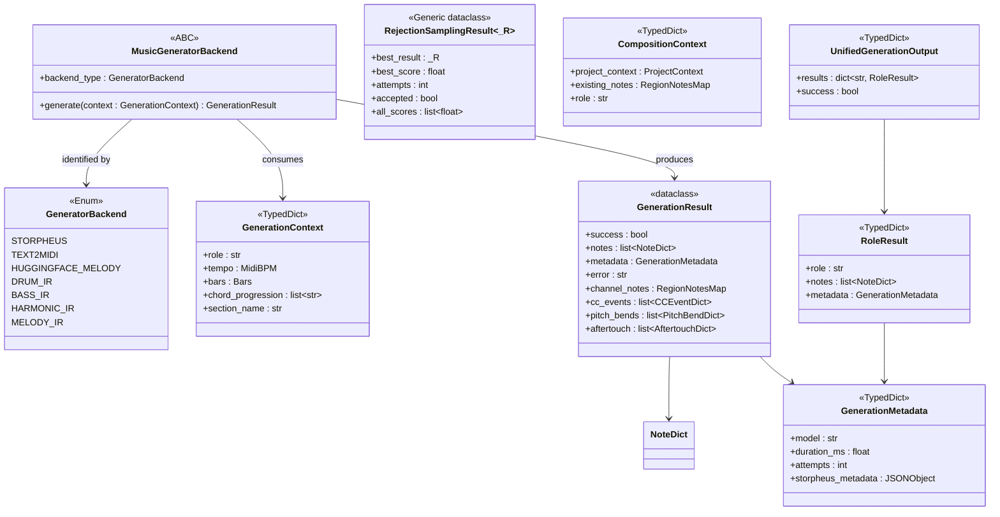
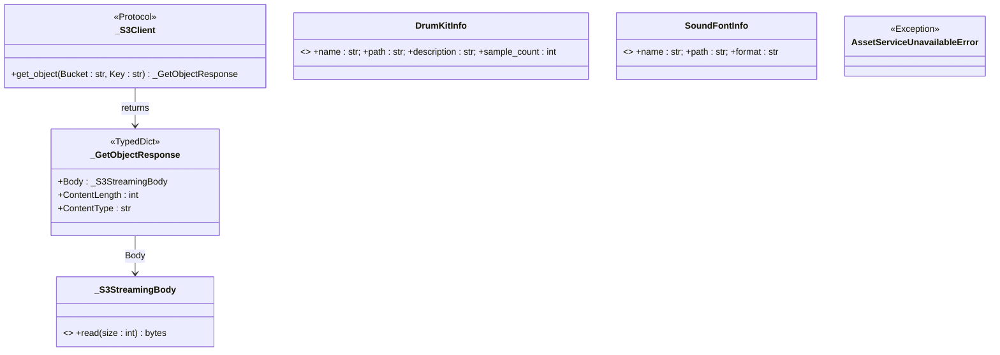

# Maestro — Type Contracts Reference

> Updated: 2026-02-27 | Reflects the full `Any`-elimination sweep, MIDI primitive constraint system, and Structured Prompt DSL type hierarchy. `Any` no longer exists in any production app file. All MIDI primitives carry range constraints at every layer — Pydantic validation, dataclass `__post_init__`, and named `Annotated` type aliases. Named type aliases (`MaestroDimensions`, `PromptConstraints`) replace naked `dict[str, JSONValue]` throughout the prompt pipeline.

This document is the single source of truth for every named entity (TypedDict, dataclass, Protocol, type alias) in the Maestro codebase. It covers the full API surface of each type: fields, types, optionality, and intended use.

---

## Table of Contents

1. [Design Philosophy](#design-philosophy)
2. [Maestro Contracts (`app/contracts/`)](#maestro-contracts)
   - [midi_types.py](#midi_typespy)
   - [generation_types.py](#generation_typespy)
   - [llm_types.py](#llm_typespy)
   - [json_types.py](#json_typespy)
   - [project_types.py](#project_typespy)
   - [mcp_types.py](#mcp_typespy)
3. [Auth (`maestro/auth/tokens.py`)](#auth)
4. [Services](#services)
   - [Assets (`maestro/services/assets.py`)](#assets)
   - [StorpheusRawResponse](#storpheusrawresponse)
   - [SampleChange](#samplechange)
   - [Muse Divergence Types](#muse-divergence-types)
   - [ExpressivenessResult](#expressivenessresult)
   - [MuseTempoResult](#musetemporesult)
   - [MuseTempoHistoryEntry](#musetemopohistoryentry)
   - [Muse Motif Types](#muse-motif-types-maestroservicesmuse_motifpy)
   - [Muse Validate Types](#muse-validate-types)
   - [GrooveStatus](#groovestatuss)
   - [CommitGrooveMetrics](#commitgroovemetrics)
   - [GrooveCheckResult](#groovecheckresult)
   - [ReleaseArtifact](#releaseartifact)
   - [ReleaseResult](#releaseresult)
   - [RenderPreviewResult](#renderpreviewresult)
   - [PianoRollRenderResult](#pianorollrenderresult)
   - [RenderPipelineResult](#renderpipelineresult)
5. [Variation Layer (`app/variation/`)](#variation-layer)
   - [Event Envelope payloads](#event-envelope-payloads)
   - [PhraseRecord](#phraserecord)
6. [Planner (`maestro/core/planner/`)](#planner)
   - [_ExistingTrackInfo](#_existingtrackinfo)
   - [_AddMidiTrackParams](#_addmiditrackparams)
   - [_AddMidiRegionParams](#_addmidiregionparams)
   - [_GenerateParams](#_generateparams)
   - [Plan wire-format TypedDicts (plan_json_types.py)](#plan-wire-format-typeddicts-plan_json_typespy)
7. [State Store (`maestro/core/state_store.py`)](#state-store)
   - [_ProjectMetadataSnapshot](#_projectmetadatasnapshot)
7. [Storpheus Types (`storpheus/storpheus_types.py`)](#storpheus-types)
   - [MIDI event types](#midi-event-types)
   - [Pipeline types](#pipeline-types)
   - [ChunkMetadata](#chunkmetadata)
   - [ChunkedGenerationResult](#chunkedgenerationresult)
   - [Scoring types](#scoring-types)
8. [DAW Adapter Layer (`maestro/daw/`)](#daw-adapter-layer)
   - [Ports (`maestro/daw/ports.py`)](#ports-appdawportspy)
   - [Phase Mapping (`maestro/daw/stori/phase_map.py`)](#phase-mapping-appdawstoriphase_mappy)
   - [Tool Registry (`maestro/daw/stori/tool_registry.py`)](#tool-registry-appdawstoritool_registrypy)
9. [Structured Prompt DSL (`maestro/prompts/`)](#structured-prompt-dsl)
   - [Type Aliases](#prompt-type-aliases)
   - [TargetSpec](#targetspec)
   - [PositionSpec](#positionspec)
   - [VibeWeight](#vibeweight)
   - [StructuredPrompt](#structuredprompt)
   - [MaestroPrompt](#maestroprompt)
   - [Error Hierarchy](#prompt-error-hierarchy)
10. [Region Event Map Aliases](#region-event-map-aliases)
11. [HTTP Response Entities](#http-response-entities)
    - [Protocol Introspection](#protocol-introspection-appprotocolresponsespy)
    - [Muse VCS](#muse-vcs-appapiroutesmusepy)
    - [Maestro Core](#maestro-core-appapiroutesmaestropy)
    - [MCP Endpoints](#mcp-endpoints-appapiroutesmcppy)
    - [Variation Endpoints](#variation-endpoints)
    - [Conversations](#conversations-appapiroutesconversationsmodelspy)
12. [Muse Context (`maestro/services/muse_context.py`)](#muse-context-maestroservicesmuse_contextpy)
    - [MuseHeadCommitInfo](#museheadcommitinfo)
    - [MuseSectionDetail](#musesectiondetail)
    - [MuseHarmonicProfile](#museharmonicprofile)
    - [MuseDynamicProfile](#musedynamicprofile)
    - [MuseMelodicProfile](#musemelodic profile)
    - [MuseTrackDetail](#musetrackdetail)
    - [MuseMusicalState](#musemusicalstate)
    - [MuseHistoryEntry](#musehistoryentry)
    - [MuseContextResult](#musecontextresult)
13. [Tempo Convention](#tempo-convention)
14. [`Any` Status](#any-status)
15. [Entity Hierarchy](#entity-hierarchy)
15. [Entity Graph (Mermaid)](#entity-graph-mermaid)
    - [Diagram 1 — JSON Type Universe](#diagram-1--json-type-universe)
    - [Diagram 2 — MIDI Primitives](#diagram-2--midi-primitives)
    - [Diagram 3 — MIDI Event TypedDicts & Region Maps](#diagram-3--midi-event-typeddicts--region-maps)
    - [Diagram 4 — LLM Wire Types: Messages & Streaming](#diagram-4--llm-wire-types-messages--streaming)
    - [Diagram 5 — Pydantic Base & Request Models](#diagram-5--pydantic-base--request-models)
    - [Diagram 6 — SSE Event Hierarchy (MaestroEvent)](#diagram-6--sse-event-hierarchy-maestroevent)
    - [Diagram 7 — Variation Pydantic Models](#diagram-7--variation-pydantic-models)
    - [Diagram 8 — Generation & Backend Pipeline](#diagram-8--generation--backend-pipeline)
    - [Diagram 9 — Music Spec IR](#diagram-9--music-spec-ir)
    - [Diagram 10 — Variation Layer Runtime](#diagram-10--variation-layer-runtime)
    - [Diagram 11 — Agent Contracts & Composition Protocol](#diagram-11--agent-contracts--composition-protocol)
    - [Diagram 12 — State Store & Entity Registry](#diagram-12--state-store--entity-registry)
    - [Diagram 13 — Project & Context TypedDicts](#diagram-13--project--context-typeddicts)
    - [Diagram 14 — Storpheus Service Types](#diagram-14--storpheus-service-types)
    - [Diagram 15 — Asset Service & S3 Protocols](#diagram-15--asset-service--s3-protocols)
    - [Diagram 16 — HTTP Response Models](#diagram-16--http-response-models)
    - [Diagram 17 — MCP JSON-RPC TypedDicts](#diagram-17--mcp-json-rpc-typeddicts)
    - [Diagram 18 — DAW Adapter & Phase Mapping](#diagram-18--daw-adapter--phase-mapping)
    - [Diagram 19 — Structured Prompt DSL](#diagram-19--structured-prompt-dsl)

---

## Design Philosophy

Every entity in this codebase follows four rules:

1. **No `Any`.** `Any` does not appear in any production app file. LLM API shapes are described with full TypedDict hierarchies in `llm_types.py`. External untyped library boundaries (boto3, Pydantic's `model_json_schema`) are handled with `dict[str, object]` and Protocol types — never `Any`.

2. **Boundaries own coercion.** When external data arrives as `float | str | None` (e.g., from JSON), the boundary module coerces it to the canonical internal type. Downstream code always sees clean types.

3. **TypedDicts for data, dataclasses for behavior.** TypedDicts carry structured data across function boundaries. Dataclasses are used when the entity needs default values, computed properties, or is passed as a unit of domain logic.

4. **MIDI primitives are range-constrained at every layer.** The canonical type aliases in `app/contracts/midi_types.py` define the single source of truth for all MIDI value ranges. These constraints propagate automatically through all three enforcement layers:
   - **Pydantic `BaseModel` fields**: `Annotated[int, Field(ge=..., le=...)]` enforces at parse time. Invalid values raise `ValidationError` before reaching business logic.
   - **Frozen dataclasses** (`contracts.py`): `__post_init__` calls `_assert_range` immediately at construction. Frozen semantics mean values are immutable and validated.
   - **TypedDicts**: `Annotated` aliases self-document ranges; enforcement occurs at the Pydantic boundary layer that wraps them. Range comments in every TypedDict docstring serve as a contract for callers.

### MIDI Primitive Ranges

Defined in `app/contracts/midi_types.py`. Import from there — never define inline.

| Type alias | Range | Use |
|---|---|---|
| `MidiPitch` | 0–127 | MIDI note number |
| `MidiVelocity` | 0–127 | Note velocity (0 = note-off; 1–127 audible) |
| `MidiChannel` | 0–15 | MIDI channel (drums = 9) |
| `MidiCC` | 0–127 | CC controller number |
| `MidiCCValue` | 0–127 | CC value |
| `MidiAftertouchValue` | 0–127 | Pressure value |
| `MidiPitchBend` | −8192–8191 | 14-bit signed; 0 = centre |
| `MidiGMProgram` | 0–127 | General MIDI program (0-indexed) |
| `MidiBPM` | 20–300 | Tempo in BPM — always an integer |
| `BeatPosition` | ≥ 0.0 | Fractional beat position (note level) |
| `BeatDuration` | > 0.0 | Fractional beat duration (note level) |
| `ArrangementBeat` | ≥ 0 (int) | Bar-aligned section offset |
| `ArrangementDuration` | ≥ 1 (int) | Section duration in beats |
| `Bars` | ≥ 1 | Bar count |

**Two-tier beat position design:** Note-level timing (`BeatPosition`, `BeatDuration`) is `float` because notes can start at fractional positions (e.g., beat 1.5 = the "and" of beat 1). Section-level timing (`ArrangementBeat`, `ArrangementDuration`) is `int` because sections are always bar-aligned — `duration_beats = bars × time_signature_numerator` is always a whole number.

---

## Maestro Contracts

### `midi_types.py`

**Path:** `app/contracts/midi_types.py`

Single source of truth for all MIDI primitive ranges. Every field that carries a MIDI value imports its type alias from here instead of repeating `Field(ge=0, le=127)` inline.

All aliases are `Annotated[int, Field(...)]` or `Annotated[float, Field(...)]`, which means:
- Pydantic `BaseModel` fields pick up the constraint automatically.
- TypedDict fields use the alias for self-documentation; enforcement happens at the Pydantic boundary.
- Dataclass `__post_init__` methods call `_assert_range` (also exported from this module) for runtime enforcement without Pydantic.

See the **MIDI Primitive Ranges** table in [Design Philosophy](#design-philosophy) for the complete listing.

**Storpheus note:** `storpheus/storpheus_types.py` cannot import from `app/` (separate container). It mirrors the range constants as module-level `_MIDI_*` values and exports its own `_assert_range` helper.

---

### `generation_types.py`

**Path:** `app/contracts/generation_types.py`

#### `GenerationContext`

`TypedDict, total=False` — All optional kwargs for `MusicGeneratorBackend.generate()`.

Backends pick the keys they need and ignore the rest. This replaces `**kwargs: Any` on the backend interface.

| Field | Type | Description |
|-------|------|-------------|
| `emotion_vector` | `EmotionVector \| None` | Resolved emotional intent vector |
| `quality_preset` | `str` | `"balanced"`, `"quality"`, or `"speed"` |
| `composition_id` | `str \| None` | UUID linking this generation to a composition |
| `seed` | `int \| None` | Deterministic seed for reproducible generation |
| `trace_id` | `str \| None` | Distributed trace ID for observability |
| `add_outro` | `bool` | Whether to append a tail/outro to the phrase |
| `music_spec` | `MusicSpec \| None` | Symbolic music specification (key, mode, rhythm) |
| `rhythm_spine` | `RhythmSpine \| None` | Groove engine rhythm constraint |
| `drum_kick_beats` | `list[float] \| None` | Explicit kick-drum beat positions for locking |
| `temperature` | `float` | LLM-style sampling temperature for generation |
| `section_type` | `str \| None` | Structural section hint (`"verse"`, `"chorus"`, etc.) |
| `num_candidates` | `int \| None` | How many candidates to generate for rejection sampling |

---

#### `CompositionContext`

`TypedDict, total=False` — Contextual data threaded through generator tool calls within a single composition turn.

Constructed by `RuntimeContext.to_composition_context()` and extended by agent code before being passed to `_apply_single_tool_call`. All fields are optional — callers populate only what they know.

| Field | Type | Description |
|-------|------|-------------|
| `style` | `str` | Genre/style string (e.g. `"house"`, `"jazz"`) |
| `tempo` | `int` | Beats per minute — always a whole integer |
| `bars` | `int` | Number of bars to generate |
| `key` | `str \| None` | Musical key (e.g. `"Am"`, `"C"`) |
| `quality_preset` | `str` | Quality tier for generation |
| `emotion_vector` | `EmotionVector \| None` | Reconstructed emotion vector for the backend |
| `section_key` | `str` | Identifies the section (e.g. `"0:verse"`) |
| `all_instruments` | `list[str]` | All instrument roles in the composition |
| `composition_id` | `str` | UUID for the composition run |
| `role` | `str` | This instrument's role (e.g. `"bass"`, `"drums"`) |
| `previous_notes` | `list[NoteDict]` | Notes from the previous section (chaining) |
| `drum_telemetry` | `dict[str, object]` | Drum energy/groove data injected for bass/chord agents |

**drum_telemetry keys** (produced by `SectionTelemetry`, consumed by bass/chord agents):

| Key | Type | Description |
|-----|------|-------------|
| `energy_level` | `float` | Drum section energy (0–1) |
| `density_score` | `float` | Notes-per-beat density |
| `groove_vector` | `list[float]` | 16-step rhythmic pattern |
| `kick_pattern_hash` | `str` | Fingerprint of the kick pattern |
| `rhythmic_complexity` | `float` | Syncopation/complexity score |

---

#### `RoleResult`

`TypedDict, total=False` — Per-instrument outcome from `execute_unified_generation`.

| Field | Type | Description |
|-------|------|-------------|
| `notes_added` | `int` | Count of notes written to the DAW region |
| `success` | `bool` | Whether generation succeeded |
| `error` | `str \| None` | Error message on failure |
| `track_id` | `str` | DAW track ID where notes were written |
| `region_id` | `str` | DAW region ID where notes were written |

---

#### `UnifiedGenerationOutput`

`TypedDict, total=False` — Full return value of `execute_unified_generation`.

Groups per-role results with aggregate statistics, replacing a mixed `dict[str, RoleResult | int]`.

| Field | Type | Description |
|-------|------|-------------|
| `per_role` | `dict[str, RoleResult]` | Results keyed by instrument role name |
| `_metadata` | `object` | Raw metadata from the backend response |
| `_duration_ms` | `int` | Total wall-clock generation time in milliseconds |

---

### `llm_types.py`

**Path:** `app/contracts/llm_types.py`

Complete TypedDict hierarchy for every shape used by `LLMClient`. No `Any` lives here — every field has a concrete type. Consumers import named entities from this module; they never write `dict[str, Any]` themselves.

All streaming event consumers narrow on `event["type"]` (not `.get("type")`) to get full discriminated-union inference from mypy.

---

#### Chat message shapes

##### `ToolCallFunction`

`TypedDict` — The `function` field inside an OpenAI tool call. `arguments` is always a JSON-encoded string; callers must `json.loads` it.

| Field | Type | Description |
|-------|------|-------------|
| `name` | `str` | Function name the model wants to call |
| `arguments` | `str` | JSON-encoded arguments string |

##### `ToolCallEntry`

`TypedDict` — One tool call in an assistant message (streaming accumulator or final response).

| Field | Type | Description |
|-------|------|-------------|
| `id` | `str` | Unique tool call ID (matches `ToolResultMessage.tool_call_id`) |
| `type` | `str` | Always `"function"` in OpenAI format |
| `function` | `ToolCallFunction` | The function being called |

##### `SystemMessage`

`TypedDict` — A system-role prompt message.

| Field | Type | Description |
|-------|------|-------------|
| `role` | `Literal["system"]` | Discriminant |
| `content` | `str` | System prompt text |

##### `UserMessage`

`TypedDict` — A user-role message.

| Field | Type | Description |
|-------|------|-------------|
| `role` | `Literal["user"]` | Discriminant |
| `content` | `str` | User message text |

##### `AssistantMessage`

`TypedDict, total=False` — An assistant reply (may be text-only or contain tool calls).

| Field | Required | Type | Description |
|-------|----------|------|-------------|
| `role` | ✓ | `Literal["assistant"]` | Discriminant |
| `content` | | `str \| None` | Assistant text reply |
| `tool_calls` | | `list[ToolCallEntry]` | Tool calls requested by the model |

##### `ToolResultMessage`

`TypedDict` — A tool result message returned to the LLM after a tool call.

| Field | Type | Description |
|-------|------|-------------|
| `role` | `Literal["tool"]` | Discriminant |
| `tool_call_id` | `str` | Matches `ToolCallEntry.id` |
| `content` | `str` | JSON-encoded result string |

##### `ChatMessage`

`Union[SystemMessage, UserMessage, AssistantMessage, ToolResultMessage]` — Discriminated union of all OpenAI chat message shapes. Narrow via `msg["role"]`.

---

#### Tool schema shapes

##### `ToolParametersDict`

`TypedDict, total=False` — JSON Schema `parameters` block inside an OpenAI tool definition.

| Field | Type | Description |
|-------|------|-------------|
| `type` | `str` | Always `"object"` |
| `properties` | `dict[str, object]` | Per-parameter schemas |
| `required` | `list[str]` | Required parameter names |

##### `ToolFunctionDict`

`TypedDict` — The `function` field of an OpenAI tool definition.

| Field | Required | Type | Description |
|-------|----------|------|-------------|
| `name` | ✓ | `str` | Tool name |
| `description` | ✓ | `str` | Shown to the model |
| `parameters` | | `ToolParametersDict` | JSON Schema for the tool's arguments |

##### `ToolSchemaDict`

`TypedDict` — A single OpenAI-format tool definition (`{type: "function", function: {...}}`).

| Field | Type | Description |
|-------|------|-------------|
| `type` | `str` | Always `"function"` |
| `function` | `ToolFunctionDict` | The tool's function definition |

---

#### Token usage shapes

##### `PromptTokenDetails`

`TypedDict, total=False` — Nested token-detail block inside `UsageStats`. OpenRouter surfaces cache data in at least two field names depending on model and API version.

| Field | Type | Description |
|-------|------|-------------|
| `cached_tokens` | `int` | Cache read hits |
| `cache_write_tokens` | `int` | Cache write/creation |

##### `UsageStats`

`TypedDict, total=False` — Token usage and cost stats returned by OpenAI/Anthropic/OpenRouter. All fields optional — the exact set varies by model and API version.

| Field | Type | Description |
|-------|------|-------------|
| `prompt_tokens` | `int` | Input tokens billed |
| `completion_tokens` | `int` | Output tokens generated |
| `total_tokens` | `int` | Sum of prompt + completion |
| `prompt_tokens_details` | `PromptTokenDetails` | Nested cache breakdown |
| `native_tokens_cached` | `int` | OR: cache read tokens (alt field name) |
| `cache_read_input_tokens` | `int` | Anthropic: cache read tokens |
| `prompt_cache_hit_tokens` | `int` | OR: cache hit tokens (alt) |
| `cache_creation_input_tokens` | `int` | Anthropic: cache write tokens |
| `prompt_cache_miss_tokens` | `int` | OR: cache miss tokens |
| `cache_discount` | `float` | Cost discount from cache (USD) |

---

#### Request payload shapes

##### `ProviderConfig`

`TypedDict, total=False` — OpenRouter provider-routing config (`payload["provider"]`). Used to lock generation to direct Anthropic for caching and reasoning token support.

| Field | Type | Description |
|-------|------|-------------|
| `order` | `list[str]` | Ordered provider preference list (e.g. `["anthropic"]`) |
| `allow_fallbacks` | `bool` | Whether to fall back if first provider fails |

##### `ReasoningConfig`

`TypedDict, total=False` — OpenRouter extended-reasoning config (`payload["reasoning"]`).

| Field | Type | Description |
|-------|------|-------------|
| `max_tokens` | `int` | Token budget for reasoning (extended thinking) |

##### `OpenAIRequestPayload`

`TypedDict, total=False` — Full request body sent to OpenRouter's chat completions endpoint. `tools` is `list[dict[str, object]]` rather than `list[ToolSchemaDict]` because prompt-caching adds an extra `cache_control` key to the last tool definition before sending.

| Field | Required | Type | Description |
|-------|----------|------|-------------|
| `model` | ✓ | `str` | Model identifier (e.g. `"anthropic/claude-sonnet-4.6"`) |
| `messages` | ✓ | `list[ChatMessage]` | Conversation history |
| `temperature` | | `float` | Sampling temperature |
| `max_tokens` | | `int` | Maximum output tokens |
| `stream` | | `bool` | Enable SSE streaming |
| `tools` | | `list[dict[str, object]]` | Tool definitions (may include `cache_control`) |
| `tool_choice` | | `str \| dict[str, object]` | `"auto"` \| `"required"` \| `"none"` \| specific tool |
| `provider` | | `ProviderConfig` | OpenRouter routing config |
| `reasoning` | | `ReasoningConfig` | Extended reasoning budget |

---

#### Non-streaming response shapes

##### `ResponseFunction`

`TypedDict, total=False` — The `function` field of a tool call in a non-streaming response.

| Field | Type | Description |
|-------|------|-------------|
| `name` | `str` | Function name |
| `arguments` | `str` | JSON-encoded arguments string |

##### `ResponseToolCall`

`TypedDict, total=False` — One tool call in a non-streaming assistant response choice.

| Field | Type | Description |
|-------|------|-------------|
| `id` | `str` | Tool call ID |
| `type` | `str` | Always `"function"` |
| `function` | `ResponseFunction` | The function called |

##### `ResponseMessage`

`TypedDict, total=False` — The `message` field inside a non-streaming response choice.

| Field | Type | Description |
|-------|------|-------------|
| `content` | `str \| None` | Assistant text reply |
| `tool_calls` | `list[ResponseToolCall]` | Tool calls requested |

##### `ResponseChoice`

`TypedDict, total=False` — One choice in a non-streaming API response.

| Field | Type | Description |
|-------|------|-------------|
| `message` | `ResponseMessage` | The assistant message |
| `finish_reason` | `str \| None` | `"stop"` \| `"tool_calls"` \| `"length"` \| … |

##### `OpenAIResponse`

`TypedDict, total=False` — Full (non-streaming) response body from an OpenAI-compatible API.

| Field | Type | Description |
|-------|------|-------------|
| `choices` | `list[ResponseChoice]` | Candidate completions (always 1 in practice) |
| `usage` | `UsageStats` | Token usage stats |

---

#### Streaming chunk shapes

##### `ReasoningDetail`

`TypedDict, total=False` — One element of `delta.reasoning_details` in a stream chunk. OpenRouter uses `type="reasoning.text"` for incremental text and `type="reasoning.summary"` for the final consolidated summary.

| Field | Type | Description |
|-------|------|-------------|
| `type` | `str` | `"reasoning.text"` or `"reasoning.summary"` |
| `text` | `str` | Incremental reasoning text |
| `summary` | `str` | Final reasoning summary (summary type only) |

##### `ToolCallFunctionDelta`

`TypedDict, total=False` — Incremental function info in a streaming tool call delta.

| Field | Type | Description |
|-------|------|-------------|
| `name` | `str` | Function name (arrives in first fragment) |
| `arguments` | `str` | Arguments fragment (concatenate across deltas) |

##### `ToolCallDelta`

`TypedDict, total=False` — One tool call fragment in a streaming delta.

| Field | Type | Description |
|-------|------|-------------|
| `index` | `int` | Position in the tool_calls array (for multi-tool accumulation) |
| `id` | `str` | Tool call ID (arrives in first fragment) |
| `type` | `str` | Always `"function"` |
| `function` | `ToolCallFunctionDelta` | Incremental function data |

##### `StreamDelta`

`TypedDict, total=False` — The `delta` field inside a streaming choice.

| Field | Type | Description |
|-------|------|-------------|
| `reasoning_details` | `list[ReasoningDetail]` | Extended-thinking fragments |
| `content` | `str` | Content text fragment |
| `tool_calls` | `list[ToolCallDelta]` | Tool call fragments |

##### `StreamChoice`

`TypedDict, total=False` — One choice in a streaming SSE chunk.

| Field | Type | Description |
|-------|------|-------------|
| `delta` | `StreamDelta` | Incremental content for this chunk |
| `finish_reason` | `str \| None` | Set on the final chunk; `None` on all others |

##### `OpenAIStreamChunk`

`TypedDict, total=False` — One SSE data chunk from the OpenRouter streaming API.

| Field | Type | Description |
|-------|------|-------------|
| `choices` | `list[StreamChoice]` | Candidate chunks (always 1 in practice) |
| `usage` | `UsageStats` | Token stats (present only on the final chunk) |

---

#### Stream event shapes (yielded by `LLMClient.chat_completion_stream`)

These are the **internal** events yielded by the LLM client — they differ from the wire SSE events emitted to the DAW.

##### `ReasoningDeltaEvent`

`TypedDict` — Incremental reasoning text from an extended-thinking model.

| Field | Type | Description |
|-------|------|-------------|
| `type` | `Literal["reasoning_delta"]` | Discriminant |
| `text` | `str` | Reasoning text fragment |

##### `ContentDeltaEvent`

`TypedDict` — Incremental content text from the model.

| Field | Type | Description |
|-------|------|-------------|
| `type` | `Literal["content_delta"]` | Discriminant |
| `text` | `str` | Content text fragment |

##### `DoneStreamEvent`

`TypedDict` — Terminal event yielded when streaming completes. `tool_calls` holds the fully-accumulated list built up from all `ToolCallDelta` fragments — consumers should not read it before this event arrives.

| Field | Type | Description |
|-------|------|-------------|
| `type` | `Literal["done"]` | Discriminant |
| `content` | `str \| None` | Full accumulated content (may be `None` for tool-call-only responses) |
| `tool_calls` | `list[ToolCallEntry]` | All tool calls, fully accumulated |
| `finish_reason` | `str \| None` | Final finish reason |
| `usage` | `UsageStats` | Token usage for the full request |

##### `StreamEvent`

`Union[ReasoningDeltaEvent, ContentDeltaEvent, DoneStreamEvent]` — Discriminated union of all events yielded by `chat_completion_stream`. Narrow via `event["type"]`:

```python
if event["type"] == "reasoning_delta":
    text: str = event["text"]           # mypy knows this is ReasoningDeltaEvent
elif event["type"] == "content_delta":
    text: str = event["text"]           # ContentDeltaEvent
elif event["type"] == "done":
    calls: list[ToolCallEntry] = event["tool_calls"]  # DoneStreamEvent
```

##### `OpenAIToolChoice`

Type alias: `str | dict[str, object]` — Either a string shorthand (`"auto"`, `"none"`, `"required"`) or an explicit tool-selector dict. Used in `OpenAIRequestPayload.tool_choice`.

---

### `json_types.py`

**Path:** `app/contracts/json_types.py`

#### JSON Primitive Types

| Name | Type | Use |
|------|------|-----|
| `JSONScalar` | `str \| int \| float \| bool \| None` | A JSON leaf value |
| `JSONValue` | Recursive union | Any valid JSON value — use instead of `Any` for truly unknown payloads |
| `JSONObject` | `dict[str, JSONValue]` | A JSON object with unknown key set |

#### `NoteDict`

`TypedDict, total=False` — A single MIDI note. Accepts **both** camelCase (DAW wire) and snake_case (internal) field names so that notes flow through all pipeline layers without conversion.

| Field | Format | Type | Description |
|-------|--------|------|-------------|
| `pitch` | both | `int` | MIDI pitch (0–127) |
| `velocity` | both | `int` | MIDI velocity (0–127) |
| `channel` | both | `int` | MIDI channel (0–15) |
| `startBeat` | wire | `float` | Note onset in beats |
| `durationBeats` | wire | `float` | Note duration in beats |
| `noteId` | wire | `str` | Unique note ID |
| `trackId` | wire | `str` | Foreign key to track |
| `regionId` | wire | `str` | Foreign key to region |
| `start_beat` | internal | `float` | Note onset in beats |
| `duration_beats` | internal | `float` | Note duration in beats |
| `note_id` | internal | `str` | Unique note ID |
| `track_id` | internal | `str` | Foreign key to track |
| `region_id` | internal | `str` | Foreign key to region |
| `layer` | both | `str` | Drum renderer layer tag |

`InternalNoteDict` is an alias for `NoteDict` used at storage boundaries to signal intent.

#### `CCEventDict`

`TypedDict` — A MIDI Control Change event.

| Field | Type | Description |
|-------|------|-------------|
| `cc` | `int` | CC number (0–127) |
| `beat` | `float` | Event position in beats |
| `value` | `int` | CC value (0–127) |

#### `PitchBendDict`

`TypedDict` — A MIDI Pitch Bend event.

| Field | Type | Description |
|-------|------|-------------|
| `beat` | `float` | Event position in beats |
| `value` | `int` | Pitch bend value (-8192 to 8191) |

#### `AftertouchDict`

`TypedDict, total=False` — A MIDI Aftertouch event (channel pressure or polyphonic key pressure).

| Field | Required | Type | Description |
|-------|----------|------|-------------|
| `beat` | ✓ | `float` | Event position in beats |
| `value` | ✓ | `int` | Pressure value (0–127) |
| `pitch` | | `int` | Specific MIDI pitch (polyphonic aftertouch only) |

#### `ToolCallDict`

`TypedDict` — Shape of a collected tool call in `CompleteEvent.tool_calls`.

| Field | Type | Description |
|-------|------|-------------|
| `tool` | `str` | Tool name (e.g. `"stori_add_notes"`) |
| `params` | `dict[str, object]` | LLM-generated tool arguments |

#### `RegionMetadataWire`

`TypedDict, total=False` — Region position metadata in camelCase (handler → storage path).

| Field | Type | Description |
|-------|------|-------------|
| `startBeat` | `float` | Region start position in beats |
| `durationBeats` | `float` | Region duration in beats |
| `name` | `str` | Region display name |

#### `RegionMetadataDB`

`TypedDict, total=False` — Region position metadata in snake_case (database path).

| Field | Type | Description |
|-------|------|-------------|
| `start_beat` | `float` | Region start position in beats |
| `duration_beats` | `float` | Region duration in beats |
| `name` | `str` | Region display name |

---

### `project_types.py`

**Path:** `app/contracts/project_types.py`

#### `TimeSignatureDict`

`TypedDict` — Time signature in structured form. Some DAW versions send `"4/4"` (string); others send this dict.

| Field | Type | Description |
|-------|------|-------------|
| `numerator` | `int` | Beats per bar |
| `denominator` | `int` | Beat unit (4 = quarter note) |

#### `MixerSettingsDict`

`TypedDict, total=False` — Mixer state for a track.

| Field | Type | Description |
|-------|------|-------------|
| `volume` | `float` | Track volume (0.0–1.0) |
| `pan` | `float` | Pan position (-1.0 to 1.0) |
| `isMuted` | `bool` | Whether the track is muted |
| `isSolo` | `bool` | Whether the track is soloed |

#### `AutomationLaneDict`

`TypedDict, total=False` — An automation lane on a track.

| Field | Type | Description |
|-------|------|-------------|
| `id` | `str` | Lane UUID |
| `parameter` | `str` | Automated parameter name |
| `points` | `list[dict[str, float]]` | Automation curve control points |

#### `ProjectRegion`

`TypedDict, total=False` — A MIDI region inside a track.

| Field | Type | Description |
|-------|------|-------------|
| `id` | `str` | Region UUID |
| `name` | `str` | Region display name |
| `startBeat` | `float` | Region start position in beats |
| `durationBeats` | `float` | Region duration in beats |
| `noteCount` | `int` | Number of MIDI notes |
| `notes` | `list[NoteDict]` | Notes in this region |

#### `ProjectTrack`

`TypedDict, total=False` — A track in the DAW project.

`id` is the track's own UUID. `trackId` is reserved for foreign-key references in tool call params and event payloads (e.g. `stori_add_midi_region(trackId=…)`).

| Field | Type | Description |
|-------|------|-------------|
| `id` | `str` | Track UUID |
| `name` | `str` | Track display name |
| `gmProgram` | `int \| None` | General MIDI program (null on drum tracks) |
| `drumKitId` | `str \| None` | Drum kit ID (null on melodic tracks) |
| `isDrums` | `bool` | Whether this is a drum track |
| `volume` | `float` | Volume (0.0–1.0) |
| `pan` | `float` | Pan (-1.0–1.0) |
| `muted` | `bool` | Mute state |
| `solo` | `bool` | Solo state |
| `color` | `str` | Display color hex |
| `icon` | `str` | Track icon name |
| `role` | `str` | Instrument role (e.g. `"bass"`, `"drums"`) |
| `regions` | `list[ProjectRegion]` | All regions on this track |
| `mixerSettings` | `MixerSettingsDict` | Detailed mixer state |
| `automationLanes` | `list[AutomationLaneDict]` | Automation lanes |

#### `BusDict`

`TypedDict, total=False` — An audio bus.

| Field | Type | Description |
|-------|------|-------------|
| `id` | `str` | Bus UUID |
| `name` | `str` | Bus display name |

#### `ProjectContext`

`TypedDict, total=False` — The full DAW project state sent from the Stori macOS app on every request.

`timeSignature` is polymorphic — the DAW sends it as `"4/4"` (string) in some versions and as `{"numerator": 4, "denominator": 4}` (dict) in others. Coerce at the boundary with `parse_time_signature()`.

| Field | Type | Description |
|-------|------|-------------|
| `id` | `str` | Project UUID — canonical project identifier |
| `name` | `str` | Project display name |
| `tempo` | `int` | Project tempo in BPM (always whole integer) |
| `key` | `str` | Root key (e.g. `"Am"`, `"C"`) |
| `timeSignature` | `str \| TimeSignatureDict` | Time signature |
| `tracks` | `list[ProjectTrack]` | All tracks in the project |
| `buses` | `list[BusDict]` | All audio buses |

### `mcp_types.py`

**Path:** `app/contracts/mcp_types.py`

Named TypedDicts for every entity in the MCP protocol layer: tool schema shapes, server capabilities, JSON-RPC 2.0 messages, and the DAW communication channel. No `dict[str, object]` is used here — every shape is named and documented.

#### Tool schema shapes

| Type | Kind | Description |
|------|------|-------------|
| `MCPInputSchema` | `TypedDict, total=False` | JSON Schema for an MCP tool's accepted arguments. `type` and `properties` are `Required`; `required` is optional. |
| `MCPToolDef` | `TypedDict, total=False` | Full definition of one MCP tool. `name`, `description`, `inputSchema` are `Required`; `server_side` is optional. |
| `MCPContentBlock` | `TypedDict` | A content block in an MCP tool result — always `{"type": "text", "text": "..."}`. |

#### Server capability shapes

| Type | Kind | Description |
|------|------|-------------|
| `MCPToolsCapability` | `TypedDict, total=False` | The `tools` entry in `MCPCapabilities`. Currently always `{}` — reserved for future metadata. |
| `MCPResourcesCapability` | `TypedDict, total=False` | The `resources` entry in `MCPCapabilities`. Currently always `{}` — reserved for future metadata. |
| `MCPCapabilities` | `TypedDict, total=False` | MCP server capabilities advertised during the `initialize` handshake. Fields: `tools`, `resources`. |
| `MCPServerInfo` | `TypedDict` | Server info returned in `initialize` responses and `get_server_info()`. Fields: `name`, `version`, `protocolVersion`, `capabilities`. |

#### JSON-RPC 2.0 message shapes

| Type | Kind | Description |
|------|------|-------------|
| `MCPRequest` | `TypedDict, total=False` | Incoming JSON-RPC 2.0 message. `jsonrpc` and `method` are `Required`; `id` (absent for notifications) and `params` (absent for no-arg methods) are optional. |
| `MCPSuccessResponse` | `TypedDict` | JSON-RPC 2.0 success response with `jsonrpc`, `id`, and `result: dict[str, object]`. |
| `MCPErrorDetail` | `TypedDict, total=False` | The `error` object in an error response. `code` and `message` are `Required`; `data` is optional. |
| `MCPErrorResponse` | `TypedDict` | JSON-RPC 2.0 error response with `jsonrpc`, `id`, and `error: MCPErrorDetail`. |
| `MCPResponse` | `Union` | `MCPSuccessResponse \| MCPErrorResponse` — discriminated union of all response shapes. |

#### DAW channel shapes

| Type | Kind | Description |
|------|------|-------------|
| `DAWToolCallMessage` | `TypedDict` | Message sent from MCP server → DAW over WebSocket to trigger tool execution. Fields: `type: Literal["toolCall"]`, `requestId: str`, `tool: str`, `arguments: dict[str, object]`. |
| `DAWToolResponse` | `TypedDict, total=False` | Response sent from DAW → MCP server after tool execution. `success: Required[bool]`; `content: list[MCPContentBlock]` and `isError: bool` are optional. |

**Deserialization boundary:** Raw WebSocket / HTTP payloads are parsed into `DAWToolResponse` by `_parse_daw_response(raw: object) -> DAWToolResponse` in `maestro/api/routes/mcp.py`. This is the single point where untyped JSON becomes a typed shape. The `is True` comparison (not `bool()`) ensures only JSON `true` counts as success.

---

## Auth

### `maestro/auth/tokens.py`

#### `TokenClaims`

`TypedDict, total=False` — Decoded JWT payload returned by `validate_access_code`.

`type`, `iat`, and `exp` are always present. `sub` and `role` are optional.

| Field | Required | Type | Description |
|-------|----------|------|-------------|
| `type` | ✓ | `str` | Always `"access"` |
| `iat` | ✓ | `int` | Issued-at Unix timestamp |
| `exp` | ✓ | `int` | Expiry Unix timestamp |
| `sub` | | `str` | User ID — omitted for anonymous tokens |
| `role` | | `str` | `"admin"` when token was issued with `is_admin=True` |

**Functions:**

| Function | Signature | Description |
|----------|-----------|-------------|
| `hash_token` | `(token: str) -> str` | SHA-256 hash of a token for storage |
| `make_token` | `(duration_hours, user_id, is_admin) -> str` | Create a signed JWT |
| `create_access_token` | `(expires_hours, expires_days, user_id, is_admin) -> str` | Public alias for `make_token` |
| `validate_access_code` | `(token: str) -> TokenClaims` | Decode and validate; raises `AccessCodeError` on failure |
| `get_user_id_from_token` | `(token: str) -> str \| None` | Extract `sub` without full validation (not for auth) |
| `get_token_expiration` | `(token: str) -> datetime` | Extract expiry as UTC datetime |

#### `AccessCodeError`

`Exception` — Raised by `validate_access_code` when a token is invalid, expired, or malformed.

---

## Muse Arrange Types (`maestro/services/muse_arrange.py`)

> Added: issue #115 — `muse arrange` command

### `ArrangementCell`

```
@dataclass(frozen=True)
class ArrangementCell:
    section: str        # Musical section name (normalised lowercase)
    instrument: str     # Instrument/track name (lowercase)
    active: bool        # True if >= 1 file exists for this pair
    file_count: int     # Number of files for this (section, instrument) pair
    total_bytes: int    # Sum of object sizes (proxy for note density)
```

Per-(section, instrument) cell in the arrangement matrix.  `density_score` is a property returning `float(total_bytes)`.

### `ArrangementMatrix`

```
@dataclass
class ArrangementMatrix:
    commit_id: str                              # 64-char commit SHA
    sections: list[str]                        # Ordered section names
    instruments: list[str]                     # Sorted instrument names
    cells: dict[tuple[str, str], ArrangementCell]  # (section, instrument) → cell
```

Full arrangement matrix for a single commit.  Built by `build_arrangement_matrix()`.

### `ArrangementDiffCell`

```
@dataclass(frozen=True)
class ArrangementDiffCell:
    section: str
    instrument: str
    status: Literal["added", "removed", "unchanged"]
    cell_a: ArrangementCell    # Baseline cell
    cell_b: ArrangementCell    # Target cell
```

Per-cell change status between two commits.

### `ArrangementDiff`

```
@dataclass
class ArrangementDiff:
    commit_id_a: str
    commit_id_b: str
    sections: list[str]
    instruments: list[str]
    cells: dict[tuple[str, str], ArrangementDiffCell]
```

Full diff of two arrangement matrices.  Built by `build_arrangement_diff()`.

---

## Services

### MuseHub MCP Executor

**Path:** `maestro/services/musehub_mcp_executor.py`

#### `MusehubToolResult`

`dataclass(frozen=True)` — Result of executing a single `musehub_*` MCP tool. This is the
contract between the executor functions and the MCP server's routing layer.

| Field | Type | Required | Description |
|-------|------|----------|-------------|
| `ok` | `bool` | yes | `True` on success, `False` on failure |
| `data` | `dict[str, JSONValue]` | no | JSON-serialisable payload on success; empty dict on failure |
| `error_code` | `MusehubErrorCode \| None` | no | Error kind on failure; `None` on success |
| `error_message` | `str \| None` | no | Human-readable error message; `None` on success |

**`MusehubErrorCode`** — `Literal["not_found", "invalid_dimension", "invalid_mode", "db_unavailable"]`

| Code | When |
|------|------|
| `not_found` | Repo or object does not exist |
| `invalid_dimension` | Unrecognised analysis dimension (valid: `overview`, `commits`, `objects`) |
| `invalid_mode` | Unrecognised search mode (valid: `path`, `commit`) |
| `db_unavailable` | DB session factory not initialised (startup race) |

**Agent use case:** The MCP server calls executor functions and pattern-matches on `result.ok`
and `result.error_code` to build the `MCPContentBlock` response. On success, `result.data`
is JSON-serialised directly into the content block text.

---

### Assets

**Path:** `maestro/services/assets.py`

#### `DrumKitInfo`

`TypedDict, total=False` — Metadata for a single drum kit from the S3 asset manifest.

| Field | Type | Description |
|-------|------|-------------|
| `id` | `str` | Kit identifier (e.g. `"tr909"`) |
| `name` | `str` | Display name (e.g. `"TR-909"`) |
| `version` | `str` | Manifest version string |

**Default kits** (used when S3 is unavailable): `cr78`, `linndrum`, `pearl`, `tr505`, `tr909`.

#### `SoundFontInfo`

`TypedDict, total=False` — Metadata for a single soundfont from the S3 asset manifest.

| Field | Type | Description |
|-------|------|-------------|
| `id` | `str` | Soundfont identifier (e.g. `"fluidr3_gm"`) |
| `name` | `str` | Display name (e.g. `"Fluid R3 GM"`) |
| `filename` | `str` | Filename on S3 (e.g. `"FluidR3_GM.sf2"`) |

**Default soundfonts**: `fluidr3_gm` (Fluid R3 GM).

#### S3 Client Protocols (private)

These Protocols define the structural interface for the untyped `boto3` S3 client. They live in `assets.py` and are not imported elsewhere — they exist to keep `Any` out of the production code while bridging the external library boundary.

| Protocol | Description |
|----------|-------------|
| `_S3StreamingBody` | `read() -> bytes` — streaming body returned by `get_object` |
| `_GetObjectResponse` | `TypedDict` with `Body: _S3StreamingBody` |
| `_S3Client` | Full structural interface: `get_object`, `generate_presigned_url`, `head_object`, `head_bucket` |

`_s3_client()` returns `_S3Client`. The single `cast(_S3Client, boto3.client(...))` at the boundary is the only place `boto3`'s untyped surface touches typed code.

**Public functions:**

| Function | Signature | Description |
|----------|-----------|-------------|
| `list_drum_kits` | `() -> list[DrumKitInfo]` | Returns S3 manifest or `DEFAULT_DRUM_KITS` |
| `list_soundfonts` | `() -> list[SoundFontInfo]` | Returns S3 manifest or `DEFAULT_SOUNDFONTS` |
| `get_drum_kit_download_url` | `(kit_id, expires_in) -> str \| None` | Presigned S3 URL for a drum kit |
| `get_soundfont_download_url` | `(soundfont_id, expires_in) -> str \| None` | Presigned S3 URL for a soundfont |
| `check_s3_health` | `() -> bool` | Returns `True` if S3 bucket is reachable |

---

### `StorpheusRawResponse`

**Path:** `maestro/services/storpheus.py`

`TypedDict, total=False` — The raw JSON response from the Storpheus `/generate` endpoint.

On success: `success=True` plus `notes`/`tool_calls`/`metadata`.
On failure: `success=False` plus `error` (and optionally `message`).

| Field | Required | Type | Description |
|-------|----------|------|-------------|
| `success` | ✓ | `bool` | Whether generation completed |
| `notes` | ✓ | `list[NoteDict]` | Flat note list (wire format) |
| `tool_calls` | ✓ | `list[dict[str, object]]` | Raw tool call dicts from Storpheus |
| `metadata` | ✓ | `dict[str, object]` | Generation metadata (timing, cache info, etc.) |
| `channel_notes` | | `dict[int, list[NoteDict]]` | Per-MIDI-channel note lists |
| `error` | | `str` | Error description on failure |
| `message` | | `str` | Optional human-readable message |
| `retry_count` | | `int` | Number of retries performed |

---

### `SampleChange`

**Path:** `maestro/services/muse_drift.py`

`TypedDict, total=False` — A single note change captured as a human-readable diff sample within a `RegionDriftSummary`.

| Field | Required | Type | Description |
|-------|----------|------|-------------|
| `type` | ✓ | `Literal["added", "removed", "modified"]` | Change kind |
| `note` | | `NoteDict \| None` | The note (for `added`/`removed`) |
| `before` | | `NoteDict \| None` | Original note (for `modified`) |
| `after` | | `NoteDict \| None` | New note (for `modified`) |

---

### Muse Divergence Types

**Path:** `maestro/services/muse_divergence.py`

#### `DivergenceLevel`

`str, Enum` — Qualitative label for a per-dimension or overall divergence score.

| Value | Score Range | Meaning |
|-------|-------------|---------|
| `"none"` | < 0.15 | No meaningful divergence |
| `"low"` | 0.15 – 0.40 | Minor divergence, mostly aligned |
| `"med"` | 0.40 – 0.70 | Moderate divergence, different directions |
| `"high"` | ≥ 0.70 | High divergence, completely different creative paths |

#### `DimensionDivergence`

`dataclass(frozen=True)` — Divergence score and human description for a single musical dimension.

| Field | Type | Description |
|-------|------|-------------|
| `dimension` | `str` | Dimension name: `"melodic"`, `"harmonic"`, `"rhythmic"`, `"structural"`, or `"dynamic"` |
| `level` | `DivergenceLevel` | Qualitative level label |
| `score` | `float` | Normalised score in [0.0, 1.0] — `|sym_diff| / |union|` over classified paths |
| `description` | `str` | Human-readable summary of the divergence |
| `branch_a_summary` | `str` | E.g. `"2 melodic file(s) changed"` |
| `branch_b_summary` | `str` | E.g. `"0 melodic file(s) changed"` |

#### `MuseDivergenceResult`

`dataclass(frozen=True)` — Full musical divergence report between two CLI branches.

| Field | Type | Description |
|-------|------|-------------|
| `branch_a` | `str` | Name of the first branch |
| `branch_b` | `str` | Name of the second branch |
| `common_ancestor` | `str \| None` | Merge-base commit ID; `None` if histories are disjoint |
| `dimensions` | `tuple[DimensionDivergence, ...]` | Per-dimension results |
| `overall_score` | `float` | Mean of all per-dimension scores in [0.0, 1.0] |

**Where used:**

| Module | Usage |
|--------|-------|
| `maestro/services/muse_divergence.py` | `compute_divergence` return type |
| `maestro/muse_cli/commands/divergence.py` | `render_text`, `render_json` input |
| `tests/test_muse_divergence.py` | All async divergence tests |

---

#### `MuseHubDimensionDivergence`

**Path:** `maestro/services/musehub_divergence.py`

`dataclass(frozen=True)` — Divergence score for a single musical dimension in a Muse Hub repo comparison.

| Field | Type | Description |
|-------|------|-------------|
| `dimension` | `str` | Dimension name: `"melodic"`, `"harmonic"`, `"rhythmic"`, `"structural"`, or `"dynamic"` |
| `level` | `MuseHubDivergenceLevel` | Qualitative label: `NONE` / `LOW` / `MED` / `HIGH` |
| `score` | `float` | Normalised Jaccard divergence in [0.0, 1.0] |
| `description` | `str` | Human-readable divergence summary |
| `branch_a_commits` | `int` | Number of commits touching this dimension on branch A |
| `branch_b_commits` | `int` | Number of commits touching this dimension on branch B |

#### `MuseHubDivergenceResult`

**Path:** `maestro/services/musehub_divergence.py`

`dataclass(frozen=True)` — Full musical divergence report between two Muse Hub branches.

| Field | Type | Description |
|-------|------|-------------|
| `repo_id` | `str` | Muse Hub repository ID |
| `branch_a` | `str` | Name of the first branch |
| `branch_b` | `str` | Name of the second branch |
| `common_ancestor` | `str \| None` | Merge-base commit ID; `None` if histories are disjoint |
| `dimensions` | `tuple[MuseHubDimensionDivergence, ...]` | Five per-dimension results |
| `overall_score` | `float` | Mean of all per-dimension scores in [0.0, 1.0] |

**Where used:**

| Module | Usage |
|--------|-------|
| `maestro/services/musehub_divergence.py` | `compute_hub_divergence` return type |
| `maestro/api/routes/musehub/repos.py` | `get_divergence` endpoint — serialized to `DivergenceResponse` |
| `tests/test_musehub_repos.py` | Divergence endpoint tests |

**Wire format:** Serialized as `DivergenceResponse` (camelCase) via `maestro/models/musehub.py`.

---

#### `PRResponse`

**Path:** `maestro/models/musehub.py`

**Pydantic model** — Wire representation of a Muse Hub pull request.  Returned by the PR list, get, and merge endpoints.

| Field | Type | Description |
|-------|------|-------------|
| `pr_id` | `str` | Internal UUID for this pull request |
| `title` | `str` | PR title |
| `body` | `str` | PR description (Markdown) |
| `state` | `str` | `"open"`, `"merged"`, or `"closed"` |
| `from_branch` | `str` | Source branch name |
| `to_branch` | `str` | Target branch name |
| `merge_commit_id` | `str \| None` | Merge commit ID; only set after merge |
| `merged_at` | `datetime \| None` | UTC timestamp when the PR was merged; `None` while open or closed.  Used by the timeline overlay to position PR merge markers at the actual merge time rather than the PR creation date (#349). |
| `author` | `str` | Display name or JWT sub of the PR opener |
| `created_at` | `datetime` | PR creation timestamp (ISO-8601 UTC) |

**Endpoints:** `POST /api/v1/musehub/repos/{repo_id}/pull-requests`, `GET /api/v1/musehub/repos/{repo_id}/pull-requests`, `GET /api/v1/musehub/repos/{repo_id}/pull-requests/{pr_id}`, `POST /api/v1/musehub/repos/{repo_id}/pull-requests/{pr_id}/merge`

---

#### `PRDiffDimensionScore`

**Path:** `maestro/models/musehub.py`

**Pydantic model** — Per-dimension musical change score between the `from_branch` and `to_branch` of a pull request.  Scores are Jaccard divergence in [0.0, 1.0]: 0 = identical, 1 = completely different.

| Field | Type | Description |
|-------|------|-------------|
| `dimension` | `str` | Musical dimension: `harmonic` \| `rhythmic` \| `melodic` \| `structural` \| `dynamic` |
| `score` | `float` | Divergence magnitude in [0.0, 1.0] |
| `level` | `str` | Qualitative label: `NONE` \| `LOW` \| `MED` \| `HIGH` |
| `delta_label` | `str` | Human-readable badge: `"unchanged"` or `"+N.N"` (percent) |
| `description` | `str` | Prose summary of what changed in this dimension |
| `from_branch_commits` | `int` | Commits in from_branch touching this dimension |
| `to_branch_commits` | `int` | Commits in to_branch touching this dimension |

**Wire name:** `PRDiffDimensionScore` → camelCase via `CamelModel`.

---

#### `PRDiffResponse`

**Path:** `maestro/models/musehub.py`

**Pydantic model** — Musical diff between the `from_branch` and `to_branch` of a pull request.  Consumed by the PR detail page to render the radar chart, piano roll diff, audio A/B toggle, and dimension badges.

| Field | Type | Description |
|-------|------|-------------|
| `pr_id` | `str` | The pull request being inspected |
| `repo_id` | `str` | The repository containing the PR |
| `from_branch` | `str` | Source branch name |
| `to_branch` | `str` | Target branch name |
| `dimensions` | `list[PRDiffDimensionScore]` | Per-dimension divergence scores (always five entries) |
| `overall_score` | `float` | Mean of all five dimension scores in [0.0, 1.0] |
| `common_ancestor` | `str \| None` | Merge-base commit ID; `None` if no common ancestor |
| `affected_sections` | `list[str]` | Capitalised section keywords (Bridge, Chorus, Verse, Intro, Outro, Section) found in commit messages from both branches since the merge base.  Empty list when no commit mentions any section keyword.  Never inferred from divergence scores alone. |

**Endpoint:** `GET /api/v1/musehub/repos/{repo_id}/pull-requests/{pr_id}/diff`

**UI Page:** `GET /musehub/ui/{owner}/{repo_slug}/pulls/{pr_id}?format=json`

**Agent use case:** AI review agents call this endpoint before approving a merge to understand which musical dimensions changed and by how much.  A large harmonic delta with small rhythmic change signals a key or chord progression update; a large structural delta indicates section reorganization.

---

#### `PRCommentCreate`

**Path:** `maestro/models/musehub.py`

**Pydantic model** — Request body for `POST /api/v1/musehub/repos/{repo_id}/pull-requests/{pr_id}/comments`. Supports four targeting granularities so reviewers can pinpoint the exact location in the musical diff they are commenting on.

| Field | Type | Description |
|-------|------|-------------|
| `body` | `str` | Review comment body (Markdown, min_length=1) |
| `target_type` | `str` | Granularity: `"general"` \| `"track"` \| `"region"` \| `"note"` |
| `target_track` | `str \| None` | Instrument track name for track/region/note targets |
| `target_beat_start` | `float \| None` | Region start beat (inclusive, ≥ 0) |
| `target_beat_end` | `float \| None` | Region end beat (exclusive, ≥ 0) |
| `target_note_pitch` | `int \| None` | MIDI pitch 0–127 for note-level targets |
| `parent_comment_id` | `str \| None` | Parent comment UUID when creating a threaded reply |

---

#### `PRCommentResponse`

**Path:** `maestro/models/musehub.py`

**Pydantic model** — Wire representation of a single PR review comment.  Self-referential: `replies` holds direct child comments (top-level only; grandchildren are attached to their own parent).

| Field | Type | Description |
|-------|------|-------------|
| `comment_id` | `str` | Internal UUID for this comment |
| `pr_id` | `str` | Pull request this comment belongs to |
| `author` | `str` | JWT `sub` / display name of the commenter |
| `body` | `str` | Review body (Markdown) |
| `target_type` | `str` | `"general"`, `"track"`, `"region"`, or `"note"` |
| `target_track` | `str \| None` | Instrument track name when targeted |
| `target_beat_start` | `float \| None` | Region start beat (inclusive) |
| `target_beat_end` | `float \| None` | Region end beat (exclusive) |
| `target_note_pitch` | `int \| None` | MIDI pitch for note-level targets |
| `parent_comment_id` | `str \| None` | Parent comment UUID for threaded replies; `None` = top-level |
| `created_at` | `datetime` | Comment creation timestamp (ISO-8601 UTC) |
| `replies` | `list[PRCommentResponse]` | Nested replies (populated on top-level comments only) |

**Note:** Forward reference resolved via `PRCommentResponse.model_rebuild()` after class definition.

---

#### `PRCommentListResponse`

**Path:** `maestro/models/musehub.py`

**Pydantic model** — Threaded list of review comments returned by both `POST` (after insert) and `GET` on the comments endpoint.  Two-level structure: `comments` contains top-level entries, each with a `replies` list.

| Field | Type | Description |
|-------|------|-------------|
| `comments` | `list[PRCommentResponse]` | Top-level review comments with nested replies |
| `total` | `int` | Total comment count across all levels (top-level + all replies), ≥ 0 |

**Endpoints:** `POST /api/v1/musehub/repos/{repo_id}/pull-requests/{pr_id}/comments`, `GET /api/v1/musehub/repos/{repo_id}/pull-requests/{pr_id}/comments`

**Agent use case:** AI agents can inspect `comments` to read peer review feedback before deciding whether a PR is safe to merge.  `total > 0` with unresolved general comments is a soft block signal.

---

### `ExpressivenessResult`

**Path:** `maestro/services/expressiveness.py`

`TypedDict` — Return shape of `apply_expressiveness`. The `notes` list is mutated in-place (velocity + timing humanization); `cc_events` and `pitch_bends` are freshly generated.

| Field | Type | Description |
|-------|------|-------------|
| `notes` | `list[NoteDict]` | Source notes with humanized velocity and timing, same key format (camelCase/snake_case) as input |
| `cc_events` | `list[CCEventDict]` | Generated CC automation (sustain, expression, mod wheel) |
| `pitch_bends` | `list[PitchBendDict]` | Generated pitch-bend automation |

---

### `MuseTempoResult`

**Path:** `maestro/services/muse_tempo.py`

`dataclass(frozen=True)` — Named result type for a `muse tempo [<commit>]` query.

| Field | Type | Description |
|-------|------|-------------|
| `commit_id` | `str` | Full 64-char SHA-256 commit ID |
| `branch` | `str` | Branch name the commit belongs to |
| `message` | `str` | Commit message |
| `tempo_bpm` | `float \| None` | Explicitly annotated BPM (from `muse tempo --set`) |
| `detected_bpm` | `float \| None` | Auto-detected BPM from MIDI Set Tempo events in the snapshot |

**Property:**

| Property | Returns | Description |
|----------|---------|-------------|
| `effective_bpm` | `float \| None` | `tempo_bpm` if set; else `detected_bpm` |

---

### `ReleaseArtifact`

**Path:** `maestro/services/muse_release.py`

`dataclass(frozen=True)` — A single file produced during a `muse release` operation.

| Field | Type | Description |
|-------|------|-------------|
| `path` | `pathlib.Path` | Absolute path of the written file |
| `sha256` | `str` | SHA-256 hex digest of the file contents (64 chars) |
| `size_bytes` | `int` | File size in bytes |
| `role` | `str` | Human-readable role: `"audio"`, `"midi-bundle"`, `"stem"`, `"manifest"` |

---

### `ReleaseResult`

**Path:** `maestro/services/muse_release.py`

`dataclass` — Result of a complete `muse release` operation.

| Field | Type | Description |
|-------|------|-------------|
| `tag` | `str` | The release tag string (e.g. `"v1.0"`) |
| `commit_id` | `str` | Full 64-char SHA-256 commit ID of the released snapshot |
| `output_dir` | `pathlib.Path` | Root directory where all artifacts were written |
| `manifest_path` | `pathlib.Path` | Path to the `release-manifest.json` file |
| `artifacts` | `list[ReleaseArtifact]` | All files produced (audio, MIDI bundle, stems, manifest) |
| `audio_format` | `ReleaseAudioFormat` | Audio format used for rendered files |
| `stubbed` | `bool` | `True` when Storpheus `/render` is not yet deployed and MIDI was copied as placeholder |

**Companion types:**

- `ReleaseAudioFormat(str, Enum)` — `WAV = "wav"`, `MP3 = "mp3"`, `FLAC = "flac"`.
- `StorpheusReleaseUnavailableError` — raised when Storpheus health check fails and audio rendering is requested.

**Producer:** `build_release()` in `maestro/services/muse_release.py`
**Consumer:** `muse release` CLI command (`maestro/muse_cli/commands/release.py`)

---

### `ExportResult`

**Path:** `maestro/services/musehub_exporter.py`

`dataclass(frozen=True)` — Fully packaged export artifact returned by `export_repo_at_ref()`.
Ready for direct streaming to the HTTP client via `Response(content=result.content, ...)`.

| Field | Type | Description |
|-------|------|-------------|
| `content` | `bytes` | Raw bytes of the artifact or ZIP archive |
| `content_type` | `str` | MIME type for the HTTP `Content-Type` header |
| `filename` | `str` | Suggested filename for `Content-Disposition: attachment` |

**Companion enum:**

`ExportFormat(str, Enum)` — `midi`, `json`, `musicxml`, `abc`, `wav`, `mp3`.

**Companion TypedDict:**

`ObjectIndexEntry(TypedDict)` — One entry in the JSON export object index (used in `format=json` responses).

| Field | Type | Description |
|-------|------|-------------|
| `object_id` | `str` | Muse Hub object ID |
| `path` | `str` | Artifact path within the repo |
| `size_bytes` | `int` | Stored artifact size in bytes |

**Sentinel returns:** `export_repo_at_ref()` returns the string literal `"ref_not_found"` when
the ref cannot be resolved to any known commit or branch, and `"no_matching_objects"` when
no stored artifacts match the requested format + section filter. Route handlers convert
these to HTTP 404.

---

### `RenderPreviewResult`

**Path:** `maestro/services/muse_render_preview.py`

`dataclass(frozen=True)` — Named result type for a `muse render-preview [<commit>]` operation.

| Field | Type | Description |
|-------|------|-------------|
| `output_path` | `pathlib.Path` | Absolute path of the rendered (or stub) audio file |
| `format` | `PreviewFormat` | Audio format enum: `wav` / `mp3` / `flac` |
| `commit_id` | `str` | Full 64-char SHA-256 commit ID whose snapshot was rendered |
| `midi_files_used` | `int` | Number of MIDI files from the snapshot passed to the renderer |
| `skipped_count` | `int` | Manifest entries skipped (non-MIDI, filtered out, or missing on disk) |
| `stubbed` | `bool` | `True` when Storpheus `/render` is not yet deployed and a MIDI file was copied in its place |

**Companion enum:**

`PreviewFormat(str, Enum)` — `WAV = "wav"`, `MP3 = "mp3"`, `FLAC = "flac"`.

---

### `PianoRollRenderResult`

**Path:** `maestro/services/musehub_piano_roll_renderer.py`

`dataclass(frozen=True)` — Result of a single piano-roll PNG render operation.

| Field | Type | Description |
|-------|------|-------------|
| `output_path` | `pathlib.Path` | Absolute path of the PNG file written to disk |
| `width_px` | `int` | Actual render width in pixels (clamped to `[64, 1920]`) |
| `note_count` | `int` | Total number of MIDI note events rendered across all tracks |
| `track_index` | `int` | Zero-based MIDI track index (informational; all tracks composite into one image) |
| `stubbed` | `bool` | `True` when no note events were found or MIDI parse failed; blank canvas returned |

**Agent use case:** Agents inspect `stubbed` to decide whether a useful visualization was produced. `note_count=0` with `stubbed=True` means the MIDI file was empty or unparseable.

---

### `RenderPipelineResult`

**Path:** `maestro/services/musehub_render_pipeline.py`

`dataclass(frozen=True)` — Summary of the render pipeline execution for one commit.

| Field | Type | Description |
|-------|------|-------------|
| `commit_id` | `str` | Muse commit SHA that was rendered |
| `status` | `str` | Final job status: `"complete"` or `"failed"` |
| `midi_count` | `int` | Number of MIDI objects discovered in the push payload |
| `mp3_object_ids` | `list[str]` | Object IDs of generated MP3 (or stub) artifacts |
| `image_object_ids` | `list[str]` | Object IDs of generated piano-roll PNG artifacts |
| `error_message` | `str` | Non-empty only when status is `"failed"` |

---

### `TransposeResult`

**Path:** `maestro/services/muse_transpose.py`

`dataclass(frozen=True)` — Named result type for a `muse transpose <interval> [<commit>]` operation.

| Field | Type | Description |
|-------|------|-------------|
| `source_commit_id` | `str` | Full 64-char SHA-256 commit that was the source of transposition |
| `semitones` | `int` | Signed semitone offset applied (positive = up, negative = down) |
| `files_modified` | `list[str]` | POSIX-relative paths of MIDI files that had notes transposed |
| `files_skipped` | `list[str]` | POSIX-relative paths of non-MIDI or excluded files |
| `new_commit_id` | `str \| None` | New commit ID created for the transposed snapshot; `None` in dry-run mode |
| `original_key` | `str \| None` | Key metadata before transposition (from `metadata.key`), or `None` |
| `new_key` | `str \| None` | Updated key metadata after transposition, or `None` if original was absent |
| `dry_run` | `bool` | `True` when `--dry-run` was passed (no files written, no commit created) |

**Agent use case:** After transposition, agents inspect `new_commit_id` to verify the commit exists, `new_key` to update their harmonic context, and `files_modified` to decide which tracks to re-render.

---

### `MuseTempoHistoryEntry`

**Path:** `maestro/services/muse_tempo.py`

`dataclass(frozen=True)` — One row in a `muse tempo --history` traversal.

| Field | Type | Description |
|-------|------|-------------|
| `commit_id` | `str` | Full 64-char SHA-256 commit ID |
| `message` | `str` | Commit message |
| `effective_bpm` | `float \| None` | Annotated BPM for this commit, or `None` |
| `delta_bpm` | `float \| None` | Signed BPM change vs. the previous (older) commit; `None` for the oldest commit |

---

### Muse Validate Types

**Path:** `maestro/services/muse_validate.py`

#### `ValidationSeverity`

`str, Enum` — Severity level for a single validation finding.

| Value | Meaning |
|-------|---------|
| `"error"` | Blocking issue — must be resolved before `muse commit`. |
| `"warn"` | Advisory issue — becomes blocking under `--strict`. |
| `"info"` | Informational only — never blocks commit. |

#### `ValidationIssue`

`dataclass` — A single finding produced by one validation check.

| Field | Type | Description |
|-------|------|-------------|
| `severity` | `ValidationSeverity` | How serious the finding is. |
| `check` | `str` | Name of the check that produced this issue (e.g. `"midi_integrity"`). |
| `path` | `str` | Relative path to the file or directory involved. |
| `message` | `str` | Human-readable description of the problem. |

`.to_dict()` → `dict[str, str]` — JSON-serialisable representation.

#### `ValidationCheckResult`

`dataclass` — Outcome of one named check category.

| Field | Type | Description |
|-------|------|-------------|
| `name` | `str` | Check identifier (e.g. `"midi_integrity"`). |
| `passed` | `bool` | `True` iff `issues` is empty for this check. |
| `issues` | `list[ValidationIssue]` | All findings from this check. |

`.to_dict()` → `dict[str, object]` — JSON-serialisable representation.

#### `MuseValidateResult`

`dataclass` — Aggregated result of all validation checks.

| Field | Type | Description |
|-------|------|-------------|
| `clean` | `bool` | `True` iff no issues of any severity were found. |
| `has_errors` | `bool` | `True` iff at least one ERROR issue was found. |
| `has_warnings` | `bool` | `True` iff at least one WARN issue was found. |
| `checks` | `list[ValidationCheckResult]` | One result per check category, in run order. |
| `fixes_applied` | `list[str]` | Human-readable descriptions of auto-fixes applied. |

`.to_dict()` → `dict[str, object]` — Full JSON-serialisable tree (nested).

**Agent contract:** Call `run_validate(root, ...)` to get a `MuseValidateResult`.
Inspect `has_errors` before calling `muse commit`. Use `--json` in the CLI for
structured output that can be parsed by downstream agents.

---

### `GrooveStatus`

**Path:** `maestro/services/muse_groove_check.py`

`str Enum` — Per-commit groove assessment relative to the configured drift threshold.

| Member | Value | Condition |
|--------|-------|-----------|
| `OK` | `"OK"` | `drift_delta ≤ threshold` |
| `WARN` | `"WARN"` | `threshold < drift_delta ≤ 2 × threshold` |
| `FAIL` | `"FAIL"` | `drift_delta > 2 × threshold` |

---

### `CommitGrooveMetrics`

**Path:** `maestro/services/muse_groove_check.py`

`dataclass(frozen=True)` — Rhythmic groove metrics for a single commit in a
`muse groove-check` range.

| Field | Type | Description |
|-------|------|-------------|
| `commit` | `str` | Short commit ref (8 hex chars or resolved ID) |
| `groove_score` | `float` | Average note-onset deviation from the quantization grid in beats; lower = tighter |
| `drift_delta` | `float` | Absolute change in `groove_score` vs. the prior commit; 0.0 for the oldest commit |
| `status` | `GrooveStatus` | OK / WARN / FAIL classification against the threshold |
| `track` | `str` | Track scope used for analysis, or `"all"` |
| `section` | `str` | Section scope used for analysis, or `"all"` |
| `midi_files` | `int` | Number of MIDI snapshots analysed for this commit |

---

### `GrooveCheckResult`

**Path:** `maestro/services/muse_groove_check.py`

`dataclass(frozen=True)` — Aggregate result for a `muse groove-check` run.

| Field | Type | Description |
|-------|------|-------------|
| `commit_range` | `str` | The range string that was analysed (e.g. `"HEAD~5..HEAD"`) |
| `threshold` | `float` | Drift threshold used for WARN/FAIL classification, in beats |
| `total_commits` | `int` | Total commits in the analysis window |
| `flagged_commits` | `int` | Number of commits with status WARN or FAIL |
| `worst_commit` | `str` | Commit ref with the highest `drift_delta`, or empty string if no drift |
| `entries` | `tuple[CommitGrooveMetrics, ...]` | Per-commit metrics, oldest-first |

**Agent use case:** An AI agent reads `worst_commit` to identify the exact commit
that degraded rhythmic consistency, then passes it to `muse describe` for a
natural-language explanation of the change.

---

## Muse Hub Analysis Types

**Path:** `maestro/models/musehub_analysis.py`, `maestro/services/musehub_analysis.py`

These Pydantic v2 models back the 13-dimension Analysis API (issue #248).  All models
inherit `CamelModel` (camelCase wire format, snake_case internally).

### `AnalysisFilters`

| Field | Type | Description |
|-------|------|-------------|
| `track` | `str \| None` | Instrument track filter applied, or `None` for full-spectrum |
| `section` | `str \| None` | Musical section filter applied, or `None` |

### `AnalysisResponse`

Envelope returned by every single-dimension endpoint.

| Field | Type | Description |
|-------|------|-------------|
| `dimension` | `str` | One of the 13 dimension names |
| `ref` | `str` | Muse commit ref that was analysed |
| `computed_at` | `datetime` | UTC timestamp of analysis computation |
| `data` | `DimensionData` | Dimension-specific typed model (see below) |
| `filters_applied` | `AnalysisFilters` | Filters active during computation |

### `AggregateAnalysisResponse`

Returned by the aggregate endpoint (`GET .../analysis/{ref}`).

| Field | Type | Description |
|-------|------|-------------|
| `ref` | `str` | Muse commit ref |
| `repo_id` | `str` | Muse Hub repo UUID |
| `computed_at` | `datetime` | UTC timestamp |
| `dimensions` | `list[AnalysisResponse]` | All 13 dimension results |
| `filters_applied` | `AnalysisFilters` | Filters active during computation |

### Per-dimension data models

| Model | Dimension | Key fields |
|-------|-----------|-----------|
| `HarmonyData` | `harmony` | `tonic`, `mode`, `key_confidence`, `chord_progression`, `tension_curve`, `modulation_points`, `total_beats` |
| `DynamicsData` | `dynamics` | `peak_velocity`, `mean_velocity`, `min_velocity`, `dynamic_range`, `velocity_curve`, `dynamic_events` |
| `MotifsData` | `motifs` | `total_motifs`, `motifs: list[MotifEntry]` |
| `FormData` | `form` | `form_label`, `total_beats`, `sections: list[SectionEntry]` |
| `GrooveData` | `groove` | `swing_factor`, `grid_resolution`, `onset_deviation`, `groove_score`, `style`, `bpm` |
| `EmotionData` | `emotion` | `valence` (−1..1), `arousal` (0..1), `tension`, `primary_emotion`, `confidence` |
| `ChordMapData` | `chord-map` | `progression: list[ChordEvent]`, `total_chords`, `total_beats` |
| `ContourData` | `contour` | `shape`, `direction_changes`, `peak_beat`, `valley_beat`, `overall_direction`, `pitch_curve` |
| `KeyData` | `key` | `tonic`, `mode`, `confidence`, `relative_key`, `alternate_keys: list[AlternateKey]` |
| `TempoData` | `tempo` | `bpm`, `stability`, `time_feel`, `tempo_changes: list[TempoChange]` |
| `MeterData` | `meter` | `time_signature`, `irregular_sections`, `beat_strength_profile`, `is_compound` |
| `SimilarityData` | `similarity` | `similar_commits: list[SimilarCommit]`, `embedding_dimensions` |
| `DivergenceData` | `divergence` | `divergence_score`, `base_ref`, `changed_dimensions: list[ChangedDimension]` |

**Agent use case:** Agents fetch a single dimension for targeted decisions (e.g. `harmony` before
composing a chord progression) or the aggregate endpoint for a full musical picture of a commit.

**Stub note:** Current implementation returns deterministic stub data keyed on `ref`. Full MIDI
content analysis will be wired in once Storpheus exposes per-dimension introspection routes.

### Star / Fork Social Types (issue #220)

**Path:** `maestro/models/musehub.py`

#### `StargazerEntry`

| Field | Type | Description |
|-------|------|-------------|
| `user_id` | `str` | JWT sub of the user who starred the repo |
| `starred_at` | `datetime` | ISO-8601 UTC timestamp of when the star was created |

#### `StargazerListResponse`

Returned by `GET /api/v1/musehub/repos/{id}/stargazers`.

| Field | Type | Description |
|-------|------|-------------|
| `stargazers` | `list[StargazerEntry]` | Users who starred the repo, newest first |
| `total` | `int` | Total stargazer count |

#### `ForkEntry`

| Field | Type | Description |
|-------|------|-------------|
| `fork_id` | `str` | UUID of the `musehub_forks` lineage record |
| `fork_repo_id` | `str` | Repo ID of the forked repository |
| `source_repo_id` | `str` | Repo ID of the source repository |
| `forked_by` | `str` | User ID who created the fork |
| `fork_owner` | `str` | Owner username of the fork repo |
| `fork_slug` | `str` | Slug of the fork repo |
| `created_at` | `datetime` | ISO-8601 UTC timestamp of when the fork was created |

#### `ForkListResponse`

Returned by `GET /api/v1/musehub/repos/{id}/forks`.

| Field | Type | Description |
|-------|------|-------------|
| `forks` | `list[ForkEntry]` | Forks of this repo, newest first |
| `total` | `int` | Total fork count |

#### `UserForkedRepoEntry`

**Path:** `maestro/models/musehub.py`
**Endpoint:** `GET /api/v1/musehub/users/{username}/forks`

A single forked-repo entry shown on a user's profile Forked tab. Combines fork
repo metadata with source attribution so the UI can render
"forked from {source_owner}/{source_slug}" under each card.

| Field | Type | Description |
|-------|------|-------------|
| `fork_id` | `str` | Internal UUID of the fork relationship record |
| `fork_repo` | `RepoResponse` | Full metadata of the forked (child) repo |
| `source_owner` | `str` | Owner username of the original source repo |
| `source_slug` | `str` | Slug of the original source repo |
| `forked_at` | `datetime` | Timestamp when the fork was created (ISO-8601 UTC) |

#### `UserForksResponse`

**Path:** `maestro/models/musehub.py`
**Endpoint:** `GET /api/v1/musehub/users/{username}/forks`

Returned by the public forks endpoint. Lists all repos that a given user has
forked, newest first.

| Field | Type | Description |
|-------|------|-------------|
| `forks` | `list[UserForkedRepoEntry]` | Repos forked by this user |
| `total` | `int` | Total number of forked repos |

#### `UserStarredRepoEntry`

**Path:** `maestro/models/musehub.py`
**Endpoint:** `GET /api/v1/musehub/users/{username}/starred`

A single starred-repo entry shown on a user's profile Starred tab. Combines
the starred repo's full metadata with the star timestamp.

| Field | Type | Description |
|-------|------|-------------|
| `star_id` | `str` | Internal UUID of the star relationship record |
| `repo` | `RepoResponse` | Full metadata of the starred repo |
| `starred_at` | `datetime` | ISO-8601 UTC timestamp when the user starred the repo |

#### `UserStarredResponse`

**Path:** `maestro/models/musehub.py`
**Endpoint:** `GET /api/v1/musehub/users/{username}/starred`

Returned by the public starred endpoint. Lists all repos that a given user has
starred, newest first.

| Field | Type | Description |
|-------|------|-------------|
| `starred` | `list[UserStarredRepoEntry]` | Repos starred by this user |
| `total` | `int` | Total number of starred repos |

#### `UserWatchedRepoEntry`

**Path:** `maestro/models/musehub.py`
**Endpoint:** `GET /api/v1/musehub/users/{username}/watched`

A single watched-repo entry shown on a user's profile Watching tab. Combines
the watched repo's full metadata with the watch timestamp so the UI can render
the repo card with owner/slug linked and "watching since {timestamp}" context.

| Field | Type | Description |
|-------|------|-------------|
| `watch_id` | `str` | Internal UUID of the watch relationship record |
| `repo` | `RepoResponse` | Full metadata of the watched repo |
| `watched_at` | `datetime` | ISO-8601 UTC timestamp when the user started watching the repo |

#### `UserWatchedResponse`

**Path:** `maestro/models/musehub.py`
**Endpoint:** `GET /api/v1/musehub/users/{username}/watched`

Returned by the public watched endpoint. Lists all repos that a given user is
watching, newest first.

| Field | Type | Description |
|-------|------|-------------|
| `watched` | `list[UserWatchedRepoEntry]` | Repos watched by this user |
| `total` | `int` | Total number of watched repos |

#### `FollowResponse`

**Path:** `maestro/api/routes/musehub/social.py`
**Endpoint:** `GET /api/v1/musehub/users/{username}/followers`

Returned by the public followers endpoint. Extended in issue #295 to include `following_count`
so the profile header can display both "N followers · M following" at a glance.

| Field | Type | Description |
|-------|------|-------------|
| `follower_count` | `int` | Number of users following this user |
| `following_count` | `int` | Number of users this user follows (added #295) |
| `following` | `bool` | Whether the calling user follows this user |

#### `UserCardResponse`

**Path:** `maestro/api/routes/musehub/users.py`
**Endpoints:** `GET /api/v1/musehub/users/{username}/followers-list`, `GET /api/v1/musehub/users/{username}/following-list`

Compact user card returned by the followers-list and following-list endpoints (issue #295).
Designed for rendering avatar circles, linked usernames, and bio previews in the
Followers / Following tabs on the profile page.

| Field | Type | Description |
|-------|------|-------------|
| `username` | `str` | The user's public username |
| `bio` | `str \| None` | Profile bio (may be absent) |
| `avatar_url` | `str \| None` | Avatar image URL (may be absent) |

#### `ForkCreateResponse`

Returned by `POST /api/v1/musehub/repos/{id}/fork`.

| Field | Type | Description |
|-------|------|-------------|
| `fork_repo` | `RepoResponse` | Metadata of the newly created fork repository |
| `source_repo_id` | `str` | ID of the original source repo |
| `source_owner` | `str` | Owner username of the source repo |
| `source_slug` | `str` | Slug of the source repo |

---

### `FormStructureResponse` (issue #225)

**Path:** `maestro/models/musehub_analysis.py`
**Endpoint:** `GET /api/v1/musehub/repos/{repo_id}/form-structure/{ref}`
**UI Page:** `GET /musehub/ui/{repo_id}/form-structure/{ref}`

Combined form and structure analysis optimised for the form-structure UI page.  Aggregates
three structural views in a single request: section timeline, repetition groups, and
pairwise section similarity.

| Field | Type | Description |
|-------|------|-------------|
| `repo_id` | `str` | Muse Hub repo UUID |
| `ref` | `str` | Muse commit ref |
| `form_label` | `str` | Detected macro form, e.g. `'AABA'`, `'verse-chorus'` |
| `time_signature` | `str` | Primary time signature, e.g. `'4/4'` |
| `beats_per_bar` | `int` | Beats per bar derived from time signature |
| `total_bars` | `int` | Total bar count for the ref |
| `section_map` | `list[SectionMapEntry]` | Ordered sections with bar ranges and colour hints |
| `repetition_structure` | `list[RepetitionEntry]` | Repeated section groups |
| `section_comparison` | `SectionSimilarityHeatmap` | Pairwise similarity matrix |

#### `SectionMapEntry`

| Field | Type | Description |
|-------|------|-------------|
| `label` | `str` | Section label, e.g. `'intro'`, `'verse_1'`, `'chorus'` |
| `function` | `str` | Formal function, e.g. `'exposition'`, `'climax'` |
| `start_bar` | `int` | First bar of section (1-indexed) |
| `end_bar` | `int` | Last bar of section (1-indexed, inclusive) |
| `bar_count` | `int` | Number of bars in this section |
| `color_hint` | `str` | CSS colour string for section type (stable across calls) |

#### `RepetitionEntry`

| Field | Type | Description |
|-------|------|-------------|
| `pattern_label` | `str` | Canonical name for this repeated pattern, e.g. `'chorus'` |
| `occurrences` | `list[int]` | 1-indexed start bars of each occurrence |
| `occurrence_count` | `int` | Number of times this pattern appears |
| `similarity_score` | `float` | Mean pairwise similarity across occurrences (1.0 = exact repeat) |

#### `SectionSimilarityHeatmap`

| Field | Type | Description |
|-------|------|-------------|
| `labels` | `list[str]` | Section labels ordered to match matrix rows and columns |
| `matrix` | `list[list[float]]` | Square symmetric similarity matrix; `matrix[i][j]` ∈ [0, 1] |

**Agent use case:** Before generating a new section, agents query this endpoint to understand
where they are in the form, which sections have already repeated, and which sections are most
harmonically similar to the target position — enabling structurally coherent continuation.

**Type alias:** `DimensionData = HarmonyData | DynamicsData | ... | DivergenceData` (union of all 13 model types).

### `DynamicArc`

**Path:** `maestro/models/musehub_analysis.py`

`Literal["flat", "terraced", "crescendo", "decrescendo", "swell", "hairpin"]` — vocabulary of per-track dynamic arc shapes. Used in `TrackDynamicsProfile.arc` and rendered as badges on the dynamics analysis UI page.

### `TrackDynamicsProfile`

**Path:** `maestro/models/musehub_analysis.py`

Per-track velocity analysis result returned by `compute_dynamics_page_data`. Consumed by the dynamics analysis UI page (`GET /{repo_id}/analysis/{ref}/dynamics`) and the JSON endpoint (`GET /repos/{repo_id}/analysis/{ref}/dynamics/page`).

| Field | Type | Description |
|-------|------|-------------|
| `track` | `str` | Track name (e.g. `"piano"`, `"bass"`) |
| `peak_velocity` | `int` | Maximum MIDI velocity (0–127) observed in track |
| `min_velocity` | `int` | Minimum MIDI velocity (0–127) observed in track |
| `mean_velocity` | `float` | Mean MIDI velocity across all events |
| `dynamic_range` | `int` | `peak_velocity - min_velocity` |
| `arc` | `DynamicArc` | Classified shape of the velocity envelope over time |
| `curve` | `list[int]` | Downsampled velocity time-series (up to 32 points) for SVG sparkline |

### `DynamicsPageData`

**Path:** `maestro/models/musehub_analysis.py`

Aggregate container returned by `compute_dynamics_page_data`. Feeds the dynamics analysis HTML page and its JSON content-negotiation response.

| Field | Type | Description |
|-------|------|-------------|
| `repo_id` | `str` | Repository identifier |
| `ref` | `str` | Commit SHA or branch ref |
| `tracks` | `list[TrackDynamicsProfile]` | Per-track dynamics profiles, one per active track |

---

## Variation Layer

**Path:** `app/variation/`

### Event Envelope payloads

**Path:** `app/variation/core/event_envelope.py`

Every variation event is wrapped in an `EventEnvelope`. The `payload` field holds one of four typed shapes depending on `envelope.type`. The union `EnvelopePayload` makes this explicit.

```
EnvelopePayload = MetaPayload | PhrasePayload | DonePayload | ErrorPayload
```

Consumers must narrow on `envelope.type` before accessing payload fields.

#### `MetaPayload`

`TypedDict, total=False` — Payload for `type="meta"` envelopes (always `sequence=1`). Describes the scope of the variation before any phrases arrive.

| Field | Type | Description |
|-------|------|-------------|
| `intent` | `str` | User's natural-language request |
| `aiExplanation` | `str \| None` | AI's top-level description of the plan |
| `affectedTracks` | `list[str]` | Track IDs that will be modified |
| `affectedRegions` | `list[str]` | Region IDs that will be modified |
| `noteCounts` | `dict[str, int]` | Per-region note counts in the base state |

#### `PhrasePayload`

`TypedDict, total=False` — Payload for `type="phrase"` envelopes. One generated MIDI phrase. Both camelCase (wire) and snake_case fallback keys are present; consumers should use camelCase.

| Field | Type | Description |
|-------|------|-------------|
| `phraseId` / `phrase_id` | `str` | Stable UUID for this phrase |
| `trackId` / `track_id` | `str` | Target DAW track |
| `regionId` / `region_id` | `str` | Target DAW region |
| `startBeat` / `start_beat` | `float` | Phrase start in beats |
| `endBeat` / `end_beat` | `float` | Phrase end in beats |
| `label` | `str` | Human-readable display label |
| `tags` | `list[str]` | Categorisation tags |
| `explanation` | `str \| None` | AI explanation for this specific phrase |
| `noteChanges` / `note_changes` | `list[dict[str, object]]` | Added/removed/modified notes (shape matches `NoteChangeDict`) |
| `ccEvents` / `cc_events` | `list[CCEventDict]` | CC automation events |
| `pitchBends` / `pitch_bends` | `list[PitchBendDict]` | Pitch-bend events |
| `aftertouch` | `list[AftertouchDict]` | Aftertouch events |

> **Why `list[dict[str, object]]` for note changes?** `noteChanges` is populated from `model_dump(by_alias=True)`, which returns `dict[str, Any]`. List invariance prevents assigning `list[dict[str, Any]]` to `list[NoteChangeDict]` in mypy. The shape is documented by `NoteChangeDict` in `json_types.py`; the type at this boundary is `dict[str, object]`.

#### `DonePayload`

`TypedDict, total=False` — Payload for `type="done"` envelopes (always last in a variation stream).

| Field | Type | Description |
|-------|------|-------------|
| `status` | `str` | `"ready"` (success) or `"failed"` |
| `phraseCount` / `phrase_count` | `int` | Total number of phrases emitted |

#### `ErrorPayload`

`TypedDict, total=False` — Payload for `type="error"` envelopes.

| Field | Type | Description |
|-------|------|-------------|
| `message` | `str` | Human-readable error description |
| `code` | `str \| None` | Optional machine-readable error code |

### `PhraseRecord`

**Path:** `app/variation/storage/variation_store.py`

`dataclass` — Persists one generated phrase for the lifetime of a variation. Held in `VariationRecord.phrases`.

| Field | Type | Description |
|-------|------|-------------|
| `phrase_id` | `str` | Stable UUID |
| `variation_id` | `str` | Parent variation UUID |
| `sequence` | `int` | Emission sequence number |
| `track_id` | `str` | Target DAW track |
| `region_id` | `str` | Target DAW region |
| `beat_start` | `float` | Phrase start in beats |
| `beat_end` | `float` | Phrase end in beats |
| `label` | `str` | Display label |
| `diff_json` | `PhrasePayload` | Full phrase payload as emitted (used by commit + retrieve routes) |
| `ai_explanation` | `str \| None` | AI explanation text |
| `tags` | `list[str]` | Categorisation tags |
| `region_start_beat` | `float \| None` | Region start — populated at store time so commit doesn't need to re-query StateStore |
| `region_duration_beats` | `float \| None` | Region duration |
| `region_name` | `str \| None` | Region display name |

---

## Planner

### `_ExistingTrackInfo`

**Path:** `maestro/core/planner/conversion.py`

`TypedDict, total=False` — Cached info for a track already present in the DAW project. Used by `build_execution_plan` to avoid creating duplicate tracks.

| Field | Type | Description |
|-------|------|-------------|
| `id` | `str` | Track UUID from the DAW |
| `name` | `str` | Track display name |
| `gmProgram` | `int \| None` | General MIDI program number (0–127) |

### `_AddMidiTrackParams`

**Path:** `maestro/core/planner/conversion.py`

`TypedDict, total=False` — Shape of `params` for a `stori_add_midi_track` tool call built by the planner. `name`, `color`, and `icon` are always present; `gmProgram` is omitted for drum tracks (which use `drumKitId` instead).

| Field | Required | Type | Description |
|-------|----------|------|-------------|
| `name` | ✓ | `str` | Track display name |
| `color` | ✓ | `str` | Track hex colour |
| `icon` | ✓ | `str` | Track icon identifier |
| `gmProgram` | | `int` | GM program number (0–127); absent for drum tracks |

### `_AddMidiRegionParams`

**Path:** `maestro/core/planner/conversion.py`

`TypedDict, total=False` — Shape of `params` for a `stori_add_midi_region` tool call.

| Field | Required | Type | Description |
|-------|----------|------|-------------|
| `name` | ✓ | `str` | Region display name |
| `trackName` | ✓ | `str` | Display name of the parent track |
| `startBeat` | ✓ | `float` | Region start position in beats |
| `durationBeats` | ✓ | `float` | Region duration in beats |
| `trackId` | | `str` | Track UUID — present when targeting an existing (non-new) track |

### `_GenerateParams`

**Path:** `maestro/core/planner/conversion.py`

`TypedDict, total=False` — Shape of `params` for a `stori_generate_midi` (or similar) tool call.

| Field | Required | Type | Description |
|-------|----------|------|-------------|
| `role` | ✓ | `str` | Instrument role (e.g. `"bass"`, `"keys"`) |
| `style` | ✓ | `str` | Normalised style string (underscores replaced with spaces) |
| `tempo` | ✓ | `int` | Project tempo in BPM |
| `bars` | ✓ | `int` | Number of bars to generate |
| `key` | ✓ | `str` | Root key (e.g. `"Am"`) |
| `trackName` | ✓ | `str` | Target track display name |
| `constraints` | | `dict[str, object]` | Per-role generation constraints (intentional open shape — populated from emotion vector) |
| `trackId` | | `str` | Track UUID — present when targeting an existing track |

> **Note:** All three planner TypedDicts (`_AddMidiTrackParams`, `_AddMidiRegionParams`, `_GenerateParams`) exist for documentation only. The local variables in `_schema_to_tool_calls` are annotated as `dict[str, object]` because mypy's dict invariance prevents assigning a TypedDict to `dict[str, object]`. The TypedDicts define the shape; the annotation preserves compatibility with `ToolCall.params`.

### Plan wire-format TypedDicts (`plan_json_types.py`)

**Path:** `maestro/core/plan_schemas/plan_json_types.py`

These TypedDicts model the **raw LLM output** — the JSON dict returned by the planner
before Pydantic coerces it into domain models.  Using TypedDicts at this boundary
lets call-sites (test helpers, macro expansion, MCP adapters) construct plan
fixtures with static type-checking, without hiding intent behind `dict[str, Any]`.

**Layering contract:**
- `PlanJsonDict` → `validate_plan_json` → `build_plan_from_dict` → Pydantic `ExecutionPlanSchema`
- Code that holds a *validated* plan should work with the Pydantic models, not these dicts.
- These TypedDicts use `total=False` because the LLM may emit partial objects; Pydantic enforces required fields at validation time.

#### `GenerationStepDict`

`TypedDict, total=False` — Wire format for one MIDI generation step.

| Field | Required at runtime | Type | Description |
|-------|---------------------|------|-------------|
| `role` | ✓ | `str` | Instrument role (`"drums"`, `"bass"`, `"chords"`, `"melody"`, `"arp"`, `"pads"`, `"fx"`, `"lead"`) |
| `style` | ✓ | `str` | Normalised style tag (e.g. `"boom_bap"`, `"house"`) |
| `tempo` | ✓ | `int` | Project tempo in BPM (30–300) |
| `bars` | ✓ | `int` | Number of bars to generate (1–64) |
| `key` | | `str` | Root key (e.g. `"Am"`, `"F#"`) |
| `constraints` | | `dict[str, object]` | Open-shape per-role generation hints (density, swing …) — populated from the emotion vector |
| `trackName` | | `str` | Override track display name when the role is a generic category |

#### `EditStepDict`

`TypedDict, total=False` — Wire format for one DAW edit step (track/region creation).

| Field | Required at runtime | Type | Description |
|-------|---------------------|------|-------------|
| `action` | ✓ | `str` | Edit action — `"add_track"` or `"add_region"` |
| `name` | for `add_track` | `str` | Display name for the new track |
| `track` | for `add_region` | `str` | Target track name |
| `barStart` | | `int` | Zero-indexed start bar (defaults to 0) |
| `bars` | for `add_region` | `int` | Duration in bars (1–64) |

#### `MixStepDict`

`TypedDict, total=False` — Wire format for one mixing/effects step.

| Field | Required at runtime | Type | Description |
|-------|---------------------|------|-------------|
| `action` | ✓ | `str` | Mix action — `"add_insert"`, `"add_send"`, `"set_volume"`, `"set_pan"` |
| `track` | ✓ | `str` | Target track display name |
| `type` | for `add_insert` | `str` | Effect type (e.g. `"compressor"`, `"eq"`, `"reverb"`) |
| `bus` | for `add_send` | `str` | Bus name |
| `value` | for volume/pan | `float` | dB (volume) or −100–100 (pan) |

#### `PlanJsonDict`

`TypedDict, total=False` — Complete wire format for a planner LLM response.  Root type passed to `build_plan_from_dict`.

| Field | Type | Description |
|-------|------|-------------|
| `generations` | `list[GenerationStepDict]` | Ordered MIDI generation steps |
| `edits` | `list[EditStepDict]` | Ordered DAW edit steps |
| `mix` | `list[MixStepDict]` | Ordered mixing/effects steps applied after generation |
| `explanation` | `str` | LLM-provided explanation — logged, never executed |

---

## State Store

### `_ProjectMetadataSnapshot`

**Path:** `maestro/core/state_store.py`

`TypedDict, total=False` — Internal snapshot shape stored inside `StateSnapshot.project_metadata`. Captures the musical and note state at a specific version.

| Field | Type | Description |
|-------|------|-------------|
| `tempo` | `int` | Project tempo in BPM |
| `key` | `str` | Root key |
| `time_signature` | `tuple[int, int]` | Numerator and denominator |
| `_region_notes` | `dict[str, list[InternalNoteDict]]` | All region notes at this version |
| `_region_cc` | `dict[str, list[CCEventDict]]` | All CC events at this version |
| `_region_pitch_bends` | `dict[str, list[PitchBendDict]]` | All pitch bend events |
| `_region_aftertouch` | `dict[str, list[AftertouchDict]]` | All aftertouch events |

---


### `BlobMetaResponse`

**Path:** `maestro/models/musehub.py`

`CamelModel` — Metadata and optional inline content for a single file in the Muse blob viewer, as returned by `GET /api/v1/musehub/repos/{repo_id}/blob/{ref}/{path}`.

| Field | Type | Description |
|-------|------|-------------|
| `object_id` | `str` | Content-addressed ID, e.g. `sha256:abc123...` |
| `path` | `str` | Relative path from repo root, e.g. `tracks/bass.mid` |
| `filename` | `str` | Basename of the file, e.g. `bass.mid` |
| `size_bytes` | `int` | File size in bytes |
| `sha` | `str` | Content-addressed SHA identifier |
| `created_at` | `datetime` | Timestamp when this object was pushed |
| `raw_url` | `str` | URL to download the raw file bytes |
| `file_type` | `str` | Rendering hint: `midi` \| `audio` \| `json` \| `image` \| `xml` \| `other` |
| `content_text` | `str \| None` | UTF-8 content for JSON/XML files ≤ 256 KB; `None` for binary or oversized files |

**Produced by:** `maestro.api.routes.musehub.objects.get_blob_meta()`
**Consumed by:** MuseHub blob viewer UI page (`/musehub/ui/{owner}/{repo_slug}/blob/{ref}/{path}`); AI agents inspecting individual file content

---

## Storpheus — Inference Optimization Types (`storpheus/music_service.py`)


### `NotationDict`

**Path:** `maestro/services/musehub_notation.py`

`TypedDict` — JSON-serialisable form of `NotationResult` returned by
`notation_result_to_dict()`.  Uses camelCase field names to match the
JavaScript convention used by all other MuseHub API responses.

| Field | Type | Description |
|-------|------|-------------|
| `tracks` | `list[NotationTrack]` | All instrument parts |
| `tempo` | `int` | Tempo in BPM |
| `key` | `str` | Key signature string, e.g. `"C major"` |
| `timeSig` | `str` | Time signature string, e.g. `"4/4"` |

**Produced by:** `maestro.services.musehub_notation.notation_result_to_dict()`
**Consumed by:** Score page client-side renderer via JSON API

---


### `NotationNote`

**Path:** `maestro/services/musehub_notation.py`

`TypedDict` — A single quantized note ready for SVG rendering by the score page.
Fields are kept flat (no nested objects) to simplify JavaScript destructuring.

| Field | Type | Description |
|-------|------|-------------|
| `pitch_name` | `str` | Pitch class, e.g. `"C"`, `"F#"`, `"Bb"` |
| `octave` | `int` | MIDI octave number (4 = middle octave) |
| `duration` | `str` | Duration fraction string: `"1/1"`, `"1/2"`, `"1/4"`, `"1/8"`, `"1/16"` |
| `start_beat` | `float` | Beat position from the start of the piece (0-indexed) |
| `velocity` | `int` | MIDI velocity 0–127 |
| `track_id` | `int` | Source track index (matches `NotationTrack.track_id`) |

**Produced by:** `maestro.services.musehub_notation._notes_for_track()`
**Consumed by:** `NotationTrack.notes`, score page SVG renderer

---


### `NotationResult`

**Path:** `maestro/services/musehub_notation.py`

`NamedTuple` — Internal result type returned by `convert_ref_to_notation()`.
Carries the same data as `NotationDict` but uses Pythonic snake_case field names.

| Field | Type | Description |
|-------|------|-------------|
| `tracks` | `list[NotationTrack]` | All instrument parts |
| `tempo` | `int` | Tempo in BPM (80–159 range in stub implementation) |
| `key` | `str` | Key signature string, deterministically derived from `ref` |
| `time_sig` | `str` | Time signature string, deterministically derived from `ref` |

**Produced by:** `maestro.services.musehub_notation.convert_ref_to_notation()`
**Consumed by:** Score page route handlers; `notation_result_to_dict()`


---

## Piano Roll / MIDI Parser Types (`maestro/services/musehub_midi_parser.py`)


### `NotationTrack`

**Path:** `maestro/services/musehub_notation.py`

`TypedDict` — One instrument part with clef/key/time signature metadata and
a list of quantized notes.

| Field | Type | Description |
|-------|------|-------------|
| `track_id` | `int` | Zero-based track index |
| `clef` | `str` | `"treble"` or `"bass"` |
| `key_signature` | `str` | Key signature string, e.g. `"C major"`, `"F# minor"` |
| `time_signature` | `str` | Time signature string, e.g. `"4/4"`, `"3/4"`, `"6/8"` |
| `instrument` | `str` | Instrument role name, e.g. `"piano"`, `"bass"`, `"guitar"` |
| `notes` | `list[NotationNote]` | Quantized notes ordered by `start_beat` |

**Produced by:** `maestro.services.musehub_notation.convert_ref_to_notation()`
**Consumed by:** `NotationResult.tracks`, `NotationDict.tracks`, score page SVG renderer

---

## Storpheus Types

**Path:** `storpheus/storpheus_types.py`

These types mirror the Maestro `app/contracts/json_types.py` types but are defined independently to avoid cross-container imports. Storpheus uses **snake_case** internally; camelCase types (like `WireNoteDict`) are used only at the API boundary.

### MIDI Event Types

#### `StorpheusNoteDict`

`TypedDict, total=False` — A single MIDI note as parsed from a MIDI file. Internal representation (snake_case).

| Field | Required | Type | Description |
|-------|----------|------|-------------|
| `pitch` | ✓ | `int` | MIDI pitch (0–127) |
| `start_beat` | ✓ | `float` | Note onset in beats |
| `duration_beats` | ✓ | `float` | Note duration in beats |
| `velocity` | ✓ | `int` | MIDI velocity (0–127) |

#### `StorpheusCCEvent`

`TypedDict` — A MIDI Control Change event.

| Field | Type | Description |
|-------|------|-------------|
| `cc` | `int` | CC number (0–127) |
| `beat` | `float` | Event position in beats |
| `value` | `int` | CC value (0–127) |

#### `StorpheusPitchBend`

`TypedDict` — A MIDI Pitch Bend event.

| Field | Type | Description |
|-------|------|-------------|
| `beat` | `float` | Event position in beats |
| `value` | `int` | Pitch bend value (-8192 to 8191) |

#### `StorpheusAftertouch`

`TypedDict, total=False` — A MIDI Aftertouch event (channel pressure or polyphonic).

| Field | Required | Type | Description |
|-------|----------|------|-------------|
| `beat` | ✓ | `float` | Event position in beats |
| `value` | ✓ | `int` | Pressure value (0–127) |
| `pitch` | | `int` | Specific pitch (poly aftertouch only) |

---

### Pipeline Types

#### `ParsedMidiResult`

`TypedDict` — Return type of `parse_midi_to_notes`. Groups all event types per MIDI channel.

| Field | Type | Description |
|-------|------|-------------|
| `notes` | `dict[int, list[StorpheusNoteDict]]` | Notes per channel |
| `cc_events` | `dict[int, list[StorpheusCCEvent]]` | CC events per channel |
| `pitch_bends` | `dict[int, list[StorpheusPitchBend]]` | Pitch bends per channel |
| `aftertouch` | `dict[int, list[StorpheusAftertouch]]` | Aftertouch per channel |
| `program_changes` | `dict[int, int]` | Program number per channel |

#### `WireNoteDict`

`TypedDict` — A single MIDI note in the camelCase wire format sent to Maestro. Used **only** in `GenerateResponse` fields that cross the HTTP boundary. All internal processing uses `StorpheusNoteDict`.

| Field | Type | Description |
|-------|------|-------------|
| `pitch` | `int` | MIDI pitch (0–127) |
| `startBeat` | `float` | Note onset in beats (camelCase) |
| `durationBeats` | `float` | Note duration in beats (camelCase) |
| `velocity` | `int` | MIDI velocity (0–127) |

#### `CacheKeyData`

`TypedDict` — Canonical request fields used to compute the generation cache key. Any change to these fields produces a cache miss.

| Field | Type | Description |
|-------|------|-------------|
| `genre` | `str` | Music genre/style |
| `tempo` | `int` | BPM |
| `key` | `str` | Musical key |
| `instruments` | `list[str]` | All instrument roles |
| `bars` | `int` | Number of bars |
| `intent_goals` | `list[str]` | Resolved intent goal strings |
| `energy` | `float` | Emotion energy (0–1) |
| `valence` | `float` | Emotion valence (0–1) |
| `tension` | `float` | Emotion tension (0–1) |
| `intimacy` | `float` | Emotion intimacy (0–1) |
| `motion` | `float` | Emotion motion (0–1) |
| `quality_preset` | `str` | Quality tier |

#### `FulfillmentReport`

`TypedDict` — Constraint-fulfillment report produced after candidate selection. Summarises how well the chosen candidate satisfied the generation constraints.

| Field | Type | Description |
|-------|------|-------------|
| `goal_scores` | `dict[str, float]` | Per-goal satisfaction score (0–1) |
| `constraint_violations` | `list[str]` | Human-readable list of violated constraints |
| `coverage_pct` | `float` | Percentage of requested instruments/channels covered |

#### `GradioGenerationParams`

`TypedDict` — Concrete Gradio API parameters derived from the generation control vector. Passed directly to the Gradio inference endpoint.

| Field | Type | Description |
|-------|------|-------------|
| `temperature` | `float` | Sampling temperature |
| `top_p` | `float` | Nucleus sampling probability |
| `num_prime_tokens` | `int` | Tokens of musical context (priming) |
| `num_gen_tokens` | `int` | Tokens to generate |

#### `GenerationComparison`

`TypedDict` — Result of comparing two generation candidates. Used by `compare_generations` in quality metrics.

| Field | Type | Description |
|-------|------|-------------|
| `generation_a` | `dict[str, float]` | Quality metrics for candidate A |
| `generation_b` | `dict[str, float]` | Quality metrics for candidate B |
| `winner` | `str` | `"a"` \| `"b"` \| `"tie"` |
| `confidence` | `float` | How decisive the comparison was (0–1) |

#### `QualityEvalParams`

`TypedDict, total=False` — Parameters for a tool call inside a quality evaluation request. Only `addNotes` is currently scored.

| Field | Type | Description |
|-------|------|-------------|
| `notes` | `list[StorpheusNoteDict]` | Notes to evaluate |

#### `QualityEvalToolCall`

`TypedDict` — A single tool call as submitted to the `/quality/evaluate` endpoint.

| Field | Type | Description |
|-------|------|-------------|
| `tool` | `str` | Tool name (e.g. `"addNotes"`) |
| `params` | `QualityEvalParams` | Tool parameters |

#### `InstrumentTier`

`str` Enum — Musical dependency tier for progressive generation (#27).

| Value | Description |
|-------|-------------|
| `"drums"` | Independent; channel-10 percussion; no harmonic context needed |
| `"bass"` | GM 32–39; establishes root motion; seeded from drums |
| `"harmony"` | GM piano/organ/strings/pads; seeded from drums+bass |
| `"melody"` | All other melodic roles; seeded from the full harmonic context |

**Location:** `storpheus/storpheus_types.py`
**Used by:** `classify_instrument_tier()`, `group_instruments_by_tier()`, `_do_progressive_generate()`

#### `ProgressiveTierResult`

`TypedDict` — Per-tier result emitted during a progressive generation run. One entry per non-empty `InstrumentTier`.

| Field | Type | Description |
|-------|------|-------------|
| `tier` | `str` | `InstrumentTier.value` |
| `instruments` | `list[str]` | Instrument roles in this tier |
| `notes` | `list[WireNoteDict]` | Flat note list for this tier |
| `channel_notes` | `dict[str, list[WireNoteDict]] \| None` | Per-channel notes (label → notes) |
| `metadata` | `dict[str, object]` | Generation metadata (policy_version, params, scores) |
| `elapsed_seconds` | `float` | Wall-clock time for this tier |

**Location:** `storpheus/storpheus_types.py`

#### `ProgressiveGenerationResult`

`TypedDict` — Full result of a progressive per-role generation run. Aggregates all tier results.

| Field | Type | Description |
|-------|------|-------------|
| `success` | `bool` | `True` when all tiers completed without error |
| `composition_id` | `str` | UUID shared across all tier calls for cascaded seeding |
| `tier_results` | `list[ProgressiveTierResult]` | Results in generation order (drums first) |
| `all_notes` | `list[WireNoteDict]` | Flat union of all tier notes |
| `total_elapsed_seconds` | `float` | Total wall-clock time for the run |
| `error` | `str \| None` | Error message if `success` is `False`; otherwise `None` |

**Location:** `storpheus/storpheus_types.py`
**Endpoint:** `POST /generate/progressive` → returns this as JSON

#### `ChunkMetadata`

`TypedDict` — Per-chunk metadata emitted during a sliding window chunked generation run (#25).

| Field | Type | Description |
|-------|------|-------------|
| `chunk` | `int` | Zero-based chunk index |
| `bars` | `int` | Bar count for this chunk (last chunk may be smaller than `_CHUNK_BARS`) |
| `notes` | `int` | Note count produced by this chunk after beat-trimming |
| `beat_offset` | `float` | Beat position of this chunk's start in the final timeline |
| `rejection_score` | `float \| None` | Candidate rejection score; `None` if unavailable |

**Location:** `storpheus/storpheus_types.py`

#### `ChunkedGenerationResult`

`TypedDict` — Aggregated result of a sliding window chunked generation run. Produced when `request.bars > STORPHEUS_CHUNKED_THRESHOLD_BARS` (default 16). The `notes` list spans the full requested bar count with sequential beat offsets applied across all chunks.

| Field | Type | Description |
|-------|------|-------------|
| `success` | `bool` | `True` when all chunks completed without error |
| `notes` | `list[WireNoteDict]` | All notes across all chunks, sorted by `startBeat` |
| `chunk_count` | `int` | Number of chunks generated |
| `total_bars` | `int` | Total bars requested (= sum of all chunk bar counts) |
| `chunk_metadata` | `list[ChunkMetadata]` | Per-chunk metadata in generation order |
| `total_elapsed_seconds` | `float` | Total wall-clock time for the run |
| `error` | `str \| None` | Error message if `success` is `False`; otherwise `None` |

**Location:** `storpheus/storpheus_types.py`
**Endpoint:** `POST /generate` → embedded in `GenerateResponse.metadata` when chunked mode activates

---

### Scoring Types

#### `ScoringParams`

`@dataclass` — All scoring parameters passed to `score_candidate`. Extracted from the generation request before the candidate-selection loop, replacing a loosely-typed `dict[str, Any]`.

| Field | Type | Default | Description |
|-------|------|---------|-------------|
| `bars` | `int` | required | Number of bars generated |
| `target_key` | `str \| None` | required | Musical key to score against |
| `expected_channels` | `int` | required | Number of MIDI channels expected |
| `target_density` | `float \| None` | `None` | Target notes-per-beat density |
| `register_center` | `int \| None` | `None` | Target MIDI pitch center |
| `register_spread` | `int \| None` | `None` | Acceptable pitch deviation |
| `velocity_floor` | `int \| None` | `None` | Minimum acceptable velocity |
| `velocity_ceiling` | `int \| None` | `None` | Maximum acceptable velocity |

#### `BestCandidate`

`@dataclass` — The winning candidate retained after rejection-sampling evaluation. Wraps everything needed to continue post-processing without carrying a loosely-typed dict through the pipeline.

| Field | Type | Description |
|-------|------|-------------|
| `midi_result` | `Sequence[object]` | Raw Gradio response tuple `[audio, plot, midi_path, …]` |
| `midi_path` | `str` | Path to the generated MIDI file |
| `parsed` | `ParsedMidiResult` | Fully parsed MIDI events by channel |
| `flat_notes` | `list[StorpheusNoteDict]` | Flattened note list across all channels |
| `batch_idx` | `int` | Index in the generation batch (for logging) |

---

## DAW Adapter Layer

The `maestro/daw/` package isolates all DAW-specific vocabulary behind a protocol boundary. Maestro core depends only on `DAWAdapter` and `ToolRegistry` — never on concrete adapter internals.

### Ports (`maestro/daw/ports.py`)

#### `ToolRegistry`

`@dataclass(frozen=True)` — Immutable snapshot of every tool a DAW adapter exposes. Created once by the concrete adapter and never mutated.

| Field | Type | Description |
|-------|------|-------------|
| `mcp_tools` | `list[MCPToolDef]` | MCP-format tool definitions (wire contract) |
| `tool_schemas` | `list[ToolSchemaDict]` | OpenAI function-calling format (sent to LLM) |
| `tool_meta` | `ToolMetaRegistry` | Per-tool metadata keyed by canonical name |
| `server_side_tools` | `frozenset[str]` | Names of tools that execute server-side |
| `daw_tools` | `frozenset[str]` | Names of tools forwarded to the DAW client |
| `categories` | `dict[str, str]` | Tool name → category string |

#### `DAWAdapter`

`Protocol, @runtime_checkable` — The port that every DAW integration must satisfy. Maestro core calls these methods; the concrete adapter wires them to DAW-specific vocabulary, validation, and transport.

| Method | Signature | Description |
|--------|-----------|-------------|
| `registry` | `@property → ToolRegistry` | Full tool vocabulary for this DAW |
| `validate_tool_call` | `(name, params, allowed_tools) → ValidationResult` | Validate a tool call against the DAW's schema |
| `phase_for_tool` | `(name) → str` | Classify a tool into `"setup"`, `"instrument"`, or `"mixing"` |

---

### Phase Mapping (`maestro/daw/stori/phase_map.py`)

#### `InstrumentGroups`

`TypeAlias = dict[str, list[ToolCall]]` — Tool calls grouped by instrument name (lowercased). Key is the normalised instrument name (e.g. `"drums"`, `"bass"`). Value is the ordered list of tool calls belonging to that instrument.

**Where used:**

| Module | Usage |
|--------|-------|
| `maestro/daw/stori/phase_map.py` | Return type component of `group_into_phases`; local variable in grouping logic |
| `maestro/core/executor/phases.py` | Re-exported for executor access |
| `maestro/core/executor/variation.py` | Destructured from `PhaseSplit` for parallel instrument dispatch |

#### `PhaseSplit`

`NamedTuple` — Result of splitting tool calls into three execution phases. Replaces the naked `tuple[list[ToolCall], dict[str, list[ToolCall]], list[str], list[ToolCall]]` return type.

| Field | Type | Description |
|-------|------|-------------|
| `setup` | `list[ToolCall]` | Phase 1 — project-level calls (tempo, key) |
| `instruments` | `InstrumentGroups` | Phase 2 — per-instrument tool calls grouped by name |
| `instrument_order` | `list[str]` | Insertion-order list of instrument keys in `instruments` |
| `mixing` | `list[ToolCall]` | Phase 3 — shared bus routing, volume, pan |

As a `NamedTuple`, `PhaseSplit` supports both named field access (`split.instruments`) and positional destructuring (`setup, instruments, order, mixing = split`).

**Where used:**

| Module | Usage |
|--------|-------|
| `maestro/daw/stori/phase_map.py` | Return type of `group_into_phases()` |
| `maestro/core/executor/variation.py` | Destructured in `execute_tools_for_variation()` for three-phase dispatch |
| `tests/test_maestro_handler_internals.py` | Destructured in `TestGroupIntoPhases` assertions |

---

### Tool Registry (`maestro/daw/stori/tool_registry.py`)

#### `ToolMetaRegistry`

**Defined in:** `maestro/daw/ports.py`

`TypeAlias = dict[str, ToolMeta]` — Tool name → `ToolMeta` mapping. This is the authoritative registry populated by `build_tool_registry()` and queried by `get_tool_meta()`, `tools_by_kind()`, etc.

| Module | Usage |
|--------|-------|
| `maestro/daw/ports.py` | `ToolRegistry.tool_meta` field type (canonical definition) |
| `maestro/daw/stori/tool_registry.py` | Module-level `_TOOL_META` store; return type of `build_tool_registry()` |
| `maestro/daw/stori/adapter.py` | Passed to `ToolRegistry` constructor |

#### `ToolCategoryEntry`

`TypeAlias = tuple[str, list[MCPToolDef]]` — A (category_name, tools) pair used to build the tool → category mapping. Example: `("track", TRACK_TOOLS)`.

---

## Structured Prompt DSL

**Path:** `maestro/prompts/`

The Maestro Structured Prompt DSL is a YAML-based language embedded inside a sentinel header (`MAESTRO PROMPT`). The parser produces a `MaestroPrompt` dataclass that downstream code consumes for intent routing, plan generation, context injection, and agent team orchestration.

All types are frozen-semantics dataclasses. Two named type aliases (`MaestroDimensions`, `PromptConstraints`) replace naked `dict[str, JSONValue]` throughout the prompt pipeline.

### Prompt Type Aliases

**Path:** `maestro/prompts/base.py`

| Alias | Underlying type | Description |
|-------|----------------|-------------|
| `MaestroDimensions` | `dict[str, JSONValue]` | Open-vocabulary Maestro dimension block (Harmony, Melody, Rhythm, Dynamics, …). Unknown top-level YAML keys land here and are injected verbatim into the LLM system prompt. The vocabulary is open — invent new dimensions and they work immediately. |
| `PromptConstraints` | `dict[str, JSONValue]` | Generation constraint block parsed from the `Constraints:` YAML key. Keys are lowercased at parse time. Values are scalars or simple structures that downstream generation code interprets (e.g. `bars`, `density`, `no_effects`). |

**Usage sites:**

| Alias | File | Role |
|-------|------|------|
| `MaestroDimensions` | `maestro/prompts/base.py` | `StructuredPrompt.extensions` field type |
| `MaestroDimensions` | `maestro/core/maestro_editing/continuation.py` | Local binding for expressive step detection |
| `PromptConstraints` | `maestro/prompts/base.py` | `StructuredPrompt.constraints` field type |
| `PromptConstraints` | `maestro/prompts/parser.py` | `_parse_constraints()` return type |

---

### `TargetSpec`

`@dataclass` — Scope anchor for a structured prompt editing operation.

Identifies which DAW entity the operation targets. When `kind` is `"track"` or `"region"`, `name` holds the human-readable label (e.g. `"Drums"`); the server resolves it to a UUID via EntityRegistry.

| Field | Type | Default | Description |
|-------|------|---------|-------------|
| `kind` | `Literal["project", "selection", "track", "region"]` | *(required)* | Entity scope |
| `name` | `str \| None` | `None` | Human-readable label (for `track`/`region`) |

---

### `PositionSpec`

`@dataclass` — Arrangement placement for section sequencing.

Parsed from the `Position:` or `After:` YAML key. Supports seven placement modes for expressing any arrangement relationship between sections.

| Field | Type | Default | Description |
|-------|------|---------|-------------|
| `kind` | `Literal["after", "before", "alongside", "between", "within", "absolute", "last"]` | *(required)* | Placement mode |
| `ref` | `str \| None` | `None` | Reference section name (lowercased) |
| `ref2` | `str \| None` | `None` | Second reference (only for `"between"`) |
| `offset` | `float` | `0.0` | Beat offset from computed position |
| `beat` | `float \| None` | `None` | Explicit beat number (only for `"absolute"`) |

**Placement mode semantics:**

| Kind | Meaning | Example |
|------|---------|---------|
| `after` | Sequential — start after ref section ends | `Position: after intro` |
| `before` | Insert / pickup — start before ref begins | `Position: before chorus` |
| `alongside` | Parallel layer — same start beat as ref | `Position: alongside verse` |
| `between` | Transition bridge — fills gap between ref and ref2 | `Position: between verse chorus` |
| `within` | Nested — relative offset inside ref | `Position: within verse bar 3` |
| `absolute` | Explicit beat number | `Position: beat 32` or `Position: bar 9` |
| `last` | After all existing content in the project | `Position: last` |

**`AfterSpec`** is a type alias for `PositionSpec` — backwards-compatible synonym used at import sites that predate the generalised position model.

---

### `VibeWeight`

`@dataclass` — A single vibe keyword with an optional repetition weight.

Parsed from the `Vibe:` block. Higher weights bias the EmotionVector derivation toward that mood axis (the weight is applied as a multiplier when blending vibe contributions).

| Field | Type | Default | Description |
|-------|------|---------|-------------|
| `vibe` | `str` | *(required)* | Mood keyword (lowercased) |
| `weight` | `int` | `1` | Repetition multiplier for EmotionVector blending |

**Weight syntax** (in `Vibe:` string items):

| Syntax | Example | Result |
|--------|---------|--------|
| `keyword x<N>` | `dusty x3` | `VibeWeight("dusty", 3)` |
| `keyword:<N>` | `dusty:3` | `VibeWeight("dusty", 3)` |
| YAML dict | `{dusty: 3}` | `VibeWeight("dusty", 3)` |
| bare keyword | `dusty` | `VibeWeight("dusty", 1)` |

---

### `StructuredPrompt`

`@dataclass` — Base class for all structured prompt dialects.

Routing fields are typed attributes parsed deterministically by Python. All other top-level YAML keys land in `extensions` (typed as `MaestroDimensions`) and are injected verbatim into the Maestro LLM system prompt.

| Field | Type | Default | Description |
|-------|------|---------|-------------|
| `raw` | `str` | *(required)* | Original prompt text (for logging/debugging) |
| `mode` | `Literal["compose", "edit", "ask"]` | *(required)* | Execution mode — drives intent routing |
| `request` | `str` | *(required)* | Natural-language request body |
| `prompt_kind` | `str` | `"maestro"` | Dialect discriminant |
| `version` | `int` | `1` | Prompt format version |
| `section` | `str \| None` | `None` | Section name (lowercased) |
| `position` | `PositionSpec \| None` | `None` | Arrangement placement |
| `target` | `TargetSpec \| None` | `None` | Edit scope anchor |
| `style` | `str \| None` | `None` | Genre/style (e.g. `"house"`, `"jazz"`) |
| `key` | `str \| None` | `None` | Musical key (e.g. `"Am"`, `"C"`) |
| `tempo` | `int \| None` | `None` | BPM — always a whole integer |
| `energy` | `str \| None` | `None` | Energy level (lowercased) |
| `roles` | `list[str]` | `[]` | Instrument roles to generate |
| `constraints` | `PromptConstraints` | `{}` | Generation constraints block |
| `vibes` | `list[VibeWeight]` | `[]` | Mood keywords with weights |
| `extensions` | `MaestroDimensions` | `{}` | Open-vocabulary dimension block |

**Computed properties:**

| Property | Type | Description |
|----------|------|-------------|
| `after` | `PositionSpec \| None` | Backwards-compatible alias for `position` |
| `has_maestro_fields` | `bool` | `True` when `extensions` is non-empty |

---

### `MaestroPrompt`

`@dataclass`, subclass of `StructuredPrompt` — Canonical Maestro structured prompt.

Currently identical to `StructuredPrompt` with `prompt_kind = "maestro"`. Exists as a named type so downstream code can `isinstance`-check for the Maestro dialect and to provide a clean seam for future dialect-specific invariants.

| Field | Type | Default | Description |
|-------|------|---------|-------------|
| `prompt_kind` | `str` | `"maestro"` | Fixed dialect discriminant |

All other fields are inherited from `StructuredPrompt`.

---

### Prompt Error Hierarchy

**Path:** `maestro/prompts/errors.py`

Three exception classes form a hierarchy for structured error reporting. They are raised by the parser and caught by route handlers to produce structured 400 responses — they are *not* logged as server errors.

| Exception | Parent | Description |
|-----------|--------|-------------|
| `PromptParseError` | `Exception` | Base class for all prompt-parsing failures |
| `UnsupportedPromptHeader` | `PromptParseError` | Recognised but unsupported header (e.g. legacy `STORI PROMPT`). Carries `header: str`. |
| `InvalidMaestroPrompt` | `PromptParseError` | Valid header but invalid YAML or field values. Carries `details: list[str]` with all validation failures for batch reporting. |

---

### `parse_prompt()`

**Path:** `maestro/prompts/parser.py`

`parse_prompt(text: str) -> MaestroPrompt | None` — The public entry point.

| Input | Output | Meaning |
|-------|--------|---------|
| Text with `MAESTRO PROMPT` header + valid YAML | `MaestroPrompt` | Successfully parsed structured prompt |
| Natural language (no header) | `None` | Not a structured prompt; NL pipeline handles it |
| `STORI PROMPT` header | *raises* `UnsupportedPromptHeader` | Legacy header rejected |
| Valid header + invalid YAML/fields | *raises* `InvalidMaestroPrompt` | Structured but malformed |

**Internal field routing:** The parser splits top-level YAML keys into two sets:

1. **Routing fields** (`_ROUTING_FIELDS`): `mode`, `section`, `position`, `after`, `target`, `style`, `key`, `tempo`, `energy`, `role`, `constraints`, `vibe`, `request` — parsed deterministically into typed `StructuredPrompt` attributes.
2. **Maestro dimensions** (everything else): land in `MaestroPrompt.extensions` (`MaestroDimensions`) and are injected verbatim into the LLM system prompt as YAML.

---

## Region Event Map Aliases

**Path:** `app/contracts/json_types.py`

These type aliases replace the repeated pattern `dict[str, list[XxxDict]]` that appears 25+ times across the Muse VCS, StateStore, variation executor, and checkout pipeline. The key is always a `region_id` string; the value is the ordered list of events for that region.

| Alias | Underlying Type | Semantics |
|-------|----------------|-----------|
| `RegionNotesMap` | `dict[str, list[NoteDict]]` | All MIDI notes per region |
| `RegionCCMap` | `dict[str, list[CCEventDict]]` | All MIDI CC events per region |
| `RegionPitchBendMap` | `dict[str, list[PitchBendDict]]` | All pitch bend events per region |
| `RegionAftertouchMap` | `dict[str, list[AftertouchDict]]` | All aftertouch events per region |

**Where used:**

| Module | Usage |
|--------|-------|
| `maestro/core/state_store.py` | `StateStore._region_notes/cc/pitch_bends/aftertouch` fields |
| `maestro/core/executor/models.py` | `VariationContext` snapshot fields |
| `maestro/core/executor/apply.py` | Local accumulator variables in `apply_variation_phrases` |
| `maestro/core/executor/variation.py` | `compute_variation_from_context` signature |
| `maestro/services/muse_replay.py` | `HeadSnapshot` fields; `reconstruct_*` locals |
| `maestro/services/muse_merge.py` | `three_way_merge` accumulators; `build_merge_checkout_plan` params |
| `maestro/services/muse_drift.py` | `compute_drift_report` signature |
| `maestro/services/muse_checkout.py` | `build_checkout_plan` signature |
| `maestro/services/muse_history_controller.py` | `_capture_working_*` return types |
| `maestro/services/variation/service.py` | `compute_multi_region_variation` signature |

**Note:** `list[NoteDict]` (without the dict wrapper) remains the correct type for single-region operations — e.g. `_build_region_note_calls(region_id, target_notes: list[NoteDict], ...)`. The alias applies only at the multi-region aggregation level.

---

## Muse CLI Types (`maestro/muse_cli/`)

> Added: 2026-02-27 | Types used by the `muse` CLI commands — purely local, never serialised over HTTP.

### `BlameEntry` (`maestro/muse_cli/commands/blame.py`)

`TypedDict` — blame annotation for a single file path returned by `muse blame`.
Identifies the most recent commit that touched the file, enabling AI agents to
attribute musical decisions to specific commits.

| Field | Type | Description |
|-------|------|-------------|
| `path` | `str` | Full relative path of the file (e.g. `muse-work/bass/bassline.mid`) |
| `commit_id` | `str` | Full 64-char SHA-256 commit ID of the last-touching commit |
| `commit_short` | `str` | 8-char abbreviated commit ID for human-readable output |
| `author` | `str` | Author string from the commit; `"(unknown)"` if empty |
| `committed_at` | `str` | Timestamp formatted as `YYYY-MM-DD HH:MM:SS` |
| `message` | `str` | Commit message of the last-touching commit |
| `change_type` | `str` | How the path changed: `"added"` \| `"modified"` \| `"unchanged"` |

**Used by:** `_blame_async`, `_render_blame`.

### `BlameResult` (`maestro/muse_cli/commands/blame.py`)

`TypedDict` — full output of `muse blame`, wrapping a list of `BlameEntry` values
with the active filter state.  Entries are sorted alphabetically by path.

| Field | Type | Description |
|-------|------|-------------|
| `path_filter` | `str \| None` | Positional path filter passed to the command, or `None` |
| `track_filter` | `str \| None` | `--track` fnmatch pattern, or `None` |
| `section_filter` | `str \| None` | `--section` directory name, or `None` |
| `line_range` | `str \| None` | `--line-range N,M` annotation (informational for binary files), or `None` |
| `entries` | `list[BlameEntry]` | Blame annotations, sorted by path ascending |

**Used by:** `_blame_async`, `_render_blame`, and JSON serialisation path in `blame()`.

---

### `HarmonyAnalysisResponse` (`maestro/models/musehub_analysis.py`)

Pydantic v2 model — dedicated harmonic analysis returned by
`GET /api/v1/musehub/repos/{repo_id}/analysis/{ref}/harmony` (issue #414).
Roman-numeral-centric view designed for agent tonal reasoning.

| Field | Type | Description |
|-------|------|-------------|
| `key` | `str` | Full key label, e.g. `"C major"`, `"F# minor"` |
| `mode` | `str` | Detected mode: `"major"`, `"minor"`, `"dorian"`, etc. |
| `roman_numerals` | `list[RomanNumeralEvent]` | Chord events with beat, Roman symbol, root, quality, tonal function |
| `cadences` | `list[CadenceEvent]` | Phrase-ending cadences with beat, type, from/to chord |
| `modulations` | `list[HarmonyModulationEvent]` | Key-area changes with from/to key and pivot chord |
| `harmonic_rhythm_bpm` | `float` | Rate of chord changes in chords per minute (≥ 0) |

**Sub-types:**

- `RomanNumeralEvent` — `beat`, `chord` (Roman numeral), `root` (pitch class), `quality`, `function`
- `CadenceEvent` — `beat`, `type` (authentic/half/plagal/deceptive), `from_` (alias: `from`), `to`
- `HarmonyModulationEvent` — `beat`, `from_key`, `to_key`, `pivot_chord`

**Agent use case:** Query this endpoint before generating a continuation layer to discover
tonal function (not just raw chord symbols), cadence positions (phrase boundaries), and
modulations (tonal narrative). Use `key` + `romanNumerals[].function` to ensure generated
voicings remain diatonic and cadence-aware.

**See also:** `compute_harmony_analysis` in `maestro/services/musehub_analysis.py`.

---

### `HarmonyResult` (`maestro/muse_cli/commands/harmony.py`)

`TypedDict` — harmonic analysis for a single commit returned by `muse harmony`.
Primary result type for AI agent consumption via `muse harmony --json`.

| Field | Type | Description |
|-------|------|-------------|
| `commit_id` | `str` | Short or full commit SHA that was analyzed |
| `branch` | `str` | Current branch name |
| `key` | `str \| None` | Detected key center (e.g. `"Eb"`); `None` for drum-only snapshots |
| `mode` | `str \| None` | Detected mode (e.g. `"major"`, `"dorian"`); `None` for drum-only |
| `confidence` | `float` | Key/mode detection confidence in [0.0, 1.0] |
| `chord_progression` | `list[str]` | Ordered chord symbol strings (e.g. `["Ebmaj7", "Fm7"]`) |
| `harmonic_rhythm_avg` | `float` | Average chord changes per bar |
| `tension_profile` | `list[float]` | Per-section tension scores in [0.0, 1.0]; 0.0 = consonant, 1.0 = dissonant |
| `track` | `str` | Instrument track scope (`"all"` unless `--track` specified) |
| `source` | `str` | `"stub"` until backed by real MIDI analysis |

**Used by:** `_harmony_analyze_async`, `_render_result_human`, `_render_result_json`.

### `HarmonyCompareResult` (`maestro/muse_cli/commands/harmony.py`)

`TypedDict` — comparison between two commits returned by `muse harmony --compare`.

| Field | Type | Description |
|-------|------|-------------|
| `head` | `HarmonyResult` | Harmonic analysis for the HEAD (or specified) commit |
| `compare` | `HarmonyResult` | Harmonic analysis for the reference commit |
| `key_changed` | `bool` | `True` if the key center differs between commits |
| `mode_changed` | `bool` | `True` if the mode differs between commits |
| `chord_progression_delta` | `list[str]` | Chords present in HEAD but absent in compare |

**Used by:** `_render_compare_human`, `_render_compare_json`.

---

### `MuseSessionRecord` (`maestro/muse_cli/commands/session.py`)

`TypedDict(total=False)` — wire-format for a single recording session stored as JSON in `.muse/sessions/`.

| Field | Type | Required | Description |
|-------|------|----------|-------------|
| `session_id` | `str` | ✅ | UUIDv4 string identifying the session |
| `schema_version` | `str` | ✅ | Schema version (currently `"1"`) |
| `started_at` | `str` | ✅ | ISO-8601 UTC timestamp from `muse session start` |
| `ended_at` | `str \| None` | ✅ | ISO-8601 UTC timestamp from `muse session end`; `None` while active |
| `participants` | `list[str]` | ✅ | Ordered participant names from `--participants` |
| `location` | `str` | ✅ | Recording location or studio name |
| `intent` | `str` | ✅ | Creative intent declared at session start |
| `commits` | `list[str]` | ✅ | Muse commit IDs associated with this session (starts empty) |
| `notes` | `str` | ✅ | Closing notes from `muse session end --notes` |

**Used by:** `_read_session`, `_write_session`, `_load_completed_sessions`, and all five `muse session` subcommands.

---

## HTTP Response Entities

> Updated: 2026-02-26 | Reflects the named-entity sweep that eliminated all `dict[str, object]` and `dict[str, str]` return types from route handlers.

All HTTP route handlers return **named Pydantic `BaseModel` entities**, never anonymous dicts. This makes the wire contract explicit, type-safe, and self-documenting. Every entity below has a class docstring and per-field `Field(description=...)` annotation in the source.

**Base classes:**
- `BaseModel` — plain Pydantic v2 model; wire format is snake_case.
- `CamelModel` — extends `BaseModel` with `alias_generator=to_camel`; wire format is camelCase (matches the Stori DAW Swift convention). Routes using `CamelModel` responses must set `response_model_by_alias=True` on the decorator.

---

### Protocol Introspection (`maestro/protocol/responses.py`)

#### `ProtocolInfoResponse`

`BaseModel` — `GET /api/v1/protocol`

Lightweight version/hash/event-list snapshot. Used for polling and drift detection.

| Field | Type | Description |
|-------|------|-------------|
| `protocolVersion` | `str` | Semver string from `pyproject.toml` (e.g. `"1.4.2"`) |
| `protocolHash` | `str` | SHA-256 hex hash of the full serialised schema |
| `eventTypes` | `list[str]` | Alphabetically sorted registered SSE event type names |
| `eventCount` | `int` | `len(eventTypes)` |

#### `ProtocolEventsResponse`

`BaseModel` — `GET /api/v1/protocol/events.json`

Full JSON Schema for every registered SSE event type.

| Field | Type | Description |
|-------|------|-------------|
| `protocolVersion` | `str` | Protocol version that produced these schemas |
| `events` | `EventSchemaMap` | `dict[str, dict[str, object]]` — event name → JSON Schema object |

#### `ProtocolToolsResponse`

`BaseModel` — `GET /api/v1/protocol/tools.json`

All registered MCP tool definitions in MCP wire format.

| Field | Type | Description |
|-------|------|-------------|
| `protocolVersion` | `str` | Protocol version that produced these definitions |
| `tools` | `list[MCPToolDef]` | Ordered list of MCP tool definitions |
| `toolCount` | `int` | `len(tools)` |

#### `ProtocolSchemaResponse`

`BaseModel` — `GET /api/v1/protocol/schema.json`

Unified schema snapshot. Cacheable by `protocolHash`. The DAW frontend uses this for full Swift type generation.

| Field | Type | Description |
|-------|------|-------------|
| `protocolVersion` | `str` | Protocol version that produced this snapshot |
| `protocolHash` | `str` | SHA-256 hex content hash of this snapshot |
| `events` | `EventSchemaMap` | `dict[str, dict[str, object]]` — all event schemas |
| `enums` | `EnumDefinitionMap` | `dict[str, list[str]]` — enum name → sorted allowed values |
| `tools` | `list[MCPToolDef]` | All registered tool definitions |
| `toolCount` | `int` | `len(tools)` |
| `eventCount` | `int` | `len(events)` |

---

### Muse Find (`maestro/services/muse_find.py`)

#### `MuseFindQuery`

Frozen dataclass — encapsulates all search criteria for a `muse find` invocation.
Every field is optional; non-None fields are ANDed together.

| Field | Type | Default | Description |
|-------|------|---------|-------------|
| `harmony` | `str | None` | `None` | Harmonic filter query string |
| `rhythm` | `str | None` | `None` | Rhythmic filter query string |
| `melody` | `str | None` | `None` | Melodic filter query string |
| `structure` | `str | None` | `None` | Structural filter query string |
| `dynamic` | `str | None` | `None` | Dynamic filter query string |
| `emotion` | `str | None` | `None` | Emotion tag filter |
| `section` | `str | None` | `None` | Named section filter |
| `track` | `str | None` | `None` | Track presence filter |
| `since` | `datetime | None` | `None` | Lower bound on `committed_at` (UTC) |
| `until` | `datetime | None` | `None` | Upper bound on `committed_at` (UTC) |
| `limit` | `int` | `20` | Max results returned |

#### `MuseFindCommitResult`

Frozen dataclass — one matching commit, derived from `MuseCliCommit`.
Callers never receive a raw ORM row.

| Field | Type | Description |
|-------|------|-------------|
| `commit_id` | `str` | SHA-256 hex digest (64 chars) |
| `branch` | `str` | Branch name at commit time |
| `message` | `str` | Full commit message |
| `author` | `str` | Author string (may be empty) |
| `committed_at` | `datetime` | Timezone-aware UTC timestamp |
| `parent_commit_id` | `str | None` | Parent commit ID, or None for root |
| `snapshot_id` | `str` | SHA-256 ID of associated snapshot |

#### `MuseFindResults`

Frozen dataclass — container returned by `search_commits()`.

| Field | Type | Description |
|-------|------|-------------|
| `matches` | `tuple[MuseFindCommitResult, ...]` | Matching commits, newest-first |
| `total_scanned` | `int` | DB rows examined before limit |
| `query` | `MuseFindQuery` | The originating query (for diagnostics) |

#### `search_commits`

```python
async def search_commits(
    session: AsyncSession,
    repo_id: str,
    query: MuseFindQuery,
) -> MuseFindResults: ...
```

Read-only search across `muse_cli_commits`.  Returns `MuseFindResults`.

---

### Muse CLI — `muse meter` (`maestro/muse_cli/commands/meter.py`)

#### `MuseMeterReadResult`

`@dataclass(frozen=True)` — returned by `_meter_read_async()`.

| Field | Type | Description |
|-------|------|-------------|
| `commit_id` | `str` | Full 64-char sha256 commit identifier. |
| `time_signature` | `str \| None` | Time signature string (e.g. `"4/4"`), or `None` when no annotation is stored. |

#### `MuseMeterHistoryEntry`

`@dataclass(frozen=True)` — one entry in the list returned by `_meter_history_async()`.

| Field | Type | Description |
|-------|------|-------------|
| `commit_id` | `str` | Full 64-char sha256 commit identifier. |
| `time_signature` | `str \| None` | Stored time signature, or `None` if not annotated. |
| `message` | `str` | Commit message. |

#### `MusePolyrhythmResult`

`@dataclass(frozen=True)` — returned by `_meter_polyrhythm_async()`.

| Field | Type | Description |
|-------|------|-------------|
| `commit_id` | `str` | Commit that was inspected (HEAD by default). |
| `signatures_by_file` | `dict[str, str]` | Maps relative MIDI file path to detected time signature. `"?"` when no meta event found. |
| `is_polyrhythmic` | `bool` | `True` when two or more distinct known time signatures are present simultaneously. |

---

### Muse CLI — `muse read-tree` (`maestro/muse_cli/commands/read_tree.py`)

#### `ReadTreeResult`

Plain class — returned by `_read_tree_async()` and the `read_tree` Typer callback.
Carries the outcome of a snapshot hydration so tests can assert on result fields
without inspecting the filesystem.

| Field | Type | Description |
|-------|------|-------------|
| `snapshot_id` | `str` | Full 64-char sha256 snapshot identifier that was resolved. |
| `files_written` | `list[str]` | Relative paths (POSIX, relative to `muse-work/`) of files written. Empty on error. |
| `dry_run` | `bool` | `True` when `--dry-run` was requested; no files were written. |
| `reset` | `bool` | `True` when `--reset` cleared `muse-work/` before population. |

**Agent contract:** When `dry_run=False`, all paths in `files_written` are guaranteed
to exist in `muse-work/` with their correct content. When `dry_run=True`, the list
reflects what *would* be written — the files may or may not exist on disk.

---

### Muse VCS (`maestro/api/routes/muse.py`)

#### `SaveVariationResponse`

`BaseModel` — `POST /api/v1/muse/variations`

Confirmation that a variation was persisted.

| Field | Type | Description |
|-------|------|-------------|
| `variation_id` | `str` | UUID of the variation that was saved |

#### `SetHeadResponse`

`BaseModel` — `POST /api/v1/muse/head`

Confirmation that the HEAD pointer was moved.

| Field | Type | Description |
|-------|------|-------------|
| `head` | `str` | UUID of the variation that is now HEAD |

#### `CheckoutExecutionStats`

`BaseModel` — shared sub-entity embedded in `CheckoutResponse` and `MergeResponse`.

Execution statistics from a single plan-execution pass.

| Field | Type | Description |
|-------|------|-------------|
| `executed` | `int` | Tool-call steps executed successfully |
| `failed` | `int` | Tool-call steps that failed (non-zero = partial checkout) |
| `plan_hash` | `str` | SHA-256 content hash of the checkout plan (hex) |
| `events` | `list[dict[str, object]]` | SSE event payloads emitted during execution, in order |

#### `CheckoutResponse`

`BaseModel` — `POST /api/v1/muse/checkout`

Full summary of a checkout operation (musical `git checkout`). Returns `409` instead if working tree is dirty and `force=false`.

| Field | Type | Description |
|-------|------|-------------|
| `project_id` | `str` | UUID of the project |
| `from_variation_id` | `str \| None` | Previous HEAD variation UUID (null if project had no HEAD) |
| `to_variation_id` | `str` | New HEAD variation UUID after checkout |
| `execution` | `CheckoutExecutionStats` | Plan execution statistics |
| `head_moved` | `bool` | Whether HEAD was successfully updated |

#### `MergeResponse`

`BaseModel` — `POST /api/v1/muse/merge`

Full summary of a three-way merge (musical `git merge`). Returns `409` with conflict details instead if the merge cannot auto-resolve.

| Field | Type | Description |
|-------|------|-------------|
| `project_id` | `str` | UUID of the project |
| `merge_variation_id` | `str` | UUID of the new merge commit (has two parents) |
| `left_id` | `str` | UUID of the left branch tip |
| `right_id` | `str` | UUID of the right branch tip |
| `execution` | `CheckoutExecutionStats` | Plan execution statistics for the merge-checkout pass |
| `head_moved` | `bool` | Whether HEAD was moved to the merge commit |

#### `MuseLogNodeResponse`

`BaseModel` — embedded in `MuseLogGraphResponse`. Produced by `MuseLogNode.to_response()`.

Wire representation of a single commit node in the Muse DAG. All field names are camelCase (by declaration, not via `CamelModel`).

| Field | Type | Description |
|-------|------|-------------|
| `id` | `str` | UUID of this variation (commit) |
| `parent` | `str \| None` | UUID of the first parent (null for root commit) |
| `parent2` | `str \| None` | UUID of the second parent (null for non-merge commits) |
| `isHead` | `bool` | True if this is the current HEAD variation |
| `timestamp` | `float` | POSIX timestamp (seconds since epoch) of commit time |
| `intent` | `str \| None` | Free-text intent supplied at commit time |
| `regions` | `list[str]` | Region IDs affected by this variation |

**Method:**

| Method | Returns | Description |
|--------|---------|-------------|
| `to_response()` (on `MuseLogNode`) | `MuseLogNodeResponse` | Converts internal `MuseLogNode` dataclass to this wire entity. Translates snake_case field names to camelCase and converts `affected_regions` tuple to list. |

#### `MuseLogGraphResponse`

`BaseModel` — `GET /api/v1/muse/log`. Produced by `MuseLogGraph.to_response()`.

Full commit DAG for a project, topologically sorted.

| Field | Type | Description |
|-------|------|-------------|
| `projectId` | `str` | UUID of the project |
| `head` | `str \| None` | UUID of the current HEAD variation (null if none set) |
| `nodes` | `list[MuseLogNodeResponse]` | Topologically sorted nodes (parents before children) |

**Method:**

| Method | Returns | Description |
|--------|---------|-------------|
| `to_response()` (on `MuseLogGraph`) | `MuseLogGraphResponse` | Converts internal `MuseLogGraph` dataclass to this wire entity. Calls `MuseLogNode.to_response()` on each node in order. |

---

### Maestro Core (`maestro/api/routes/maestro.py`)

All entities extend `CamelModel` (wire format is camelCase; routes use `response_model_by_alias=True`).

#### `ValidateTokenResponse`

`CamelModel` — `GET /api/v1/validate-token`

JWT validation result. Budget fields are populated when the `sub` claim resolves to a known user.

| Field | Type | Wire key | Description |
|-------|------|----------|-------------|
| `valid` | `bool` | `valid` | Always `True` — endpoint raises `401` instead of returning `False` |
| `expires_at` | `str` | `expiresAt` | ISO-8601 UTC timestamp of token expiry |
| `expires_in_seconds` | `int` | `expiresInSeconds` | Seconds until expiry, clamped to `0` if past |
| `budget_remaining` | `float \| None` | `budgetRemaining` | Remaining credit balance in cents; `null` if user record unavailable |
| `budget_limit` | `float \| None` | `budgetLimit` | Maximum credit balance in cents; `null` if user record unavailable |

#### `PlanPreviewResponse`

`CamelModel` — embedded in `PreviewMaestroResponse`. Maps directly from `PlanPreview` TypedDict.

| Field | Type | Wire key | Description |
|-------|------|----------|-------------|
| `valid` | `bool \| None` | `valid` | True if the plan passed validation |
| `total_steps` | `int \| None` | `totalSteps` | Total tool-call steps in the plan |
| `generations` | `int \| None` | `generations` | Number of generation tool calls (Tier 1) |
| `edits` | `int \| None` | `edits` | Number of editor tool calls (Tier 2) |
| `tool_calls` | `list[dict[str, object]]` | `toolCalls` | Ordered tool-call descriptors |
| `notes` | `list[str]` | `notes` | Planner annotations (e.g. tempo/key inferences) |
| `errors` | `list[str]` | `errors` | Validation errors that make the plan unexecutable |
| `warnings` | `list[str]` | `warnings` | Non-fatal warnings |

#### `PreviewMaestroResponse`

`CamelModel` — `POST /api/v1/maestro/preview`

Top-level preview envelope. `preview` is populated only when `previewAvailable=true`.

| Field | Type | Wire key | Description |
|-------|------|----------|-------------|
| `preview_available` | `bool` | `previewAvailable` | True if the intent supports previews (COMPOSING only) |
| `intent` | `str` | `intent` | Classified intent value (`"COMPOSING"`, `"REASONING"`, etc.) |
| `sse_state` | `str` | `sseState` | SSE state string (`"composing"`, `"reasoning"`, etc.) |
| `reason` | `str \| None` | `reason` | Why preview is unavailable; `null` when `previewAvailable=true` |
| `preview` | `PlanPreviewResponse \| None` | `preview` | The generated plan; `null` when `previewAvailable=false` |

---

### MCP Endpoints (`maestro/api/routes/mcp.py`)

All entities extend `CamelModel`.

#### `ConnectionCreatedResponse`

`CamelModel` — `POST /api/v1/mcp/connection`

Server-issued connection ID for the MCP SSE flow. Valid for 5 minutes.

| Field | Type | Wire key | Description |
|-------|------|----------|-------------|
| `connection_id` | `str` | `connectionId` | Server-issued UUID. Use in `/mcp/stream/{id}` and `/mcp/response/{id}` |

#### `ToolResponseReceivedResponse`

`CamelModel` — `POST /api/v1/mcp/response/{connection_id}`

Acknowledgement that the DAW's tool-execution result was received.

| Field | Type | Wire key | Description |
|-------|------|----------|-------------|
| `status` | `str` | `status` | Always `"ok"` on success; endpoint raises `404` for invalid connection IDs |

---

### Variation Endpoints

#### `DiscardVariationResponse`

`BaseModel` — `POST /api/v1/variation/discard`

Acknowledgement that a variation was discarded (or was already in a discarded/not-found state). Endpoint raises `409` for non-discardable terminal states.

| Field | Type | Description |
|-------|------|-------------|
| `ok` | `bool` | Always `True` in the response body |

#### `VariationPhraseResponse`

`CamelModel` — embedded in `GetVariationResponse`

One generated MIDI phrase within a polled variation.

| Field | Type | Wire key | Description |
|-------|------|----------|-------------|
| `phrase_id` | `str` | `phraseId` | Stable UUID assigned at generation time |
| `sequence` | `int` | `sequence` | Monotonically increasing index within the variation |
| `track_id` | `str` | `trackId` | DAW track this phrase belongs to |
| `region_id` | `str` | `regionId` | DAW region this phrase occupies |
| `beat_start` | `float` | `beatStart` | Phrase start position in beats |
| `beat_end` | `float` | `beatEnd` | Phrase end position in beats (`beat_end − beat_start` = duration) |
| `label` | `str` | `label` | Human-readable display label |
| `tags` | `list[str]` | `tags` | Categorisation tags |
| `ai_explanation` | `str \| None` | `aiExplanation` | Natural-language explanation of what was generated |
| `diff` | `PhrasePayload` | `diff` | Full phrase payload as originally emitted (see [PhrasePayload](#phraserecord) above) |

#### `GetVariationResponse`

`CamelModel` — `GET /api/v1/variation/{variation_id}`

Full variation status and phrase payload for polling / reconnect clients.

| Field | Type | Wire key | Description |
|-------|------|----------|-------------|
| `variation_id` | `str` | `variationId` | UUID of this variation |
| `project_id` | `str` | `projectId` | Project UUID |
| `base_state_id` | `str` | `baseStateId` | StateStore snapshot ID at generation start (typically `"muse"`) |
| `intent` | `str` | `intent` | User's natural-language intent |
| `status` | `str` | `status` | `"streaming"` \| `"committed"` \| `"discarded"` \| `"error"` \| `"pending"` |
| `ai_explanation` | `str \| None` | `aiExplanation` | Top-level AI explanation of the variation |
| `affected_tracks` | `list[str]` | `affectedTracks` | Track IDs modified by this variation |
| `affected_regions` | `list[str]` | `affectedRegions` | Region IDs modified by this variation |
| `phrases` | `list[VariationPhraseResponse]` | `phrases` | All phrases, ordered by `sequence` ascending |
| `phrase_count` | `int` | `phraseCount` | `len(phrases)` |
| `last_sequence` | `int` | `lastSequence` | Sequence number of the most recent phrase |
| `created_at` | `str` | `createdAt` | ISO-8601 UTC creation timestamp |
| `updated_at` | `str` | `updatedAt` | ISO-8601 UTC last-updated timestamp |
| `error_message` | `str \| None` | `errorMessage` | Error description when `status == "error"` |

---

### Conversations (`maestro/api/routes/conversations/models.py`)

#### `ConversationUpdateResponse`

`CamelModel` — `PATCH /api/v1/conversations/{conversation_id}`

Minimal confirmation of a successful conversation metadata update. Contains only the fields that may have changed.

| Field | Type | Wire key | Description |
|-------|------|----------|-------------|
| `id` | `str` | `id` | UUID of the conversation that was updated |
| `title` | `str` | `title` | Current title after the update |
| `project_id` | `str \| None` | `projectId` | Linked project UUID; `null` if unlinked (`project_id: "null"` in request) |
| `updated_at` | `str` | `updatedAt` | ISO-8601 UTC timestamp of the modification |

---

## Muse Context (`maestro/services/muse_context.py`)

Returned by `build_muse_context()` — the primary interface between Muse VCS and AI music generation agents. All types are frozen dataclasses (immutable, hashable, serialisable via `dataclasses.asdict()`).

### `MuseHeadCommitInfo`

Metadata for the commit that the context document was built from.

| Field | Type | Description |
|-------|------|-------------|
| `commit_id` | `str` | Full SHA-256 commit ID |
| `message` | `str` | Commit message |
| `author` | `str` | Commit author |
| `committed_at` | `str` | ISO-8601 UTC timestamp |

### `MuseSectionDetail`

Per-section musical detail (populated when `--sections` is passed).

| Field | Type | Description |
|-------|------|-------------|
| `tracks` | `list[str]` | Track names active in this section |
| `bars` | `int \| None` | Section length in bars (None until MIDI analysis) |

### `MuseHarmonicProfile`

Harmonic summary for a snapshot. All fields `None` until Storpheus integration.

| Field | Type | Description |
|-------|------|-------------|
| `chord_progression` | `list[str] \| None` | Detected chord symbols |
| `tension_score` | `float \| None` | 0.0 (relaxed) → 1.0 (tense) |
| `harmonic_rhythm` | `float \| None` | Average beats per chord change |

### `MuseDynamicProfile`

Dynamic (velocity/intensity) summary. All fields `None` until Storpheus integration.

| Field | Type | Description |
|-------|------|-------------|
| `avg_velocity` | `int \| None` | Mean MIDI velocity (0–127) |
| `dynamic_arc` | `str \| None` | Shape label: `flat`, `crescendo`, `swell`, … |
| `peak_section` | `str \| None` | Section name with highest average velocity |

### `MuseMelodicProfile`

Melodic contour summary. All fields `None` until Storpheus integration.

| Field | Type | Description |
|-------|------|-------------|
| `contour` | `str \| None` | Shape label: `arch`, `ascending`, `descending`, … |
| `range_semitones` | `int \| None` | Interval between lowest and highest note |
| `motifs_detected` | `int \| None` | Number of recurring melodic patterns found |

### `MuseTrackDetail`

Per-track breakdown (populated when `--tracks` is passed).

| Field | Type | Description |
|-------|------|-------------|
| `track_name` | `str` | Lowercased file stem (e.g. `"drums"`) |
| `harmonic` | `MuseHarmonicProfile` | Harmonic profile for this track |
| `dynamic` | `MuseDynamicProfile` | Dynamic profile for this track |

### `MuseMusicalState`

Full musical state of the project at a given commit.

| Field | Type | Description |
|-------|------|-------------|
| `active_tracks` | `list[str]` | Track names derived from snapshot file names (real data) |
| `key` | `str \| None` | Key name e.g. `"Eb major"` (None until MIDI analysis) |
| `mode` | `str \| None` | Mode name e.g. `"major"`, `"dorian"` |
| `tempo_bpm` | `int \| None` | Beats per minute |
| `time_signature` | `str \| None` | e.g. `"4/4"`, `"6/8"` |
| `swing_factor` | `float \| None` | 0.5 = straight, 0.67 = triplet feel |
| `form` | `str \| None` | e.g. `"intro-verse-chorus-outro"` |
| `emotion` | `str \| None` | Emotional label e.g. `"uplifting"`, `"melancholic"` |
| `sections` | `dict[str, MuseSectionDetail] \| None` | Per-section breakdown (requires `--sections`) |
| `tracks` | `list[MuseTrackDetail] \| None` | Per-track breakdown (requires `--tracks`) |
| `harmonic_profile` | `MuseHarmonicProfile \| None` | Aggregate harmonic profile |
| `dynamic_profile` | `MuseDynamicProfile \| None` | Aggregate dynamic profile |
| `melodic_profile` | `MuseMelodicProfile \| None` | Aggregate melodic profile |

### `MuseHistoryEntry`

A single ancestor commit in the evolutionary history of the composition.

| Field | Type | Description |
|-------|------|-------------|
| `commit_id` | `str` | Full SHA-256 commit ID |
| `message` | `str` | Commit message |
| `author` | `str` | Commit author |
| `committed_at` | `str` | ISO-8601 UTC timestamp |
| `active_tracks` | `list[str]` | Tracks present at this commit |
| `key` | `str \| None` | Key at this commit (None until MIDI analysis) |
| `tempo_bpm` | `int \| None` | Tempo at this commit |
| `emotion` | `str \| None` | Emotional label at this commit |

### `MuseContextResult`

The top-level document returned by `build_muse_context()`. Serialise with `.to_dict()`.

| Field | Type | Description |
|-------|------|-------------|
| `repo_id` | `str` | UUID from `.muse/repo.json` |
| `current_branch` | `str` | Active branch name |
| `head_commit` | `MuseHeadCommitInfo` | Target commit metadata |
| `musical_state` | `MuseMusicalState` | Current musical state |
| `history` | `list[MuseHistoryEntry]` | Ancestor commits (newest-first, bounded by `--depth`) |
| `missing_elements` | `list[str]` | Suggested missing elements (currently empty; future LLM analysis) |
| `suggestions` | `dict[str, str]` | Keyed suggestions (currently empty; future LLM analysis) |

---

## Tempo Convention

**Tempo is always `int` (BPM) throughout the internal codebase.**

Beats per minute is a whole number by definition — there is no such thing as 120.5 BPM. The coercion from potentially-float JSON values happens at exactly one boundary:

```python
# maestro/core/maestro_agent_teams/coordinator.py — the DAW→Maestro boundary
tempo = int(round(float(parsed.tempo or project_context.get("tempo") or 120)))
```

After this point, `tempo` is `int` everywhere:
- `CompositionContext.tempo: int`
- `CompositionContract.tempo: int`
- `InstrumentContract.tempo: int`
- `SectionContract.tempo: int`
- `SectionTelemetry.tempo: int`
- `CacheKeyData.tempo: int`
- `ProjectContext.tempo: int`
- `ProjectSnapshot.tempo: int | None`

---

## Muse CLI Types

Named result types for Muse CLI commands. All types are `TypedDict` subclasses
defined in their respective command modules and returned from the injectable
async core functions (the testable layer that Typer commands wrap).

### `FormSection`

**Module:** `maestro/muse_cli/commands/form.py`

A single structural unit within a detected or annotated musical form.

| Field | Type | Description |
|-------|------|-------------|
| `label` | `str` | Display label for this section (e.g. `"intro"`, `"A"`, `"chorus"`) |
| `role` | `str` | Semantic role; one of the ROLE_LABELS vocabulary or the label itself for letter-only sections |
| `index` | `int` | Zero-based position in the section sequence |

**Producer:** `_stub_form_sections()`, `_form_set_async()`
**Consumer:** `FormAnalysisResult.sections`, `_render_form_text()`, `_render_map_text()`

### `FormAnalysisResult`

**Module:** `maestro/muse_cli/commands/form.py`

Full form analysis for one commit. The stable schema returned by all form
detection and annotation functions.

| Field | Type | Description |
|-------|------|-------------|
| `commit` | `str` | Resolved commit SHA (8-char) or empty string for working-tree annotations |
| `branch` | `str` | Current branch name |
| `form_string` | `str` | Pipe-separated sequence of section labels, e.g. `"intro \| A \| B \| A \| outro"` |
| `sections` | `list[FormSection]` | Ordered list of section entries |
| `source` | `str` | `"stub"` (placeholder analysis) or `"annotation"` (explicit `--set`) |

**Producer:** `_form_detect_async()`, `_form_set_async()`
**Consumer:** `form()` Typer command, `_render_form_text()`, `_render_map_text()`, `FormHistoryEntry.result`

### `FormHistoryEntry`

**Module:** `maestro/muse_cli/commands/form.py`

A form analysis result paired with its position in the commit history.
Used by `_form_history_async()` to return a ranked list of structural changes.

| Field | Type | Description |
|-------|------|-------------|
| `position` | `int` | 1-based rank in the history list (1 = newest) |
| `result` | `FormAnalysisResult` | Full form analysis for this commit |

**Producer:** `_form_history_async()`
**Consumer:** `form()` Typer command via `--history`, `_render_history_text()`

---

### `KeyDetectResult`

**Module:** `maestro/muse_cli/commands/key.py`

Key detection (or annotation) result for a single commit or working tree.

| Field | Type | Description |
|-------|------|-------------|
| `key` | `str` | Full key string, e.g. `"F# minor"` |
| `tonic` | `str` | Root note, e.g. `"F#"` |
| `mode` | `str` | `"major"` or `"minor"` |
| `relative` | `str` | Relative key string (e.g. `"A major"`), empty when `--relative` not given |
| `commit` | `str` | Resolved commit SHA (8-char) or empty string for annotations |
| `branch` | `str` | Current branch name |
| `track` | `str` | MIDI track filter; `"all"` when no filter is applied |
| `source` | `str` | `"stub"` (MIDI analysis pending), `"annotation"` (explicit `--set`), or `"detected"` |

**Producer:** `_key_detect_async()`
**Consumer:** `_format_detect()`, `key()` Typer command

### `KeyHistoryEntry`

**Module:** `maestro/muse_cli/commands/key.py`

One entry in a `muse key --history` listing, representing the key at a given commit.

| Field | Type | Description |
|-------|------|-------------|
| `commit` | `str` | Resolved commit SHA (8-char) |
| `key` | `str` | Full key string, e.g. `"F# minor"` |
| `tonic` | `str` | Root note |
| `mode` | `str` | `"major"` or `"minor"` |
| `source` | `str` | `"stub"`, `"annotation"`, or `"detected"` |

**Producer:** `_key_history_async()`
**Consumer:** `_format_history()`, `key()` Typer command via `--history`

---

### `TempoScaleResult`

**Module:** `maestro/muse_cli/commands/tempo_scale.py`

Result of a `muse tempo-scale` operation.  Agents should treat `new_commit`
as the SHA that replaces the source commit in the timeline.  The result is
deterministic: same `source_commit` + `factor` + `track` + `preserve_expressions`
always produces the same `new_commit`.

| Field | Type | Description |
|-------|------|-------------|
| `source_commit` | `str` | Short SHA of the input commit |
| `new_commit` | `str` | Short SHA of the newly created tempo-scaled commit |
| `factor` | `float` | Scaling factor applied: `< 1` = slower, `> 1` = faster |
| `source_bpm` | `float` | Tempo of the source commit in BPM (stub: 120.0) |
| `new_bpm` | `float` | Resulting tempo after scaling (`source_bpm × factor`) |
| `track` | `str` | MIDI track filter; `"all"` when no filter is applied |
| `preserve_expressions` | `bool` | Whether CC/expression events were scaled proportionally |
| `message` | `str` | Commit message for the new scaled commit |

**Producer:** `_tempo_scale_async()`
**Consumer:** `_format_result()`, `tempo_scale()` Typer command

**Pure helpers:**
- `compute_factor_from_bpm(source_bpm, target_bpm) -> float` — compute factor = target / source
- `apply_factor(bpm, factor) -> float` — compute new BPM = bpm × factor

### `SwingDetectResult`

**Module:** `maestro/muse_cli/commands/swing.py`

Swing detection result for a single commit or working tree.

| Field | Type | Description |
|-------|------|-------------|
| `factor` | `float` | Normalized swing factor in [0.5, 0.67] |
| `label` | `str` | Human-readable label: `Straight`, `Light`, `Medium`, or `Hard` |
| `commit` | `str` | Resolved commit SHA (8-char) or empty string for annotations |
| `branch` | `str` | Current branch name |
| `track` | `str` | MIDI track filter; `"all"` when no filter is applied |
| `source` | `str` | `"stub"` (MIDI analysis pending) or `"annotation"` (explicit `--set`) |

**Producer:** `_swing_detect_async()`, `_swing_history_async()`
**Consumer:** `_format_detect()`, `_format_history()`, `SwingCompareResult.head/.compare`

### `SwingCompareResult`

**Module:** `maestro/muse_cli/commands/swing.py`

Swing comparison between HEAD and a reference commit.

| Field | Type | Description |
|-------|------|-------------|
| `head` | `SwingDetectResult` | Swing result for HEAD |
| `compare` | `SwingDetectResult` | Swing result for the reference commit |
| `delta` | `float` | `head.factor − compare.factor`, rounded to 4 decimal places |

**Producer:** `_swing_compare_async()`
**Consumer:** `_format_compare()`

### Muse Motif Types (`maestro/services/muse_motif.py`)

All motif types are frozen `dataclass` instances (not TypedDicts) so they carry
semantic labels and are safe to store in tuples.

#### `MotifOccurrence`

A single occurrence of a motif within a commit or pattern search.

| Field | Type | Description |
|-------|------|-------------|
| `commit_id` | `str` | Short (8-char) commit SHA where the motif was found |
| `track` | `str` | Track name (e.g. `"melody"`, `"bass"`) |
| `section` | `str \| None` | Named section the occurrence falls in, or `None` |
| `start_position` | `int` | Index of the first note of the motif |
| `transformation` | `MotifTransformation` | Relationship to the query motif |
| `pitch_sequence` | `tuple[int, ...]` | Literal MIDI pitch values at this occurrence |
| `interval_fingerprint` | `IntervalSequence` | Normalised interval sequence used for matching |

#### `MotifGroup`

A single recurring motif and all its occurrences in a scanned commit.

| Field | Type | Description |
|-------|------|-------------|
| `fingerprint` | `IntervalSequence` | Normalised interval sequence (the motif's identity) |
| `count` | `int` | Number of times the motif appears |
| `occurrences` | `tuple[MotifOccurrence, ...]` | All detected occurrences |
| `label` | `str` | Contour label: `ascending-step`, `ascending-leap`, `descending-step`, `descending-leap`, `arch`, `valley`, `oscillating`, `static` |

#### `MotifFindResult`

Results from `muse motif find` — recurring patterns in a single commit.

| Field | Type | Description |
|-------|------|-------------|
| `commit_id` | `str` | Short commit SHA analysed |
| `branch` | `str` | Branch name |
| `min_length` | `int` | Minimum motif length requested |
| `motifs` | `tuple[MotifGroup, ...]` | Detected motif groups, sorted by count desc |
| `total_found` | `int` | Total number of distinct recurring motifs |
| `source` | `str` | `"stub"` or `"live"` |

**Producer:** `find_motifs()`
**Consumer:** `_format_find()` in `motif.py`

#### `MotifTrackResult`

Results from `muse motif track` — appearances of a pattern across history.

| Field | Type | Description |
|-------|------|-------------|
| `pattern` | `str` | The original query pattern string |
| `fingerprint` | `IntervalSequence` | Derived transposition-invariant fingerprint |
| `occurrences` | `tuple[MotifOccurrence, ...]` | All occurrences found across commits |
| `total_commits_scanned` | `int` | Number of commits searched |
| `source` | `str` | `"stub"` or `"live"` |

**Producer:** `track_motif()`
**Consumer:** `_format_track()` in `motif.py`

#### `MotifDiffEntry`

One side of a `muse motif diff` comparison.

| Field | Type | Description |
|-------|------|-------------|
| `commit_id` | `str` | Short commit SHA |
| `fingerprint` | `IntervalSequence` | Interval sequence at this commit |
| `label` | `str` | Contour label |
| `pitch_sequence` | `tuple[int, ...]` | Literal pitches (if available) |

#### `MotifDiffResult`

Results from `muse motif diff` — how a motif transformed between two commits.

| Field | Type | Description |
|-------|------|-------------|
| `commit_a` | `MotifDiffEntry` | Analysis of the motif at the first commit |
| `commit_b` | `MotifDiffEntry` | Analysis of the motif at the second commit |
| `transformation` | `MotifTransformation` | Detected transformation relationship |
| `description` | `str` | Human-readable description |
| `source` | `str` | `"stub"` or `"live"` |

**Producer:** `diff_motifs()`
**Consumer:** `_format_diff()` in `motif.py`

#### `SavedMotif`

A named motif stored in `.muse/motifs/`.

| Field | Type | Description |
|-------|------|-------------|
| `name` | `str` | User-assigned motif name (e.g. `"main-theme"`) |
| `fingerprint` | `IntervalSequence` | Stored interval fingerprint |
| `created_at` | `str` | ISO-8601 UTC timestamp |
| `description` | `str \| None` | Optional free-text annotation |

#### `MotifListResult`

Results from `muse motif list` — all named motifs in the repository.

| Field | Type | Description |
|-------|------|-------------|
| `motifs` | `tuple[SavedMotif, ...]` | All saved named motifs |
| `source` | `str` | `"stub"` or `"live"` |

**Producer:** `list_motifs()`
**Consumer:** `_format_list()` in `motif.py`

#### `MotifTransformation` (Enum)

| Value | Meaning |
|-------|---------|
| `EXACT` | Identical interval sequence (possibly transposed) |
| `INVERSION` | Each interval negated (melodic mirror) |
| `RETROGRADE` | Interval sequence reversed |
| `RETRO_INV` | Retrograde + inversion combined |
| `AUGMENTED` | Same intervals; note durations scaled up |
| `DIMINISHED` | Same intervals; note durations compressed |
| `APPROXIMATE` | Similar contour but no exact variant match |

### `ChordEvent`

**Module:** `maestro/muse_cli/commands/chord_map.py`

A single chord occurrence in the arrangement timeline.

| Field | Type | Description |
|-------|------|-------------|
| `bar` | `int` | Musical bar number (1-indexed). |
| `beat` | `int` | Beat within the bar (1-indexed). |
| `chord` | `str` | Chord symbol, e.g. `"Cmaj9"`, `"Am11"`, `"G7"`. |
| `duration` | `float` | Duration in bars (fractional for sub-bar chords). |
| `track` | `str` | Track/instrument the chord belongs to, or `"all"`. |

**Producer:** `_stub_chord_events()`, future: Storpheus MIDI analysis route.
**Consumer:** `ChordMapResult.chords`, renderers.

---

### `VoiceLeadingStep`

**Module:** `maestro/muse_cli/commands/chord_map.py`

Voice-leading movement from one chord to the next.

| Field | Type | Description |
|-------|------|-------------|
| `from_chord` | `str` | Source chord symbol. |
| `to_chord` | `str` | Target chord symbol. |
| `from_bar` | `int` | Bar where the source chord begins. |
| `to_bar` | `int` | Bar where the target chord begins. |
| `movements` | `list[str]` | Per-voice motion strings, e.g. `["E->E", "G->G", "B->A"]`. |

**Producer:** `_stub_voice_leading_steps()`, future: Storpheus MIDI analysis.
**Consumer:** `ChordMapResult.voice_leading`, `_render_text()`.

---

### `ChordMapResult`

**Module:** `maestro/muse_cli/commands/chord_map.py`

Full chord-map result for a commit.  Returned by `_chord_map_async()` and
passed to one of the three renderers.

| Field | Type | Description |
|-------|------|-------------|
| `commit` | `str` | Short commit ref (8 chars or user-supplied). |
| `branch` | `str` | Branch name at HEAD. |
| `track` | `str` | Track filter applied (`"all"` if none). |
| `section` | `str` | Section filter applied (empty string if none). |
| `chords` | `list[ChordEvent]` | Time-ordered chord events. |
| `voice_leading` | `list[VoiceLeadingStep]` | Voice-leading steps between consecutive chords (empty unless `--voice-leading`). |

**Producer:** `_chord_map_async()`
**Consumer:** `_render_text()`, `_render_json()`, `_render_mermaid()`

---

### `AnswerResult`

**Module:** `maestro/muse_cli/commands/ask.py`

Structured result from a `muse ask` query. Carries the matched commits and
rendering context; rendering is deferred to `to_plain()` / `to_json()` so the
core logic is testable without touching I/O.

| Field | Type | Description |
|-------|------|-------------|
| `question` | `str` | Original natural-language question as typed by the user |
| `total_searched` | `int` | Total number of commits examined (after branch / date filters) |
| `matches` | `list[MuseCliCommit]` | Commits whose messages contain at least one extracted keyword |
| `cite` | `bool` | When `True`, full 64-char commit IDs are used; otherwise 8-char prefixes |

**Producer:** `_ask_async()`
**Consumer:** `ask()` Typer command via `to_plain()` / `to_json()`
### `GrepMatch`

**Module:** `maestro/muse_cli/commands/grep_cmd.py`

A single commit that matched the `muse grep` search pattern.  Implemented as a
plain `dataclass` (not `TypedDict`) so that `dataclasses.asdict()` can be used
directly for JSON serialisation without any additional mapping step.

| Field | Type | Description |
|-------|------|-------------|
| `commit_id` | `str` | Full 64-char commit SHA |
| `branch` | `str` | Branch name at the time of the commit |
| `message` | `str` | Full commit message |
| `committed_at` | `str` | ISO-8601 UTC timestamp string |
| `match_source` | `str` | Where the pattern was found: `"message"`, `"branch"`, or `"midi_content"` (future) |

**Producer:** `_match_commit()`, `_grep_async()`
**Consumer:** `_render_matches()`, callers using `--json` output

### Muse Diff Types

**Module:** `maestro/muse_cli/commands/diff.py`

Six TypedDicts covering the five music dimensions and the combined report.
All types carry a `changed: bool` field so callers never need to diff
individual fields to determine whether anything changed.

#### `HarmonicDiffResult`

| Field | Type | Description |
|-------|------|-------------|
| `commit_a` | `str` | Earlier commit ref |
| `commit_b` | `str` | Later commit ref |
| `key_a` | `str` | Tonal center of commit A (e.g. `"Eb major"`) |
| `key_b` | `str` | Tonal center of commit B |
| `mode_a` | `str` | Mode of commit A (`"Major"`, `"Minor"`, etc.) |
| `mode_b` | `str` | Mode of commit B |
| `chord_prog_a` | `str` | Roman-numeral chord progression of commit A |
| `chord_prog_b` | `str` | Roman-numeral chord progression of commit B |
| `tension_a` | `float` | Normalized tension score ∈ [0, 1] for commit A |
| `tension_b` | `float` | Normalized tension score for commit B |
| `tension_label_a` | `str` | Human label: `"Low"`, `"Medium"`, `"Medium-High"`, `"High"` |
| `tension_label_b` | `str` | Human label for commit B |
| `summary` | `str` | One-sentence natural-language summary of the harmonic change |
| `changed` | `bool` | `True` if any harmonic dimension differs between commits |

#### `RhythmicDiffResult`

| Field | Type | Description |
|-------|------|-------------|
| `commit_a/b` | `str` | Commit refs |
| `tempo_a/b` | `float` | Tempo in BPM |
| `meter_a/b` | `str` | Time signature (e.g. `"4/4"`) |
| `swing_a/b` | `float` | Swing factor ∈ [0.5, 0.67] |
| `swing_label_a/b` | `str` | `"Straight"`, `"Light swing"`, `"Medium swing"`, `"Hard swing"` |
| `groove_drift_ms_a/b` | `float` | Average note timing drift in milliseconds |
| `summary` | `str` | One-sentence summary |
| `changed` | `bool` | `True` if any rhythmic dimension changed |

#### `MelodicDiffResult`

| Field | Type | Description |
|-------|------|-------------|
| `commit_a/b` | `str` | Commit refs |
| `motifs_introduced` | `list[str]` | Named motifs newly present in commit B |
| `motifs_removed` | `list[str]` | Named motifs absent from commit B that were in commit A |
| `contour_a/b` | `str` | Melodic shape label (e.g. `"ascending-arch"`, `"descending-step"`) |
| `range_low_a/b` | `int` | Lowest MIDI pitch (0–127) |
| `range_high_a/b` | `int` | Highest MIDI pitch (0–127) |
| `summary` | `str` | One-sentence summary |
| `changed` | `bool` | `True` if melodic content changed |

#### `StructuralDiffResult`

| Field | Type | Description |
|-------|------|-------------|
| `commit_a/b` | `str` | Commit refs |
| `sections_added` | `list[str]` | Section names present in B but not A (e.g. `["bridge"]`) |
| `sections_removed` | `list[str]` | Section names present in A but not B |
| `instruments_added` | `list[str]` | Instruments added in commit B |
| `instruments_removed` | `list[str]` | Instruments removed in commit B |
| `form_a/b` | `str` | Arrangement form string (e.g. `"Intro-Verse-Chorus-Outro"`) |
| `summary` | `str` | One-sentence summary |
| `changed` | `bool` | `True` if arrangement changed |

#### `DynamicDiffResult`

| Field | Type | Description |
|-------|------|-------------|
| `commit_a/b` | `str` | Commit refs |
| `avg_velocity_a/b` | `int` | Average MIDI velocity (0–127) |
| `arc_a/b` | `str` | Dynamic arc label (see `muse dynamics` arc vocabulary) |
| `tracks_louder` | `list[str]` | Track names that got louder in commit B |
| `tracks_softer` | `list[str]` | Track names that got softer in commit B |
| `tracks_silent` | `list[str]` | Track names that went completely silent in commit B |
| `summary` | `str` | One-sentence summary |
| `changed` | `bool` | `True` if dynamic profile changed |

#### `MusicDiffReport`

Produced by `--all`. Aggregates all five dimension results.

| Field | Type | Description |
|-------|------|-------------|
| `commit_a/b` | `str` | Commit refs |
| `harmonic` | `HarmonicDiffResult \| None` | Harmonic diff; `None` if not computed |
| `rhythmic` | `RhythmicDiffResult \| None` | Rhythmic diff |
| `melodic` | `MelodicDiffResult \| None` | Melodic diff |
| `structural` | `StructuralDiffResult \| None` | Structural diff |
| `dynamic` | `DynamicDiffResult \| None` | Dynamic diff |
| `changed_dimensions` | `list[str]` | Names of dimensions where `changed=True` |
| `unchanged_dimensions` | `list[str]` | Names of dimensions where `changed=False` |
| `summary` | `str` | Concatenated per-dimension summaries |

**Producer:** `_diff_all_async()`
**Consumer:** `_render_report()`, callers using `--all --json`

---

### `RecallResult`

**Module:** `maestro/muse_cli/commands/recall.py`

Ranked result entry returned by `muse recall`. Each entry represents one
commit that scored at or above the `--threshold` keyword-overlap cutoff.

| Field | Type | Description |
|-------|------|-------------|
| `rank` | `int` | 1-based rank within the result set (1 = highest score) |
| `score` | `float` | Keyword overlap coefficient ∈ [0, 1], rounded to 4 decimal places |
| `commit_id` | `str` | Full 64-char SHA of the matching commit |
| `date` | `str` | Commit timestamp formatted as `"YYYY-MM-DD HH:MM:SS"` |
| `branch` | `str` | Branch the commit belongs to |
| `message` | `str` | Full commit message |

**Producer:** `_recall_async()`
**Consumer:** `_render_results()`, callers using `--json` output

---

### `HashObjectResult`

**Module:** `maestro/muse_cli/commands/hash_object.py`

Structured result from `muse hash-object`.  Records the computed SHA-256
digest and whether the object was persisted, so callers (including tests)
can assert storage behaviour without re-reading the DB.

| Field | Type | Description |
|-------|------|-------------|
| `object_id` | `str` | 64-character lowercase hex SHA-256 digest of the content |
| `stored` | `bool` | `True` when `-w` was given and the object was persisted |
| `already_existed` | `bool` | `True` when `-w` was given but the object already existed in the store (idempotent write) |

**Producer:** `_hash_object_async()`
**Consumer:** `hash_object()` Typer command callback

---

### `CatObjectResult`

**Module:** `maestro/muse_cli/commands/cat_object.py`

Wraps the result of a single object lookup across the three Muse object tables
(blob → snapshot → commit). Records both the detected type and the ORM row so
renderers never need to `isinstance`-check independently.

| Field | Type | Description |
|-------|------|-------------|
| `object_type` | `str` | One of `"object"`, `"snapshot"`, or `"commit"` |
| `row` | `MuseCliObject \| MuseCliSnapshot \| MuseCliCommit` | The matched ORM row |

**Methods:** `.to_dict() → dict[str, object]` — produces a JSON-serialisable
dict whose shape varies by `object_type`:

- `object` → `{type, object_id, size_bytes, created_at}`
- `snapshot` → `{type, snapshot_id, manifest, created_at}`
- `commit` → `{type, commit_id, repo_id, branch, parent_commit_id, parent2_commit_id, snapshot_id, message, author, committed_at, created_at, metadata}`

**Producer:** `_lookup_object()` (internal) → `_cat_object_async()`
**Consumer:** `_render_metadata()`, JSON output path in `_cat_object_async()`

---

### `RebaseCommitPair`

**Module:** `maestro/services/muse_rebase.py`

Maps an original commit to its replayed replacement produced during a `muse rebase` operation. Agents can use these pairs to update any cached commit references after a rebase (e.g., updating a bookmark or annotation that pointed at the old SHA).

| Field | Type | Description |
|-------|------|-------------|
| `original_commit_id` | `str` | SHA of the commit that existed before the rebase. |
| `new_commit_id` | `str` | SHA of the freshly-replayed commit with the new parent. |

**Producer:** `_replay_one_commit()`, `_rebase_async()`
**Consumer:** `RebaseResult.replayed`, tests in `tests/test_muse_rebase.py`

**Frozen dataclass** — all fields are immutable after construction.

---

### `RebaseResult`

**Module:** `maestro/services/muse_rebase.py`

Outcome of a `muse rebase` operation. Captures the full mapping from original to replayed commits so callers (agents, tests, and `--continue` resumption) can verify the rebase succeeded.

| Field | Type | Description |
|-------|------|-------------|
| `branch` | `str` | The branch that was rebased. |
| `upstream` | `str` | The upstream branch name or commit ref used as the new base. |
| `upstream_commit_id` | `str` | Resolved commit ID of the upstream tip. |
| `base_commit_id` | `str` | LCA (lowest common ancestor) commit where the two histories diverged. |
| `replayed` | `tuple[RebaseCommitPair, ...]` | Ordered list of (original, new) commit ID pairs in replay order. |
| `conflict_paths` | `tuple[str, ...]` | Conflicting paths (empty on clean completion). |
| `aborted` | `bool` | `True` when `--abort` cleared the in-progress rebase. |
| `noop` | `bool` | `True` when there were no commits to replay (already up-to-date). |
| `autosquash_applied` | `bool` | `True` when `--autosquash` reordered `fixup!` commits. |

**Producer:** `_rebase_async()`, `_rebase_continue_async()`, `_rebase_abort_async()`
**Consumer:** `rebase()` Typer command callback, tests in `tests/test_muse_rebase.py`

**Frozen dataclass** — all fields are immutable after construction.

---

### `RevertResult`

**Module:** `maestro/services/muse_revert.py`

Outcome of a `muse revert` operation. Captures the full audit trail of what
was (or was not) changed so callers can verify the revert succeeded.

| Field | Type | Description |
|-------|------|-------------|
| `commit_id` | `str` | New commit ID created by the revert. Empty string when `--no-commit` or noop. |
| `target_commit_id` | `str` | The commit that was reverted. |
| `parent_commit_id` | `str` | Parent of the reverted commit (whose snapshot was restored). Empty string for root commits. |
| `revert_snapshot_id` | `str` | Snapshot ID of the reverted state (may equal parent's snapshot_id for full reverts). |
| `message` | `str` | Auto-generated commit message: `"Revert '<original message>'"`. |
| `no_commit` | `bool` | `True` when staged to muse-work/ without creating a commit. |
| `noop` | `bool` | `True` when reverting would produce no change (already at target state). |
| `scoped_paths` | `tuple[str, ...]` | Paths selectively reverted via `--track`/`--section`. Empty tuple = full revert. |
| `paths_deleted` | `tuple[str, ...]` | Files removed from muse-work/ during `--no-commit`. |
| `paths_missing` | `tuple[str, ...]` | Files that should be restored but whose bytes are unavailable (no object store). |
| `branch` | `str` | Branch on which the revert commit was created. |

**Producer:** `_revert_async()`
**Consumer:** `revert()` Typer command callback, tests in `tests/muse_cli/test_revert.py`

**Frozen dataclass** — all fields are immutable after construction.

---

### `CherryPickResult`

**Module:** `maestro/services/muse_cherry_pick.py`

Outcome of a `muse cherry-pick` operation. Captures whether the cherry-pick applied cleanly, produced a conflict, or was staged without committing, so callers can verify the result and decide on next steps.

| Field | Type | Description |
|-------|------|-------------|
| `commit_id` | `str` | New commit ID created by the cherry-pick. Empty string when `--no-commit` or conflict. |
| `cherry_commit_id` | `str` | Source commit that was cherry-picked. |
| `head_commit_id` | `str` | HEAD commit at cherry-pick initiation time. |
| `new_snapshot_id` | `str` | Snapshot ID of the resulting state (even when not committed). |
| `message` | `str` | Commit message with attribution suffix: `"(cherry picked from commit <short-id>)"`. |
| `no_commit` | `bool` | `True` when changes were staged to muse-work/ without creating a commit. |
| `conflict` | `bool` | `True` when conflicts were detected and `.muse/CHERRY_PICK_STATE.json` was written. |
| `conflict_paths` | `tuple[str, ...]` | Conflicting relative POSIX paths. Non-empty iff `conflict=True`. |
| `branch` | `str` | Branch on which the new commit was (or would have been) created. |

**Producer:** `_cherry_pick_async()`, `_cherry_pick_continue_async()`
**Consumer:** `cherry_pick()` Typer command callback, tests in `tests/muse_cli/test_cherry_pick.py`

**Frozen dataclass** — all fields are immutable after construction.

---

### `CherryPickState`

**Module:** `maestro/services/muse_cherry_pick.py`

In-memory representation of `.muse/CHERRY_PICK_STATE.json`. Describes the paused cherry-pick so `--continue` and `--abort` can resume or cancel correctly.

| Field | Type | Description |
|-------|------|-------------|
| `cherry_commit` | `str` | Commit ID that was being cherry-picked when paused. |
| `head_commit` | `str` | HEAD commit at cherry-pick initiation — restored by `--abort`. |
| `conflict_paths` | `list[str]` | Paths with unresolved conflicts. Empty list = all resolved (safe to `--continue`). |

**Producer:** `write_cherry_pick_state()`, `read_cherry_pick_state()`
**Consumer:** `_cherry_pick_continue_async()`, `_cherry_pick_abort_async()`

**Frozen dataclass** — all fields are immutable after construction.

---

### `TrackHumanizeResult`

**Module:** `maestro/muse_cli/commands/humanize.py`

Per-track outcome of a `muse humanize` pass. Captures what was applied to each
track so downstream agents can verify the humanization took effect (e.g. by
comparing timing variance with `muse groove-check`).

| Field | Type | Description |
|-------|------|-------------|
| `track` | `str` | Track name (e.g. `"bass"`, `"drums"`) |
| `timing_range_ms` | `int` | Applied timing variation range in ms (0 if `--velocity-only` or drum track) |
| `velocity_range` | `int` | Applied velocity variation range in MIDI units (0 if `--timing-only`) |
| `notes_affected` | `int` | Number of MIDI notes modified (stub: randomized placeholder) |
| `drum_channel_excluded` | `bool` | `True` when the drum track was excluded from timing variation |

**Producer:** `_apply_humanization()`
**Consumer:** `HumanizeResult.tracks`, `_render_table()`, `_render_json()`

---

### `HumanizeResult`

**Module:** `maestro/muse_cli/commands/humanize.py`

Full result emitted by `muse humanize`. Contains provenance (source commit,
preset, factor, seed) and a per-track breakdown of what was applied. Agents
use this to confirm the operation succeeded and to audit the magnitude of
humanization before committing downstream.

| Field | Type | Description |
|-------|------|-------------|
| `commit` | `str` | Resolved source commit ref (8-char SHA or `"HEAD"`) |
| `branch` | `str` | Current branch name |
| `source_commit` | `str` | Same as `commit`; explicit alias for clarity in JSON payloads |
| `preset` | `str` | One of `"tight"`, `"natural"`, `"loose"`, `"custom"` |
| `factor` | `float` | Normalized humanization factor ∈ [0.0, 1.0] |
| `seed` | `int \| None` | Random seed used; `None` = stochastic run |
| `timing_only` | `bool` | Whether velocity humanization was skipped |
| `velocity_only` | `bool` | Whether timing humanization was skipped |
| `track_filter` | `str \| None` | `--track` value if provided; `None` = all tracks |
| `section_filter` | `str \| None` | `--section` value if provided; `None` = all sections |
| `tracks` | `list[TrackHumanizeResult]` | Per-track humanization outcomes |
| `new_commit_id` | `str` | SHA of the newly created Muse commit |

**Producer:** `_humanize_async()`
**Consumer:** `_render_table()`, `_render_json()`, agentic `--json` pipelines

---

### `DescribeResult`

**Module:** `maestro/muse_cli/commands/describe.py`

Structured description of what changed between two commits. Implemented as a
plain class (not `TypedDict`) to support methods (`.file_count()`, `.to_dict()`).

| Field | Type | Description |
|-------|------|-------------|
| `commit_id` | `str` | Full 64-char SHA of the target commit |
| `message` | `str` | Commit message |
| `depth` | `DescribeDepth` | Output verbosity level (`brief`, `standard`, `verbose`) |
| `parent_id` | `str | None` | Parent commit SHA; `None` for root commits |
| `compare_commit_id` | `str | None` | Explicitly compared commit (`--compare A B`); `None` in single-commit mode |
| `changed_files` | `list[str]` | Relative paths with differing `object_id` between parent and target |
| `added_files` | `list[str]` | Paths present in target but not parent |
| `removed_files` | `list[str]` | Paths present in parent but not target |
| `dimensions` | `list[str]` | Inferred or user-supplied musical dimension labels |
| `auto_tag` | `str | None` | Heuristic tag (`no-change`, `single-file-edit`, `minor-revision`, `major-revision`); `None` when `--auto-tag` not set |

**Methods:** `.file_count() → int` (sum of all three file lists), `.to_dict() → dict[str, object]` (JSON-safe serialisation for `--json` output).

**Producer:** `_describe_async()`
**Consumer:** `_render_brief()`, `_render_standard()`, `_render_verbose()`, `_render_result()`

---

## `Any` Status

`Any` does not appear in any production app file. The table below summarises how every historical use was eliminated:

| Location | Old pattern | Replacement |
|----------|-------------|-------------|
| `app/contracts/llm_types.py` | `OpenAIData = dict[str, Any]` + aliases | Full TypedDict hierarchy (see above) |
| `maestro/db/muse_models.py` | `list[dict[str, Any]]` mapped columns | `list[CCEventDict]`, `list[PitchBendDict]`, etc. |
| `maestro/services/expressiveness.py` | `dict[str, Any]` return type | `ExpressivenessResult(TypedDict)` |
| `maestro/protocol/hash.py` | `cast(JSONValue, ...)` calls | `list[dict[str, object]]` return types |
| `maestro/core/llm_client.py` | `or {}` default patterns | Explicit `None` narrowing with `if chunk is None: continue` |

### Remaining `dict[str, object]` uses

`dict[str, object]` is the correct type for genuinely polymorphic bags (e.g. tool call `params`, generation `metadata`). It is **not** `Any` — mypy requires explicit narrowing before any field access, making all assumptions visible.

### External library boundary

The only `cast()` that survives is in `maestro/services/assets.py`:

```python
return cast(_S3Client, boto3.client("s3", ...))
```

This is a structural Protocol cast at the boto3 boundary (boto3 ships no type stubs). The `_S3Client` Protocol documents every method we call — the cast is the API contract.

### Boundary rule

When external data arrives from JSON/HTTP with unknown structure, it is immediately coerced to a named type at the boundary function. Downstream code always receives typed values.

---

## Entity Hierarchy

```
Maestro Service (app/)
│
├── Contracts (app/contracts/)
│   ├── generation_types.py
│   │   ├── GenerationContext          — backend kwargs (replaces **kwargs: Any)
│   │   ├── CompositionContext         — per-turn generation context
│   │   ├── RoleResult                 — per-instrument outcome
│   │   └── UnifiedGenerationOutput    — full generation return value
│   │
│   ├── llm_types.py                   — complete TypedDict hierarchy, no Any
│   │   │
│   │   ├── Chat messages (discriminated on role)
│   │   │   ├── ToolCallFunction       — function{name, arguments} inside a tool call
│   │   │   ├── ToolCallEntry          — one complete tool call {id, type, function}
│   │   │   ├── SystemMessage          — role:"system"
│   │   │   ├── UserMessage            — role:"user"
│   │   │   ├── AssistantMessage       — role:"assistant" (+ optional tool_calls)
│   │   │   ├── ToolResultMessage      — role:"tool"
│   │   │   └── ChatMessage            — Union of all four (discriminated on role)
│   │   │
│   │   ├── Tool schemas
│   │   │   ├── ToolParametersDict     — JSON Schema parameters block
│   │   │   ├── ToolFunctionDict       — {name, description, parameters}
│   │   │   └── ToolSchemaDict         — {type:"function", function:ToolFunctionDict}
│   │   │
│   │   ├── Token usage
│   │   │   ├── PromptTokenDetails     — nested cache token breakdown
│   │   │   └── UsageStats             — all OpenRouter/Anthropic usage fields
│   │   │
│   │   ├── Request payload
│   │   │   ├── ProviderConfig         — OpenRouter provider routing {order, allow_fallbacks}
│   │   │   ├── ReasoningConfig        — extended reasoning {max_tokens}
│   │   │   └── OpenAIRequestPayload   — full request body to OpenRouter
│   │   │
│   │   ├── Non-streaming response
│   │   │   ├── ResponseFunction       — {name, arguments} in response tool call
│   │   │   ├── ResponseToolCall       — one tool call in response
│   │   │   ├── ResponseMessage        — {content, tool_calls}
│   │   │   ├── ResponseChoice         — {message, finish_reason}
│   │   │   └── OpenAIResponse         — full non-streaming response body
│   │   │
│   │   ├── Streaming chunks
│   │   │   ├── ReasoningDetail        — one reasoning_details element
│   │   │   ├── ToolCallFunctionDelta  — incremental {name, arguments}
│   │   │   ├── ToolCallDelta          — incremental tool call fragment
│   │   │   ├── StreamDelta            — {reasoning_details, content, tool_calls}
│   │   │   ├── StreamChoice           — {delta, finish_reason}
│   │   │   └── OpenAIStreamChunk      — one SSE data line {choices, usage}
│   │   │
│   │   └── Stream events (yielded by LLMClient.chat_completion_stream)
│   │       ├── ReasoningDeltaEvent    — type:"reasoning_delta", text
│   │       ├── ContentDeltaEvent      — type:"content_delta", text
│   │       ├── DoneStreamEvent        — type:"done", content, tool_calls, usage
│   │       ├── StreamEvent            — Union of all three (discriminated on type)
│   │       └── OpenAIToolChoice       — str | dict[str, object] (request tool_choice)
│   │
│   ├── json_types.py
│   │   ├── JSONScalar/JSONValue/JSONObject  — JSON primitive types
│   │   ├── NoteDict / InternalNoteDict — MIDI note (camelCase+snake_case)
│   │   ├── CCEventDict                — MIDI CC event
│   │   ├── PitchBendDict              — MIDI pitch bend
│   │   ├── AftertouchDict             — MIDI aftertouch (channel/poly)
│   │   ├── ToolCallDict               — collected tool call in SSE events
│   │   ├── RegionMetadataWire         — region position (camelCase)
│   │   ├── RegionMetadataDB           — region position (snake_case)
│   │   ├── RegionNotesMap             — dict[str, list[NoteDict]]
│   │   ├── RegionCCMap                — dict[str, list[CCEventDict]]
│   │   ├── RegionPitchBendMap         — dict[str, list[PitchBendDict]]
│   │   └── RegionAftertouchMap        — dict[str, list[AftertouchDict]]
│   │
│   └── project_types.py
│       ├── TimeSignatureDict          — structured time signature
│       ├── MixerSettingsDict          — track mixer state
│       ├── AutomationLaneDict         — automation lane on a track
│       ├── ProjectRegion              — a MIDI region in the DAW
│       ├── ProjectTrack               — a DAW track with all metadata
│       ├── BusDict                    — an audio bus
│       └── ProjectContext             — full DAW project state (from frontend)
│
├── Prompt DSL (maestro/prompts/)
│   ├── base.py                        — type aliases + base dataclasses
│   │   ├── MaestroDimensions          — dict[str, JSONValue] alias (open-vocabulary dimensions)
│   │   ├── PromptConstraints          — dict[str, JSONValue] alias (generation constraints)
│   │   ├── TargetSpec                 — @dataclass: edit scope anchor (project/selection/track/region)
│   │   ├── PositionSpec               — @dataclass: arrangement placement (7 modes)
│   │   ├── AfterSpec                  — type alias for PositionSpec (backwards compat)
│   │   ├── VibeWeight                 — @dataclass: mood keyword + weight multiplier
│   │   └── StructuredPrompt           — @dataclass: base prompt with routing + extensions
│   │
│   ├── maestro.py
│   │   └── MaestroPrompt             — @dataclass: canonical prompt dialect (extends StructuredPrompt)
│   │
│   ├── errors.py
│   │   ├── PromptParseError          — base exception for parse failures
│   │   ├── UnsupportedPromptHeader   — legacy header rejected
│   │   └── InvalidMaestroPrompt      — valid header, invalid YAML/fields
│   │
│   └── parser.py
│       └── parse_prompt()            — text → MaestroPrompt | None
│
├── Auth (maestro/auth/)
│   └── tokens.py
│       ├── TokenClaims                — decoded JWT payload
│       └── AccessCodeError            — validation failure exception
│
├── HTTP Response Entities (Pydantic BaseModel — wire contract layer)
│   │  All route handlers return a named entity; no anonymous dicts.
│   │  BaseModel = snake_case wire.  CamelModel = camelCase wire.
│   │
│   ├── maestro/protocol/responses.py
│   │   ├── ProtocolInfoResponse       — GET /protocol (version+hash+event list)
│   │   ├── ProtocolEventsResponse     — GET /protocol/events.json (all schemas)
│   │   ├── ProtocolToolsResponse      — GET /protocol/tools.json (all tools)
│   │   └── ProtocolSchemaResponse     — GET /protocol/schema.json (unified snapshot)
│   │
│   ├── maestro/services/muse_log_graph.py
│   │   ├── MuseLogNodeResponse        — one commit node in the DAG (camelCase fields)
│   │   └── MuseLogGraphResponse       — full DAG for a project (camelCase fields)
│   │
│   ├── maestro/api/routes/muse.py
│   │   ├── SaveVariationResponse      — POST /muse/variations confirmation
│   │   ├── SetHeadResponse            — POST /muse/head confirmation
│   │   ├── CheckoutExecutionStats     — shared sub-entity (checkout + merge)
│   │   ├── CheckoutResponse           — POST /muse/checkout full summary
│   │   └── MergeResponse              — POST /muse/merge full summary
│   │
│   ├── maestro/api/routes/maestro.py      — all CamelModel, response_model_by_alias=True
│   │   ├── ValidateTokenResponse      — GET /validate-token
│   │   ├── PlanPreviewResponse        — sub-entity embedded in PreviewMaestroResponse
│   │   └── PreviewMaestroResponse     — POST /maestro/preview
│   │
│   ├── maestro/api/routes/mcp.py          — all CamelModel
│   │   ├── ConnectionCreatedResponse  — POST /mcp/connection
│   │   └── ToolResponseReceivedResponse — POST /mcp/response/{id}
│   │
│   ├── maestro/api/routes/variation/
│   │   ├── DiscardVariationResponse   — POST /variation/discard (BaseModel)
│   │   ├── VariationPhraseResponse    — sub-entity for GetVariationResponse (CamelModel)
│   │   └── GetVariationResponse       — GET /variation/{id} (CamelModel)
│   │
│   └── maestro/api/routes/conversations/models.py
│       └── ConversationUpdateResponse — PATCH /conversations/{id} (CamelModel)
│
├── Services (maestro/services/)
│   ├── assets.py
│   │   ├── DrumKitInfo                — drum kit manifest entry
│   │   ├── SoundFontInfo              — soundfont manifest entry
│   │   ├── _S3StreamingBody           — Protocol: boto3 streaming body
│   │   ├── _GetObjectResponse         — TypedDict: boto3 get_object response
│   │   └── _S3Client                  — Protocol: boto3 S3 client interface
│   │
│   ├── backends/storpheus.py (via services/storpheus.py)
│   │   └── StorpheusRawResponse         — raw HTTP response from Storpheus service
│   │
│   └── muse_drift.py
│       └── SampleChange               — a single note diff sample
│
├── Core (maestro/core/)
│   ├── planner/conversion.py
│   │   └── _ExistingTrackInfo         — cached DAW track info for deduplication
│   │
│   └── state_store.py
│       └── _ProjectMetadataSnapshot   — versioned project state snapshot
│
└── Backends (maestro/services/backends/)
    └── base.py
        └── GenerationResult           — outcome of a backend generate() call
            ├── success: bool
            ├── notes: list[NoteDict]
            ├── metadata: dict[str, object]
            ├── channel_notes: RegionNotesMap | None
            └── error / cc_events / pitch_bends / aftertouch


Storpheus Service (storpheus/)
│
└── storpheus_types.py
    │
    ├── MIDI Events
    │   ├── StorpheusNoteDict            — note (snake_case, internal)
    │   ├── StorpheusCCEvent             — CC event
    │   ├── StorpheusPitchBend           — pitch bend event
    │   └── StorpheusAftertouch          — aftertouch event (channel/poly)
    │
    ├── Pipeline
    │   ├── ParsedMidiResult           — full parse output (all channels)
    │   ├── WireNoteDict               — note (camelCase, API boundary only)
    │   ├── CacheKeyData               — cache key for generation dedup
    │   ├── FulfillmentReport          — constraint satisfaction report
    │   ├── GradioGenerationParams     — parameters for Gradio inference
    │   ├── GenerationComparison       — A/B candidate comparison result
    │   ├── QualityEvalParams          — /quality/evaluate input
    │   └── QualityEvalToolCall        — single tool call for quality eval
    │
    └── Scoring
        ├── ScoringParams              — @dataclass, candidate scoring config
        └── BestCandidate              — @dataclass, winning generation candidate
```

---

## Entity Graph (Mermaid)

Sixteen class diagrams organized by architectural layer. Each diagram is self-contained. Cross-diagram references are noted in prose above each diagram.

**Arrow conventions**

| Arrow | Meaning |
|---|---|
| `<\|--` | Inherits / extends |
| `*--` | Composes (owns lifecycle) |
| `-->` | References / associates |
| `..>` | Depends on at call site |

**Stereotype key**

| Stereotype | Python kind |
|---|---|
| `<<TypeAlias>>` | `type` / `TypeAlias` |
| `<<TypedDict>>` | `TypedDict` |
| `<<dataclass>>` | `@dataclass` |
| `<<frozen>>` | `@dataclass(frozen=True)` |
| `<<Generic>>` | Generic dataclass with `TypeVar` |
| `<<Protocol>>` | `Protocol` |
| `<<ABC>>` | `ABC` abstract base |
| `<<Pydantic>>` | `BaseModel` subclass |
| `<<RootModel>>` | `RootModel` subclass |
| `<<Enum>>` | `str, Enum` |
| `<<Union>>` | `Union[...]` type alias |
| `<<Exception>>` | `Exception` subclass |

---

### Diagram 1 — JSON Type Universe

Foundational recursive types. Every other structured type in the codebase is either a `TypedDict` whose values are `JSONValue`, or a Pydantic model that serializes to `JSONObject`. `PydanticJson` is the sole `RootModel` used to make recursive `JSONValue` Pydantic-compatible.


---

### Diagram 2 — MIDI Primitives

All named `Annotated` integer/float type aliases. They are the single source of truth for range enforcement — Pydantic fields, dataclass `__post_init__`, and TypedDict docstrings all reference these aliases.

```mermaid
classDiagram
    class MidiPitch { <<TypeAlias>> int 0-127 }
    class MidiVelocity { <<TypeAlias>> int 0-127 }
    class MidiChannel { <<TypeAlias>> int 0-15 }
    class MidiCC { <<TypeAlias>> int 0-127 }
    class MidiCCValue { <<TypeAlias>> int 0-127 }
    class MidiAftertouchValue { <<TypeAlias>> int 0-127 }
    class MidiGMProgram { <<TypeAlias>> int 0-127 }
    class MidiPitchBend { <<TypeAlias>> int -8192 to 8191 }
    class MidiBPM { <<TypeAlias>> int 20-300 }
    class BeatPosition { <<TypeAlias>> float ge=0.0 }
    class BeatDuration { <<TypeAlias>> float gt=0.0 }
    class ArrangementBeat { <<TypeAlias>> int ge=0 }
    class ArrangementDuration { <<TypeAlias>> int ge=1 }
    class Bars { <<TypeAlias>> int ge=1 }
```



---

### Diagram 3 — MIDI Event TypedDicts & Region Maps

The four MIDI event TypedDicts and their `RegionXxxMap` collection aliases. These flow from Storpheus → backends → state store → SSE events.


---

### Diagram 4 — LLM Wire Types: Messages & Streaming

The full OpenAI/OpenRouter protocol surface. `ChatMessage` and `StreamEvent` are the two discriminated unions consumed and produced by `LLMClient`. The `OpenAIRequestPayload` is the wire shape sent to the API; `OpenAIStreamChunk` is what comes back on the SSE stream.


---

### Diagram 5 — Pydantic Base & Request Models

`CamelModel` is the single base for all camelCase wire models. All request bodies coming from the Stori frontend inherit from it. `GenerateRequest` is the sole internal endpoint that uses plain `BaseModel`.


---

### Diagram 6 — SSE Event Hierarchy (MaestroEvent)

All server-sent events inherit from `MaestroEvent`. Discriminated on the `event` field. `ToolCallWire` and `PlanStepSchema` are CamelModel sub-entities embedded in events.


---

### Diagram 7 — Variation Pydantic Models

The full variation proposal / commit / discard surface as seen by the Stori frontend. All fields are camelCase on the wire. `NoteChange` embeds two `MidiNoteSnapshot` instances (before/after).


---

### Diagram 8 — Generation & Backend Pipeline

`MusicGeneratorBackend` is the ABC that all backend implementations fulfill. `GenerationResult` is the single output contract. `RejectionSamplingResult` is generic over the result type `_R` and used by the critic to select the best candidate.



---

### Diagram 9 — Music Spec IR

The full intermediate representation for a planned composition. `MusicSpec` is the root; it decomposes into per-instrument specs that are consumed by the backend renderers (drum IR, bass IR, harmonic IR, melody IR).


---

### Diagram 10 — Variation Layer Runtime

The variation streaming pipeline. `EventEnvelope[_P]` is a generic frozen dataclass; the four payload TypedDicts are the concrete type arguments. `VariationRecord` and `PhraseRecord` are the storage-layer counterparts consumed by `VariationStore`.


---

### Diagram 11 — Agent Contracts & Composition Protocol

Frozen dataclasses that form the cryptographic lineage chain for multi-agent composition. Each contract carries a `hash` field computed from its own content so that agents can detect tampering. `ProtocolViolationError` is raised when hash verification fails.


---

### Diagram 12 — State Store & Entity Registry

`StateStore` is the single mutable spine of a conversation. It owns the `EntityRegistry` and emits `StateEvent` records as DAW entities are created and notes are written. `StateSnapshot` is the immutable view produced on demand.


---

### Diagram 13 — Project & Context TypedDicts

The full DAW project state snapshot sent from the Stori frontend with every `MaestroRequest`. `ProjectContext` is the root; it nests tracks, regions, buses, and mixer state.


---

### Diagram 14 — Storpheus Service Types

`StorpheusClient` owns a `_CircuitBreaker` and communicates with the Storpheus FastAPI service. The Storpheus-internal types (`StorpheusNoteDict`, etc.) are snake_case and parallel to the Maestro-side `NoteDict` family; they are translated at the backend boundary.

```mermaid
classDiagram
    class StorpheusClient {
        <<class>>
        +generate(role, context) StorpheusRawResponse
        +health_check() bool
    }
    class _CircuitBreaker {
        <<class>>
        -_failure_count : int
        -_state : str
        +record_success() void
        +record_failure() void
        +is_open() bool
    }
    class StorpheusRawResponse {
        <<TypedDict>>
        +notes : list~StorpheusNoteDict~
        +cc_events : list~StorpheusCCEvent~
        +pitch_bends : list~StorpheusPitchBend~
        +metadata : JSONObject
    }
    class StorpheusNoteDict { <<TypedDict>> +pitch : int; +velocity : int; +start_beat : float; +duration : float; +channel : int }
    class StorpheusCCEvent { <<TypedDict>> +beat : float; +controller : int; +value : int }
    class StorpheusPitchBend { <<TypedDict>> +beat : float; +value : int }
    class StorpheusAftertouch { <<TypedDict>> +beat : float; +value : int; +pitch : int }
    class ParsedMidiResult {
        <<TypedDict>>
        +notes : list~StorpheusNoteDict~
        +cc_events : list~StorpheusCCEvent~
        +channels : list~int~
    }
    class WireNoteDict { <<TypedDict>> +pitch : int; +velocity : int; +startBeat : float; +duration : float }
    class CacheKeyData { <<TypedDict>> +role : str; +tempo : int; +bars : int; +chord_hash : str }
    class FulfillmentReport { <<TypedDict>> +satisfied : bool; +violations : list~str~; +score : float }
    class GradioGenerationParams { <<TypedDict>> +model_name : str; +seed : int; +temperature : float }
    class GenerationComparison { <<TypedDict>> +candidate_a_score : float; +candidate_b_score : float; +winner : str }
    class ScoringParams { <<dataclass>> +role : str; +bars : int; +tempo : int; +target_density : float }
    class BestCandidate { <<dataclass>> +notes : list; +score : float; +attempts : int }

    StorpheusClient --> _CircuitBreaker : guards with
    StorpheusClient --> StorpheusRawResponse : returns
    StorpheusRawResponse --> StorpheusNoteDict
    StorpheusRawResponse --> StorpheusCCEvent
    StorpheusRawResponse --> StorpheusPitchBend
    ParsedMidiResult --> StorpheusNoteDict
    ParsedMidiResult --> StorpheusCCEvent
```



---

### Diagram 15 — Asset Service & S3 Protocols

Structural `Protocol` types that wrap boto3 without importing it. `_S3Client` is the structural interface satisfied by any boto3 S3 client; `_S3StreamingBody` is the structural interface for the streaming body it returns.



---

### Diagram 16 — HTTP Response Models

Every route handler returns a named Pydantic entity. `BaseModel` = snake_case wire; `CamelModel` = camelCase wire (used by all Stori-facing endpoints). No anonymous dicts cross the HTTP boundary.


---

### Diagram 17 — MCP JSON-RPC TypedDicts

The full MCP JSON-RPC 2.0 wire protocol. `MCPRequest` arrives from the client; one of the `MCPMethodResponse` union members is returned. `DAWToolCallMessage` and `DAWToolResponse` are the WebSocket messages between Maestro and the Stori DAW.


---

### Diagram 18 — DAW Adapter & Phase Mapping

The DAW adapter protocol (`maestro/daw/ports.py`) and its Stori implementation (`maestro/daw/stori/`). Maestro core depends only on `DAWAdapter` and `ToolRegistry` — never on concrete adapter internals. `PhaseSplit` replaces naked tuples in the phase-grouping pipeline.


---

### Diagram 19 — Structured Prompt DSL

The complete Maestro Structured Prompt type hierarchy. `StructuredPrompt` is the extensible base; `MaestroPrompt` is the canonical (and currently only) dialect. Two named type aliases (`MaestroDimensions`, `PromptConstraints`) replace naked `dict[str, JSONValue]` throughout the pipeline. `parse_prompt()` produces a `MaestroPrompt` or `None`; errors are typed exceptions, not strings.


---

### Diagram 20 — Muse Import Types (`maestro/muse_cli/midi_parser.py`)

`NoteEvent` is the atomic unit of parsed music data — one sounding note with pitch, timing, velocity, and track assignment. `MuseImportData` groups all notes extracted from a single file along with format metadata. Both types are produced by `parse_file()` and its format-specific delegates (`parse_midi_file`, `parse_musicxml_file`). `apply_track_map()` returns a new list of `NoteEvent` objects with `channel_name` fields remapped; it never mutates its input.


---

## Muse rev-parse Types (`maestro/muse_cli/commands/rev_parse.py`)

### `RevParseResult`

Immutable value object returned by `resolve_revision()` when a revision expression
resolves successfully.  Consumers should always check for `None` before accessing
fields — `resolve_revision` returns `None` on any resolution failure.

| Field | Type | Description |
|-------|------|-------------|
| `commit_id` | `str` | Full 64-character hex commit ID of the resolved commit. |
| `branch` | `str` | Branch that the resolved commit lives on. |
| `revision_expr` | `str` | The original expression that was resolved (useful for error messages). |

```python
class RevParseResult:
    commit_id: str
    branch: str
    revision_expr: str
```

**When to call `resolve_revision`:** any command that accepts a user-supplied
revision argument (e.g. `muse describe <rev>`, `muse export --from <rev>`)
should delegate resolution to this function rather than reimplementing tilde
parsing and branch lookup.

---

## Muse CLI — Emotion-Diff Types (`maestro/services/muse_emotion_diff.py`)

### `EmotionVector`

Frozen dataclass. 4-dimensional emotion representation for a single commit.

| Field | Type | Description |
|-------|------|-------------|
| `energy` | `float` | Activity / rhythmic intensity in [0.0, 1.0]. |
| `valence` | `float` | Positivity / happiness in [0.0, 1.0]. |
| `tension` | `float` | Harmonic / rhythmic tension in [0.0, 1.0]. |
| `darkness` | `float` | Heaviness / weight in [0.0, 1.0]. |

Methods:
- `as_tuple() -> tuple[float, float, float, float]` — returns `(energy, valence, tension, darkness)`.
- `drift_from(other: EmotionVector) -> float` — Euclidean distance in emotion space, range [0.0, 2.0].

### `EmotionDimDelta`

Frozen dataclass. Delta for a single emotion dimension between two commits.

| Field | Type | Description |
|-------|------|-------------|
| `dimension` | `str` | Dimension name: one of `"energy"`, `"valence"`, `"tension"`, `"darkness"`. |
| `value_a` | `float` | Value at commit A (baseline). |
| `value_b` | `float` | Value at commit B (target). |
| `delta` | `float` | `value_b - value_a`; positive = increased, negative = decreased. |

### `EmotionDiffResult`

Frozen dataclass. Full emotion-diff report between two Muse commits. Returned by `compute_emotion_diff()`.

| Field | Type | Description |
|-------|------|-------------|
| `commit_a` | `str` | Short (8-char) ref of the baseline commit. |
| `commit_b` | `str` | Short (8-char) ref of the target commit. |
| `source` | `str` | `"explicit_tags"` \| `"inferred"` \| `"mixed"` — how vectors were obtained. |
| `label_a` | `str \| None` | Emotion label for commit A (e.g. `"melancholic"`), or `None`. |
| `label_b` | `str \| None` | Emotion label for commit B, or `None`. |
| `vector_a` | `EmotionVector \| None` | Emotion vector at commit A. |
| `vector_b` | `EmotionVector \| None` | Emotion vector at commit B. |
| `dimensions` | `tuple[EmotionDimDelta, ...]` | Per-dimension deltas in `EMOTION_DIMENSIONS` order. |
| `drift` | `float` | Euclidean distance in emotion space, range [0.0, 2.0]. |
| `narrative` | `str` | Human-readable summary of the emotional shift. |
| `track` | `str \| None` | Track filter applied, or `None`. |
| `section` | `str \| None` | Section filter applied, or `None`. |

**Drift thresholds:** < 0.05 unchanged · 0.05–0.25 subtle · 0.25–0.50 moderate · 0.50–0.80 significant · > 0.80 major/dramatic.

**Agent contract:** Call `muse emotion-diff HEAD~1 HEAD --json` and parse `drift` + `narrative` to decide whether the most recent commit is emotionally aligned with the intended arc.

---

## Muse Inspect Types (`maestro/services/muse_inspect.py`)

### `InspectFormat`

`StrEnum` of supported output formats for `muse inspect`.

| Value | Description |
|-------|-------------|
| `json` | Structured JSON commit graph (default; for agent consumption). |
| `dot` | Graphviz DOT directed graph (for visual rendering pipelines). |
| `mermaid` | Mermaid.js `graph LR` definition (for GitHub markdown embedding). |

### `MuseInspectCommit`

Frozen dataclass representing one commit node in the inspected graph.
Returned inside `MuseInspectResult.commits`.

| Field | Type | Description |
|-------|------|-------------|
| `commit_id` | `str` | Full 64-char SHA-256 hash. |
| `short_id` | `str` | First 8 characters of `commit_id`. |
| `branch` | `str` | Branch this commit was recorded on. |
| `parent_commit_id` | `str \| None` | First parent commit hash (None for root). |
| `parent2_commit_id` | `str \| None` | Second parent hash (reserved for merge commits, issue #35). |
| `message` | `str` | Human-readable commit message. |
| `author` | `str` | Committer identity string. |
| `committed_at` | `str` | ISO-8601 UTC timestamp string. |
| `snapshot_id` | `str` | Content-addressed snapshot hash. |
| `metadata` | `dict[str, object]` | Extensible annotation dict (tempo_bpm, etc.). |
| `tags` | `list[str]` | Music-semantic tag strings attached to this commit. |

**`to_dict() -> dict[str, object]`** — Returns a JSON-serializable dict matching the
issue #98 output spec.

### `MuseInspectResult`

Frozen dataclass representing the full serialized commit graph for a repository.
Returned by `build_inspect_result()`.

| Field | Type | Description |
|-------|------|-------------|
| `repo_id` | `str` | UUID identifying the local repository. |
| `current_branch` | `str` | Branch HEAD currently points to. |
| `branches` | `dict[str, str]` | Mapping of branch names → HEAD commit ID. |
| `commits` | `list[MuseInspectCommit]` | All graph nodes reachable from traversed heads, newest-first. |

**`to_dict() -> dict[str, object]`** — Returns a JSON-serializable dict of the
full graph, suitable for direct `json.dumps()`.

### Service functions

| Function | Signature | Description |
|----------|-----------|-------------|
| `build_inspect_result` | `(session, root, *, ref, depth, include_branches) -> MuseInspectResult` | Walk the commit graph and return the typed result. |
| `render_json` | `(result, indent) -> str` | Serialize to JSON string. |
| `render_dot` | `(result) -> str` | Serialize to Graphviz DOT source. |
| `render_mermaid` | `(result) -> str` | Serialize to Mermaid.js `graph LR` source. |

---

## Muse CLI — Export Types (`maestro/muse_cli/export_engine.py`)

### `ExportFormat`

`StrEnum` of supported export format identifiers.

| Value | Description |
|-------|-------------|
| `midi` | Raw MIDI file(s) (native format). |
| `json` | Structured JSON note index. |
| `musicxml` | MusicXML for notation software. |
| `abc` | ABC notation for folk/traditional music tools. |
| `wav` | Audio render via Storpheus. |

### `MuseExportOptions`

Frozen dataclass controlling a single export operation.

| Field | Type | Required | Description |
|-------|------|----------|-------------|
| `format` | `ExportFormat` | yes | Target export format. |
| `commit_id` | `str` | yes | Full 64-char commit hash being exported. |
| `output_path` | `pathlib.Path` | yes | Destination file or directory path. |
| `track` | `str \| None` | no | Track name substring filter. |
| `section` | `str \| None` | no | Section name substring filter. |
| `split_tracks` | `bool` | no | Write one file per MIDI track (MIDI only). |

### `MuseExportResult`

Dataclass returned by every format handler.

| Field | Type | Description |
|-------|------|-------------|
| `paths_written` | `list[pathlib.Path]` | Absolute paths of all files written. |
| `format` | `ExportFormat` | Format that was exported. |
| `commit_id` | `str` | Source commit ID. |
| `skipped_count` | `int` | Entries skipped (wrong type, filter mismatch, missing). |

### `StorpheusUnavailableError`

Exception raised by `export_wav` when Storpheus is not reachable or returns
a non-200 health response.  Callers catch this and surface a human-readable
error message via `typer.echo` before calling `typer.Exit(INTERNAL_ERROR)`.

```python
class StorpheusUnavailableError(Exception): ...
```

---

## Muse CLI — Symbolic Ref Types (`maestro/muse_cli/commands/symbolic_ref.py`)

### `SymbolicRefResult`

Slotted class returned by `read_symbolic_ref()` when the named ref file exists
and its content starts with `refs/`.

| Field | Type | Description |
|-------|------|-------------|
| `name` | `str` | The symbolic ref name that was queried, e.g. `HEAD`. |
| `ref` | `str` | Full target ref string stored in the file, e.g. `refs/heads/main`. |
| `short` | `str` | Last path component of `ref` (e.g. `main`). Computed on construction. |

**Agent contract:** Callers receive `None` when the ref is absent or not
symbolic (detached HEAD, bare SHA). Agents must guard with `if result is None`
before accessing fields.

```python
result = read_symbolic_ref(muse_dir, "HEAD")
if result is not None:
    branch = result.short   # "main"
    full   = result.ref     # "refs/heads/main"
```

---

### `CommitTreeResult`

Conceptual result type for `muse commit-tree` (returned as a plain `str` from
`_commit_tree_async`; documented here so agents understand the output contract).

| Field | Type | Description |
|-------|------|-------------|
| `commit_id` | `str` (64-char hex) | Deterministic SHA-256 commit ID created from `(parent_ids, snapshot_id, message, author)`. Identical inputs always produce the same ID. |

**Source:** `maestro/muse_cli/commands/commit_tree.py` — `_commit_tree_async`

**Idempotency:** The same `(parent_ids, snapshot_id, message, author)` tuple
always hashes to the same `commit_id`.  Agents can call `muse commit-tree`
repeatedly with the same arguments and always get the same result without
side-effects on subsequent calls (second call is a no-op).

---

### `ContourResult`

**Module:** `maestro/muse_cli/commands/contour.py`

Melodic contour analysis for a single commit or working tree.  Captures the
overall pitch trajectory shape, effective range, average interval size, and
phrase statistics.  Used by AI agents to understand a melody's expressive
character before generating countermelodies or variations.

| Field | Type | Description |
|-------|------|-------------|
| `shape` | `str` | Overall shape label: `ascending`, `descending`, `arch`, `inverted-arch`, `wave`, or `static` |
| `tessitura` | `int` | Effective pitch range in semitones (e.g. 24 = 2 octaves) |
| `avg_interval` | `float` | Mean absolute note-to-note interval in semitones; higher = more angular |
| `phrase_count` | `int` | Number of detected melodic phrases |
| `avg_phrase_bars` | `float` | Mean phrase length in bars |
| `commit` | `str` | 8-char commit SHA analysed |
| `branch` | `str` | Current branch name |
| `track` | `str` | Track name analysed, or `"all"` |
| `section` | `str` | Section name scoped, or `"all"` |
| `source` | `str` | `"stub"` until full MIDI analysis is wired; `"midi"` when live |

**Producer:** `_contour_detect_async()`
**Consumer:** `_format_detect()`, `_format_history()`, `ContourCompareResult.commit_a/.commit_b`

---

### `ContourCompareResult`

**Module:** `maestro/muse_cli/commands/contour.py`

Comparison of melodic contour between two commits.  Exposes delta metrics
that let an agent detect whether a melody became more angular (fragmented)
or smoother (stepwise) between two points in history.

| Field | Type | Description |
|-------|------|-------------|
| `commit_a` | `ContourResult` | Contour result for the first commit (or HEAD) |
| `commit_b` | `ContourResult` | Contour result for the reference commit |
| `shape_changed` | `bool` | `True` when the overall shape label differs between commits |
| `angularity_delta` | `float` | Change in `avg_interval` (positive = more angular at A) |
| `tessitura_delta` | `int` | Change in tessitura semitones (positive = wider range at A) |

**Producer:** `_contour_compare_async()`
**Consumer:** `_format_compare()`


---

### `RemoteConfig`

**Module:** `maestro/muse_cli/config.py`

A single configured remote — name and Hub URL pair as read from `.muse/config.toml`.

| Field | Type | Description |
|-------|------|-------------|
| `name` | `str` | Remote name (e.g. `"origin"`) |
| `url` | `str` | Hub URL (e.g. `"https://story.audio/musehub/repos/<id>"`) |

**Producer:** `list_remotes()`
**Consumer:** `muse remote -v`, `_push_async()`, `_pull_async()`

---

### `PushTagPayload`

**Module:** `maestro/muse_cli/hub_client.py`

A VCS-style tag ref sent alongside branch commits when `muse push --tags` is used.
Each file under `.muse/refs/tags/<tag_name>` is serialised as one payload entry.

| Field | Type | Description |
|-------|------|-------------|
| `tag_name` | `str` | Tag name (filename from `.muse/refs/tags/`) |
| `commit_id` | `str` | Commit ID the tag points to |

**Producer:** `_collect_tag_refs()` in `push.py`
**Consumer:** Hub `/push` endpoint; included in `PushRequest["tags"]`

---

### `PushRequest`

**Module:** `maestro/muse_cli/hub_client.py`

Payload sent to `POST <remote>/push`. Carries the local branch tip and all
commits/objects the remote does not yet have. Optional fields drive force-push
and tag-sync behaviour.

| Field | Type | Required | Description |
|-------|------|----------|-------------|
| `branch` | `str` | ✓ | Branch name being pushed |
| `head_commit_id` | `str` | ✓ | Local branch HEAD commit ID |
| `commits` | `list[PushCommitPayload]` | ✓ | Delta commits (chronological, oldest first) |
| `objects` | `list[PushObjectPayload]` | ✓ | Object descriptors for all known objects |
| `force` | `bool` | optional | Overwrite remote branch on non-fast-forward |
| `force_with_lease` | `bool` | optional | Overwrite remote only if `expected_remote_head` matches Hub's current HEAD |
| `expected_remote_head` | `str \| None` | optional | Commit ID we believe the remote HEAD to be (used with `force_with_lease`) |
| `tags` | `list[PushTagPayload]` | optional | VCS tag refs from `.muse/refs/tags/` |

**Producer:** `_build_push_request()`
**Consumer:** Hub `/push` endpoint via `MuseHubClient.post()`
**Note:** Extends `_PushRequestRequired` + `total=False` optional fields.

---

### `PushCommitPayload`

**Module:** `maestro/muse_cli/hub_client.py`

One commit record inside a `PushRequest`.

| Field | Type | Description |
|-------|------|-------------|
| `commit_id` | `str` | 64-char sha256 commit ID |
| `parent_commit_id` | `str \| None` | Parent commit ID, or `None` for root commits |
| `snapshot_id` | `str` | 64-char sha256 snapshot ID |
| `branch` | `str` | Branch this commit belongs to |
| `message` | `str` | Commit message |
| `author` | `str` | Author identifier |
| `committed_at` | `str` | ISO-8601 UTC timestamp |
| `metadata` | `dict[str, object] \| None` | Music annotations (tempo_bpm, key, meter, etc.) |

---

### `PushObjectPayload`

**Module:** `maestro/muse_cli/hub_client.py`

Content-addressed object descriptor inside a `PushRequest`.

| Field | Type | Description |
|-------|------|-------------|
| `object_id` | `str` | 64-char sha256 object ID |
| `size_bytes` | `int` | Object size in bytes |

---

### `PushResponse`

**Module:** `maestro/muse_cli/hub_client.py`

Response from the Hub's `/push` endpoint.

| Field | Type | Description |
|-------|------|-------------|
| `accepted` | `bool` | `True` when the push was accepted |
| `message` | `str` | Human-readable status message |

---

### `PullRequest`

**Module:** `maestro/muse_cli/hub_client.py`

Payload sent to `POST <remote>/pull`. Tells the Hub which commits and objects
the client already has so the Hub can compute the minimal delta. Optional flags
hint at the client's intended post-fetch integration strategy.

| Field | Type | Required | Description |
|-------|------|----------|-------------|
| `branch` | `str` | ✓ | Branch to pull |
| `have_commits` | `list[str]` | ✓ | Commit IDs already in local DB |
| `have_objects` | `list[str]` | ✓ | Object IDs already in local DB |
| `rebase` | `bool` | optional | Client intends to rebase after fetching |
| `ff_only` | `bool` | optional | Client will refuse to merge; only fast-forward |

**Note:** Extends `_PullRequestRequired` + `total=False` optional fields.
**Producer:** `_pull_async()`
**Consumer:** Hub `/pull` endpoint via `MuseHubClient.post()`

---

### `PullCommitPayload`

**Module:** `maestro/muse_cli/hub_client.py`

One commit record received from the Hub during a pull.  Same fields as
`PushCommitPayload` — the schema is symmetric.

| Field | Type | Description |
|-------|------|-------------|
| `commit_id` | `str` | 64-char sha256 commit ID |
| `parent_commit_id` | `str \| None` | Parent commit ID, or `None` for root |
| `snapshot_id` | `str` | 64-char sha256 snapshot ID |
| `branch` | `str` | Branch this commit belongs to |
| `message` | `str` | Commit message |
| `author` | `str` | Author identifier |
| `committed_at` | `str` | ISO-8601 UTC timestamp |
| `metadata` | `dict[str, object] \| None` | Music annotations |

---

### `PullObjectPayload`

**Module:** `maestro/muse_cli/hub_client.py`

Object descriptor received from the Hub during a pull.

| Field | Type | Description |
|-------|------|-------------|
| `object_id` | `str` | 64-char sha256 object ID |
| `size_bytes` | `int` | Object size in bytes |

---

### `PullResponse`

**Module:** `maestro/muse_cli/hub_client.py`

Response from the Hub's `/pull` endpoint.

| Field | Type | Description |
|-------|------|-------------|
| `commits` | `list[PullCommitPayload]` | Commits the client did not have |
| `objects` | `list[PullObjectPayload]` | Objects the client did not have |
| `remote_head` | `str \| None` | Current remote branch HEAD commit ID |
| `diverged` | `bool` | `True` when remote HEAD is not an ancestor of local HEAD |

**Consumer:** `_pull_async()` — stores commits/objects in DB, updates tracking pointer, prints divergence warning when `diverged=True`.

---

### `CloneRequest`

**Module:** `maestro/muse_cli/hub_client.py`

Payload sent to `POST <url>/clone` by `muse clone`. Controls which subset of
the commit history and object store the Hub includes in its response.

| Field | Type | Description |
|-------|------|-------------|
| `branch` | `str \| None` | Branch to clone from; `None` means Hub default branch |
| `depth` | `int \| None` | Shallow-clone depth (last N commits); `None` means full history |
| `single_track` | `str \| None` | Instrument track filter — Hub only returns files whose first path component matches |

**Consumer:** `_clone_async()` in `maestro/muse_cli/commands/clone.py`

---

### `CloneCommitPayload`

**Module:** `maestro/muse_cli/hub_client.py`

A single commit record received from the Hub during a clone. Identical shape to
`PullCommitPayload` — stored via `store_pulled_commit()`.

| Field | Type | Description |
|-------|------|-------------|
| `commit_id` | `str` | Full SHA-256 commit ID |
| `parent_commit_id` | `str \| None` | Parent commit ID, `None` for root commit |
| `snapshot_id` | `str` | SHA-256 of the associated snapshot manifest |
| `branch` | `str` | Branch this commit belongs to |
| `message` | `str` | Commit message |
| `author` | `str` | Author identifier |
| `committed_at` | `str` | ISO-8601 UTC timestamp |
| `metadata` | `dict[str, object] \| None` | Music-domain annotations (tempo, key, meter) |

---

### `CloneObjectPayload`

**Module:** `maestro/muse_cli/hub_client.py`

A content-addressed object descriptor received during a clone.

| Field | Type | Description |
|-------|------|-------------|
| `object_id` | `str` | SHA-256 content hash of the object |
| `size_bytes` | `int` | Size in bytes |

---

### `CloneResponse`

**Module:** `maestro/muse_cli/hub_client.py`

Response from the Hub's `/clone` endpoint. Seeds the local database with the
commit DAG and object descriptors for a fresh checkout.

| Field | Type | Description |
|-------|------|-------------|
| `repo_id` | `str` | Canonical Hub repo identifier — written to `.muse/repo.json` |
| `default_branch` | `str` | Branch the clone was performed from |
| `remote_head` | `str \| None` | HEAD commit ID on the cloned branch |
| `commits` | `list[CloneCommitPayload]` | Commits to seed local DB |
| `objects` | `list[CloneObjectPayload]` | Object descriptors to seed local DB |

**Consumer:** `_clone_async()` — writes `repo_id` to `repo.json`, stores commits/objects in DB, updates branch ref and remote-tracking pointer.

---

### `FetchRequest`

**Module:** `maestro/muse_cli/hub_client.py`

Payload sent to the Hub's `POST /fetch` endpoint to request remote branch state.

| Field | Type | Description |
|-------|------|-------------|
| `branches` | `list[str]` | Branch names to fetch. Empty list means "all branches". |

**Producer:** `_fetch_remote_async()` in `maestro/muse_cli/commands/fetch.py`

---

### `FetchBranchInfo`

**Module:** `maestro/muse_cli/hub_client.py`

A single branch's current state on the remote, returned inside `FetchResponse`.

| Field | Type | Description |
|-------|------|-------------|
| `branch` | `str` | Branch name (e.g. `"feature/guitar"`) |
| `head_commit_id` | `str` | Full commit ID of the remote branch HEAD |
| `is_new` | `bool` | `True` when this branch has no local remote-tracking ref yet |

**Consumer:** `_fetch_remote_async()` — updates `.muse/remotes/<remote>/<branch>` per entry; the CLI overrides `is_new` by checking local state rather than trusting the Hub's hint.

---

### `FetchResponse`

**Module:** `maestro/muse_cli/hub_client.py`

Response from the Hub's `POST /fetch` endpoint.

| Field | Type | Description |
|-------|------|-------------|
| `branches` | `list[FetchBranchInfo]` | All branches the Hub knows about (filtered by the request's `branches` list when non-empty) |

**Consumer:** `_fetch_remote_async()` — iterates entries to update remote-tracking refs; when `--prune` is active, branches absent from this list cause stale local refs to be deleted.

---

### `ShowCommitResult`

**Module:** `maestro/muse_cli/commands/show.py`

Full commit metadata plus snapshot manifest returned by `muse show`. Designed
for direct JSON serialisation so AI agents can consume commit state without a
second round-trip to the database.  Music-domain fields (`section`, `track`,
`emotion`) are surfaced at the top level — sourced from `commit_metadata` — so
agents do not need to parse a nested blob.

| Field | Type | Description |
|-------|------|-------------|
| `commit_id` | `str` | Full 64-char SHA-256 commit ID |
| `branch` | `str` | Branch this commit belongs to |
| `parent_commit_id` | `Optional[str]` | Full SHA of the primary parent, `None` for root commits |
| `parent2_commit_id` | `Optional[str]` | Full SHA of the merge parent (set by `muse merge`), else `None` |
| `message` | `str` | Commit message (may include Co-authored-by trailers) |
| `author` | `str` | Author string (empty string when not set) |
| `committed_at` | `str` | ISO-style timestamp `"YYYY-MM-DD HH:MM:SS"` (UTC) |
| `snapshot_id` | `str` | SHA-256 of the snapshot manifest |
| `snapshot_manifest` | `dict[str, str]` | `{relative_path: object_id}` for every file in the snapshot |
| `section` | `Optional[str]` | Musical section tag (e.g. `"chorus"`), `None` if not set |
| `track` | `Optional[str]` | Instrument track tag (e.g. `"drums"`), `None` if not set |
| `emotion` | `Optional[str]` | Emotion vector label (e.g. `"melancholic"`), `None` if not set |

**Producer:** `_show_async()`
**Consumer:** `_render_show()`, `_render_midi()`, `_render_audio_preview()`, `--json` serialiser

---

### `ShowDiffResult`

**Module:** `maestro/muse_cli/commands/show.py`

Path-level diff of a commit vs its parent, produced by `muse show --diff`.
For root commits (no parent) all snapshot paths appear in `added`.

| Field | Type | Description |
|-------|------|-------------|
| `commit_id` | `str` | Full SHA of the commit being inspected |
| `parent_commit_id` | `Optional[str]` | Full SHA of the parent, or `None` for root commits |
| `added` | `list[str]` | Paths present in this snapshot but not the parent's |
| `modified` | `list[str]` | Paths present in both snapshots with different object IDs |
| `removed` | `list[str]` | Paths present in the parent's snapshot but not this one |
| `total_changed` | `int` | `len(added) + len(modified) + len(removed)` |

**Producer:** `_diff_vs_parent_async()`
**Consumer:** `_render_diff()`

---

## Muse Stash Types (`maestro/services/muse_stash.py`)

Result types for `muse stash` operations.  All are frozen dataclasses —
immutable after construction and safe to return from async contexts.

### `StashEntry`

A single stash entry as read from `.muse/stash/<stash_id>.json`.

| Field | Type | Description |
|-------|------|-------------|
| `stash_id` | `str` | Unique filesystem stem (e.g. `stash-20260227T120000Z-abc12345`) |
| `index` | `int` | Position in the stack (0 = most recent) |
| `branch` | `str` | Branch name at the time of push |
| `message` | `str` | Human label (default: `"On <branch>: stash"`) |
| `created_at` | `str` | ISO-8601 timestamp of when the stash was created |
| `manifest` | `dict[str, str]` | `{rel_path: sha256_object_id}` of stashed files |
| `track` | `str \| None` | Track scope used during push, or `None` (full push) |
| `section` | `str \| None` | Section scope used during push, or `None` (full push) |

**Producer:** `list_stash()`, internal `_read_entry()`
**Consumer:** `stash_list`, `stash_drop`, `apply_stash`

---

### `StashPushResult`

Outcome of `muse stash push`.  Frozen dataclass.

| Field | Type | Description |
|-------|------|-------------|
| `stash_ref` | `str` | Human label (`"stash@{0}"`); empty string when nothing was stashed |
| `message` | `str` | Label stored in the entry |
| `branch` | `str` | Branch at the time of push |
| `files_stashed` | `int` | Number of files copied into the stash |
| `head_restored` | `bool` | Whether HEAD snapshot was restored to muse-work/ |
| `missing_head` | `tuple[str, ...]` | Paths that could not be restored from the object store after push |

**Producer:** `push_stash()`
**Consumer:** `stash_default`, `stash_push` Typer callbacks

---

### `StashApplyResult`

Outcome of `muse stash apply` or `muse stash pop`.  Frozen dataclass.

| Field | Type | Description |
|-------|------|-------------|
| `stash_ref` | `str` | Human label of the entry that was applied (e.g. `"stash@{0}"`) |
| `message` | `str` | The entry's label |
| `files_applied` | `int` | Number of files written to muse-work/ |
| `missing` | `tuple[str, ...]` | Paths whose object bytes were absent from the store |
| `dropped` | `bool` | True when the entry was removed (pop); False for apply |

**Producer:** `apply_stash()`
**Consumer:** `stash_pop`, `stash_apply` Typer callbacks
---

### `RestoreResult`

**Module:** `maestro/services/muse_restore.py`

Outcome of a completed `muse restore` operation.  Frozen dataclass — immutable
after construction.

| Field | Type | Description |
|-------|------|-------------|
| `source_commit_id` | `str` | Full 64-char SHA of the commit files were extracted from |
| `paths_restored` | `list[str]` | Relative paths (within `muse-work/`) that were written to disk |
| `staged` | `bool` | Whether `--staged` mode was active |

**Producer:** `perform_restore()`
**Consumer:** `restore()` Typer callback (CLI display)

---

### `PathNotInSnapshotError`

**Module:** `maestro/services/muse_restore.py`

Raised when a requested path is absent from the source commit's snapshot.

| Attribute | Type | Description |
|-----------|------|-------------|
| `rel_path` | `str` | The path that was not found in the snapshot |
| `source_commit_id` | `str` | The commit that was searched |

**Producer:** `perform_restore()`
**Consumer:** `restore()` Typer callback (exit code 1)


---

### `ResetResult`

**Module:** `maestro/services/muse_reset.py`

Outcome of a completed `muse reset` operation.  Frozen dataclass — immutable
after construction.

| Field | Type | Description |
|-------|------|-------------|
| `target_commit_id` | `str` | Full 64-char SHA of the commit the branch now points to |
| `mode` | `ResetMode` | The reset mode applied (`soft`, `mixed`, or `hard`) |
| `branch` | `str` | Name of the branch that was reset |
| `files_restored` | `int` | Number of files written to muse-work/ (hard only; 0 otherwise) |
| `files_deleted` | `int` | Number of files deleted from muse-work/ (hard only; 0 otherwise) |

**Producer:** `perform_reset()`
**Consumer:** `reset()` Typer callback (CLI display)

---

### `ResetMode`

**Module:** `maestro/services/muse_reset.py`

Enum of the three reset modes.

| Value | String | Semantics |
|-------|--------|-----------|
| `SOFT` | `"soft"` | Branch ref only; working tree untouched |
| `MIXED` | `"mixed"` | Branch ref (index reset conceptually); working tree untouched |
| `HARD` | `"hard"` | Branch ref + working tree overwritten from snapshot |

**Producer / Consumer:** `perform_reset()`, `reset()` Typer callback

---

## Muse Timeline Types

Defined in `maestro/services/muse_timeline.py`.

### `MuseTimelineEntry`

A single commit in the chronological musical timeline.
Music-semantic fields are derived from tags attached via `muse tag add`.

| Field | Type | Description |
|-------|------|-------------|
| `commit_id` | `str` | Full 64-char commit hash. |
| `short_id` | `str` | First 7 characters for display. |
| `committed_at` | `datetime` | Commit timestamp (UTC). |
| `message` | `str` | Human-authored commit message. |
| `emotion` | `str \| None` | First `emotion:*` tag value (prefix stripped), or `None`. |
| `sections` | `tuple[str, ...]` | All `section:*` tag values (prefix stripped). |
| `tracks` | `tuple[str, ...]` | All `track:*` tag values (prefix stripped). |
| `activity` | `int` | Number of tracks modified; 1 when no track tags present. |

### `MuseTimelineResult`

Full chronological timeline for a single repository branch.
Returned by `build_timeline()` in `maestro/services/muse_timeline.py`.

| Field | Type | Description |
|-------|------|-------------|
| `entries` | `tuple[MuseTimelineEntry, ...]` | Timeline entries, oldest-first. |
| `branch` | `str` | Branch name this timeline was built from. |
| `emotion_arc` | `tuple[str, ...]` | Ordered unique emotion labels (oldest first). |
| `section_order` | `tuple[str, ...]` | Ordered unique section names (oldest first). |
| `total_commits` | `int` | Total number of commits in the timeline. |

**Agent use case:** An AI agent calls `muse timeline --json` and inspects
`emotion_arc` to understand how the composition's emotional character has
evolved.  `section_order` maps the structural progression of the piece.
`entries[*].activity` can be used to weight which commits had the most
musical change — useful for selecting seed material for generation.

---

## Muse Hub Object Types

Defined in `maestro/models/musehub.py`.

### `ObjectMetaResponse`

Wire representation of a stored artifact — metadata only, no binary content.
Returned per-object by the `GET /api/v1/musehub/repos/{repo_id}/objects` endpoint.
Binary content is accessed via the `/content` sub-resource.

| Field | Type | Description |
|-------|------|-------------|
| `object_id` | `str` | Content-addressed identifier, e.g. `sha256:abc123…` |
| `path` | `str` | Client-supplied relative path hint, e.g. `tracks/jazz_4b.mid` |
| `size_bytes` | `int` | Size of the stored binary in bytes |
| `created_at` | `datetime` | UTC timestamp when the object was first pushed |

**Producer:** `musehub_repository.list_objects()` → `objects.list_objects` route handler
**Consumer:** Muse Hub web UI commit page — uses `path` extension to choose display treatment (`.webp` → img, `.mp3` → audio, `.mid` → download link)

### `ObjectMetaListResponse`

Wrapper returned by `GET /api/v1/musehub/repos/{repo_id}/objects`.

| Field | Type | Description |
|-------|------|-------------|
| `objects` | `list[ObjectMetaResponse]` | All artifact metadata for the repo, ordered by path |

**Producer:** `objects.list_objects` route handler
**Consumer:** Muse Hub web UI; any agent inspecting which artifacts are available for a repo

### `SessionCreate`

Defined in `maestro/models/musehub.py`.

Request body for `POST /api/v1/musehub/repos/{repo_id}/sessions`. Accepts a session record pushed from `muse session end`. Push is idempotent — same `session_id` updates the existing record.

| Field | Type | Description |
|-------|------|-------------|
| `session_id` | `str` | UUIDv4 from the local `.muse/sessions/<id>.json` |
| `schema_version` | `str` | JSON schema version (currently `"1"`) |
| `started_at` | `datetime` | ISO-8601 UTC session start |
| `ended_at` | `datetime \| None` | ISO-8601 UTC session end; `None` while active |
| `participants` | `list[str]` | Ordered participant names |
| `location` | `str` | Recording location or studio name |
| `intent` | `str` | Creative intent declared at session start |
| `commits` | `list[str]` | Muse commit IDs made during this session |
| `notes` | `str` | Closing notes from `muse session end --notes` |

**Producer:** CLI `muse session end` (future push command)
**Consumer:** `repos.push_session` route handler → `musehub_sessions.upsert_session`

### `SessionResponse`

Defined in `maestro/models/musehub.py`.

Returned by `GET /api/v1/musehub/repos/{repo_id}/sessions/{session_id}` and as items in `SessionListResponse`.

| Field | Type | Description |
|-------|------|-------------|
| `session_id` | `str` | UUIDv4 session identifier |
| `repo_id` | `str` | Hub repo this session belongs to |
| `schema_version` | `str` | JSON schema version string |
| `started_at` | `datetime` | Session start timestamp |
| `ended_at` | `datetime \| None` | Session end timestamp |
| `participants` | `list[str]` | Ordered participant name list |
| `location` | `str` | Recording location |
| `intent` | `str` | Creative intent |
| `commits` | `list[str]` | Muse commit IDs associated with this session |
| `notes` | `str` | Closing notes |
| `created_at` | `datetime` | When the record was pushed to the Hub |

**Producer:** `musehub_sessions.upsert_session`, `musehub_sessions.get_session`, `musehub_sessions.list_sessions`
**Consumer:** Muse Hub session detail UI page; any agent reasoning about session creative context

### `SessionListResponse`

Wrapper returned by `GET /api/v1/musehub/repos/{repo_id}/sessions`.

| Field | Type | Description |
|-------|------|-------------|
| `sessions` | `list[SessionResponse]` | Sessions ordered newest-first by `started_at` |
| `total` | `int` | Total session count for the repo (pre-limit) |

**Producer:** `repos.list_sessions` route handler
**Consumer:** Muse Hub session list UI page; agents computing per-participant session counts
### `ContributorCredits`

Defined in `maestro/models/musehub.py`.

One contributor record aggregated from all commits attributed to a single author.  Part of `CreditsResponse`.

| Field | Type | Description |
|-------|------|-------------|
| `author` | `str` | Author name (from commit record) |
| `session_count` | `int` | Total commits by this author in the repo |
| `contribution_types` | `list[str]` | Inferred roles (composer, arranger, producer, etc.) |
| `first_active` | `datetime` | Timestamp of earliest commit |
| `last_active` | `datetime` | Timestamp of most recent commit |

**Producer:** `musehub_credits.aggregate_credits()` → `repos.get_credits` route handler
**Consumer:** Muse Hub credits page UI; any agent generating liner notes or attribution summaries

### `CreditsResponse`

Defined in `maestro/models/musehub.py`.

Full contributor roll for a Muse Hub repo.  Returned by `GET /api/v1/musehub/repos/{repo_id}/credits`.

---

### `RepoStatsResponse`

Defined in `maestro/models/musehub.py`.

Aggregated counts for the repo home page stats bar.  Returned by `GET /api/v1/musehub/repos/{repo_id}/stats` and embedded in the JSON content-negotiation response from `GET /musehub/ui/{owner}/{slug}` with `Accept: application/json`.  All counts are non-negative integers; they are `0` when the repo has no data yet.

| Field | Type | Description |
|-------|------|-------------|
| `commit_count` | `int` | Total number of commits across all branches |
| `branch_count` | `int` | Number of branches (including default) |
| `release_count` | `int` | Number of published releases / tags |

**Producer:** `repos.get_repo_stats` route handler → `musehub_repository.list_commits`, `musehub_repository.list_branches`, `musehub_releases.list_releases`
**Consumer:** Repo home page stats bar JS (`loadStats()`); AI agents querying repository activity overview

---

| Field | Type | Description |
|-------|------|-------------|
| `repo_id` | `str` | Target repo ID |
| `contributors` | `list[ContributorCredits]` | All contributors, sorted per `sort` |
| `sort` | `str` | Echoed sort order (`count`, `recency`, or `alpha`) |
| `total_contributors` | `int` | Total number of distinct contributors |

**Producer:** `musehub_credits.aggregate_credits()` → `repos.get_credits` route handler
**Consumer:** Muse Hub credits page UI; AI agents generating liner notes, release attribution, or schema.org `MusicComposition` JSON-LD
### `MuseHubContextCommitInfo`

Minimal commit metadata nested inside `MuseHubContextResponse`.

| Field | Type | Description |
|-------|------|-------------|
| `commit_id` | `str` | Full 64-char commit hash |
| `message` | `str` | Commit message |
| `author` | `str` | Commit author (from push payload) |
| `branch` | `str` | Branch the commit belongs to |
| `timestamp` | `datetime` | UTC timestamp of the commit |

### `MuseHubContextHistoryEntry`

One ancestor commit in the evolutionary history section of `MuseHubContextResponse`.

| Field | Type | Description |
|-------|------|-------------|
| `commit_id` | `str` | Full 64-char commit hash |
| `message` | `str` | Commit message |
| `author` | `str` | Commit author |
| `timestamp` | `datetime` | UTC commit timestamp |
| `active_tracks` | `list[str]` | Track names derived from repo objects at that point |

### `MuseHubContextMusicalState`

Musical state at the target commit, derived from stored artifact paths.

| Field | Type | Description |
|-------|------|-------------|
| `active_tracks` | `list[str]` | Track names inferred from music file extensions in stored objects |
| `key` | `str \| None` | Musical key — `null` until Storpheus MIDI analysis is integrated |
| `mode` | `str \| None` | Modal quality (major/minor/dorian/…) — `null` until Storpheus integrated |
| `tempo_bpm` | `int \| None` | Tempo in BPM — `null` until Storpheus integrated |
| `time_signature` | `str \| None` | Time signature (e.g. `"4/4"`) — `null` until Storpheus integrated |
| `form` | `str \| None` | Song form label — `null` until Storpheus integrated |
| `emotion` | `str \| None` | Emotional quality — `null` until Storpheus integrated |

### `MuseHubContextResponse`

Complete musical context document for a MuseHub commit. The MuseHub equivalent of `MuseContextResult`,
built from the remote repo's commit graph and stored objects rather than the local `.muse` filesystem.
Returned by `GET /api/v1/musehub/repos/{repo_id}/context/{ref}`.

| Field | Type | Description |
|-------|------|-------------|
| `repo_id` | `str` | Hub repo identifier |
| `current_branch` | `str` | Branch name for the target commit |
| `head_commit` | `MuseHubContextCommitInfo` | Metadata for the resolved commit (ref) |
| `musical_state` | `MuseHubContextMusicalState` | Active tracks and musical dimensions |
| `history` | `list[MuseHubContextHistoryEntry]` | Up to 5 ancestor commits, newest-first |
| `missing_elements` | `list[str]` | Dimensions that could not be determined from stored data |
| `suggestions` | `dict[str, str]` | Composer-facing hints about what to work on next |

**Producer:** `musehub_repository.get_context_for_commit()` → `repos.get_context` route handler
**Consumer:** Muse Hub web UI context page (`/musehub/ui/{repo_id}/context/{ref}`); AI agents calling the JSON endpoint directly to obtain the same context the generation pipeline uses.

### `SearchCommitMatch`

A single commit returned by any of the four in-repo search modes.

Defined in `maestro/models/musehub.py`.

| Field | Type | Description |
|-------|------|-------------|
| `commitId` | `str` | Full commit SHA |
| `branch` | `str` | Branch the commit belongs to |
| `message` | `str` | Commit message |
| `author` | `str` | Commit author |
| `timestamp` | `datetime` | When the commit was created |
| `score` | `float` | Match score 0–1; always 1.0 for property/pattern modes |
| `matchSource` | `str` | Where the match was found: `"message"`, `"branch"`, or `"property"` |

**Producer:** `musehub_search.search_by_*` → `search.search_repo` route handler
**Consumer:** Muse Hub search page UI; AI agents using search to locate commits before checkout/diff

### `SearchResponse`

Envelope returned by `GET /api/v1/musehub/repos/{repo_id}/search`.

Defined in `maestro/models/musehub.py`.

| Field | Type | Description |
|-------|------|-------------|
| `mode` | `str` | Echoed search mode: `property` \| `ask` \| `keyword` \| `pattern` |
| `query` | `str` | Echoed query string (property mode uses filter summary) |
| `matches` | `list[SearchCommitMatch]` | Ordered matches (score desc, then recency desc) |
| `totalScanned` | `int` | Total commits examined before limit was applied |
| `limit` | `int` | The limit cap that was applied |

**Producer:** `search.search_repo` route handler
**Consumer:** Muse Hub search page (renders result rows); AI agents finding commits by musical property

### `SessionResponse`

Defined in `maestro/models/musehub.py`.

Wire representation of a single recording session entry.

| Field | Type | Description |
|-------|------|-------------|
| `session_id` | `str` | UUID for this session |
| `started_at` | `datetime` | When the session started (UTC) |
| `ended_at` | `datetime \| None` | When the session ended; `null` if still active |
| `duration_seconds` | `float \| None` | Derived duration; `null` for active sessions |
| `participants` | `list[str]` | Participant identifiers or display names |
| `intent` | `str` | Free-text creative goal for this session |
| `location` | `str` | Studio or location label |
| `is_active` | `bool` | True while session is open (no stop event received) |
| `created_at` | `datetime` | When the Hub record was created (UTC) |

**Producer:** `musehub_repository.create_session()` / `list_sessions()` / `get_session()` → `repos.create_session` / `list_sessions` / `get_session` route handlers
**Consumer:** Muse Hub sessions page UI; CLI `muse session log`; AI agents reviewing creative history

### `SessionListResponse`

Wrapper returned by `GET /api/v1/musehub/repos/{repo_id}/sessions`.

| Field | Type | Description |
|-------|------|-------------|
| `sessions` | `list[SessionResponse]` | Sessions ordered: active first, then newest-by-started_at |
| `total` | `int` | Total session count for the repo (ignores `limit`) |

**Producer:** `repos.list_sessions` route handler
**Consumer:** Muse Hub sessions page UI; AI agents auditing studio activity across time

### `DagNode`

A single commit node in the repo's directed acyclic graph. Defined in `maestro/models/musehub.py`.

| Field | Type | Description |
|-------|------|-------------|
| `commit_id` | `str` | Full commit SHA |
| `message` | `str` | Commit message |
| `author` | `str` | Author display name |
| `timestamp` | `datetime` | UTC commit timestamp |
| `branch` | `str` | Branch the commit was pushed from |
| `parent_ids` | `list[str]` | Parent commit SHAs (empty for root commits; two entries for merge commits) |
| `is_head` | `bool` | `True` if this commit is the current HEAD |
| `branch_labels` | `list[str]` | Branch ref names pointing at this commit |
| `tag_labels` | `list[str]` | Tag ref names pointing at this commit |

**Producer:** `musehub_repository.list_commits_dag()` → `repos.get_commit_dag` route handler
**Consumer:** Interactive DAG graph renderer in `GET /musehub/ui/{repo_id}/graph`; AI agents reasoning about branching topology

### `DagEdge`

A directed edge in the commit DAG. Defined in `maestro/models/musehub.py`.

| Field | Type | Description |
|-------|------|-------------|
| `source` | `str` | Child commit ID (the one that has the parent) |
| `target` | `str` | Parent commit ID |

Convention: edges flow child → parent (newest to oldest). This matches standard directed graph convention where arrows point toward ancestors.

**Producer:** `musehub_repository.list_commits_dag()`
**Consumer:** Graph renderer; agents computing reachability or common ancestors

### `DagGraphResponse`

Topologically sorted commit graph for a Muse Hub repo. Defined in `maestro/models/musehub.py`.

| Field | Type | Description |
|-------|------|-------------|
| `nodes` | `list[DagNode]` | Commits in Kahn topological order (oldest ancestor first) |
| `edges` | `list[DagEdge]` | All parent-child relationships in the graph |
| `head_commit_id` | `str \| None` | SHA of the current HEAD commit |

Returned by `GET /api/v1/musehub/repos/{repo_id}/dag`.

**Producer:** `repos.get_commit_dag` route handler
**Consumer:** Interactive DAG graph UI page; AI agents inspecting project history topology

---

## Muse Hub Timeline Types

Defined in `maestro/models/musehub.py`. Returned by `GET /api/v1/musehub/repos/{repo_id}/timeline`.

### `TimelineCommitEvent`

One commit plotted as a point on the timeline.

| Field | Type | Description |
|-------|------|-------------|
| `event_type` | `str` | Always `"commit"` — discriminator for client-side layer routing |
| `commit_id` | `str` | Full commit SHA |
| `branch` | `str` | Branch the commit belongs to |
| `message` | `str` | Full commit message |
| `author` | `str` | Author identifier |
| `timestamp` | `datetime` | UTC timestamp of the commit |
| `parent_ids` | `list[str]` | Parent commit SHAs (two for merge commits) |

**Producer:** `musehub_repository.get_timeline_events()`
**Consumer:** Muse Hub timeline UI; AI agents reasoning about project history

### `TimelineEmotionEvent`

Deterministic emotion vector derived from the commit SHA.

| Field | Type | Description |
|-------|------|-------------|
| `event_type` | `str` | Always `"emotion"` |
| `commit_id` | `str` | Commit this vector is derived from |
| `timestamp` | `datetime` | Same timestamp as the parent commit |
| `valence` | `float` | Pleasantness [0.0, 1.0] — derived from SHA bytes 0–3 |
| `energy` | `float` | Intensity [0.0, 1.0] — derived from SHA bytes 4–7 |
| `tension` | `float` | Dissonance [0.0, 1.0] — derived from SHA bytes 8–11 |

**Producer:** `musehub_repository._derive_emotion()`
**Consumer:** Timeline UI line chart overlay; agents tracking emotional arc of a composition

### `TimelineSectionEvent`

A section-change marker extracted from a commit message via keyword heuristics.

| Field | Type | Description |
|-------|------|-------------|
| `event_type` | `str` | Always `"section"` |
| `commit_id` | `str` | Commit whose message triggered this event |
| `timestamp` | `datetime` | Same as parent commit |
| `section_name` | `str` | Detected section keyword (e.g. `"chorus"`, `"verse"`, `"bridge"`) |
| `action` | `str` | `"added"` or `"removed"` — inferred from verb in commit message |

**Producer:** `musehub_repository._extract_section_events()`
**Consumer:** Timeline UI section layer; agents understanding song structure evolution

### `TimelineTrackEvent`

A track add/remove marker extracted from a commit message via keyword heuristics.

| Field | Type | Description |
|-------|------|-------------|
| `event_type` | `str` | Always `"track"` |
| `commit_id` | `str` | Commit whose message triggered this event |
| `timestamp` | `datetime` | Same as parent commit |
| `track_name` | `str` | Detected track keyword (e.g. `"bass"`, `"drums"`, `"keys"`) |
| `action` | `str` | `"added"` or `"removed"` — inferred from verb in commit message |

**Producer:** `musehub_repository._extract_track_events()`
**Consumer:** Timeline UI track layer; agents tracking instrumentation changes over time

### `TimelineResponse`

Top-level response for `GET /api/v1/musehub/repos/{repo_id}/timeline`.

| Field | Type | Description |
|-------|------|-------------|
| `commits` | `list[TimelineCommitEvent]` | All visible commits, oldest-first |
| `emotion` | `list[TimelineEmotionEvent]` | One emotion entry per commit |
| `sections` | `list[TimelineSectionEvent]` | Section-change events across all commits |
| `tracks` | `list[TimelineTrackEvent]` | Track add/remove events across all commits |
| `total_commits` | `int` | Total commit count for the repo (may exceed `len(commits)` if `limit` was applied) |

**Producer:** `musehub_repository.get_timeline_events()`
**Consumer:** `GET /musehub/ui/{repo_id}/timeline` SVG renderer; AI agents reasoning about project creative arc

---

## Muse Bisect Types

Defined in `maestro/services/muse_bisect.py`.

### `BisectState`

Mutable snapshot of an active bisect session.  Persisted in `.muse/BISECT_STATE.json`.

| Field | Type | Description |
|-------|------|-------------|
| `good` | `str \| None` | Commit ID of the last known-good revision |
| `bad` | `str \| None` | Commit ID of the first known-bad revision |
| `current` | `str \| None` | Commit ID currently checked out for testing |
| `tested` | `dict[str, str]` | Map of commit_id → verdict (`"good"` or `"bad"`) |
| `pre_bisect_ref` | `str` | Symbolic ref HEAD pointed at before bisect started |
| `pre_bisect_commit` | `str` | Commit ID HEAD resolved to before bisect started |

**Producer:** `write_bisect_state()` in `muse_bisect.py`
**Consumer:** `muse bisect log --json`, `advance_bisect()`, CLI commands

### `BisectStepResult`

Frozen result of a single bisect step — returned by `advance_bisect()`.

| Field | Type | Description |
|-------|------|-------------|
| `culprit` | `str \| None` | Commit ID of the first bad commit if identified, else `None` |
| `next_commit` | `str \| None` | Commit ID to check out and test next, or `None` when done |
| `remaining` | `int` | Estimated number of commits still to test (0 when done) |
| `message` | `str` | Human-readable summary of this step for CLI display |

**Producer:** `advance_bisect()` in `muse_bisect.py`
**Consumer:** `muse bisect good/bad/run` command handlers; AI agent orchestrators

## Muse Log — Navigation Types (`maestro/muse_cli/commands/log.py`)

### `CommitDiff`

Represents the file-level diff between a commit and its parent snapshot.
Computed by `_compute_diff()` and used by `--stat` and `--patch` renderers.

| Field | Type | Description |
|-------|------|-------------|
| `added` | `list[str]` | Paths present in this commit but absent in parent |
| `removed` | `list[str]` | Paths present in parent but absent in this commit |
| `changed` | `list[str]` | Paths present in both with different object IDs |
| `total_files` | `int` (property) | Sum of added + removed + changed |

**Producer:** `_compute_diff(session, commit)` in `muse_cli/commands/log.py`
**Consumer:** `_render_stat`, `_render_patch` renderers; tests in `tests/muse_cli/test_log_flags.py`
**Agent use case:** Inspect per-commit file change scope before deciding whether to revert or cherry-pick.

## Muse Worktree Types

Defined in `maestro/muse_cli/commands/worktree.py`.

### `WorktreeInfo`

Describes a single worktree entry returned by `list_worktrees()` and `add_worktree()`.

| Field | Type | Description |
|-------|------|-------------|
| `path` | `pathlib.Path` | Absolute filesystem path to the worktree directory |
| `branch` | `str` | Checked-out branch name, or `"(detached)"` when HEAD is detached |
| `head_commit` | `str` | Current HEAD commit SHA (empty string when branch has no commits) |
| `is_main` | `bool` | `True` for the primary repo directory (owns `.muse/`), `False` for linked worktrees |
| `slug` | `str` | Sanitized registration key under `.muse/worktrees/`; empty string for the main worktree |

**Producer:** `list_worktrees(root)`, `add_worktree(root, link_path, branch)`
**Consumer:** `muse worktree list`, `muse worktree add`, agent code inspecting active arrangement contexts

---

---

## Muse Hub — Webhook Types (`maestro/models/musehub.py`, `maestro/services/musehub_webhook_dispatcher.py`)

### `WebhookCreate`

Pydantic v2 request body for `POST /musehub/repos/{repo_id}/webhooks`.

| Field | Type | Description |
|-------|------|-------------|
| `url` | `str` | HTTPS endpoint to deliver events to (max 2048 chars) |
| `events` | `list[str]` | Event types to subscribe to (min 1 element) |
| `secret` | `str` | Optional HMAC-SHA256 signing secret (default `""`) |

Valid event types: `push`, `pull_request`, `issue`, `release`, `branch`, `tag`, `session`, `analysis`.

### `WebhookResponse`

Wire representation of a registered webhook subscription (camelCase JSON).

| Field | Type | Description |
|-------|------|-------------|
| `webhook_id` | `str` | UUID primary key |
| `repo_id` | `str` | Parent repo UUID |
| `url` | `str` | Delivery URL |
| `events` | `list[str]` | Subscribed event types |
| `active` | `bool` | Whether this webhook receives events |
| `created_at` | `datetime` | UTC creation timestamp |

### `WebhookListResponse`

Wrapper for `GET /musehub/repos/{repo_id}/webhooks`.

| Field | Type | Description |
|-------|------|-------------|
| `webhooks` | `list[WebhookResponse]` | All registered webhooks for a repo |

### `WebhookDeliveryResponse`

Wire representation of one delivery attempt.

| Field | Type | Description |
|-------|------|-------------|
| `delivery_id` | `str` | UUID for this attempt |
| `webhook_id` | `str` | Parent webhook UUID |
| `event_type` | `str` | Event that triggered delivery |
| `attempt` | `int` | Attempt number (1 = first try, up to `_MAX_ATTEMPTS`) |
| `success` | `bool` | True when receiver responded 2xx |
| `response_status` | `int` | HTTP status code, 0 for network-level failures |
| `response_body` | `str` | First 512 characters of receiver response |
| `delivered_at` | `datetime` | UTC timestamp of this attempt |

### `WebhookDeliveryListResponse`

Wrapper for `GET /musehub/repos/{repo_id}/webhooks/{webhook_id}/deliveries`.

| Field | Type | Description |
|-------|------|-------------|
| `deliveries` | `list[WebhookDeliveryResponse]` | Delivery history, newest first |

### `PushEventPayload` (TypedDict)

Typed payload for `event_type="push"`. Passed to `dispatch_event` / `dispatch_event_background` by the push route handler after a successful push.

| Field | Type | Description |
|-------|------|-------------|
| `repoId` | `str` | Repo UUID |
| `branch` | `str` | Branch name that received the push |
| `headCommitId` | `str` | New branch head commit ID |
| `pushedBy` | `str` | JWT sub claim of the pushing user |
| `commitCount` | `int` | Number of commits in the push |

### `IssueEventPayload` (TypedDict)

Typed payload for `event_type="issue"`. Emitted on issue open and close.

| Field | Type | Description |
|-------|------|-------------|
| `repoId` | `str` | Repo UUID |
| `action` | `str` | `"opened"` or `"closed"` |
| `issueId` | `str` | Issue UUID |
| `number` | `int` | Per-repo sequential issue number |
| `title` | `str` | Issue title |
| `state` | `str` | Issue state after the action |

### `PullRequestEventPayload` (TypedDict)

Typed payload for `event_type="pull_request"`. Emitted on PR open and merge.

| Field | Type | Description |
|-------|------|-------------|
| `repoId` | `str` | Repo UUID |
| `action` | `str` | `"opened"` or `"merged"` |
| `prId` | `str` | PR UUID |
| `title` | `str` | PR title |
| `fromBranch` | `str` | Source branch name |
| `toBranch` | `str` | Target branch name |
| `state` | `str` | PR state after the action |
| `mergeCommitId` | `str` (optional) | Merge commit ID; only present when `action="merged"` |

### `WebhookEventPayload` (TypeAlias)

Union of all typed event payloads: `PushEventPayload | IssueEventPayload | PullRequestEventPayload`.  This is the type accepted by `dispatch_event` and `dispatch_event_background`.

---

## Muse CLI — Conflict Resolution Types (`maestro/muse_cli/merge_engine.py`)

### `MergeState`

Frozen dataclass representing an in-progress merge with unresolved conflicts.
Returned by `read_merge_state(root)` when `.muse/MERGE_STATE.json` is present.
`None` return indicates no merge is in progress.

| Field | Type | Description |
|-------|------|-------------|
| `conflict_paths` | `list[str]` | Relative POSIX paths of files with unresolved conflicts |
| `base_commit` | `str \| None` | Commit ID of the common ancestor (merge base) |
| `ours_commit` | `str \| None` | Commit ID of HEAD when the merge was initiated |
| `theirs_commit` | `str \| None` | Commit ID of the branch being merged in |
| `other_branch` | `str \| None` | Human-readable name of the branch being merged in |

**Lifecycle:** Created by `write_merge_state()` (called from `_merge_async` on conflict),
updated by `resolve_conflict_async()` (removes resolved paths from `conflict_paths`),
cleared by `clear_merge_state()` (called by `_merge_continue_async` and `_merge_abort_async`).

**Agent contract:** When `conflict_paths` is non-empty, the merge is blocked.
When `conflict_paths == []`, all conflicts are resolved and `muse merge --continue` will succeed.
Call `is_conflict_resolved(state, path)` to test whether a specific path still needs resolution.

```python
state = read_merge_state(root)
if state is not None and state.conflict_paths:
    for path in state.conflict_paths:
        # agent inspects each conflict before choosing --ours or --theirs
        await resolve_conflict_async(file_path=path, ours=True, root=root, session=session)
```

**Related helpers:**
- `apply_resolution(root, rel_path, object_id)` — copies an object from the local store to `muse-work/`; used by `--theirs` resolution and `--abort`.
- `is_conflict_resolved(merge_state, rel_path)` — returns `True` if `rel_path` is not in `conflict_paths`.


---

## MuseHub Semantic Search (`maestro/services/musehub_embeddings.py`, `maestro/services/musehub_qdrant.py`)

### MusicalFeatures

Structured musical features extracted from a commit message. Typed intermediate
representation between raw commit metadata and the Qdrant embedding vector.

```python
@dataclass
class MusicalFeatures:
    key_index: int          # Chromatic index: 0=C, 1=Db, ..., 11=B; -1=unknown
    mode_score: float       # 0.0=minor, 1.0=major, 0.5=neutral/modal
    tempo_norm: float       # (bpm - 20) / 280, range [0, 1]
    note_density: float     # Notes per beat, normalised [0, 1]
    velocity_mean: float    # Mean MIDI velocity [0, 1]
    valence: float          # Emotional valence [0, 1]
    arousal: float          # Emotional arousal/energy [0, 1]
    chord_complexity: float # 0=triads only, 1=extended voicings
    chroma: list[float]     # 12-element chromatic pitch class histogram
    text_fingerprint: list[float]  # 16-element SHA-256 message fingerprint
```

**Source:** `maestro/services/musehub_embeddings.py`

**Used by:** `features_to_vector()` → `compute_embedding()` → `embed_push_commits()`

---

### SimilarCommitResult

A single result entry from a MuseHub similarity search query. Produced by
`MusehubQdrantClient.search_similar()`.

```python
@dataclass
class SimilarCommitResult:
    commit_id: str   # Muse Hub commit SHA
    repo_id: str     # UUID of the owning repository
    score: float     # Cosine similarity in [0.0, 1.0]; 1.0 = identical
    branch: str      # Branch the commit lives on
    author: str      # Commit author identifier
```

**Source:** `maestro/services/musehub_qdrant.py`

**Used by:** `GET /api/v1/musehub/search/similar` route → serialised as `SimilarCommitResponse`

---

### SimilarSearchResponse / SimilarCommitResponse (Pydantic)

Wire-format models for the semantic search endpoint.

```python
class SimilarCommitResponse(CamelModel):
    commit_id: str        # camelCase: commitId
    repo_id: str          # camelCase: repoId
    score: float          # [0.0, 1.0]
    branch: str
    author: str

class SimilarSearchResponse(CamelModel):
    query_commit: str                      # camelCase: queryCommit
    results: list[SimilarCommitResponse]   # Sorted descending by score
```

**Source:** `maestro/models/musehub.py`

**Agent contract:** Results are always sorted highest-to-lowest score. Only
public repos appear in results. An empty `results` list means no similar
public compositions were found — not an error condition.


---

## CommitDiffSummaryResponse / CommitDiffDimensionScore (Pydantic)

**Module:** `maestro.models.musehub`
**Returned by:** `GET /api/v1/musehub/repos/{repo_id}/commits/{commit_id}/diff-summary`

Wire-format models for the multi-dimensional musical diff summary endpoint.
Scores are heuristic estimates derived from commit message keyword analysis.

```python
class CommitDiffDimensionScore(CamelModel):
    dimension: str   # "harmonic" | "rhythmic" | "melodic" | "structural" | "dynamic"
    score: float     # [0.0, 1.0] — change magnitude
    label: str       # "none" | "low" | "medium" | "high"
    color: str       # CSS class: "dim-none" | "dim-low" | "dim-medium" | "dim-high"

class CommitDiffSummaryResponse(CamelModel):
    commit_id: str                              # camelCase: commitId
    parent_id: str | None                       # camelCase: parentId; None for root commits
    dimensions: list[CommitDiffDimensionScore]  # Always five entries (one per dimension)
    overall_score: float                        # camelCase: overallScore; mean of all five
```

**Source:** `maestro/models/musehub.py`
**Endpoint logic:** `maestro/api/routes/musehub/repos.py` → `get_commit_diff_summary()`

**Score semantics:**
- Root commit (no parent): all dimensions score `1.0` (everything is new)
- Non-root commit: keyword density in commit message drives score per dimension
- `score < 0.15` → label `"none"`, `< 0.40` → `"low"`, `< 0.70` → `"medium"`, else `"high"`

**Agent contract:** Always five entries in `dimensions`, one per musical dimension.
An `overallScore` of `0.0` means no recognized musical keywords were found in the
commit message — not an error. `parentId` is `null` for root commits (initial push).

---

## ProfileResponse

**Module:** `maestro.models.musehub`
**Returned by:** `GET /api/v1/musehub/users/{username}`, `POST /api/v1/musehub/users`, `PUT /api/v1/musehub/users/{username}`

Full wire representation of a Muse Hub user profile.

| Field | Type | Description |
|-------|------|-------------|
| `user_id` | `str` | JWT sub — matches `musehub_repos.owner_user_id` |
| `username` | `str` | URL-friendly handle |
| `display_name` | `str \| None` | Human-readable display name (e.g. "Johann Sebastian Bach") |
| `bio` | `str \| None` | Short bio (Markdown) |
| `avatar_url` | `str \| None` | Avatar image URL |
| `location` | `str \| None` | Physical or virtual location shown on the profile card |
| `website_url` | `str \| None` | Personal website or project homepage URL |
| `twitter_handle` | `str \| None` | Twitter/X handle without leading `@` |
| `is_verified` | `bool` | `True` for Public Domain / Creative Commons archive artists; `False` for community users |
| `cc_license` | `str \| None` | SPDX-style license string (e.g. `"Public Domain"`, `"CC BY 4.0"`); `None` = all rights reserved |
| `pinned_repo_ids` | `list[str]` | Up to 6 pinned repo IDs |
| `repos` | `list[ProfileRepoSummary]` | Public repos, newest first |
| `contribution_graph` | `list[ContributionDay]` | 52-week daily commit history |
| `session_credits` | `int` | Total commits across all repos |
| `created_at` | `datetime` | Profile creation timestamp |
| `updated_at` | `datetime` | Last update timestamp |

**Note:** `is_verified` and `cc_license` are read-only — they are set by the platform when an archive upload is approved, not by the user via `PUT /api/v1/musehub/users/{username}`.

---

## EnhancedProfileResponse

**Module:** `maestro.api.routes.musehub.ui_user_profile`
**Returned by:** `GET /musehub/ui/users/{username}?format=json`

Extended profile response for the Muse Hub UI profile page. Includes all `ProfileResponse` identity fields plus computed aggregates (heatmap, badges, pinned repos, activity). Consumed by agents to inspect a user's full contribution history without navigating the HTML page.

| Field | Type | Description |
|-------|------|-------------|
| `username` | `str` | URL-friendly handle |
| `display_name` | `str \| None` | Human-readable display name |
| `bio` | `str \| None` | Short bio (Markdown) |
| `avatar_url` | `str \| None` | Avatar image URL |
| `location` | `str \| None` | Physical or virtual location |
| `website_url` | `str \| None` | Personal website or project homepage URL |
| `twitter_handle` | `str \| None` | Twitter/X handle without leading `@` |
| `is_verified` | `bool` | `True` for Public Domain / CC licensed archive artists |
| `cc_license` | `str \| None` | License string or `None` for community users |
| `heatmap` | `HeatmapStats` | 52-week contribution heatmap |
| `badges` | `list[Badge]` | Earned achievement badges |
| `pinned_repos` | `list[PinnedRepoCard]` | Up to 6 pinned repos with metadata |
| `activity` | `list[ActivityEvent]` | Recent activity events (commits, PRs, issues) |
| `total_commits` | `int` | Total commits across all repos |
| `total_repos` | `int` | Number of public repos owned |

**Agent use case:** Use `isVerified` + `ccLicense` to determine whether a user's music is freely remixable without a secondary API call. Render the CC badge when `isVerified` is `True`.

---

## ProfileRepoSummary

**Module:** `maestro.models.musehub`
**Used in:** `ProfileResponse.repos`

Compact repo summary shown on a user profile page.

| Field | Type | Description |
|-------|------|-------------|
| `repo_id` | `str` | Repo UUID |
| `name` | `str` | Repo name |
| `visibility` | `str` | `"public"` or `"private"` |
| `star_count` | `int` | Star count (always 0 at MVP — no star mechanism yet) |
| `last_activity_at` | `datetime \| None` | Timestamp of most recent commit, or None |
| `created_at` | `datetime` | Repo creation timestamp |

---

## ContributionDay

**Module:** `maestro.models.musehub`
**Used in:** `ProfileResponse.contribution_graph`

One day in the GitHub-style contribution heatmap.

| Field | Type | Description |
|-------|------|-------------|
| `date` | `str` | ISO-8601 date `"YYYY-MM-DD"` |
| `count` | `int` | Number of commits on that day across all user repos |

**Agent use case:** Render as a heatmap. Bucket count 0–4 for colour intensity:
0 = none, 1 = 1–2, 2 = 3–5, 3 = 6–9, 4 = 10+.

## Muse Hub — Cross-Repo Search Types (`maestro/models/musehub.py`)

### `GlobalSearchCommitMatch`

Pydantic model (`CamelModel`) representing a single commit that matched a
cross-repo search query.  Returned inside `GlobalSearchRepoGroup.matches`.

| Field | Type | Description |
|-------|------|-------------|
| `commit_id` | `str` | Commit SHA |
| `message` | `str` | Commit message |
| `author` | `str` | Author identifier |
| `branch` | `str` | Branch the commit lives on |
| `timestamp` | `datetime` | Commit timestamp (UTC) |
| `repo_id` | `str` | Owning repo UUID |
| `repo_name` | `str` | Human-readable repo name |
| `repo_owner` | `str` | Owner user ID |
| `repo_visibility` | `str` | Always `"public"` (private repos are excluded) |
| `audio_object_id` | `str \| None` | First `.mp3`/`.ogg`/`.wav` object ID in the repo, if any |

### `GlobalSearchRepoGroup`

Pydantic model grouping all matching commits for a single public repo.---

## `ReleaseCreate`

**Module:** `maestro.models.musehub`
**Used by:** `POST /api/v1/musehub/repos/{repo_id}/releases` request body.

| Field | Type | Required | Description |
|-------|------|----------|-------------|
| `tag` | `str` | Yes | Version tag unique per repo (e.g. `v1.0`) |
| `title` | `str` | Yes | Human-readable release title |
| `body` | `str` | No | Markdown release notes |
| `commit_id` | `str \| None` | No | Commit SHA to pin this release to |

---

## `ReleaseDownloadUrls`

**Module:** `maestro.models.musehub`
**Used by:** `ReleaseResponse.download_urls`.

Structured map of download package URLs for a release. Each field is `None`
when the corresponding package is unavailable.

| Field | Type | Description |
|-------|------|-------------|
| `midi_bundle` | `str \| None` | Full MIDI export (all tracks as a single .mid) |
| `stems` | `str \| None` | Per-track MIDI stems (zip of .mid files) |
| `mp3` | `str \| None` | Full mix audio render |
| `musicxml` | `str \| None` | MusicXML notation export |
| `metadata` | `str \| None` | JSON manifest with tempo, key, arrangement info |

---

## `ReleaseResponse`

**Module:** `maestro.models.musehub`
**Used by:** `POST`, `GET /releases`, `GET /releases/{tag}` responses.
**Result type name:** `ReleaseResponse`

| Field | Type | Description |
|-------|------|-------------|
| `release_id` | `str` | UUID of the release row |
| `tag` | `str` | Version tag (e.g. `v1.0`) |
| `title` | `str` | Release title |
| `body` | `str` | Markdown release notes |
| `commit_id` | `str \| None` | Pinned commit SHA, or `None` |
| `download_urls` | `ReleaseDownloadUrls` | Structured download package URL map |
| `created_at` | `datetime` | UTC timestamp of release creation |

---

## `ReleaseListResponse`

**Module:** `maestro.models.musehub`
**Used by:** `GET /api/v1/musehub/repos/{repo_id}/releases`.

| Field | Type | Description |
|-------|------|-------------|
| `releases` | `list[ReleaseResponse]` | All releases, newest first |

---

## `BranchDivergenceScores`

**Module:** `maestro.models.musehub`
**Used by:** `BranchDetailResponse.divergence` field.

Placeholder musical divergence scores between a branch and the repo's default branch. All five dimensions mirror the `muse divergence` command output. Values are floats in `[0.0, 1.0]` where `0` = identical and `1` = maximally different. All fields are `None` until audio snapshots are attached to commits and server-side computation is implemented.

| Field | Type | Description |
|-------|------|-------------|
| `melodic` | `float \| None` | Melodic divergence `[0–1]`; `None` = not yet computable |
| `harmonic` | `float \| None` | Harmonic divergence `[0–1]`; `None` = not yet computable |
| `rhythmic` | `float \| None` | Rhythmic divergence `[0–1]`; `None` = not yet computable |
| `structural` | `float \| None` | Structural divergence `[0–1]`; `None` = not yet computable |
| `dynamic` | `float \| None` | Dynamic divergence `[0–1]`; `None` = not yet computable |

---

## `BranchDetailResponse`

**Module:** `maestro.models.musehub`
**Used by:** `BranchDetailListResponse.branches`, `GET /api/v1/musehub/repos/{repo_id}/branches/detail`.

Branch pointer enriched with ahead/behind counts and musical divergence scores. Ahead/behind are set-difference approximations over the `musehub_commits` table — suitable for display, not for merge-base computation.

| Field | Type | Description |
|-------|------|-------------|
| `branch_id` | `str` | Internal UUID of the branch row |
| `name` | `str` | Branch name (e.g. `"main"`, `"feat/jazz-bridge"`) |
| `head_commit_id` | `str \| None` | HEAD commit ID; `None` for an empty branch |
| `is_default` | `bool` | `True` when this is the repo's default branch |
| `ahead_count` | `int` | Commits on this branch not yet on the default branch |
| `behind_count` | `int` | Commits on the default branch not yet on this branch |
| `divergence` | `BranchDivergenceScores` | Musical divergence scores vs the default branch (placeholder until computable) |

---

## `BranchDetailListResponse`

**Module:** `maestro.models.musehub`
**Used by:** `GET /api/v1/musehub/repos/{repo_id}/branches/detail`, `GET /musehub/ui/{owner}/{repo_slug}/branches` (JSON variant).

| Field | Type | Description |
|-------|------|-------------|
| `branches` | `list[BranchDetailResponse]` | All branches, sorted alphabetically by name |
| `default_branch` | `str` | Name of the repo's default branch (prefers `"main"`, else first alphabetically) |

---

## `TagResponse`

**Module:** `maestro.models.musehub`
**Used by:** `TagListResponse.tags`, `GET /musehub/ui/{owner}/{repo_slug}/tags` (JSON variant).

A single tag entry sourced from a `musehub_releases` row. The `namespace` field is derived from the tag name: `emotion:happy` → `emotion`; tags without a colon fall into the `version` namespace.

| Field | Type | Description |
|-------|------|-------------|
| `tag` | `str` | Full tag string (e.g. `"emotion:happy"`, `"v1.0"`) |
| `namespace` | `str` | Namespace prefix extracted from the tag (e.g. `"emotion"`, `"genre"`, `"version"`) |
| `commit_id` | `str \| None` | Commit this tag is pinned to, or `None` |
| `message` | `str` | Release title / description (empty string if unset) |
| `created_at` | `datetime` | Tag creation timestamp (ISO-8601 UTC) |

---

## `TagListResponse`

**Module:** `maestro.models.musehub`
**Used by:** `GET /musehub/ui/{owner}/{repo_slug}/tags` (JSON variant, `?format=json` or `Accept: application/json`).

All tags for a repo, optionally filtered by `?namespace=<ns>` server-side. The flat `tags` list is sorted by creation time (newest first from the releases table). Clients may group by the `namespace` field client-side.

| Field | Type | Description |
|-------|------|-------------|
| `tags` | `list[TagResponse]` | Tags (filtered by `?namespace` when provided; all tags otherwise) |
| `namespaces` | `list[str]` | Sorted list of all distinct namespace strings present in the repo (always the full set, unaffected by `?namespace` filter) |

---

## ExploreRepoResult

**Module:** `maestro.models.musehub`
**Used by:** `GET /api/v1/musehub/discover/repos` → `ExploreResponse.repos`

A public repo card returned by the explore/discover page. Aggregated counts
(`star_count`, `commit_count`) are computed at query time and are not stored
on the repo row — they reflect the live DB state at the moment of the request.

| Field | Type | Description |
|-------|------|-------------|
| `repo_id` | `str` | UUID of the repo |
| `name` | `str` | Human-readable repo name |
| `owner_user_id` | `str` | UUID of the repo owner |
| `description` | `str` | Short description (empty string if not set) |
| `tags` | `list[str]` | Free-form tags: genre, key, instrument (e.g. `["jazz", "F# minor", "bass"]`) |
| `key_signature` | `str \| None` | Musical key (e.g. `"F# minor"`) |
| `tempo_bpm` | `int \| None` | Tempo in BPM |
| `star_count` | `int` | Total stars from all users |
| `commit_count` | `int` | Total commits in the repo |
| `created_at` | `datetime` | UTC timestamp of repo creation |

---

## ExploreResponse

**Module:** `maestro.models.musehub`
**Used by:** `GET /api/v1/musehub/discover/repos`

Paginated discover response. `total` is the full filtered count (not just the
current page) so clients can render pagination controls without a second query.

| Field | Type | Description |
|-------|------|-------------|
| `repos` | `list[ExploreRepoResult]` | Repo cards for the current page |
| `total` | `int` | Total repos matching the filters |
| `page` | `int` | Current page number (1-based) |
| `page_size` | `int` | Number of results per page |

---

## StarResponse

**Module:** `maestro.models.musehub`
**Used by:** `POST /api/v1/musehub/repos/{id}/star`, `DELETE /api/v1/musehub/repos/{id}/star`

Confirmation of a star or unstar operation with the updated count.

| Field | Type | Description |
|-------|------|-------------|
| `starred` | `bool` | `True` after star, `False` after unstar |
| `star_count` | `int` | Current total star count for the repo |

---

## Agent Context Models (`maestro/models/musehub_context.py`)

### ContextDepth

**Location:** `maestro/models/musehub_context.py`
**Kind:** `str` Enum

Controls how much data the agent context endpoint returns.

| Value | Token budget | History entries | PR bodies | Issue bodies |
|-------|-------------|-----------------|-----------|--------------|
| `brief` | ~2K | ≤ 3 | No | No |
| `standard` | ~8K | ≤ 10 | Yes | No |
| `verbose` | Uncapped | ≤ 50 | Yes | Yes |

### ContextFormat

**Location:** `maestro/models/musehub_context.py`
**Kind:** `str` Enum

Wire format for the context response: `json` or `yaml`.

### MusicalStateContext

**Location:** `maestro/models/musehub_context.py`
**Kind:** Pydantic `CamelModel`

| Field | Type | Required | Description |
|-------|------|----------|-------------|
| `active_tracks` | `list[str]` | Yes (default: `[]`) | Track names from the snapshot manifest |
| `key` | `str \| None` | No | Detected key (e.g. `"F# minor"`) |
| `mode` | `str \| None` | No | Detected mode (e.g. `"dorian"`) |
| `tempo_bpm` | `int \| None` | No | Tempo in beats per minute |
| `time_signature` | `str \| None` | No | Time signature (e.g. `"4/4"`) |
| `form` | `str \| None` | No | Detected form (e.g. `"AABA"`) |
| `emotion` | `str \| None` | No | Emotional character |

**Note:** All optional fields are `None` until Storpheus MIDI analysis is integrated. Agents must handle `None` gracefully.

### HistoryEntryContext

**Location:** `maestro/models/musehub_context.py`
**Kind:** Pydantic `CamelModel`

| Field | Type | Required | Description |
|-------|------|----------|-------------|
| `commit_id` | `str` | Yes | Commit UUID |
| `message` | `str` | Yes | Commit message |
| `author` | `str` | Yes | Author identifier |
| `timestamp` | `str` | Yes | ISO-8601 UTC timestamp |
| `active_tracks` | `list[str]` | Yes (default: `[]`) | Track names at this commit |

### AnalysisSummaryContext

**Location:** `maestro/models/musehub_context.py`
**Kind:** Pydantic `CamelModel`

Per-dimension analysis highlights. All fields are `None` until Storpheus integration.

| Field | Type | Description |
|-------|------|-------------|
| `key_finding` | `str \| None` | Key and mode summary |
| `chord_progression` | `list[str] \| None` | Detected chord sequence |
| `groove_score` | `float \| None` | Groove quality `[0.0, 1.0]` |
| `emotion` | `str \| None` | Emotional character |
| `harmonic_tension` | `str \| None` | `"low"`, `"medium"`, or `"high"` |
| `melodic_contour` | `str \| None` | Contour description |

### ActivePRContext

**Location:** `maestro/models/musehub_context.py`
**Kind:** Pydantic `CamelModel`

| Field | Type | Description |
|-------|------|-------------|
| `pr_id` | `str` | PR UUID |
| `title` | `str` | PR title |
| `from_branch` | `str` | Source branch |
| `to_branch` | `str` | Target branch |
| `state` | `str` | Always `"open"` in context |
| `body` | `str` | PR description (empty at `brief` depth) |

### OpenIssueContext

**Location:** `maestro/models/musehub_context.py`
**Kind:** Pydantic `CamelModel`

| Field | Type | Description |
|-------|------|-------------|
| `issue_id` | `str` | Issue UUID |
| `number` | `int` | Per-repo sequential number |
| `title` | `str` | Issue title |
| `labels` | `list[str]` | Label strings |
| `body` | `str` | Issue body (only at `verbose` depth; empty otherwise) |

### AgentContextResponse

**Location:** `maestro/models/musehub_context.py`
**Kind:** Pydantic `CamelModel`

Top-level response from `GET /musehub/repos/{repo_id}/context`. Self-contained: an agent receiving only this document has everything it needs to compose coherent music.

| Field | Type | Description |
|-------|------|-------------|
| `repo_id` | `str` | Repo UUID |
| `repo_name` | `str` | Human-readable repo name |
| `repo_owner` | `str` | Owner user ID |
| `repo_visibility` | `str` | Always `"public"` |
| `matches` | `list[GlobalSearchCommitMatch]` | Up to 20 matching commits, newest-first |
| `total_matches` | `int` | Actual match count before the 20-commit cap |

### `GlobalSearchResult`

Top-level response model for `GET /api/v1/musehub/search`.

| Field | Type | Description |
|-------|------|-------------|
| `query` | `str` | Original query string |
| `mode` | `str` | `"keyword"` or `"pattern"` |
| `groups` | `list[GlobalSearchRepoGroup]` | One entry per matching public repo (paginated) |
| `total_repos_searched` | `int` | Count of public repos scanned (not just repos with matches) |
| `page` | `int` | Current page number (1-based) |
| `page_size` | `int` | Repo-groups per page |

**Service function:** `musehub_repository.global_search(session, *, query, mode, page, page_size)`
| `ref` | `str` | Resolved branch name or commit ID |
| `depth` | `str` | Depth level used |
| `musical_state` | `MusicalStateContext` | Current musical state |
| `history` | `list[HistoryEntryContext]` | Recent commits (head excluded) |
| `analysis` | `AnalysisSummaryContext` | Per-dimension highlights |
| `active_prs` | `list[ActivePRContext]` | Open PRs |
| `open_issues` | `list[OpenIssueContext]` | Open issues |
| `suggestions` | `list[str]` | Actionable composition suggestions |

**Produced by:** `maestro.services.musehub_context.build_agent_context()`
**Consumed by:** AI composition agents at session start; MCP context tool (planned)

### EmotionVector

**Location:** `maestro/models/musehub_analysis.py`
**Kind:** Pydantic `CamelModel`

Four-axis emotion vector, all dimensions normalised to [0, 1].

| Field | Type | Description |
|-------|------|-------------|
| `energy` | `float` | 0=passive, 1=driving |
| `valence` | `float` | 0=dark/negative, 1=bright/positive |
| `tension` | `float` | 0=relaxed, 1=tense/dissonant |
| `darkness` | `float` | 0=luminous, 1=brooding/ominous |

### EmotionMapPoint

**Location:** `maestro/models/musehub_analysis.py`
**Kind:** Pydantic `CamelModel`

A single beat-position sample in the intra-ref emotion evolution chart.

| Field | Type | Description |
|-------|------|-------------|
| `beat` | `float` | Beat position from the start of the ref |
| `vector` | `EmotionVector` | Emotion vector at this beat |

### CommitEmotionSnapshot

**Location:** `maestro/models/musehub_analysis.py`
**Kind:** Pydantic `CamelModel`

Summary emotion vector for a single commit in the cross-commit trajectory view.

| Field | Type | Description |
|-------|------|-------------|
| `commit_id` | `str` | Commit identifier (may be partial) |
| `message` | `str` | Commit message |
| `timestamp` | `str` | ISO-8601 UTC timestamp |
| `vector` | `EmotionVector` | Aggregated emotion vector for this commit |
| `primary_emotion` | `str` | Dominant emotion label, e.g. `'serene'`, `'tense'` |

### EmotionDrift

**Location:** `maestro/models/musehub_analysis.py`
**Kind:** Pydantic `CamelModel`

Emotion drift distance between two consecutive commits.

| Field | Type | Description |
|-------|------|-------------|
| `from_commit` | `str` | Source commit ID |
| `to_commit` | `str` | Target commit ID |
| `drift` | `float` | Euclidean distance in emotion space (0–√4≈1.41) |
| `dominant_change` | `str` | Axis with the largest change: `energy`, `valence`, `tension`, or `darkness` |

### EmotionMapResponse

**Location:** `maestro/models/musehub_analysis.py`
**Kind:** Pydantic `CamelModel`

Full emotion map for a Muse repo ref. Returned by `GET /musehub/repos/{repo_id}/analysis/{ref}/emotion-map`.

| Field | Type | Description |
|-------|------|-------------|
| `repo_id` | `str` | Repo UUID |
| `ref` | `str` | The queried ref |
| `computed_at` | `datetime` | When the analysis was computed |
| `filters_applied` | `AnalysisFilters` | Active track/section filters |
| `evolution` | `list[EmotionMapPoint]` | Per-beat emotion samples within this ref |
| `summary_vector` | `EmotionVector` | Mean emotion vector across all evolution points |
| `trajectory` | `list[CommitEmotionSnapshot]` | Emotion snapshot per commit (oldest first, head last) |
| `drift` | `list[EmotionDrift]` | Drift between consecutive trajectory commits (len = len(trajectory) - 1) |
| `narrative` | `str` | Auto-generated textual description of the emotional journey |
| `source` | `str` | Attribution: `'explicit'` (tags), `'inferred'` (model), or `'mixed'` |

**Service function:** `maestro.services.musehub_analysis.compute_emotion_map()`
**Produced by:** `GET /api/v1/musehub/repos/{repo_id}/analysis/{ref}/emotion-map`
**Consumed by:** MuseHub emotion map page (`GET /musehub/ui/{repo_id}/analysis/{ref}/emotion`); AI agents needing emotional trajectory data

---

### EmotionVector8D

**Location:** `maestro/models/musehub_analysis.py`
**Kind:** Pydantic `CamelModel`

Eight-axis emotion vector for a single Muse commit. All axes normalised to [0, 1]. Extends the four-axis `EmotionVector` with four additional perceptual dimensions required by the emotion-diff radar chart.

| Field | Type | Range | Description |
|-------|------|-------|-------------|
| `valence` | `float` | [0, 1] | 0 = dark/negative, 1 = bright/positive |
| `energy` | `float` | [0, 1] | 0 = passive/still, 1 = active/driving |
| `tension` | `float` | [0, 1] | 0 = relaxed, 1 = tense/dissonant |
| `complexity` | `float` | [0, 1] | 0 = sparse/simple, 1 = dense/complex |
| `warmth` | `float` | [0, 1] | 0 = cold/sterile, 1 = warm/intimate |
| `brightness` | `float` | [0, 1] | 0 = dark/dull, 1 = bright/shimmering |
| `darkness` | `float` | [0, 1] | 0 = luminous, 1 = brooding/ominous |
| `playfulness` | `float` | [0, 1] | 0 = serious/solemn, 1 = playful/whimsical |

**Produced by:** `maestro.services.musehub_analysis._build_emotion_vector_8d()`
**Consumed by:** `EmotionDiffResponse.base_emotion` and `EmotionDiffResponse.head_emotion`

---

### EmotionDelta8D

**Location:** `maestro/models/musehub_analysis.py`
**Kind:** Pydantic `CamelModel`

Signed per-axis delta between two `EmotionVector8D` instances. Values are in [-1, 1]; positive means the head ref increased that axis relative to the base ref. Separate from `EmotionVector8D` because the delta allows negative values while absolute vectors are constrained to [0, 1].

| Field | Type | Range | Description |
|-------|------|-------|-------------|
| `valence` | `float` | [-1, 1] | Δvalence (head − base) |
| `energy` | `float` | [-1, 1] | Δenergy (head − base) |
| `tension` | `float` | [-1, 1] | Δtension (head − base) |
| `complexity` | `float` | [-1, 1] | Δcomplexity (head − base) |
| `warmth` | `float` | [-1, 1] | Δwarmth (head − base) |
| `brightness` | `float` | [-1, 1] | Δbrightness (head − base) |
| `darkness` | `float` | [-1, 1] | Δdarkness (head − base) |
| `playfulness` | `float` | [-1, 1] | Δplayfulness (head − base) |

**Produced by:** `maestro.services.musehub_analysis.compute_emotion_diff()`
**Consumed by:** `EmotionDiffResponse.delta`

---

### EmotionDiffResponse (musehub_analysis)

**Location:** `maestro/models/musehub_analysis.py`
**Kind:** Pydantic `CamelModel`

Eight-axis emotional diff between two Muse commit refs. Returned by `GET /musehub/repos/{repo_id}/analysis/{ref}/emotion-diff?base={base_ref}`. Distinct from the `EmotionDiffResponse` in `musehub.py` (which is a 4-axis compare-page model); this is the dedicated analysis-endpoint model with a full 8D radar.

| Field | Type | Description |
|-------|------|-------------|
| `repo_id` | `str` | Repo UUID |
| `base_ref` | `str` | The ref used as comparison baseline |
| `head_ref` | `str` | The ref being evaluated (the head) |
| `computed_at` | `datetime` | When the diff was computed |
| `base_emotion` | `EmotionVector8D` | 8-axis emotion vector for the base ref |
| `head_emotion` | `EmotionVector8D` | 8-axis emotion vector for the head ref |
| `delta` | `EmotionDelta8D` | Signed per-axis delta: head − base, range [-1, 1] |
| `interpretation` | `str` | Auto-generated text describing the dominant emotional shifts |

**Service function:** `maestro.services.musehub_analysis.compute_emotion_diff()`
**Produced by:** `GET /api/v1/musehub/repos/{repo_id}/analysis/{ref}/emotion-diff?base={base_ref}`
**Consumed by:** `muse emotion-diff` CLI command; MuseHub PR detail emotion radar; AI agents evaluating whether a commit changed the emotional character of a piece

Agent call pattern:
```python
GET /api/v1/musehub/repos/{repo_id}/analysis/{head_ref}/emotion-diff?base={base_ref}
# Returns EmotionDiffResponse — inspect delta.tension, delta.darkness etc.
# A large positive delta.tension means the commit increased harmonic tension.
# interpretation gives a natural-language summary of the top shifts.
```

---

## Muse Hub — Groove Check API Types (`maestro/models/musehub.py`)

### `GrooveCommitEntry`

**Path:** `maestro/models/musehub.py`

`CamelModel` — Per-commit groove metrics within a groove-check analysis window, as returned by `GET /repos/{repo_id}/groove-check`.

| Field | Type | Description |
|-------|------|-------------|
| `commit` | `str` | Short commit reference (8 hex chars) |
| `groove_score` | `float` | Average onset deviation from quantization grid, in beats |
| `drift_delta` | `float` | Absolute change in `groove_score` vs prior commit |
| `status` | `str` | `"OK"` / `"WARN"` / `"FAIL"` classification |
| `track` | `str` | Track scope analysed, or `"all"` |
| `section` | `str` | Section scope analysed, or `"all"` |
| `midi_files` | `int` | Number of MIDI snapshots analysed |

**Produced by:** `maestro.api.routes.musehub.repos.get_groove_check()`
**Consumed by:** MuseHub groove-check UI page; AI agents auditing rhythmic consistency

---

### `GrooveCheckResponse`

**Path:** `maestro/models/musehub.py`

`CamelModel` — Aggregate rhythmic consistency dashboard data for a commit window, as returned by `GET /repos/{repo_id}/groove-check`.

| Field | Type | Description |
|-------|------|-------------|
| `commit_range` | `str` | Commit range string that was analysed (e.g. `"HEAD~10..HEAD"`) |
| `threshold` | `float` | Drift threshold in beats used for WARN/FAIL classification |
| `total_commits` | `int` | Total commits in the analysis window |
| `flagged_commits` | `int` | Number of commits with WARN or FAIL status |
| `worst_commit` | `str` | Commit ref with the highest `drift_delta`, or empty string |
| `entries` | `list[GrooveCommitEntry]` | Per-commit metrics, oldest-first |

**Produced by:** `maestro.api.routes.musehub.repos.get_groove_check()`
**Consumed by:** MuseHub groove-check UI page (`/musehub/ui/{owner}/{repo_slug}/groove-check`); AI agents comparing rhythmic consistency across branches

---

### `AudioTrackEntry`

**Path:** `maestro/models/musehub.py`

`CamelModel` — Wire representation of a single audio artifact on the listen page. Returned as an element in `TrackListingResponse.tracks`.

| Field | Type | Description |
|-------|------|-------------|
| `name` | `str` | Display name derived from the file path (basename without extension) |
| `path` | `str` | Relative artifact path, e.g. `tracks/bass.mp3` |
| `object_id` | `str` | Content-addressed object ID |
| `audio_url` | `str` | Absolute URL to stream or download this artifact |
| `piano_roll_url` | `str \| None` | Absolute URL to the matching piano-roll image, if available |
| `size_bytes` | `int` | File size in bytes |

**Produced by:** `maestro.services.musehub_listen.build_track_listing()` (canonical). Route handlers `list_listen_tracks()` and `listen_page()` delegate to the service.
**Consumed by:** MuseHub listen page (`/musehub/ui/{owner}/{repo_slug}/listen/{ref}`); AI agents enumerating audio stems

---

### `TrackListingResponse`

**Path:** `maestro/models/musehub.py`

`CamelModel` — Full-mix and per-stem audio listing for a repo at a given ref. Powers the dual-view listen page UX: full-mix player at the top, per-track listing below.

| Field | Type | Description |
|-------|------|-------------|
| `repo_id` | `str` | Internal UUID of the repo |
| `ref` | `str` | Commit ref or branch name resolved by this listing |
| `full_mix_url` | `str \| None` | Audio URL for the first full-mix file found, or None if absent |
| `tracks` | `list[AudioTrackEntry]` | All audio artifacts at this ref, sorted by path |
| `has_renders` | `bool` | True when at least one audio artifact exists at this ref |

**Produced by:** `maestro.services.musehub_listen.build_track_listing()` — the single canonical source of audio scanning logic. Both `maestro.api.routes.musehub.repos.list_listen_tracks()` (`GET /api/v1/musehub/repos/{repo_id}/listen/{ref}/tracks`) and `maestro.api.routes.musehub.ui.listen_page()` (JSON content negotiation) delegate to this service function.
**Consumed by:** MuseHub listen page JS; AI agents that need to enumerate audio stems without visiting the UI

---

### `ArrangementCellData`

**Path:** `maestro/models/musehub.py`

`CamelModel` — Data for a single cell in the arrangement matrix grid (instrument × section pair).

| Field | Type | Description |
|-------|------|-------------|
| `instrument` | `str` | Instrument/track name (e.g. `"bass"`, `"keys"`) |
| `section` | `str` | Section label (e.g. `"intro"`, `"chorus"`) |
| `note_count` | `int` | Total notes played by this instrument in this section |
| `note_density` | `float` | Normalised note density in `[0, 1]`; 0 = silent, 1 = densest cell |
| `beat_start` | `float` | Beat position where this section starts |
| `beat_end` | `float` | Beat position where this section ends |
| `pitch_low` | `int` | Lowest MIDI pitch played (0–127) |
| `pitch_high` | `int` | Highest MIDI pitch played (0–127) |
| `active` | `bool` | `True` when the instrument has at least one note in this section |

**Produced by:** `maestro.services.musehub_analysis.compute_arrangement_matrix()`

---

### `ArrangementColumnSummary`

**Path:** `maestro/models/musehub.py`

`CamelModel` — Aggregated stats for one section column across all instruments in the arrangement matrix.

| Field | Type | Description |
|-------|------|-------------|
| `section` | `str` | Section label |
| `total_notes` | `int` | Total note count across all instruments |
| `active_instruments` | `int` | Number of instruments that play in this section |
| `beat_start` | `float` | Beat position where this section starts |
| `beat_end` | `float` | Beat position where this section ends |

**Produced by:** `maestro.services.musehub_analysis.compute_arrangement_matrix()`

---

### `ArrangementMatrixResponse`

**Path:** `maestro/models/musehub.py`

`CamelModel` — Full arrangement matrix for a Muse commit ref, as returned by `GET /repos/{repo_id}/arrange/{ref}`.

| Field | Type | Description |
|-------|------|-------------|
| `repo_id` | `str` | Internal repo UUID |
| `ref` | `str` | Commit ref (full SHA or branch name) |
| `instruments` | `list[str]` | Ordered instrument names (Y-axis) |
| `sections` | `list[str]` | Ordered section labels (X-axis) |
| `cells` | `list[ArrangementCellData]` | Flat (instrument × section) cells, row-major order |
| `row_summaries` | `list[ArrangementRowSummary]` | Per-instrument aggregates, same order as `instruments` |
| `column_summaries` | `list[ArrangementColumnSummary]` | Per-section aggregates, same order as `sections` |
| `total_beats` | `float` | Total beat length of the arrangement |

**Produced by:** `maestro.api.routes.musehub.repos.get_arrangement_matrix()`
**Consumed by:** MuseHub arrangement matrix UI page (`/musehub/ui/{owner}/{repo_slug}/arrange/{ref}`); AI agents evaluating orchestration density across sections

---

### `ArrangementRowSummary`

**Path:** `maestro/models/musehub.py`

`CamelModel` — Aggregated stats for one instrument row across all sections in the arrangement matrix.

| Field | Type | Description |
|-------|------|-------------|
| `instrument` | `str` | Instrument/track name |
| `total_notes` | `int` | Total note count across all sections |
| `active_sections` | `int` | Number of sections where the instrument plays |
| `mean_density` | `float` | Mean note density across all sections |

**Produced by:** `maestro.services.musehub_analysis.compute_arrangement_matrix()`

---

### `CompareResponse`

**Path:** `maestro/models/musehub.py`

`CamelModel` — Multi-dimensional musical comparison between two refs. Combines divergence scores, commits unique to head, and emotion diff into a single payload. Returned by `GET /api/v1/musehub/repos/{repo_id}/compare?base=X&head=Y`.

| Field | Type | Description |
|-------|------|-------------|
| `repo_id` | `str` | Repository identifier |
| `base_ref` | `str` | Base ref (branch name, tag, or commit SHA) |
| `head_ref` | `str` | Head ref (branch name, tag, or commit SHA) |
| `common_ancestor` | `str \| None` | Most recent common ancestor commit ID |
| `dimensions` | `list[DivergenceDimensionResponse]` | Five per-dimension divergence scores |
| `overall_score` | `float` | Mean of all five dimension scores in [0.0, 1.0] |
| `commits` | `list[CommitResponse]` | Commits in head not in base (newest first) |
| `emotion_diff` | `EmotionDiffResponse` | Emotional delta between base and head |
| `create_pr_url` | `str` | URL to create a pull request from this comparison |

**Produced by:** `maestro.api.routes.musehub.repos.compare_refs()`
**Consumed by:** MuseHub compare page (`/musehub/ui/{owner}/{repo_slug}/compare/{base}...{head}`); AI agents deciding whether to open a pull request

---

### `EmotionDiffResponse`

**Path:** `maestro/models/musehub.py`

`CamelModel` — Emotional delta between base and head refs in a MuseHub compare view. All delta fields are `head_value − base_value` in [−1.0, 1.0]; positive means head is more energetic/positive/tense/dark. Values are derived deterministically from commit SHA hashes.

| Field | Type | Description |
|-------|------|-------------|
| `energy_delta` | `float` | Δenergy (head − base), in [−1.0, 1.0] |
| `valence_delta` | `float` | Δvalence (head − base), in [−1.0, 1.0] |
| `tension_delta` | `float` | Δtension (head − base), in [−1.0, 1.0] |
| `darkness_delta` | `float` | Δdarkness (head − base), in [−1.0, 1.0] |
| `base_energy` | `float` | Mean energy for base ref |
| `base_valence` | `float` | Mean valence for base ref |
| `base_tension` | `float` | Mean tension for base ref |
| `base_darkness` | `float` | Mean darkness for base ref |
| `head_energy` | `float` | Mean energy for head ref |
| `head_valence` | `float` | Mean valence for head ref |
| `head_tension` | `float` | Mean tension for head ref |
| `head_darkness` | `float` | Mean darkness for head ref |

**Produced by:** `maestro.api.routes.musehub.repos._compute_emotion_diff()`
**Consumed by:** MuseHub compare page (`/musehub/ui/{owner}/{repo_slug}/compare/{base}...{head}`); AI agents evaluating the mood shift between two refs

---

## Storpheus — Inference Optimization Types (`storpheus/music_service.py`)

### `GenerationTiming`

**Path:** `storpheus/music_service.py`

`@dataclass` — Per-phase wall-clock latency breakdown for a single `_do_generate` call. Attached to every `GenerateResponse` under `metadata["timing"]` as the output of `GenerationTiming.to_dict()`.

| Field | Type | Description |
|-------|------|-------------|
| `request_start` | `float` | `time()` at dataclass construction — beginning of the generation request |
| `seed_elapsed_s` | `float` | Wall time for seed library lookup and key transposition |
| `generate_elapsed_s` | `float` | Cumulative wall time for all `/generate_music_and_state` Gradio calls |
| `add_batch_elapsed_s` | `float` | Cumulative wall time for all `/add_batch` Gradio calls |
| `post_process_elapsed_s` | `float` | Wall time for the post-processing pipeline |
| `total_elapsed_s` | `float` | Full request wall time (set just before response is returned) |
| `regen_count` | `int` | Number of full re-generate calls triggered (above the first) |
| `multi_batch_tries` | `int` | Total `/add_batch` calls made across all generate rounds |
| `candidates_evaluated` | `int` | Total candidate batches scored by the rejection-sampling critic |

**Produced by:** `storpheus.music_service._do_generate()`
**Consumed by:** Callers of `GenerateResponse.metadata["timing"]`; latency dashboards; A/B test comparisons via `/quality/ab-test`

---

## Piano Roll / MIDI Parser Types (`maestro/services/musehub_midi_parser.py`)

### `MidiNote`

**Path:** `maestro/services/musehub_midi_parser.py`

`TypedDict` — A single sounding note extracted from a MIDI track.

| Field | Type | Description |
|-------|------|-------------|
| `pitch` | `int` | MIDI pitch number (0–127, 60 = middle C) |
| `start_beat` | `float` | Note-on position in quarter-note beats from the beginning of the file |
| `duration_beats` | `float` | Sustain length in quarter-note beats (note-on to note-off) |
| `velocity` | `int` | Note-on velocity (0–127) |
| `track_id` | `int` | Zero-based index of the source MIDI track |
| `channel` | `int` | MIDI channel (0–15) |

**Produced by:** `maestro.services.musehub_midi_parser.parse_midi_bytes()`
**Consumed by:** `MidiTrack.notes`; MuseHub piano roll Canvas renderer

---

### `MidiTrack`

**Path:** `maestro/services/musehub_midi_parser.py`

`TypedDict` — A single logical track extracted from a MIDI file.

| Field | Type | Description |
|-------|------|-------------|
| `track_id` | `int` | Zero-based track index matching `MidiNote.track_id` |
| `channel` | `int` | Dominant MIDI channel (−1 when track has no notes) |
| `name` | `str` | Track name from `track_name` meta message, or auto-generated |
| `notes` | `list[MidiNote]` | All notes sorted by `start_beat` |

**Produced by:** `maestro.services.musehub_midi_parser.parse_midi_bytes()`
**Consumed by:** `MidiParseResult.tracks`; MuseHub piano roll Canvas renderer

---

### `MidiParseResult`

**Path:** `maestro/services/musehub_midi_parser.py`

`TypedDict` — Top-level result returned by `parse_midi_bytes()` and serialised
as JSON by `GET /api/v1/musehub/repos/{repo_id}/objects/{object_id}/parse-midi`.

| Field | Type | Description |
|-------|------|-------------|
| `tracks` | `list[MidiTrack]` | Per-track note data, ordered by track index |
| `tempo_bpm` | `float` | First tempo found in the file, in BPM (default 120.0) |
| `time_signature` | `str` | First time signature as `"N/D"` (default `"4/4"`) |
| `total_beats` | `float` | Total duration in quarter-note beats |

**Produced by:** `maestro.services.musehub_midi_parser.parse_midi_bytes()`
**Consumed by:** `maestro.api.routes.musehub.objects.parse_midi_object()`; MuseHub piano roll JavaScript renderer (`piano-roll.js`)

---

### `ActivityEventResponse`

**Path:** `maestro/models/musehub.py`

`CamelModel` — A single repo-level activity event returned by the activity feed API.

| Field | Type | Notes |
|-------|------|-------|
| `event_id` | `str` | UUID of the event row |
| `repo_id` | `str` | UUID of the owning repo |
| `event_type` | `str` | One of: `commit_pushed`, `pr_opened`, `pr_merged`, `pr_closed`, `issue_opened`, `issue_closed`, `branch_created`, `branch_deleted`, `tag_pushed`, `session_started`, `session_ended` |
| `actor` | `str` | JWT `sub` or display name of the user who triggered the event |
| `description` | `str` | One-line human-readable summary rendered in the feed UI |
| `metadata` | `dict[str, object]` | Event-specific payload (e.g. `{"sha": "…"}` for `commit_pushed`, `{"number": 3}` for `issue_opened`) |
| `created_at` | `datetime` | UTC timestamp of the event |

**Produced by:** `musehub_events.record_event()` / `list_events()` → `repos.get_repo_activity` route handler
**Consumed by:** MuseHub activity feed UI (`/musehub/ui/{owner}/{slug}/activity`); AI agents auditing repo activity

---

### `ActivityFeedResponse`

**Path:** `maestro/models/musehub.py`

`CamelModel` — Paginated activity event feed returned by `GET /api/v1/musehub/repos/{repo_id}/activity`.

| Field | Type | Notes |
|-------|------|-------|
| `events` | `list[ActivityEventResponse]` | Events newest-first, sliced by `page` / `page_size` |
| `total` | `int` | Total events matching the filter (ignoring pagination) |
| `page` | `int` | 1-indexed current page number |
| `page_size` | `int` | Events per page (1–100, default 30) |
| `event_type_filter` | `str \| None` | Active `event_type` filter, or `None` when showing all types |

**Produced by:** `musehub_events.list_events()` → `repos.get_repo_activity` route handler
**Consumed by:** MuseHub activity feed UI; API clients filtering by event type

---

### `UserActivityEventItem`

**Path:** `maestro/models/musehub.py`

`CamelModel` — A single event in a user's public activity feed. Uses the public API type vocabulary (`push`, `pull_request`, `issue`, `release`) rather than the internal DB `event_type` strings. `repo` is the human-readable `{owner}/{slug}` identifier.

| Field | Type | Notes |
|-------|------|-------|
| `id` | `str` | Internal event UUID |
| `type` | `str` | Public API type: `push` \| `pull_request` \| `issue` \| `release` |
| `actor` | `str` | Username who triggered the event |
| `repo` | `str` | `"{owner}/{slug}"` repo identifier for deep-linking |
| `payload` | `dict[str, object]` | Event-specific structured data (e.g. commit SHA, PR title) |
| `created_at` | `datetime` | UTC timestamp of the event |

**Produced by:** `musehub_events.list_user_activity()` → `users.get_user_activity` route handler
**Consumed by:** User profile activity tab; AI agents auditing a collaborator's work

---

### `UserActivityFeedResponse`

**Path:** `maestro/models/musehub.py`

`CamelModel` — Cursor-paginated public activity feed returned by `GET /api/v1/musehub/users/{username}/activity`. Covers all public repos the user has contributed to; private repos are included only for the authenticated owner.

| Field | Type | Notes |
|-------|------|-------|
| `events` | `list[UserActivityEventItem]` | Events newest-first, up to `limit` items |
| `next_cursor` | `str \| None` | Pass as `before_id` in the next request; `None` on the last page |
| `type_filter` | `str \| None` | Echoes the `type` query param, or `None` when all types are shown |

**Produced by:** `musehub_events.list_user_activity()` → `users.get_user_activity` route handler
**Consumed by:** User profile activity tab; AI agents scanning a collaborator's recent activity

---

### `IssueCommentResponse`

**Path:** `maestro/models/musehub.py`

Pydantic `CamelModel` — Wire representation of a single threaded comment on a Muse Hub issue.

| Field | Type | Description |
|-------|------|-------------|
| `comment_id` | `str` | Internal UUID for this comment |
| `issue_id` | `str` | UUID of the parent issue |
| `author` | `str` | Display name of the comment author |
| `body` | `str` | Markdown comment body |
| `parent_id` | `str \| None` | Parent comment UUID; null for top-level comments |
| `musical_refs` | `list[MusicalRef]` | Parsed musical context references |
| `is_deleted` | `bool` | True when soft-deleted |
| `created_at` | `datetime` | Comment creation timestamp |
| `updated_at` | `datetime` | Last edit timestamp |

**Produced by:** `maestro.services.musehub_issues.create_comment()`, `list_comments()`
**Consumed by:** `POST /issues/{number}/comments`, `GET /issues/{number}/comments`

---

### `MusicalRef`

**Path:** `maestro/models/musehub.py`

Pydantic `CamelModel` — A parsed musical context reference extracted from a comment body.

| Field | Type | Description |
|-------|------|-------------|
| `type` | `str` | Reference type: `"track"` \| `"section"` \| `"beats"` |
| `value` | `str` | The referenced value, e.g. `"bass"`, `"chorus"`, `"16-24"` |
| `raw` | `str` | Original raw token from the comment body, e.g. `"track:bass"` |

**Produced by:** `maestro.services.musehub_issues._parse_musical_refs()`
**Consumed by:** `IssueCommentResponse.musical_refs`; issue detail UI rendering

---

### `MilestoneResponse`

**Path:** `maestro/models/musehub.py`

Pydantic `CamelModel` — Wire representation of a Muse Hub milestone.

| Field | Type | Description |
|-------|------|-------------|
| `milestone_id` | `str` | Internal UUID |
| `number` | `int` | Per-repo sequential milestone number |
| `title` | `str` | Milestone title |
| `description` | `str` | Markdown description |
| `state` | `str` | `"open"` or `"closed"` |
| `author` | `str` | Creator display name |
| `due_on` | `datetime \| None` | Optional due date |
| `open_issues` | `int` | Number of open issues linked to this milestone |
| `closed_issues` | `int` | Number of closed issues linked to this milestone |
| `created_at` | `datetime` | Creation timestamp |

**Produced by:** `maestro.services.musehub_issues.create_milestone()`, `list_milestones()`, `get_milestone()`
**Consumed by:** `POST /milestones`, `GET /milestones`, `GET /milestones/{number}`

---

### `SocialTrendsDayResult`

**Path:** `maestro/api/routes/musehub/social.py`

Pydantic `BaseModel` — One calendar day of aggregated social engagement counts for a repo. Missing
days (no activity) are filled with zeros so the chart always spans the full requested window.

| Field | Type | Description |
|-------|------|-------------|
| `date` | `str` | ISO 8601 calendar date (`YYYY-MM-DD`) |
| `stars` | `int` | New stars received on this day |
| `forks` | `int` | New forks created on this day |
| `watches` | `int` | New watches added on this day |

**Produced by:** `maestro.api.routes.musehub.social.get_social_analytics()`
**Consumed by:** `GET /api/v1/musehub/repos/{repo_id}/analytics/social` — nested inside `SocialTrendsResult.trend`; insights dashboard SVG multi-line chart

---

### `SocialTrendsResult`

**Path:** `maestro/api/routes/musehub/social.py`

Pydantic `BaseModel` — Top-level response for the social trends analytics endpoint. Bundles
aggregate totals, a full per-day trend list, and fork-detail records for the insights dashboard.

| Field | Type | Description |
|-------|------|-------------|
| `star_count` | `int` | Total stars across all time |
| `fork_count` | `int` | Total forks across all time |
| `watch_count` | `int` | Total watches across all time |
| `trend` | `list[SocialTrendsDayResult]` | One entry per calendar day over the requested window (zero-filled) |
| `forks_detail` | `list[ForkResponse]` | Per-fork records ordered by `created_at` descending, for the "Who forked this" panel |

**Produced by:** `maestro.api.routes.musehub.social.get_social_analytics()`
**Consumed by:** `GET /api/v1/musehub/repos/{repo_id}/analytics/social` (default window: 90 days, max: 365); insights dashboard Social Trends card and "Who forked this" panel


---

### `LabelResponse`

**Path:** `maestro/api/routes/musehub/labels.py`

Pydantic `BaseModel` — Public wire representation of a single Muse Hub label. Returned by
label CRUD endpoints and embedded in `LabelListResponse`.

| Field | Type | Description |
|-------|------|-------------|
| `label_id` | `str` | UUID of the label |
| `repo_id` | `str` | UUID of the owning repo |
| `name` | `str` | Human-readable label name (unique within repo) |
| `color` | `str` | Hex colour string, e.g. `"#d73a4a"` |
| `description` | `str \| None` | Optional human-readable description |

**Produced by:** `maestro.api.routes.musehub.labels` (all label endpoints)
**Consumed by:** `GET /api/v1/musehub/repos/{repo_id}/labels`, `POST .../labels`, `PATCH .../labels/{label_id}`; issue and PR label assignment responses

---

### `LabelListResponse`

**Path:** `maestro/api/routes/musehub/labels.py`

Pydantic `BaseModel` — Paginated list of labels for a repo.

| Field | Type | Description |
|-------|------|-------------|
| `items` | `list[LabelResponse]` | Labels ordered alphabetically by name |
| `total` | `int` | Total count of labels in the repo |

**Produced by:** `maestro.api.routes.musehub.labels.list_labels()`
**Consumed by:** `GET /api/v1/musehub/repos/{repo_id}/labels`

---

### `AssignLabelsRequest`

**Path:** `maestro/api/routes/musehub/labels.py`

Pydantic `BaseModel` — Request body for bulk-assigning labels to an issue or pull request.

| Field | Type | Description |
|-------|------|-------------|
| `label_ids` | `list[str]` | Array of label UUIDs to assign (minimum 1 item) |

**Produced by:** Callers of `POST .../issues/{number}/labels` and `POST .../pull-requests/{pr_id}/labels`
**Consumed by:** `maestro.api.routes.musehub.labels.assign_labels_to_issue()` and `assign_labels_to_pr()`

---

### `CuratedGroup`

**Path:** `maestro/api/routes/musehub/ui_topics.py`

Pydantic `CamelModel` — A labelled set of topic items for the topics index page, grouping tags into human-readable categories (Genres, Instruments, Eras) with live repo counts.

| Field | Type | Description |
|-------|------|-------------|
| `label` | `str` | Display label for the group (e.g. `"Genres"`) |
| `topics` | `list[TopicItem]` | Topics in this group with their current `repo_count` |

**Produced by:** `maestro.api.routes.musehub.ui_topics._build_curated_groups()`
**Consumed by:** `TopicsIndexResponse.curated_groups`; `GET /musehub/ui/topics?format=json`

---

### `TopicsIndexResponse`

**Path:** `maestro/api/routes/musehub/ui_topics.py`

Pydantic `CamelModel` — JSON response for `GET /musehub/ui/topics`. Combines the full ranked topics list with curated groupings for single-round-trip index page loading.

| Field | Type | Description |
|-------|------|-------------|
| `all_topics` | `list[TopicItem]` | All public topics sorted by `repo_count` descending |
| `curated_groups` | `list[CuratedGroup]` | Genres, Instruments, and Eras groupings with counts |
| `total` | `int` | Total number of distinct public topics |

**Produced by:** `maestro.api.routes.musehub.ui_topics.topics_index_page()`
**Consumed by:** `GET /musehub/ui/topics?format=json` or `Accept: application/json`; agent use case: call this to get both ranked and grouped topic data in one request
