# Maestro — Type Contracts Reference

> Updated: 2026-02-27 | Reflects the full `Any`-elimination sweep, MIDI primitive constraint system, and Structured Prompt DSL type hierarchy. `Any` no longer exists in any production app file. All MIDI primitives carry range constraints at every layer — Pydantic validation, dataclass `__post_init__`, and named `Annotated` type aliases. Named type aliases (`MaestroDimensions`, `PromptConstraints`) replace naked `dict[str, JSONValue]` throughout the prompt pipeline.

This document is the single source of truth for every named entity (TypedDict, dataclass, Protocol, type alias) in the Maestro codebase. It covers the full API surface of each type: fields, types, optionality, and intended use.

---

## Table of Contents

1. [Design Philosophy](#design-philosophy)
2. [Maestro Contracts (`app/contracts/`)](#maestro-contracts)
   - [midi_types.py](#midi_typespy)
   - [generation_types.py](#generation_typespy)
   - [llm_types.py](#llm_typespy)
   - [json_types.py](#json_typespy)
   - [project_types.py](#project_typespy)
   - [mcp_types.py](#mcp_typespy)
3. [Auth (`maestro/auth/tokens.py`)](#auth)
4. [Services](#services)
   - [Assets (`maestro/services/assets.py`)](#assets)
   - [StorpheusRawResponse](#storpheusrawresponse)
   - [SampleChange](#samplechange)
   - [Muse Divergence Types](#muse-divergence-types)
   - [ExpressivenessResult](#expressivenessresult)
   - [MuseTempoResult](#musetemporesult)
   - [MuseTempoHistoryEntry](#musetemopohistoryentry)
   - [GrooveStatus](#groovestatuss)
   - [CommitGrooveMetrics](#commitgroovemetrics)
   - [GrooveCheckResult](#groovecheckresult)
5. [Variation Layer (`app/variation/`)](#variation-layer)
   - [Event Envelope payloads](#event-envelope-payloads)
   - [PhraseRecord](#phraserecord)
6. [Planner (`maestro/core/planner/`)](#planner)
   - [_ExistingTrackInfo](#_existingtrackinfo)
   - [_AddMidiTrackParams](#_addmiditrackparams)
   - [_AddMidiRegionParams](#_addmidiregionparams)
   - [_GenerateParams](#_generateparams)
   - [Plan wire-format TypedDicts (plan_json_types.py)](#plan-wire-format-typeddicts-plan_json_typespy)
7. [State Store (`maestro/core/state_store.py`)](#state-store)
   - [_ProjectMetadataSnapshot](#_projectmetadatasnapshot)
7. [Storpheus Types (`storpheus/storpheus_types.py`)](#storpheus-types)
   - [MIDI event types](#midi-event-types)
   - [Pipeline types](#pipeline-types)
   - [Scoring types](#scoring-types)
8. [DAW Adapter Layer (`maestro/daw/`)](#daw-adapter-layer)
   - [Ports (`maestro/daw/ports.py`)](#ports-appdawportspy)
   - [Phase Mapping (`maestro/daw/stori/phase_map.py`)](#phase-mapping-appdawstoriphase_mappy)
   - [Tool Registry (`maestro/daw/stori/tool_registry.py`)](#tool-registry-appdawstoritool_registrypy)
9. [Structured Prompt DSL (`maestro/prompts/`)](#structured-prompt-dsl)
   - [Type Aliases](#prompt-type-aliases)
   - [TargetSpec](#targetspec)
   - [PositionSpec](#positionspec)
   - [VibeWeight](#vibeweight)
   - [StructuredPrompt](#structuredprompt)
   - [MaestroPrompt](#maestroprompt)
   - [Error Hierarchy](#prompt-error-hierarchy)
10. [Region Event Map Aliases](#region-event-map-aliases)
11. [HTTP Response Entities](#http-response-entities)
    - [Protocol Introspection](#protocol-introspection-appprotocolresponsespy)
    - [Muse VCS](#muse-vcs-appapiroutesmusepy)
    - [Maestro Core](#maestro-core-appapiroutesmaestropy)
    - [MCP Endpoints](#mcp-endpoints-appapiroutesmcppy)
    - [Variation Endpoints](#variation-endpoints)
    - [Conversations](#conversations-appapiroutesconversationsmodelspy)
12. [Muse Context (`maestro/services/muse_context.py`)](#muse-context-maestroservicesmuse_contextpy)
    - [MuseHeadCommitInfo](#museheadcommitinfo)
    - [MuseSectionDetail](#musesectiondetail)
    - [MuseHarmonicProfile](#museharmonicprofile)
    - [MuseDynamicProfile](#musedynamicprofile)
    - [MuseMelodicProfile](#musemelodic profile)
    - [MuseTrackDetail](#musetrackdetail)
    - [MuseMusicalState](#musemusicalstate)
    - [MuseHistoryEntry](#musehistoryentry)
    - [MuseContextResult](#musecontextresult)
13. [Tempo Convention](#tempo-convention)
14. [`Any` Status](#any-status)
15. [Entity Hierarchy](#entity-hierarchy)
15. [Entity Graph (Mermaid)](#entity-graph-mermaid)
    - [Diagram 1 — JSON Type Universe](#diagram-1--json-type-universe)
    - [Diagram 2 — MIDI Primitives](#diagram-2--midi-primitives)
    - [Diagram 3 — MIDI Event TypedDicts & Region Maps](#diagram-3--midi-event-typeddicts--region-maps)
    - [Diagram 4 — LLM Wire Types: Messages & Streaming](#diagram-4--llm-wire-types-messages--streaming)
    - [Diagram 5 — Pydantic Base & Request Models](#diagram-5--pydantic-base--request-models)
    - [Diagram 6 — SSE Event Hierarchy (MaestroEvent)](#diagram-6--sse-event-hierarchy-maestroevent)
    - [Diagram 7 — Variation Pydantic Models](#diagram-7--variation-pydantic-models)
    - [Diagram 8 — Generation & Backend Pipeline](#diagram-8--generation--backend-pipeline)
    - [Diagram 9 — Music Spec IR](#diagram-9--music-spec-ir)
    - [Diagram 10 — Variation Layer Runtime](#diagram-10--variation-layer-runtime)
    - [Diagram 11 — Agent Contracts & Composition Protocol](#diagram-11--agent-contracts--composition-protocol)
    - [Diagram 12 — State Store & Entity Registry](#diagram-12--state-store--entity-registry)
    - [Diagram 13 — Project & Context TypedDicts](#diagram-13--project--context-typeddicts)
    - [Diagram 14 — Storpheus Service Types](#diagram-14--storpheus-service-types)
    - [Diagram 15 — Asset Service & S3 Protocols](#diagram-15--asset-service--s3-protocols)
    - [Diagram 16 — HTTP Response Models](#diagram-16--http-response-models)
    - [Diagram 17 — MCP JSON-RPC TypedDicts](#diagram-17--mcp-json-rpc-typeddicts)
    - [Diagram 18 — DAW Adapter & Phase Mapping](#diagram-18--daw-adapter--phase-mapping)
    - [Diagram 19 — Structured Prompt DSL](#diagram-19--structured-prompt-dsl)

---

## Design Philosophy

Every entity in this codebase follows four rules:

1. **No `Any`.** `Any` does not appear in any production app file. LLM API shapes are described with full TypedDict hierarchies in `llm_types.py`. External untyped library boundaries (boto3, Pydantic's `model_json_schema`) are handled with `dict[str, object]` and Protocol types — never `Any`.

2. **Boundaries own coercion.** When external data arrives as `float | str | None` (e.g., from JSON), the boundary module coerces it to the canonical internal type. Downstream code always sees clean types.

3. **TypedDicts for data, dataclasses for behavior.** TypedDicts carry structured data across function boundaries. Dataclasses are used when the entity needs default values, computed properties, or is passed as a unit of domain logic.

4. **MIDI primitives are range-constrained at every layer.** The canonical type aliases in `app/contracts/midi_types.py` define the single source of truth for all MIDI value ranges. These constraints propagate automatically through all three enforcement layers:
   - **Pydantic `BaseModel` fields**: `Annotated[int, Field(ge=..., le=...)]` enforces at parse time. Invalid values raise `ValidationError` before reaching business logic.
   - **Frozen dataclasses** (`contracts.py`): `__post_init__` calls `_assert_range` immediately at construction. Frozen semantics mean values are immutable and validated.
   - **TypedDicts**: `Annotated` aliases self-document ranges; enforcement occurs at the Pydantic boundary layer that wraps them. Range comments in every TypedDict docstring serve as a contract for callers.

### MIDI Primitive Ranges

Defined in `app/contracts/midi_types.py`. Import from there — never define inline.

| Type alias | Range | Use |
|---|---|---|
| `MidiPitch` | 0–127 | MIDI note number |
| `MidiVelocity` | 0–127 | Note velocity (0 = note-off; 1–127 audible) |
| `MidiChannel` | 0–15 | MIDI channel (drums = 9) |
| `MidiCC` | 0–127 | CC controller number |
| `MidiCCValue` | 0–127 | CC value |
| `MidiAftertouchValue` | 0–127 | Pressure value |
| `MidiPitchBend` | −8192–8191 | 14-bit signed; 0 = centre |
| `MidiGMProgram` | 0–127 | General MIDI program (0-indexed) |
| `MidiBPM` | 20–300 | Tempo in BPM — always an integer |
| `BeatPosition` | ≥ 0.0 | Fractional beat position (note level) |
| `BeatDuration` | > 0.0 | Fractional beat duration (note level) |
| `ArrangementBeat` | ≥ 0 (int) | Bar-aligned section offset |
| `ArrangementDuration` | ≥ 1 (int) | Section duration in beats |
| `Bars` | ≥ 1 | Bar count |

**Two-tier beat position design:** Note-level timing (`BeatPosition`, `BeatDuration`) is `float` because notes can start at fractional positions (e.g., beat 1.5 = the "and" of beat 1). Section-level timing (`ArrangementBeat`, `ArrangementDuration`) is `int` because sections are always bar-aligned — `duration_beats = bars × time_signature_numerator` is always a whole number.

---

## Maestro Contracts

### `midi_types.py`

**Path:** `app/contracts/midi_types.py`

Single source of truth for all MIDI primitive ranges. Every field that carries a MIDI value imports its type alias from here instead of repeating `Field(ge=0, le=127)` inline.

All aliases are `Annotated[int, Field(...)]` or `Annotated[float, Field(...)]`, which means:
- Pydantic `BaseModel` fields pick up the constraint automatically.
- TypedDict fields use the alias for self-documentation; enforcement happens at the Pydantic boundary.
- Dataclass `__post_init__` methods call `_assert_range` (also exported from this module) for runtime enforcement without Pydantic.

See the **MIDI Primitive Ranges** table in [Design Philosophy](#design-philosophy) for the complete listing.

**Storpheus note:** `storpheus/storpheus_types.py` cannot import from `app/` (separate container). It mirrors the range constants as module-level `_MIDI_*` values and exports its own `_assert_range` helper.

---

### `generation_types.py`

**Path:** `app/contracts/generation_types.py`

#### `GenerationContext`

`TypedDict, total=False` — All optional kwargs for `MusicGeneratorBackend.generate()`.

Backends pick the keys they need and ignore the rest. This replaces `**kwargs: Any` on the backend interface.

| Field | Type | Description |
|-------|------|-------------|
| `emotion_vector` | `EmotionVector \| None` | Resolved emotional intent vector |
| `quality_preset` | `str` | `"balanced"`, `"quality"`, or `"speed"` |
| `composition_id` | `str \| None` | UUID linking this generation to a composition |
| `seed` | `int \| None` | Deterministic seed for reproducible generation |
| `trace_id` | `str \| None` | Distributed trace ID for observability |
| `add_outro` | `bool` | Whether to append a tail/outro to the phrase |
| `music_spec` | `MusicSpec \| None` | Symbolic music specification (key, mode, rhythm) |
| `rhythm_spine` | `RhythmSpine \| None` | Groove engine rhythm constraint |
| `drum_kick_beats` | `list[float] \| None` | Explicit kick-drum beat positions for locking |
| `temperature` | `float` | LLM-style sampling temperature for generation |
| `section_type` | `str \| None` | Structural section hint (`"verse"`, `"chorus"`, etc.) |
| `num_candidates` | `int \| None` | How many candidates to generate for rejection sampling |

---

#### `CompositionContext`

`TypedDict, total=False` — Contextual data threaded through generator tool calls within a single composition turn.

Constructed by `RuntimeContext.to_composition_context()` and extended by agent code before being passed to `_apply_single_tool_call`. All fields are optional — callers populate only what they know.

| Field | Type | Description |
|-------|------|-------------|
| `style` | `str` | Genre/style string (e.g. `"house"`, `"jazz"`) |
| `tempo` | `int` | Beats per minute — always a whole integer |
| `bars` | `int` | Number of bars to generate |
| `key` | `str \| None` | Musical key (e.g. `"Am"`, `"C"`) |
| `quality_preset` | `str` | Quality tier for generation |
| `emotion_vector` | `EmotionVector \| None` | Reconstructed emotion vector for the backend |
| `section_key` | `str` | Identifies the section (e.g. `"0:verse"`) |
| `all_instruments` | `list[str]` | All instrument roles in the composition |
| `composition_id` | `str` | UUID for the composition run |
| `role` | `str` | This instrument's role (e.g. `"bass"`, `"drums"`) |
| `previous_notes` | `list[NoteDict]` | Notes from the previous section (chaining) |
| `drum_telemetry` | `dict[str, object]` | Drum energy/groove data injected for bass/chord agents |

**drum_telemetry keys** (produced by `SectionTelemetry`, consumed by bass/chord agents):

| Key | Type | Description |
|-----|------|-------------|
| `energy_level` | `float` | Drum section energy (0–1) |
| `density_score` | `float` | Notes-per-beat density |
| `groove_vector` | `list[float]` | 16-step rhythmic pattern |
| `kick_pattern_hash` | `str` | Fingerprint of the kick pattern |
| `rhythmic_complexity` | `float` | Syncopation/complexity score |

---

#### `RoleResult`

`TypedDict, total=False` — Per-instrument outcome from `execute_unified_generation`.

| Field | Type | Description |
|-------|------|-------------|
| `notes_added` | `int` | Count of notes written to the DAW region |
| `success` | `bool` | Whether generation succeeded |
| `error` | `str \| None` | Error message on failure |
| `track_id` | `str` | DAW track ID where notes were written |
| `region_id` | `str` | DAW region ID where notes were written |

---

#### `UnifiedGenerationOutput`

`TypedDict, total=False` — Full return value of `execute_unified_generation`.

Groups per-role results with aggregate statistics, replacing a mixed `dict[str, RoleResult | int]`.

| Field | Type | Description |
|-------|------|-------------|
| `per_role` | `dict[str, RoleResult]` | Results keyed by instrument role name |
| `_metadata` | `object` | Raw metadata from the backend response |
| `_duration_ms` | `int` | Total wall-clock generation time in milliseconds |

---

### `llm_types.py`

**Path:** `app/contracts/llm_types.py`

Complete TypedDict hierarchy for every shape used by `LLMClient`. No `Any` lives here — every field has a concrete type. Consumers import named entities from this module; they never write `dict[str, Any]` themselves.

All streaming event consumers narrow on `event["type"]` (not `.get("type")`) to get full discriminated-union inference from mypy.

---

#### Chat message shapes

##### `ToolCallFunction`

`TypedDict` — The `function` field inside an OpenAI tool call. `arguments` is always a JSON-encoded string; callers must `json.loads` it.

| Field | Type | Description |
|-------|------|-------------|
| `name` | `str` | Function name the model wants to call |
| `arguments` | `str` | JSON-encoded arguments string |

##### `ToolCallEntry`

`TypedDict` — One tool call in an assistant message (streaming accumulator or final response).

| Field | Type | Description |
|-------|------|-------------|
| `id` | `str` | Unique tool call ID (matches `ToolResultMessage.tool_call_id`) |
| `type` | `str` | Always `"function"` in OpenAI format |
| `function` | `ToolCallFunction` | The function being called |

##### `SystemMessage`

`TypedDict` — A system-role prompt message.

| Field | Type | Description |
|-------|------|-------------|
| `role` | `Literal["system"]` | Discriminant |
| `content` | `str` | System prompt text |

##### `UserMessage`

`TypedDict` — A user-role message.

| Field | Type | Description |
|-------|------|-------------|
| `role` | `Literal["user"]` | Discriminant |
| `content` | `str` | User message text |

##### `AssistantMessage`

`TypedDict, total=False` — An assistant reply (may be text-only or contain tool calls).

| Field | Required | Type | Description |
|-------|----------|------|-------------|
| `role` | ✓ | `Literal["assistant"]` | Discriminant |
| `content` | | `str \| None` | Assistant text reply |
| `tool_calls` | | `list[ToolCallEntry]` | Tool calls requested by the model |

##### `ToolResultMessage`

`TypedDict` — A tool result message returned to the LLM after a tool call.

| Field | Type | Description |
|-------|------|-------------|
| `role` | `Literal["tool"]` | Discriminant |
| `tool_call_id` | `str` | Matches `ToolCallEntry.id` |
| `content` | `str` | JSON-encoded result string |

##### `ChatMessage`

`Union[SystemMessage, UserMessage, AssistantMessage, ToolResultMessage]` — Discriminated union of all OpenAI chat message shapes. Narrow via `msg["role"]`.

---

#### Tool schema shapes

##### `ToolParametersDict`

`TypedDict, total=False` — JSON Schema `parameters` block inside an OpenAI tool definition.

| Field | Type | Description |
|-------|------|-------------|
| `type` | `str` | Always `"object"` |
| `properties` | `dict[str, object]` | Per-parameter schemas |
| `required` | `list[str]` | Required parameter names |

##### `ToolFunctionDict`

`TypedDict` — The `function` field of an OpenAI tool definition.

| Field | Required | Type | Description |
|-------|----------|------|-------------|
| `name` | ✓ | `str` | Tool name |
| `description` | ✓ | `str` | Shown to the model |
| `parameters` | | `ToolParametersDict` | JSON Schema for the tool's arguments |

##### `ToolSchemaDict`

`TypedDict` — A single OpenAI-format tool definition (`{type: "function", function: {...}}`).

| Field | Type | Description |
|-------|------|-------------|
| `type` | `str` | Always `"function"` |
| `function` | `ToolFunctionDict` | The tool's function definition |

---

#### Token usage shapes

##### `PromptTokenDetails`

`TypedDict, total=False` — Nested token-detail block inside `UsageStats`. OpenRouter surfaces cache data in at least two field names depending on model and API version.

| Field | Type | Description |
|-------|------|-------------|
| `cached_tokens` | `int` | Cache read hits |
| `cache_write_tokens` | `int` | Cache write/creation |

##### `UsageStats`

`TypedDict, total=False` — Token usage and cost stats returned by OpenAI/Anthropic/OpenRouter. All fields optional — the exact set varies by model and API version.

| Field | Type | Description |
|-------|------|-------------|
| `prompt_tokens` | `int` | Input tokens billed |
| `completion_tokens` | `int` | Output tokens generated |
| `total_tokens` | `int` | Sum of prompt + completion |
| `prompt_tokens_details` | `PromptTokenDetails` | Nested cache breakdown |
| `native_tokens_cached` | `int` | OR: cache read tokens (alt field name) |
| `cache_read_input_tokens` | `int` | Anthropic: cache read tokens |
| `prompt_cache_hit_tokens` | `int` | OR: cache hit tokens (alt) |
| `cache_creation_input_tokens` | `int` | Anthropic: cache write tokens |
| `prompt_cache_miss_tokens` | `int` | OR: cache miss tokens |
| `cache_discount` | `float` | Cost discount from cache (USD) |

---

#### Request payload shapes

##### `ProviderConfig`

`TypedDict, total=False` — OpenRouter provider-routing config (`payload["provider"]`). Used to lock generation to direct Anthropic for caching and reasoning token support.

| Field | Type | Description |
|-------|------|-------------|
| `order` | `list[str]` | Ordered provider preference list (e.g. `["anthropic"]`) |
| `allow_fallbacks` | `bool` | Whether to fall back if first provider fails |

##### `ReasoningConfig`

`TypedDict, total=False` — OpenRouter extended-reasoning config (`payload["reasoning"]`).

| Field | Type | Description |
|-------|------|-------------|
| `max_tokens` | `int` | Token budget for reasoning (extended thinking) |

##### `OpenAIRequestPayload`

`TypedDict, total=False` — Full request body sent to OpenRouter's chat completions endpoint. `tools` is `list[dict[str, object]]` rather than `list[ToolSchemaDict]` because prompt-caching adds an extra `cache_control` key to the last tool definition before sending.

| Field | Required | Type | Description |
|-------|----------|------|-------------|
| `model` | ✓ | `str` | Model identifier (e.g. `"anthropic/claude-sonnet-4.6"`) |
| `messages` | ✓ | `list[ChatMessage]` | Conversation history |
| `temperature` | | `float` | Sampling temperature |
| `max_tokens` | | `int` | Maximum output tokens |
| `stream` | | `bool` | Enable SSE streaming |
| `tools` | | `list[dict[str, object]]` | Tool definitions (may include `cache_control`) |
| `tool_choice` | | `str \| dict[str, object]` | `"auto"` \| `"required"` \| `"none"` \| specific tool |
| `provider` | | `ProviderConfig` | OpenRouter routing config |
| `reasoning` | | `ReasoningConfig` | Extended reasoning budget |

---

#### Non-streaming response shapes

##### `ResponseFunction`

`TypedDict, total=False` — The `function` field of a tool call in a non-streaming response.

| Field | Type | Description |
|-------|------|-------------|
| `name` | `str` | Function name |
| `arguments` | `str` | JSON-encoded arguments string |

##### `ResponseToolCall`

`TypedDict, total=False` — One tool call in a non-streaming assistant response choice.

| Field | Type | Description |
|-------|------|-------------|
| `id` | `str` | Tool call ID |
| `type` | `str` | Always `"function"` |
| `function` | `ResponseFunction` | The function called |

##### `ResponseMessage`

`TypedDict, total=False` — The `message` field inside a non-streaming response choice.

| Field | Type | Description |
|-------|------|-------------|
| `content` | `str \| None` | Assistant text reply |
| `tool_calls` | `list[ResponseToolCall]` | Tool calls requested |

##### `ResponseChoice`

`TypedDict, total=False` — One choice in a non-streaming API response.

| Field | Type | Description |
|-------|------|-------------|
| `message` | `ResponseMessage` | The assistant message |
| `finish_reason` | `str \| None` | `"stop"` \| `"tool_calls"` \| `"length"` \| … |

##### `OpenAIResponse`

`TypedDict, total=False` — Full (non-streaming) response body from an OpenAI-compatible API.

| Field | Type | Description |
|-------|------|-------------|
| `choices` | `list[ResponseChoice]` | Candidate completions (always 1 in practice) |
| `usage` | `UsageStats` | Token usage stats |

---

#### Streaming chunk shapes

##### `ReasoningDetail`

`TypedDict, total=False` — One element of `delta.reasoning_details` in a stream chunk. OpenRouter uses `type="reasoning.text"` for incremental text and `type="reasoning.summary"` for the final consolidated summary.

| Field | Type | Description |
|-------|------|-------------|
| `type` | `str` | `"reasoning.text"` or `"reasoning.summary"` |
| `text` | `str` | Incremental reasoning text |
| `summary` | `str` | Final reasoning summary (summary type only) |

##### `ToolCallFunctionDelta`

`TypedDict, total=False` — Incremental function info in a streaming tool call delta.

| Field | Type | Description |
|-------|------|-------------|
| `name` | `str` | Function name (arrives in first fragment) |
| `arguments` | `str` | Arguments fragment (concatenate across deltas) |

##### `ToolCallDelta`

`TypedDict, total=False` — One tool call fragment in a streaming delta.

| Field | Type | Description |
|-------|------|-------------|
| `index` | `int` | Position in the tool_calls array (for multi-tool accumulation) |
| `id` | `str` | Tool call ID (arrives in first fragment) |
| `type` | `str` | Always `"function"` |
| `function` | `ToolCallFunctionDelta` | Incremental function data |

##### `StreamDelta`

`TypedDict, total=False` — The `delta` field inside a streaming choice.

| Field | Type | Description |
|-------|------|-------------|
| `reasoning_details` | `list[ReasoningDetail]` | Extended-thinking fragments |
| `content` | `str` | Content text fragment |
| `tool_calls` | `list[ToolCallDelta]` | Tool call fragments |

##### `StreamChoice`

`TypedDict, total=False` — One choice in a streaming SSE chunk.

| Field | Type | Description |
|-------|------|-------------|
| `delta` | `StreamDelta` | Incremental content for this chunk |
| `finish_reason` | `str \| None` | Set on the final chunk; `None` on all others |

##### `OpenAIStreamChunk`

`TypedDict, total=False` — One SSE data chunk from the OpenRouter streaming API.

| Field | Type | Description |
|-------|------|-------------|
| `choices` | `list[StreamChoice]` | Candidate chunks (always 1 in practice) |
| `usage` | `UsageStats` | Token stats (present only on the final chunk) |

---

#### Stream event shapes (yielded by `LLMClient.chat_completion_stream`)

These are the **internal** events yielded by the LLM client — they differ from the wire SSE events emitted to the DAW.

##### `ReasoningDeltaEvent`

`TypedDict` — Incremental reasoning text from an extended-thinking model.

| Field | Type | Description |
|-------|------|-------------|
| `type` | `Literal["reasoning_delta"]` | Discriminant |
| `text` | `str` | Reasoning text fragment |

##### `ContentDeltaEvent`

`TypedDict` — Incremental content text from the model.

| Field | Type | Description |
|-------|------|-------------|
| `type` | `Literal["content_delta"]` | Discriminant |
| `text` | `str` | Content text fragment |

##### `DoneStreamEvent`

`TypedDict` — Terminal event yielded when streaming completes. `tool_calls` holds the fully-accumulated list built up from all `ToolCallDelta` fragments — consumers should not read it before this event arrives.

| Field | Type | Description |
|-------|------|-------------|
| `type` | `Literal["done"]` | Discriminant |
| `content` | `str \| None` | Full accumulated content (may be `None` for tool-call-only responses) |
| `tool_calls` | `list[ToolCallEntry]` | All tool calls, fully accumulated |
| `finish_reason` | `str \| None` | Final finish reason |
| `usage` | `UsageStats` | Token usage for the full request |

##### `StreamEvent`

`Union[ReasoningDeltaEvent, ContentDeltaEvent, DoneStreamEvent]` — Discriminated union of all events yielded by `chat_completion_stream`. Narrow via `event["type"]`:

```python
if event["type"] == "reasoning_delta":
    text: str = event["text"]           # mypy knows this is ReasoningDeltaEvent
elif event["type"] == "content_delta":
    text: str = event["text"]           # ContentDeltaEvent
elif event["type"] == "done":
    calls: list[ToolCallEntry] = event["tool_calls"]  # DoneStreamEvent
```

##### `OpenAIToolChoice`

Type alias: `str | dict[str, object]` — Either a string shorthand (`"auto"`, `"none"`, `"required"`) or an explicit tool-selector dict. Used in `OpenAIRequestPayload.tool_choice`.

---

### `json_types.py`

**Path:** `app/contracts/json_types.py`

#### JSON Primitive Types

| Name | Type | Use |
|------|------|-----|
| `JSONScalar` | `str \| int \| float \| bool \| None` | A JSON leaf value |
| `JSONValue` | Recursive union | Any valid JSON value — use instead of `Any` for truly unknown payloads |
| `JSONObject` | `dict[str, JSONValue]` | A JSON object with unknown key set |

#### `NoteDict`

`TypedDict, total=False` — A single MIDI note. Accepts **both** camelCase (DAW wire) and snake_case (internal) field names so that notes flow through all pipeline layers without conversion.

| Field | Format | Type | Description |
|-------|--------|------|-------------|
| `pitch` | both | `int` | MIDI pitch (0–127) |
| `velocity` | both | `int` | MIDI velocity (0–127) |
| `channel` | both | `int` | MIDI channel (0–15) |
| `startBeat` | wire | `float` | Note onset in beats |
| `durationBeats` | wire | `float` | Note duration in beats |
| `noteId` | wire | `str` | Unique note ID |
| `trackId` | wire | `str` | Foreign key to track |
| `regionId` | wire | `str` | Foreign key to region |
| `start_beat` | internal | `float` | Note onset in beats |
| `duration_beats` | internal | `float` | Note duration in beats |
| `note_id` | internal | `str` | Unique note ID |
| `track_id` | internal | `str` | Foreign key to track |
| `region_id` | internal | `str` | Foreign key to region |
| `layer` | both | `str` | Drum renderer layer tag |

`InternalNoteDict` is an alias for `NoteDict` used at storage boundaries to signal intent.

#### `CCEventDict`

`TypedDict` — A MIDI Control Change event.

| Field | Type | Description |
|-------|------|-------------|
| `cc` | `int` | CC number (0–127) |
| `beat` | `float` | Event position in beats |
| `value` | `int` | CC value (0–127) |

#### `PitchBendDict`

`TypedDict` — A MIDI Pitch Bend event.

| Field | Type | Description |
|-------|------|-------------|
| `beat` | `float` | Event position in beats |
| `value` | `int` | Pitch bend value (-8192 to 8191) |

#### `AftertouchDict`

`TypedDict, total=False` — A MIDI Aftertouch event (channel pressure or polyphonic key pressure).

| Field | Required | Type | Description |
|-------|----------|------|-------------|
| `beat` | ✓ | `float` | Event position in beats |
| `value` | ✓ | `int` | Pressure value (0–127) |
| `pitch` | | `int` | Specific MIDI pitch (polyphonic aftertouch only) |

#### `ToolCallDict`

`TypedDict` — Shape of a collected tool call in `CompleteEvent.tool_calls`.

| Field | Type | Description |
|-------|------|-------------|
| `tool` | `str` | Tool name (e.g. `"stori_add_notes"`) |
| `params` | `dict[str, object]` | LLM-generated tool arguments |

#### `RegionMetadataWire`

`TypedDict, total=False` — Region position metadata in camelCase (handler → storage path).

| Field | Type | Description |
|-------|------|-------------|
| `startBeat` | `float` | Region start position in beats |
| `durationBeats` | `float` | Region duration in beats |
| `name` | `str` | Region display name |

#### `RegionMetadataDB`

`TypedDict, total=False` — Region position metadata in snake_case (database path).

| Field | Type | Description |
|-------|------|-------------|
| `start_beat` | `float` | Region start position in beats |
| `duration_beats` | `float` | Region duration in beats |
| `name` | `str` | Region display name |

---

### `project_types.py`

**Path:** `app/contracts/project_types.py`

#### `TimeSignatureDict`

`TypedDict` — Time signature in structured form. Some DAW versions send `"4/4"` (string); others send this dict.

| Field | Type | Description |
|-------|------|-------------|
| `numerator` | `int` | Beats per bar |
| `denominator` | `int` | Beat unit (4 = quarter note) |

#### `MixerSettingsDict`

`TypedDict, total=False` — Mixer state for a track.

| Field | Type | Description |
|-------|------|-------------|
| `volume` | `float` | Track volume (0.0–1.0) |
| `pan` | `float` | Pan position (-1.0 to 1.0) |
| `isMuted` | `bool` | Whether the track is muted |
| `isSolo` | `bool` | Whether the track is soloed |

#### `AutomationLaneDict`

`TypedDict, total=False` — An automation lane on a track.

| Field | Type | Description |
|-------|------|-------------|
| `id` | `str` | Lane UUID |
| `parameter` | `str` | Automated parameter name |
| `points` | `list[dict[str, float]]` | Automation curve control points |

#### `ProjectRegion`

`TypedDict, total=False` — A MIDI region inside a track.

| Field | Type | Description |
|-------|------|-------------|
| `id` | `str` | Region UUID |
| `name` | `str` | Region display name |
| `startBeat` | `float` | Region start position in beats |
| `durationBeats` | `float` | Region duration in beats |
| `noteCount` | `int` | Number of MIDI notes |
| `notes` | `list[NoteDict]` | Notes in this region |

#### `ProjectTrack`

`TypedDict, total=False` — A track in the DAW project.

`id` is the track's own UUID. `trackId` is reserved for foreign-key references in tool call params and event payloads (e.g. `stori_add_midi_region(trackId=…)`).

| Field | Type | Description |
|-------|------|-------------|
| `id` | `str` | Track UUID |
| `name` | `str` | Track display name |
| `gmProgram` | `int \| None` | General MIDI program (null on drum tracks) |
| `drumKitId` | `str \| None` | Drum kit ID (null on melodic tracks) |
| `isDrums` | `bool` | Whether this is a drum track |
| `volume` | `float` | Volume (0.0–1.0) |
| `pan` | `float` | Pan (-1.0–1.0) |
| `muted` | `bool` | Mute state |
| `solo` | `bool` | Solo state |
| `color` | `str` | Display color hex |
| `icon` | `str` | Track icon name |
| `role` | `str` | Instrument role (e.g. `"bass"`, `"drums"`) |
| `regions` | `list[ProjectRegion]` | All regions on this track |
| `mixerSettings` | `MixerSettingsDict` | Detailed mixer state |
| `automationLanes` | `list[AutomationLaneDict]` | Automation lanes |

#### `BusDict`

`TypedDict, total=False` — An audio bus.

| Field | Type | Description |
|-------|------|-------------|
| `id` | `str` | Bus UUID |
| `name` | `str` | Bus display name |

#### `ProjectContext`

`TypedDict, total=False` — The full DAW project state sent from the Stori macOS app on every request.

`timeSignature` is polymorphic — the DAW sends it as `"4/4"` (string) in some versions and as `{"numerator": 4, "denominator": 4}` (dict) in others. Coerce at the boundary with `parse_time_signature()`.

| Field | Type | Description |
|-------|------|-------------|
| `id` | `str` | Project UUID — canonical project identifier |
| `name` | `str` | Project display name |
| `tempo` | `int` | Project tempo in BPM (always whole integer) |
| `key` | `str` | Root key (e.g. `"Am"`, `"C"`) |
| `timeSignature` | `str \| TimeSignatureDict` | Time signature |
| `tracks` | `list[ProjectTrack]` | All tracks in the project |
| `buses` | `list[BusDict]` | All audio buses |

### `mcp_types.py`

**Path:** `app/contracts/mcp_types.py`

Named TypedDicts for every entity in the MCP protocol layer: tool schema shapes, server capabilities, JSON-RPC 2.0 messages, and the DAW communication channel. No `dict[str, object]` is used here — every shape is named and documented.

#### Tool schema shapes

| Type | Kind | Description |
|------|------|-------------|
| `MCPInputSchema` | `TypedDict, total=False` | JSON Schema for an MCP tool's accepted arguments. `type` and `properties` are `Required`; `required` is optional. |
| `MCPToolDef` | `TypedDict, total=False` | Full definition of one MCP tool. `name`, `description`, `inputSchema` are `Required`; `server_side` is optional. |
| `MCPContentBlock` | `TypedDict` | A content block in an MCP tool result — always `{"type": "text", "text": "..."}`. |

#### Server capability shapes

| Type | Kind | Description |
|------|------|-------------|
| `MCPToolsCapability` | `TypedDict, total=False` | The `tools` entry in `MCPCapabilities`. Currently always `{}` — reserved for future metadata. |
| `MCPResourcesCapability` | `TypedDict, total=False` | The `resources` entry in `MCPCapabilities`. Currently always `{}` — reserved for future metadata. |
| `MCPCapabilities` | `TypedDict, total=False` | MCP server capabilities advertised during the `initialize` handshake. Fields: `tools`, `resources`. |
| `MCPServerInfo` | `TypedDict` | Server info returned in `initialize` responses and `get_server_info()`. Fields: `name`, `version`, `protocolVersion`, `capabilities`. |

#### JSON-RPC 2.0 message shapes

| Type | Kind | Description |
|------|------|-------------|
| `MCPRequest` | `TypedDict, total=False` | Incoming JSON-RPC 2.0 message. `jsonrpc` and `method` are `Required`; `id` (absent for notifications) and `params` (absent for no-arg methods) are optional. |
| `MCPSuccessResponse` | `TypedDict` | JSON-RPC 2.0 success response with `jsonrpc`, `id`, and `result: dict[str, object]`. |
| `MCPErrorDetail` | `TypedDict, total=False` | The `error` object in an error response. `code` and `message` are `Required`; `data` is optional. |
| `MCPErrorResponse` | `TypedDict` | JSON-RPC 2.0 error response with `jsonrpc`, `id`, and `error: MCPErrorDetail`. |
| `MCPResponse` | `Union` | `MCPSuccessResponse \| MCPErrorResponse` — discriminated union of all response shapes. |

#### DAW channel shapes

| Type | Kind | Description |
|------|------|-------------|
| `DAWToolCallMessage` | `TypedDict` | Message sent from MCP server → DAW over WebSocket to trigger tool execution. Fields: `type: Literal["toolCall"]`, `requestId: str`, `tool: str`, `arguments: dict[str, object]`. |
| `DAWToolResponse` | `TypedDict, total=False` | Response sent from DAW → MCP server after tool execution. `success: Required[bool]`; `content: list[MCPContentBlock]` and `isError: bool` are optional. |

**Deserialization boundary:** Raw WebSocket / HTTP payloads are parsed into `DAWToolResponse` by `_parse_daw_response(raw: object) -> DAWToolResponse` in `maestro/api/routes/mcp.py`. This is the single point where untyped JSON becomes a typed shape. The `is True` comparison (not `bool()`) ensures only JSON `true` counts as success.

---

## Auth

### `maestro/auth/tokens.py`

#### `TokenClaims`

`TypedDict, total=False` — Decoded JWT payload returned by `validate_access_code`.

`type`, `iat`, and `exp` are always present. `sub` and `role` are optional.

| Field | Required | Type | Description |
|-------|----------|------|-------------|
| `type` | ✓ | `str` | Always `"access"` |
| `iat` | ✓ | `int` | Issued-at Unix timestamp |
| `exp` | ✓ | `int` | Expiry Unix timestamp |
| `sub` | | `str` | User ID — omitted for anonymous tokens |
| `role` | | `str` | `"admin"` when token was issued with `is_admin=True` |

**Functions:**

| Function | Signature | Description |
|----------|-----------|-------------|
| `hash_token` | `(token: str) -> str` | SHA-256 hash of a token for storage |
| `make_token` | `(duration_hours, user_id, is_admin) -> str` | Create a signed JWT |
| `create_access_token` | `(expires_hours, expires_days, user_id, is_admin) -> str` | Public alias for `make_token` |
| `validate_access_code` | `(token: str) -> TokenClaims` | Decode and validate; raises `AccessCodeError` on failure |
| `get_user_id_from_token` | `(token: str) -> str \| None` | Extract `sub` without full validation (not for auth) |
| `get_token_expiration` | `(token: str) -> datetime` | Extract expiry as UTC datetime |

#### `AccessCodeError`

`Exception` — Raised by `validate_access_code` when a token is invalid, expired, or malformed.

---

## Muse Arrange Types (`maestro/services/muse_arrange.py`)

> Added: issue #115 — `muse arrange` command

### `ArrangementCell`

```
@dataclass(frozen=True)
class ArrangementCell:
    section: str        # Musical section name (normalised lowercase)
    instrument: str     # Instrument/track name (lowercase)
    active: bool        # True if >= 1 file exists for this pair
    file_count: int     # Number of files for this (section, instrument) pair
    total_bytes: int    # Sum of object sizes (proxy for note density)
```

Per-(section, instrument) cell in the arrangement matrix.  `density_score` is a property returning `float(total_bytes)`.

### `ArrangementMatrix`

```
@dataclass
class ArrangementMatrix:
    commit_id: str                              # 64-char commit SHA
    sections: list[str]                        # Ordered section names
    instruments: list[str]                     # Sorted instrument names
    cells: dict[tuple[str, str], ArrangementCell]  # (section, instrument) → cell
```

Full arrangement matrix for a single commit.  Built by `build_arrangement_matrix()`.

### `ArrangementDiffCell`

```
@dataclass(frozen=True)
class ArrangementDiffCell:
    section: str
    instrument: str
    status: Literal["added", "removed", "unchanged"]
    cell_a: ArrangementCell    # Baseline cell
    cell_b: ArrangementCell    # Target cell
```

Per-cell change status between two commits.

### `ArrangementDiff`

```
@dataclass
class ArrangementDiff:
    commit_id_a: str
    commit_id_b: str
    sections: list[str]
    instruments: list[str]
    cells: dict[tuple[str, str], ArrangementDiffCell]
```

Full diff of two arrangement matrices.  Built by `build_arrangement_diff()`.

---

## Services

### Assets

**Path:** `maestro/services/assets.py`

#### `DrumKitInfo`

`TypedDict, total=False` — Metadata for a single drum kit from the S3 asset manifest.

| Field | Type | Description |
|-------|------|-------------|
| `id` | `str` | Kit identifier (e.g. `"tr909"`) |
| `name` | `str` | Display name (e.g. `"TR-909"`) |
| `version` | `str` | Manifest version string |

**Default kits** (used when S3 is unavailable): `cr78`, `linndrum`, `pearl`, `tr505`, `tr909`.

#### `SoundFontInfo`

`TypedDict, total=False` — Metadata for a single soundfont from the S3 asset manifest.

| Field | Type | Description |
|-------|------|-------------|
| `id` | `str` | Soundfont identifier (e.g. `"fluidr3_gm"`) |
| `name` | `str` | Display name (e.g. `"Fluid R3 GM"`) |
| `filename` | `str` | Filename on S3 (e.g. `"FluidR3_GM.sf2"`) |

**Default soundfonts**: `fluidr3_gm` (Fluid R3 GM).

#### S3 Client Protocols (private)

These Protocols define the structural interface for the untyped `boto3` S3 client. They live in `assets.py` and are not imported elsewhere — they exist to keep `Any` out of the production code while bridging the external library boundary.

| Protocol | Description |
|----------|-------------|
| `_S3StreamingBody` | `read() -> bytes` — streaming body returned by `get_object` |
| `_GetObjectResponse` | `TypedDict` with `Body: _S3StreamingBody` |
| `_S3Client` | Full structural interface: `get_object`, `generate_presigned_url`, `head_object`, `head_bucket` |

`_s3_client()` returns `_S3Client`. The single `cast(_S3Client, boto3.client(...))` at the boundary is the only place `boto3`'s untyped surface touches typed code.

**Public functions:**

| Function | Signature | Description |
|----------|-----------|-------------|
| `list_drum_kits` | `() -> list[DrumKitInfo]` | Returns S3 manifest or `DEFAULT_DRUM_KITS` |
| `list_soundfonts` | `() -> list[SoundFontInfo]` | Returns S3 manifest or `DEFAULT_SOUNDFONTS` |
| `get_drum_kit_download_url` | `(kit_id, expires_in) -> str \| None` | Presigned S3 URL for a drum kit |
| `get_soundfont_download_url` | `(soundfont_id, expires_in) -> str \| None` | Presigned S3 URL for a soundfont |
| `check_s3_health` | `() -> bool` | Returns `True` if S3 bucket is reachable |

---

### `StorpheusRawResponse`

**Path:** `maestro/services/storpheus.py`

`TypedDict, total=False` — The raw JSON response from the Storpheus `/generate` endpoint.

On success: `success=True` plus `notes`/`tool_calls`/`metadata`.
On failure: `success=False` plus `error` (and optionally `message`).

| Field | Required | Type | Description |
|-------|----------|------|-------------|
| `success` | ✓ | `bool` | Whether generation completed |
| `notes` | ✓ | `list[NoteDict]` | Flat note list (wire format) |
| `tool_calls` | ✓ | `list[dict[str, object]]` | Raw tool call dicts from Storpheus |
| `metadata` | ✓ | `dict[str, object]` | Generation metadata (timing, cache info, etc.) |
| `channel_notes` | | `dict[int, list[NoteDict]]` | Per-MIDI-channel note lists |
| `error` | | `str` | Error description on failure |
| `message` | | `str` | Optional human-readable message |
| `retry_count` | | `int` | Number of retries performed |

---

### `SampleChange`

**Path:** `maestro/services/muse_drift.py`

`TypedDict, total=False` — A single note change captured as a human-readable diff sample within a `RegionDriftSummary`.

| Field | Required | Type | Description |
|-------|----------|------|-------------|
| `type` | ✓ | `Literal["added", "removed", "modified"]` | Change kind |
| `note` | | `NoteDict \| None` | The note (for `added`/`removed`) |
| `before` | | `NoteDict \| None` | Original note (for `modified`) |
| `after` | | `NoteDict \| None` | New note (for `modified`) |

---

### Muse Divergence Types

**Path:** `maestro/services/muse_divergence.py`

#### `DivergenceLevel`

`str, Enum` — Qualitative label for a per-dimension or overall divergence score.

| Value | Score Range | Meaning |
|-------|-------------|---------|
| `"none"` | < 0.15 | No meaningful divergence |
| `"low"` | 0.15 – 0.40 | Minor divergence, mostly aligned |
| `"med"` | 0.40 – 0.70 | Moderate divergence, different directions |
| `"high"` | ≥ 0.70 | High divergence, completely different creative paths |

#### `DimensionDivergence`

`dataclass(frozen=True)` — Divergence score and human description for a single musical dimension.

| Field | Type | Description |
|-------|------|-------------|
| `dimension` | `str` | Dimension name: `"melodic"`, `"harmonic"`, `"rhythmic"`, `"structural"`, or `"dynamic"` |
| `level` | `DivergenceLevel` | Qualitative level label |
| `score` | `float` | Normalised score in [0.0, 1.0] — `|sym_diff| / |union|` over classified paths |
| `description` | `str` | Human-readable summary of the divergence |
| `branch_a_summary` | `str` | E.g. `"2 melodic file(s) changed"` |
| `branch_b_summary` | `str` | E.g. `"0 melodic file(s) changed"` |

#### `MuseDivergenceResult`

`dataclass(frozen=True)` — Full musical divergence report between two CLI branches.

| Field | Type | Description |
|-------|------|-------------|
| `branch_a` | `str` | Name of the first branch |
| `branch_b` | `str` | Name of the second branch |
| `common_ancestor` | `str \| None` | Merge-base commit ID; `None` if histories are disjoint |
| `dimensions` | `tuple[DimensionDivergence, ...]` | Per-dimension results |
| `overall_score` | `float` | Mean of all per-dimension scores in [0.0, 1.0] |

**Where used:**

| Module | Usage |
|--------|-------|
| `maestro/services/muse_divergence.py` | `compute_divergence` return type |
| `maestro/muse_cli/commands/divergence.py` | `render_text`, `render_json` input |
| `tests/test_muse_divergence.py` | All async divergence tests |

---

### `ExpressivenessResult`

**Path:** `maestro/services/expressiveness.py`

`TypedDict` — Return shape of `apply_expressiveness`. The `notes` list is mutated in-place (velocity + timing humanization); `cc_events` and `pitch_bends` are freshly generated.

| Field | Type | Description |
|-------|------|-------------|
| `notes` | `list[NoteDict]` | Source notes with humanized velocity and timing, same key format (camelCase/snake_case) as input |
| `cc_events` | `list[CCEventDict]` | Generated CC automation (sustain, expression, mod wheel) |
| `pitch_bends` | `list[PitchBendDict]` | Generated pitch-bend automation |

---

### `MuseTempoResult`

**Path:** `maestro/services/muse_tempo.py`

`dataclass(frozen=True)` — Named result type for a `muse tempo [<commit>]` query.

| Field | Type | Description |
|-------|------|-------------|
| `commit_id` | `str` | Full 64-char SHA-256 commit ID |
| `branch` | `str` | Branch name the commit belongs to |
| `message` | `str` | Commit message |
| `tempo_bpm` | `float \| None` | Explicitly annotated BPM (from `muse tempo --set`) |
| `detected_bpm` | `float \| None` | Auto-detected BPM from MIDI Set Tempo events in the snapshot |

**Property:**

| Property | Returns | Description |
|----------|---------|-------------|
| `effective_bpm` | `float \| None` | `tempo_bpm` if set; else `detected_bpm` |

---

### `MuseTempoHistoryEntry`

**Path:** `maestro/services/muse_tempo.py`

`dataclass(frozen=True)` — One row in a `muse tempo --history` traversal.

| Field | Type | Description |
|-------|------|-------------|
| `commit_id` | `str` | Full 64-char SHA-256 commit ID |
| `message` | `str` | Commit message |
| `effective_bpm` | `float \| None` | Annotated BPM for this commit, or `None` |
| `delta_bpm` | `float \| None` | Signed BPM change vs. the previous (older) commit; `None` for the oldest commit |

---

### `GrooveStatus`

**Path:** `maestro/services/muse_groove_check.py`

`str Enum` — Per-commit groove assessment relative to the configured drift threshold.

| Member | Value | Condition |
|--------|-------|-----------|
| `OK` | `"OK"` | `drift_delta ≤ threshold` |
| `WARN` | `"WARN"` | `threshold < drift_delta ≤ 2 × threshold` |
| `FAIL` | `"FAIL"` | `drift_delta > 2 × threshold` |

---

### `CommitGrooveMetrics`

**Path:** `maestro/services/muse_groove_check.py`

`dataclass(frozen=True)` — Rhythmic groove metrics for a single commit in a
`muse groove-check` range.

| Field | Type | Description |
|-------|------|-------------|
| `commit` | `str` | Short commit ref (8 hex chars or resolved ID) |
| `groove_score` | `float` | Average note-onset deviation from the quantization grid in beats; lower = tighter |
| `drift_delta` | `float` | Absolute change in `groove_score` vs. the prior commit; 0.0 for the oldest commit |
| `status` | `GrooveStatus` | OK / WARN / FAIL classification against the threshold |
| `track` | `str` | Track scope used for analysis, or `"all"` |
| `section` | `str` | Section scope used for analysis, or `"all"` |
| `midi_files` | `int` | Number of MIDI snapshots analysed for this commit |

---

### `GrooveCheckResult`

**Path:** `maestro/services/muse_groove_check.py`

`dataclass(frozen=True)` — Aggregate result for a `muse groove-check` run.

| Field | Type | Description |
|-------|------|-------------|
| `commit_range` | `str` | The range string that was analysed (e.g. `"HEAD~5..HEAD"`) |
| `threshold` | `float` | Drift threshold used for WARN/FAIL classification, in beats |
| `total_commits` | `int` | Total commits in the analysis window |
| `flagged_commits` | `int` | Number of commits with status WARN or FAIL |
| `worst_commit` | `str` | Commit ref with the highest `drift_delta`, or empty string if no drift |
| `entries` | `tuple[CommitGrooveMetrics, ...]` | Per-commit metrics, oldest-first |

**Agent use case:** An AI agent reads `worst_commit` to identify the exact commit
that degraded rhythmic consistency, then passes it to `muse describe` for a
natural-language explanation of the change.

---

## Variation Layer

**Path:** `app/variation/`

### Event Envelope payloads

**Path:** `app/variation/core/event_envelope.py`

Every variation event is wrapped in an `EventEnvelope`. The `payload` field holds one of four typed shapes depending on `envelope.type`. The union `EnvelopePayload` makes this explicit.

```
EnvelopePayload = MetaPayload | PhrasePayload | DonePayload | ErrorPayload
```

Consumers must narrow on `envelope.type` before accessing payload fields.

#### `MetaPayload`

`TypedDict, total=False` — Payload for `type="meta"` envelopes (always `sequence=1`). Describes the scope of the variation before any phrases arrive.

| Field | Type | Description |
|-------|------|-------------|
| `intent` | `str` | User's natural-language request |
| `aiExplanation` | `str \| None` | AI's top-level description of the plan |
| `affectedTracks` | `list[str]` | Track IDs that will be modified |
| `affectedRegions` | `list[str]` | Region IDs that will be modified |
| `noteCounts` | `dict[str, int]` | Per-region note counts in the base state |

#### `PhrasePayload`

`TypedDict, total=False` — Payload for `type="phrase"` envelopes. One generated MIDI phrase. Both camelCase (wire) and snake_case fallback keys are present; consumers should use camelCase.

| Field | Type | Description |
|-------|------|-------------|
| `phraseId` / `phrase_id` | `str` | Stable UUID for this phrase |
| `trackId` / `track_id` | `str` | Target DAW track |
| `regionId` / `region_id` | `str` | Target DAW region |
| `startBeat` / `start_beat` | `float` | Phrase start in beats |
| `endBeat` / `end_beat` | `float` | Phrase end in beats |
| `label` | `str` | Human-readable display label |
| `tags` | `list[str]` | Categorisation tags |
| `explanation` | `str \| None` | AI explanation for this specific phrase |
| `noteChanges` / `note_changes` | `list[dict[str, object]]` | Added/removed/modified notes (shape matches `NoteChangeDict`) |
| `ccEvents` / `cc_events` | `list[CCEventDict]` | CC automation events |
| `pitchBends` / `pitch_bends` | `list[PitchBendDict]` | Pitch-bend events |
| `aftertouch` | `list[AftertouchDict]` | Aftertouch events |

> **Why `list[dict[str, object]]` for note changes?** `noteChanges` is populated from `model_dump(by_alias=True)`, which returns `dict[str, Any]`. List invariance prevents assigning `list[dict[str, Any]]` to `list[NoteChangeDict]` in mypy. The shape is documented by `NoteChangeDict` in `json_types.py`; the type at this boundary is `dict[str, object]`.

#### `DonePayload`

`TypedDict, total=False` — Payload for `type="done"` envelopes (always last in a variation stream).

| Field | Type | Description |
|-------|------|-------------|
| `status` | `str` | `"ready"` (success) or `"failed"` |
| `phraseCount` / `phrase_count` | `int` | Total number of phrases emitted |

#### `ErrorPayload`

`TypedDict, total=False` — Payload for `type="error"` envelopes.

| Field | Type | Description |
|-------|------|-------------|
| `message` | `str` | Human-readable error description |
| `code` | `str \| None` | Optional machine-readable error code |

### `PhraseRecord`

**Path:** `app/variation/storage/variation_store.py`

`dataclass` — Persists one generated phrase for the lifetime of a variation. Held in `VariationRecord.phrases`.

| Field | Type | Description |
|-------|------|-------------|
| `phrase_id` | `str` | Stable UUID |
| `variation_id` | `str` | Parent variation UUID |
| `sequence` | `int` | Emission sequence number |
| `track_id` | `str` | Target DAW track |
| `region_id` | `str` | Target DAW region |
| `beat_start` | `float` | Phrase start in beats |
| `beat_end` | `float` | Phrase end in beats |
| `label` | `str` | Display label |
| `diff_json` | `PhrasePayload` | Full phrase payload as emitted (used by commit + retrieve routes) |
| `ai_explanation` | `str \| None` | AI explanation text |
| `tags` | `list[str]` | Categorisation tags |
| `region_start_beat` | `float \| None` | Region start — populated at store time so commit doesn't need to re-query StateStore |
| `region_duration_beats` | `float \| None` | Region duration |
| `region_name` | `str \| None` | Region display name |

---

## Planner

### `_ExistingTrackInfo`

**Path:** `maestro/core/planner/conversion.py`

`TypedDict, total=False` — Cached info for a track already present in the DAW project. Used by `build_execution_plan` to avoid creating duplicate tracks.

| Field | Type | Description |
|-------|------|-------------|
| `id` | `str` | Track UUID from the DAW |
| `name` | `str` | Track display name |
| `gmProgram` | `int \| None` | General MIDI program number (0–127) |

### `_AddMidiTrackParams`

**Path:** `maestro/core/planner/conversion.py`

`TypedDict, total=False` — Shape of `params` for a `stori_add_midi_track` tool call built by the planner. `name`, `color`, and `icon` are always present; `gmProgram` is omitted for drum tracks (which use `drumKitId` instead).

| Field | Required | Type | Description |
|-------|----------|------|-------------|
| `name` | ✓ | `str` | Track display name |
| `color` | ✓ | `str` | Track hex colour |
| `icon` | ✓ | `str` | Track icon identifier |
| `gmProgram` | | `int` | GM program number (0–127); absent for drum tracks |

### `_AddMidiRegionParams`

**Path:** `maestro/core/planner/conversion.py`

`TypedDict, total=False` — Shape of `params` for a `stori_add_midi_region` tool call.

| Field | Required | Type | Description |
|-------|----------|------|-------------|
| `name` | ✓ | `str` | Region display name |
| `trackName` | ✓ | `str` | Display name of the parent track |
| `startBeat` | ✓ | `float` | Region start position in beats |
| `durationBeats` | ✓ | `float` | Region duration in beats |
| `trackId` | | `str` | Track UUID — present when targeting an existing (non-new) track |

### `_GenerateParams`

**Path:** `maestro/core/planner/conversion.py`

`TypedDict, total=False` — Shape of `params` for a `stori_generate_midi` (or similar) tool call.

| Field | Required | Type | Description |
|-------|----------|------|-------------|
| `role` | ✓ | `str` | Instrument role (e.g. `"bass"`, `"keys"`) |
| `style` | ✓ | `str` | Normalised style string (underscores replaced with spaces) |
| `tempo` | ✓ | `int` | Project tempo in BPM |
| `bars` | ✓ | `int` | Number of bars to generate |
| `key` | ✓ | `str` | Root key (e.g. `"Am"`) |
| `trackName` | ✓ | `str` | Target track display name |
| `constraints` | | `dict[str, object]` | Per-role generation constraints (intentional open shape — populated from emotion vector) |
| `trackId` | | `str` | Track UUID — present when targeting an existing track |

> **Note:** All three planner TypedDicts (`_AddMidiTrackParams`, `_AddMidiRegionParams`, `_GenerateParams`) exist for documentation only. The local variables in `_schema_to_tool_calls` are annotated as `dict[str, object]` because mypy's dict invariance prevents assigning a TypedDict to `dict[str, object]`. The TypedDicts define the shape; the annotation preserves compatibility with `ToolCall.params`.

### Plan wire-format TypedDicts (`plan_json_types.py`)

**Path:** `maestro/core/plan_schemas/plan_json_types.py`

These TypedDicts model the **raw LLM output** — the JSON dict returned by the planner
before Pydantic coerces it into domain models.  Using TypedDicts at this boundary
lets call-sites (test helpers, macro expansion, MCP adapters) construct plan
fixtures with static type-checking, without hiding intent behind `dict[str, Any]`.

**Layering contract:**
- `PlanJsonDict` → `validate_plan_json` → `build_plan_from_dict` → Pydantic `ExecutionPlanSchema`
- Code that holds a *validated* plan should work with the Pydantic models, not these dicts.
- These TypedDicts use `total=False` because the LLM may emit partial objects; Pydantic enforces required fields at validation time.

#### `GenerationStepDict`

`TypedDict, total=False` — Wire format for one MIDI generation step.

| Field | Required at runtime | Type | Description |
|-------|---------------------|------|-------------|
| `role` | ✓ | `str` | Instrument role (`"drums"`, `"bass"`, `"chords"`, `"melody"`, `"arp"`, `"pads"`, `"fx"`, `"lead"`) |
| `style` | ✓ | `str` | Normalised style tag (e.g. `"boom_bap"`, `"house"`) |
| `tempo` | ✓ | `int` | Project tempo in BPM (30–300) |
| `bars` | ✓ | `int` | Number of bars to generate (1–64) |
| `key` | | `str` | Root key (e.g. `"Am"`, `"F#"`) |
| `constraints` | | `dict[str, object]` | Open-shape per-role generation hints (density, swing …) — populated from the emotion vector |
| `trackName` | | `str` | Override track display name when the role is a generic category |

#### `EditStepDict`

`TypedDict, total=False` — Wire format for one DAW edit step (track/region creation).

| Field | Required at runtime | Type | Description |
|-------|---------------------|------|-------------|
| `action` | ✓ | `str` | Edit action — `"add_track"` or `"add_region"` |
| `name` | for `add_track` | `str` | Display name for the new track |
| `track` | for `add_region` | `str` | Target track name |
| `barStart` | | `int` | Zero-indexed start bar (defaults to 0) |
| `bars` | for `add_region` | `int` | Duration in bars (1–64) |

#### `MixStepDict`

`TypedDict, total=False` — Wire format for one mixing/effects step.

| Field | Required at runtime | Type | Description |
|-------|---------------------|------|-------------|
| `action` | ✓ | `str` | Mix action — `"add_insert"`, `"add_send"`, `"set_volume"`, `"set_pan"` |
| `track` | ✓ | `str` | Target track display name |
| `type` | for `add_insert` | `str` | Effect type (e.g. `"compressor"`, `"eq"`, `"reverb"`) |
| `bus` | for `add_send` | `str` | Bus name |
| `value` | for volume/pan | `float` | dB (volume) or −100–100 (pan) |

#### `PlanJsonDict`

`TypedDict, total=False` — Complete wire format for a planner LLM response.  Root type passed to `build_plan_from_dict`.

| Field | Type | Description |
|-------|------|-------------|
| `generations` | `list[GenerationStepDict]` | Ordered MIDI generation steps |
| `edits` | `list[EditStepDict]` | Ordered DAW edit steps |
| `mix` | `list[MixStepDict]` | Ordered mixing/effects steps applied after generation |
| `explanation` | `str` | LLM-provided explanation — logged, never executed |

---

## State Store

### `_ProjectMetadataSnapshot`

**Path:** `maestro/core/state_store.py`

`TypedDict, total=False` — Internal snapshot shape stored inside `StateSnapshot.project_metadata`. Captures the musical and note state at a specific version.

| Field | Type | Description |
|-------|------|-------------|
| `tempo` | `int` | Project tempo in BPM |
| `key` | `str` | Root key |
| `time_signature` | `tuple[int, int]` | Numerator and denominator |
| `_region_notes` | `dict[str, list[InternalNoteDict]]` | All region notes at this version |
| `_region_cc` | `dict[str, list[CCEventDict]]` | All CC events at this version |
| `_region_pitch_bends` | `dict[str, list[PitchBendDict]]` | All pitch bend events |
| `_region_aftertouch` | `dict[str, list[AftertouchDict]]` | All aftertouch events |

---

## Storpheus Types

**Path:** `storpheus/storpheus_types.py`

These types mirror the Maestro `app/contracts/json_types.py` types but are defined independently to avoid cross-container imports. Storpheus uses **snake_case** internally; camelCase types (like `WireNoteDict`) are used only at the API boundary.

### MIDI Event Types

#### `StorpheusNoteDict`

`TypedDict, total=False` — A single MIDI note as parsed from a MIDI file. Internal representation (snake_case).

| Field | Required | Type | Description |
|-------|----------|------|-------------|
| `pitch` | ✓ | `int` | MIDI pitch (0–127) |
| `start_beat` | ✓ | `float` | Note onset in beats |
| `duration_beats` | ✓ | `float` | Note duration in beats |
| `velocity` | ✓ | `int` | MIDI velocity (0–127) |

#### `StorpheusCCEvent`

`TypedDict` — A MIDI Control Change event.

| Field | Type | Description |
|-------|------|-------------|
| `cc` | `int` | CC number (0–127) |
| `beat` | `float` | Event position in beats |
| `value` | `int` | CC value (0–127) |

#### `StorpheusPitchBend`

`TypedDict` — A MIDI Pitch Bend event.

| Field | Type | Description |
|-------|------|-------------|
| `beat` | `float` | Event position in beats |
| `value` | `int` | Pitch bend value (-8192 to 8191) |

#### `StorpheusAftertouch`

`TypedDict, total=False` — A MIDI Aftertouch event (channel pressure or polyphonic).

| Field | Required | Type | Description |
|-------|----------|------|-------------|
| `beat` | ✓ | `float` | Event position in beats |
| `value` | ✓ | `int` | Pressure value (0–127) |
| `pitch` | | `int` | Specific pitch (poly aftertouch only) |

---

### Pipeline Types

#### `ParsedMidiResult`

`TypedDict` — Return type of `parse_midi_to_notes`. Groups all event types per MIDI channel.

| Field | Type | Description |
|-------|------|-------------|
| `notes` | `dict[int, list[StorpheusNoteDict]]` | Notes per channel |
| `cc_events` | `dict[int, list[StorpheusCCEvent]]` | CC events per channel |
| `pitch_bends` | `dict[int, list[StorpheusPitchBend]]` | Pitch bends per channel |
| `aftertouch` | `dict[int, list[StorpheusAftertouch]]` | Aftertouch per channel |
| `program_changes` | `dict[int, int]` | Program number per channel |

#### `WireNoteDict`

`TypedDict` — A single MIDI note in the camelCase wire format sent to Maestro. Used **only** in `GenerateResponse` fields that cross the HTTP boundary. All internal processing uses `StorpheusNoteDict`.

| Field | Type | Description |
|-------|------|-------------|
| `pitch` | `int` | MIDI pitch (0–127) |
| `startBeat` | `float` | Note onset in beats (camelCase) |
| `durationBeats` | `float` | Note duration in beats (camelCase) |
| `velocity` | `int` | MIDI velocity (0–127) |

#### `CacheKeyData`

`TypedDict` — Canonical request fields used to compute the generation cache key. Any change to these fields produces a cache miss.

| Field | Type | Description |
|-------|------|-------------|
| `genre` | `str` | Music genre/style |
| `tempo` | `int` | BPM |
| `key` | `str` | Musical key |
| `instruments` | `list[str]` | All instrument roles |
| `bars` | `int` | Number of bars |
| `intent_goals` | `list[str]` | Resolved intent goal strings |
| `energy` | `float` | Emotion energy (0–1) |
| `valence` | `float` | Emotion valence (0–1) |
| `tension` | `float` | Emotion tension (0–1) |
| `intimacy` | `float` | Emotion intimacy (0–1) |
| `motion` | `float` | Emotion motion (0–1) |
| `quality_preset` | `str` | Quality tier |

#### `FulfillmentReport`

`TypedDict` — Constraint-fulfillment report produced after candidate selection. Summarises how well the chosen candidate satisfied the generation constraints.

| Field | Type | Description |
|-------|------|-------------|
| `goal_scores` | `dict[str, float]` | Per-goal satisfaction score (0–1) |
| `constraint_violations` | `list[str]` | Human-readable list of violated constraints |
| `coverage_pct` | `float` | Percentage of requested instruments/channels covered |

#### `GradioGenerationParams`

`TypedDict` — Concrete Gradio API parameters derived from the generation control vector. Passed directly to the Gradio inference endpoint.

| Field | Type | Description |
|-------|------|-------------|
| `temperature` | `float` | Sampling temperature |
| `top_p` | `float` | Nucleus sampling probability |
| `num_prime_tokens` | `int` | Tokens of musical context (priming) |
| `num_gen_tokens` | `int` | Tokens to generate |

#### `GenerationComparison`

`TypedDict` — Result of comparing two generation candidates. Used by `compare_generations` in quality metrics.

| Field | Type | Description |
|-------|------|-------------|
| `generation_a` | `dict[str, float]` | Quality metrics for candidate A |
| `generation_b` | `dict[str, float]` | Quality metrics for candidate B |
| `winner` | `str` | `"a"` \| `"b"` \| `"tie"` |
| `confidence` | `float` | How decisive the comparison was (0–1) |

#### `QualityEvalParams`

`TypedDict, total=False` — Parameters for a tool call inside a quality evaluation request. Only `addNotes` is currently scored.

| Field | Type | Description |
|-------|------|-------------|
| `notes` | `list[StorpheusNoteDict]` | Notes to evaluate |

#### `QualityEvalToolCall`

`TypedDict` — A single tool call as submitted to the `/quality/evaluate` endpoint.

| Field | Type | Description |
|-------|------|-------------|
| `tool` | `str` | Tool name (e.g. `"addNotes"`) |
| `params` | `QualityEvalParams` | Tool parameters |

---

### Scoring Types

#### `ScoringParams`

`@dataclass` — All scoring parameters passed to `score_candidate`. Extracted from the generation request before the candidate-selection loop, replacing a loosely-typed `dict[str, Any]`.

| Field | Type | Default | Description |
|-------|------|---------|-------------|
| `bars` | `int` | required | Number of bars generated |
| `target_key` | `str \| None` | required | Musical key to score against |
| `expected_channels` | `int` | required | Number of MIDI channels expected |
| `target_density` | `float \| None` | `None` | Target notes-per-beat density |
| `register_center` | `int \| None` | `None` | Target MIDI pitch center |
| `register_spread` | `int \| None` | `None` | Acceptable pitch deviation |
| `velocity_floor` | `int \| None` | `None` | Minimum acceptable velocity |
| `velocity_ceiling` | `int \| None` | `None` | Maximum acceptable velocity |

#### `BestCandidate`

`@dataclass` — The winning candidate retained after rejection-sampling evaluation. Wraps everything needed to continue post-processing without carrying a loosely-typed dict through the pipeline.

| Field | Type | Description |
|-------|------|-------------|
| `midi_result` | `Sequence[object]` | Raw Gradio response tuple `[audio, plot, midi_path, …]` |
| `midi_path` | `str` | Path to the generated MIDI file |
| `parsed` | `ParsedMidiResult` | Fully parsed MIDI events by channel |
| `flat_notes` | `list[StorpheusNoteDict]` | Flattened note list across all channels |
| `batch_idx` | `int` | Index in the generation batch (for logging) |

---

## DAW Adapter Layer

The `maestro/daw/` package isolates all DAW-specific vocabulary behind a protocol boundary. Maestro core depends only on `DAWAdapter` and `ToolRegistry` — never on concrete adapter internals.

### Ports (`maestro/daw/ports.py`)

#### `ToolRegistry`

`@dataclass(frozen=True)` — Immutable snapshot of every tool a DAW adapter exposes. Created once by the concrete adapter and never mutated.

| Field | Type | Description |
|-------|------|-------------|
| `mcp_tools` | `list[MCPToolDef]` | MCP-format tool definitions (wire contract) |
| `tool_schemas` | `list[ToolSchemaDict]` | OpenAI function-calling format (sent to LLM) |
| `tool_meta` | `ToolMetaRegistry` | Per-tool metadata keyed by canonical name |
| `server_side_tools` | `frozenset[str]` | Names of tools that execute server-side |
| `daw_tools` | `frozenset[str]` | Names of tools forwarded to the DAW client |
| `categories` | `dict[str, str]` | Tool name → category string |

#### `DAWAdapter`

`Protocol, @runtime_checkable` — The port that every DAW integration must satisfy. Maestro core calls these methods; the concrete adapter wires them to DAW-specific vocabulary, validation, and transport.

| Method | Signature | Description |
|--------|-----------|-------------|
| `registry` | `@property → ToolRegistry` | Full tool vocabulary for this DAW |
| `validate_tool_call` | `(name, params, allowed_tools) → ValidationResult` | Validate a tool call against the DAW's schema |
| `phase_for_tool` | `(name) → str` | Classify a tool into `"setup"`, `"instrument"`, or `"mixing"` |

---

### Phase Mapping (`maestro/daw/stori/phase_map.py`)

#### `InstrumentGroups`

`TypeAlias = dict[str, list[ToolCall]]` — Tool calls grouped by instrument name (lowercased). Key is the normalised instrument name (e.g. `"drums"`, `"bass"`). Value is the ordered list of tool calls belonging to that instrument.

**Where used:**

| Module | Usage |
|--------|-------|
| `maestro/daw/stori/phase_map.py` | Return type component of `group_into_phases`; local variable in grouping logic |
| `maestro/core/executor/phases.py` | Re-exported for executor access |
| `maestro/core/executor/variation.py` | Destructured from `PhaseSplit` for parallel instrument dispatch |

#### `PhaseSplit`

`NamedTuple` — Result of splitting tool calls into three execution phases. Replaces the naked `tuple[list[ToolCall], dict[str, list[ToolCall]], list[str], list[ToolCall]]` return type.

| Field | Type | Description |
|-------|------|-------------|
| `setup` | `list[ToolCall]` | Phase 1 — project-level calls (tempo, key) |
| `instruments` | `InstrumentGroups` | Phase 2 — per-instrument tool calls grouped by name |
| `instrument_order` | `list[str]` | Insertion-order list of instrument keys in `instruments` |
| `mixing` | `list[ToolCall]` | Phase 3 — shared bus routing, volume, pan |

As a `NamedTuple`, `PhaseSplit` supports both named field access (`split.instruments`) and positional destructuring (`setup, instruments, order, mixing = split`).

**Where used:**

| Module | Usage |
|--------|-------|
| `maestro/daw/stori/phase_map.py` | Return type of `group_into_phases()` |
| `maestro/core/executor/variation.py` | Destructured in `execute_tools_for_variation()` for three-phase dispatch |
| `tests/test_maestro_handler_internals.py` | Destructured in `TestGroupIntoPhases` assertions |

---

### Tool Registry (`maestro/daw/stori/tool_registry.py`)

#### `ToolMetaRegistry`

**Defined in:** `maestro/daw/ports.py`

`TypeAlias = dict[str, ToolMeta]` — Tool name → `ToolMeta` mapping. This is the authoritative registry populated by `build_tool_registry()` and queried by `get_tool_meta()`, `tools_by_kind()`, etc.

| Module | Usage |
|--------|-------|
| `maestro/daw/ports.py` | `ToolRegistry.tool_meta` field type (canonical definition) |
| `maestro/daw/stori/tool_registry.py` | Module-level `_TOOL_META` store; return type of `build_tool_registry()` |
| `maestro/daw/stori/adapter.py` | Passed to `ToolRegistry` constructor |

#### `ToolCategoryEntry`

`TypeAlias = tuple[str, list[MCPToolDef]]` — A (category_name, tools) pair used to build the tool → category mapping. Example: `("track", TRACK_TOOLS)`.

---

## Structured Prompt DSL

**Path:** `maestro/prompts/`

The Maestro Structured Prompt DSL is a YAML-based language embedded inside a sentinel header (`MAESTRO PROMPT`). The parser produces a `MaestroPrompt` dataclass that downstream code consumes for intent routing, plan generation, context injection, and agent team orchestration.

All types are frozen-semantics dataclasses. Two named type aliases (`MaestroDimensions`, `PromptConstraints`) replace naked `dict[str, JSONValue]` throughout the prompt pipeline.

### Prompt Type Aliases

**Path:** `maestro/prompts/base.py`

| Alias | Underlying type | Description |
|-------|----------------|-------------|
| `MaestroDimensions` | `dict[str, JSONValue]` | Open-vocabulary Maestro dimension block (Harmony, Melody, Rhythm, Dynamics, …). Unknown top-level YAML keys land here and are injected verbatim into the LLM system prompt. The vocabulary is open — invent new dimensions and they work immediately. |
| `PromptConstraints` | `dict[str, JSONValue]` | Generation constraint block parsed from the `Constraints:` YAML key. Keys are lowercased at parse time. Values are scalars or simple structures that downstream generation code interprets (e.g. `bars`, `density`, `no_effects`). |

**Usage sites:**

| Alias | File | Role |
|-------|------|------|
| `MaestroDimensions` | `maestro/prompts/base.py` | `StructuredPrompt.extensions` field type |
| `MaestroDimensions` | `maestro/core/maestro_editing/continuation.py` | Local binding for expressive step detection |
| `PromptConstraints` | `maestro/prompts/base.py` | `StructuredPrompt.constraints` field type |
| `PromptConstraints` | `maestro/prompts/parser.py` | `_parse_constraints()` return type |

---

### `TargetSpec`

`@dataclass` — Scope anchor for a structured prompt editing operation.

Identifies which DAW entity the operation targets. When `kind` is `"track"` or `"region"`, `name` holds the human-readable label (e.g. `"Drums"`); the server resolves it to a UUID via EntityRegistry.

| Field | Type | Default | Description |
|-------|------|---------|-------------|
| `kind` | `Literal["project", "selection", "track", "region"]` | *(required)* | Entity scope |
| `name` | `str \| None` | `None` | Human-readable label (for `track`/`region`) |

---

### `PositionSpec`

`@dataclass` — Arrangement placement for section sequencing.

Parsed from the `Position:` or `After:` YAML key. Supports seven placement modes for expressing any arrangement relationship between sections.

| Field | Type | Default | Description |
|-------|------|---------|-------------|
| `kind` | `Literal["after", "before", "alongside", "between", "within", "absolute", "last"]` | *(required)* | Placement mode |
| `ref` | `str \| None` | `None` | Reference section name (lowercased) |
| `ref2` | `str \| None` | `None` | Second reference (only for `"between"`) |
| `offset` | `float` | `0.0` | Beat offset from computed position |
| `beat` | `float \| None` | `None` | Explicit beat number (only for `"absolute"`) |

**Placement mode semantics:**

| Kind | Meaning | Example |
|------|---------|---------|
| `after` | Sequential — start after ref section ends | `Position: after intro` |
| `before` | Insert / pickup — start before ref begins | `Position: before chorus` |
| `alongside` | Parallel layer — same start beat as ref | `Position: alongside verse` |
| `between` | Transition bridge — fills gap between ref and ref2 | `Position: between verse chorus` |
| `within` | Nested — relative offset inside ref | `Position: within verse bar 3` |
| `absolute` | Explicit beat number | `Position: beat 32` or `Position: bar 9` |
| `last` | After all existing content in the project | `Position: last` |

**`AfterSpec`** is a type alias for `PositionSpec` — backwards-compatible synonym used at import sites that predate the generalised position model.

---

### `VibeWeight`

`@dataclass` — A single vibe keyword with an optional repetition weight.

Parsed from the `Vibe:` block. Higher weights bias the EmotionVector derivation toward that mood axis (the weight is applied as a multiplier when blending vibe contributions).

| Field | Type | Default | Description |
|-------|------|---------|-------------|
| `vibe` | `str` | *(required)* | Mood keyword (lowercased) |
| `weight` | `int` | `1` | Repetition multiplier for EmotionVector blending |

**Weight syntax** (in `Vibe:` string items):

| Syntax | Example | Result |
|--------|---------|--------|
| `keyword x<N>` | `dusty x3` | `VibeWeight("dusty", 3)` |
| `keyword:<N>` | `dusty:3` | `VibeWeight("dusty", 3)` |
| YAML dict | `{dusty: 3}` | `VibeWeight("dusty", 3)` |
| bare keyword | `dusty` | `VibeWeight("dusty", 1)` |

---

### `StructuredPrompt`

`@dataclass` — Base class for all structured prompt dialects.

Routing fields are typed attributes parsed deterministically by Python. All other top-level YAML keys land in `extensions` (typed as `MaestroDimensions`) and are injected verbatim into the Maestro LLM system prompt.

| Field | Type | Default | Description |
|-------|------|---------|-------------|
| `raw` | `str` | *(required)* | Original prompt text (for logging/debugging) |
| `mode` | `Literal["compose", "edit", "ask"]` | *(required)* | Execution mode — drives intent routing |
| `request` | `str` | *(required)* | Natural-language request body |
| `prompt_kind` | `str` | `"maestro"` | Dialect discriminant |
| `version` | `int` | `1` | Prompt format version |
| `section` | `str \| None` | `None` | Section name (lowercased) |
| `position` | `PositionSpec \| None` | `None` | Arrangement placement |
| `target` | `TargetSpec \| None` | `None` | Edit scope anchor |
| `style` | `str \| None` | `None` | Genre/style (e.g. `"house"`, `"jazz"`) |
| `key` | `str \| None` | `None` | Musical key (e.g. `"Am"`, `"C"`) |
| `tempo` | `int \| None` | `None` | BPM — always a whole integer |
| `energy` | `str \| None` | `None` | Energy level (lowercased) |
| `roles` | `list[str]` | `[]` | Instrument roles to generate |
| `constraints` | `PromptConstraints` | `{}` | Generation constraints block |
| `vibes` | `list[VibeWeight]` | `[]` | Mood keywords with weights |
| `extensions` | `MaestroDimensions` | `{}` | Open-vocabulary dimension block |

**Computed properties:**

| Property | Type | Description |
|----------|------|-------------|
| `after` | `PositionSpec \| None` | Backwards-compatible alias for `position` |
| `has_maestro_fields` | `bool` | `True` when `extensions` is non-empty |

---

### `MaestroPrompt`

`@dataclass`, subclass of `StructuredPrompt` — Canonical Maestro structured prompt.

Currently identical to `StructuredPrompt` with `prompt_kind = "maestro"`. Exists as a named type so downstream code can `isinstance`-check for the Maestro dialect and to provide a clean seam for future dialect-specific invariants.

| Field | Type | Default | Description |
|-------|------|---------|-------------|
| `prompt_kind` | `str` | `"maestro"` | Fixed dialect discriminant |

All other fields are inherited from `StructuredPrompt`.

---

### Prompt Error Hierarchy

**Path:** `maestro/prompts/errors.py`

Three exception classes form a hierarchy for structured error reporting. They are raised by the parser and caught by route handlers to produce structured 400 responses — they are *not* logged as server errors.

| Exception | Parent | Description |
|-----------|--------|-------------|
| `PromptParseError` | `Exception` | Base class for all prompt-parsing failures |
| `UnsupportedPromptHeader` | `PromptParseError` | Recognised but unsupported header (e.g. legacy `STORI PROMPT`). Carries `header: str`. |
| `InvalidMaestroPrompt` | `PromptParseError` | Valid header but invalid YAML or field values. Carries `details: list[str]` with all validation failures for batch reporting. |

---

### `parse_prompt()`

**Path:** `maestro/prompts/parser.py`

`parse_prompt(text: str) -> MaestroPrompt | None` — The public entry point.

| Input | Output | Meaning |
|-------|--------|---------|
| Text with `MAESTRO PROMPT` header + valid YAML | `MaestroPrompt` | Successfully parsed structured prompt |
| Natural language (no header) | `None` | Not a structured prompt; NL pipeline handles it |
| `STORI PROMPT` header | *raises* `UnsupportedPromptHeader` | Legacy header rejected |
| Valid header + invalid YAML/fields | *raises* `InvalidMaestroPrompt` | Structured but malformed |

**Internal field routing:** The parser splits top-level YAML keys into two sets:

1. **Routing fields** (`_ROUTING_FIELDS`): `mode`, `section`, `position`, `after`, `target`, `style`, `key`, `tempo`, `energy`, `role`, `constraints`, `vibe`, `request` — parsed deterministically into typed `StructuredPrompt` attributes.
2. **Maestro dimensions** (everything else): land in `MaestroPrompt.extensions` (`MaestroDimensions`) and are injected verbatim into the LLM system prompt as YAML.

---

## Region Event Map Aliases

**Path:** `app/contracts/json_types.py`

These type aliases replace the repeated pattern `dict[str, list[XxxDict]]` that appears 25+ times across the Muse VCS, StateStore, variation executor, and checkout pipeline. The key is always a `region_id` string; the value is the ordered list of events for that region.

| Alias | Underlying Type | Semantics |
|-------|----------------|-----------|
| `RegionNotesMap` | `dict[str, list[NoteDict]]` | All MIDI notes per region |
| `RegionCCMap` | `dict[str, list[CCEventDict]]` | All MIDI CC events per region |
| `RegionPitchBendMap` | `dict[str, list[PitchBendDict]]` | All pitch bend events per region |
| `RegionAftertouchMap` | `dict[str, list[AftertouchDict]]` | All aftertouch events per region |

**Where used:**

| Module | Usage |
|--------|-------|
| `maestro/core/state_store.py` | `StateStore._region_notes/cc/pitch_bends/aftertouch` fields |
| `maestro/core/executor/models.py` | `VariationContext` snapshot fields |
| `maestro/core/executor/apply.py` | Local accumulator variables in `apply_variation_phrases` |
| `maestro/core/executor/variation.py` | `compute_variation_from_context` signature |
| `maestro/services/muse_replay.py` | `HeadSnapshot` fields; `reconstruct_*` locals |
| `maestro/services/muse_merge.py` | `three_way_merge` accumulators; `build_merge_checkout_plan` params |
| `maestro/services/muse_drift.py` | `compute_drift_report` signature |
| `maestro/services/muse_checkout.py` | `build_checkout_plan` signature |
| `maestro/services/muse_history_controller.py` | `_capture_working_*` return types |
| `maestro/services/variation/service.py` | `compute_multi_region_variation` signature |

**Note:** `list[NoteDict]` (without the dict wrapper) remains the correct type for single-region operations — e.g. `_build_region_note_calls(region_id, target_notes: list[NoteDict], ...)`. The alias applies only at the multi-region aggregation level.

---

## Muse CLI Types (`maestro/muse_cli/`)

> Added: 2026-02-27 | Types used by the `muse` CLI commands — purely local, never serialised over HTTP.

### `MuseSessionRecord` (`maestro/muse_cli/commands/session.py`)

`TypedDict(total=False)` — wire-format for a single recording session stored as JSON in `.muse/sessions/`.

| Field | Type | Required | Description |
|-------|------|----------|-------------|
| `session_id` | `str` | ✅ | UUIDv4 string identifying the session |
| `schema_version` | `str` | ✅ | Schema version (currently `"1"`) |
| `started_at` | `str` | ✅ | ISO-8601 UTC timestamp from `muse session start` |
| `ended_at` | `str \| None` | ✅ | ISO-8601 UTC timestamp from `muse session end`; `None` while active |
| `participants` | `list[str]` | ✅ | Ordered participant names from `--participants` |
| `location` | `str` | ✅ | Recording location or studio name |
| `intent` | `str` | ✅ | Creative intent declared at session start |
| `commits` | `list[str]` | ✅ | Muse commit IDs associated with this session (starts empty) |
| `notes` | `str` | ✅ | Closing notes from `muse session end --notes` |

**Used by:** `_read_session`, `_write_session`, `_load_completed_sessions`, and all five `muse session` subcommands.

---

## HTTP Response Entities

> Updated: 2026-02-26 | Reflects the named-entity sweep that eliminated all `dict[str, object]` and `dict[str, str]` return types from route handlers.

All HTTP route handlers return **named Pydantic `BaseModel` entities**, never anonymous dicts. This makes the wire contract explicit, type-safe, and self-documenting. Every entity below has a class docstring and per-field `Field(description=...)` annotation in the source.

**Base classes:**
- `BaseModel` — plain Pydantic v2 model; wire format is snake_case.
- `CamelModel` — extends `BaseModel` with `alias_generator=to_camel`; wire format is camelCase (matches the Stori DAW Swift convention). Routes using `CamelModel` responses must set `response_model_by_alias=True` on the decorator.

---

### Protocol Introspection (`maestro/protocol/responses.py`)

#### `ProtocolInfoResponse`

`BaseModel` — `GET /api/v1/protocol`

Lightweight version/hash/event-list snapshot. Used for polling and drift detection.

| Field | Type | Description |
|-------|------|-------------|
| `protocolVersion` | `str` | Semver string from `pyproject.toml` (e.g. `"1.4.2"`) |
| `protocolHash` | `str` | SHA-256 hex hash of the full serialised schema |
| `eventTypes` | `list[str]` | Alphabetically sorted registered SSE event type names |
| `eventCount` | `int` | `len(eventTypes)` |

#### `ProtocolEventsResponse`

`BaseModel` — `GET /api/v1/protocol/events.json`

Full JSON Schema for every registered SSE event type.

| Field | Type | Description |
|-------|------|-------------|
| `protocolVersion` | `str` | Protocol version that produced these schemas |
| `events` | `EventSchemaMap` | `dict[str, dict[str, object]]` — event name → JSON Schema object |

#### `ProtocolToolsResponse`

`BaseModel` — `GET /api/v1/protocol/tools.json`

All registered MCP tool definitions in MCP wire format.

| Field | Type | Description |
|-------|------|-------------|
| `protocolVersion` | `str` | Protocol version that produced these definitions |
| `tools` | `list[MCPToolDef]` | Ordered list of MCP tool definitions |
| `toolCount` | `int` | `len(tools)` |

#### `ProtocolSchemaResponse`

`BaseModel` — `GET /api/v1/protocol/schema.json`

Unified schema snapshot. Cacheable by `protocolHash`. The DAW frontend uses this for full Swift type generation.

| Field | Type | Description |
|-------|------|-------------|
| `protocolVersion` | `str` | Protocol version that produced this snapshot |
| `protocolHash` | `str` | SHA-256 hex content hash of this snapshot |
| `events` | `EventSchemaMap` | `dict[str, dict[str, object]]` — all event schemas |
| `enums` | `EnumDefinitionMap` | `dict[str, list[str]]` — enum name → sorted allowed values |
| `tools` | `list[MCPToolDef]` | All registered tool definitions |
| `toolCount` | `int` | `len(tools)` |
| `eventCount` | `int` | `len(events)` |

---

### Muse Find (`maestro/services/muse_find.py`)

#### `MuseFindQuery`

Frozen dataclass — encapsulates all search criteria for a `muse find` invocation.
Every field is optional; non-None fields are ANDed together.

| Field | Type | Default | Description |
|-------|------|---------|-------------|
| `harmony` | `str | None` | `None` | Harmonic filter query string |
| `rhythm` | `str | None` | `None` | Rhythmic filter query string |
| `melody` | `str | None` | `None` | Melodic filter query string |
| `structure` | `str | None` | `None` | Structural filter query string |
| `dynamic` | `str | None` | `None` | Dynamic filter query string |
| `emotion` | `str | None` | `None` | Emotion tag filter |
| `section` | `str | None` | `None` | Named section filter |
| `track` | `str | None` | `None` | Track presence filter |
| `since` | `datetime | None` | `None` | Lower bound on `committed_at` (UTC) |
| `until` | `datetime | None` | `None` | Upper bound on `committed_at` (UTC) |
| `limit` | `int` | `20` | Max results returned |

#### `MuseFindCommitResult`

Frozen dataclass — one matching commit, derived from `MuseCliCommit`.
Callers never receive a raw ORM row.

| Field | Type | Description |
|-------|------|-------------|
| `commit_id` | `str` | SHA-256 hex digest (64 chars) |
| `branch` | `str` | Branch name at commit time |
| `message` | `str` | Full commit message |
| `author` | `str` | Author string (may be empty) |
| `committed_at` | `datetime` | Timezone-aware UTC timestamp |
| `parent_commit_id` | `str | None` | Parent commit ID, or None for root |
| `snapshot_id` | `str` | SHA-256 ID of associated snapshot |

#### `MuseFindResults`

Frozen dataclass — container returned by `search_commits()`.

| Field | Type | Description |
|-------|------|-------------|
| `matches` | `tuple[MuseFindCommitResult, ...]` | Matching commits, newest-first |
| `total_scanned` | `int` | DB rows examined before limit |
| `query` | `MuseFindQuery` | The originating query (for diagnostics) |

#### `search_commits`

```python
async def search_commits(
    session: AsyncSession,
    repo_id: str,
    query: MuseFindQuery,
) -> MuseFindResults: ...
```

Read-only search across `muse_cli_commits`.  Returns `MuseFindResults`.

---

### Muse CLI — `muse meter` (`maestro/muse_cli/commands/meter.py`)

#### `MuseMeterReadResult`

`@dataclass(frozen=True)` — returned by `_meter_read_async()`.

| Field | Type | Description |
|-------|------|-------------|
| `commit_id` | `str` | Full 64-char sha256 commit identifier. |
| `time_signature` | `str \| None` | Time signature string (e.g. `"4/4"`), or `None` when no annotation is stored. |

#### `MuseMeterHistoryEntry`

`@dataclass(frozen=True)` — one entry in the list returned by `_meter_history_async()`.

| Field | Type | Description |
|-------|------|-------------|
| `commit_id` | `str` | Full 64-char sha256 commit identifier. |
| `time_signature` | `str \| None` | Stored time signature, or `None` if not annotated. |
| `message` | `str` | Commit message. |

#### `MusePolyrhythmResult`

`@dataclass(frozen=True)` — returned by `_meter_polyrhythm_async()`.

| Field | Type | Description |
|-------|------|-------------|
| `commit_id` | `str` | Commit that was inspected (HEAD by default). |
| `signatures_by_file` | `dict[str, str]` | Maps relative MIDI file path to detected time signature. `"?"` when no meta event found. |
| `is_polyrhythmic` | `bool` | `True` when two or more distinct known time signatures are present simultaneously. |

---

### Muse VCS (`maestro/api/routes/muse.py`)

#### `SaveVariationResponse`

`BaseModel` — `POST /api/v1/muse/variations`

Confirmation that a variation was persisted.

| Field | Type | Description |
|-------|------|-------------|
| `variation_id` | `str` | UUID of the variation that was saved |

#### `SetHeadResponse`

`BaseModel` — `POST /api/v1/muse/head`

Confirmation that the HEAD pointer was moved.

| Field | Type | Description |
|-------|------|-------------|
| `head` | `str` | UUID of the variation that is now HEAD |

#### `CheckoutExecutionStats`

`BaseModel` — shared sub-entity embedded in `CheckoutResponse` and `MergeResponse`.

Execution statistics from a single plan-execution pass.

| Field | Type | Description |
|-------|------|-------------|
| `executed` | `int` | Tool-call steps executed successfully |
| `failed` | `int` | Tool-call steps that failed (non-zero = partial checkout) |
| `plan_hash` | `str` | SHA-256 content hash of the checkout plan (hex) |
| `events` | `list[dict[str, object]]` | SSE event payloads emitted during execution, in order |

#### `CheckoutResponse`

`BaseModel` — `POST /api/v1/muse/checkout`

Full summary of a checkout operation (musical `git checkout`). Returns `409` instead if working tree is dirty and `force=false`.

| Field | Type | Description |
|-------|------|-------------|
| `project_id` | `str` | UUID of the project |
| `from_variation_id` | `str \| None` | Previous HEAD variation UUID (null if project had no HEAD) |
| `to_variation_id` | `str` | New HEAD variation UUID after checkout |
| `execution` | `CheckoutExecutionStats` | Plan execution statistics |
| `head_moved` | `bool` | Whether HEAD was successfully updated |

#### `MergeResponse`

`BaseModel` — `POST /api/v1/muse/merge`

Full summary of a three-way merge (musical `git merge`). Returns `409` with conflict details instead if the merge cannot auto-resolve.

| Field | Type | Description |
|-------|------|-------------|
| `project_id` | `str` | UUID of the project |
| `merge_variation_id` | `str` | UUID of the new merge commit (has two parents) |
| `left_id` | `str` | UUID of the left branch tip |
| `right_id` | `str` | UUID of the right branch tip |
| `execution` | `CheckoutExecutionStats` | Plan execution statistics for the merge-checkout pass |
| `head_moved` | `bool` | Whether HEAD was moved to the merge commit |

#### `MuseLogNodeResponse`

`BaseModel` — embedded in `MuseLogGraphResponse`. Produced by `MuseLogNode.to_response()`.

Wire representation of a single commit node in the Muse DAG. All field names are camelCase (by declaration, not via `CamelModel`).

| Field | Type | Description |
|-------|------|-------------|
| `id` | `str` | UUID of this variation (commit) |
| `parent` | `str \| None` | UUID of the first parent (null for root commit) |
| `parent2` | `str \| None` | UUID of the second parent (null for non-merge commits) |
| `isHead` | `bool` | True if this is the current HEAD variation |
| `timestamp` | `float` | POSIX timestamp (seconds since epoch) of commit time |
| `intent` | `str \| None` | Free-text intent supplied at commit time |
| `regions` | `list[str]` | Region IDs affected by this variation |

**Method:**

| Method | Returns | Description |
|--------|---------|-------------|
| `to_response()` (on `MuseLogNode`) | `MuseLogNodeResponse` | Converts internal `MuseLogNode` dataclass to this wire entity. Translates snake_case field names to camelCase and converts `affected_regions` tuple to list. |

#### `MuseLogGraphResponse`

`BaseModel` — `GET /api/v1/muse/log`. Produced by `MuseLogGraph.to_response()`.

Full commit DAG for a project, topologically sorted.

| Field | Type | Description |
|-------|------|-------------|
| `projectId` | `str` | UUID of the project |
| `head` | `str \| None` | UUID of the current HEAD variation (null if none set) |
| `nodes` | `list[MuseLogNodeResponse]` | Topologically sorted nodes (parents before children) |

**Method:**

| Method | Returns | Description |
|--------|---------|-------------|
| `to_response()` (on `MuseLogGraph`) | `MuseLogGraphResponse` | Converts internal `MuseLogGraph` dataclass to this wire entity. Calls `MuseLogNode.to_response()` on each node in order. |

---

### Maestro Core (`maestro/api/routes/maestro.py`)

All entities extend `CamelModel` (wire format is camelCase; routes use `response_model_by_alias=True`).

#### `ValidateTokenResponse`

`CamelModel` — `GET /api/v1/validate-token`

JWT validation result. Budget fields are populated when the `sub` claim resolves to a known user.

| Field | Type | Wire key | Description |
|-------|------|----------|-------------|
| `valid` | `bool` | `valid` | Always `True` — endpoint raises `401` instead of returning `False` |
| `expires_at` | `str` | `expiresAt` | ISO-8601 UTC timestamp of token expiry |
| `expires_in_seconds` | `int` | `expiresInSeconds` | Seconds until expiry, clamped to `0` if past |
| `budget_remaining` | `float \| None` | `budgetRemaining` | Remaining credit balance in cents; `null` if user record unavailable |
| `budget_limit` | `float \| None` | `budgetLimit` | Maximum credit balance in cents; `null` if user record unavailable |

#### `PlanPreviewResponse`

`CamelModel` — embedded in `PreviewMaestroResponse`. Maps directly from `PlanPreview` TypedDict.

| Field | Type | Wire key | Description |
|-------|------|----------|-------------|
| `valid` | `bool \| None` | `valid` | True if the plan passed validation |
| `total_steps` | `int \| None` | `totalSteps` | Total tool-call steps in the plan |
| `generations` | `int \| None` | `generations` | Number of generation tool calls (Tier 1) |
| `edits` | `int \| None` | `edits` | Number of editor tool calls (Tier 2) |
| `tool_calls` | `list[dict[str, object]]` | `toolCalls` | Ordered tool-call descriptors |
| `notes` | `list[str]` | `notes` | Planner annotations (e.g. tempo/key inferences) |
| `errors` | `list[str]` | `errors` | Validation errors that make the plan unexecutable |
| `warnings` | `list[str]` | `warnings` | Non-fatal warnings |

#### `PreviewMaestroResponse`

`CamelModel` — `POST /api/v1/maestro/preview`

Top-level preview envelope. `preview` is populated only when `previewAvailable=true`.

| Field | Type | Wire key | Description |
|-------|------|----------|-------------|
| `preview_available` | `bool` | `previewAvailable` | True if the intent supports previews (COMPOSING only) |
| `intent` | `str` | `intent` | Classified intent value (`"COMPOSING"`, `"REASONING"`, etc.) |
| `sse_state` | `str` | `sseState` | SSE state string (`"composing"`, `"reasoning"`, etc.) |
| `reason` | `str \| None` | `reason` | Why preview is unavailable; `null` when `previewAvailable=true` |
| `preview` | `PlanPreviewResponse \| None` | `preview` | The generated plan; `null` when `previewAvailable=false` |

---

### MCP Endpoints (`maestro/api/routes/mcp.py`)

All entities extend `CamelModel`.

#### `ConnectionCreatedResponse`

`CamelModel` — `POST /api/v1/mcp/connection`

Server-issued connection ID for the MCP SSE flow. Valid for 5 minutes.

| Field | Type | Wire key | Description |
|-------|------|----------|-------------|
| `connection_id` | `str` | `connectionId` | Server-issued UUID. Use in `/mcp/stream/{id}` and `/mcp/response/{id}` |

#### `ToolResponseReceivedResponse`

`CamelModel` — `POST /api/v1/mcp/response/{connection_id}`

Acknowledgement that the DAW's tool-execution result was received.

| Field | Type | Wire key | Description |
|-------|------|----------|-------------|
| `status` | `str` | `status` | Always `"ok"` on success; endpoint raises `404` for invalid connection IDs |

---

### Variation Endpoints

#### `DiscardVariationResponse`

`BaseModel` — `POST /api/v1/variation/discard`

Acknowledgement that a variation was discarded (or was already in a discarded/not-found state). Endpoint raises `409` for non-discardable terminal states.

| Field | Type | Description |
|-------|------|-------------|
| `ok` | `bool` | Always `True` in the response body |

#### `VariationPhraseResponse`

`CamelModel` — embedded in `GetVariationResponse`

One generated MIDI phrase within a polled variation.

| Field | Type | Wire key | Description |
|-------|------|----------|-------------|
| `phrase_id` | `str` | `phraseId` | Stable UUID assigned at generation time |
| `sequence` | `int` | `sequence` | Monotonically increasing index within the variation |
| `track_id` | `str` | `trackId` | DAW track this phrase belongs to |
| `region_id` | `str` | `regionId` | DAW region this phrase occupies |
| `beat_start` | `float` | `beatStart` | Phrase start position in beats |
| `beat_end` | `float` | `beatEnd` | Phrase end position in beats (`beat_end − beat_start` = duration) |
| `label` | `str` | `label` | Human-readable display label |
| `tags` | `list[str]` | `tags` | Categorisation tags |
| `ai_explanation` | `str \| None` | `aiExplanation` | Natural-language explanation of what was generated |
| `diff` | `PhrasePayload` | `diff` | Full phrase payload as originally emitted (see [PhrasePayload](#phraserecord) above) |

#### `GetVariationResponse`

`CamelModel` — `GET /api/v1/variation/{variation_id}`

Full variation status and phrase payload for polling / reconnect clients.

| Field | Type | Wire key | Description |
|-------|------|----------|-------------|
| `variation_id` | `str` | `variationId` | UUID of this variation |
| `project_id` | `str` | `projectId` | Project UUID |
| `base_state_id` | `str` | `baseStateId` | StateStore snapshot ID at generation start (typically `"muse"`) |
| `intent` | `str` | `intent` | User's natural-language intent |
| `status` | `str` | `status` | `"streaming"` \| `"committed"` \| `"discarded"` \| `"error"` \| `"pending"` |
| `ai_explanation` | `str \| None` | `aiExplanation` | Top-level AI explanation of the variation |
| `affected_tracks` | `list[str]` | `affectedTracks` | Track IDs modified by this variation |
| `affected_regions` | `list[str]` | `affectedRegions` | Region IDs modified by this variation |
| `phrases` | `list[VariationPhraseResponse]` | `phrases` | All phrases, ordered by `sequence` ascending |
| `phrase_count` | `int` | `phraseCount` | `len(phrases)` |
| `last_sequence` | `int` | `lastSequence` | Sequence number of the most recent phrase |
| `created_at` | `str` | `createdAt` | ISO-8601 UTC creation timestamp |
| `updated_at` | `str` | `updatedAt` | ISO-8601 UTC last-updated timestamp |
| `error_message` | `str \| None` | `errorMessage` | Error description when `status == "error"` |

---

### Conversations (`maestro/api/routes/conversations/models.py`)

#### `ConversationUpdateResponse`

`CamelModel` — `PATCH /api/v1/conversations/{conversation_id}`

Minimal confirmation of a successful conversation metadata update. Contains only the fields that may have changed.

| Field | Type | Wire key | Description |
|-------|------|----------|-------------|
| `id` | `str` | `id` | UUID of the conversation that was updated |
| `title` | `str` | `title` | Current title after the update |
| `project_id` | `str \| None` | `projectId` | Linked project UUID; `null` if unlinked (`project_id: "null"` in request) |
| `updated_at` | `str` | `updatedAt` | ISO-8601 UTC timestamp of the modification |

---

## Muse Context (`maestro/services/muse_context.py`)

Returned by `build_muse_context()` — the primary interface between Muse VCS and AI music generation agents. All types are frozen dataclasses (immutable, hashable, serialisable via `dataclasses.asdict()`).

### `MuseHeadCommitInfo`

Metadata for the commit that the context document was built from.

| Field | Type | Description |
|-------|------|-------------|
| `commit_id` | `str` | Full SHA-256 commit ID |
| `message` | `str` | Commit message |
| `author` | `str` | Commit author |
| `committed_at` | `str` | ISO-8601 UTC timestamp |

### `MuseSectionDetail`

Per-section musical detail (populated when `--sections` is passed).

| Field | Type | Description |
|-------|------|-------------|
| `tracks` | `list[str]` | Track names active in this section |
| `bars` | `int \| None` | Section length in bars (None until MIDI analysis) |

### `MuseHarmonicProfile`

Harmonic summary for a snapshot. All fields `None` until Storpheus integration.

| Field | Type | Description |
|-------|------|-------------|
| `chord_progression` | `list[str] \| None` | Detected chord symbols |
| `tension_score` | `float \| None` | 0.0 (relaxed) → 1.0 (tense) |
| `harmonic_rhythm` | `float \| None` | Average beats per chord change |

### `MuseDynamicProfile`

Dynamic (velocity/intensity) summary. All fields `None` until Storpheus integration.

| Field | Type | Description |
|-------|------|-------------|
| `avg_velocity` | `int \| None` | Mean MIDI velocity (0–127) |
| `dynamic_arc` | `str \| None` | Shape label: `flat`, `crescendo`, `swell`, … |
| `peak_section` | `str \| None` | Section name with highest average velocity |

### `MuseMelodicProfile`

Melodic contour summary. All fields `None` until Storpheus integration.

| Field | Type | Description |
|-------|------|-------------|
| `contour` | `str \| None` | Shape label: `arch`, `ascending`, `descending`, … |
| `range_semitones` | `int \| None` | Interval between lowest and highest note |
| `motifs_detected` | `int \| None` | Number of recurring melodic patterns found |

### `MuseTrackDetail`

Per-track breakdown (populated when `--tracks` is passed).

| Field | Type | Description |
|-------|------|-------------|
| `track_name` | `str` | Lowercased file stem (e.g. `"drums"`) |
| `harmonic` | `MuseHarmonicProfile` | Harmonic profile for this track |
| `dynamic` | `MuseDynamicProfile` | Dynamic profile for this track |

### `MuseMusicalState`

Full musical state of the project at a given commit.

| Field | Type | Description |
|-------|------|-------------|
| `active_tracks` | `list[str]` | Track names derived from snapshot file names (real data) |
| `key` | `str \| None` | Key name e.g. `"Eb major"` (None until MIDI analysis) |
| `mode` | `str \| None` | Mode name e.g. `"major"`, `"dorian"` |
| `tempo_bpm` | `int \| None` | Beats per minute |
| `time_signature` | `str \| None` | e.g. `"4/4"`, `"6/8"` |
| `swing_factor` | `float \| None` | 0.5 = straight, 0.67 = triplet feel |
| `form` | `str \| None` | e.g. `"intro-verse-chorus-outro"` |
| `emotion` | `str \| None` | Emotional label e.g. `"uplifting"`, `"melancholic"` |
| `sections` | `dict[str, MuseSectionDetail] \| None` | Per-section breakdown (requires `--sections`) |
| `tracks` | `list[MuseTrackDetail] \| None` | Per-track breakdown (requires `--tracks`) |
| `harmonic_profile` | `MuseHarmonicProfile \| None` | Aggregate harmonic profile |
| `dynamic_profile` | `MuseDynamicProfile \| None` | Aggregate dynamic profile |
| `melodic_profile` | `MuseMelodicProfile \| None` | Aggregate melodic profile |

### `MuseHistoryEntry`

A single ancestor commit in the evolutionary history of the composition.

| Field | Type | Description |
|-------|------|-------------|
| `commit_id` | `str` | Full SHA-256 commit ID |
| `message` | `str` | Commit message |
| `author` | `str` | Commit author |
| `committed_at` | `str` | ISO-8601 UTC timestamp |
| `active_tracks` | `list[str]` | Tracks present at this commit |
| `key` | `str \| None` | Key at this commit (None until MIDI analysis) |
| `tempo_bpm` | `int \| None` | Tempo at this commit |
| `emotion` | `str \| None` | Emotional label at this commit |

### `MuseContextResult`

The top-level document returned by `build_muse_context()`. Serialise with `.to_dict()`.

| Field | Type | Description |
|-------|------|-------------|
| `repo_id` | `str` | UUID from `.muse/repo.json` |
| `current_branch` | `str` | Active branch name |
| `head_commit` | `MuseHeadCommitInfo` | Target commit metadata |
| `musical_state` | `MuseMusicalState` | Current musical state |
| `history` | `list[MuseHistoryEntry]` | Ancestor commits (newest-first, bounded by `--depth`) |
| `missing_elements` | `list[str]` | Suggested missing elements (currently empty; future LLM analysis) |
| `suggestions` | `dict[str, str]` | Keyed suggestions (currently empty; future LLM analysis) |

---

## Tempo Convention

**Tempo is always `int` (BPM) throughout the internal codebase.**

Beats per minute is a whole number by definition — there is no such thing as 120.5 BPM. The coercion from potentially-float JSON values happens at exactly one boundary:

```python
# maestro/core/maestro_agent_teams/coordinator.py — the DAW→Maestro boundary
tempo = int(round(float(parsed.tempo or project_context.get("tempo") or 120)))
```

After this point, `tempo` is `int` everywhere:
- `CompositionContext.tempo: int`
- `CompositionContract.tempo: int`
- `InstrumentContract.tempo: int`
- `SectionContract.tempo: int`
- `SectionTelemetry.tempo: int`
- `CacheKeyData.tempo: int`
- `ProjectContext.tempo: int`
- `ProjectSnapshot.tempo: int | None`

---

## Muse CLI Types

Named result types for Muse CLI commands. All types are `TypedDict` subclasses
defined in their respective command modules and returned from the injectable
async core functions (the testable layer that Typer commands wrap).

### `FormSection`

**Module:** `maestro/muse_cli/commands/form.py`

A single structural unit within a detected or annotated musical form.

| Field | Type | Description |
|-------|------|-------------|
| `label` | `str` | Display label for this section (e.g. `"intro"`, `"A"`, `"chorus"`) |
| `role` | `str` | Semantic role; one of the ROLE_LABELS vocabulary or the label itself for letter-only sections |
| `index` | `int` | Zero-based position in the section sequence |

**Producer:** `_stub_form_sections()`, `_form_set_async()`
**Consumer:** `FormAnalysisResult.sections`, `_render_form_text()`, `_render_map_text()`

### `FormAnalysisResult`

**Module:** `maestro/muse_cli/commands/form.py`

Full form analysis for one commit. The stable schema returned by all form
detection and annotation functions.

| Field | Type | Description |
|-------|------|-------------|
| `commit` | `str` | Resolved commit SHA (8-char) or empty string for working-tree annotations |
| `branch` | `str` | Current branch name |
| `form_string` | `str` | Pipe-separated sequence of section labels, e.g. `"intro \| A \| B \| A \| outro"` |
| `sections` | `list[FormSection]` | Ordered list of section entries |
| `source` | `str` | `"stub"` (placeholder analysis) or `"annotation"` (explicit `--set`) |

**Producer:** `_form_detect_async()`, `_form_set_async()`
**Consumer:** `form()` Typer command, `_render_form_text()`, `_render_map_text()`, `FormHistoryEntry.result`

### `FormHistoryEntry`

**Module:** `maestro/muse_cli/commands/form.py`

A form analysis result paired with its position in the commit history.
Used by `_form_history_async()` to return a ranked list of structural changes.

| Field | Type | Description |
|-------|------|-------------|
| `position` | `int` | 1-based rank in the history list (1 = newest) |
| `result` | `FormAnalysisResult` | Full form analysis for this commit |

**Producer:** `_form_history_async()`
**Consumer:** `form()` Typer command via `--history`, `_render_history_text()`

---

### `KeyDetectResult`

**Module:** `maestro/muse_cli/commands/key.py`

Key detection (or annotation) result for a single commit or working tree.

| Field | Type | Description |
|-------|------|-------------|
| `key` | `str` | Full key string, e.g. `"F# minor"` |
| `tonic` | `str` | Root note, e.g. `"F#"` |
| `mode` | `str` | `"major"` or `"minor"` |
| `relative` | `str` | Relative key string (e.g. `"A major"`), empty when `--relative` not given |
| `commit` | `str` | Resolved commit SHA (8-char) or empty string for annotations |
| `branch` | `str` | Current branch name |
| `track` | `str` | MIDI track filter; `"all"` when no filter is applied |
| `source` | `str` | `"stub"` (MIDI analysis pending), `"annotation"` (explicit `--set`), or `"detected"` |

**Producer:** `_key_detect_async()`
**Consumer:** `_format_detect()`, `key()` Typer command

### `KeyHistoryEntry`

**Module:** `maestro/muse_cli/commands/key.py`

One entry in a `muse key --history` listing, representing the key at a given commit.

| Field | Type | Description |
|-------|------|-------------|
| `commit` | `str` | Resolved commit SHA (8-char) |
| `key` | `str` | Full key string, e.g. `"F# minor"` |
| `tonic` | `str` | Root note |
| `mode` | `str` | `"major"` or `"minor"` |
| `source` | `str` | `"stub"`, `"annotation"`, or `"detected"` |

**Producer:** `_key_history_async()`
**Consumer:** `_format_history()`, `key()` Typer command via `--history`

---

### `TempoScaleResult`

**Module:** `maestro/muse_cli/commands/tempo_scale.py`

Result of a `muse tempo-scale` operation.  Agents should treat `new_commit`
as the SHA that replaces the source commit in the timeline.  The result is
deterministic: same `source_commit` + `factor` + `track` + `preserve_expressions`
always produces the same `new_commit`.

| Field | Type | Description |
|-------|------|-------------|
| `source_commit` | `str` | Short SHA of the input commit |
| `new_commit` | `str` | Short SHA of the newly created tempo-scaled commit |
| `factor` | `float` | Scaling factor applied: `< 1` = slower, `> 1` = faster |
| `source_bpm` | `float` | Tempo of the source commit in BPM (stub: 120.0) |
| `new_bpm` | `float` | Resulting tempo after scaling (`source_bpm × factor`) |
| `track` | `str` | MIDI track filter; `"all"` when no filter is applied |
| `preserve_expressions` | `bool` | Whether CC/expression events were scaled proportionally |
| `message` | `str` | Commit message for the new scaled commit |

**Producer:** `_tempo_scale_async()`
**Consumer:** `_format_result()`, `tempo_scale()` Typer command

**Pure helpers:**
- `compute_factor_from_bpm(source_bpm, target_bpm) -> float` — compute factor = target / source
- `apply_factor(bpm, factor) -> float` — compute new BPM = bpm × factor

### `SwingDetectResult`

**Module:** `maestro/muse_cli/commands/swing.py`

Swing detection result for a single commit or working tree.

| Field | Type | Description |
|-------|------|-------------|
| `factor` | `float` | Normalized swing factor in [0.5, 0.67] |
| `label` | `str` | Human-readable label: `Straight`, `Light`, `Medium`, or `Hard` |
| `commit` | `str` | Resolved commit SHA (8-char) or empty string for annotations |
| `branch` | `str` | Current branch name |
| `track` | `str` | MIDI track filter; `"all"` when no filter is applied |
| `source` | `str` | `"stub"` (MIDI analysis pending) or `"annotation"` (explicit `--set`) |

**Producer:** `_swing_detect_async()`, `_swing_history_async()`
**Consumer:** `_format_detect()`, `_format_history()`, `SwingCompareResult.head/.compare`

### `SwingCompareResult`

**Module:** `maestro/muse_cli/commands/swing.py`

Swing comparison between HEAD and a reference commit.

| Field | Type | Description |
|-------|------|-------------|
| `head` | `SwingDetectResult` | Swing result for HEAD |
| `compare` | `SwingDetectResult` | Swing result for the reference commit |
| `delta` | `float` | `head.factor − compare.factor`, rounded to 4 decimal places |

**Producer:** `_swing_compare_async()`
**Consumer:** `_format_compare()`

### `ChordEvent`

**Module:** `maestro/muse_cli/commands/chord_map.py`

A single chord occurrence in the arrangement timeline.

| Field | Type | Description |
|-------|------|-------------|
| `bar` | `int` | Musical bar number (1-indexed). |
| `beat` | `int` | Beat within the bar (1-indexed). |
| `chord` | `str` | Chord symbol, e.g. `"Cmaj9"`, `"Am11"`, `"G7"`. |
| `duration` | `float` | Duration in bars (fractional for sub-bar chords). |
| `track` | `str` | Track/instrument the chord belongs to, or `"all"`. |

**Producer:** `_stub_chord_events()`, future: Storpheus MIDI analysis route.
**Consumer:** `ChordMapResult.chords`, renderers.

---

### `VoiceLeadingStep`

**Module:** `maestro/muse_cli/commands/chord_map.py`

Voice-leading movement from one chord to the next.

| Field | Type | Description |
|-------|------|-------------|
| `from_chord` | `str` | Source chord symbol. |
| `to_chord` | `str` | Target chord symbol. |
| `from_bar` | `int` | Bar where the source chord begins. |
| `to_bar` | `int` | Bar where the target chord begins. |
| `movements` | `list[str]` | Per-voice motion strings, e.g. `["E->E", "G->G", "B->A"]`. |

**Producer:** `_stub_voice_leading_steps()`, future: Storpheus MIDI analysis.
**Consumer:** `ChordMapResult.voice_leading`, `_render_text()`.

---

### `ChordMapResult`

**Module:** `maestro/muse_cli/commands/chord_map.py`

Full chord-map result for a commit.  Returned by `_chord_map_async()` and
passed to one of the three renderers.

| Field | Type | Description |
|-------|------|-------------|
| `commit` | `str` | Short commit ref (8 chars or user-supplied). |
| `branch` | `str` | Branch name at HEAD. |
| `track` | `str` | Track filter applied (`"all"` if none). |
| `section` | `str` | Section filter applied (empty string if none). |
| `chords` | `list[ChordEvent]` | Time-ordered chord events. |
| `voice_leading` | `list[VoiceLeadingStep]` | Voice-leading steps between consecutive chords (empty unless `--voice-leading`). |

**Producer:** `_chord_map_async()`
**Consumer:** `_render_text()`, `_render_json()`, `_render_mermaid()`

---

### `AnswerResult`

**Module:** `maestro/muse_cli/commands/ask.py`

Structured result from a `muse ask` query. Carries the matched commits and
rendering context; rendering is deferred to `to_plain()` / `to_json()` so the
core logic is testable without touching I/O.

| Field | Type | Description |
|-------|------|-------------|
| `question` | `str` | Original natural-language question as typed by the user |
| `total_searched` | `int` | Total number of commits examined (after branch / date filters) |
| `matches` | `list[MuseCliCommit]` | Commits whose messages contain at least one extracted keyword |
| `cite` | `bool` | When `True`, full 64-char commit IDs are used; otherwise 8-char prefixes |

**Producer:** `_ask_async()`
**Consumer:** `ask()` Typer command via `to_plain()` / `to_json()`
### `GrepMatch`

**Module:** `maestro/muse_cli/commands/grep_cmd.py`

A single commit that matched the `muse grep` search pattern.  Implemented as a
plain `dataclass` (not `TypedDict`) so that `dataclasses.asdict()` can be used
directly for JSON serialisation without any additional mapping step.

| Field | Type | Description |
|-------|------|-------------|
| `commit_id` | `str` | Full 64-char commit SHA |
| `branch` | `str` | Branch name at the time of the commit |
| `message` | `str` | Full commit message |
| `committed_at` | `str` | ISO-8601 UTC timestamp string |
| `match_source` | `str` | Where the pattern was found: `"message"`, `"branch"`, or `"midi_content"` (future) |

**Producer:** `_match_commit()`, `_grep_async()`
**Consumer:** `_render_matches()`, callers using `--json` output

### Muse Diff Types

**Module:** `maestro/muse_cli/commands/diff.py`

Six TypedDicts covering the five music dimensions and the combined report.
All types carry a `changed: bool` field so callers never need to diff
individual fields to determine whether anything changed.

#### `HarmonicDiffResult`

| Field | Type | Description |
|-------|------|-------------|
| `commit_a` | `str` | Earlier commit ref |
| `commit_b` | `str` | Later commit ref |
| `key_a` | `str` | Tonal center of commit A (e.g. `"Eb major"`) |
| `key_b` | `str` | Tonal center of commit B |
| `mode_a` | `str` | Mode of commit A (`"Major"`, `"Minor"`, etc.) |
| `mode_b` | `str` | Mode of commit B |
| `chord_prog_a` | `str` | Roman-numeral chord progression of commit A |
| `chord_prog_b` | `str` | Roman-numeral chord progression of commit B |
| `tension_a` | `float` | Normalized tension score ∈ [0, 1] for commit A |
| `tension_b` | `float` | Normalized tension score for commit B |
| `tension_label_a` | `str` | Human label: `"Low"`, `"Medium"`, `"Medium-High"`, `"High"` |
| `tension_label_b` | `str` | Human label for commit B |
| `summary` | `str` | One-sentence natural-language summary of the harmonic change |
| `changed` | `bool` | `True` if any harmonic dimension differs between commits |

#### `RhythmicDiffResult`

| Field | Type | Description |
|-------|------|-------------|
| `commit_a/b` | `str` | Commit refs |
| `tempo_a/b` | `float` | Tempo in BPM |
| `meter_a/b` | `str` | Time signature (e.g. `"4/4"`) |
| `swing_a/b` | `float` | Swing factor ∈ [0.5, 0.67] |
| `swing_label_a/b` | `str` | `"Straight"`, `"Light swing"`, `"Medium swing"`, `"Hard swing"` |
| `groove_drift_ms_a/b` | `float` | Average note timing drift in milliseconds |
| `summary` | `str` | One-sentence summary |
| `changed` | `bool` | `True` if any rhythmic dimension changed |

#### `MelodicDiffResult`

| Field | Type | Description |
|-------|------|-------------|
| `commit_a/b` | `str` | Commit refs |
| `motifs_introduced` | `list[str]` | Named motifs newly present in commit B |
| `motifs_removed` | `list[str]` | Named motifs absent from commit B that were in commit A |
| `contour_a/b` | `str` | Melodic shape label (e.g. `"ascending-arch"`, `"descending-step"`) |
| `range_low_a/b` | `int` | Lowest MIDI pitch (0–127) |
| `range_high_a/b` | `int` | Highest MIDI pitch (0–127) |
| `summary` | `str` | One-sentence summary |
| `changed` | `bool` | `True` if melodic content changed |

#### `StructuralDiffResult`

| Field | Type | Description |
|-------|------|-------------|
| `commit_a/b` | `str` | Commit refs |
| `sections_added` | `list[str]` | Section names present in B but not A (e.g. `["bridge"]`) |
| `sections_removed` | `list[str]` | Section names present in A but not B |
| `instruments_added` | `list[str]` | Instruments added in commit B |
| `instruments_removed` | `list[str]` | Instruments removed in commit B |
| `form_a/b` | `str` | Arrangement form string (e.g. `"Intro-Verse-Chorus-Outro"`) |
| `summary` | `str` | One-sentence summary |
| `changed` | `bool` | `True` if arrangement changed |

#### `DynamicDiffResult`

| Field | Type | Description |
|-------|------|-------------|
| `commit_a/b` | `str` | Commit refs |
| `avg_velocity_a/b` | `int` | Average MIDI velocity (0–127) |
| `arc_a/b` | `str` | Dynamic arc label (see `muse dynamics` arc vocabulary) |
| `tracks_louder` | `list[str]` | Track names that got louder in commit B |
| `tracks_softer` | `list[str]` | Track names that got softer in commit B |
| `tracks_silent` | `list[str]` | Track names that went completely silent in commit B |
| `summary` | `str` | One-sentence summary |
| `changed` | `bool` | `True` if dynamic profile changed |

#### `MusicDiffReport`

Produced by `--all`. Aggregates all five dimension results.

| Field | Type | Description |
|-------|------|-------------|
| `commit_a/b` | `str` | Commit refs |
| `harmonic` | `HarmonicDiffResult \| None` | Harmonic diff; `None` if not computed |
| `rhythmic` | `RhythmicDiffResult \| None` | Rhythmic diff |
| `melodic` | `MelodicDiffResult \| None` | Melodic diff |
| `structural` | `StructuralDiffResult \| None` | Structural diff |
| `dynamic` | `DynamicDiffResult \| None` | Dynamic diff |
| `changed_dimensions` | `list[str]` | Names of dimensions where `changed=True` |
| `unchanged_dimensions` | `list[str]` | Names of dimensions where `changed=False` |
| `summary` | `str` | Concatenated per-dimension summaries |

**Producer:** `_diff_all_async()`
**Consumer:** `_render_report()`, callers using `--all --json`

---

### `RecallResult`

**Module:** `maestro/muse_cli/commands/recall.py`

Ranked result entry returned by `muse recall`. Each entry represents one
commit that scored at or above the `--threshold` keyword-overlap cutoff.

| Field | Type | Description |
|-------|------|-------------|
| `rank` | `int` | 1-based rank within the result set (1 = highest score) |
| `score` | `float` | Keyword overlap coefficient ∈ [0, 1], rounded to 4 decimal places |
| `commit_id` | `str` | Full 64-char SHA of the matching commit |
| `date` | `str` | Commit timestamp formatted as `"YYYY-MM-DD HH:MM:SS"` |
| `branch` | `str` | Branch the commit belongs to |
| `message` | `str` | Full commit message |

**Producer:** `_recall_async()`
**Consumer:** `_render_results()`, callers using `--json` output

---

### `RevertResult`

**Module:** `maestro/services/muse_revert.py`

Outcome of a `muse revert` operation. Captures the full audit trail of what
was (or was not) changed so callers can verify the revert succeeded.

| Field | Type | Description |
|-------|------|-------------|
| `commit_id` | `str` | New commit ID created by the revert. Empty string when `--no-commit` or noop. |
| `target_commit_id` | `str` | The commit that was reverted. |
| `parent_commit_id` | `str` | Parent of the reverted commit (whose snapshot was restored). Empty string for root commits. |
| `revert_snapshot_id` | `str` | Snapshot ID of the reverted state (may equal parent's snapshot_id for full reverts). |
| `message` | `str` | Auto-generated commit message: `"Revert '<original message>'"`. |
| `no_commit` | `bool` | `True` when staged to muse-work/ without creating a commit. |
| `noop` | `bool` | `True` when reverting would produce no change (already at target state). |
| `scoped_paths` | `tuple[str, ...]` | Paths selectively reverted via `--track`/`--section`. Empty tuple = full revert. |
| `paths_deleted` | `tuple[str, ...]` | Files removed from muse-work/ during `--no-commit`. |
| `paths_missing` | `tuple[str, ...]` | Files that should be restored but whose bytes are unavailable (no object store). |
| `branch` | `str` | Branch on which the revert commit was created. |

**Producer:** `_revert_async()`
**Consumer:** `revert()` Typer command callback, tests in `tests/muse_cli/test_revert.py`

**Frozen dataclass** — all fields are immutable after construction.

---

### `TrackHumanizeResult`

**Module:** `maestro/muse_cli/commands/humanize.py`

Per-track outcome of a `muse humanize` pass. Captures what was applied to each
track so downstream agents can verify the humanization took effect (e.g. by
comparing timing variance with `muse groove-check`).

| Field | Type | Description |
|-------|------|-------------|
| `track` | `str` | Track name (e.g. `"bass"`, `"drums"`) |
| `timing_range_ms` | `int` | Applied timing variation range in ms (0 if `--velocity-only` or drum track) |
| `velocity_range` | `int` | Applied velocity variation range in MIDI units (0 if `--timing-only`) |
| `notes_affected` | `int` | Number of MIDI notes modified (stub: randomized placeholder) |
| `drum_channel_excluded` | `bool` | `True` when the drum track was excluded from timing variation |

**Producer:** `_apply_humanization()`
**Consumer:** `HumanizeResult.tracks`, `_render_table()`, `_render_json()`

---

### `HumanizeResult`

**Module:** `maestro/muse_cli/commands/humanize.py`

Full result emitted by `muse humanize`. Contains provenance (source commit,
preset, factor, seed) and a per-track breakdown of what was applied. Agents
use this to confirm the operation succeeded and to audit the magnitude of
humanization before committing downstream.

| Field | Type | Description |
|-------|------|-------------|
| `commit` | `str` | Resolved source commit ref (8-char SHA or `"HEAD"`) |
| `branch` | `str` | Current branch name |
| `source_commit` | `str` | Same as `commit`; explicit alias for clarity in JSON payloads |
| `preset` | `str` | One of `"tight"`, `"natural"`, `"loose"`, `"custom"` |
| `factor` | `float` | Normalized humanization factor ∈ [0.0, 1.0] |
| `seed` | `int \| None` | Random seed used; `None` = stochastic run |
| `timing_only` | `bool` | Whether velocity humanization was skipped |
| `velocity_only` | `bool` | Whether timing humanization was skipped |
| `track_filter` | `str \| None` | `--track` value if provided; `None` = all tracks |
| `section_filter` | `str \| None` | `--section` value if provided; `None` = all sections |
| `tracks` | `list[TrackHumanizeResult]` | Per-track humanization outcomes |
| `new_commit_id` | `str` | SHA of the newly created Muse commit |

**Producer:** `_humanize_async()`
**Consumer:** `_render_table()`, `_render_json()`, agentic `--json` pipelines

---

### `DescribeResult`

**Module:** `maestro/muse_cli/commands/describe.py`

Structured description of what changed between two commits. Implemented as a
plain class (not `TypedDict`) to support methods (`.file_count()`, `.to_dict()`).

| Field | Type | Description |
|-------|------|-------------|
| `commit_id` | `str` | Full 64-char SHA of the target commit |
| `message` | `str` | Commit message |
| `depth` | `DescribeDepth` | Output verbosity level (`brief`, `standard`, `verbose`) |
| `parent_id` | `str | None` | Parent commit SHA; `None` for root commits |
| `compare_commit_id` | `str | None` | Explicitly compared commit (`--compare A B`); `None` in single-commit mode |
| `changed_files` | `list[str]` | Relative paths with differing `object_id` between parent and target |
| `added_files` | `list[str]` | Paths present in target but not parent |
| `removed_files` | `list[str]` | Paths present in parent but not target |
| `dimensions` | `list[str]` | Inferred or user-supplied musical dimension labels |
| `auto_tag` | `str | None` | Heuristic tag (`no-change`, `single-file-edit`, `minor-revision`, `major-revision`); `None` when `--auto-tag` not set |

**Methods:** `.file_count() → int` (sum of all three file lists), `.to_dict() → dict[str, object]` (JSON-safe serialisation for `--json` output).

**Producer:** `_describe_async()`
**Consumer:** `_render_brief()`, `_render_standard()`, `_render_verbose()`, `_render_result()`

---

## `Any` Status

`Any` does not appear in any production app file. The table below summarises how every historical use was eliminated:

| Location | Old pattern | Replacement |
|----------|-------------|-------------|
| `app/contracts/llm_types.py` | `OpenAIData = dict[str, Any]` + aliases | Full TypedDict hierarchy (see above) |
| `maestro/db/muse_models.py` | `list[dict[str, Any]]` mapped columns | `list[CCEventDict]`, `list[PitchBendDict]`, etc. |
| `maestro/services/expressiveness.py` | `dict[str, Any]` return type | `ExpressivenessResult(TypedDict)` |
| `maestro/protocol/hash.py` | `cast(JSONValue, ...)` calls | `list[dict[str, object]]` return types |
| `maestro/core/llm_client.py` | `or {}` default patterns | Explicit `None` narrowing with `if chunk is None: continue` |

### Remaining `dict[str, object]` uses

`dict[str, object]` is the correct type for genuinely polymorphic bags (e.g. tool call `params`, generation `metadata`). It is **not** `Any` — mypy requires explicit narrowing before any field access, making all assumptions visible.

### External library boundary

The only `cast()` that survives is in `maestro/services/assets.py`:

```python
return cast(_S3Client, boto3.client("s3", ...))
```

This is a structural Protocol cast at the boto3 boundary (boto3 ships no type stubs). The `_S3Client` Protocol documents every method we call — the cast is the API contract.

### Boundary rule

When external data arrives from JSON/HTTP with unknown structure, it is immediately coerced to a named type at the boundary function. Downstream code always receives typed values.

---

## Entity Hierarchy

```
Maestro Service (app/)
│
├── Contracts (app/contracts/)
│   ├── generation_types.py
│   │   ├── GenerationContext          — backend kwargs (replaces **kwargs: Any)
│   │   ├── CompositionContext         — per-turn generation context
│   │   ├── RoleResult                 — per-instrument outcome
│   │   └── UnifiedGenerationOutput    — full generation return value
│   │
│   ├── llm_types.py                   — complete TypedDict hierarchy, no Any
│   │   │
│   │   ├── Chat messages (discriminated on role)
│   │   │   ├── ToolCallFunction       — function{name, arguments} inside a tool call
│   │   │   ├── ToolCallEntry          — one complete tool call {id, type, function}
│   │   │   ├── SystemMessage          — role:"system"
│   │   │   ├── UserMessage            — role:"user"
│   │   │   ├── AssistantMessage       — role:"assistant" (+ optional tool_calls)
│   │   │   ├── ToolResultMessage      — role:"tool"
│   │   │   └── ChatMessage            — Union of all four (discriminated on role)
│   │   │
│   │   ├── Tool schemas
│   │   │   ├── ToolParametersDict     — JSON Schema parameters block
│   │   │   ├── ToolFunctionDict       — {name, description, parameters}
│   │   │   └── ToolSchemaDict         — {type:"function", function:ToolFunctionDict}
│   │   │
│   │   ├── Token usage
│   │   │   ├── PromptTokenDetails     — nested cache token breakdown
│   │   │   └── UsageStats             — all OpenRouter/Anthropic usage fields
│   │   │
│   │   ├── Request payload
│   │   │   ├── ProviderConfig         — OpenRouter provider routing {order, allow_fallbacks}
│   │   │   ├── ReasoningConfig        — extended reasoning {max_tokens}
│   │   │   └── OpenAIRequestPayload   — full request body to OpenRouter
│   │   │
│   │   ├── Non-streaming response
│   │   │   ├── ResponseFunction       — {name, arguments} in response tool call
│   │   │   ├── ResponseToolCall       — one tool call in response
│   │   │   ├── ResponseMessage        — {content, tool_calls}
│   │   │   ├── ResponseChoice         — {message, finish_reason}
│   │   │   └── OpenAIResponse         — full non-streaming response body
│   │   │
│   │   ├── Streaming chunks
│   │   │   ├── ReasoningDetail        — one reasoning_details element
│   │   │   ├── ToolCallFunctionDelta  — incremental {name, arguments}
│   │   │   ├── ToolCallDelta          — incremental tool call fragment
│   │   │   ├── StreamDelta            — {reasoning_details, content, tool_calls}
│   │   │   ├── StreamChoice           — {delta, finish_reason}
│   │   │   └── OpenAIStreamChunk      — one SSE data line {choices, usage}
│   │   │
│   │   └── Stream events (yielded by LLMClient.chat_completion_stream)
│   │       ├── ReasoningDeltaEvent    — type:"reasoning_delta", text
│   │       ├── ContentDeltaEvent      — type:"content_delta", text
│   │       ├── DoneStreamEvent        — type:"done", content, tool_calls, usage
│   │       ├── StreamEvent            — Union of all three (discriminated on type)
│   │       └── OpenAIToolChoice       — str | dict[str, object] (request tool_choice)
│   │
│   ├── json_types.py
│   │   ├── JSONScalar/JSONValue/JSONObject  — JSON primitive types
│   │   ├── NoteDict / InternalNoteDict — MIDI note (camelCase+snake_case)
│   │   ├── CCEventDict                — MIDI CC event
│   │   ├── PitchBendDict              — MIDI pitch bend
│   │   ├── AftertouchDict             — MIDI aftertouch (channel/poly)
│   │   ├── ToolCallDict               — collected tool call in SSE events
│   │   ├── RegionMetadataWire         — region position (camelCase)
│   │   ├── RegionMetadataDB           — region position (snake_case)
│   │   ├── RegionNotesMap             — dict[str, list[NoteDict]]
│   │   ├── RegionCCMap                — dict[str, list[CCEventDict]]
│   │   ├── RegionPitchBendMap         — dict[str, list[PitchBendDict]]
│   │   └── RegionAftertouchMap        — dict[str, list[AftertouchDict]]
│   │
│   └── project_types.py
│       ├── TimeSignatureDict          — structured time signature
│       ├── MixerSettingsDict          — track mixer state
│       ├── AutomationLaneDict         — automation lane on a track
│       ├── ProjectRegion              — a MIDI region in the DAW
│       ├── ProjectTrack               — a DAW track with all metadata
│       ├── BusDict                    — an audio bus
│       └── ProjectContext             — full DAW project state (from frontend)
│
├── Prompt DSL (maestro/prompts/)
│   ├── base.py                        — type aliases + base dataclasses
│   │   ├── MaestroDimensions          — dict[str, JSONValue] alias (open-vocabulary dimensions)
│   │   ├── PromptConstraints          — dict[str, JSONValue] alias (generation constraints)
│   │   ├── TargetSpec                 — @dataclass: edit scope anchor (project/selection/track/region)
│   │   ├── PositionSpec               — @dataclass: arrangement placement (7 modes)
│   │   ├── AfterSpec                  — type alias for PositionSpec (backwards compat)
│   │   ├── VibeWeight                 — @dataclass: mood keyword + weight multiplier
│   │   └── StructuredPrompt           — @dataclass: base prompt with routing + extensions
│   │
│   ├── maestro.py
│   │   └── MaestroPrompt             — @dataclass: canonical prompt dialect (extends StructuredPrompt)
│   │
│   ├── errors.py
│   │   ├── PromptParseError          — base exception for parse failures
│   │   ├── UnsupportedPromptHeader   — legacy header rejected
│   │   └── InvalidMaestroPrompt      — valid header, invalid YAML/fields
│   │
│   └── parser.py
│       └── parse_prompt()            — text → MaestroPrompt | None
│
├── Auth (maestro/auth/)
│   └── tokens.py
│       ├── TokenClaims                — decoded JWT payload
│       └── AccessCodeError            — validation failure exception
│
├── HTTP Response Entities (Pydantic BaseModel — wire contract layer)
│   │  All route handlers return a named entity; no anonymous dicts.
│   │  BaseModel = snake_case wire.  CamelModel = camelCase wire.
│   │
│   ├── maestro/protocol/responses.py
│   │   ├── ProtocolInfoResponse       — GET /protocol (version+hash+event list)
│   │   ├── ProtocolEventsResponse     — GET /protocol/events.json (all schemas)
│   │   ├── ProtocolToolsResponse      — GET /protocol/tools.json (all tools)
│   │   └── ProtocolSchemaResponse     — GET /protocol/schema.json (unified snapshot)
│   │
│   ├── maestro/services/muse_log_graph.py
│   │   ├── MuseLogNodeResponse        — one commit node in the DAG (camelCase fields)
│   │   └── MuseLogGraphResponse       — full DAG for a project (camelCase fields)
│   │
│   ├── maestro/api/routes/muse.py
│   │   ├── SaveVariationResponse      — POST /muse/variations confirmation
│   │   ├── SetHeadResponse            — POST /muse/head confirmation
│   │   ├── CheckoutExecutionStats     — shared sub-entity (checkout + merge)
│   │   ├── CheckoutResponse           — POST /muse/checkout full summary
│   │   └── MergeResponse              — POST /muse/merge full summary
│   │
│   ├── maestro/api/routes/maestro.py      — all CamelModel, response_model_by_alias=True
│   │   ├── ValidateTokenResponse      — GET /validate-token
│   │   ├── PlanPreviewResponse        — sub-entity embedded in PreviewMaestroResponse
│   │   └── PreviewMaestroResponse     — POST /maestro/preview
│   │
│   ├── maestro/api/routes/mcp.py          — all CamelModel
│   │   ├── ConnectionCreatedResponse  — POST /mcp/connection
│   │   └── ToolResponseReceivedResponse — POST /mcp/response/{id}
│   │
│   ├── maestro/api/routes/variation/
│   │   ├── DiscardVariationResponse   — POST /variation/discard (BaseModel)
│   │   ├── VariationPhraseResponse    — sub-entity for GetVariationResponse (CamelModel)
│   │   └── GetVariationResponse       — GET /variation/{id} (CamelModel)
│   │
│   └── maestro/api/routes/conversations/models.py
│       └── ConversationUpdateResponse — PATCH /conversations/{id} (CamelModel)
│
├── Services (maestro/services/)
│   ├── assets.py
│   │   ├── DrumKitInfo                — drum kit manifest entry
│   │   ├── SoundFontInfo              — soundfont manifest entry
│   │   ├── _S3StreamingBody           — Protocol: boto3 streaming body
│   │   ├── _GetObjectResponse         — TypedDict: boto3 get_object response
│   │   └── _S3Client                  — Protocol: boto3 S3 client interface
│   │
│   ├── backends/storpheus.py (via services/storpheus.py)
│   │   └── StorpheusRawResponse         — raw HTTP response from Storpheus service
│   │
│   └── muse_drift.py
│       └── SampleChange               — a single note diff sample
│
├── Core (maestro/core/)
│   ├── planner/conversion.py
│   │   └── _ExistingTrackInfo         — cached DAW track info for deduplication
│   │
│   └── state_store.py
│       └── _ProjectMetadataSnapshot   — versioned project state snapshot
│
└── Backends (maestro/services/backends/)
    └── base.py
        └── GenerationResult           — outcome of a backend generate() call
            ├── success: bool
            ├── notes: list[NoteDict]
            ├── metadata: dict[str, object]
            ├── channel_notes: RegionNotesMap | None
            └── error / cc_events / pitch_bends / aftertouch


Storpheus Service (storpheus/)
│
└── storpheus_types.py
    │
    ├── MIDI Events
    │   ├── StorpheusNoteDict            — note (snake_case, internal)
    │   ├── StorpheusCCEvent             — CC event
    │   ├── StorpheusPitchBend           — pitch bend event
    │   └── StorpheusAftertouch          — aftertouch event (channel/poly)
    │
    ├── Pipeline
    │   ├── ParsedMidiResult           — full parse output (all channels)
    │   ├── WireNoteDict               — note (camelCase, API boundary only)
    │   ├── CacheKeyData               — cache key for generation dedup
    │   ├── FulfillmentReport          — constraint satisfaction report
    │   ├── GradioGenerationParams     — parameters for Gradio inference
    │   ├── GenerationComparison       — A/B candidate comparison result
    │   ├── QualityEvalParams          — /quality/evaluate input
    │   └── QualityEvalToolCall        — single tool call for quality eval
    │
    └── Scoring
        ├── ScoringParams              — @dataclass, candidate scoring config
        └── BestCandidate              — @dataclass, winning generation candidate
```

---

## Entity Graph (Mermaid)

Sixteen class diagrams organized by architectural layer. Each diagram is self-contained. Cross-diagram references are noted in prose above each diagram.

**Arrow conventions**

| Arrow | Meaning |
|---|---|
| `<\|--` | Inherits / extends |
| `*--` | Composes (owns lifecycle) |
| `-->` | References / associates |
| `..>` | Depends on at call site |

**Stereotype key**

| Stereotype | Python kind |
|---|---|
| `<<TypeAlias>>` | `type` / `TypeAlias` |
| `<<TypedDict>>` | `TypedDict` |
| `<<dataclass>>` | `@dataclass` |
| `<<frozen>>` | `@dataclass(frozen=True)` |
| `<<Generic>>` | Generic dataclass with `TypeVar` |
| `<<Protocol>>` | `Protocol` |
| `<<ABC>>` | `ABC` abstract base |
| `<<Pydantic>>` | `BaseModel` subclass |
| `<<RootModel>>` | `RootModel` subclass |
| `<<Enum>>` | `str, Enum` |
| `<<Union>>` | `Union[...]` type alias |
| `<<Exception>>` | `Exception` subclass |

---

### Diagram 1 — JSON Type Universe

Foundational recursive types. Every other structured type in the codebase is either a `TypedDict` whose values are `JSONValue`, or a Pydantic model that serializes to `JSONObject`. `PydanticJson` is the sole `RootModel` used to make recursive `JSONValue` Pydantic-compatible.


---

### Diagram 2 — MIDI Primitives

All named `Annotated` integer/float type aliases. They are the single source of truth for range enforcement — Pydantic fields, dataclass `__post_init__`, and TypedDict docstrings all reference these aliases.

```mermaid
classDiagram
    class MidiPitch { <<TypeAlias>> int 0-127 }
    class MidiVelocity { <<TypeAlias>> int 0-127 }
    class MidiChannel { <<TypeAlias>> int 0-15 }
    class MidiCC { <<TypeAlias>> int 0-127 }
    class MidiCCValue { <<TypeAlias>> int 0-127 }
    class MidiAftertouchValue { <<TypeAlias>> int 0-127 }
    class MidiGMProgram { <<TypeAlias>> int 0-127 }
    class MidiPitchBend { <<TypeAlias>> int -8192 to 8191 }
    class MidiBPM { <<TypeAlias>> int 20-300 }
    class BeatPosition { <<TypeAlias>> float ge=0.0 }
    class BeatDuration { <<TypeAlias>> float gt=0.0 }
    class ArrangementBeat { <<TypeAlias>> int ge=0 }
    class ArrangementDuration { <<TypeAlias>> int ge=1 }
    class Bars { <<TypeAlias>> int ge=1 }
```



---

### Diagram 3 — MIDI Event TypedDicts & Region Maps

The four MIDI event TypedDicts and their `RegionXxxMap` collection aliases. These flow from Storpheus → backends → state store → SSE events.


---

### Diagram 4 — LLM Wire Types: Messages & Streaming

The full OpenAI/OpenRouter protocol surface. `ChatMessage` and `StreamEvent` are the two discriminated unions consumed and produced by `LLMClient`. The `OpenAIRequestPayload` is the wire shape sent to the API; `OpenAIStreamChunk` is what comes back on the SSE stream.


---

### Diagram 5 — Pydantic Base & Request Models

`CamelModel` is the single base for all camelCase wire models. All request bodies coming from the Stori frontend inherit from it. `GenerateRequest` is the sole internal endpoint that uses plain `BaseModel`.


---

### Diagram 6 — SSE Event Hierarchy (MaestroEvent)

All server-sent events inherit from `MaestroEvent`. Discriminated on the `event` field. `ToolCallWire` and `PlanStepSchema` are CamelModel sub-entities embedded in events.


---

### Diagram 7 — Variation Pydantic Models

The full variation proposal / commit / discard surface as seen by the Stori frontend. All fields are camelCase on the wire. `NoteChange` embeds two `MidiNoteSnapshot` instances (before/after).


---

### Diagram 8 — Generation & Backend Pipeline

`MusicGeneratorBackend` is the ABC that all backend implementations fulfill. `GenerationResult` is the single output contract. `RejectionSamplingResult` is generic over the result type `_R` and used by the critic to select the best candidate.


---

### Diagram 9 — Music Spec IR

The full intermediate representation for a planned composition. `MusicSpec` is the root; it decomposes into per-instrument specs that are consumed by the backend renderers (drum IR, bass IR, harmonic IR, melody IR).


---

### Diagram 10 — Variation Layer Runtime

The variation streaming pipeline. `EventEnvelope[_P]` is a generic frozen dataclass; the four payload TypedDicts are the concrete type arguments. `VariationRecord` and `PhraseRecord` are the storage-layer counterparts consumed by `VariationStore`.


---

### Diagram 11 — Agent Contracts & Composition Protocol

Frozen dataclasses that form the cryptographic lineage chain for multi-agent composition. Each contract carries a `hash` field computed from its own content so that agents can detect tampering. `ProtocolViolationError` is raised when hash verification fails.


---

### Diagram 12 — State Store & Entity Registry

`StateStore` is the single mutable spine of a conversation. It owns the `EntityRegistry` and emits `StateEvent` records as DAW entities are created and notes are written. `StateSnapshot` is the immutable view produced on demand.


---

### Diagram 13 — Project & Context TypedDicts

The full DAW project state snapshot sent from the Stori frontend with every `MaestroRequest`. `ProjectContext` is the root; it nests tracks, regions, buses, and mixer state.


---

### Diagram 14 — Storpheus Service Types

`StorpheusClient` owns a `_CircuitBreaker` and communicates with the Storpheus FastAPI service. The Storpheus-internal types (`StorpheusNoteDict`, etc.) are snake_case and parallel to the Maestro-side `NoteDict` family; they are translated at the backend boundary.


---

### Diagram 15 — Asset Service & S3 Protocols

Structural `Protocol` types that wrap boto3 without importing it. `_S3Client` is the structural interface satisfied by any boto3 S3 client; `_S3StreamingBody` is the structural interface for the streaming body it returns.


---

### Diagram 16 — HTTP Response Models

Every route handler returns a named Pydantic entity. `BaseModel` = snake_case wire; `CamelModel` = camelCase wire (used by all Stori-facing endpoints). No anonymous dicts cross the HTTP boundary.


---

### Diagram 17 — MCP JSON-RPC TypedDicts

The full MCP JSON-RPC 2.0 wire protocol. `MCPRequest` arrives from the client; one of the `MCPMethodResponse` union members is returned. `DAWToolCallMessage` and `DAWToolResponse` are the WebSocket messages between Maestro and the Stori DAW.


---

### Diagram 18 — DAW Adapter & Phase Mapping

The DAW adapter protocol (`maestro/daw/ports.py`) and its Stori implementation (`maestro/daw/stori/`). Maestro core depends only on `DAWAdapter` and `ToolRegistry` — never on concrete adapter internals. `PhaseSplit` replaces naked tuples in the phase-grouping pipeline.

```mermaid
classDiagram
    class DAWAdapter {
        <<Protocol>>
        +registry : ToolRegistry
        +validate_tool_call(name, params, allowed_tools) ValidationResult
        +phase_for_tool(name) str
    }
    class ToolRegistry {
        <<frozen dataclass>>
        +mcp_tools : list~MCPToolDef~
        +tool_schemas : list~ToolSchemaDict~
        +tool_meta : ToolMetaRegistry
        +server_side_tools : frozenset~str~
        +daw_tools : frozenset~str~
        +categories : dict~str, str~
    }
    class ToolMeta {
        <<frozen dataclass>>
        +name : str
        +tier : ToolTier
        +kind : ToolKind
        +creates_entity : str | None
        +id_fields : tuple~str~
        +reversible : bool
        +planner_only : bool
        +deprecated : bool
    }
    class ToolTier { <<Enum>> TIER1; TIER2 }
    class ToolKind { <<Enum>> PRIMITIVE; GENERATOR; MACRO }
    class StoriDAWAdapter {
        +registry : ToolRegistry
        +validate_tool_call()
        +phase_for_tool()
    }
    class PhaseSplit {
        <<NamedTuple>>
        +setup : list~ToolCall~
        +instruments : InstrumentGroups
        +instrument_order : list~str~
        +mixing : list~ToolCall~
    }
    class ToolName {
        <<str Enum>>
        ADD_MIDI_TRACK
        ADD_NOTES
        GENERATE_MIDI
        ...
    }

    DAWAdapter <|.. StoriDAWAdapter : implements
    DAWAdapter --> ToolRegistry : registry
    ToolRegistry --> ToolMeta : tool_meta values
    ToolMeta --> ToolTier
    ToolMeta --> ToolKind
    StoriDAWAdapter ..> PhaseSplit : group_into_phases() returns
    StoriDAWAdapter ..> ToolName : tool vocabulary
```



---

### Diagram 19 — Structured Prompt DSL

The complete Maestro Structured Prompt type hierarchy. `StructuredPrompt` is the extensible base; `MaestroPrompt` is the canonical (and currently only) dialect. Two named type aliases (`MaestroDimensions`, `PromptConstraints`) replace naked `dict[str, JSONValue]` throughout the pipeline. `parse_prompt()` produces a `MaestroPrompt` or `None`; errors are typed exceptions, not strings.


---

### Diagram 20 — Muse Import Types (`maestro/muse_cli/midi_parser.py`)

`NoteEvent` is the atomic unit of parsed music data — one sounding note with pitch, timing, velocity, and track assignment. `MuseImportData` groups all notes extracted from a single file along with format metadata. Both types are produced by `parse_file()` and its format-specific delegates (`parse_midi_file`, `parse_musicxml_file`). `apply_track_map()` returns a new list of `NoteEvent` objects with `channel_name` fields remapped; it never mutates its input.


---

## Muse Inspect Types (`maestro/services/muse_inspect.py`)

### `InspectFormat`

`StrEnum` of supported output formats for `muse inspect`.

| Value | Description |
|-------|-------------|
| `json` | Structured JSON commit graph (default; for agent consumption). |
| `dot` | Graphviz DOT directed graph (for visual rendering pipelines). |
| `mermaid` | Mermaid.js `graph LR` definition (for GitHub markdown embedding). |

### `MuseInspectCommit`

Frozen dataclass representing one commit node in the inspected graph.
Returned inside `MuseInspectResult.commits`.

| Field | Type | Description |
|-------|------|-------------|
| `commit_id` | `str` | Full 64-char SHA-256 hash. |
| `short_id` | `str` | First 8 characters of `commit_id`. |
| `branch` | `str` | Branch this commit was recorded on. |
| `parent_commit_id` | `str \| None` | First parent commit hash (None for root). |
| `parent2_commit_id` | `str \| None` | Second parent hash (reserved for merge commits, issue #35). |
| `message` | `str` | Human-readable commit message. |
| `author` | `str` | Committer identity string. |
| `committed_at` | `str` | ISO-8601 UTC timestamp string. |
| `snapshot_id` | `str` | Content-addressed snapshot hash. |
| `metadata` | `dict[str, object]` | Extensible annotation dict (tempo_bpm, etc.). |
| `tags` | `list[str]` | Music-semantic tag strings attached to this commit. |

**`to_dict() -> dict[str, object]`** — Returns a JSON-serializable dict matching the
issue #98 output spec.

### `MuseInspectResult`

Frozen dataclass representing the full serialized commit graph for a repository.
Returned by `build_inspect_result()`.

| Field | Type | Description |
|-------|------|-------------|
| `repo_id` | `str` | UUID identifying the local repository. |
| `current_branch` | `str` | Branch HEAD currently points to. |
| `branches` | `dict[str, str]` | Mapping of branch names → HEAD commit ID. |
| `commits` | `list[MuseInspectCommit]` | All graph nodes reachable from traversed heads, newest-first. |

**`to_dict() -> dict[str, object]`** — Returns a JSON-serializable dict of the
full graph, suitable for direct `json.dumps()`.

### Service functions

| Function | Signature | Description |
|----------|-----------|-------------|
| `build_inspect_result` | `(session, root, *, ref, depth, include_branches) -> MuseInspectResult` | Walk the commit graph and return the typed result. |
| `render_json` | `(result, indent) -> str` | Serialize to JSON string. |
| `render_dot` | `(result) -> str` | Serialize to Graphviz DOT source. |
| `render_mermaid` | `(result) -> str` | Serialize to Mermaid.js `graph LR` source. |

---

## Muse CLI — Export Types (`maestro/muse_cli/export_engine.py`)

### `ExportFormat`

`StrEnum` of supported export format identifiers.

| Value | Description |
|-------|-------------|
| `midi` | Raw MIDI file(s) (native format). |
| `json` | Structured JSON note index. |
| `musicxml` | MusicXML for notation software. |
| `abc` | ABC notation for folk/traditional music tools. |
| `wav` | Audio render via Storpheus. |

### `MuseExportOptions`

Frozen dataclass controlling a single export operation.

| Field | Type | Required | Description |
|-------|------|----------|-------------|
| `format` | `ExportFormat` | yes | Target export format. |
| `commit_id` | `str` | yes | Full 64-char commit hash being exported. |
| `output_path` | `pathlib.Path` | yes | Destination file or directory path. |
| `track` | `str \| None` | no | Track name substring filter. |
| `section` | `str \| None` | no | Section name substring filter. |
| `split_tracks` | `bool` | no | Write one file per MIDI track (MIDI only). |

### `MuseExportResult`

Dataclass returned by every format handler.

| Field | Type | Description |
|-------|------|-------------|
| `paths_written` | `list[pathlib.Path]` | Absolute paths of all files written. |
| `format` | `ExportFormat` | Format that was exported. |
| `commit_id` | `str` | Source commit ID. |
| `skipped_count` | `int` | Entries skipped (wrong type, filter mismatch, missing). |

### `StorpheusUnavailableError`

Exception raised by `export_wav` when Storpheus is not reachable or returns
a non-200 health response.  Callers catch this and surface a human-readable
error message via `typer.echo` before calling `typer.Exit(INTERNAL_ERROR)`.

```python
class StorpheusUnavailableError(Exception): ...
```


---

### `CommitTreeResult`

Conceptual result type for `muse commit-tree` (returned as a plain `str` from
`_commit_tree_async`; documented here so agents understand the output contract).

| Field | Type | Description |
|-------|------|-------------|
| `commit_id` | `str` (64-char hex) | Deterministic SHA-256 commit ID created from `(parent_ids, snapshot_id, message, author)`. Identical inputs always produce the same ID. |

**Source:** `maestro/muse_cli/commands/commit_tree.py` — `_commit_tree_async`

**Idempotency:** The same `(parent_ids, snapshot_id, message, author)` tuple
always hashes to the same `commit_id`.  Agents can call `muse commit-tree`
repeatedly with the same arguments and always get the same result without
side-effects on subsequent calls (second call is a no-op).

---

### `ContourResult`

**Module:** `maestro/muse_cli/commands/contour.py`

Melodic contour analysis for a single commit or working tree.  Captures the
overall pitch trajectory shape, effective range, average interval size, and
phrase statistics.  Used by AI agents to understand a melody's expressive
character before generating countermelodies or variations.

| Field | Type | Description |
|-------|------|-------------|
| `shape` | `str` | Overall shape label: `ascending`, `descending`, `arch`, `inverted-arch`, `wave`, or `static` |
| `tessitura` | `int` | Effective pitch range in semitones (e.g. 24 = 2 octaves) |
| `avg_interval` | `float` | Mean absolute note-to-note interval in semitones; higher = more angular |
| `phrase_count` | `int` | Number of detected melodic phrases |
| `avg_phrase_bars` | `float` | Mean phrase length in bars |
| `commit` | `str` | 8-char commit SHA analysed |
| `branch` | `str` | Current branch name |
| `track` | `str` | Track name analysed, or `"all"` |
| `section` | `str` | Section name scoped, or `"all"` |
| `source` | `str` | `"stub"` until full MIDI analysis is wired; `"midi"` when live |

**Producer:** `_contour_detect_async()`
**Consumer:** `_format_detect()`, `_format_history()`, `ContourCompareResult.commit_a/.commit_b`

---

### `ContourCompareResult`

**Module:** `maestro/muse_cli/commands/contour.py`

Comparison of melodic contour between two commits.  Exposes delta metrics
that let an agent detect whether a melody became more angular (fragmented)
or smoother (stepwise) between two points in history.

| Field | Type | Description |
|-------|------|-------------|
| `commit_a` | `ContourResult` | Contour result for the first commit (or HEAD) |
| `commit_b` | `ContourResult` | Contour result for the reference commit |
| `shape_changed` | `bool` | `True` when the overall shape label differs between commits |
| `angularity_delta` | `float` | Change in `avg_interval` (positive = more angular at A) |
| `tessitura_delta` | `int` | Change in tessitura semitones (positive = wider range at A) |

**Producer:** `_contour_compare_async()`
**Consumer:** `_format_compare()`
